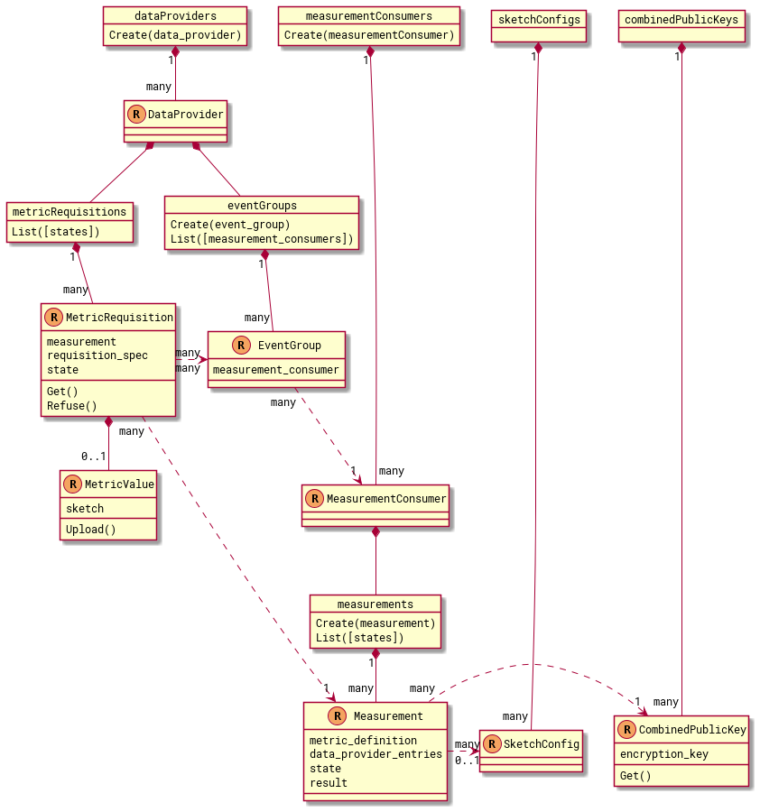

# Cross-Media Measurement External API

External API definitions for the Cross-Media Measurement system.

The API is defined as a set of [gRPC](https://grpc.io/) services using
[Protocol Buffers](https://developers.google.com/protocol-buffers/docs/overview).

## Design

This API is resource-oriented, loosely following the
[Google API Improvements Proposals](https://google.aip.dev/) (AIPs). Notable
differences from the AIPs:

1.  No HTTP annotations. These services are gRPC-only.
1.  Resource `Key` messages are used instead of
    [resource names](https://google.aip.dev/122).
1.  The [filtering language](https://google.aip.dev/160) is not used. Custom
    structured filters are used instead.

### Resource Relationships

