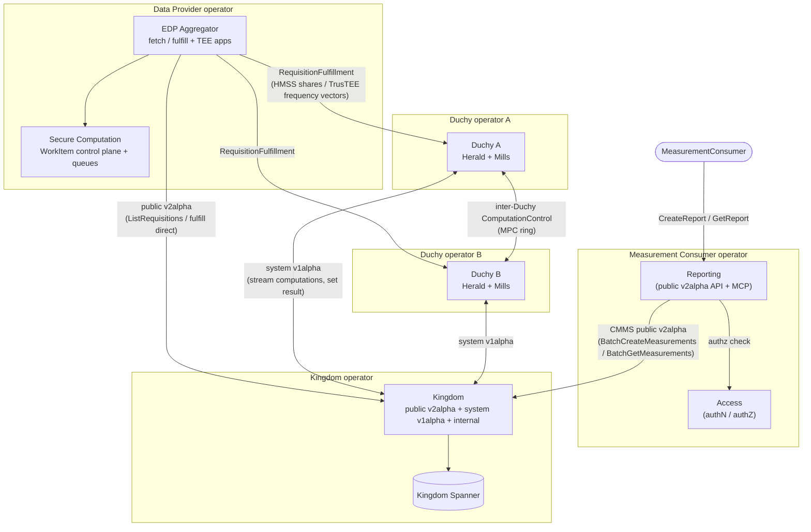

# WFA Cross-Media Measurement — Architecture Overview

The WFA Cross-Media Measurement System (CMMS) measures cross-publisher,
cross-media **reach and frequency** without any single party ever seeing another
publisher's individual-level data in the clear. It is a federation of
independently operated deployments that trust each other only over
mutually authenticated gRPC. The core privacy idea combines two techniques:
**secure multiparty computation (MPC)**, which splits the decryption capability
across two or more independent **Duchies** so that a result can only be produced
by their cooperation and none can decrypt alone; and **differential privacy
(DP)**, which injects calibrated noise into every published aggregate and charges
a per-bucket **privacy budget** so that overlapping queries cannot be
differenced to re-identify an individual. A **Kingdom** coordinates the
measurement lifecycle, **Data Providers** (typically via the **EDP Aggregator**)
fulfill the Kingdom's `Requisition`s with encrypted sketches or secret shares,
and a **Reporting** layer composes the decrypted aggregates into reports for a
**MeasurementConsumer**. This document is the front door to the architecture
docs; it links out to per-component and cross-cutting docs rather than repeating
their internals.

## High-level architecture

The diagram below shows the deployment actors and the primary flows between them.
Each actor is an independently operated deployment; all inter-deployment traffic
is mutually authenticated gRPC. For the full end-to-end walkthrough see
[Measurement Lifecycle](./crosscutting/measurement-lifecycle.md).

Two properties are worth calling out because they shape the whole system:

*   **The Kingdom is a hub that mostly gets polled.** It initiates almost no
    outbound RPCs; Duchies and EDP Aggregators stream/poll it. See
    [kingdom.md](./components/kingdom.md).
*   **Duchies form a deterministic MPC ring.** They talk to each other directly
    over the system `ComputationControl` API, and the ring order is derived
    deterministically (from public keys and the computation id) so no central
    coordination is required. See [duchy.md](./components/duchy.md) and
    [MPC & Cryptography](./crosscutting/mpc-and-cryptography.md).

## Components

Each subsystem has its own deep-dive doc under [`./components/`](./components/).
Start with the component nearest your task, then read the cross-cutting docs to
see how it fits into the whole.

| Component | Doc | Purpose |
| --- | --- | --- |
| Kingdom | [kingdom.md](./components/kingdom.md) | Central coordinator: owns the entity registry, drives the `Measurement` lifecycle state machine, tracks `Requisition`s, and coordinates the `Duchy` participants; sole owner of the Kingdom Spanner DB. |
| Duchy | [duchy.md](./components/duchy.md) | Worker node that runs the privacy-preserving measurement protocols with protocol-specific secret material, coordinated by the Kingdom. |
| EDP Aggregator | [edpaggregator.md](./components/edpaggregator.md) | Deployable `DataProvider` integration: fetches requisitions, computes frequency vectors in TEEs, fulfills results to the Kingdom/Duchies, and syncs event-group/data-availability metadata. |
| Reporting | [reporting.md](./components/reporting.md) | Product-facing layer that turns CMMS MPC measurements into reach/frequency/impression/watch-duration/population reports via a public v2alpha API, an MCP server, and post-processing jobs. |
| Secure Computation (TEE) | [securecomputation.md](./components/securecomputation.md) | Generic cloud-hosted work queue and orchestration control plane for TEE (Confidential Space) workloads: turns landed data into `WorkItem`s and dispatches them to enclave apps. |
| Access (AuthN/AuthZ) | [access.md](./components/access.md) | Authentication and authorization service for the application-layer APIs: maps caller credentials to a `Principal` and answers IAM-style permission checks. |
| Cryptographic Library (C++) | [crypto-library.md](./components/crypto-library.md) | Native C++ engine performing the per-round MPC crypto (ElGamal/Pohlig-Hellman, LLv2, RO-LLv2, HMSS, distributed DP noise), invoked by the Duchy Mill over a SWIG/JNI bridge. |
| Client & Actor Libraries | [client-libraries.md](./components/client-libraries.md) | Reusable Kotlin SDKs that CMMS actors (MeasurementConsumer, DataProvider, Population Data Provider) use to authenticate, verify/decrypt consent-signaled specs, compute results, and compute variance. |
| Event Data Provider Libraries | [event-data-provider.md](./components/event-data-provider.md) | Reusable EDP libraries to filter events, add DP noise, enforce a per-EDP privacy budget, and build/validate requisition-fulfillment wire requests. |
| Privacy Budget Manager | [privacy-budget-manager.md](./components/privacy-budget-manager.md) | Differential privacy accounting ledger an EDP consults before fulfilling a `Requisition`, tracking per-bucket ACDP budget and refusing overcharge. |
| Common & Cloud Libraries | [common-libraries.md](./components/common-libraries.md) | Shared in-repo infrastructure (gRPC interceptors/errors, mTLS identity, resource-name helpers, Kubernetes client, config loading) plus thin Google Cloud abstractions layered on `common-jvm`. |
| API & Protobuf Layer | [api-and-protos.md](./components/api-and-protos.md) | Cross-cutting protobuf/gRPC contract (public, system, internal, config/type tiers) that defines every inter-component message, service, and resource name. |

## Cross-cutting concerns

These docs under [`./crosscutting/`](./crosscutting/) trace concerns that span
multiple components. They synthesize the component docs into end-to-end
narratives and are best read after the components they reference.

| Concern | Doc | What it covers |
| --- | --- | --- |
| Measurement lifecycle | [measurement-lifecycle.md](./crosscutting/measurement-lifecycle.md) | One measurement end-to-end: MC report request → Kingdom registers the `Measurement` and derives `Requisition`s → DataProviders/EDPA fulfill → Duchies run the MPC → result returns → Reporting composes the report. Includes the `Measurement.State` and `Requisition.State` state machines. |
| MPC & cryptography | [mpc-and-cryptography.md](./crosscutting/mpc-and-cryptography.md) | The trust model, the four protocols (LLv2, RO-LLv2, HMSS, TrusTEE), the deterministic Duchy ring, and how the Kotlin Mill drives the C++ crypto over JNI. |
| Privacy | [privacy.md](./crosscutting/privacy.md) | How differential privacy is enforced end-to-end: noise injection, the ACDP/Gaussian per-bucket privacy budget charged per requisition, event filtration, and Reporting-side consistency post-processing. |
| Deployment & operations | [deployment-and-operations.md](./crosscutting/deployment-and-operations.md) | Multi-operator/multi-cloud topology, the `deploy/` common-vs-cloud convention, CUE Kubernetes manifests, cloud dependencies, the config-vs-API model, and day-2 operational procedures. |

## Glossary

| Term | Meaning |
| --- | --- |
| **Kingdom** | The single central-coordinator deployment. It configures reports, derives the requisitions and computations needed, coordinates the Duchies, and makes completed results accessible. It never holds any part of the decryption key. |
| **Duchy** | One of 2+ independently operated MPC worker deployments. For public-key MPC protocols, each participating Duchy holds a *share* of the decryption key, so all participants in that computation must cooperate to produce a result. |
| **Requisition** | The Kingdom's request to a specific `DataProvider` for the data needed to fulfill a measurement. The Kingdom tracks its state (open/fulfilled/refused); the data itself lives at a Duchy (computed) or is decrypted transiently by the EDP (direct). |
| **Sketch** | A compact, HyperLogLog-like data structure a publisher computes over its events for privacy-preserving cardinality/frequency estimation, encrypted under the Duchies' combined public key before being sent. (Newer protocols like HMSS instead send additive secret shares of a frequency vector.) |
| **MeasurementConsumer (MC)** | The advertiser/consumer that requests measurements and owns the private key that decrypts the aggregate results. |
| **DataProvider** | A publisher that supplies encrypted measurement data by fulfilling `Requisition`s. The full API term is `DataProvider`, not the abbreviation "EDP". |
| **EDP** | "Event Data Provider" — informal shorthand for a `DataProvider`, used in library/package names (e.g. the EDP Aggregator and the Event Data Provider libraries). |
| **VID** | Virtual ID — a privacy-preserving identifier assigned to impressions (via the EDPA's VID-labeling pipeline) so activity can be joined across publishers without exposing real user identifiers. |
| **MPC** | Secure multiparty computation — the protocol family (run by the Duchies) that computes an aggregate result without any party seeing the others' inputs in the clear. |
| **DP** | Differential privacy — calibrated random noise plus per-bucket privacy-budget accounting that bounds what any published aggregate can reveal about an individual. |
| **KEK / DEK** | Key Encryption Key / Data Encryption Key — the pair used in *envelope encryption*: a DEK encrypts payload data and is itself wrapped by a KEK (e.g. in a KMS). For TEE workloads the KEK unwraps a DEK only for a correctly attested enclave. |
| **TrusTEE** | A measurement *protocol* in which a single aggregator runs inside an attested Trusted Execution Environment (Confidential Space) instead of using a homomorphic key split. Distinct from the generic [Secure Computation](./components/securecomputation.md) TEE framework. |
| **Liquid Legions** | The Liquid-Legions-based reach/frequency MPC protocols (Liquid Legions V2 and Reach-Only LLv2) built on layered ElGamal + Pohlig-Hellman cryptography around the Duchy ring. |

## How to read these docs

These docs are organized **bottom-up**, and it helps to read them in that order:

1.  **[Components](./components/)** — start here. Each doc explains one subsystem
    in isolation: what it does, how it is built, what it talks to, and where its
    code lives. Read the one closest to your task first.
2.  **[Cross-cutting concerns](./crosscutting/)** — read these next. They stitch
    the components together along one axis at a time (the measurement lifecycle,
    the MPC crypto, the privacy model, deployment/operations) and defer
    per-component detail back to the component docs via links.
3.  **This overview** — the final roll-up. It gives the mission, the actor map,
    and an index into everything else. Come back here for the big picture or to
    navigate to the right deep-dive.

For canonical terminology and the original narrative walkthrough, see the
top-level [`README.md`](../../README.md).
