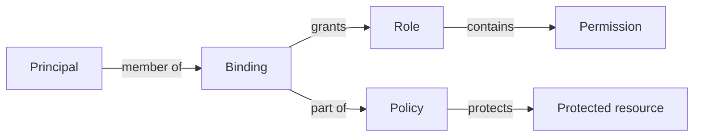
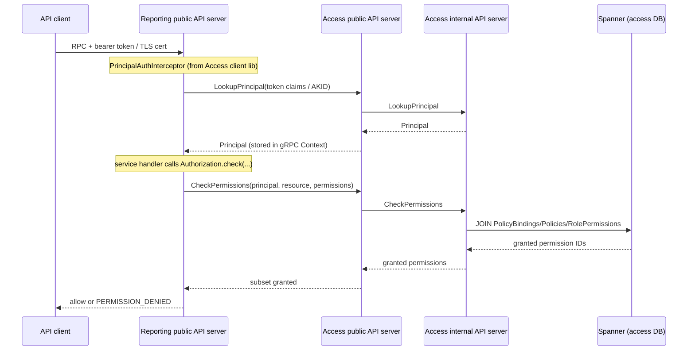

# Access (AuthN/AuthZ)

The Access subsystem is the authentication and authorization service for the
Cross-Media Measurement (CMM) system's application-layer APIs (most notably the
[Reporting](./reporting.md) API). It maps an incoming caller's credentials
(an OAuth bearer token or a mutual TLS client certificate) to a `Principal`,
and it answers the question "does this `Principal` have permission *X* on
protected resource *Y*?" using a Google IAM-style model of `Principal`, `Role`,
`Permission`, and `Policy`. It ships as two gRPC servers plus a client library
that other services embed to enforce access checks; the model is backed by a
Cloud Spanner database, with a static config file supplying the catalog of
permissions and the set of trusted TLS clients.

## Purpose and responsibilities

The subsystem provides three distinct capabilities:

*   **Authentication (AuthN).** Turn a credential (bearer JWT or TLS client
    cert) into an authenticated `Principal` identity. This is done in the
    calling service by an interceptor from the Access client library, which
    verifies the token / cert and resolves it to a `Principal` via the Access
    public API.
*   **Authorization (AuthZ).** Given a `Principal`, a set of required
    permissions, and one or more protected resources, decide whether the
    operation is allowed. This is a `CheckPermissions` RPC, evaluated against
    the `Policy` bindings stored in Spanner.
*   **Administration.** CRUD of the `Principal`, `Role`, and `Policy` resources
    (and read-only access to the `Permission` catalog) so operators can grant
    and revoke access.

An important design point: the Access servers themselves are *not* the
enforcement point for the protected APIs. Enforcement happens inside each
protected service (e.g. Reporting) via the client library. Access is the
authority that those services consult.

## The IAM-style model

The model closely follows Google Cloud IAM. Four resource types combine to
answer an authorization question:

| Concept | What it is | Where defined |
| --- | --- | --- |
| `Principal` | An API caller identity: either an OAuth user (`issuer` + `subject`) or a TLS client (authority key identifier). | `src/main/proto/wfa/measurement/access/v1alpha/principal.proto` |
| `Permission` | A single fine-grained capability (e.g. `reporting.reportingSets.get`), applicable to a set of resource types. Read-only catalog. | `src/main/proto/wfa/measurement/access/v1alpha/permission.proto` |
| `Role` | A named bundle of `Permission`s, grantable on a set of resource types. | `src/main/proto/wfa/measurement/access/v1alpha/role.proto` |
| `Policy` | The access policy for one protected resource: a set of bindings, each mapping a `Role` to a list of member `Principal`s. | `src/main/proto/wfa/measurement/access/v1alpha/policy.proto` |

A `Policy` has an optional `protected_resource` field; if empty it refers to the
root of the protected API. Each `Policy.Binding` is effectively a
`role -> members` entry, so a policy is a map of role to members on a single
resource. A `Principal` has permission *P* on resource *R* iff there exists a
`Policy` on *R* with a binding to a `Role` that includes *P*, and the
`Principal` is a member of that binding.

### Permissions are static config, not a table

Unlike the other three resources, `Permission`s are not stored in the database.
They come from a `PermissionsConfig` text-proto file
(`src/main/proto/wfa/measurement/config/access/permissions_config.proto`) loaded
at startup and held in memory by `PermissionMapping`
(`src/main/kotlin/org/wfanet/measurement/access/service/internal/PermissionMapping.kt`).
`PermissionMapping` derives a stable numeric `PermissionId` for each permission
by FarmHash-fingerprinting its resource ID (`Hashing.farmHashFingerprint64`),
and it fails fast on a fingerprint collision. Those numeric IDs are what appear
in the Spanner `RolePermissions` table, so the DB never stores permission
strings directly. The `Permissions.ListPermissions` / `GetPermission` RPCs read
from this in-memory mapping, not from Spanner.

## Where it sits in the overall system

Access sits between callers of a protected API and the protected service. Using
Reporting as the concrete example:

*   **Who calls Access:** protected API servers via the client library. The
    Reporting v2alpha public API server is the primary in-tree consumer
    (`src/main/kotlin/org/wfanet/measurement/reporting/deploy/v2/common/server/V2AlphaPublicApiServer.kt`,
    and the per-service handlers under
    `src/main/kotlin/org/wfanet/measurement/reporting/service/api/v2alpha/`).
    Operators call it via the `Access` CLI tool.
*   **What Access calls:** its own internal API server, which talks to Spanner.
*   **Credential verification** relies on primitives from the external
    `common-jvm` module (package `org.wfanet.measurement.common.grpc`):
    `OAuthTokenAuthentication`, `ClientCertificateAuthentication`, and
    `BearerTokenCallCredentials`. These are referenced by
    `PrincipalAuthInterceptor` but are not defined in this repository.

## Key modules and packages

Kotlin lives under `src/main/kotlin/org/wfanet/measurement/access/`:

| Package | Purpose |
| --- | --- |
| `client/` | The `ValueInScope` scope predicate. |
| `client/v1alpha/` | The client library other services embed: `Authorization`, `PrincipalAuthInterceptor`, `TrustedPrincipalAuthInterceptor`, `ContextKeys`. |
| `client/v1alpha/testing/` | Test doubles/matchers: `Authentication`, `PrincipalMatcher`, `PermissionMatcher`, `ProtectedResourceMatcher`. |
| `common/` | `TlsClientPrincipalMapping` — shared config-derived TLS-client-to-principal mapping. |
| `service/` | Resource keys (`PrincipalKey`, `RoleKey`, `PolicyKey`, `PermissionKey`, `IdVariable`) and public-API `Errors`. |
| `service/v1alpha/` | Public-API service implementations that translate public requests to internal requests: `PrincipalsService`, `PermissionsService`, `RolesService`, `PoliciesService`, `Services`, `ResourceConversion`. |
| `service/internal/` | Internal-API contracts: `Errors`, `Services`, `PermissionMapping`. |
| `deploy/common/server/` | `PublicApiServer` entry point. |
| `deploy/gcloud/spanner/` | Spanner-backed internal service implementations, `InternalApiServer`, `InternalApiServices`, and the `db/` DB-access layer. |
| `deploy/tools/` | The `Access` operator CLI. |

Protobuf definitions:

*   Public API: `src/main/proto/wfa/measurement/access/v1alpha/`
*   Internal API: `src/main/proto/wfa/measurement/internal/access/`
*   Config: `src/main/proto/wfa/measurement/config/access/`
    (`permissions_config.proto`, `open_id_providers_config.proto`) plus
    `src/main/proto/wfa/measurement/config/authority_key_to_principal_map.proto`

## Services and daemons

There are two gRPC servers.

### Public API server (`AccessApiServer`)

*   Entry point:
    `src/main/kotlin/org/wfanet/measurement/access/deploy/common/server/PublicApiServer.kt`.
*   Hosts the four public services (`Principals`, `Permissions`, `Roles`,
    `Policies`) wired by `service/v1alpha/Services.kt`.
*   It is a thin, cloud-agnostic layer: each public service is a client of the
    corresponding internal service over a mutual TLS channel
    (`--access-internal-api-target`). The public services validate/convert
    requests, translate resource *names* to resource *IDs*, and map internal
    error reasons to public gRPC statuses (see e.g.
    `service/v1alpha/PermissionsService.kt`).
*   Notably, this server does **not** install `PrincipalAuthInterceptor` on its
    own methods; it relies on running inside a trusted, mTLS-protected network.

### Internal API server (`AccessInternalApiServer`)

*   Entry point:
    `src/main/kotlin/org/wfanet/measurement/access/deploy/gcloud/spanner/InternalApiServer.kt`.
*   Wires the Spanner-backed services via `InternalApiServices.build(...)`:
    `SpannerPrincipalsService`, `SpannerPermissionsService`,
    `SpannerRolesService`, `SpannerPoliciesService`.
*   This is the only tier permitted to touch the database, in line with the
    project rule that database access is restricted to internal-API servers.
*   Startup loads two config files: `--permissions-config` (into
    `PermissionMapping`) and
    `--authority-key-identifier-to-principal-map-file` (into
    `TlsClientPrincipalMapping`).

## Data model and storage

The Spanner schema is defined as a Liquibase-formatted SQL changelog:
`src/main/resources/access/spanner/create-access-schema.sql`, included by
`changelog.yaml`. Tests reference the schema via `Schemata.ACCESS_CHANGELOG_PATH`
in `deploy/gcloud/spanner/testing/Schemata.kt`, which points at `changelog.yaml`;
the `.sql` file is reached through the changelog's `include` rather than being
named directly. Tables:

| Table | Purpose | Notes |
| --- | --- | --- |
| `Principals` | Every principal. | `PrincipalId INT64` PK (internal); `PrincipalResourceId STRING(63)` external ID; unique index `PrincipalsByResourceId`. |
| `UserPrincipals` | OAuth-user identity for a principal. | Interleaved in `Principals` ON DELETE CASCADE; `Issuer` + `Subject`; unique index `UserPrincipalsByClaims`. |
| `Roles` | Every role. | `RoleId INT64` PK; `RoleResourceId STRING(63)`. |
| `RoleResourceTypes` | Resource types a role may be granted on. | Interleaved in `Roles`. |
| `RolePermissions` | Permission IDs granted by a role. | `PermissionId INT64` is the fingerprint from `PermissionMapping`; interleaved in `Roles`. |
| `Policies` | Every policy. | `PolicyId INT64` PK; `PolicyResourceId STRING(63)`; `ProtectedResourceName STRING(MAX)` (empty string = API root); unique indexes on resource ID and protected-resource name. |
| `PolicyBindings` | The `(policy, role, principal)` membership triples. | Interleaved in `Policies`; FKs to `Roles` and `Principals`. |

The core authorization query lives in
`deploy/gcloud/spanner/db/Permissions.kt`. It joins
`PolicyBindings -> Policies -> RolePermissions` filtered by `PrincipalId`,
`ProtectedResourceName`, and the requested `PermissionId`s, returning the subset
of permission IDs the principal actually holds on that resource.

The project convention that DB-row serialization messages end in `Details`
does not apply here: the Access schema stores scalar columns rather than
serialized proto blobs, so there are no `*Details` messages in this subsystem.

### TLS clients are not database principals

TLS-client principals are *not* stored in Spanner. They are defined entirely by
the `AuthorityKeyToPrincipalMap` config (mapping an authority key identifier to
a `principal_resource_name`) and modeled in memory by `TlsClientPrincipalMapping`
(`common/TlsClientPrincipalMapping.kt`). It synthesizes a stable
`principalResourceId` from the protected resource name and grants that TLS
client access to two protected resources: its own protected resource name and
the API root (empty string). Consequently:

*   `SpannerPrincipalsService.lookupPrincipal` / `getPrincipal` return TLS-client
    principals from the config, bypassing the DB.
*   `SpannerPermissionsService.checkPermissions` short-circuits for TLS clients:
    it grants all requested permissions if and only if the target protected
    resource is in the client's configured set, otherwise none. TLS clients do
    not go through role/policy evaluation.
*   TLS-client principals cannot be created or deleted through the API
    (`DeletePrincipal` returns `PRINCIPAL_TYPE_NOT_SUPPORTED`).

## API surface

### Public v1alpha API (`wfa.measurement.access.v1alpha`)

gRPC-only, AIP-aligned (see
`src/main/proto/wfa/measurement/access/README.md`). Resource names use
external resource IDs (never internal DB IDs). Errors follow AIP-193 with an
`ErrorInfo` in the `access.halo-cmm.org` domain.

| Service | Methods |
| --- | --- |
| `Principals` | `GetPrincipal`, `CreatePrincipal`, `DeletePrincipal`, `LookupPrincipal` (by OAuth user or TLS client). |
| `Permissions` | `GetPermission`, `ListPermissions`, `CheckPermissions`. |
| `Roles` | `GetRole`, `ListRoles`, `CreateRole`, `UpdateRole`, `DeleteRole`. |
| `Policies` | `GetPolicy`, `CreatePolicy`, `LookupPolicy`, `AddPolicyBindingMembers`, `RemovePolicyBindingMembers`. |

`CheckPermissions` is the authorization workhorse: given a `principal`, a
`protected_resource`, and a set of `permissions`, it returns the subset of those
permissions the principal holds. Callers treat a returned subset that is
smaller than requested as a denial.

### Internal API (`wfa.measurement.internal.access`)

The same four services, but expressed in terms of internal resource IDs and
without AIP name formatting. Key differences:

*   `Principals` exposes `CreateUserPrincipal` (not `CreatePrincipal`); only
    user principals are DB-backed.
*   Requests/responses carry `*_resource_id` fields and internal page-token
    messages (e.g. `ListPermissionsPageToken`).
*   `CheckPermissions` takes `principal_resource_id`, `protected_resource_name`,
    and `permission_resource_ids`.

Error reasons are enumerated in
`service/internal/Errors.kt` (domain `internal.access.halo-cmm.org`), and the
public services map each internal reason onto a public status/reason.

### Configuration protos (not API)

Per the API-vs-config separation, static process configuration is kept in
unversioned config protos: `PermissionsConfig` (the permission catalog),
`OpenIdProvidersConfig` (expected JWT `aud` plus per-issuer JWKS), and
`AuthorityKeyToPrincipalMap` (trusted TLS clients).

## Key workflows

### 1. Authentication of an inbound call (client library)

Implemented by `PrincipalAuthInterceptor`
(`client/v1alpha/PrincipalAuthInterceptor.kt`), installed on a *protected*
service (e.g. Reporting):

1.  If a bearer token is present, verify and decode it with
    `OAuthTokenAuthentication` (audience + issuer JWKS from
    `OpenIdProvidersConfig`), producing `issuer`, `subject`, and OAuth
    `scopes`.
2.  Otherwise, if TLS clients are supported, extract the client certificate and
    its authority key identifier; scopes default to `{"*"}` (full scope).
3.  Call `Principals.LookupPrincipal` (OAuth user key or TLS-client key) to
    resolve the identity to a `Principal`; a `NOT_FOUND` becomes
    `UNAUTHENTICATED`.
4.  Store the `Principal` and scopes in the gRPC `Context` via `ContextKeys`
    (`withPrincipalAndScopes`) so downstream handlers can read them.

### 2. Authorization check inside a protected service

Handlers call `Authorization.check(...)`
(`client/v1alpha/Authorization.kt`). For example
`ReportingSetsService` declares its permission strings in a nested `Permission`
object (e.g. `reporting.reportingSets.createPrimitive`) and calls
`authorization.check(request.parent, requiredPermissions)`. The check:

1.  Reads the `Principal` from `ContextKeys` (missing → `UNAUTHENTICATED`).
2.  **Scope check.** Verifies every required permission is within the caller's
    token scopes using `ValueInScope` (dotted scopes with a trailing `*`
    wildcard; e.g. value `foo.bar` matches scopes `foo.bar`, `foo.*`, or `*`).
    A missing scope yields `PERMISSION_DENIED`.
3.  **Permission check.** Calls `Permissions.CheckPermissions` for the protected
    resource(s). If the returned granted set is smaller than required, it raises
    `PERMISSION_DENIED` naming a missing permission.
4.  When multiple protected resources are supplied (most-to-least specific), the
    checks run in parallel and short-circuit as soon as one resource grants all
    required permissions (`checkPermissionsParallel`). This supports
    "permission on the resource *or* on its parent" semantics.

The check records a duration histogram via `Instrumentation` for observability.

### 3. Evaluating `CheckPermissions` (internal server)

In `SpannerPermissionsService.checkPermissions`: validate inputs, resolve each
requested permission string to its fingerprint ID via `PermissionMapping`
(unknown → `PERMISSION_NOT_FOUND`). If the principal is a config-defined TLS
client, apply the short-circuit described above. Otherwise, look up the
`PrincipalId` and run the join query in `db/Permissions.kt` in a read-only
transaction, mapping the granted permission IDs back to resource IDs.

### 4. Trusted principal forwarding (service-to-service)

`TrustedPrincipalAuthInterceptor`
(`client/v1alpha/TrustedPrincipalAuthInterceptor.kt`) is for calls between
already-trusted services. There are two sides to this handoff:

*   **Forwarding (caller side).** A service propagates its current principal
    downstream by decorating the outbound stub with
    `AbstractStub.withForwardedTrustedCredentials()`, which serializes the
    `Principal` into a binary gRPC metadata key (`x-trusted-principal-bin`) and
    the scopes into an ASCII metadata key (`x-trusted-scopes`, a space-separated
    string). Reporting does this when relaying to internal-facing services, e.g.
    `reportsStub.withForwardedTrustedCredentials()` in `BasicReportsService.kt`
    and `metricsStub.withForwardedTrustedCredentials()` in `ReportsService.kt`.
*   **Accepting (receiving side).** The receiving service installs
    `TrustedPrincipalAuthInterceptor`, which reads that metadata (instead of
    re-verifying a credential) and installs the `Principal` and scopes into the
    gRPC `Context`. The Reporting server does this when standing up its
    in-process metrics service, e.g.
    `metricsService.withInterceptor(TrustedPrincipalAuthInterceptor)`
    (`V2AlphaPublicApiServer.kt`).

## Cryptography and privacy mechanisms

Access does not perform any of the system's MPC/HE cryptography. Its
security-relevant mechanisms are:

*   **OAuth/OIDC bearer-token verification** against configured issuer JWKS and
    an expected audience (`OpenIdProvidersConfig`), performed by common-jvm's
    `OAuthTokenAuthentication`.
*   **Mutual TLS**, both for authenticating TLS-client principals (via the
    certificate's authority key identifier) and for securing the
    public-to-internal and consumer-to-Access channels (`buildMutualTlsChannel`,
    `SigningCerts`).
*   **Least-privilege scoping** via OAuth token scopes enforced by `ValueInScope`
    on top of policy-based permissions.

Consistent with project rules, internal database IDs (`PrincipalId`, `RoleId`,
`PolicyId`, `PermissionId`) never cross the public API boundary; only resource
IDs do.

## Deployment artifacts

The subsystem builds three container images
(`src/main/docker/images.bzl`):

| Image | Repository suffix | Binary |
| --- | --- | --- |
| Public API | `access/public-api` | `deploy/common/server:PublicApiServer` |
| Internal API | `access/internal-api` | `deploy/gcloud/spanner:InternalApiServer` |
| Schema updater | `access/update-schema` | `deploy/gcloud/spanner/tools:UpdateSchema` (common-jvm's Spanner `UpdateSchema`) |

Kubernetes deployment is defined together with the Reporting stack rather than
in a standalone file: `src/main/k8s/reporting_v2.cue` declares
`access-internal-api-server` and `access-public-api-server` deployments/services,
an `update-access-schema` init container, the `access` Spanner database config,
and mounts for `permissions_config.textproto` and the AKID-to-principal map.
The public API server is exposed as an external gRPC service; the internal
server is cluster-internal. The `deploy/common/server/` split (cloud-agnostic)
vs `deploy/gcloud/spanner/` (Google Cloud-specific) follows the project's
deployment layering.

## Testing approach

*   **Internal service contract tests** are shared, storage-agnostic abstract
    test suites under
    `service/internal/testing/` (`PrincipalsServiceTest`,
    `PermissionsServiceTest`, `RolesServiceTest`, `PoliciesServiceTest`, plus
    `TestConfig`). The Spanner implementations run these against an emulator
    using the schema from `deploy/gcloud/spanner/testing/Schemata.kt`, so the
    same contract can be reused for other backends.
*   **Client-library test utilities** live in `client/v1alpha/testing/`:
    `Authentication.withPrincipalAndScopes` seeds the gRPC `Context` for tests,
    and `PrincipalMatcher` / `PermissionMatcher` / `ProtectedResourceMatcher`
    support mockable expectations against the Access stubs.
*   Consumers such as Reporting exercise the full flow through in-process
    integration tests (e.g.
    `src/main/kotlin/org/wfanet/measurement/integration/common/reporting/v2/`).

## Notable design decisions and gotchas

*   **Permissions are configuration, not data.** The permission catalog is a
    text-proto file loaded at startup, and numeric permission IDs are
    FarmHash fingerprints of resource IDs. Changing a permission's resource ID
    changes its ID and would orphan existing `RolePermissions` rows; a
    fingerprint collision is a hard startup error.
*   **TLS clients bypass the policy model.** They are defined in config and get
    all-or-nothing access to their configured protected resource plus the API
    root. They cannot be managed via the API and never appear in the DB.
*   **The Access public server does not authenticate its own callers.** It has
    no `PrincipalAuthInterceptor`; it trusts its network/mTLS boundary.
    Enforcement of the *protected* APIs is the responsibility of those services
    via the client library.
*   **Two-tier, name-vs-ID translation.** The public tier speaks AIP resource
    names; the internal tier speaks resource IDs. Every public service maps
    internal error reasons back to public statuses (`service/internal/Errors.kt`
    and the `when` blocks in each public service).
*   **`CheckPermissions` returns a subset, not a boolean.** Callers must compare
    the granted set against the required set; a smaller set means denied. The
    client library also enforces OAuth scopes *before* consulting the policy
    model, so a request can be denied on scope even if a policy would allow it.
*   **Multi-resource checks are OR semantics with short-circuit.** Passing
    resources most-to-least-specific lets a handler express "permission on the
    resource or its ancestor," and the first fully-granting resource wins.
*   **etags and optimistic concurrency.** `Role` and `Policy` mutations use
    `etag`; a mismatch yields `ETAG_MISMATCH` / `ABORTED`, so clients should
    read-modify-write.

## See also

*   [Reporting](./reporting.md) — the primary consumer of the Access client
    library.
*   Authentication primitives — the OAuth-token and TLS-client verification and
    the `BearerTokenCallCredentials` used by `PrincipalAuthInterceptor` are
    shared from the external `common-jvm` module (package
    `org.wfanet.measurement.common.grpc`); they are not defined in this
    repository.
*   Spanner access — the internal API server's DB-access layer lives under
    `src/main/kotlin/org/wfanet/measurement/access/deploy/gcloud/spanner/db/`,
    with the schema in
    `src/main/resources/access/spanner/create-access-schema.sql`.
