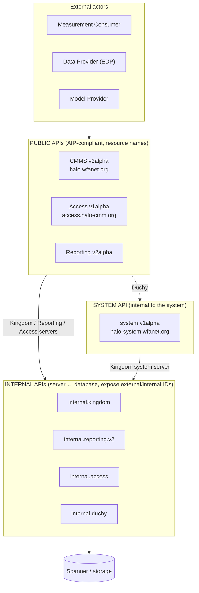
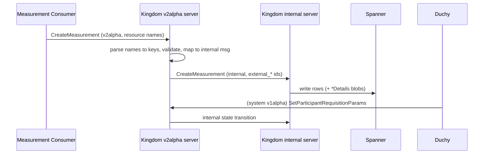

# API & Protobuf Layer

The API and protobuf layer is the contract that ties every component of the
Cross-Media Measurement (CMMS) system together. It is not a running service but a
cross-cutting set of Protocol Buffer definitions, generated gRPC stubs, and thin
Kotlin helper classes that define *what* actors may say to each other and *how*
identifiers, resources, and errors are shaped. It is organized into distinct
tiers: **public** APIs consumed by external actors (AIP-compliant, resource-name
based), an internal **system** API for Kingdom↔Duchy coordination, **internal**
APIs between servers and their databases (which expose internal IDs), plus
unversioned **config** protos for process configuration and shared **type**
protos. Understanding this layer is the fastest way to understand the whole
system, because the protos encode the domain model.

## Purpose & Responsibilities

*   Define the wire contract (messages + gRPC services) between all components.
*   Enforce a strict separation between three concentric API tiers, so that
    database internal IDs never leak outside the servers that host internal APIs.
*   Provide resource-name parsing/assembly helpers so that Kotlin code works with
    typed resource keys instead of raw strings.
*   Codify AIP compliance, field-behavior conventions, and enum/oneof design
    rules (see [docs/api-standards.md](../../api-standards.md)).
*   Separate the *versioned wire API* from *unversioned process configuration*.

## The Three Tiers (plus config & type)



| Tier | Package prefix | Resource-name domain | Callers | Exposes internal DB IDs? |
| --- | --- | --- | --- | --- |
| Public — CMMS | `wfa.measurement.api.v2alpha` | `halo.wfanet.org` | MC, EDP, Model Provider (external) | No |
| Public — Access | `wfa.measurement.access.v1alpha` | `access.halo-cmm.org` | external principals | No |
| Public — Reporting | `wfa.measurement.reporting.v2alpha` | reporting resource names | Reporting UI/clients | No |
| System | `wfa.measurement.system.v1alpha` | `halo-system.wfanet.org` | Kingdom ↔ Duchy | No (uses external IDs) |
| Internal | `wfa.measurement.internal.*` | n/a (typed fields) | server → its own DB layer | Yes (external IDs; some internal keys) |
| Config | `wfa.measurement.config.*` | n/a | process bootstrap | n/a |
| Type | `wfa.measurement.type` | n/a | annotations/shared | n/a |

### Public CMMS API — `v2alpha`

This is the primary externally facing API. A key architectural fact: **the CMMS
public `v2alpha` message and service protos are not defined in this repository.**
They live in the external Bazel module `cross-media-measurement-api` (repo name
`@wfa_measurement_proto`, pinned in `MODULE.bazel` — see the `bazel_dep` for
`cross-media-measurement-api`). This repo *re-exports* them via `alias` targets so
local code can depend on stable labels. See
`src/main/proto/wfa/measurement/api/v2alpha/BUILD.bazel`, where `MESSAGE_LIBS` and
`SERVICE_LIBS` list every aliased proto (e.g. `:measurement_proto`,
`:requisition_proto`, `:data_provider_proto`) and each `actual` points at
`@wfa_measurement_proto//src/main/proto/wfa/measurement/api/v2alpha:...`.

The public API is packaged for Maven publication as
`org.wfanet.measurement.api:v2alpha-kotlin` (messages) and
`v2alpha-grpc-kotlin` (services), and also generates Go stubs
(`cmmspb_go_proto`) plus a gRPC-gateway variant for REST transcoding of
`DataProviders` and `EventGroupMetadataDescriptors`.

The public services (from `SERVICE_LIBS`) include, among others:
`Accounts`, `ApiKeys`, `Certificates`, `ClientAccounts`, `DataProviders`,
`EventGroups`, `EventGroupActivities`, `EventGroupMetadataDescriptors`,
`Exchanges`, `ExchangeSteps`, `ExchangeStepAttempts`, `MeasurementConsumers`,
`Measurements`, `ModelLines`/`ModelOutages`/`ModelProviders`/`ModelReleases`/
`ModelRollouts`/`ModelShards`/`ModelSuites`, `Populations`, `PublicKeys`,
`Requisitions`, and `RequisitionFulfillment`.

Only a small number of `v2alpha` protos are defined *locally* in this repo under
`src/main/proto/wfa/measurement/api/v2alpha/`:

*   `page_token.proto` — server-side pagination tokens
    (e.g. `ListMeasurementsPageToken`, `ListCertificatesPageToken`,
    `ListEventGroupsPageToken`). These are serialized and base64-url-encoded into
    the `page_token` string returned to clients; they carry `external_*_id`
    fields and `PreviousPageEnd` cursors.
*   The `event_group_metadata/testing/` and `event_templates/testing/` trees —
    example/test event-template message definitions (e.g. `TestEvent`, `Person`,
    `Video`, `BannerAd`, and the `market/v1` templates) marked `testonly`.

### Access API — `access.v1alpha` (local, public)

Defined locally under `src/main/proto/wfa/measurement/access/v1alpha/`. This is a
self-contained AuthZ/AuthN public API for `Principal`, `Role`, `Policy`, and
`Permission` resources, with services `Principals`, `Roles`, `Policies`, and
`Permissions` (see `principals_service.proto`). Resource names use the
`access.halo-cmm.org` domain. Standard AIP methods are used (`GetPrincipal`,
`CreatePrincipal` with `principal,principal_id` signatures, `DeletePrincipal`),
plus a custom `LookupPrincipal` method keyed by OAuth or TLS-client identity.

### Reporting API — `reporting.v2alpha` (local, public)

Defined locally under `src/main/proto/wfa/measurement/reporting/v2alpha/`. This is
the public API of the Reporting subsystem (see [./reporting.md](./reporting.md)):
`Reports`, `ReportSchedules`, `ReportScheduleIterations`, `ReportingSets`,
`Metrics`, `MetricCalculationSpecs`, `EventGroups`, `BasicReports`, and
`ImpressionQualificationFilters`. It layers reporting concepts (metric specs,
reporting sets, impression-qualification filters) on top of raw CMMS
measurements.

### System API — `system.v1alpha`

Defined locally under `src/main/proto/wfa/measurement/system/v1alpha/`. This is
the *internal-to-the-system* API used for coordination between the **Kingdom**
and the **Duchies** — it is AIP-shaped (resource names, field behaviors) but is
not exposed to external actors. Resource names use the `halo-system.wfanet.org`
domain. Services:

| Service | File | Role |
| --- | --- | --- |
| `Computations` | `computations_service.proto` | Kingdom exposes `Computation` resources to Duchies |
| `ComputationParticipants` | `computation_participants_service.proto` | Duchies set requisition params / confirm / fail |
| `ComputationControl` | `computation_control_service.proto` | Duchy-to-Duchy stage advancement |
| `ComputationLogEntries` | `computation_log_entries_service.proto` | log/telemetry entries |
| `Requisitions` | `requisitions_service.proto` | requisition state as seen by the system |

The `Computation` resource (`computation.proto`) is the system-tier view of a
Kingdom `Measurement`: it carries a serialized public-API `MeasurementSpec`, a
`State` enum mirroring the measurement lifecycle, the `MpcProtocolConfig` (Liquid
Legions v2, Reach-Only LLv2, Honest Majority Share Shuffle, TrusTEE), and
denormalized child `ComputationParticipant`/`Requisition` resources. Methods such
as `SetParticipantRequisitionParams`, `ConfirmComputationParticipant`, and
`FailComputationParticipant` are documented as
[state-transition methods (AIP-216)](https://google.aip.dev/216) and use `etag`
for optimistic concurrency.

Note the tier boundary: system-tier messages reference other resources by
**external** IDs and resource names (e.g. `halo.wfanet.org/Certificate`), never
by database primary keys.

### Internal APIs — `internal.*`

Defined locally under `src/main/proto/wfa/measurement/internal/`. These are the
server→database contracts, one subtree per component:

| Subtree | Purpose |
| --- | --- |
| `internal/kingdom` | Kingdom persistence (largest: ~85 protos) |
| `internal/reporting/v2` | Reporting persistence + postprocessing |
| `internal/access` | Access persistence |
| `internal/duchy` (+ `config`, `protocol`) | Duchy computation state & MPC protocol messages |
| `internal/edpaggregator` | EDP aggregation metadata (impressions, requisitions, jobs) |
| `internal/securecomputation/controlplane` | work-item control plane |
| `internal/kingdom/bigquerytables` | BigQuery operational-metrics schemas |
| `internal/loadtest` | load-test result types (e.g. `test_result.proto`) |
| `internal/common` | no protos — holds shared Starlark build macros (`macros.bzl`, defining `proto_and_kt_jvm_proto_library`) reused by internal packages |

The internal tier is where **database internal IDs and external/reference IDs
coexist**. For example, `internal/kingdom/measurement.proto`'s `Measurement`
message carries `external_measurement_consumer_id`, `external_measurement_id`,
and `external_computation_id` (the `external_*` fields are the API-exposed
identifiers, per [docs/api-standards.md](../../api-standards.md)), plus `View`
enums (`DEFAULT`, `COMPUTATION`, `COMPUTATION_STATS`) that shape which child
collections are returned, and denormalized `ParentMeasurement`/`DataProviderValue`
sub-messages. Internal services are plain gRPC (no resource names): e.g.
`Measurements` in `measurements_service.proto` exposes `CreateMeasurement`,
`GetMeasurementByComputationId`, `StreamMeasurements` (streaming, cursor via a
`Filter.After` oneof), and batch methods keyed by `external_*_id` fields.

Some newer internal entities carry an explicit **resource ID** column distinct
from the DB primary key, e.g.
`internal/edpaggregator/requisition_metadata.proto`'s `RequisitionMetadata` has
both `data_provider_resource_id` and `requisition_metadata_resource_id`, matching
the guidance that resource IDs (external) and DB primary keys are separate.

### Config protos — `config.*` (unversioned)

Defined under `src/main/proto/wfa/measurement/config/`. Per
[docs/api-standards.md](../../api-standards.md) ("API vs. Configuration"), static
*process configuration* must not live in the versioned wire API; it lives here as
separate, unversioned messages. Examples:

*   `config/reporting/measurement_consumer_config.proto` —
    `MeasurementConsumerConfig`/`MeasurementConsumerConfigs`: per-MC API key,
    signing certificate resource name, private-key path, offline principal.
*   `config/access/permissions_config.proto`,
    `config/access/open_id_providers_config.proto`.
*   `config/duchy_cert_config.proto`, `config/authority_key_to_principal_map.proto`,
    `config/rate_limit_config.proto`.
*   `config/edpaggregator/*` — data-availability, event-group sync, requisition
    fetcher, storage params, VID labeling, etc.
*   `config/securecomputation/*` — data-watcher and queues config.

Config messages *reference* public-API resources by name (e.g.
`(google.api.resource_reference)` to `halo.wfanet.org/Certificate`) but are not
themselves part of any versioned API.

### Type protos — `type`

`src/main/proto/wfa/measurement/type/BUILD.bazel` aliases
`future_disposition_proto` from the external `@wfa_measurement_proto` module. The
`FutureDisposition` enum + `future_disposition` custom field option (extension of
`google.protobuf.FieldOptions`) annotates fields with their planned future
disposition (`REQUIRED`/`DEPRECATED`), supporting the API-evolution rules in the
standards.

### Other protobuf trees

Not every `.proto` under `src/main/proto/wfa/measurement/` falls into the three
tiers above (or into `config`/`type`). Several component- and tooling-specific
trees exist alongside them:

| Subtree | Package | Contents |
| --- | --- | --- |
| `privacybudgetmanager/` | `wfa.measurement.privacybudgetmanager` | Privacy Budget Manager domain messages (see [./privacy-budget-manager.md](./privacy-budget-manager.md)): `privacy_landscape.proto` (`PrivacyLandscape`), `privacy_landscape_mapping.proto` (`PrivacyLandscapeMapping`), `charges.proto` (`AcdpCharge`, `Charges`), `query.proto` (`QueryIdentifiers`, `DateRange`, `EventGroupLandscapeMask`, `Query`) |
| `eventdataprovider/shareshuffle/` | `wfa.measurement.eventdataprovider.shareshuffle` | `vid_index_map_entry.proto` (`VidIndexMapEntry`) — VID-to-index map entries for the Honest Majority Share Shuffle protocol |
| `loadtest/` (top-level, distinct from `internal/loadtest`) | `wfa.measurement.loadtest.*` | Load-test/resource-setup tooling protos: `config/loadtest_event.proto` (`LoadTestEvent`), `resourcesetup/resources.proto` and `panelmatch/resourcesetup/resources.proto` (`Resources`), plus `dataprovider/*.textproto` data-spec fixtures |
| `integration/k8s/testing/` | `wfa.measurement.integration.k8s.testing` | Kubernetes correctness-test config protos: `correctness_test_config.proto` (`CorrectnessTestConfig`), `edpa_correctness_test_config.proto` (`EdpaCorrectnessTestConfig`), `impression_test_data_config.proto` (`ImpressionTestDataConfig`) |

The `privacybudgetmanager` tree is the notable one here: it carries real domain
model (privacy landscapes, ACDP charges, and privacy-budget queries) rather than
tooling or test fixtures.

## Resource Model & Naming

The system follows [AIP](https://aip.dev/) resource naming. A resource name is a
`/`-delimited path of collection/id segments, e.g.
`measurementConsumers/{measurement_consumer}/measurements/{measurement}`.

*   **Resource IDs are external, human-oriented identifiers** conforming to
    RFC-1034 label conventions — never URIs or DB keys.
*   **Database internal IDs are never exposed** outside internal API servers. The
    internal tier uses `external_*_id` fields for the identifiers that map to API
    resource IDs.

Kotlin support lives in `src/main/kotlin/org/wfanet/measurement/api/v2alpha/` as
one `*Key.kt` class per resource (e.g. `MeasurementKey`, `DataProviderKey`,
`EventGroupKey`, `ModelLineKey`, `RequisitionKey`, and the system-tier keys under
`.../system/v1alpha/`). Each key implements the `ResourceKey` /
`ChildResourceKey` interfaces from
`src/main/kotlin/org/wfanet/measurement/common/api/ResourceKey.kt` and delegates
string parsing/assembly to a `ResourceNameParser` (from the external `common-jvm`
module). For example, `MeasurementKey`:

```kotlin
private val parser =
  ResourceNameParser("measurementConsumers/{measurement_consumer}/measurements/{measurement}")

data class MeasurementKey(val measurementConsumerId: String, val measurementId: String) :
  ChildResourceKey, RequisitionParentKey {
  override val parentKey = MeasurementConsumerKey(measurementConsumerId)
  override fun toName(): String = parser.assembleName(/* ... */)
  companion object FACTORY : ResourceKey.Factory<MeasurementKey> {
    override fun fromName(resourceName: String): MeasurementKey? = /* ... */
  }
}
```

`ResourceKey.WILDCARD_ID = "-"` supports wildcard segments. `IdVariable.kt`
enumerates the substitution variables used in the name templates. The API version
enum is `src/main/kotlin/org/wfanet/measurement/api/Version.kt`
(`V2_ALPHA("v2alpha")`), used when serializing/deserializing public-API bytes
that are stored inside internal messages (the `api_version` / `public_api_version`
fields).

## Field-Behavior & Design Conventions

These conventions (enforced by api-linter in CI and manual review) are visible
throughout the protos and documented in
[docs/api-standards.md](../../api-standards.md):

*   `[(google.api.field_behavior) = REQUIRED | IMMUTABLE | OUTPUT_ONLY]`
    annotations, applied consistently (e.g. `Computation.state` is `OUTPUT_ONLY`;
    `measurement_spec` is `REQUIRED, IMMUTABLE`).
*   `[(google.api.resource)]` on resource messages declaring `type`, `pattern`,
    `singular`, `plural`; `[(google.api.resource_reference)]` on name fields.
*   `[(google.api.method_signature)]` on RPCs for convenience client methods.
*   `etag` fields for optimistic concurrency on mutations.
*   `oneof` for mutually exclusive protocol configs (e.g. the MPC protocol oneof
    across LLv2 / RO-LLv2 / HMSS / TrusTEE); requirement documented on the oneof,
    not per-field.
*   Enums always define an `UNSPECIFIED = 0` default.
*   `reserved` directives for removed field numbers (e.g. `Filter { reserved 5, 6; }`).
*   Messages whose name ends in **`Details`** hold the serialized portion of a DB
    row, e.g. `MeasurementDetails`, `RequisitionDetails`, `CertificateDetails`
    (see `internal/kingdom/certificate_details.proto`), and nested `Details`
    messages such as `Report.ReportingMetric.Details`.
*   api-linter suppressions are inline comments of the form
    `(-- api-linter: <rule>=disabled aip.dev/not-precedent: <reason> --)` where a
    deviation is intentional (e.g. embedded/denormalized resource fields on
    `Computation`, or the custom `SetParticipantRequisitionParams` verb).

## How It Sits in the System



Public/system service *implementations* live outside this layer but consume it.
For the Kingdom, they are under
`src/main/kotlin/org/wfanet/measurement/kingdom/service/api/v2alpha/` (e.g.
`MeasurementsService.kt`, `DataProvidersService.kt`, `RequisitionsService.kt`).
A public service:

1.  Extends the generated `*CoroutineImplBase` (e.g.
    `MeasurementsGrpcKt.MeasurementsCoroutineImplBase`).
2.  Parses inbound resource names into typed `*Key` objects and authenticates the
    caller via the principal in the coroutine context.
3.  Converts public messages ⇄ internal messages (imports are aliased, e.g.
    `import ...internal.kingdom.Measurement as InternalMeasurement`).
4.  Calls the internal service stub (e.g.
    `InternalMeasurementsCoroutineStub`), which is the only tier permitted to
    touch the database.

This layered conversion is the mechanism that keeps internal DB IDs from ever
reaching external clients. See [./kingdom.md](./kingdom.md),
[./duchy.md](./duchy.md), [./reporting.md](./reporting.md), and
[./edpaggregator.md](./edpaggregator.md) for the server sides.

## Build & Codegen

BUILD files treat protos as first-class code. Per package, a `proto_library`
target is defined per `.proto` file with `strip_import_prefix = "/src/main/proto"`
and explicit `deps` (no reliance on transitive deps — see
[docs/bazel-build-standards.md](../../bazel-build-standards.md)). From those,
Kotlin/gRPC libraries are generated with rules from
`@wfa_rules_kotlin_jvm//kotlin:defs.bzl`:

*   `kt_jvm_proto_library` — message types (with the Kotlin DSL builders).
*   `kt_jvm_grpc_proto_library` — gRPC service stubs (`*CoroutineImplBase` /
    `*CoroutineStub`).
*   `go_proto_library` / `go_grpc_gateway_proto_library` — Go stubs and REST
    gateway for the public API.

External-dep annotation protos (`google/api/*`, `google/protobuf/*`,
`google/type/*`) come from `@com_google_googleapis` and `@com_google_protobuf`.
The public `v2alpha` targets are additionally published to Maven via
`maven_export` (`api_kt_jvm_proto` / `api_kt_jvm_grpc_proto`).

Key BUILD files to read:

*   `src/main/proto/wfa/measurement/api/v2alpha/BUILD.bazel` (aliases + Maven +
    Go + gateway)
*   `src/main/proto/wfa/measurement/system/v1alpha/BUILD.bazel`
*   `src/main/proto/wfa/measurement/access/v1alpha/BUILD.bazel`
*   the `internal/*` and `config/*` package BUILD files

## Testing Approach

Message and stub generation is validated by the normal `bazel build //...`.
Proto-level API compliance is checked by the api-linter workflow (see the many
inline `api-linter: ...=disabled` suppressions). Behavioral tests live in
`src/test/` mirroring `src/main/`; the API layer itself is best exercised through
the service implementations that use it, following the "test the public contract"
principle in [docs/testing-standards.md](../../testing-standards.md). Test-only
proto fixtures (the `event_templates/testing` and `event_group_metadata/testing`
trees) are marked `testonly` and used to exercise event-template handling.
Truth/ProtoTruth are the standard assertion libraries.

## Notable Design Decisions & Gotchas

*   **The public `v2alpha` API is external.** Do not look for `measurement.proto`,
    `requisition.proto`, etc. under `src/main/proto/.../api/v2alpha/` — they are
    in the `cross-media-measurement-api` module and merely aliased here. To read
    them you must fetch that dependency (they resolve under the Bazel external
    repo `@wfa_measurement_proto`). The Access and Reporting public APIs, by
    contrast, *are* defined locally.
*   **Three ID namespaces.** External *reference IDs* (from other systems),
    external *resource IDs* (API-facing, in resource names), and *internal DB
    keys* (never exposed). Internal protos use `external_*_id` for the
    API-visible IDs; DB primary keys stay in the storage layer.
*   **`Details` suffix is load-bearing.** A message named `*Details` is (or is
    part of) a serialized DB row column — not an API resource.
*   **Config ≠ API.** Anything under `config/` is unversioned process
    configuration and must not be reused as a wire message; conversion between the
    two is deliberate.
*   **Serialized public-API bytes inside lower tiers.** Internal and system
    messages often embed opaque `bytes` of a serialized public-API message (e.g.
    `measurement_spec`, `data_provider_public_key`, `encrypted_result`) tagged
    with an `api_version` string, so the storage/system tiers stay decoupled from
    the exact public schema.
*   **State-transition methods, not Update.** Lifecycle changes use explicit
    custom methods (`Confirm*`, `Fail*`, `Set*`) documented as AIP-216 transitions
    with `etag` concurrency, rather than generic `Update`.

## Where To Look

| I want… | Start here |
| --- | --- |
| Public CMMS wire contract (aliases) | `src/main/proto/wfa/measurement/api/v2alpha/BUILD.bazel` |
| Pagination token schemas | `src/main/proto/wfa/measurement/api/v2alpha/page_token.proto` |
| Kingdom↔Duchy system API | `src/main/proto/wfa/measurement/system/v1alpha/` |
| Access (AuthZ/AuthN) API | `src/main/proto/wfa/measurement/access/v1alpha/` |
| Reporting public API | `src/main/proto/wfa/measurement/reporting/v2alpha/` |
| Server↔DB internal contracts | `src/main/proto/wfa/measurement/internal/` |
| Privacy Budget Manager domain protos | `src/main/proto/wfa/measurement/privacybudgetmanager/` |
| Share-shuffle VID index map entries | `src/main/proto/wfa/measurement/eventdataprovider/shareshuffle/vid_index_map_entry.proto` |
| Load-test/resource-setup tooling protos | `src/main/proto/wfa/measurement/loadtest/` |
| K8s correctness-test configs | `src/main/proto/wfa/measurement/integration/k8s/testing/` |
| Process configuration | `src/main/proto/wfa/measurement/config/` |
| Resource-name key helpers | `src/main/kotlin/org/wfanet/measurement/api/v2alpha/*Key.kt` |
| API version handling | `src/main/kotlin/org/wfanet/measurement/api/Version.kt` |
| Public↔internal mapping example | `src/main/kotlin/org/wfanet/measurement/kingdom/service/api/v2alpha/MeasurementsService.kt` |
| The rules themselves | [docs/api-standards.md](../../api-standards.md) |
