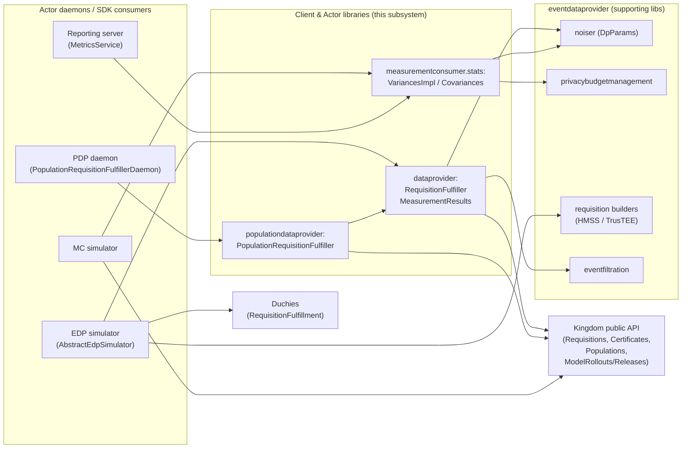
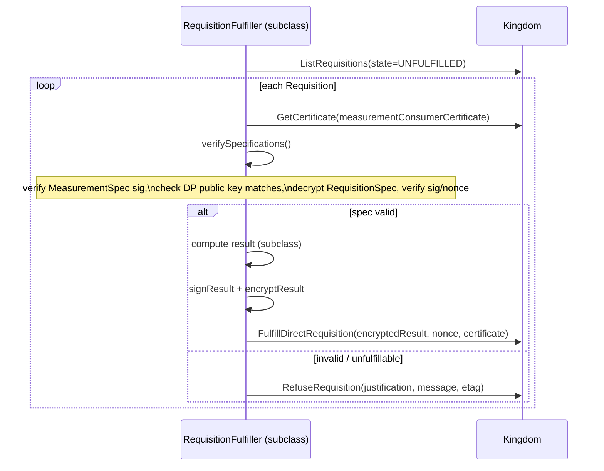

# Client & Actor Libraries

This subsystem is the set of reusable Kotlin libraries and SDKs that the
*actors* of the Cross-Media Measurement (CMMS) system use to participate in a
measurement. Three kinds of actors are covered: the **MeasurementConsumer (MC)**,
who requests measurements and needs to understand the statistical uncertainty of
the results it gets back; the **DataProvider (EDP)**, who receives
`Requisition`s from the Kingdom and fulfills them with encrypted measurement
data; and the **Population Data Provider (PDP)**, a specialized DataProvider that
answers demographic/population-sizing requisitions. These libraries handle the
shared, security-sensitive work of authenticating to the Kingdom, verifying and
decrypting consent-signaled specifications, computing raw measurement results
over event data, and (on the MC side) computing reach/frequency variance and
confidence intervals. They are *libraries*, not deployed servers: they are linked
into daemons and simulators such as the EDP simulator and the PDP daemon, and
into the Reporting server.

## Purpose & responsibilities

| Actor | Library package | Responsibility |
| --- | --- | --- |
| MeasurementConsumer | `org.wfanet.measurement.measurementconsumer.stats` | Compute variance and confidence-interval inputs for reach, frequency, impression, and watch-duration measurements/metrics across all supported protocols. |
| DataProvider | `org.wfanet.measurement.dataprovider` | Base machinery to poll for, verify, decrypt, refuse, and fulfill `Requisition`s; compute deterministic reach/frequency/impression/population results. |
| Population Data Provider | `org.wfanet.measurement.populationdataprovider` | A concrete `RequisitionFulfiller` and runnable daemon that answers `Population` measurements from a `PopulationSpec`. |

What these libraries deliberately do **not** do:

*   They do not compute confidence intervals directly. The stats library returns
    *variances*; callers combine a point estimate with `±z·√variance` (the
    reporting layer emits a `standardDeviation` derived from these variances).
*   They do not define the public API protos. All `v2alpha` message and service
    types are consumed from the external
    [`cross-media-measurement-api`](https://github.com/world-federation-of-advertisers/cross-media-measurement-api)
    repository via Bazel aliases (see [API surface](#api-surface)).
*   They do not implement the consent-signaling crypto primitives. Signing,
    verification, and envelope encryption/decryption come from the external
    `wfa_consent_signaling_client` module.

## Where it sits in the system

*   **Callers of the DataProvider libraries:** the EDP simulator
    (`AbstractEdpSimulator`, `EdpSimulator`), the PDP daemon, the EDP-aggregator
    subsystem, and reporting integration tests. See the `default_visibility` in
    `src/main/kotlin/org/wfanet/measurement/dataprovider/BUILD.bazel`.
*   **Callers of the stats library:** the Reporting server
    (`MetricsService`), the MC load-test simulator, and the Duchy mills (which
    reuse the sketch/variance math). See the consumer list under
    [Testing / consumers](#testing).
*   **Downstream services these libraries call:** the Kingdom public API
    (Requisitions, Certificates, Populations, ModelReleases, ModelRollouts — see
    the exact stubs under [API surface](#api-surface)) and, for MPC fulfillment
    by the EDP simulator, the Duchies' RequisitionFulfillment service.

For the components on the other side of these calls, see
[./kingdom.md](./kingdom.md), [./duchy.md](./duchy.md),
[./reporting.md](./reporting.md), and [./edpaggregator.md](./edpaggregator.md).

## Key modules & packages

### `measurementconsumer.stats` — statistics

Source: `src/main/kotlin/org/wfanet/measurement/measurementconsumer/stats/`.
Bazel: `src/main/kotlin/org/wfanet/measurement/measurementconsumer/stats/BUILD.bazel`.

| File | Bazel target | What it holds |
| --- | --- | --- |
| `MeasurementStatistics.kt` | `measurement_statistics` | Core param/result data classes: `NoiseMechanism`, `VidSamplingInterval`, `*MeasurementParams`, `*MeasurementVarianceParams`, `FrequencyVariances`, and `isReachTooSmallForComputingRelativeFrequencyVariance`. |
| `MetricStatistics.kt` | `metric_statistics` | The `Methodology` sealed hierarchy (`DeterministicMethodology`, `LiquidLegionsSketchMethodology`, `LiquidLegionsV2Methodology`, `HonestMajorityShareShuffleMethodology`, `CustomDirectScalarMethodology`, `CustomDirectFrequencyMethodology`) and `Weighted*MeasurementVarianceParams` / `*MetricVarianceParams`. |
| `Variances.kt` | `variances` | The `Variances` interface and `VariancesImpl` object — the public entry point. |
| `Covariances.kt` | `covariances` | `Covariances` object: covariance between two reach measurements (needed for set-expression metrics that combine measurements). |
| `LiquidLegions.kt` | `liquid_legions` | `LiquidLegionsSketchParams` and the Liquid Legions reach-covariance / frequency-variance math (uses `org.apache.commons.numbers.gamma`). |
| `FrequencyVectorBasedVariance.kt` | `honest_majority_share_shuffle` | Variance math for frequency-vector-based protocols (Honest Majority Share Shuffle). |

Notably these targets are pure-computation libraries: they depend only on
`eventdataprovider/noiser` (for `DpParams`, `GaussianNoiser`, `LaplaceNoiser`),
`eventdataprovider/privacybudgetmanagement:acdp_params_converter`, and Apache
Commons Numbers — no gRPC, no protos, no I/O.

### `dataprovider` — requisition fulfillment base

Source: `src/main/kotlin/org/wfanet/measurement/dataprovider/`.
Bazel: `src/main/kotlin/org/wfanet/measurement/dataprovider/BUILD.bazel`.

| File | Bazel target | What it holds |
| --- | --- | --- |
| `RequisitionFulfiller.kt` | `requisition_fulfiller` | `DataProviderData` (name + keys) and the abstract `RequisitionFulfiller` base class: list/verify/refuse/fulfill logic. |
| `MeasurementResults.kt` | `measurement_results` | `MeasurementResults` object: deterministic reach, reach-and-frequency, impression, and population computations over VID streams. |
| `RequisitionRefusalException.kt` | `requisition_refusal_exception` | `RequisitionRefusalException` sealed class plus `InvalidRequisitionException` and `UnfulfillableRequisitionException`. |

### `populationdataprovider` — population requisitions

Source: `src/main/kotlin/org/wfanet/measurement/populationdataprovider/`.
Bazel: `src/main/kotlin/org/wfanet/measurement/populationdataprovider/BUILD.bazel`.

| File | Bazel target | What it holds |
| --- | --- | --- |
| `PopulationRequisitionFulfiller.kt` | `population_requisition_fulfiller` | Concrete `RequisitionFulfiller` that resolves the model line → a `ModelRollout` (see the sort-order caveat under [Population requisition fulfillment](#population-requisition-fulfillment-pdp)) → `ModelRelease` → `Population` → `PopulationSpec`, then computes and fulfills the population count. |
| `PopulationRequisitionFulfillerDaemon.kt` | `population_requisition_fulfiller_daemon` + `PopulationRequisitionFulfillerDaemon` (`java_binary`) + `population_requisition_fulfiller_daemon_image` (`java_image`) | Picocli entry point that wires up TLS channels, keys, throttler, and the type registry, then loops on the fulfiller. |

## Services & daemons

These libraries expose no gRPC service of their own — they are gRPC *clients*.
The only deployable entry point in this subsystem is the PDP daemon.

### `PopulationRequisitionFulfillerDaemon`

`PopulationRequisitionFulfillerDaemon.kt` is a Picocli `Runnable`
(`main_class = org.wfanet.measurement.populationdataprovider.PopulationRequisitionFulfillerDaemonKt`).
It:

1.  Loads the PDP's consent-signaling certificate + private key
    (`--data-provider-consent-signaling-*`), its Tink encryption private keyset
    (`--data-provider-encryption-private-keyset`), and builds a
    `DataProviderData`.
2.  Builds a mutual TLS gRPC channel (`buildMutualTlsChannel`) to the Kingdom
    public API and creates coroutine stubs for Certificates, Requisitions,
    ModelRollouts, ModelReleases, and Populations.
3.  Loads one or more serialized `FileDescriptorSet`s (`--event-message-descriptor-set`)
    and resolves the event message descriptor by type URL
    (`--event-message-type-url`) — this defines the demographic attributes the
    PDP understands.
4.  Constructs a `MinimumIntervalThrottler` (`--throttler-minimum-interval`,
    default `2s`) and runs `PopulationRequisitionFulfiller.run()` inside
    `runBlocking` (the only place `runBlocking` is allowed — a `main` entry
    point).

The EDP-side counterpart daemons (`EdpSimulatorRunner`,
`LegacyMetadataEdpSimulatorRunner`) live under `loadtest/dataprovider` and are
covered as usage examples below rather than as part of the reusable library.

## Data model & storage

This subsystem is **stateless**: it owns no Spanner tables and no blob storage.
It operates purely on:

*   **Public API protos** received from / sent to the Kingdom: `Requisition`,
    `MeasurementSpec`, `RequisitionSpec`, `Measurement.Result`, `Certificate`,
    `Population`, `PopulationSpec`, `ModelRelease`, `ModelRollout`,
    `EncryptedMessage`, `SignedMessage`, `EncryptionPublicKey`.
*   **Key material** held in memory as `PrivateKeyHandle` (Tink) and
    `SigningKeyHandle`, packaged in `DataProviderData`.
*   **In-memory statistical params** (the `stats` data classes) with no
    persistence.

There are therefore no `*Details` DB-row protos in scope for this subsystem
(that convention applies to the internal API servers that own storage). Any
persistence (privacy-budget ledgers, requisition metadata) belongs to the EDP
simulator/aggregator or the Kingdom, not these libraries.

## API surface

### Public v2alpha (external repo)

All public API types used here are **not defined in this repository**. The Bazel
targets `//src/main/proto/wfa/measurement/api/v2alpha:*` are aliases to
`@wfa_measurement_proto//src/main/proto/wfa/measurement/api/v2alpha:*` — see the
`alias` rules in `src/main/proto/wfa/measurement/api/v2alpha/BUILD.bazel` and the
`wfa_measurement_proto` module in `MODULE.bazel`. This keeps the client
libraries decoupled from the versioned API's build, and is why you will not find
`requisition.proto` or `population.proto` under `src/main/proto` locally.

Kingdom public services these libraries call (as gRPC coroutine stubs):

*   `RequisitionsCoroutineStub` — `ListRequisitions`, `RefuseRequisition`,
    `FulfillDirectRequisition`.
*   `CertificatesCoroutineStub` — `GetCertificate`.
*   `PopulationsCoroutineStub`, `ModelReleasesCoroutineStub`,
    `ModelRolloutsCoroutineStub` (PDP only).

### Internal / system APIs

None. These are actor libraries; they use only the public v2alpha API and never
touch internal Kingdom/Duchy APIs or the database. Database internal IDs are
never exposed to or handled by this subsystem.

## Key workflows

### DataProvider requisition fulfillment (base flow)

Implemented in `RequisitionFulfiller` and specialized by subclasses.

Key steps inside `verifySpecifications` (`RequisitionFulfiller.kt`):

1.  Read the MC's `X509Certificate`; look up its trusted issuer via
    `authorityKeyIdentifier` in `trustedCertificates`. Unknown issuer →
    `InvalidConsentSignalException`.
2.  `verifyMeasurementSpec` against the MC cert + trusted issuer (from the
    consent-signaling client).
3.  Confirm the requisition's `dataProviderPublicKey` matches this DP's private
    key (`privateEncryptionKey.publicKey.toEncryptionPublicKey()`).
4.  `decryptRequisitionSpec` with the DP's `PrivateKeyHandle`, then
    `verifyRequisitionSpec` (checks signature, nonce, and MC public key). Nonce
    or public-key mismatches map to `InvalidConsentSignalException`.

`fulfillDirectMeasurement` signs the `Measurement.Result` with the DP's
`signingKeyHandle`, encrypts it to the measurement's encryption public key, and
calls `FulfillDirectRequisition`. (This is the *direct* path; MPC fulfillment via
the Duchies is implemented by the EDP simulator subclass, not the base library.)

`StatusException` from every RPC is caught immediately at the call site and
re-wrapped, per the project's gRPC error-handling rule.

### Population requisition fulfillment (PDP)

`PopulationRequisitionFulfiller.executeRequisitionFulfillingWorkflow`
(overrides the base) does the base verification, then:

1.  `getModelRelease(measurementSpec.modelLine)` — lists `ModelRollout`s for the
    model line, sorts by rollout date (gradual end-date or instant date), takes
    the first entry, and fetches its `ModelRelease`. Note: the comparator returns
    `-1` when `aDate.isBefore(bDate)` (ascending order) and the code then calls
    `.first()`, so this actually selects the *earliest* rollout — despite the
    local being named `latestModelRollout` and a stale comment claiming a
    "descending updateTime" sort. This mismatch looks like a latent bug; see the
    TODO on model outages in `PopulationRequisitionFulfiller.kt`.
2.  `getPopulation(modelRelease.population)` — validates the `Population` belongs
    to this PDP (`PopulationKey.parentKey == dataProviderData.name`) and fetches
    it.
3.  Validates the `PopulationSpec` with `PopulationSpecValidator.validate`
    against the configured event message descriptor.
4.  `MeasurementResults.computePopulation(populationSpec, filterExpression, descriptor)`
    compiles the requisition's CEL filter, matches it against each
    sub-population's attributes, and sums the sizes of matching VID ranges.
5.  Wraps the count in a `Measurement.Result.Population` with
    `DeterministicCount` and calls `fulfillDirectMeasurement`.

Error mapping is precise: NOT_FOUND populations/model releases become
`UnfulfillableRequisitionException` / `InvalidRequisitionException`; invalid CEL
filters become `InvalidRequisitionException`; verification failures become a
`CONSENT_SIGNAL_INVALID` refusal.

### Deterministic result computation (`MeasurementResults`)

`MeasurementResults` provides the "no MPC" reference computations over a stream,
sequence, or iterable of VIDs:

*   `computeReach` — distinct VID count.
*   `computeReachAndFrequency(vids, maxFrequency)` — distinct count plus a
    capped relative-frequency histogram (`ReachAndFrequency`).
*   `computeImpression(vids, maxFrequency)` — sum of per-VID counts capped at
    `maxFrequency`.
*   `computePopulation(populationSpec, filter, descriptor)` — CEL-filtered
    demographic sizing used by the PDP.

### MeasurementConsumer variance / confidence interval

`VariancesImpl` (the `Variances` interface impl) is the MC-side entry point.

*   `computeMeasurementVariance(methodology, params)` — variance of a single
    measurement, dispatched over the `Methodology` sealed type. Each protocol has
    its own math: deterministic (`computeDeterministicVariance`), Liquid Legions
    sketch and V2 (`LiquidLegions.inflatedReachCovariance` /
    `liquidLegionsFrequencyRelativeVariance`), and Honest Majority Share Shuffle
    (`FrequencyVectorBasedVariance`). `CustomDirect*Methodology` supplies
    caller-provided variances directly.
*   `computeMetricVariance(params)` — variance of a *metric* built from weighted
    measurements. For reach it sums `weightᵢ²·varᵢ` plus
    `2·weightᵢ·weightⱼ·cov(i,j)`, using `Covariances.computeMeasurementCovariance`
    and each measurement's `binaryRepresentation` to locate the union
    measurement. Frequency/impression/watch-duration metrics currently require a
    single (union-only) measurement.
*   Noise variance is derived from `DpParams` and `NoiseMechanism`: LAPLACE/
    GAUSSIAN direct noise via the noisers, and distributed Gaussian via
    `AcdpParamsConverter.computeMpcSigmaDistributedDiscreteGaussian` (Laplace is
    rejected for distributed noise).

The library returns *variances*; the reporting layer converts them to a
`standardDeviation` on `univariateStatistics` (see `MetricsService.kt`), and
`isReachTooSmallForComputingRelativeFrequencyVariance` guards against
relative-frequency estimates when the reach confidence interval covers zero.

## Cryptography / privacy mechanisms

*   **Consent signaling.** Signature verification of `MeasurementSpec` /
    `RequisitionSpec` and result signing/encryption use the external
    `wfa_consent_signaling_client` (`consent.client.dataprovider`:
    `verifyMeasurementSpec`, `verifyRequisitionSpec`, `decryptRequisitionSpec`,
    `signResult`, `encryptResult`). Trust is anchored on a
    `Map<ByteString, X509Certificate>` of trusted issuer certs keyed by authority
    key identifier.
*   **Envelope encryption / key handling.** DP keys are Tink `PrivateKeyHandle`
    (encryption) and `SigningKeyHandle` (consent signing), loaded at the daemon
    boundary (`loadPrivateKey`, `readPrivateKey`, `readCertificate`) and passed
    as primitives inside `DataProviderData` — raw key bytes are not handled by
    library code, per the security standards.
*   **Differential privacy.** Variance math accounts for the DP noise added by
    the measurement system. `DpParams(epsilon, delta)` feeds `GaussianNoiser` /
    `LaplaceNoiser` (direct) and the ACDP converter (distributed), so the MC can
    quantify the uncertainty the noise introduces.
*   **VID sampling.** Variances incorporate the `VidSamplingInterval.width`,
    reflecting that only a sampled fraction of the VID universe is measured.

## Deployment artifacts

*   **PDP daemon image.** `population_requisition_fulfiller_daemon_image`
    (`java_image` in the PDP `BUILD.bazel`) packages the daemon for Kubernetes;
    it is exposed to `//src:docker_image_deployment`. The daemon is
    cloud-agnostic — it talks only to the Kingdom public API over mTLS and reads
    keys/descriptors from files, so it can run in any environment that provides
    those inputs.
*   **stats / dataprovider libraries** produce no images; they are linked into
    other components' binaries (Reporting server, EDP simulator, EDP-aggregator).

Cloud-specific vs. cloud-agnostic deployment configuration lives under the
respective components' `deploy/` trees (e.g. the Kingdom and Reporting servers),
not in this subsystem. For deploying the PDP daemon specifically, see
[../../gke/population-requisition-fulfiller-deployment.md](../../gke/population-requisition-fulfiller-deployment.md).

## Testing

*   **Stats:** `src/test/kotlin/org/wfanet/measurement/measurementconsumer/stats/`
    contains `VariancesTest.kt` and `CovariancesTest.kt` — unit tests over the
    public `VariancesImpl` / `Covariances` API for each methodology.
*   **DataProvider:**
    `src/test/kotlin/org/wfanet/measurement/dataprovider/MeasurementResultsTest.kt`
    tests the deterministic result computations.
*   **End-to-end / usage examples (load tests):** the EDP simulator tests
    (`EdpSimulatorTest.kt`, `AbstractEdpSimulatorTest.kt`,
    `LegacyMetadataEdpSimulatorTest.kt` under
    `src/test/kotlin/org/wfanet/measurement/loadtest/dataprovider/`) exercise the
    `RequisitionFulfiller` base through concrete simulators. These simulators
    (`AbstractEdpSimulator` extends `RequisitionFulfiller`) are the canonical
    reference for how a real EDP fulfills each protocol — direct, Liquid Legions
    V2, Reach-Only Liquid Legions V2, Honest Majority Share Shuffle, and
    TrusTEE — and how it encrypts requisition data for the Duchies.
*   **MC usage example:** `MeasurementConsumerSimulator` (under
    `loadtest/measurementconsumer`) creates measurements against the Kingdom and
    calls `VariancesImpl.computeMeasurementVariance` to validate result accuracy.

Consumers of the stats library beyond load tests include the Reporting server
(`MetricsService.kt`, `ProtoConversions.kt`, `ReportSchedulingJobExecutor.kt`,
`BasicReportsReportsJobExecutor.kt`) and the Duchy mills
(`ReachFrequencyLiquidLegionsV2Mill`, `ReachOnlyLiquidLegionsV2Mill`,
`HonestMajorityShareShuffleMill`, `TrusTeeProcessorImpl`), confirming the math is
shared across MC, reporting, and Duchy code paths.

## Notable design decisions & gotchas

*   **Libraries, not servers.** Only the PDP has a daemon here. The DP and MC
    "SDK" surfaces are base classes and objects meant to be embedded; the real
    EDP fulfillment logic (MPC protocols, privacy budgeting, event querying)
    lives in the load-test simulators and the EDP-aggregator, which extend these
    bases.
*   **Public protos are external.** `v2alpha` types come from
    `@wfa_measurement_proto`; expect to jump to the API repo to read message
    definitions.
*   **Variance ≠ confidence interval.** The stats library returns variances;
    confidence intervals/std-dev are assembled by callers (reporting), so search
    there for the interval bounds.
*   **Methodology dispatch is exhaustive.** `computeMeasurementVariance` uses
    exhaustive `when` over the `Methodology` sealed hierarchy — adding a new
    protocol forces every dispatch site to be updated (a deliberate compile-time
    safety net). Frequency/impression/watch-duration *metric* variance only
    supports single, union-only measurements today and will throw otherwise.
*   **Distributed noise is Gaussian-only.** `computeDistributedNoiseVariance`
    errors on `LAPLACE`; distributed protocols must use Gaussian.
*   **Refusal justifications are typed.** `RequisitionRefusalException` subtypes
    (`InvalidRequisitionException` → `SPEC_INVALID`,
    `UnfulfillableRequisitionException` → `UNFULFILLABLE`, and a `Test` variant
    that suppresses warning logs) drive the `RefuseRequisition` justification,
    keeping refusal reasons consistent.
*   **Known TODOs in scope.** `RequisitionFulfiller` notes that ABORT on
    refuse/fulfill should be handled by re-reading the requisition
    (`cross-media-measurement#2374`), and that the collection interval is not yet
    validated against the privacy landscape. The PDP has a TODO to verify the DP
    public key against a real key store and to handle model outages via a
    holdback model line.
