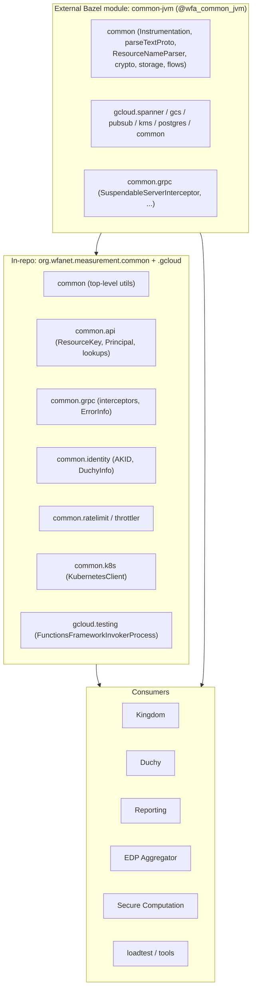
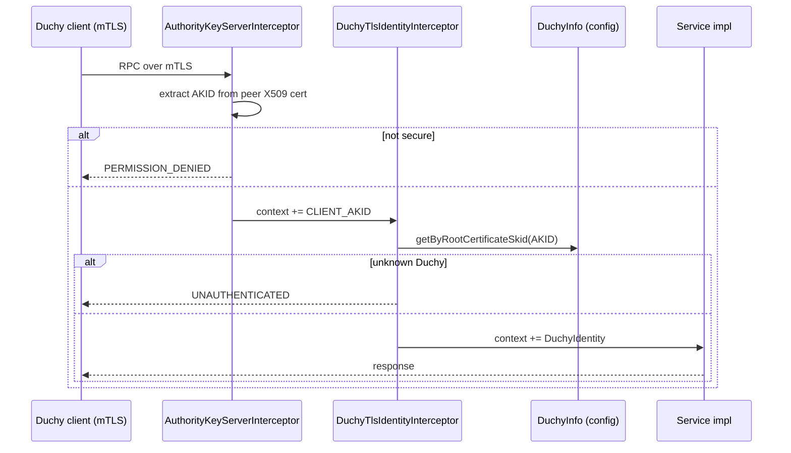
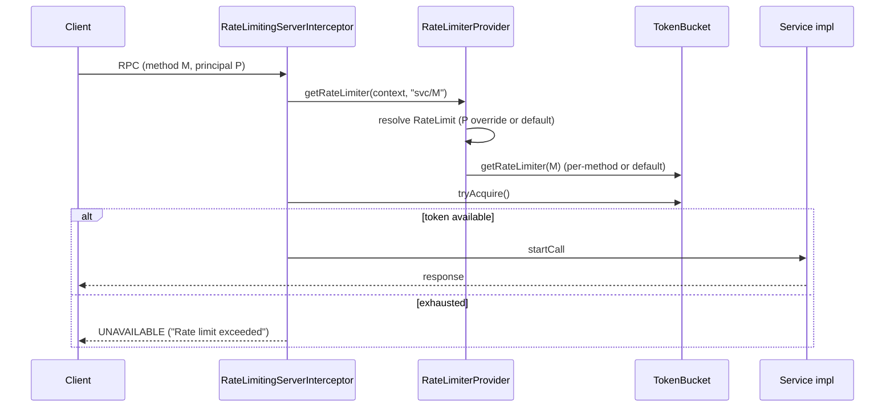

# Common & Cloud Libraries

The Common & Cloud Libraries are the shared infrastructure that nearly every
other subsystem in the WFA Cross-Media Measurement (CMMS) system builds on:
gRPC interceptor and error helpers, identity/authentication primitives, resource
name and API helpers, rate limiting and throttling, media-type conversion,
Kubernetes client helpers, CLI tooling, and the Google Cloud abstractions
(Spanner, Cloud Storage, Pub/Sub, KMS, Postgres). A critical thing to know up
front: most of the truly generic pieces live in a *separate* Bazel module,
`common-jvm` (`@wfa_common_jvm`), which this repo depends on. The
`org.wfanet.measurement.common` and `org.wfanet.measurement.gcloud` packages
*inside this repo* hold only the CMMS-specific shared code that has not (or not
yet) been promoted to `common-jvm`.

## Purpose & Responsibilities

This subsystem provides cross-cutting utilities so that the Kingdom, Duchies,
Data Providers, Reporting, EDP Aggregator, and Secure Computation subsystems do
not each reinvent the same infrastructure. Concretely, the in-repo portion
covers:

*   **gRPC plumbing** — server interceptors for authentication, rate limiting,
    and API-change metrics; helpers to attach interceptors to services; error
    detail (`ErrorInfo`) packing/unpacking; a Picocli flag set for the gRPC
    thread pool.
*   **Identity & authentication** — extracting the Authority Key Identifier
    (AKID) from client mTLS certificates, mapping AKIDs to principals, and Duchy
    identity resolution.
*   **API / resource-name helpers** — the `ResourceKey` abstraction, resource-ID
    regexes (AIP-122 / RFC-1034), ETag computation, and generic paginated
    List-method iteration.
*   **Rate limiting & throttling** — a token-bucket `RateLimiter` and a
    config-driven provider that wires it into gRPC.
*   **Media types** — conversion between the Reporting and event-annotation
    `MediaType` enums.
*   **Kubernetes helpers** — a coroutine-friendly Kubernetes API client used by
    operational/loadtest tooling.
*   **Misc utilities** — health signalling, ID generation, protobuf
    parsing/timestamps, string templating, bitwise `ByteString` ops, sorted-list
    binary search, and EDP-Aggregator config loading.
*   **CLI tooling** — the `OpenIdProvider` test/fixture CLI.

The heavy generic machinery — Tink crypto, storage clients, `Instrumentation`
(OpenTelemetry), `commandLineMain`, `parseTextProto`, `ResourceNameParser`,
coroutine/flow helpers, and the entire Google Cloud SDK wrapper layer — comes
from `common-jvm`.

## The `common` Directory Convention

Per [`AGENTS.md`](../../../AGENTS.md), a `common/` directory holds code shared
across *sibling* packages under the same parent. `//foo/common` is used by
`//foo/bar` and `//foo/baz`, but never by `//bar`. The top-level
`//src/main/kotlin/org/wfanet/measurement/common` package is therefore the code
shared across *all* CMMS subsystems (kingdom, duchy, reporting, etc.), while a
package like `//reporting/deploy/v2/common` is shared only within Reporting's
deploy tree.

This convention also drives *where the code lives at all*: anything generic
enough to be useful outside CMMS is expected to migrate to `common-jvm`. Several
files carry explicit `TODO(...): Move this to common-jvm.` markers
(`Flows.kt`, `SortedLists.kt`, `grpc/Context.kt`, `grpc/BUILD.bazel`,
`identity/BUILD.bazel`), signalling code that is currently in-repo but
destined for the shared module.

## Where It Sits in the System

*   **Who calls it:** essentially every runnable component. For example,
    `org.wfanet.measurement.gcloud.spanner` alone is imported 500+ times across
    `src/main/kotlin`.
*   **What it calls:** the JDK, gRPC-Java, Kotlin coroutines, protobuf, the
    Kubernetes Java client, and — for anything non-trivial — `common-jvm`.

See the sibling component docs that it underpins: [`./kingdom.md`](./kingdom.md),
[`./duchy.md`](./duchy.md), [`./reporting.md`](./reporting.md),
[`./edpaggregator.md`](./edpaggregator.md), and
[`./securecomputation.md`](./securecomputation.md). Cross-cutting topics are in
[`../crosscutting/`](../crosscutting/).

## Key Modules & Packages

All paths below are under
`src/main/kotlin/org/wfanet/measurement/` unless noted.

| Package | Purpose | Notable files |
| --- | --- | --- |
| `common` (top-level) | General-purpose utilities | `Health.kt`, `IdGenerator.kt`, `Timestamps.kt`, `ProtobufMessages.kt`, `FillableTemplate.kt`, `Flows.kt`, `SortedLists.kt`, `BitwiseOperations.kt`, `EnvVars.kt` |
| `common/api` | Resource-name / principal abstractions | `ResourceKey.kt`, `Principal.kt`, `ResourceNameLookup.kt`, `ResourceKeyLookup.kt`, `MemoizingPrincipalLookup.kt`, `AkidConfigResourceNameLookup.kt`, `AkidConfigPrincipalLookup.kt`, `ResourceIds.kt`, `ETags.kt` |
| `common/api/grpc` | API-level gRPC helpers | `AkidPrincipalServerInterceptor.kt`, `ListResources.kt` |
| `common/grpc` | Server plumbing & errors | `Interceptors.kt`, `ErrorInfo.kt`, `Context.kt`, `ServiceFlags.kt`, `RateLimitingServerInterceptor.kt`, `RateLimiterProvider.kt`, `ApiChangeMetricsInterceptor.kt` |
| `common/identity` | mTLS / Duchy identity | `AuthorityKeyServerInterceptor.kt`, `DuchyIdentity.kt`, `DuchyInfo.kt`, `PrincipalIdentity.kt` (`testonly`) |
| `common/ratelimit` | Rate limiting | `RateLimiter.kt`, `TokenBucket.kt` |
| `common/throttler` | Throttling | `MaximumRateThrottler.kt` |
| `common/mediatype` | Enum conversion | `MediaType.kt` |
| `common/k8s` | Kubernetes client | `KubernetesClient.kt`, `Names.kt`, `JsonPatchOperation.kt` |
| `common/edpaggregator` | EDPA config loading | `EdpAggregatorConfig.kt`, `BlobLoader.kt` |
| `common/tools` | CLI tooling | `OpenIdProvider.kt` |
| `gcloud/testing` | Cloud Functions test harness | `FunctionsFrameworkInvokerProcess.kt` |

### Top-level utilities

*   **Health signalling** — `common/Health.kt` defines the `Health` interface
    plus `SettableHealth` and `FileExistsHealth`. `FileExistsHealth` tracks
    health via the existence of a file (a common Kubernetes liveness pattern),
    and `waitUntilHealthy()` suspends on a `MutableStateFlow` until healthy.
*   **ID generation** — `common/IdGenerator.kt` defines the `IdGenerator`
    functional interface (returns a non-zero `Long`), a `RandomIdGenerator`
    default, and `generateNewId { ... }` helpers that retry until an unused ID is
    found. Wrappers `generateNewInternalId` / `generateNewExternalId` bridge to
    the `common-jvm` identity `IdGenerator` producing `InternalId` / `ExternalId`
    values.
*   **Protobuf helpers** — `common/ProtobufMessages.kt` (`parseMessage`)
    autodetects binary / JSON / text-proto format by file extension then content
    type; `common/Timestamps.kt` converts between `com.google.type.DateTime`/
    `Date` and `java.time` / `Timestamp`.
*   **Other** — `FillableTemplate.kt` is a `{{placeholder}}` string templater;
    `Flows.kt` adds `Flow.singleOrNullIfEmpty()`; `SortedLists.kt` provides
    `lowerBound`/`upperBound` binary searches; `BitwiseOperations.kt` adds
    `ByteString xor ByteString`; `EnvVars.kt` validates required environment
    variables.

### `common.api` — resource names & principals

The API package is deliberately small and interface-heavy so subsystems can
plug in their own resource types:

*   `ResourceKey` — an interface with `toName()` and a `Factory.fromName()`;
    `ChildResourceKey` adds a `parentKey`. `WILDCARD_ID = "-"`.
*   `Principal` / `ResourcePrincipal` / `PrincipalLookup<T, K>` — the identity
    abstraction. `MemoizingPrincipalLookup` caches lookups in a
    `ConcurrentHashMap<K, Deferred<T?>>` so concurrent callers share one lookup.
*   `ResourceNameLookup<K>` / `ResourceKeyLookup<K>` — map a lookup key to a
    resource name / `ResourceKey`. `AkidConfigResourceNameLookup` implements
    this over an `AuthorityKeyToPrincipalMap` config proto, keyed by the client
    certificate's AKID (`ByteString`).
*   `ResourceIds` — `AIP_122_REGEX` and `RFC_1034_REGEX` for validating resource
    IDs (see [`docs/api-standards.md`](../../api-standards.md)).
*   `ETags` — computes an RFC 7232 weak entity tag from an update timestamp via
    `Hashing.hashSha256` (from `common-jvm`).

### `common.grpc` — interceptors & errors

*   `Interceptors` — extension functions
    `BindableService.withInterceptor(s)` / `ServerServiceDefinition.withInterceptor`
    that wrap services, plus OpenTelemetry histograms recording interceptor
    execution duration (via `common-jvm`'s `Instrumentation`).
*   `ErrorInfo` — packs/unpacks a `com.google.rpc.ErrorInfo` into gRPC status
    details. `Errors.buildStatusRuntimeException(...)` builds a
    `StatusRuntimeException` carrying structured `ErrorInfo`, and the
    `StatusException.errorInfo` / `StatusRuntimeException.errorInfo` extension
    properties read it back. This is how services return machine-readable error
    reasons.
*   `Context.kt` — `withContext(context) { ... }` attaches/detaches a gRPC
    `Context` around a block (coroutine-friendly `Context.call`).
*   `ServiceFlags` — a Picocli `--grpc-thread-pool-size` flag exposing a lazily
    built, instrumented `ThreadPoolExecutor` for gRPC services (default: number
    of cores, min 2).

### `common.identity` — mTLS authentication

Authentication in the CMMS internal/system APIs is mTLS-based. Two interceptors
cooperate:

1.  `AuthorityKeyServerInterceptor` pulls the peer `X509Certificate` from the
    TLS session, extracts its AKID (via `common-jvm`'s
    `X509Certificate.authorityKeyIdentifier`), and stashes it in
    `CLIENT_AUTHORITY_KEY_IDENTIFIER_CONTEXT_KEY`. It fails the call with
    `PERMISSION_DENIED` if the connection is not secure.
2.  `DuchyTlsIdentityInterceptor` (in `DuchyIdentity.kt`) resolves that AKID to
    a Duchy via `DuchyInfo.getByRootCertificateSkid`, then puts a
    `DuchyIdentity` in the context (`DUCHY_IDENTITY_CONTEXT_KEY`), failing with
    `UNAUTHENTICATED` if unknown.

`BindableService.withDuchyIdentities()` installs both in the correct order.
`DuchyInfo` is a process-global registry loaded from a `DuchyCertConfig` text
proto (via `--duchy-info-config`), mapping Duchy IDs to cert host and root
certificate subject key ID. The client-side helper `Stub.withDuchyId(id)`
attaches the `duchy-identity` metadata header, and `Stub.withPrincipalName(name)`
(in the `testonly` `PrincipalIdentity.kt`) attaches trusted principal
credentials for testing.

### Rate limiting & throttling

*   `ratelimit/RateLimiter.kt` — the `RateLimiter` interface (`tryAcquire` /
    suspend `acquire`), plus `Unlimited` and `Blocked` singletons and a
    `withPermits { }` helper.
*   `ratelimit/TokenBucket.kt` — a token-bucket implementation. `tryAcquire`
    refills based on elapsed monotonic time and atomically consumes tokens;
    `acquire` enqueues FIFO `Acquirer`s that are released as tokens refill. It
    guards against a non-monotonic time source.
*   `throttler/MaximumRateThrottler.kt` — a `Throttler` (interface from
    `common-jvm`) backed by a size-1 `TokenBucket`, allowing concurrent
    executions capped at a max rate.

### Kubernetes helpers

`common/k8s/KubernetesClient.kt` wraps the Kubernetes Java client
(`io.kubernetes.client`) behind a coroutine-friendly `KubernetesClient`
interface. It:

*   Adapts the client's async `ApiCallback` API to `suspend` functions via
    `suspendCoroutine` (`CoroutineApiCallback`).
*   Exposes a deliberately narrow, per-resource surface: Deployments are
    get-only (`getDeployment`, plus `getNewReplicaSet` for a Deployment's current
    `V1ReplicaSet`); Pods are list-only (`listPods`); Jobs have
    create/list/delete (`createJob`, `listJobs`, `deleteJob`); PodTemplates are
    get-only (`getPodTemplate`). It also provides `waitUntilDeploymentComplete`
    and `waitForServiceAccount`, implemented as `Watch`-backed `Flow`s (there is
    no generic get/list/create/delete for ServiceAccounts — only the wait
    helper).
*   Provides blocking `kubectlApply` variants and `PropagationPolicy`.
*   `Names.kt` generates Kubernetes-style random name suffixes;
    `JsonPatchOperation.kt` models JSON Patch `add`/`replace` operations.

This is used mainly by operational and load-test tooling, not by the online
serving path.

## Services & Daemons

This subsystem is a **library layer**, not a set of long-running services; it has
no gRPC service definitions or server `main` entry points of its own. Its code
runs *inside* other components' servers and daemons. The two runnable/executable
pieces are:

*   **`common/tools/OpenIdProvider.kt`** — a Picocli CLI (`OpenIdProvider`) that
    acts as a fake OpenID Connect provider for testing the Access-protected APIs.
    Subcommands: `get-jwks` (prints the JWKS for an `OpenIdProvidersConfig`) and
    `generate-access-token` (mints a signed JWT). It loads a Tink keyset in
    binary format and delegates to `common-jvm`'s
    `common.grpc.testing.OpenIdProvider`. See
    `common/tools/README.md`.
*   **`gcloud/testing/FunctionsFrameworkInvokerProcess.kt`** (`testonly`) — a
    test harness that launches a Google Cloud Functions Framework invoker as a
    child process, waits for its "Serving function..." readiness line, and
    exposes the local HTTP port. Used by EDP Aggregator / Secure Computation
    integration tests that exercise Cloud Functions.

## Data Model & Storage

This layer defines no Spanner tables and owns no persistent storage. It provides
the *abstractions* others use for storage:

*   **Config protos** it consumes (defined under `src/main/proto/wfa/measurement`):
    *   `RateLimitConfig` (`config/rate_limit_config.proto`) — per-principal and
        per-method rate limits.
    *   `AuthorityKeyToPrincipalMap` (`config/authority_key_to_principal_map.proto`)
        — AKID-to-principal-resource-name entries.
    *   `DuchyCertConfig` (`config/duchy_cert_config.proto`) — Duchy identity /
        certificate registry consumed by `DuchyInfo`.
    *   `FutureDisposition` (aliased from the external
        `@wfa_measurement_proto//.../type:future_disposition_proto`) — the field
        option read by `ApiChangeMetricsInterceptor`.
*   **Blob/object storage** — `common/edpaggregator/BlobLoader.kt` loads config
    blobs through `common-jvm`'s `SelectedStorageClient`, which transparently
    supports `gs://` (Google Cloud Storage) and `file://` (local, for tests)
    URIs. `EdpAggregatorConfig` reads config protos from the location given by the
    `EDPA_CONFIG_STORAGE_BUCKET` environment variable, which is a full URI prefix
    (e.g. `gs://my-bucket/base-path` or `file:///absolute/local/path`, and must
    not end with a slash), not a bare bucket name. `GOOGLE_PROJECT_ID` is an
    optional Google Cloud project ID used only for GCS access (ignored for
    `file:` URIs); it is not part of the bucket name.
*   **Google Cloud storage/DB clients** — provided by `common-jvm` (see below).

No protobuf messages in this subsystem end in `Details`, because it does not
define serialized database rows (that convention applies to the internal-API
data layers of other components).

## API Surface

This subsystem exposes no versioned public (`v2alpha`) or internal/system RPC
API. Its "API surface" is a set of Kotlin/JVM interfaces and helpers consumed at
compile time. The relevant distinctions it *supports* in others:

*   `ResourceKey` / resource-ID regexes back the AIP-compliant *public* API
    resource-name handling.
*   `ListResources.kt` provides `listResources { }` and
    `listResourcesWithAdaptivePageSize { }` — generic client-side iteration over
    any AIP-132 paginated List method. The adaptive variant halves the page size
    on `RESOURCE_EXHAUSTED` (typically the 4 MB inbound gRPC message limit) and
    retries down to a floor. `ResourceList<R, T>` bundles a page with its next
    page token.
*   `ErrorInfo` helpers standardize structured error responses across the
    internal and system APIs.

## Key Workflows

### mTLS request authentication (Duchy example)

For the Access-based (non-mTLS) path, `AkidPrincipalServerInterceptor` performs
the analogous job generically: if no `Principal` is already in context, it looks
up the AKID via a `PrincipalLookup<T, ByteString>` and installs the resulting
`Principal`. It extends `common-jvm`'s `SuspendableServerInterceptor` so the
lookup can suspend.

### gRPC rate limiting

`RateLimiterProvider` resolves the effective `RateLimitConfig.RateLimit` (a
per-principal override if present, else the default), then within it the
per-method `MethodRateLimit`. A `maximum_request_count` of `0` maps to
`RateLimiter.Blocked`, a negative value to `RateLimiter.Unlimited`, and a
positive value to a `TokenBucket`. Instances are memoized per principal/method.

### API-change (deprecation) metrics

`ApiChangeMetricsInterceptor` inspects each inbound request message. Using
`common-jvm`'s `ProtoReflection.getFieldsRecursive`, it walks every field and
reads the standard `deprecated` option plus the custom `FutureDisposition`
extension (`DEPRECATED` / `REQUIRED`). It emits OpenTelemetry counters when a
deprecated field is set, when a to-be-deprecated field is set, or when a
to-be-required field is *not* set — labelled by service, method, field path, and
principal. It short-circuits when OpenTelemetry is the no-op instance. This gives
operators visibility into client migration progress ahead of breaking changes
(see [`docs/api-standards.md`](../../api-standards.md) on deprecation).

## Cryptography / Privacy Mechanisms

This subsystem does not implement the MPC crypto (that is C++ / the Duchy). Its
security-relevant responsibilities are:

*   **mTLS identity extraction** — AKID/SKID handling in `common.identity` and
    `AkidConfigResourceNameLookup`, forming the trust root for
    Duchy-to-Duchy/Kingdom calls.
*   **OIDC test fixtures** — `OpenIdProvider` uses Tink (`KeysetHandle`,
    `TinkProtoKeysetFormat`, binary keyset format) to sign JWTs, following the
    project's [security standards](../../security-standards.md) (Tink public API,
    binary keyset serialization).
*   **Config blob loading (plaintext)** — `BlobLoader` / `EdpAggregatorConfig`
    fetch config blobs via `common-jvm`'s `SelectedStorageClient` and return the
    raw bytes; `EdpAggregatorConfig` then parses them as a UTF-8 text-proto (via
    `parseTextProto`). This path performs no envelope encryption or decryption
    (no KEK/DEK, `Aead`, or `EnvelopeEncrypted*` client is involved). Any
    at-rest encryption is a property of the underlying bucket/object store, not
    of this loader.

## Google Cloud Abstractions (`gcloud`)

In this repository, the `org.wfanet.measurement.gcloud` tree contains **only**
`gcloud/testing/FunctionsFrameworkInvokerProcess.kt` and a
`package_group` in `gcloud/BUILD.bazel` naming the deploy packages allowed to use
Google Cloud code. The actual abstractions live in the **`common-jvm` module**
and are referenced as `@wfa_common_jvm//src/main/kotlin/org/wfanet/measurement/gcloud/...`.
They break down as:

| `common-jvm` package | What it wraps |
| --- | --- |
| `gcloud.spanner` | Cloud Spanner: `AsyncDatabaseClient`, `SpannerDatabaseConnector`, `Mutations`, `Statements`, `Structs`, `ValueBinding`, `SpannerFlags` |
| `gcloud.gcs` | Cloud Storage `StorageClient` (`GcsStorageClient`, `GcsFromFlags`) |
| `gcloud.pubsub` | Pub/Sub `Publisher`/`Subscriber` and `GooglePubSubClient` |
| `gcloud.kms` | Cloud KMS client factory |
| `gcloud.postgres` | Cloud SQL / Postgres connection factories and flags |
| `gcloud.common` | Cloud-type conversions (`Timestamps`, `Dates`, `Futures`, `ByteArrays`) |
| `gcloud.logging` | Cloud Logging integration |

CMMS components depend on these directly; for example the Reporting internal
Spanner services under
`src/main/kotlin/org/wfanet/measurement/reporting/deploy/v2/gcloud/spanner`
declare `@wfa_common_jvm//src/main/kotlin/org/wfanet/measurement/gcloud/spanner`
in their BUILD `deps`. The cloud-*agnostic* server code lives under sibling
`.../deploy/v2/common/...` packages, while cloud-*specific* wiring lives under
`.../deploy/.../gcloud/...` — the same "common means shared" split applied to
deployment.

## Deployment Artifacts

As a library layer, this subsystem ships no standalone Kubernetes manifests or
container images of its own; its code is linked into the deployables of other
components. The relevant conventions it participates in:

*   **Cloud-agnostic vs. cloud-specific** — code that must not hard-code a cloud
    lives in `common`/`deploy/.../common`; Google Cloud specifics live under
    `gcloud`/`deploy/.../gcloud`. The `gcloud/BUILD.bazel` `package_group`
    ("deployment") enumerates exactly which packages may consume the Google Cloud
    layer (duchy/kingdom `deploy/gcloud`, loadtest, and their tests).
*   **Kubernetes helpers** feed operational tooling that applies manifests
    (`KubernetesClient.kubectlApply`).
*   **Health files** (`FileExistsHealth`) integrate with Kubernetes
    liveness/readiness probes.

## Testing Approach

Tests mirror the source tree under
`src/test/kotlin/org/wfanet/measurement/common/...` and follow the project's
[testing standards](../../testing-standards.md): test the public contract, use
Truth (`assertThat`), and prefer small focused cases. Present tests include:

*   `ratelimit/TokenBucketTest.kt` and `grpc/RateLimiterProviderTest.kt` /
    `grpc/RateLimitingServerInterceptorTest.kt` — token-bucket semantics and
    interceptor behavior.
*   `throttler/MaximumRateThrottlerTest.kt`, `api/ETagsTest.kt`,
    `api/grpc/ListResourcesTest.kt`, `FillableTemplateTest.kt`,
    `SortedListsTest.kt`, `TimestampsTest.kt`.

Reusable **test infrastructure** is `testonly` and lives under `testing`
subpackages of `src/main/` (per [`AGENTS.md`](../../../AGENTS.md)):

*   `common/grpc/testing/StatusExceptionSubject.kt` — a Truth `Subject` for
    asserting on `StatusException`/`StatusRuntimeException` status codes and
    `ErrorInfo`.
*   `common/identity/testing/` — `DuchyIdSetter` (JUnit `TestRule` seeding
    `DuchyInfo`), `MetadataDuchyIdInterceptor`, `SenderContext`.
*   `common/k8s/testing/` — `PortForwarder`, `Processes`.
*   `gcloud/testing/` — the Cloud Functions invoker harness above.

## Notable Design Decisions & Gotchas

*   **Two "common" layers.** The single biggest gotcha: `common-jvm`
    (`@wfa_common_jvm`) is a *separate repository/module*, and most generic code
    (crypto, storage, Spanner/GCS/PubSub, `Instrumentation`, `commandLineMain`,
    `parseTextProto`, `ResourceNameParser`, `SuspendableServerInterceptor`) is
    there, not here. When looking for a helper, check both. The in-repo `common`
    is for CMMS-specific shared code or not-yet-promoted utilities (note the
    several `TODO(...): Move this to common-jvm.` markers).
*   **Explicit dependencies.** Per
    [`docs/bazel-build-standards.md`](../../bazel-build-standards.md), each
    source file's target must declare every dependency directly; note how BUILD
    targets here are finely split (e.g. `common/BUILD.bazel` has a separate
    target per file) to avoid pulling in unused code transitively.
*   **`//imports` indirection.** BUILD files depend on alias targets under
    `//imports/java/...` (e.g. the Kubernetes client) rather than `@maven//`
    directly.
*   **Coroutines over callbacks.** `KubernetesClient` and
    `AkidPrincipalServerInterceptor` deliberately bridge callback/blocking APIs
    into `suspend`/`Flow`, honoring the coroutine rules in
    [`docs/code-style.md`](../../code-style.md) (blocking work on
    `@BlockingExecutor` dispatchers, no `runBlocking` in library code).
*   **Adaptive paging.** `listResourcesWithAdaptivePageSize` exists specifically
    to survive the gRPC inbound message-size limit by shrinking pages on
    `RESOURCE_EXHAUSTED` — useful when list results contain large messages.
*   **Config vs. API separation.** Rate-limit, AKID map, and Duchy configs are
    unversioned *config* protos (under `config/`), kept separate from versioned
    API messages, matching [`docs/api-standards.md`](../../api-standards.md).
*   **`DuchyInfo` is process-global mutable state.** It is a `lateinit`
    singleton initialized once from flags/config and guarded by
    `require(!isInitialized)`; tests reset it via `DuchyIdSetter` / `setForTest`.
