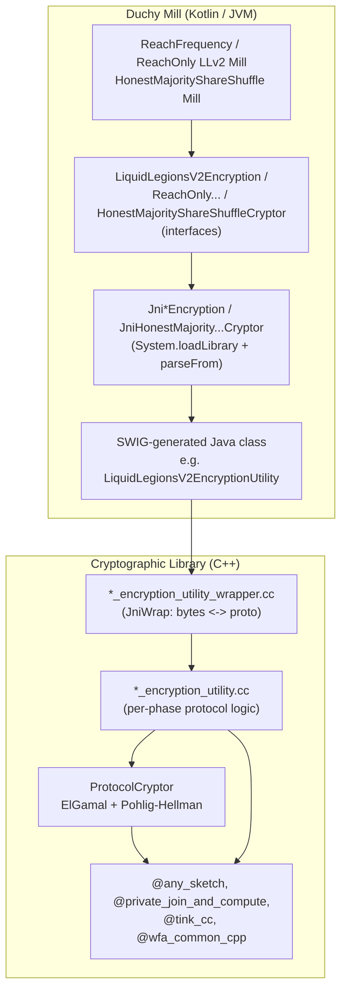
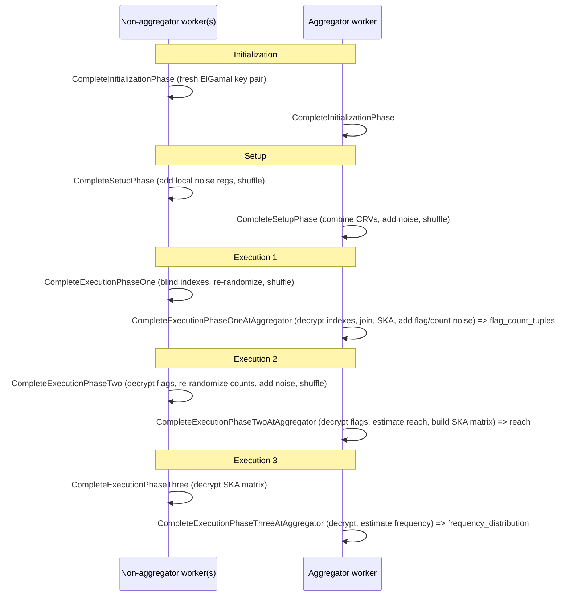
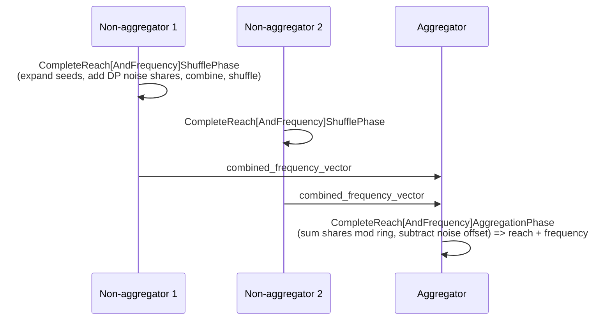

# Cryptographic Library (C++)

The cryptographic library is the native C++ engine that performs the actual
secure multiparty computation (MPC) math for the WFA Cross-Media Measurement
system. It implements the round-by-round crypto for the reach and frequency
protocols (Liquid Legions V2, Reach-Only LLv2, Honest Majority Share Shuffle),
plus the panel-matching commutative encryption used by the private-matching
tooling. The Kotlin duchy [Mill](./duchy.md) does not do crypto itself: it
serializes a request protobuf, calls a thin Java/JNI shim generated by SWIG, and
the shim invokes the C++ implementation. All heavy elliptic-curve and
share-arithmetic work happens in this library.

## Purpose and Responsibilities

The library provides the crypto primitives and per-phase protocol logic that a
Duchy needs to jointly compute reach and frequency without any single party
seeing the underlying data:

*   **ElGamal / commutative encryption primitives** — blinding, layered
    ElGamal decryption, Pohlig-Hellman re-encryption, re-randomization, and
    mapping plaintexts onto an elliptic curve.
*   **Liquid Legions V2 (LLv2)** — the full three-round reach-and-frequency
    protocol implemented as discrete "complete phase" functions.
*   **Reach-Only LLv2 (RO-LLv2)** — a cheaper variant that estimates reach only,
    tracking an "excessive noise" ciphertext instead of frequency histograms.
*   **Honest Majority Share Shuffle (HMSS)** — an additive-secret-sharing
    protocol over frequency vectors that uses PRNG-derived shares and shuffling
    rather than public-key crypto on each register.
*   **Distributed noise generation** — building the differentially private
    noisers (geometric / discrete Gaussian) that each honest party contributes.
*   **Panel-match commutative crypto** — deterministic commutative cipher, AES,
    HKDF, and event preprocessing used by the panel-matching client tooling.

The library is deliberately stateless at the API boundary: every entry point
takes a serialized request proto and returns a serialized response proto.

## Where It Sits in the System

**Callers.** The only production callers are the duchy Mills under
`src/main/kotlin/org/wfanet/measurement/duchy/mill/`. Each protocol Mill holds a
`cryptoWorker` of the corresponding interface type (see
`ReachFrequencyLiquidLegionsV2Mill.kt`, which declares
`private val cryptoWorker: LiquidLegionsV2Encryption`) and calls it once per
computation stage. The load-test EDP simulator uses a sibling adapter,
`SketchEncrypter` in
`src/main/kotlin/org/wfanet/measurement/loadtest/dataprovider/SketchEncrypter.kt`,
to produce encrypted sketches on the data-provider side.

**Callees.** The library depends on several external Bazel modules (not in this
repo):

| External module | Used for |
| --- | --- |
| `@com_google_private_join_and_compute` | `CommutativeElGamal`, `ECCommutativeCipher`, EC group/point math |
| `@any_sketch` | sketch encrypter, reach estimators, distributed noisers, PRNG, shuffle |
| `@tink_cc` | AES / HKDF / secret-data types (panel match) |
| `@wfa_common_cpp` | the `JniWrap` helper, macros, CPU timers |
| `@com_google_absl` | status, containers, synchronization |

## Source Layout

All native crypto lives under `src/main/cc/`. The two top-level trees are
`wfa/measurement` (the reach/frequency MPC) and `wfa/panelmatch` (private
matching). The Kotlin/JNI side lives under `src/main/kotlin/...`, and the SWIG
interface definitions live under `src/main/swig/`.

### Shared primitives — `wfa/measurement/common/crypto/`

| File | Role |
| --- | --- |
| `protocol_cryptor.h` / `.cc` | `ProtocolCryptor`, the core cipher object holding local ElGamal, composite ElGamal, partial-composite ElGamal, and local Pohlig-Hellman ciphers. |
| `ec_point_util.h` / `.cc` | `ElGamalCiphertext` (a `pair<string,string>` `(u,e)`), `ElGamalEcPointPair`, and EC-point add / invert / scalar-multiply helpers. |
| `encryption_utility_helper.h` / `.cc` | Register/tuple byte-slicing helpers: `ExtractKeyCountPairFromRegisters`, `GetNumberOfBlocks`, count-value plaintext generation, append/write ciphertext to strings. |
| `constants.h` | Byte layout constants and well-known register-key seeds (see [Sketch and Register Model](#sketch-and-register-model)). |

`ProtocolCryptor` is explicitly **not thread-safe** (it guards the underlying
private-join-and-compute ciphers with an `absl::Mutex`). Because that library is
single-threaded, the code creates a *vector* of identical cryptors via
`CreateIdenticalProtocolCrypors` to parallelize across a computation.

### LLv2 and Reach-Only LLv2 — `wfa/measurement/internal/duchy/protocol/liquid_legions_v2/`

| File | Role |
| --- | --- |
| `liquid_legions_v2_encryption_utility.h` / `.cc` | The eight LLv2 phase functions (see [LLv2 Flow](#liquid-legions-v2-flow)). |
| `reach_only_liquid_legions_v2_encryption_utility.h` / `.cc` | The reach-only phase functions, including split setup at aggregator vs non-aggregator. |
| `*_encryption_utility_wrapper.h` / `.cc` | JNI bridge: converts serialized bytes to/from the request/response protos via `JniWrap<Req, Resp>` and calls the phase function. |
| `multithreading_helper.h` / `.cc` | Fans register operations out across the cryptor vector. |
| `testing/liquid_legions_v2_encryption_utility_helper.*` | `testonly` helpers used by the C++ unit tests. |

### Honest Majority Share Shuffle — `wfa/measurement/internal/duchy/protocol/share_shuffle/`

| File | Role |
| --- | --- |
| `honest_majority_share_shuffle_utility.h` / `.cc` | `CompleteReachAndFrequencyShufflePhase`, `CompleteReachOnlyShufflePhase`, and the two aggregation-phase functions. |
| `honest_majority_share_shuffle_utility_helper.h` / `.cc` | Share arithmetic (`VectorAddMod` / `VectorSubMod`), PRNG-seed handling, share-from-seed expansion, noise-register generation, `EstimateReach`. |
| `honest_majority_share_shuffle_utility_wrapper.*` | JNI bridge for the four HMSS functions. |

### Noise — `wfa/measurement/internal/duchy/protocol/common/`

`noise_parameters_computation.h` / `.cc` builds `math::DistributedNoiser`
instances (blind-histogram, publisher, global-reach, and frequency noisers) from
`DifferentialPrivacyParams` plus the uncorrupted-party count and a
`NoiseMechanism`. The concrete noiser implementations
(`distributed_geometric_noiser`, `distributed_discrete_gaussian_noiser`) come
from `@any_sketch`.

### Panel match — `wfa/panelmatch/`

`common/crypto/` holds general primitives: `deterministic_commutative_cipher.*`
(a deterministic, commutative — but not reversible — cipher), `aes.*`,
`aes_with_hkdf.*`, `hkdf.*`, `peppered_fingerprinter.*`, and various key loaders
and generators. `protocol/crypto/` holds the
`deterministic_commutative_encryption_utility` and the `event_data_preprocessor`
used to prepare event data for private membership. The client-side crypto lives
under `client/`: `eventpreprocessing/` wraps event preprocessing
(`preprocess_events.*`) and `privatemembership/` holds the private-membership,
query-preparer, and query-result-decryption utilities. Each of these has its own
SWIG bridge (see [JNI / SWIG Bridge](#jni-swig-bridge)).

## JNI / SWIG Bridge

There is no hand-written JNI. The bridge is generated in two layers.

1.  **C++ wrapper functions** (`*_encryption_utility_wrapper.cc`) expose a
    `std::string -> absl::StatusOr<std::string>` signature. Each simply calls
    `JniWrap<RequestProto, ResponseProto>(serialized_request, PhaseFn)` from
    `@wfa_common_cpp`, which parses the request proto, invokes the strongly-typed
    phase function, and serializes the response.

2.  **SWIG interface files** (`src/main/swig/protocol/.../*.swig`) declare
    typemaps that marshal `absl::StatusOr<std::string>` to a Java `byte[]` and a
    Java `byte[]` back to `const std::string&`. Crucially, on a non-OK status the
    typemap raises `SWIG_exception(SWIG_RuntimeError, status.ToString())`, so a
    C++ error surfaces as a Java runtime exception rather than a bad byte array.
    A `%rename` rule converts C++ function names to lowerCamelCase Java methods.

The `java_wrap_cc` Bazel rule (from `@wfa_rules_swig`) turns each `.swig` into a
Java class plus a native shared library. The mapping is:

| SWIG target dir | Java module / class | Java package | Native lib |
| --- | --- | --- | --- |
| `swig/protocol/liquidlegionsv2` | `LiquidLegionsV2EncryptionUtility` | `org.wfanet.measurement.internal.duchy.protocol.liquidlegionsv2` | `liquid_legions_v2_encryption_utility` |
| `swig/protocol/reachonlyliquidlegionsv2` | `ReachOnlyLiquidLegionsV2EncryptionUtility` | `...protocol.reachonlyliquidlegionsv2` | `reach_only_liquid_legions_v2_encryption_utility` |
| `swig/protocol/shareshuffle` | `HonestMajorityShareShuffleUtility` | `...protocol.shareshuffle` | `honest_majority_share_shuffle_utility` |
| `swig/wfanet/panelmatch/protocol/crypto` | `DeterministicCommutativeEncryptionWrapper` | `org.wfanet.panelmatch.protocol.crypto` | `deterministic_commutative_encryption` |
| `swig/wfanet/panelmatch/client/eventpreprocessing` | `EventPreprocessingSwig` | `org.wfanet.panelmatch.protocol.eventpreprocessing` | `preprocess_events` |
| `swig/wfanet/panelmatch/client/privatemembership/privatemembership` | `PrivateMembershipSwig` | `org.wfanet.panelmatch.protocol.privatemembership` | `private_membership` |
| `swig/wfanet/panelmatch/client/privatemembership/querypreparer` | `QueryPreparerSwig` | `org.wfanet.panelmatch.protocol.querypreparer` | `query_preparer` |
| `swig/wfanet/panelmatch/client/privatemembership/decryptqueryresults` | `DecryptQueryResultsSwig` | `org.wfanet.panelmatch.protocol.decryptqueryresults` | `decrypt_query_results` |

On the Kotlin side, `JniLiquidLegionsV2Encryption.kt`,
`JniReachOnlyLiquidLegionsV2Encryption.kt`, and
`JniHonestMajorityShareShuffleCryptor.kt` implement the protocol interfaces.
Each Kotlin JNI class loads the native library in a companion-object `init`
block (e.g. `System.loadLibrary("liquid_legions_v2_encryption_utility")`; the
LLv2 class also loads `sketch_encrypter_adapter`), then for every method calls
`Response.parseFrom(Utility.completeX(request.toByteArray()))`. The interfaces
themselves (`LiquidLegionsV2Encryption`, `ReachOnlyLiquidLegionsV2Encryption`,
`HonestMajorityShareShuffleCryptor`) let unit tests substitute a Mockito mock
crypto worker (e.g. `ReachFrequencyLiquidLegionsV2MillTest`,
`ReachOnlyLiquidLegionsV2MillTest`, and `HonestMajorityShareShuffleMillTest` each
mock the interface) so the Mills can be tested without the native libraries. The
in-process integration harness `InProcessDuchy.kt`, by contrast, wires in the
real JNI implementations (`JniLiquidLegionsV2Encryption`,
`JniReachOnlyLiquidLegionsV2Encryption`, `JniHonestMajorityShareShuffleCryptor`).

## Data Model (Protos)

The library has no database or blob storage of its own; its "data model" is the
set of request/response protobufs it exchanges over JNI. These live under
`src/main/proto/wfa/measurement/internal/duchy/` and are internal-API protos
(not the public v2alpha API).

| Proto file | Purpose |
| --- | --- |
| `crypto.proto` | `ElGamalPublicKey`, `ElGamalKeyPair`, `EncryptionPublicKey`, `EncryptionKeyPair`. |
| `protocol/liquid_legions_v2_encryption_methods.proto` | All eight LLv2 phase request/response messages plus noise-parameter messages. |
| `protocol/reach_only_liquid_legions_v2_encryption_methods.proto` | RO-LLv2 phase messages, including `serialized_excessive_noise_ciphertext`. |
| `protocol/honest_majority_share_shuffle_methods.proto` | `CompleteShufflePhase*` and `CompleteAggregationPhase*` messages; frequency-vector shares carried as either `data` or a PRNG `seed`. |
| `protocol/liquid_legions_sketch_parameter.proto` | `LiquidLegionsSketchParameters` (`decay_rate`, register-space `size`). |
| `protocol/share_shuffle_frequency_vector_params.proto` | `ShareShuffleFrequencyVectorParams` (`register_count`, `maximum_combined_frequency`, `ring_modulus`). |
| `noise_mechanism.proto` | `NoiseMechanism` enum: `NOISE_MECHANISM_UNSPECIFIED` (0/default), `GEOMETRIC`, `DISCRETE_GAUSSIAN`, `CONTINUOUS_GAUSSIAN`, `NONE`. |

> **Warning (from the proto comments):** the LLv2 method protos carry sensitive
> data such as ElGamal private keys and must never be written to logs or leave
> the running process.

The sketch/frequency-vector value types themselves — the `Sketch`,
`FrequencyVector`, `SecretShare`, and `PrngSeed` messages — are defined in the
external `@any_sketch` repository and merely aliased into this build:

*   `src/main/proto/wfa/any_sketch/BUILD.bazel` aliases the `Sketch` message
    (`sketch_kt_jvm_proto` → `@any_sketch//src/main/proto/wfa/any_sketch:sketch_proto`).
*   `src/main/proto/wfa/frequency_count/BUILD.bazel` aliases `FrequencyVector`
    and the `SecretShare` / `PrngSeed` messages (`frequency_vector_kt_jvm_proto`
    and `secret_share_kt_jvm_proto`).
*   `src/main/proto/wfa/any_sketch/crypto/BUILD.bazel` aliases the ElGamal-key
    and sketch-encryption method protos (`el_gamal_key_kt_jvm_proto`,
    `sketch_encryption_methods_kt_jvm_proto`).

## Sketch and Register Model

For the Liquid Legions family, the ciphertext byte layout is fixed and defined in
`constants.h`:

*   An EC point is `kBytesPerEcPoint = 33` bytes.
*   An ElGamal ciphertext is two EC points: `kBytesPerCipherText = 66`.
*   A **register** is three ciphertexts `(index, key, count)`:
    `kBytesPerCipherRegister = 66 * 3 = 198`.
*   A **flags-count tuple** is four ciphertexts `(flag_a, flag_b, flag_c, count)`:
    `kBytesPerFlagsCountTuple = 66 * 4 = 264`.

A combined register vector (CRV) is therefore just a byte string whose length is
a multiple of 198, sliced with the helpers in `encryption_utility_helper.h`.

Well-known constant register keys are seeded from fixed strings and mapped onto
the curve, so noise and destroyed-register markers are recognizable without
revealing anything: `kDestroyedRegisterKey`, `kBlindedHistogramNoiseRegisterKey`,
`kPublisherNoiseRegisterId`, `kPaddingNoiseRegisterId`, plus `kFlagZeroBase`
(a stand-in for the illegal EC-point 0) and `kUnitECPointSeed`. The default curve
is `kDefaultEllipticCurveId = 415` (NIST P-256 / `NID_X9_62_prime256v1`).

The core operations `ProtocolCryptor` exposes (from `protocol_cryptor.h`):

*   `Blind` — peel one ElGamal layer and add a deterministic Pohlig-Hellman
    layer (turns encrypted indexes into stable but still-hidden identifiers so
    equal registers can be grouped).
*   `DecryptLocalElGamal` / `IsDecryptLocalElGamalResultZero`.
*   `EncryptCompositeElGamal` and variants — encrypt under the full or partial
    composite key (`CompositeType::kFull` / `kPartial`).
*   `ReRandomize` — add an encrypted zero to make ciphertexts unlinkable.
*   `CalculateDestructor`, `MapToCurve`, `ToElGamalEcPoints` — used by
    Same-Key-Aggregation and curve mapping.
*   `BatchProcess(data, actions, ...)` — apply a `Span<Action>`
    (`kBlind`, `kPartialDecrypt`, `kDecrypt`, `kReRandomize`, `kNoop`, …) across a
    block of ciphertexts, which is how each phase transforms a CRV in bulk.

## Liquid Legions V2 Flow

LLv2 is a three-round protocol run across an ordered ring of Duchies with one
designated aggregator. Each phase is a separate C++ function (documented inline
in `liquid_legions_v2_encryption_utility.h`); the Mill calls them in order and
ships the resulting byte blob to the next worker.

Key mechanics inside the phases:

*   **Same-Key-Aggregation (SKA).** In phase one at the aggregator,
    `JoinRegistersByIndexAndMergeCounts` groups registers by their blinded index
    and merges the counts. Groups larger than `total_sketches_count` are treated
    as publisher/padding noise and dropped. The result is a set of
    `(flag_a, flag_b, flag_c, count)` tuples.
*   **Reach estimation** happens in phase-two-at-aggregator using the
    `LiquidLegionsSketchParameters` and `@any_sketch` estimators, after
    subtracting the global-reach DP-noise baseline.
*   **Frequency estimation** happens in phase-three-at-aggregator, subtracting
    the per-bucket frequency-noise baseline and returning a
    `map<int64, double> frequency_distribution`.

**Reach-Only LLv2** collapses this to initialization → setup → single execution
phase. Instead of a frequency histogram it maintains an encrypted
`serialized_excessive_noise_ciphertext` that is partially decrypted along the
ring and finally subtracted, so the aggregator can count unique
(non-noise) registers. Note the reach-only setup phase is split into
`CompleteReachOnlySetupPhase` (non-aggregator) and
`CompleteReachOnlySetupPhaseAtAggregator`, the latter combining all workers'
noise ciphertexts.

## Honest Majority Share Shuffle Flow

HMSS avoids per-register public-key crypto. EDPs send additive shares of a
frequency vector (either explicit `data` or a compact PRNG `seed`). The two
non-aggregators and one aggregator then:

The share math is in `honest_majority_share_shuffle_utility_helper.h`:
`GenerateShareFromSeed` expands a `PrngSeed` into a vector, `VectorAddMod` /
`VectorSubMod` do the ring arithmetic modulo `ring_modulus`, and `EstimateReach`
turns the non-empty-register count into a reach estimate given the
`vid_sampling_interval_width`. Randomness comes from `@any_sketch`'s
`open_ssl_uniform_random_generator` and `uniform_pseudorandom_generator`, and
shuffling from `@any_sketch//src/main/cc/crypto:shuffle`. The
`NonAggregatorOrder` (FIRST / SECOND) in the request determines the order in
which each worker appends its own vs. the peer's noise share, keeping the two
workers consistent.

## Cryptography and Privacy Mechanisms

*   **Layered / commutative ElGamal.** The composite public key is the product of
    every participating Duchy's local key, so a ciphertext must be partially
    decrypted by all participants before it becomes plaintext; no single Duchy
    can decrypt alone.
    `combineElGamalPublicKeys` (via the `sketch_encrypter_adapter` native lib)
    forms that composite key.
*   **Pohlig-Hellman blinding.** `Blind` replaces the outermost ElGamal layer
    with a deterministic PH layer so equal registers stay equal (enabling the
    join) while their real identity remains hidden.
*   **Distributed differential privacy.** Each honest party adds its own noise
    registers/shares. `noise_parameters_computation` builds the per-noise-type
    noisers, scaled by the number of uncorrupted parties, using the geometric or
    discrete-Gaussian mechanism selected by `NoiseMechanism`. Aggregators
    subtract the known noise baseline before publishing estimates.
*   **Deterministic commutative cipher (panel match).** Guarantees only
    `Decrypt(Encrypt(x)) == Decrypt(ReEncrypt(Decrypt(Encrypt(x))))`-style
    commutativity, and is intentionally *not* reversible — used to compare
    identifiers across parties without revealing them.

For the broader protocol design and privacy model, see the
[Protocols and cryptography](./duchy.md#protocols-and-cryptography) section of
the Duchy doc.

## Build and Deployment Artifacts

There are no standalone services or daemons in this subsystem — it compiles into
shared libraries that are loaded into the duchy Mill JVM process at runtime. The
Mill itself is deployed as a Kubernetes Job (for example
`LiquidLegionsV2MillJob.kt` and `HonestMajorityShareShuffleMillJob.kt`, with
cloud-specific variants such as `GcsHonestMajorityShareShuffleMillJob.kt` and
`S3HonestMajorityShareShuffleMillJob.kt`); those jobs bundle the native
libraries this library produces.

Build notes:

*   `cc_library` targets follow the WFA convention of a shared
    `_INCLUDE_PREFIX = "/src/main/cc"` with `strip_include_prefix`, and declare
    every dependency explicitly (no transitive reliance).
*   SWIG is a build-time requirement; the `java_wrap_cc` rule reruns SWIG on each
    build to regenerate the Java wrappers from the current headers (see
    `src/main/swig/protocol/liquidlegionsv2/README.md`).
*   The heavy crypto dependencies (`@private_join_and_compute`, `@any_sketch`,
    `@tink_cc`) are external Bazel modules, keeping the audited crypto surface out
    of this repo.

## Testing Approach

Native crypto is covered by GoogleTest `cc_test` targets that mirror the
`src/main/cc` layout under `src/test/cc`:

*   `common/crypto/protocol_cryptor_test.cc` — the primitive cipher operations.
*   `.../liquid_legions_v2/liquid_legions_v2_encryption_utility_test.cc` and
    `reach_only_..._test.cc` — end-to-end protocol phases, using the
    `@any_sketch` `sketch_encrypter` and reach `estimators` to build realistic
    inputs and check estimated reach/frequency.
*   `.../share_shuffle/honest_majority_share_shuffle_utility_test.cc` and its
    helper test — the HMSS phases and share arithmetic.
*   `.../common/noise_parameters_computation_test.cc` — noiser construction.
*   `multithreading_helper_test.cc` — the parallel fan-out helper.

Reusable C++ test infrastructure is marked `testonly` under a `testing`
subpackage of `src/main/cc` (for example
`.../liquid_legions_v2/testing/liquid_legions_v2_encryption_utility_helper.*`),
per the project convention. On the Kotlin side, the protocol interfaces
(`LiquidLegionsV2Encryption`, etc.) allow tests and `InProcessDuchy.kt` to
substitute the JNI worker so higher-level tests can run without the native
libraries.

## Notable Design Decisions and Gotchas

*   **Bytes at the boundary, protos inside.** Everything crossing JNI is a raw
    `byte[]` / serialized proto. This keeps the SWIG surface tiny (one typemap
    set works for every method) at the cost of a serialize/parse round-trip per
    call.
*   **Errors become exceptions.** A non-OK `absl::Status` is turned into a Java
    `RuntimeException` inside the SWIG typemap, so callers should treat any JNI
    method as throwing.
*   **`ProtocolCryptor` is single-threaded.** Parallelism is achieved by holding
    N identical cryptors (`CreateIdenticalProtocolCrypors`) rather than sharing
    one; the internal mutex is only a safety net and would kill throughput if
    relied on. The `parallelism` field in the phase requests controls the pool
    size.
*   **Fixed byte geometry.** Register and tuple sizes are hard-coded to the
    P-256 point size (33 bytes). CRV/tuple blobs must be exact multiples of 198 /
    264 bytes or the helpers return `INVALID_ARGUMENT`.
*   **Sensitive key material in protos.** The method protos carry ElGamal
    private keys; they are explicitly barred from logs and must stay in-process.
*   **`any_sketch` owns the value types.** Sketches, frequency vectors, secret
    shares, estimators, noisers, PRNGs, and the shuffle live in the external
    `@any_sketch` module — this library orchestrates them but does not define
    them.

## See Also

*   [./duchy.md](./duchy.md) — the Mill that drives these phase functions.
*   [Protocols and cryptography](./duchy.md#protocols-and-cryptography) — the
    Duchy doc's protocol-level design and privacy model.
