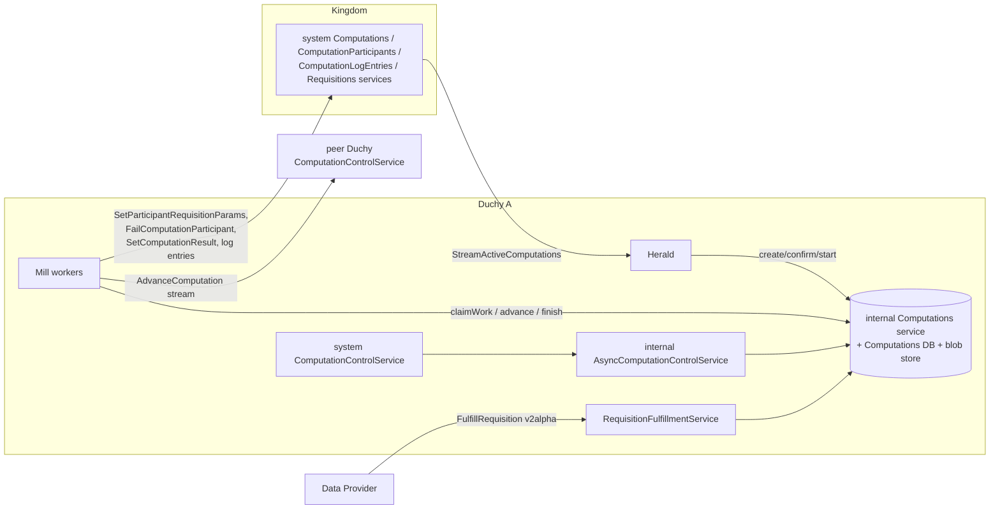
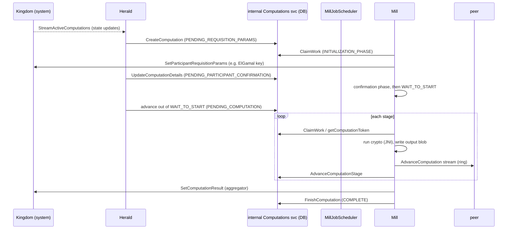

# Duchy

The Duchy is an MPC (secure multiparty computation) worker node in the WFA
Cross-Media Measurement system. A deployment runs two or more independent
Duchies; for public-key MPC protocols, each participating Duchy holds a share of
the decryption key so that no single operator can see cross-publisher
measurement data in the clear. Each Duchy watches the Kingdom for computations
it should participate in, records them in its own
`Computations` database, and runs protocol stages through a pipeline of "Mill"
workers that call into a C++ crypto library over JNI. Duchies talk to each other
directly over an inter-Duchy `ComputationControl` API to pass encrypted
intermediate results around a deterministic ring, and report status and final
results back to the Kingdom.

## Purpose and responsibilities

- **Participate in MPC protocols.** Execute the local part of each supported
  protocol: Liquid Legions V2 (three-round), Reach-Only Liquid Legions V2
  (one-round), Honest Majority Share Shuffle (HMSS), and TrusTEE.
- **Track computation lifecycle.** Mirror the Kingdom's view of active
  computations into a local relational database, moving each through its stages.
- **Hold and use protocol-specific secret material.** LLv2-family Duchies
  contribute local ElGamal keys to a composite key, HMSS non-aggregators hold
  HPKE key pairs / seeds for share handling, and TrusTEE relies on TEE
  attestation rather than a cross-Duchy key split.
- **Fulfill requisitions.** Accept encrypted measurement data from Data
  Providers (`RequisitionFulfillment`), store the blobs, and mark the requisition
  fulfilled at the Kingdom.
- **Exchange intermediate results** with peer Duchies and **report** the final
  encrypted result to the Kingdom.

## Where it sits in the overall system



- **Called by:** the Kingdom system API (the Herald pulls computation state from
  it), Data Providers (via `RequisitionFulfillment`), and peer Duchies (via
  `ComputationControl`).
- **Calls out to:** the Kingdom's system services
  (`Computations`, `ComputationParticipants`, `ComputationLogEntries`,
  `Requisitions`) and peer Duchies' `ComputationControl` service.

For the Kingdom side of these interactions see [./kingdom.md](./kingdom.md). The
C++ crypto invoked over JNI is described in
[./crypto-library.md](./crypto-library.md).

## Key modules and packages

| Area | Path |
| --- | --- |
| Herald (Kingdom watcher / starter) | `src/main/kotlin/org/wfanet/measurement/duchy/herald` |
| Mill base + per-protocol mills | `src/main/kotlin/org/wfanet/measurement/duchy/mill` |
| gRPC service implementations | `src/main/kotlin/org/wfanet/measurement/duchy/service` |
| Computations DB abstraction | `src/main/kotlin/org/wfanet/measurement/duchy/db/computation` |
| Blob/key storage clients | `src/main/kotlin/org/wfanet/measurement/duchy/storage` |
| Ordering / conversion utilities | `src/main/kotlin/org/wfanet/measurement/duchy/utils` |
| Deployment (servers, daemons, jobs, Spanner/Postgres) | `src/main/kotlin/org/wfanet/measurement/duchy/deploy` |
| Internal / system / config protos | `src/main/proto/wfa/measurement/internal/duchy`, `src/main/proto/wfa/measurement/system/v1alpha` |
| C++ crypto (JNI targets) | `src/main/cc/wfa/measurement/internal/duchy/protocol` |

A note-to-implementers guide for adding a new protocol lives at
`src/main/proto/wfa/measurement/internal/duchy/add_a_protocol.md`.

### Herald

`Herald` (`.../herald/Herald.kt`) continuously calls the Kingdom's system
`Computations.StreamActiveComputations` and dispatches each update by state:

- `PENDING_REQUISITION_PARAMS` -> `createComputation` (insert locally)
- `PENDING_PARTICIPANT_CONFIRMATION` -> `confirmParticipant`
- `PENDING_COMPUTATION` -> `startComputing` (moves out of `WAIT_TO_START`)
- `FAILED` / `CANCELLED` -> fail locally; `SUCCEEDED` -> no-op

Per-protocol behavior is delegated to starter objects:
`LiquidLegionsV2Starter`, `ReachOnlyLiquidLegionsV2Starter`,
`HonestMajorityShareShuffleStarter`, and `TrusTeeStarter`. Concurrency is bounded
by a `Semaphore`, and a `ContinuationTokenManager`
(`.../herald/ContinuationTokenManager.kt`) tracks how far the stream has been
processed via the internal `ContinuationTokens` service so that restarts resume
where they left off.

### Mills

`MillBase` (`.../mill/MillBase.kt`) is the shared engine for all protocol mills.
It claims work, dispatches to a protocol-specific `processComputationImpl`,
handles retries/failures, caches stage outputs as blobs, streams intermediate
results to peer Duchies (`sendAdvanceComputationRequest`), sends computation
stats, and reports results/failures to the Kingdom. Concrete mills:

| Mill | Path | Protocol / role |
| --- | --- | --- |
| `LiquidLegionsV2Mill` (base) | `.../mill/liquidlegionsv2/LiquidLegionsV2Mill.kt` | LLv2 common logic, ring navigation |
| `ReachFrequencyLiquidLegionsV2Mill` | `.../mill/liquidlegionsv2/ReachFrequencyLiquidLegionsV2Mill.kt` | LLv2 reach & frequency |
| `ReachOnlyLiquidLegionsV2Mill` | `.../mill/liquidlegionsv2/ReachOnlyLiquidLegionsV2Mill.kt` | Reach-only LLv2 |
| `HonestMajorityShareShuffleMill` | `.../mill/shareshuffle/HonestMajorityShareShuffleMill.kt` | HMSS |
| `TrusTeeMill` | `.../mill/trustee/TrusTeeMill.kt` | TrusTEE (single aggregator in a TEE) |

The `ComputationType.millType` and `ComputationType.prioritizedStages` extension
properties (in `.../mill/MillType.kt`) map each `ComputationType` to a `MillType`
enum value and to that protocol's prioritized stages (e.g. the initialization
phase), which are passed to `ClaimWork` so that new computations get picked up
promptly.

## Services and daemons

### gRPC services

| Service (proto) | Impl | Role |
| --- | --- | --- |
| `wfa.measurement.system.v1alpha.ComputationControl` | `.../service/system/v1alpha/ComputationControlService.kt` | **Inter-Duchy.** Receives `AdvanceComputation` streams from peers, writes the payload as a blob, and forwards to the internal async service. Also serves `GetComputationStage`. |
| `wfa.measurement.internal.duchy.AsyncComputationControl` | `.../service/internal/computationcontrol/AsyncComputationControlService.kt` | **Internal.** Records the received output blob path and advances the local stage when all expected inputs are present. |
| `wfa.measurement.internal.duchy.Computations` | `.../service/internal/computations/ComputationsService.kt` | **Internal, DB-backed.** The system of record: `CreateComputation`, `ClaimWork`, `AdvanceComputationStage`, `FinishComputation`, `EnqueueComputation`, `RecordOutputBlobPath`, `RecordRequisitionFulfillment`, `GetComputationToken`, etc. |
| `wfa.measurement.internal.duchy.ComputationStats` | `.../service/internal/computationstats/ComputationStatsService.kt` | **Internal.** Records per-stage/per-attempt metrics. |
| `wfa.measurement.internal.duchy.ContinuationTokens` | `.../deploy/gcloud/spanner/continuationtoken/SpannerContinuationTokensService.kt` (Postgres variant also exists) | **Internal.** Persists the Herald's stream continuation token. |
| `wfa.measurement.api.v2alpha.RequisitionFulfillment` | `.../service/api/v2alpha/RequisitionFulfillmentService.kt` | **Public v2alpha.** Data Providers stream fulfilled requisition data here. |

The internal DB-backed services (`Computations`, `ComputationStats`,
`ContinuationTokens`) are bundled together and served by `DuchyDataServer`
(`.../deploy/common/server/DuchyDataServer.kt`) via a `DuchyDataServices` factory
(see `.../deploy/common/service/`, e.g. `PostgresDuchyDataServices.kt`).

### Daemons, jobs, and entry points

- **Herald daemon:** `HeraldDaemon` / `ForwardedStorageHeraldDaemon`
  (`.../deploy/common/daemon/herald/`), with a GCS variant
  `GcsHeraldDaemon` (`.../deploy/gcloud/daemon/herald/`).
- **Mill scheduling:** `MillJobScheduler`
  (`.../deploy/common/daemon/mill/MillJobScheduler.kt`) runs in-cluster,
  polls the internal `Computations` service with `ClaimWork` per supported
  `ComputationType`, and when work is available launches a Kubernetes `Job`
  from a per-mill-type `PodTemplate` (passing `--mill-id`,
  `--claimed-computation-id`, `--claimed-computation-version` as args). It
  enforces `maximumConcurrency` and successful/failed Job history limits.
- **Mill jobs:** short-lived per-computation entry points under
  `.../deploy/common/job/mill/liquidlegionsv2` and `.../mill/shareshuffle`
  (e.g. `LiquidLegionsV2MillJob`, `HonestMajorityShareShuffleMillJob`, plus
  `ForwardedStorage*` variants).
- **TrusTEE mill daemon:** `TrusTeeMillDaemon`
  (`.../deploy/common/daemon/mill/trustee/`; GCS variant under
  `.../deploy/gcloud/daemon/mill/trustee/`). TrusTEE is scheduled as a daemon,
  not through `MillJobScheduler` (which explicitly does not support it).
- **Cleanup:** `ComputationsCleanerJob`
  (`.../deploy/common/job/ComputationsCleanerJob.kt`) invokes
  `PurgeComputations` to delete terminal-stage computations and their blobs.

## Data model and storage

The Duchy keeps a relational **`Computations` database** (Cloud Spanner or
Postgres) plus a **blob store** for the large encrypted payloads (only paths are
kept in the relational DB).

### Relational schema

Cloud Spanner DDL: `src/main/resources/duchy/spanner/create-computations-schema.sql`
(Postgres equivalent: `src/main/resources/duchy/postgres/create-duchy-schema.sql`).
Table hierarchy (interleaved / cascading):

```
Computations
├── Requisitions
└── ComputationStages
    ├── ComputationBlobReferences
    └── ComputationStageAttempts
        └── ComputationStats
```

Highlights:

- `Computations` has the local `ComputationId INT64` primary key, the
  external `GlobalComputationId` (assigned by the Kingdom), the current
  `ComputationStage`, and `LockOwner` / `LockExpirationTime` used for claiming
  work. Per the project convention, the internal DB id is not exposed outside
  internal API servers.
- The index `ComputationsByLockExpirationTime` (on
  `Protocol, LockExpirationTime, UpdateTime`) backs the claim query.
- `Requisitions` stores `ExternalRequisitionId`, a fingerprint, and
  `PathToBlob` (set only when fulfilled at this Duchy).
- `ComputationBlobReferences` records input/output blob paths for each stage; a
  stage is ready to advance once all output paths are populated.

### Serialized detail protos

Details messages are stored as serialized bytes in the DB. Central ones:

- `ComputationDetails` (`.../internal/duchy/computation_details.proto`) —
  per-computation config, including `KingdomComputationDetails` (written by the
  Herald, consumed by Mills: public API version, `MeasurementSpec`, measurement
  public key, participant count) and a `oneof protocol` with per-protocol
  `ComputationDetails` (e.g.
  `LiquidLegionsSketchAggregationV2.ComputationDetails`).
- `ComputationStageDetails` and `ComputationStageAttemptDetails` — per-stage and
  per-attempt state.
- `RequisitionDetails` (`.../internal/duchy/requisition_details.proto`).

The `ComputationToken` (`.../internal/duchy/computation_token.proto`) is the
in-memory snapshot passed between the DB service and workers: local + global id,
current stage, attempt, blob metadata, a monotonically increasing `version` for
optimistic concurrency, `ComputationDetails`, requisitions, and the lock
owner/expiration.

### Blob and key storage

- `ComputationStore` (`.../storage/ComputationStore.kt`) — blobs keyed under
  `computations/{globalId}/{stage}/{blobId}`.
- `RequisitionStore` (`.../storage/RequisitionStore.kt`) — fulfilled requisition
  data under the `requisitions` prefix.
- `TinkKeyStore` (`.../storage/TinkKeyStore.kt`) — private key material (e.g. the
  HMSS non-aggregator HPKE key created by the Herald).

Storage is pluggable: Google Cloud Storage servers live under
`.../deploy/gcloud/server` and a "forwarded storage" abstraction is used
elsewhere (`.../deploy/common/server/ForwardedStorage*Server.kt`).

## API surface

Three distinct API layers, matching the project's API conventions:

1. **Public v2alpha** (`wfa.measurement.api.v2alpha`) — `RequisitionFulfillment`,
   the only externally facing (Data Provider) API the Duchy hosts.
2. **System v1alpha** (`wfa.measurement.system.v1alpha`) — the inter-component
   API. The Duchy *serves* `ComputationControl` (peer-to-peer) and is a *client*
   of the Kingdom's `Computations`, `ComputationParticipants`,
   `ComputationLogEntries`, and `Requisitions` services.
3. **Internal** (`wfa.measurement.internal.duchy`) — DB-backed and inter-service
   APIs (`Computations`, `AsyncComputationControl`, `ComputationStats`,
   `ContinuationTokens`) that only Duchy-internal servers may call; database
   access is confined to these servers.

## Key workflows

### Computation lifecycle (Herald + Mill)



### Claiming work

`Mill.claimAndProcessWork` (or `MillJobScheduler`) sends `ClaimWorkRequest` with
the mill's `computationType`, an `owner`, a `lockDuration`, and
`prioritizedStages`. The internal `Computations` service runs `claimTask`, backed
by `UnclaimedTasksQuery`
(`.../deploy/gcloud/spanner/computation/UnclaimedTasksQuery.kt`): it selects a
single computation of the right protocol whose `LockExpirationTime <= now`,
ordering by prioritized-stage-first, then `CreationTime`, `LockExpirationTime`,
`UpdateTime`. The claim sets `LockOwner`/`LockExpirationTime`. A mill only
processes a token whose `version` still matches and whose lock it still holds
(`holdsLock`).

### Advancing a stage and inter-Duchy hand-off

A worker writes its stage output as a blob, then either passes it to the next
Duchy in the ring or advances locally. Receipt at a peer flows:

1. Peer Duchy's `ComputationControlService.advanceComputation` consumes the
   streamed header + body, looks up the target output blob via
   `AsyncComputationControl.getOutputBlobMetadata`, writes the blob to its
   `ComputationStore`, then calls `AsyncComputationControl.advanceComputation`.
2. `AsyncComputationControlService` records the blob path
   (`RecordOutputBlobPath`) and, once *all* expected output paths for the stage
   are present, calls `AdvanceComputationStage` to move to the next stage. It
   tolerates the request being exactly one stage ahead/behind (idempotent
   catch-up), and rejects larger mismatches with `ABORTED`. The next stage is
   computed by `ProtocolStages`
   (`.../service/internal/computationcontrol/ProtocolStages.kt`), which encodes
   each protocol's stage graph and role-dependent transitions.

### Deterministic multi-Duchy ordering

The order of Duchies in the MPC ring must be identical at every node without
coordination. It is derived deterministically from public keys and the global
computation id:

- For LLv2, the Herald's `LiquidLegionsV2Starter.orderByRoles`
  (`.../herald/LiquidLegionsV2Starter.kt`) is the live ordering mechanism: it
  orders non-aggregators by `sha1Hash(elGamalPublicKey + globalComputationId)`
  and appends the aggregator last, storing this list in
  `LiquidLegionsSketchAggregationV2.ComputationDetails.participant`. At runtime
  `LiquidLegionsV2Mill.nextDuchyId` indexes into that stored, already-ordered
  participant list to find the next hop in the ring
  (`duchyList[(index + 1) % size]`), while the aggregator is found separately as
  the last element of that same ordered list (`participantList.last().duchyId`).
  (The reach-only variant does the same via `ReachOnlyLiquidLegionsV2Starter`.)
- For HMSS, roles are fixed by config
  (`HonestMajorityShareShuffleSetupConfig`: first/second non-aggregator and
  aggregator); the `FIRST_NON_AGGREGATOR` is the one the Herald triggers to start.
- `.../utils/DuchyOrder.kt` also defines a standalone
  `getDuchyOrderByPublicKeysAndComputationId` helper that sorts nodes by
  `SHA1(publicKey + globalComputationId)`, but it is only exercised by its own
  test and is not called from `src/main`; the live LLv2 path above reuses only
  the file's `sha1Hash` function.

`RoleInComputation`
(`.../internal/duchy/config/protocols_setup_config.proto`) enumerates
`AGGREGATOR`, `NON_AGGREGATOR` (LLv2), and `FIRST_NON_AGGREGATOR` /
`SECOND_NON_AGGREGATOR` (HMSS). Each Duchy's role per protocol comes from its
local `ProtocolsSetupConfig`.

## Protocols and cryptography

| Protocol | `ComputationType` | Stage enum | Mill dir | C++ dir |
| --- | --- | --- | --- | --- |
| Liquid Legions V2 | `LIQUID_LEGIONS_SKETCH_AGGREGATION_V2` | `LiquidLegionsSketchAggregationV2.Stage` | `mill/liquidlegionsv2` | `.../protocol/liquid_legions_v2` |
| Reach-Only LLv2 | `REACH_ONLY_LIQUID_LEGIONS_SKETCH_AGGREGATION_V2` | `ReachOnlyLiquidLegionsSketchAggregationV2.Stage` | `mill/liquidlegionsv2` | `.../protocol/liquid_legions_v2` |
| Honest Majority Share Shuffle | `HONEST_MAJORITY_SHARE_SHUFFLE` | `HonestMajorityShareShuffle.Stage` | `mill/shareshuffle` | `.../protocol/share_shuffle` |
| TrusTEE | `TRUS_TEE` | `TrusTee.Stage` | `mill/trustee` | (TEE processor; no ring) |

- **Liquid Legions V2** is a three-round protocol: `INITIALIZATION_PHASE` (each
  worker creates an ElGamal key), a confirmation phase, then setup / execution
  phases one, two, and three, with `WAIT_*` stages where a worker blocks on
  inputs from the ring (see the stage comments in
  `.../protocol/liquid_legions_sketch_aggregation_v2.proto`). Non-aggregators
  add noise, re-encrypt, and shuffle; the aggregator joins registers and
  produces the reach/frequency estimate.
- **Reach-Only LLv2** collapses this into a single execution round.
- **HMSS** uses secret sharing: non-aggregators exchange seeds, add noise, and
  shuffle frequency vectors; the aggregator combines. The Herald generates a
  random seed and an HPKE key pair for non-aggregators and stores the private key
  in the key store.
- **TrusTEE** runs a single aggregator inside a Trusted Execution Environment
  (Confidential Space): stages are `INITIALIZED -> WAIT_TO_START -> COMPUTING ->
  COMPLETE`, with no inter-Duchy ring. The mill uses a `TrusTeeProcessor`
  (`.../mill/trustee/processor/`) and, for encrypted inputs, envelope decryption
  via a KMS. See [../../operations/enabling-trustee-on-edp.md](../../operations/enabling-trustee-on-edp.md).

### C++ crypto via JNI

The heavy cryptography is implemented in C++ under
`src/main/cc/wfa/measurement/internal/duchy/protocol` and invoked from Kotlin
through thin JNI wrappers:

- `JniLiquidLegionsV2Encryption`
  (`.../mill/liquidlegionsv2/crypto/`) — serializes a request proto to bytes,
  calls the generated `LiquidLegionsV2EncryptionUtility` JNI methods, and parses
  the response proto. `JniReachOnlyLiquidLegionsV2Encryption` (same directory)
  does the same but calls the generated
  `ReachOnlyLiquidLegionsV2EncryptionUtility` JNI methods. Both also delegate
  `combineElGamalPublicKeys` to `SketchEncrypterAdapter`, and each loads its own
  native libraries in a companion `init` block:
  `JniLiquidLegionsV2Encryption` loads `liquid_legions_v2_encryption_utility` +
  `sketch_encrypter_adapter`, and `JniReachOnlyLiquidLegionsV2Encryption` loads
  `reach_only_liquid_legions_v2_encryption_utility` + `sketch_encrypter_adapter`.
  The `estimators` library is loaded separately by `LiquidLegionsV2Mill`'s own
  companion `init` (alongside `sketch_encrypter_adapter`), not by the JNI
  wrappers.
- `JniHonestMajorityShareShuffleCryptor`
  (`.../mill/shareshuffle/crypto/`) wraps
  `honest_majority_share_shuffle_utility`.

Each Kotlin `*Encryption` / `*Cryptor` interface has a `Jni*` implementation, so
mills depend on the interface and the JNI boundary is isolated. For the full
crypto library layout and build details see
[./crypto-library.md](./crypto-library.md).

## Deployment artifacts

Deployment code is split into cloud-agnostic (`deploy/common`) and
cloud-specific (`deploy/gcloud`, `deploy/aws`) trees:

- **Servers** (`deploy/common/server`): `DuchyDataServer` (internal DB services),
  `ComputationControlServer` (system + async control),
  `RequisitionFulfillmentServer`, `AsyncComputationControlServer`,
  `ComputationsServer`, each with a `ForwardedStorage*` and, for GCS,
  `Gcs*`/`Spanner*` concrete variant under `deploy/gcloud/server`.
- **Spanner** (`deploy/gcloud/spanner`): `GcpSpannerComputationsDatabaseReader` /
  `GcpSpannerComputationsDatabaseTransactor`, the claim/query classes
  (`UnclaimedTasksQuery`, `ComputationTokenProtoQuery`, `GlobalIdsQuery`, …), and
  the continuation-token service.
- **Postgres** (`deploy/common/postgres`, `deploy/*/postgres`): an alternative
  backend for the same internal services.
- **Kubernetes:** `MillJobScheduler` creates mill `Job`s from `PodTemplate`s and
  owns them via `OwnerReference` to the scheduler `Deployment`; the Herald and
  TrusTEE mill run as long-lived daemons.

## Testing approach

Tests mirror the source tree under `src/test/`, and reusable in-process test
infrastructure lives in `testing` subpackages under `src/main/` marked
`testonly` (e.g. `.../duchy/testing`,
`.../service/internal/testing` (reusable service-contract tests and fakes such
as `ComputationsServiceTest.kt`, `ComputationStatsServiceTest.kt`, and
`InMemoryContinuationTokensService.kt`),
`.../db/computation/testing`,
`.../deploy/gcloud/spanner/testing`). Tests favor in-process fakes over mocks:
mills are exercised against the real internal `Computations` service backed by an
in-memory/fake computations database and storage, so stage transitions, claiming,
and blob handling are tested through the public service contract rather than
internal state.

## Notable design decisions and gotchas

- **Optimistic concurrency + work locks.** Every mutating internal call carries
  the token `version`; a mismatch returns `ABORTED`. Work is claimed via a lock
  (`LockOwner`/`LockExpirationTime`); an expired lock lets another worker retake
  the computation. `EnqueueComputation` uses `expected_owner` to avoid a
  lock-handoff race.
- **Idempotent, tolerant stage advancement.** `AsyncComputationControlService`
  treats a request one stage behind as a no-op and one stage ahead as catch-up,
  which is what makes retried inter-Duchy `AdvanceComputation` calls safe.
- **Cached stage outputs.** `existingOutputOr` / `existingOutputAnd` in
  `MillBase` reuse a previously written output blob on retry so expensive crypto
  is not repeated.
- **Deterministic ring, no coordination.** For LLv2 the Herald sorts the
  non-aggregators by `sha1Hash(elGamalPublicKey + globalComputationId)` and
  appends the aggregator last, so every participating Duchy independently agrees
  on the ring for a given computation.
- **Duchy-internal-only DB access.** The relational DB and internal IDs are never
  exposed outside internal API servers; external APIs use the global computation
  id and external requisition ids.
- **Kingdom coupling via internal service.** The internal `Computations` service
  sends status log entries directly to the Kingdom's system
  `ComputationLogEntries` service; this cross-layer connection is flagged as
  tech debt in code
  (TODO in `ComputationsService.sendStatusUpdateToKingdom`).
- **TrusTEE is scheduled differently.** `MillJobScheduler` explicitly does not
  support TrusTEE (`error("TrusTEE is not supported")`); it runs as its own
  daemon and has no inter-Duchy ring.
- **Adding a protocol** touches many files consistently (proto stage/type enums,
  DB stage helpers, `ProtocolStages`, a Herald starter, a mill, and JNI crypto);
  follow `src/main/proto/wfa/measurement/internal/duchy/add_a_protocol.md`.
