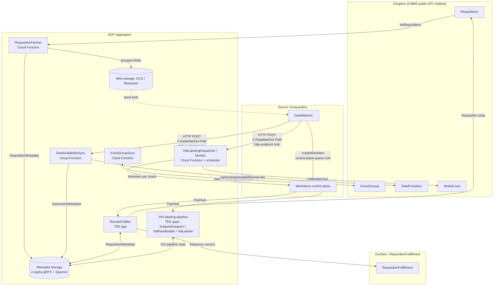
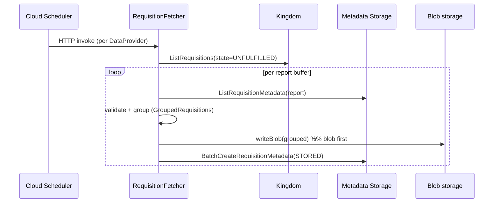
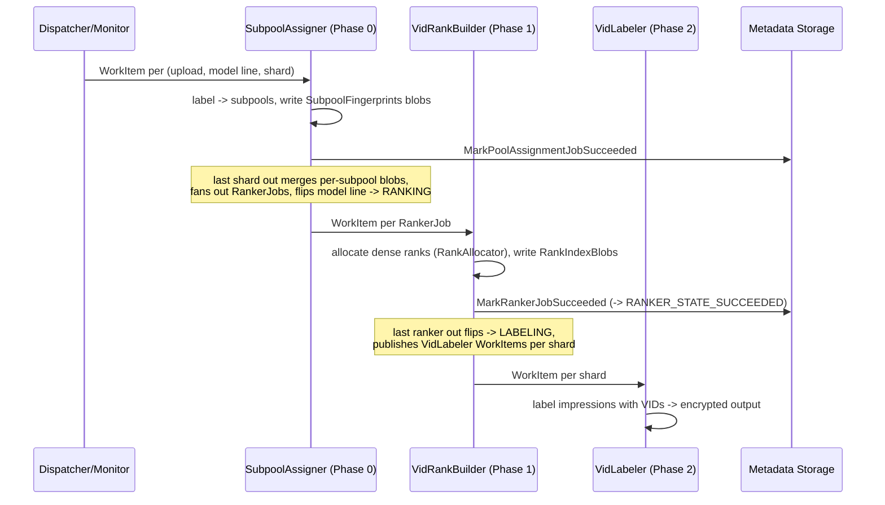

# EDP Aggregator (EDPA)

The Event Data Provider Aggregator is the subsystem that lets a `DataProvider`
(EDP) participate in the Cross-Media Measurement System at scale without
hand-rolling its own integration. It fetches unfulfilled requisitions from the
Kingdom, groups them, computes frequency vectors from the EDP's impression data
inside Trusted Execution Environments (TEEs), fulfills the results back to the
Kingdom/Duchies, and keeps the Kingdom informed about which event groups exist
and what data the EDP has available. It also hosts a privacy-preserving "VID
labeling" pipeline that assigns Virtual IDs (VIDs) to raw impressions before
they are measured. Almost all of the durable state lives in a small internal
gRPC + Spanner "metadata storage" layer, and almost all of the heavy compute
runs as short-lived TEE apps and Cloud Functions rather than long-lived
servers.

## 1. Purpose & Responsibilities

The EDPA sits between an EDP's raw data and the Kingdom/Duchies. Its
responsibilities map almost one-to-one onto the packages under
`src/main/kotlin/org/wfanet/measurement/edpaggregator/`:

| Concern | What it does | Entry package |
| --- | --- | --- |
| Requisition fetching | Streams `UNFULFILLED` `Requisition`s from the Kingdom, groups them by report, writes them to blob storage, and records `RequisitionMetadata`. | `requisitionfetcher` |
| Results fulfilling | Reads a grouped-requisitions blob, builds per-VID frequency vectors from impressions, and fulfills via the protocol-specific fulfiller. | `resultsfulfiller` |
| Event group sync | Reconciles the EDP's event groups with the Kingdom (create / update / delete). | `eventgroups` |
| Data availability | Publishes the EDP's per-model-line data availability intervals to the Kingdom and maintains `ImpressionMetadata`. | `dataavailability` |
| Raw impression handling | Reads/writes encrypted RecordIO raw-impression blobs, digests event IDs, packs files. | `rawimpressions` |
| VID sub-pool assignment | Phase-0 of VID labeling: labels raw impressions into sub-pools, writes fingerprint blobs, fans out ranking. | `subpoolassigner` |
| VID rank building | Phase-1: allocates dense ranks to fingerprints per sub-pool, maintaining cumulative rank-index blobs. | `vidrankbuilder` |
| VID labeling | Phase-2 labeler plus the dispatcher/monitor that sequence the whole pipeline. | `vidlabeler`, `vidlabeling` |
| Telemetry | Shared OpenTelemetry setup (metrics, tracing, Cloud Logging). | `telemetry` |
| Metadata services | The public v1alpha gRPC facade and its Spanner-backed internal implementation. | `service`, `deploy` |

## 2. Where It Sits in the Overall System

The EDPA is deployed alongside (and operated by) an EDP. It talks "north" to
the Kingdom's public API and to the Duchies (for fulfillment), and "east/west"
to the Secure Computation control plane (see [./securecomputation.md](./securecomputation.md))
which schedules its TEE workloads.

Key relationships:

*   **Kingdom (v2alpha).** `RequisitionFetcher` calls `ListRequisitions`;
    `EventGroupSync` calls `BatchCreateEventGroups` / `BatchUpdateEventGroups` /
    `DeleteEventGroup` and resolves `MeasurementConsumer`s via `ClientAccounts`;
    `DataAvailabilitySync` calls `ReplaceDataAvailabilityIntervals`. See
    [./kingdom.md](./kingdom.md).
*   **Duchies.** `ResultsFulfiller`'s protocol fulfillers stream to a Duchy's
    `RequisitionFulfillment` service for the multi-party protocols. See
    [./duchy.md](./duchy.md).
*   **Secure Computation.** A `DataWatcher` Cloud Function
    (`src/main/kotlin/org/wfanet/measurement/securecomputation/datawatcher/DataWatcher.kt`)
    watches blob storage for "done" markers. Each matched `WatchedPath` has one
    of two sink types (`WatchedPath.SinkConfigCase`): a
    `CONTROL_PLANE_QUEUE_SINK` calls `createWorkItem` to enqueue a `WorkItem` on
    the control-plane queue (Pub/Sub, consumed by the TEE apps), or an
    `HTTP_ENDPOINT_SINK` makes a direct authenticated HTTP POST — setting the
    `X-DataWatcher-Path` header — to invoke a Cloud Function. The
    `DataAvailabilitySyncFunction` and `VidLabelingDispatcherFunction` are driven
    over this HTTP path (they read `X-DataWatcher-Path`), not via `WorkItem`s. TEE
    apps (`ResultsFulfiller`, `SubpoolAssigner`, `VidRankBuilder`, `VidLabeler`)
    subscribe to the control-plane queues via `BaseTeeApplication`. See
    [./securecomputation.md](./securecomputation.md).
*   **eventdataprovider libraries.** The EDPA does not re-implement the core
    requisition-fulfillment math. It depends on
    `org.wfanet.measurement.eventdataprovider.*`:
    `requisition.v2alpha.common.FrequencyVectorBuilder` and `VidIndexMap`
    (`ParallelInMemoryVidIndexMap`), `requisition.v2alpha.shareshuffle` and
    `.trustee` `FulfillRequisitionRequestBuilder`s, `noiser` (`GaussianNoiser`,
    `DpParams`, `DirectNoiseMechanism`), and `eventfiltration.EventFilters`.

## 3. Key Modules & Packages

### Requisition Fetcher — `requisitionfetcher/`

`RequisitionFetcher.kt` streams `UNFULFILLED` requisitions from the Kingdom,
buffers them per `(reportId, updateTime)` tuple, and dispatches each closed
buffer onto per-worker channels keyed by `reportId.hashCode().mod(workerCount)`.
Each worker lists existing `RequisitionMetadata`, validates and groups the
report's requisitions (`RequisitionGrouperByReportId.kt`,
`RequisitionsValidator.kt`), **writes the grouped blob before creating
metadata** (so a crash leaves a recoverable "blob without metadata" state rather
than the wedge "metadata without blob"), then batch-creates `STORED`
`RequisitionMetadata`. It uses `listResourcesWithAdaptivePageSize` to halve the
Kingdom page size on `RESOURCE_EXHAUSTED`. The grouped blob is a
`GroupedRequisitions` message
(`src/main/proto/wfa/measurement/edpaggregator/v1alpha/grouped_requisitions.proto`).

### Results Fulfiller — `resultsfulfiller/`

`ResultsFulfiller.kt` is the orchestrator for one `GroupedRequisitions` blob. It:

1.  Lists `RequisitionMetadata` for the group and filters to requisitions that
    still need work (skipping ones already `FULFILLED` / `WITHDRAWN` / `REFUSED`
    in the Kingdom, syncing metadata state as a side effect).
2.  Builds an event-processing pipeline (`EventProcessingOrchestrator.kt`,
    `EventProcessingPipeline.kt`, `ParallelBatchedPipeline.kt`) that reads
    impressions (`StorageEventSource.kt`, `StorageEventReader.kt`), applies
    filters (`FilterSpec.kt`, `FilterProcessor.kt`), and produces a per-VID
    `StripedByteFrequencyVector` per requisition using the model line's
    `VidIndexMap` / `PopulationSpec` (`ModelLineInfo.kt`).
3.  Selects a protocol fulfiller (`FulfillerSelector.kt`,
    `DefaultFulfillerSelector.kt`) and fulfills each requisition concurrently.

Fulfillers live in `resultsfulfiller/fulfillers/` behind the
`MeasurementFulfiller` interface: `DirectMeasurementFulfiller`,
`HMShuffleMeasurementFulfiller` (Honest Majority Share Shuffle), and
`TrusTeeMeasurementFulfiller` (TrusTEE). Noise selection is in
`NoiserSelector.kt` / `ContinuousGaussianNoiseSelector.kt` / `NoNoiserSelector.kt`
and `noise/Noiser.kt`; k-anonymity thresholding in `ResultMinimumThresholder.kt`.

### Event Group Sync — `eventgroups/`

`EventGroupSync.kt` takes a `Flow<EventGroup>` (the EDPA's own
`edpaggregator.eventgroups.v1alpha.EventGroup`) and reconciles it against the
Kingdom's `EventGroup`s. It caches the Kingdom's current event groups, decides
create/update/no-op per item, batches writes (max 50 per `BatchCreate` /
`BatchUpdate`), falls back to per-item RPCs when a batch fails for a
per-request reason, and emits a `MappedEventGroup` per synced group. It matches
existing groups by `EntityKey` (preferred) or `eventGroupReferenceId`, and can
fan one input group out to multiple `MeasurementConsumer`s resolved via
`ClientAccounts`.

### Data Availability — `dataavailability/`

`DataAvailabilitySync.kt` runs after a "done" blob signals a completed
impression upload for a date. It crawls the folder, parses per-blob
`BlobDetails` (`.binpb` or `.json`), persists `ImpressionMetadata` (idempotent
via a content-aware `request_id`), stamps GCS object metadata (a "synced-by"
marker plus the impression-metadata resource id), computes per-model-line
availability bounds via `ComputeModelLineBounds`, checks for date gaps, and
calls the Kingdom's `ReplaceDataAvailabilityIntervals`.
`DataAvailabilityMonitor.kt` and `DataAvailabilityCleanup.kt` provide staleness
monitoring and blob cleanup; `DataAvailabilityBlobs.kt` holds the shared
storage-level date classification.

### Raw Impressions & VID Pipeline — `rawimpressions/`, `subpoolassigner/`, `vidrankbuilder/`, `vidlabeler/`, `vidlabeling/`

These implement the memoized VID-assignment pipeline (see §7). Notable files:
`rawimpressions/RawImpressionSource.kt`, `EncryptedRecordIoStore.kt`,
`EventIdDigestExtractor.kt`, `SubpoolFingerprintsStore.kt`, `RankIndexStore.kt`;
`subpoolassigner/SubpoolAssigner.kt`, `PoolEmitLabeler.kt`,
`SubpoolFingerprintsAccumulator.kt`; `vidrankbuilder/RankAllocator.kt`,
`SubpoolRanker.kt`, `SubpoolRetention.kt`;
`vidlabeler/utils/Bytes12IntMap.kt` (a compact 12-byte-fingerprint → int map)
and `ActiveWindow.kt`; `vidlabeling/VidLabelingDispatcher.kt`,
`VidLabelingMonitor.kt`, `VidLabelingDispatchSequencer.kt`.

### Shared — `edpaggregator/` (top level) and `common/edpaggregator/`

`BaseTeeAppRunner.kt` is the shared CLI base for TEE container entry points; it
loads mTLS material from Secret Manager, builds per-EDP `KmsClient`s via
Workload Identity Federation (GCP or GCP→AWS), builds the mutual TLS channels to
the Secure Computation and Metadata Storage public APIs, and initializes
telemetry. `StorageConfig.kt`, `EncryptedStorage.kt`, `BlobUris.kt`, and
`ConfigLoader.kt` are storage/config helpers.
`common/edpaggregator/EdpAggregatorConfig.kt` loads text-proto configs from a
storage bucket named by the `EDPA_CONFIG_STORAGE_BUCKET` env var.

## 4. Services & Daemons

The EDPA runs three kinds of processes.

### Long-lived gRPC servers

| Server | Class | What it serves |
| --- | --- | --- |
| Metadata Storage public API | `deploy/common/server/SystemApiServer.kt` (`EdpAggregatorApiServer`) | The v1alpha metadata services; a thin facade that forwards to the internal API over mTLS. |
| Internal API | `deploy/gcloud/spanner/InternalApiServer.kt` (`EdpAggregatorInternalApiServer`) | The Spanner-backed internal services. |

`service/v1alpha/Services.kt` wires nine public services, each delegating to an
internal stub: `RequisitionMetadataService`, `ImpressionMetadataService`,
`RawImpressionMetadataBatchService`, `RawImpressionMetadataBatchFileService`,
`RawImpressionUploadService`, `RawImpressionUploadFileService`,
`VidLabelingJobService`, `RankerJobService`, `RankIndexBlobService`.
`deploy/gcloud/spanner/InternalApiServices.kt` builds their Spanner
implementations (`Spanner*Service.kt`).

### Cloud Functions (schedule- or event-triggered)

| Function | Class | Trigger |
| --- | --- | --- |
| Requisition fetch | `deploy/gcloud/requisitionfetcher/RequisitionFetcherFunction.kt` | HTTP (Cloud Scheduler) |
| Event group sync | `deploy/gcloud/eventgroups/EventGroupSyncFunction.kt` | HTTP / event |
| Data availability sync | `deploy/gcloud/dataavailability/DataAvailabilitySyncFunction.kt` | HTTP (`HttpFunction`) from `DataWatcher` on a "done" blob |
| Data availability monitor / cleanup | `.../DataAvailabilityMonitorFunction.kt`, `.../DataAvailabilityCleanupFunction.kt` | Cloud Scheduler |
| VID labeling dispatcher | `deploy/gcloud/vidlabeling/VidLabelingDispatcherFunction.kt` | HTTP (`HttpFunction`) from `DataWatcher` on a "done" blob (fast path) |
| VID labeling monitor | `deploy/gcloud/vidlabeling/VidLabelingMonitorFunction.kt` | Cloud Scheduler (backstop) |

These use `EnvVars` and text-proto configs and call `EdpaTelemetry.flush()` in a
`finally` block (Cloud Functions can be frozen after return).

### TEE applications (Pub/Sub-driven, via `BaseTeeApplication`)

| App | Class / Runner | Role |
| --- | --- | --- |
| Results fulfiller | `resultsfulfiller/ResultsFulfillerApp.kt` + `ResultsFulfillerAppRunner.kt` | Fulfills one grouped-requisitions blob per `WorkItem`. |
| Sub-pool assigner | `subpoolassigner/SubpoolAssignerApp.kt` + `SubpoolAssignerAppRunner.kt` | VID Phase-0 per (upload, model line, shard). |
| VID rank builder | `vidrankbuilder/VidRankBuilderApp.kt` + `VidRankBuilderAppRunner.kt` | VID Phase-1 per `RankerJob`. |
| VID labeler | `vidlabeler/VidLabelerApp.kt` | VID Phase-2 labeling. |

Each TEE app extends `BaseTeeApplication` (from
`securecomputation.teesdk`), pulls `WorkItem` messages off a Pub/Sub
subscription, unpacks a `WorkItemParams.appParams` of the app-specific params
proto (e.g. `ResultsFulfillerParams`, `SubpoolAssignerParams`,
`VidRankBuilderParams`, `VidLabelerParams`), and runs. Runners subclass
`BaseTeeAppRunner`. `VidRankBuilderApp.runWork` and `VidLabelerApp.runWork` are
currently scaffolds with detailed TODOs — the pipeline services and protos exist
but the Phase-1/Phase-2 compute is still being implemented.

## 5. Data Model & Storage

The EDPA keeps two categories of state: **structured metadata** in Spanner
(reached only through the internal API), and **bulk data** in blob storage (GCS
or local filesystem).

### Spanner tables

Defined in `src/main/resources/edpaggregator/spanner/` and mirrored by the DB
access code in `deploy/gcloud/spanner/db/`.

| Schema file | Tables |
| --- | --- |
| `create-requisition-metadata-schema.sql` | `RequisitionMetadata`, `RequisitionMetadataActions` (interleaved audit log) |
| `create-impression-metadata-schema.sql` | `ImpressionMetadata` |
| `create-raw-impression-metadata-schema.sql` then `refactor-raw-impression-schema.sql` | The original `RawImpressionMetadata` table is created, then `refactor-raw-impression-schema.sql` executes `DROP TABLE RawImpressionMetadata` and replaces it with `RawImpressionMetadataBatch` and its interleaved child `RawImpressionMetadataBatchFile`. The live schema has only the `*Batch` / `*BatchFile` tables. |
| `create-vid-labeling-schema.sql` | `RawImpressionUpload` and its interleaved children `RawImpressionUploadFile`, `RawImpressionUploadModelLine`, `PoolAssignmentJob`, `RankerJob`, `RankIndexBlob`, `VidLabelingJob` |

Following the project convention, tables keep a separate internal primary key
and an external resource id — e.g. `RequisitionMetadata` has both
`RequisitionMetadataId` and `RequisitionMetadataResourceId`. Internal DB ids are
never exposed outside the internal API server.

The internal protos live under
`src/main/proto/wfa/measurement/internal/edpaggregator/`. Row shapes are
`RequisitionMetadata`, `ImpressionMetadata`, `RawImpressionMetadataBatch`,
`RawImpressionMetadataBatchFile`, `RawImpressionUpload`, `RankerJob`,
`PoolAssignmentJob`, `RankIndexBlob`, `VidLabelingJob`, etc. (there is no
standalone `RawImpressionMetadata` proto — only the `*Batch` / `*BatchFile`
variants), each with a companion `*_state.proto` enum. State lifecycles (from
the `*_state.proto` files):

*   `RequisitionMetadataState`: `STORED → QUEUED → PROCESSING → FULFILLED`, plus
    `REFUSED` and `WITHDRAWN`.
*   `ImpressionMetadataState`: `ACTIVE`, `DELETED`.
*   `RawImpressionUploadModelLineState`: `CREATED → POOL_ASSIGNING → RANKING →
    LABELING → COMPLETED`, plus `FAILED` — this is the spine of the VID
    pipeline (Phase 0/1/2).
*   `PoolAssignmentState`, `RankerState`, `VidLabelingState`: `CREATED →
    SUCCEEDED` / `FAILED` per job.

### Blob storage

Blob storage holds the grouped-requisitions blobs (`Any`-packed
`GroupedRequisitions`), the encrypted raw-impression and VID-labeled-impression
RecordIO files, `SubpoolFingerprints` and `RankIndexMap` blobs, and per-EDP
config text protos. A `done` marker blob in a folder is the completion signal
that `DataWatcher` and the sync functions react to. Storage is abstracted behind
`StorageClient` / `SelectedStorageClient`, with `GcsStorageClient` and
`FileSystemStorageClient` backends chosen by config/env.

## 6. API Surface

There are three tiers, matching the rest of the system.

*   **Public v1alpha metadata API** —
    `src/main/proto/wfa/measurement/edpaggregator/v1alpha/` and served by
    `SystemApiServer`. These are the resource-oriented services other EDPA
    components call: `RequisitionMetadataService`, `ImpressionMetadataService`,
    `RawImpressionUpload*Service`, `RawImpressionMetadataBatch*Service`,
    `VidLabelingJobService`, `RankerJobService`, `RankIndexBlobService`. The
    same tree also defines the TEE app params protos (`results_fulfiller_params`,
    `subpool_assigner_params`, `vid_labeler_params`, `vid_rank_builder_params`,
    `vid_labeling_dispatcher_params`, `event_group_sync_params`,
    `data_availability_sync_params`) and payload protos (`grouped_requisitions`,
    `labeled_impression`, `blob_details`, `subpool_fingerprints`,
    `rank_index_map`, `encrypted_dek`). `grouped_requisitions.proto` carries an
    `api-linter: all=disabled` waiver (tracked by cross-media-measurement #2777).
*   **Internal API** — `src/main/proto/wfa/measurement/internal/edpaggregator/`,
    served only by `InternalApiServer`. This is where database access lives.
    Internal requests carry the `data_provider_resource_id` and expose fields
    like `etag`, batch create/idempotency `request_id`, and state-transition
    RPCs (e.g. `QueueRequisitionMetadata`, `StartProcessingRequisitionMetadata`,
    `FulfillRequisitionMetadata`, `RefuseRequisitionMetadata`,
    `MarkWithdrawnRequisitionMetadata`, `FetchLatestCmmsCreateTime`).
*   **Config protos (unversioned)** —
    `src/main/proto/wfa/measurement/config/edpaggregator/`. Process
    configuration, kept separate from the versioned API per the API standards:
    `event_data_provider_configs.proto` (per-EDP KMS/TLS/consent config, loaded
    by `BaseTeeAppRunner`), `requisition_fetcher_config.proto`,
    `event_group_sync_config.proto`, `data_availability_sync_config.proto`,
    `data_availability_monitor_config.proto`, `vid_labeling_config.proto`,
    `storage_params.proto`, `transport_layer_security_params.proto`.

## 7. Key Workflows

### 7.1 Requisition fetch → store

Per-report failures are isolated and counted; unfulfilled requisitions are
simply re-streamed on the next run (self-healing). Invalid requisitions are
refused to the Kingdom and recorded as `REFUSED` metadata.

### 7.2 Results fulfillment (TEE)

A `done` blob for a grouped-requisitions write triggers `DataWatcher`, which
creates a `WorkItem` carrying `ResultsFulfillerParams` and the blob path. The
`ResultsFulfillerApp` TEE picks it up:

1.  Load `GroupedRequisitions` from the blob; resolve storage configs and the
    per-EDP `KmsClient`.
2.  `ResultsFulfiller.fulfillRequisitions()` lists metadata, filters
    still-needed requisitions, builds frequency vectors via the pipeline, and
    for each requisition: `StartProcessing` → select fulfiller →
    `fulfillRequisition()` (to Duchy or direct to Kingdom) → `Fulfill` metadata.
    Refusals propagate to both the Kingdom and the metadata store.

### 7.3 VID labeling pipeline (memoized VID assignment)

Driven off `RawImpressionUploadModelLineState`. `VidLabelingDispatcher`
(fast path, on upload) and `VidLabelingMonitor` (scheduled backstop) share a
`VidLabelingDispatchSequencer` that enforces "at most one upload per
`DataProvider` at a time" and starts work for the oldest `CREATED` upload.

Phase 0 (`SubpoolAssigner`) is the analog of `ResultsFulfiller`: it streams one
shard's raw impressions, active-window-filters and labels them into sub-pools,
writes one DEK-encrypted RecordIO blob per sub-pool, and — as the last shard out
— merges the per-shard blobs and fans out ranking. Phase 1 (`VidRankBuilder`)
allocates dense ranks per sub-pool and maintains cumulative + day-only
rank-index blobs, with a retention sweep. Phase 2 (`VidLabeler`) applies the
resulting VID assignment to raw impressions. Every step is written to be
idempotent on Pub/Sub redelivery via deterministic `request_id`s and etag CAS.

### 7.4 Event group sync & data availability

`EventGroupSync` streams the EDP's event groups and reconciles them with the
Kingdom (§3). `DataAvailabilitySync` runs on impression-upload completion to
persist `ImpressionMetadata` and publish availability intervals (§3, §7.1
pattern).

## 8. Cryptography & Privacy

*   **Envelope encryption of impression data.** Bulk impression and VID data are
    DEK-encrypted; the DEK is wrapped by a KEK in a customer KMS. `EncryptedDek`
    (`v1alpha/encrypted_dek.proto`) carries the wrapped DEK and KEK URI. Per-EDP
    `KmsClient`s are built in `BaseTeeAppRunner` via Workload Identity
    Federation, supporting GCP KMS and GCP→AWS federation
    (`EventDataProviderConfig.KmsConfig`). Storage clients such as
    `EncryptedStorage.kt` / `rawimpressions/EncryptedRecordIoStore.kt` apply
    Tink primitives.
*   **Consent signaling.** `ResultsFulfillerApp` loads the EDP's consent
    certificate and encryption/signing keys (`ConsentSignalingConfig`) to
    decrypt `RequisitionSpec`s (`decryptRequisitionSpec`) and to sign/encrypt
    direct results.
*   **Differential privacy & k-anonymity.** Noise is added via the
    `eventdataprovider.noiser` library (continuous Gaussian, or none);
    k-anonymity minimum thresholds are enforced by `ResultMinimumThresholder`.
*   **TEE isolation.** The heavy compute runs inside Confidential Space TEEs;
    plaintext impression data and unwrapped DEKs exist only inside the TEE.
*   **VID privacy.** VIDs are assigned via the memoized ranking pipeline so that
    the mapping is deterministic and dense per sub-pool; fingerprints (not raw
    identifiers) flow between phases.

## 9. Deployment Artifacts

Code under `deploy/` splits into cloud-agnostic (`deploy/common/`) and
Google Cloud-specific (`deploy/gcloud/`) trees. The gcloud tree contains the
Spanner internal API server and DB layer (`deploy/gcloud/spanner/`, with schema
in `src/main/resources/edpaggregator/spanner/`), the Cloud Functions
(`requisitionfetcher/`, `eventgroups/`, `dataavailability/`, `vidlabeling/`),
and operational tooling (`deploy/gcloud/dashboard/` compliance checks,
`deploy/gcloud/spanner/tools/`). TEE apps ship as containers driven by the
`*AppRunner` picocli entry points. Configuration is delivered as text protos in
a config bucket (`EDPA_CONFIG_STORAGE_BUCKET`), and secrets via Secret Manager.
Kubernetes/Terraform deployment definitions for the whole system live outside
this component's source tree.

## 10. Testing

Tests mirror the source tree under `src/test/kotlin/.../edpaggregator/`.
Reusable test infrastructure lives in `testing/` subpackages under `src/main/`
marked `testonly` — e.g. `requisitionfetcher/testing/TestRequisitionData.kt`,
`resultsfulfiller/testing/` (`NoOpFulfillerSelector`,
`TestRequisitionStubFactory`, a `small_population_spec.textproto`),
`deploy/gcloud/spanner/testing/Schemata.kt`, and per-function `testing/`
packages under `deploy/gcloud/*`. The pattern is in-process fakes over the
public gRPC contract (metadata services, Kingdom stubs) rather than mocks, in
line with the project testing standards.

## 11. Notable Design Decisions & Gotchas

*   **Blob-before-metadata invariant.** `RequisitionFetcher` always writes the
    grouped blob before creating any `STORED` metadata, and batch-creates
    metadata in a single Spanner transaction, so `STORED metadata ⇒ blob
    present`. A crash after blob write but before metadata create leaves a benign
    orphan blob recovered on the next run.
*   **Metadata mirrors, not owns, Kingdom state.** `RequisitionMetadata` is the
    EDPA's local lifecycle view of Kingdom requisitions (`cmms_requisition` links
    the two). `ResultsFulfiller` re-checks the Kingdom's authoritative state and
    reconciles metadata rather than trusting metadata alone.
*   **Self-healing over strong coupling.** Cloud Functions isolate per-EDP and
    per-report failures and rely on re-invocation; TEE apps rely on Pub/Sub
    redelivery plus deterministic idempotency keys and etag CAS.
*   **Fast path + backstop.** The VID pipeline is driven both by an
    upload-triggered dispatcher (low latency) and a scheduled monitor
    (guaranteed progress), sharing one sequencer so the "one upload at a time"
    rule and its tests live in one place.
*   **Config is not API.** Static process config (KMS/TLS/consent, storage,
    field mappings) lives in unversioned `config/edpaggregator` protos, kept
    distinct from the versioned v1alpha API per the API standards.
*   **Work in progress.** `VidRankBuilderApp.runWork` and `VidLabelerApp.runWork`
    are scaffolds with extensive TODOs; the data model, services, and Phase-0
    logic are in place but Phase-1/Phase-2 compute is still landing (see the
    TODOs referencing cross-media-measurement #3956, #3958, #3998, #3999,
    #4009, #4119).

## See Also

*   [./kingdom.md](./kingdom.md) — the coordinator the EDPA fetches from and
    fulfills to.
*   [./duchy.md](./duchy.md) — multi-party computation nodes the fulfillers
    stream to.
*   [./securecomputation.md](./securecomputation.md)
    — DataWatcher, WorkItems control plane, and the TEE SDK.
