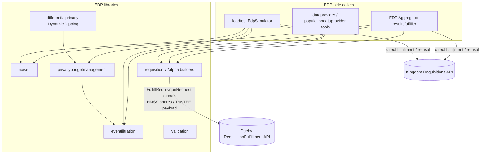
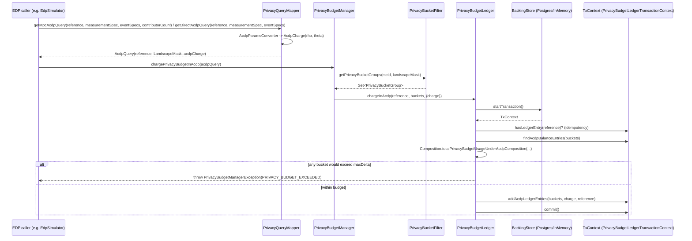

# Event Data Provider Libraries

The Event Data Provider (EDP) libraries are a collection of reusable, mostly
stateless Kotlin components that a Data Provider uses to fulfill Halo
requisitions correctly and privately. They cover four concerns: filtering events
against a market-specific event schema using CEL expressions, adding
differentially private noise, tracking and enforcing a per-EDP privacy budget,
and validating and building the wire-format requests that fulfill a requisition.
These are libraries (reference implementations), not deployable servers: they are
packaged as Maven artifacts and consumed by callers such as the deployable
[EDP Aggregator](./edpaggregator.md) and the load-test `EdpSimulator`. This
subsystem is distinct from the newer
[EDP-Aggregator Privacy Budget Manager](./privacy-budget-manager.md)
(`org.wfanet.measurement.privacybudgetmanager`), which is a separate component.

## Purpose and responsibilities

All code lives under
`src/main/kotlin/org/wfanet/measurement/eventdataprovider/`. The package README
(`.../eventdataprovider/README.md`) states the intent clearly: "The code under
this directory represents processes that happen at individual EDPs and thus are
reference implementations. Any EDP can change the implementation." The libraries
provide:

| Concern | Package | What it does |
| --- | --- | --- |
| Event filtration | `eventfiltration`, `eventfiltration/validation` | Validate and compile CEL filter expressions against an event proto; evaluate an event message against a compiled program. |
| Direct-measurement noise | `noiser` | Sample Laplace/Gaussian DP noise for direct (non-MPC) measurements. |
| Dynamic clipping | `differentialprivacy` | Compute a noised cumulative histogram and an optimized clipping threshold for impression/duration measurements under ACDP. |
| Privacy budget management | `privacybudgetmanagement` (+ `api/v2alpha`, `deploy/common/postgres`) | Map a query to privacy buckets, convert DP params to ACDP charges, and atomically charge/check a persistent ledger. |
| Requisition validation | `validation` | Contract for refusing malformed requisitions; compose multiple validators. |
| Requisition fulfillment helpers | `requisition`, `requisition/v2alpha/...` | Build the `FrequencyVector`, map VIDs to indexes, and construct `FulfillRequisitionRequest` streams for HMSS and TrusTEE protocols. |

## Where it sits in the overall system

These are leaf libraries. They depend on the public v2alpha API protos
(`//src/main/proto/wfa/measurement/api/v2alpha`), `common-jvm`, and the
`any-sketch` frequency-count native code, but no Kingdom or Duchy server depends
on them in the reverse direction. (The Reporting Public API server is an
exception: via `measurementconsumer/stats` it depends on `noiser` and
`privacybudgetmanagement`'s `AcdpParamsConverter` for variance computation.)
Their consumers are the components that actually run at an EDP.

Verified consumers outside the `eventdataprovider` tree include
`edpaggregator/resultsfulfiller/*`, which uses `noiser.DirectNoiseMechanism` (in
`resultsfulfiller/NoiserSelector.kt`, `resultsfulfiller/fulfillers/DirectMeasurementFulfiller.kt`,
and `resultsfulfiller/compute/protocols/direct/*`),
`eventfiltration.EventFilters` (in `resultsfulfiller/FilterProcessor.kt`), and
both `FulfillRequisitionRequestBuilder` variants together with
`FrequencyVectorBuilder` (in
`resultsfulfiller/fulfillers/HMShuffleMeasurementFulfiller.kt` and
`.../TrusTeeMeasurementFulfiller.kt`);
`loadtest/dataprovider/EdpSimulator.kt` (takes a
`privacybudgetmanagement.PrivacyBudgetManager` as a constructor parameter, along
with the nested `FulfillRequisitionRequestBuilder.EncryptionParams` config; its
base class `AbstractEdpSimulator` uses `FrequencyVectorBuilder` and both
`FulfillRequisitionRequestBuilder` variants to build fulfillment requests), and
`reporting/service/api/v2alpha` / `measurementconsumer/stats` (noiser/DP params).
Direct fulfillment/refusal calls flow to the Kingdom's Requisitions API. The
HMSS and TrusTEE `FulfillRequisitionRequest` streams constructed by this
subpackage are sent by callers to Duchy `RequisitionFulfillment` stubs; their
payloads are then consumed by the [Duchies](./duchy.md) (HMSS) or the Duchy-side
TrusTEE protocol.

## Key modules and packages

### Event filtration — `eventfiltration/`

`EventFilters` (`eventfiltration/EventFilters.kt`) is the public entry point. It
compiles a CEL expression against an *event message* descriptor whose fields are
annotated with `wfa.measurement.api.v2alpha.EventTemplateDescriptor`
(`EnvOption.declarations` are derived only from fields whose message type carries
the `EventAnnotationsProto.eventTemplate` extension). `compileProgram` returns a
`org.projectnessie.cel.Program`; `matches(event, program)` evaluates it and
throws `EventFilterException` (`EVALUATION_ERROR` / `INVALID_RESULT`) if the
result is an error or not a boolean.

`EventFilterValidator` (`eventfiltration/validation/EventFilterValidator.kt`)
enforces "Halo rules" on the expression and throws
`EventFilterValidationException` with a specific `Code`
(`INVALID_CEL_EXPRESSION`, `UNSUPPORTED_OPERATION`,
`EXPRESSION_IS_NOT_CONDITIONAL`, `INVALID_OPERATION_OUTSIDE_LEAF`,
`FIELD_COMPARISON_OUTSIDE_LEAF`, `INVALID_VALUE_TYPE`). Only a fixed operator set
is allowed (comparison operators plus `!_`, `_&&_`, `_||_`, and `@in`), lists are
only permitted on the right of `@in`, and field comparisons must occur only at
leaves. An empty expression is treated as the tautology `true == true`.

A notable feature is `operativeFields`. When a non-empty set is supplied,
`toOperativeNegationNormalForm` rewrites the AST into operative negation-normal
form: negations are pushed to the leaves via De Morgan's laws, and any leaf
comparison/presence node referencing a non-operative field is replaced with
`true`. This is what lets the privacy-budget mapper decide which buckets a filter
touches based only on the demographic/VID fields it cares about.

### Noiser — `noiser/`

`Noiser` (`noiser/Noiser.kt`) is a `sample(): Double` + `variance` interface.
`AbstractNoiser` backs it with an Apache Commons Math `RealDistribution`.
`LaplaceNoiser` uses scale `1 / epsilon`; `GaussianNoiser` solves for sigma given
`(epsilon, delta)` via bisection over the survival-function equation (Theorem 8
of the referenced analytic-Gaussian paper) and memoizes results in a
`ConcurrentHashMap<DpParams, Double>`. The same file defines `DpParams(epsilon,
delta)` and the `DirectNoiseMechanism` enum (`NONE` [testing only],
`CONTINUOUS_LAPLACE`, `CONTINUOUS_GAUSSIAN`).

### Dynamic clipping — `differentialprivacy/`

`DynamicClipping` (`differentialprivacy/DynamicClipping.kt`) implements the
clipping algorithm for `IMPRESSION` and `DURATION` measurements. Given an ACDP
`rho` and a frequency histogram it produces a
`Result(noisedCumulativeHistogramList, threshold)`, adding continuous Gaussian
noise scaled by
`BAR_SENSITIVITY * sqrt(maxThreshold / (2*rho))` and refining the threshold and
the "remaining" privacy charge to improve accuracy below the threshold. It
requires Gaussian noise and ACDP composition. (No production caller in this repo
currently references it; it lives here as a reference implementation.)

### Privacy budget management — `privacybudgetmanagement/`

This is the largest module. See the [Data model](#data-model-and-storage) and
[Cryptography/privacy](#cryptography-and-privacy-mechanisms) sections for the
ledger and ACDP math. Core types:

* `PrivacyBudgetManager` (`.../PrivacyBudgetManager.kt`) — top-level façade over a
  `PrivacyBucketFilter` and a `PrivacyBudgetLedgerBackingStore`, with default per-bucket
  caps declared as `Float` constants (`MAXIMUM_PRIVACY_USAGE_PER_BUCKET = 1.0f`,
  `MAXIMUM_DELTA_PER_BUCKET = 1.0e-9f`); the `maximumPrivacyBudget` /
  `maximumTotalDelta` constructor params are also `Float`.
* `PrivacyBucketGroup` (`.../PrivacyBucketGroup.kt`) — a set of users tracked as a
  unit: `(measurementConsumerId, startingDate, endingDate, ageGroup, gender,
  vidSampleStart, vidSampleWidth)`, with `overlapsWith` treating VID ranges as
  half-open. `AgeGroup` and `Gender` enums are defined here.
* `PrivacyLandscape` (`.../PrivacyLandscape.kt`) — the fixed bucket grid: 300 VID
  intervals of width `1/300`, a 1-year `datePeriod`, and all age/gender values.
* `PrivacyBucketFilter` / `PrivacyBucketMapper` — map a `LandscapeMask` to the set
  of `PrivacyBucketGroup`s a query touches, using CEL `operativeFields` to test
  each candidate bucket. The `PrivacyBucketMapper` interface is the extension
  point for changing the bucket definition.
* `PrivacyQuery.kt` — value types: `AcdpCharge(rho, theta)`, `Reference`,
  `EventGroupSpec`, `LandscapeMask`, `AcdpQuery`.
* `Composition.kt` — ACDP composition; `AcdpParamsConverter.kt` — converts
  per-query `(epsilon, delta)` into `(rho, theta)` for MPC and direct measurements.

### Requisition validation — `validation/`

`RequisitionValidator` (`validation/RequisitionValidator.kt`) is a functional
interface: `validate(requisition, requisitionSpec): List<Requisition.Refusal>`
(empty means valid). `CompoundValidator` (`validation/CompoundValidator.kt`) runs
a chain of validators and flattens their refusals. The library ships the contract
only; concrete validators are supplied by callers.

### Requisition fulfillment helpers — `requisition/`

* `FrequencyVectorBuilder` (`requisition/v2alpha/common/FrequencyVectorBuilder.kt`)
  — builds an appropriately sized `org.wfanet.frequencycount.FrequencyVector` for a
  `MeasurementSpec` + `PopulationSpec`. It clamps per-VID frequency to the
  measurement's max (1 for Reach, `maximumFrequency` for R&F,
  `maximumFrequencyPerUser` for Impression), applies the VID sampling interval
  (including the wrap-around case), and offers `increment*` methods plus two
  secondary constructors that seed from either another `FrequencyVector` or a raw
  `ByteArray` (each byte an unsigned 0-255 frequency). Internally the frequency
  counts are held in an `IntArray` (`frequencyData`), exposed via the
  `frequencyDataArray` getter.
* `VidIndexMap` (`requisition/v2alpha/common/VidIndexMap.kt`) — interface mapping a
  VID to its `FrequencyVector` index for a `PopulationSpec`. VIDs are ordered by a
  FarmHash fingerprint of `(vid || HASH_SALT)`. Implementations:
  `InMemoryVidIndexMap` (sequential, `HashMap`) and `ParallelInMemoryVidIndexMap`
  (coroutine-sharded hashing into a FastUtil `Int2IntOpenHashMap` for large
  populations). `InMemoryVidIndexMap` can also be built from a
  `Flow<VidIndexMapEntry>` (`suspend fun build(populationSpec, indexMapEntries)`),
  validating consistency against the `PopulationSpec` and throwing
  `InconsistentIndexMapAndPopulationSpecException` on mismatch.
  `ParallelInMemoryVidIndexMap` only supports `build(populationSpec, partitionCount)`
  and has no Flow-based constructor or index-map consistency check.
* `requisition/v2alpha/shareshuffle/FulfillRequisitionRequestBuilder.kt` and
  `requisition/v2alpha/trustee/FulfillRequisitionRequestBuilder.kt` —
  protocol-specific request builders (see
  [workflows](#key-workflows-and-sequences)).
* `Native.kt` (`requisition/Native.kt`) — a `NativeLibraryLoader` for
  `libsecret_share_generator_adapter.so`, the native dependency required by the
  HMSS builder.

## Services and daemons

None. This subsystem contains no gRPC services, servers, or daemon entry points.
It is a set of libraries invoked in-process by EDP-side components. The
`FulfillRequisitionRequestBuilder` classes only *construct* the request messages;
the gRPC streaming call to a Duchy's `RequisitionFulfillment` API is made by the
caller.

## Data model and storage

Only the privacy-budget-management module has persistent state. It defines an
abstract ledger and one reference SQL implementation.

**Backing-store contract** (`privacybudgetmanagement/PrivacyBudgetLedgerBackingStore.kt`):
`PrivacyBudgetLedgerBackingStore.startTransaction()` returns a
`PrivacyBudgetLedgerTransactionContext` that guarantees ACID semantics for:
`findAcdpBalanceEntry(s)`, `addAcdpLedgerEntries`, `hasLedgerEntry`, and
`commit`. Row value types are `PrivacyBudgetAcdpBalanceEntry(privacyBucketGroup,
acdpCharge)` and `PrivacyBudgetLedgerEntry(measurementConsumerId, referenceId,
isRefund, createTime)`.

**Reference implementations:**

* `InMemoryBackingStore` (`.../InMemoryBackingStore.kt`) — map-backed, not
  thread-safe; suitable for small MC counts, single-run estimation, or tests.
* `PostgresBackingStore`
  (`.../deploy/common/postgres/PostgresBackingStore.kt`) — JDBC-based Postgres
  implementation. It runs a manual `begin transaction` and disallows nested
  transactions; its own `close()` only closes the connection, while it is
  `PostgresBackingStoreTransactionContext.close()` that rolls the transaction back.

**Postgres schema** (`.../deploy/common/postgres/ledger.sql`):

| Table | Key columns | Purpose |
| --- | --- | --- |
| `PrivacyBucketAcdpCharges` | PK `(MeasurementConsumerId, Date, AgeGroup, Gender, VidStart)`, plus `Rho`, `Theta` | One row per privacy bucket holding the aggregated ACDP charge. Charges are added with an `ON CONFLICT ... DO UPDATE` upsert. |
| `LedgerEntries` | columns `(MeasurementConsumerId, ReferenceId, IsRefund, CreateTime)` (no PK), indexed by `(MeasurementConsumerId, ReferenceId)` | Timestamped record of each charge/refund transaction, used for idempotency/replay detection. |

`Gender` and `AgeGroup` are Postgres enum types. Notably this ledger is keyed on
the external `MeasurementConsumerId` (not a database internal ID) and stores no
serialized-row `Details` proto — it is an EDP-local store, separate from the
Kingdom/Duchy Spanner databases.

The only proto owned by this subsystem is `VidIndexMapEntry`
(`src/main/proto/wfa/measurement/eventdataprovider/shareshuffle/vid_index_map_entry.proto`),
a serialization helper carrying `key` (the VID) and a nested `Value` message
holding `index` and `unit_interval_value`, so a client can filter VIDs against a
`VidSamplingInterval`. It is not a DB-row `Details` message.

## API surface

This subsystem exposes a Kotlin/Maven library API rather than a network API. It
*consumes* the public v2alpha protos (`MeasurementSpec`, `RequisitionSpec`,
`Requisition`, `PopulationSpec`, `FulfillRequisitionRequest`), plus the
any-sketch `FrequencyVector` proto (`org.wfanet.frequencycount.FrequencyVector`,
Bazel target `//src/main/proto/wfa/frequency_count:frequency_vector_kt_jvm_proto`,
a `kt_jvm_proto_library` wrapping
`@any_sketch//src/main/proto/wfa/frequency_count:frequency_vector_proto` via
`deps`, not an `alias`).
Several targets are published as Maven artifacts (see their `BUILD.bazel`
`maven_coordinates` tags):

| Artifact | Target |
| --- | --- |
| `...eventdataprovider:requisition-common-v2alpha` | `requisition/v2alpha/common:common` |
| `...eventdataprovider:requisition-shareshuffle-v2alpha` | `requisition/v2alpha/shareshuffle:shareshuffle` |
| `...eventdataprovider:requisition-trustee-v2alpha` | `requisition/v2alpha/trustee:trustee` |
| `...eventdataprovider:requisition-native` | `requisition:native` (bundles the `.so`) |

The `api/v2alpha` subpackage (`privacybudgetmanagement/api/v2alpha/PrivacyQueryMapper.kt`)
is a version-specific adapter that maps v2alpha `MeasurementSpec`/`RequisitionSpec`
messages into the version-agnostic `AcdpQuery` used by the rest of the PBM module.

## Key workflows and sequences

### Charging the privacy budget for a requisition

`chargingWillExceedPrivacyBudgetInAcdp` performs the same check without writing.
Idempotency and refunds hinge on `Reference(measurementConsumerId, referenceId,
isRefund)`: if the most recent `LedgerEntries` row for a `(MC, reference)` pair
already matches the requested `isRefund`, the charge is treated as already
processed and skipped.

### Building a HMSS (Honest Majority Share Shuffle) fulfillment

`shareshuffle/FulfillRequisitionRequestBuilder`:

1. Validate the `Requisition` carries exactly one `HonestMajorityShareShuffle`
   protocol config (with `ringModulus > 1`) and exactly two duchy entries, one of
   which supplies the share-seed encryption public key.
2. Call the native `SecretShareGeneratorAdapter.generateSecretShares` on the
   `FrequencyVector` data (modulo `ringModulus`) to produce a `SecretShare` (a
   share vector plus a share seed).
3. Sign the share seed with the EDP's `SigningKeyHandle` and encrypt it to the
   Duchy's public key (`consent.client.dataprovider.signRandomSeed` /
   `encryptRandomSeed`).
4. Emit a `Sequence<FulfillRequisitionRequest>`: a header (requisition
   fingerprint, nonce, encrypted `secretSeed`, `registerCount`, DP certificate)
   followed by 32 KiB `bodyChunk`s of the share vector.

### Building a TrusTEE fulfillment

`trustee/FulfillRequisitionRequestBuilder`:

1. Validate exactly one `TrusTee` protocol config and a non-empty
   `FrequencyVector`; pack the vector into a `ByteArray` (each value 0-255).
2. If no `EncryptionParams`, emit an unencrypted header
   (`DataFormat.FREQUENCY_VECTOR`) plus 32 KiB `bodyChunk`s.
3. If `EncryptionParams` are given, generate a Tink DEK
   (`AES256_GCM_HKDF_1MB`), wrap it with the KMS KEK (envelope encryption), emit a
   header with `DataFormat.ENCRYPTED_FREQUENCY_VECTOR` and the `envelopeEncryption`
   metadata (encrypted DEK as a `TINK_ENCRYPTED_KEYSET`, KEK URI, workload
   identity provider, impersonated service account, optional AWS KMS params), then
   stream the payload via `StreamingEncryption.encryptChunked`.

## Cryptography and privacy mechanisms

* **Direct DP noise** — `LaplaceNoiser` / `GaussianNoiser` sample calibrated noise
  for direct measurements; the Gaussian sigma solver is memoized.
* **ACDP accounting** — the budget is tracked in Almost-Concentrated Differential
  Privacy `(rho, theta)` space. `AcdpParamsConverter` converts per-query
  `(epsilon, delta)` to `(rho, theta)`: `getMpcAcdpCharge` accounts for the
  distributed discrete-Gaussian noise across `contributorCount` Duchies, while
  `getDirectAcdpCharge` sets `theta = 0` and derives `rho` from the Gaussian sigma.
  This conversion is Gaussian-only. `Composition.totalPrivacyBudgetUsageUnderAcdpComposition`
  optimizes over the Rényi order alpha (via a `BrentOptimizer`) to compute the
  total delta at the target epsilon; the ledger rejects a charge if that exceeds
  the bucket's max delta.
* **Envelope encryption (TrusTEE)** — the TrusTEE builder uses a Tink DEK wrapped
  by a KMS KEK, using only top-level Tink APIs and registering
  `AeadConfig`/`StreamingAeadConfig` in the companion `init` block, consistent with
  the project's [security standards](../../security-standards.md).
* **Secret sharing (HMSS)** — the frequency vector is split into additive secret
  shares by the native adapter, and only an encrypted, signed seed for the peer
  share travels in the request header.

## Deployment artifacts

There are no Kubernetes manifests specific to this subsystem — it ships no
servers. The one deployment-flavored artifact is the Postgres reference ledger
under `privacybudgetmanagement/deploy/common/postgres/` (schema + JDBC backing
store). It is "cloud-agnostic" Postgres-compatible SQL; the newer PBM
implementation under `org.wfanet.measurement.privacybudgetmanager/deploy/{postgres,gcloud}`
is a separate component and is not part of these libraries. The requisition
libraries are shipped as Maven artifacts (including the `requisition-native`
artifact that bundles `libsecret_share_generator_adapter.so`, per
`requisition/v2alpha/README.md`).

## Testing approach

Tests mirror `src/main/` under
`src/test/kotlin/org/wfanet/measurement/eventdataprovider/` and exercise the
public contracts with Truth assertions. Highlights:

* Filtration: `eventfiltration/EventFiltersTest.kt` and
  `eventfiltration/validation/EventFilterValidatorTest.kt`.
* Noise/DP: `noiser/GaussianNoiserTest.kt`, `noiser/LaplaceNoiserTest.kt`,
  `differentialprivacy/DynamicClippingTest.kt`,
  `privacybudgetmanagement/CompositionTest.kt`,
  `privacybudgetmanagement/AcdpParamsConverterTest.kt`.
* PBM: `PrivacyBudgetManagerTest.kt`, `PrivacyBudgetLedgerTest.kt`,
  `PrivacyBucketFilterTest.kt`, `PrivacyBucketGroupTest.kt`, plus store tests
  (`InMemoryBackingStoreTest.kt`, `deploy/common/postgres/PostgresBackingStoreTest.kt`,
  `PrivacyBudgetPostgresSchemaTest.kt`).
* Requisition: `AbstractVidIndexMapTest.kt` shared across
  `InMemoryVidIndexMapTest.kt` / `ParallelInMemoryVidIndexMapTest.kt`,
  `FrequencyVectorBuilderTest.kt`, and a `FulfillRequisitionRequestBuilderTest.kt`
  for each protocol.

Reusable test infrastructure is marked `testonly` under `.../testing/`
subpackages, e.g. `privacybudgetmanagement/testing/` provides
`TestInMemoryBackingStore`, `TestPrivacyBucketMapper`,
`AlwaysChargingPrivacyBucketMapper`, and the shared
`AbstractPrivacyBudgetLedgerStoreTest`, so any new backing-store implementation can
be verified against the same contract.

## Notable design decisions and gotchas

* **Reference implementations, not mandates.** The README is explicit that an EDP
  may replace any of this. The `PrivacyBucketMapper`, `PrivacyBudgetLedgerBackingStore`,
  and `RequisitionValidator` interfaces are the intended extension points, and the
  README documents how to change the bucket definition or the accounting
  granularity (e.g. event-group-level).
* **Two `PrivacyBudgetManager` classes exist.** The library one is
  `org.wfanet.measurement.eventdataprovider.privacybudgetmanagement.PrivacyBudgetManager`;
  a different, newer implementation lives at
  `org.wfanet.measurement.privacybudgetmanager.PrivacyBudgetManager` (see the
  [Privacy Budget Manager](./privacy-budget-manager.md)). They are not the
  same component — do not conflate them.
* **ACDP/Gaussian coupling.** The ledger and converters only support Gaussian
  (or discrete-Gaussian) noise under ACDP composition; `AcdpParamsConverter` has a
  TODO to take the noise type into account, and `PrivacyBudgetManagerException` has
  an `INCORRECT_NOISE_MECHANISM` code for this.
* **`operativeFields` drive bucketing.** Bucket selection reuses the CEL filter
  machinery: the mapper compiles the filter with only the demographic/VID fields
  as operative, so non-operative predicates collapse to `true` and the query is
  conservatively charged against every bucket it *could* touch.
* **Native dependency for HMSS.** The share-shuffle builder needs
  `libsecret_share_generator_adapter.so`; use the `requisition-native` artifact or
  build `@any_sketch_java//...:secret_share_generator_adapter` yourself. `Native.kt`
  loads it from the JAR by resource name.
* **Idempotency is best-effort under concurrency.** `hasLedgerEntry` only inspects
  the most recent `(MC, reference)` row, so multiple in-flight entries with the
  same reference can produce an inaccurate result (documented in the backing-store
  interface).
* **Postgres store is JDBC-blocking.** `PostgresBackingStore` carries TODOs to
  move to R2DBC and to run blocking IO on an appropriate dispatcher.
* **VID limits.** VIDs must be `< Integer.MAX_VALUE` (enforced by a `require`
  check in `VidIndexMap`/`InMemoryVidIndexMap`/`ParallelInMemoryVidIndexMap`) and
  populations up to ~2B are supported (per the `VidIndexMapEntry` proto comment:
  "Only populations of up to about 2B are supported"); `FrequencyVectorBuilder`
  requires population size `< Int.MAX_VALUE`.

## See also

* [EDP Aggregator](./edpaggregator.md) — the deployable component that fulfills
  requisitions using these libraries.
* [Duchy](./duchy.md) — consumes HMSS fulfillment payloads.
* [Security & Cryptography Standards](../../security-standards.md) — Tink and
  envelope-encryption conventions applied by the TrusTEE builder.
