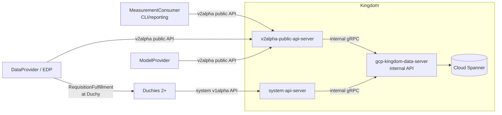
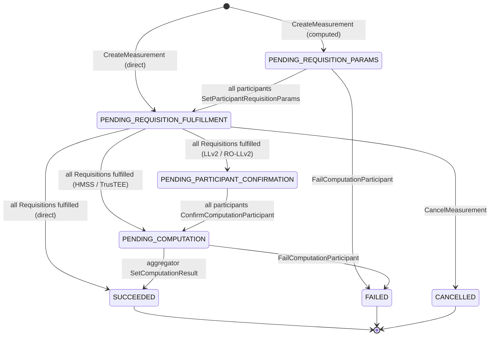

# Kingdom

The **Kingdom** is the central coordinator of the WFA Cross-Media Measurement
system. It owns the entity registry (`DataProvider`s, `MeasurementConsumer`s,
`Certificate`s, `ModelProvider`s / `ModelLine`s, `Account`s, `ApiKey`s), drives
the `Measurement` lifecycle state machine, tracks `Requisition`s, and
coordinates the `Duchy` computation participants that jointly run the
privacy-preserving multi-party computation (MPC). It is the only component that
talks to the Kingdom Spanner database; everything else reaches it through gRPC.
The Kingdom exposes three distinct API layers — a **public v2alpha API** for
external callers, a **system v1alpha API** for Duchies, and an **internal API**
that fronts Spanner — and runs a handful of batch/cron jobs for retention and
metrics.

## 1. Purpose and Responsibilities

*   **Entity registration and management.** Registers and serves
    `MeasurementConsumer`s, `DataProvider`s, `Certificate`s (for consent
    signaling), `ModelProvider`s and their `ModelSuite`/`ModelLine`/
    `ModelRelease`/`ModelRollout`/`ModelShard`/`ModelOutage` hierarchy,
    `Account`s, and `ApiKey`s.
*   **Measurement lifecycle.** Creates `Measurement`s, drives them through a
    state machine (see [Section 7](#7-key-workflows)), and stores the final
    encrypted result.
*   **Requisition tracking.** Materializes one `Requisition` per
    `DataProvider` (per protocol) for each `Measurement`, exposes unfulfilled
    `Requisition`s to `DataProvider`s, and records fulfillment/refusal.
*   **Computation-participant coordination.** Creates a
    `ComputationParticipant` per participating `Duchy`, collects requisition
    params and confirmations, and advances the parent `Measurement` when all
    participants agree.
*   **Data-exchange orchestration.** Manages `RecurringExchange`s,
    `Exchange`s, `ExchangeStep`s and `ExchangeStepAttempt`s for panel-matching
    workflows between `ModelProvider`s and `DataProvider`s.
*   **Authoritative storage.** Hosts the internal Cloud Spanner database that
    holds all of the above. Internal database IDs are never exposed outside the
    internal API servers; external IDs (random `INT64`s) are used in all
    public/system resource names.

## 2. Where It Sits in the System



*   **Callers of the public API:** `MeasurementConsumer`s (create measurements,
    read results), `DataProvider`s (register, list/fulfill/refuse
    requisitions), and `ModelProvider`s (model/exchange management).
*   **Callers of the system API:** the `Duchy`s. They set requisition params,
    confirm participation, report computation progress, fulfill computed
    requisitions, and set the final computation result.
*   **What the Kingdom calls:** effectively nothing outbound over gRPC — the
    Kingdom is a coordinator that other components poll/stream. The public and
    system servers are gRPC clients only of the Kingdom's own internal data
    server. (The `MeasurementSystemProber` job is an exception: it acts as a
    synthetic `MeasurementConsumer` and calls the public API.)

See the sibling [Duchy](./duchy.md) doc for the MPC side, the
[Measurement Lifecycle](../crosscutting/measurement-lifecycle.md) for identity
and consent signaling, and [API & Protobuf Layer](./api-and-protos.md) for
resource naming.

## 3. Key Modules and Packages

| Path | Contents |
| --- | --- |
| `src/main/kotlin/org/wfanet/measurement/kingdom/service/api/v2alpha` | Public API service implementations (23 services) |
| `src/main/kotlin/org/wfanet/measurement/kingdom/service/system/v1alpha` | System API services used by Duchies |
| `src/main/kotlin/org/wfanet/measurement/kingdom/service/internal/testing` | Contract test suites for the internal services |
| `src/main/kotlin/org/wfanet/measurement/kingdom/deploy/common/server` | Cloud-agnostic server entry points (`KingdomDataServer`, `SystemApiServer`, `V2alphaPublicApiServer`) |
| `src/main/kotlin/org/wfanet/measurement/kingdom/deploy/common/service` | `DataServices` / `KingdomDataServices` abstraction over the internal services |
| `src/main/kotlin/org/wfanet/measurement/kingdom/deploy/common/job` | Cloud-agnostic batch/cron job entry points |
| `src/main/kotlin/org/wfanet/measurement/kingdom/deploy/gcloud/spanner` | Spanner-backed implementations of every internal service, plus `readers/`, `writers/`, `queries/`, `common/` |
| `src/main/kotlin/org/wfanet/measurement/kingdom/deploy/gcloud/server` | `SpannerKingdomDataServer` (Spanner wiring of the internal API) |
| `src/main/kotlin/org/wfanet/measurement/kingdom/deploy/gcloud/job` | `OperationalMetricsExport` job (BigQuery) |
| `src/main/kotlin/org/wfanet/measurement/kingdom/batch` | Batch logic (prober, retention cleanup) |
| `src/main/kotlin/org/wfanet/measurement/kingdom/deploy/tools` | Operator CLI tools (`CreateResource`, `ModelRepository`) |
| `src/main/proto/wfa/measurement/internal/kingdom` | Internal API service + entity + `*Details` protos |
| `src/main/proto/wfa/measurement/system/v1alpha` | System API protos (`Computation`, `ComputationParticipant`, `Requisition`, `ComputationLogEntry`) |
| `src/main/proto/wfa/measurement/api/v2alpha` | Public API protos (shared across the whole system) |
| `src/main/resources/kingdom/spanner` | Liquibase-formatted Spanner DDL (schema + migrations) |

## 4. Services and Daemons

The Kingdom is deployed as three long-running gRPC servers plus several jobs.
The two "edge" servers (public, system) translate between public/system API
resource names and internal external-IDs, then call the internal data server,
which is the only process that touches Spanner.

### 4.1 Internal data server

*   **Entry point:** `SpannerKingdomDataServer`
    (`.../deploy/gcloud/server/SpannerKingdomDataServer.kt`), extending the
    abstract `KingdomDataServer`
    (`.../deploy/common/server/KingdomDataServer.kt`).
*   **k8s name:** `gcp-kingdom-data-server` (not externally exposed).
*   Builds all internal services by calling `buildDataServices()` on a
    `DataServices` instance — here a `SpannerDataServices`
    (`.../deploy/gcloud/spanner/SpannerDataServices.kt`), invoked as
    `dataServices.buildDataServices(...)` in `KingdomDataServer.kt`. That
    instance method instantiates 26 `Spanner*Service` classes into a
    `KingdomDataServices` record. Each service takes an `IdGenerator` (random
    external + internal IDs), an `AsyncDatabaseClient`, and a coroutine context.
*   Loads deployment config from flags at startup: `DuchyInfo`, `DuchyIds`, and
    the per-protocol configs `Llv2ProtocolConfig`, `RoLlv2ProtocolConfig`,
    `HmssProtocolConfig`, `TrusTeeProtocolConfig`.

### 4.2 Public v2alpha API server

*   **Entry point:** `V2alphaPublicApiServer`
    (`.../deploy/common/server/V2alphaPublicApiServer.kt`), k8s name
    `v2alpha-public-api-server` (`#ExternalService`).
*   Wires 23 public services (`AccountsService`, `ApiKeysService`,
    `CertificatesService`, `ClientAccountsService`, `DataProvidersService`,
    `EventGroupsService`, `EventGroupActivitiesService`,
    `EventGroupMetadataDescriptorsService`, `MeasurementsService`,
    `MeasurementConsumersService`, `PublicKeysService`, `RequisitionsService`,
    `ExchangesService`, `ExchangeStepsService`, `ExchangeStepAttemptsService`,
    and the `Model*`/`Populations` services), each as a gRPC client of the
    internal data server over mutual TLS.
*   Installs a stack of interceptors: `AccountAuthenticationServerInterceptor`
    (OpenID-based account auth), `ApiKeyAuthenticationServerInterceptor`
    (`MeasurementConsumer` API keys), `AuthorityKeyServerInterceptor`
    (extracts the mTLS client certificate's authority-key-identifier into the
    request context) + `AkidPrincipalServerInterceptor` (maps that AKID to a
    principal via `AkidPrincipalLookup`, configured with
    `--authority-key-identifier-to-principal-map-file`),
    `RateLimitingServerInterceptor`, and `ApiChangeMetricsInterceptor`.
*   Protocol enablement is flag-driven: `--enable-ro-llv2-protocol`,
    `--enable-hmss`, `--enable-trustee`, plus per-`MeasurementConsumer`
    allowlists and `--direct-noise-mechanism` for direct measurements.

### 4.3 System v1alpha API server (for Duchies)

*   **Entry point:** `SystemApiServer`
    (`.../deploy/common/server/SystemApiServer.kt`), k8s name
    `system-api-server` (`#ExternalService`).
*   Wires exactly four services (see
    `.../service/system/v1alpha/`):
    *   `ComputationsService` — `GetComputation`, `StreamActiveComputations`
        (long-lived stream of non-terminal computations, driven by a
        continuation token), `SetComputationResult`.
    *   `ComputationParticipantsService` —
        `SetParticipantRequisitionParams`, `ConfirmComputationParticipant`,
        `FailComputationParticipant`, `GetComputationParticipant`.
    *   `RequisitionsService` — `FulfillRequisition` (for computed protocols).
    *   `ComputationLogEntriesService` — Duchy progress/status logging.
*   These map onto the internal `Measurements`, `ComputationParticipants`,
    `Requisitions`, and `MeasurementLogEntries` services.

### 4.4 Jobs

Cloud-agnostic job wrappers live in `.../deploy/common/job`; the Spanner/GCP
wiring for `OperationalMetricsExport` lives in `.../deploy/gcloud/job`.

| Job | Batch logic | k8s | What it does |
| --- | --- | --- | --- |
| `PendingMeasurementsCancellationJob` | `batch/PendingMeasurementsCancellation.kt` | cron `pending-measurements-cancellation` | Cancels `Measurement`s stuck in a pending state past a TTL, in batches of up to 1000 via `BatchCancelMeasurements`. Supports a dry-run mode. |
| `CompletedMeasurementsDeletionJob` | `batch/CompletedMeasurementsDeletion.kt` | cron `completed-measurements-deletion` (`15 * * * *`) | Permanently deletes terminal `Measurement`s past a retention TTL. |
| `ExchangesDeletionJob` | `batch/ExchangesDeletion.kt` | cron `exchanges-deletion` | Retention cleanup for `Exchange`s. |
| `MeasurementSystemProberJob` | `batch/MeasurementSystemProber.kt` | CronJob `measurement-system-prober` (`* * * * *`, `src/main/k8s/measurement_system_prober.cue`) | Synthetic `MeasurementConsumer` that periodically creates a reach-and-frequency `Measurement` against the public API and emits OpenTelemetry gauges for the freshness of the last terminal measurement/requisition (pipeline health monitoring). |
| `OperationalMetricsExportJob` | `deploy/gcloud/job/OperationalMetricsExport.kt` | CronJob `operational-metrics` (`30 * * * *`, `src/main/k8s/dev/kingdom_gke.cue`) | Streams `Measurement`s / `Requisition`s / computation-participant stages from the internal API into BigQuery tables (`bigquerytables/*` protos) for operational analytics, tracking a "latest read" watermark. |

## 5. Data Model and Storage

The Kingdom's authoritative store is a single Cloud Spanner database. The
schema is defined in Liquibase-formatted DDL under
`src/main/resources/kingdom/spanner/`, with the core tables in
`create-measurement-schema.sql`, the exchange tables (including
`ModelProviders`) in `create-exchange-schema.sql`, and the VID-model
distribution tables (`ModelSuites`, `ModelLines`, `ModelReleases`,
`ModelRollouts`, `ModelShards`, `ModelOutages`) in
`create-vid-model-distribution-schema.sql`. Numerous `add-*` / `create-*` files
are incremental migrations, all wired together by `changelog.yaml`.

### 5.1 Table hierarchy (measurement schema)

```
Root
├── Certificates                       (X.509 for consent signaling)
├── DataProviders
│   ├── DataProviderCertificates
│   ├── EventGroups
│   └── EventGroupMetadataDescriptors
├── DuchyCertificates
├── MeasurementConsumerCreationTokens
├── MeasurementConsumers
│   ├── MeasurementConsumerApiKeys
│   ├── MeasurementConsumerCertificates
│   └── Measurements
│       ├── ComputationParticipants
│       ├── Requisitions
│       ├── MeasurementLogEntries
│       │   └── DuchyMeasurementLogEntries
│       └── DuchyMeasurementResults
└── Accounts
    ├── OpenIdConnectIdentities
    ├── OpenIdRequestParams (root-level)
    └── MeasurementConsumerOwners
```

The exchange schema (`create-exchange-schema.sql`) adds a parallel tree rooted
at `ModelProviders` (`ModelProviderCertificates`) plus `RecurringExchanges` →
`Exchanges` → `ExchangeSteps` → `ExchangeStepAttempts`. The VID-model
distribution schema (`create-vid-model-distribution-schema.sql`) hangs the
model-management hierarchy off the same `ModelProviders` root: `ModelSuites` →
(`ModelLines` → (`ModelRollouts`, `ModelOutages`), `ModelReleases`), with
`ModelShards` interleaved under `DataProviders`.

Child tables use Spanner `INTERLEAVE IN PARENT ... ON DELETE CASCADE` so that a
`Measurement` and all of its `Requisitions`, `ComputationParticipants`, and log
entries live in one row family and are deleted atomically.

### 5.2 Key design conventions

*   **Dual IDs.** Every entity has an internal random `INT64` primary key (e.g.
    `MeasurementId`) and a separate `External*Id` used in API resource names.
    Internal IDs never leave the internal API. `Measurement`s additionally have
    an `ExternalComputationId`, a globally-unique ID exposed via the system API
    so Duchies can reference a `Measurement` without knowing its parent
    `MeasurementConsumer`.
*   **No `Duchies` table.** The set of Duchies is fixed per deployment via
    config (`DuchyInfo` / `DuchyIds`), not stored in the DB. Only
    `DuchyCertificates` are persisted.
*   **`*Details` protos = serialized rows.** Per project convention, the
    serialized portion of a row is a protobuf whose name ends in `Details`,
    stored in a `BYTES(MAX)` column. Examples:
    `MeasurementDetails` (`measurement_details.proto`),
    `RequisitionDetails` (`requisition_details.proto`),
    `ComputationParticipantDetails`, `CertificateDetails`,
    `DataProviderDetails` (holds `public_key`, `data_availability_interval`,
    `DataProviderCapabilities`), `MeasurementConsumerDetails`,
    `EventGroupDetails`, `MeasurementLogEntryDetails`
    (`measurement_log_entry_details.proto`), `DuchyMeasurementLogEntryDetails`
    (`duchy_measurement_log_entry_details.proto`), `RecurringExchangeDetails`,
    `ExchangeDetails`, `PopulationDetails`.
*   **State + `UpdateTime` indexes.** `MeasurementsByContinuationToken`
    (`MeasurementIndexShardId, UpdateTime, ExternalComputationId, State`,
    `NULL_FILTERED`) and `RequisitionsByState (DataProviderId, State)` let workers
    efficiently find work to do. (The base schema's `MeasurementsByState (State,
    UpdateTime)` index was dropped and replaced by
    `MeasurementsByContinuationToken` in a later migration, then sharded and
    null-filtered to avoid hotspotting.) The Requisition *data* itself is stored
    at the Duchy — the Kingdom only tracks state and metadata.
*   **Uniqueness indexes** enforce external-ID lookups and idempotency (e.g.
    `MeasurementsByCreateRequestId`, `MeasurementsByExternalComputationId`,
    `CertificatesBySubjectKeyIdentifier`,
    `MeasurementConsumerApiKeysByAuthenticationKeyHash`).

There is no blob/GCS storage in the Kingdom itself; large encrypted payloads
(requisition specs, results) are stored inline in Spanner columns or at the
Duchy.

## 6. API Surface

The three layers are deliberately separated so that database internals stay
private and Duchies get a narrower contract than external callers.

### 6.1 Public v2alpha API (`api/v2alpha`)

AIP-compliant CRUD + custom methods for external callers. Resource names use
external IDs (e.g. `measurementConsumers/{id}/measurements/{id}`). Auth is via
`MeasurementConsumer` API keys, OpenID accounts, and/or mTLS client
certificates mapped to principals. Notable service:
`MeasurementsService` validates request structure (checking that the
`MeasurementSpec` is well-formed and that each `encrypted_requisition_spec`
contains a `SignedMessage`) and resolves the
per-`MeasurementConsumer`-enabled protocol before delegating to the internal
`Measurements` service.

### 6.2 System v1alpha API (`system/v1alpha`)

The Duchy-facing contract. Resources are typed under
`halo-system.wfanet.org` (`Computation`, `ComputationParticipant`,
`Requisition`, `ComputationLogEntry`). Methods are mostly
[AIP-216 state-transition](https://google.aip.dev/216) methods rather than
standard CRUD (e.g. `SetParticipantRequisitionParams`,
`ConfirmComputationParticipant`, `FailComputationParticipant`,
`FulfillRequisition`, `SetComputationResult`).

### 6.3 Internal API (`internal/kingdom`)

The Spanner-backed contract, called by the two edge servers (public v2alpha
and system v1alpha) and by the Kingdom's batch/cron jobs
(`CompletedMeasurementsDeletionJob`, `PendingMeasurementsCancellationJob`,
`ExchangesDeletionJob`, `OperationalMetricsExportJob`), which each open a
direct mutual-TLS gRPC channel to the internal data server via
`--internal-api-target`. Works entirely in terms of external IDs and full
entity protos with `View`s (e.g.
`Measurement.View.{DEFAULT, COMPUTATION, COMPUTATION_STATS}`). Services include
`Measurements`, `Requisitions`, `ComputationParticipants`,
`MeasurementLogEntries`, `DataProviders`, `MeasurementConsumers`,
`Certificates`, `Accounts`, `ApiKeys`, `EventGroups`, `PublicKeys`,
`RecurringExchanges`, `Exchanges`, `ExchangeSteps`, `ExchangeStepAttempts`,
and the `Model*`/`Populations` services. Internal-only error taxonomy lives in
`internal/kingdom/error_code.proto` (e.g. `MEASUREMENT_STATE_ILLEGAL`,
`COMPUTATION_PARTICIPANT_ETAG_MISMATCH`, `DUCHY_NOT_ACTIVE`).

The internal `Measurements` service illustrates the shape: `CreateMeasurement`,
`GetMeasurementByComputationId`, `StreamMeasurements` (ordered by
`(update_time, key)` for worker cursoring), `SetMeasurementResult`,
`CancelMeasurement`, and `Batch*` variants
(`src/main/proto/wfa/measurement/internal/kingdom/measurements_service.proto`).

## 7. Key Workflows

### 7.1 Measurement lifecycle state machine

`Measurement.State` (`internal/kingdom/measurement.proto`) is the heart of the
Kingdom. The path depends on the protocol (`ProtocolConfig`): MPC protocols
(Liquid Legions V2, Reach-Only LLv2, Honest Majority Share Shuffle, TrusTEE) go
through Duchy coordination; `DIRECT` measurements skip it.



Step-by-step for a computed (MPC) measurement:

1.  **Create.** A `MeasurementConsumer` calls public `CreateMeasurement` with a
    signed `MeasurementSpec` and per-`DataProvider` encrypted
    `RequisitionSpec`s. The internal `CreateMeasurements` writer
    (`.../spanner/writers/CreateMeasurements.kt`) inserts the `Measurement` in
    `PENDING_REQUISITION_PARAMS`, computes the required + minimum Duchy set from
    the protocol config and per-`DataProvider` required Duchies, inserts a
    `ComputationParticipant` per included active Duchy, and inserts a
    `Requisition` per `DataProvider` in `PENDING_PARAMS`.
2.  **Requisition params.** Each Duchy calls system
    `SetParticipantRequisitionParams`. The writer
    (`.../writers/SetParticipantRequisitionParams.kt`) validates the Duchy
    certificate and etag, records protocol params, and moves the participant to
    `REQUISITION_PARAMS_SET` (LLv2/RO-LLv2) or straight to `READY`
    (HMSS/TrusTEE). When *all* participants reach that state, it transitions the
    `Measurement` to `PENDING_REQUISITION_FULFILLMENT` and flips its
    `Requisition`s to `UNFULFILLED` (now visible to `DataProvider`s).
3.  **Fulfillment.** `DataProvider`s fulfill each `Requisition`. Direct
    protocols call the Kingdom public `FulfillDirectRequisition`; computed
    protocols stream to a Duchy's public `RequisitionFulfillment` service, and
    the Duchy then calls the Kingdom system `FulfillRequisition`. The
    `FulfillRequisition` writer (`.../writers/FulfillRequisition.kt`), when the
    last `Requisition` is fulfilled, advances the `Measurement` to
    `PENDING_PARTICIPANT_CONFIRMATION` (LLv2/RO-LLv2),
    `PENDING_COMPUTATION` (HMSS/TrusTEE), or `SUCCEEDED` (direct).
4.  **Confirmation.** For LLv2/RO-LLv2, each Duchy calls
    `ConfirmComputationParticipant`; when all reach `READY` the `Measurement`
    moves to `PENDING_COMPUTATION`
    (`.../writers/ConfirmComputationParticipant.kt`).
5.  **Result.** The aggregator Duchy calls system `SetComputationResult`, which
    stores the encrypted result (`DuchyMeasurementResults` /
    `Measurement.ResultInfo`) and moves the `Measurement` to `SUCCEEDED`. Any
    Duchy may call `FailComputationParticipant` to move the whole `Measurement`
    to `FAILED`.

Throughout, Duchies discover work via the system
`Computations.StreamActiveComputations` stream, and both Kingdom and Duchies
append progress to `MeasurementLogEntries` / `DuchyMeasurementLogEntries`.

### 7.2 Data exchange (panel matching)

`RecurringExchange`s are scheduled by `NextExchangeDate`; the Kingdom
materializes `Exchange`s and `ExchangeStep`s per scheduled date, with the
cadence set by the `RecurringExchange`'s `cron_schedule` (e.g.
`@daily`/`@weekly`/`@monthly`/`@yearly`). Materialization happens lazily when a
worker claims a ready step via `ClaimReadyExchangeStep` for a
`RecurringExchange` whose `NextExchangeDate` is due. The worker then runs the
step and reports the outcome through
`ExchangeStepAttempt` transitions (`FinishExchangeStepAttempt`). This backs the
`panelmatch` deployment flavor (see `src/main/k8s/panelmatch`).

## 8. Cryptography and Privacy Mechanisms

The Kingdom is a coordinator, not an MPC party — it never sees plaintext
event-level data or holds any part of the decryption key. Its cryptographic
responsibilities are:

*   **Consent signaling.** It stores and serves X.509 `Certificate`s and
    stores the consent-signaling signature over `MeasurementSpec` so that
    `DataProvider`s can verify it at fulfillment time. The public
    `MeasurementsService` only structurally validates the request (unpacking
    the `MeasurementSpec` and checking that each `encrypted_requisition_spec`
    contains a `SignedMessage`, which it stores opaquely); it performs no
    cryptographic signature verification. That verification is done by the
    `DataProvider` (see `RequisitionFulfiller`), and since the
    `RequisitionSpec` is encrypted for the `DataProvider` the Kingdom cannot
    verify a signature over its plaintext. Certificates carry a
    `SubjectKeyIdentifier` (SKID), used for uniqueness (enforced by the
    `CertificatesBySubjectKeyIdentifier` unique index). The mTLS principal
    identity, by contrast, is derived from the client certificate's Authority
    Key Identifier (AKID) via `AuthorityKeyServerInterceptor` +
    `AkidPrincipalServerInterceptor` (see [Section 4.2](#42-public-v2alpha-api-server)).
*   **Opaque encrypted payloads.** Encrypted `RequisitionSpec`s
    (`Measurement.DataProviderValue.encrypted_requisition_spec`) and encrypted
    results (`Measurement.ResultInfo.encrypted_result`) pass through and are
    stored by the Kingdom without being decryptable by it.
*   **Nonce hashes.** `nonce_hash` values are recorded per `DataProvider`
    (`Measurement.DataProviderValue.nonce_hash`, carried into
    `RequisitionDetails.nonce_hash`), and the `nonce` supplied at fulfillment is
    stored (`FulfillRequisition`). The Kingdom does not itself check the `nonce`
    against its hash; that check (`verifyDataProviderParticipation`) is
    performed by the Duchies (e.g. `LiquidLegionsV2Mill`) to bind fulfillment to
    the original requisition.
*   **Protocol/DP params.** Differential-privacy and protocol parameters
    (`ProtocolConfig`, `differential_privacy.proto`, per-participant
    `LiquidLegionsV2Params` / `HonestMajorityShareShuffleParams` /
    `TrusTeeParams`) are recorded so the correct MPC is run.

The actual MPC and TEE crypto lives in the [Duchy](./duchy.md). See the
cross-cutting [MPC & Cryptography](../crosscutting/mpc-and-cryptography.md) doc
for the trust model and protocol cryptography.

## 9. Deployment Artifacts

Deployment is described in CUE under `src/main/k8s/` and rendered to
Kubernetes manifests. The base `src/main/k8s/kingdom.cue` is the shared
template (`#Kingdom`) that already assumes Cloud Spanner (it embeds
`#SpannerConfig`, the `gcp-kingdom-data-server` deployment, and the
`update-kingdom-schema` init container); `src/main/k8s/dev/kingdom_gke.cue`
adds the GKE-specific specialization (Workload Identity service accounts, node
selectors, BigQuery/Google Cloud project, external addresses) and
`src/main/k8s/local/kingdom.cue` specializes for local testing (Spanner
emulator).

*   **Deployments:** `gcp-kingdom-data-server` (internal, with an
    `update-kingdom-schema` init container that applies Liquibase migrations),
    `system-api-server`, and `v2alpha-public-api-server`. Both edge servers
    declare a dependency on `gcp-kingdom-data-server` and connect to it over
    mutual TLS (`--internal-api-target`).
*   **Cron jobs:** the base `kingdom.cue` declares
    `completed-measurements-deletion` (`15 * * * *`),
    `pending-measurements-cancellation` (`45 * * * *`), and `exchanges-deletion`
    (`40 6 * * *`). `src/main/k8s/dev/kingdom_gke.cue` additionally declares the
    `operational-metrics` CronJob (`30 * * * *`, exports to BigQuery), and the
    `measurement-system-prober` CronJob (`* * * * *`) is defined separately in
    `src/main/k8s/measurement_system_prober.cue`.
*   **Config surfaced as flags/files:** Duchy info/IDs, per-protocol config
    textprotos, TLS certs, the authority-key-identifier→principal map, the
    OpenID redirect URI, rate-limit config, known EventGroup metadata types,
    and enable-flags for RO-LLv2 / HMSS / TrusTEE.

The cloud-agnostic vs cloud-specific split mirrors the code: `deploy/common/*`
holds the abstract servers/jobs; `deploy/gcloud/*` supplies the Spanner/GCP
implementations (`SpannerKingdomDataServer`, `OperationalMetricsExport`).

## 10. Testing Approach

*   **Internal-service contract tests.** The suites in
    `.../service/internal/testing/*ServiceTest.kt` (e.g.
    `MeasurementsServiceTest`, `ComputationParticipantsServiceTest`,
    `RequisitionsServiceTest`) test each internal service against its *public
    contract* rather than Spanner internals, and are shared across
    implementations. A deterministic `SequentialIdGenerator` makes IDs
    reproducible.
*   **Spanner integration.** Spanner-backed tests use the external Spanner
    emulator harness from common-jvm (`SpannerEmulatorRule` /
    `SpannerEmulatorDatabaseRule` / `UsingSpannerEmulator` in
    `org.wfanet.measurement.gcloud.spanner.testing`), combined with
    kingdom-specific schema and base-class support under
    `.../deploy/gcloud/spanner/testing` (`Schemata` for the changelog resource
    path, `KingdomDatabaseTestBase`).
*   **Conventions.** Truth/ProtoTruth assertions, fakes over mocks, and many
    small cases — consistent with `docs/testing-standards.md`. Tests mirror the
    `src/main` path under `src/test`.

## 11. Notable Design Decisions and Gotchas

*   **Strict ID separation.** Nothing outside the internal API server ever sees
    a database primary key; external IDs are random `INT64`s exposed (typically)
    as unpadded base64url. `ExternalComputationId` is the cross-component handle
    for a `Measurement`.
*   **State machine lives in the writers.** State transitions are enforced
    transactionally in the Spanner `writers/` classes, which validate the
    current state and etag before mutating and often cascade to the parent
    `Measurement` (e.g. the "all participants ready" / "all requisitions
    fulfilled" checks). Illegal transitions surface as typed
    `KingdomInternalException`s mapped from `error_code.proto`.
*   **Optimistic concurrency via etags.** Many transitions accept an optional
    `etag` (derived from the commit timestamp) and abort on mismatch, so
    concurrent clients don't clobber each other.
*   **Protocol-dependent branching everywhere.** `CreateMeasurements` and
    `FulfillRequisition` both `when` on `ProtocolConfig.ProtocolCase`, and
    `SetParticipantRequisitionParams` `when`s on the analogous
    `SetParticipantRequisitionParamsRequest.ProtocolCase`; adding a protocol
    means touching each. HMSS
    and TrusTEE skip the `PENDING_PARTICIPANT_CONFIRMATION` step that LLv2
    requires.
*   **JSON debugging columns were dropped.** The base
    `create-measurement-schema.sql` originally paired each `*Details` `BYTES`
    column with a `...Json STRING(MAX)` sibling for debuggability, but the
    `drop-json-columns.sql` migration (changeset `sanjayvas:20`, wired into
    `changelog.yaml`) drops all of them (`MeasurementDetailsJson`,
    `RequisitionDetailsJson`, `CertificateDetailsJson`, `DataProviderDetailsJson`,
    etc.). They survive only in the pre-migration text of the base schema file;
    the live schema no longer has them.
*   **No Duchies table.** Adding/removing a Duchy is a config change, not a DB
    change. `CreateMeasurements` throws `DuchyNotActiveException` if a
    *required* Duchy (from the protocol config or a `DataProvider`'s
    required-Duchy list) is inactive at creation time, and separately refuses
    (via a plain `IllegalStateException`, "Not enough active duchies to run the
    computation") when fewer than the protocol's minimum number of active
    Duchies are available.
*   **The Kingdom mostly doesn't call out.** Duchies pull work by streaming;
    the Kingdom rarely initiates outbound RPCs, which keeps its blast radius and
    trust surface small.

## See Also

*   [Duchy](./duchy.md) — the MPC computation nodes the Kingdom coordinates.
*   [Measurement Lifecycle](../crosscutting/measurement-lifecycle.md) —
    certificates, consent signaling, and signature verification end-to-end.
*   [API & Protobuf Layer](./api-and-protos.md) — external vs internal IDs and
    AIP resource names.
