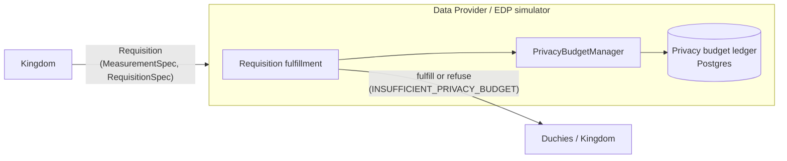

# Privacy Budget Manager

The Privacy Budget Manager (PBM) is the differential-privacy accounting ledger
that a Data Provider (EDP) consults before fulfilling a requisition. Every
Measurement that touches an individual costs some privacy budget; the PBM tracks
how much budget has already been spent per "privacy bucket" (a slice of
population, VID interval, and date) and refuses to overcharge any single bucket.
This protects an individual from being re-identified through repeated,
overlapping queries. Accounting is done under Advanced/Almost Concentrated
Differential Privacy (ACDP) composition, which requires Gaussian noise. The PBM
is a library that runs inside the EDP (and, in a newer WIP variant, inside the
EDP Aggregator), not a standalone gRPC service.

For DP background, see the differential-privacy primers under
[../../dp_intro/](../../dp_intro/).

## Two implementations in the tree

There are two distinct PBM code bases. Both live in this repo and both are
relevant.

| Aspect | Legacy / current PBM | New EDP-Aggregator PBM |
| --- | --- | --- |
| Kotlin package | `org.wfanet.measurement.eventdataprovider.privacybudgetmanagement` | `org.wfanet.measurement.privacybudgetmanager` |
| Source root | `src/main/kotlin/org/wfanet/measurement/eventdataprovider/privacybudgetmanagement/` | `src/main/kotlin/org/wfanet/measurement/privacybudgetmanager/` |
| Protos | none (bucket model is Kotlin data classes) | `src/main/proto/wfa/measurement/privacybudgetmanager/` |
| Status | Wired into the EDP simulator and used in production flows | Skeleton / WIP — several core methods are `TODO(...)`; no production callers yet |
| Landscape model | Hard-coded (`AgeGroup`, `Gender`, 300 VID intervals, 1-year window) | Config-driven `PrivacyLandscape` proto + landscape migration/mapping |
| Backing store | `PostgresBackingStore` / `InMemoryBackingStore` | `PostgresLedger` + separate `AuditLog` (GCS, WIP) |

Both share the same math (`AcdpCharge` of `rho`/`theta`, ACDP composition via a
Brent optimizer) and the same core idea of a per-bucket charge ledger keyed by an
external reference id (usually the requisition). The rest of this doc covers the
legacy PBM first (because it is the one actually running) and then the new PBM.

## Where it sits in the system

The PBM is invoked by a Data Provider while deciding whether to fulfill a
`Requisition`. It is not called by the Kingdom or the Duchies.



*   **Upstream / caller:** the EDP's requisition-fulfillment code. In this repo
    the reference caller is
    `src/main/kotlin/org/wfanet/measurement/loadtest/dataprovider/AbstractEdpSimulator.kt`
    (`chargeIndirectPrivacyBudget`, `chargeDirectPrivacyBudget`).
*   **Inputs:** the `MeasurementSpec` (VID sampling interval, per-query
    `epsilon`/`delta`, measurement type) and the `RequisitionSpec` event-group
    entries (event filter CEL expression + collection interval).
*   **Downstream / dependency:** a relational ledger (Postgres) that stores the
    accumulated per-bucket charges and a ledger-entry log for replay/idempotency.
*   **Effect:** if a bucket would exceed budget, the EDP refuses the requisition
    with `Requisition.Refusal.Justification.INSUFFICIENT_PRIVACY_BUDGET`.

## Legacy PBM (`eventdataprovider/privacybudgetmanagement`)

### Key modules

| File | Role |
| --- | --- |
| `PrivacyBudgetManager.kt` | Public entry point. `chargePrivacyBudgetInAcdp`, `chargingWillExceedPrivacyBudgetInAcdp`, `referenceWillBeProcessed`. Holds default caps `MAXIMUM_PRIVACY_USAGE_PER_BUCKET = 1.0f` (epsilon) and `MAXIMUM_DELTA_PER_BUCKET = 1.0e-9f`. |
| `PrivacyBudgetLedger.kt` | Check-then-charge logic inside a transaction; ACDP budget test. |
| `PrivacyBudgetLedgerBackingStore.kt` | `PrivacyBudgetLedgerBackingStore` / `PrivacyBudgetLedgerTransactionContext` interfaces; `PrivacyBudgetAcdpBalanceEntry`, `PrivacyBudgetLedgerEntry` data classes; refund sign flip in `getQueryTotalAcdpCharge`. |
| `PrivacyBucketGroup.kt` | The unit of accounting: `PrivacyBucketGroup` (MC id, date range, `AgeGroup`, `Gender`, VID sample start/width) plus `overlapsWith`. Defines the `AgeGroup` and `Gender` enums. |
| `PrivacyLandscape.kt` | Hard-coded landscape: 300 VID intervals of width `1/300`, one-year `datePeriod`, all age groups and genders. |
| `PrivacyBucketFilter.kt` | Expands a `LandscapeMask` into the set of `PrivacyBucketGroup`s a query touches, using a CEL `PrivacyBucketMapper`. |
| `PrivacyBucketMapper.kt` | Interface mapping event filters <-> `PrivacyBucketGroup`s via CEL programs (`operativeFields`). |
| `PrivacyQuery.kt` | Query-side data classes: `AcdpCharge(rho, theta)`, `Reference`, `EventGroupSpec`, `LandscapeMask`, `AcdpQuery`. |
| `Composition.kt` | `totalPrivacyBudgetUsageUnderAcdpComposition` — the ACDP delta computation. |
| `AcdpParamsConverter.kt` | Converts per-query `(epsilon, delta)` into ACDP `(rho, theta)` for MPC and direct (Gaussian) measurements. |
| `PrivacyBudgetManagerException.kt` | `PrivacyBudgetManagerException` + `PrivacyBudgetManagerExceptionType` (e.g. `PRIVACY_BUDGET_EXCEEDED`, `INCORRECT_NOISE_MECHANISM`). |
| `api/v2alpha/PrivacyQueryMapper.kt` | Builds an `AcdpQuery` from a v2alpha `MeasurementSpec` + `RequisitionSpec` event specs. |
| `deploy/common/postgres/PostgresBackingStore.kt` | JDBC/Postgres implementation of the backing store. |
| `deploy/common/postgres/ledger.sql` | Postgres schema (see below). |
| `InMemoryBackingStore.kt` | In-memory backing store used by simulators and tests. |

Bazel targets: `:privacy_budget_manager` and `:acdp_params_converter` in
`src/main/kotlin/org/wfanet/measurement/eventdataprovider/privacybudgetmanagement/BUILD.bazel`.

### Data model & storage

The legacy backing store is Postgres, defined in
`deploy/common/postgres/ledger.sql`:

*   `PrivacyBucketAcdpCharges` — the ledger itself. Primary key is
    `(MeasurementConsumerId, Date, AgeGroup, Gender, VidStart)`; each bucket has
    exactly one row holding the aggregated `Rho` and `Theta`. `AgeGroup` and
    `Gender` are Postgres enums matching the Kotlin enums (`'18_34'`, `'35_54'`,
    `'55+'` and `'M'`, `'F'`).
*   `LedgerEntries` — one row per charge transaction:
    `(MeasurementConsumerId, ReferenceId, IsRefund, CreateTime)`, indexed by
    `(MeasurementConsumerId, ReferenceId)`. Used for idempotency and (future)
    replay; charges are not linked row-by-row to buckets.

Note this schema uses the MC-facing `MeasurementConsumerId` and a textual
`ReferenceId` (the requisition), not internal database IDs.

### Charge / check / refund semantics

`PrivacyBudgetLedger.chargeInAcdp` runs a single transaction that:

1.  Skips only the budget *check* (not the write) when the `Reference` already
    has a ledger entry (`hasLedgerEntry`). The charge is still applied, so
    charging the same reference twice re-applies the charge rather than replaying
    idempotently; the only true short-circuit is the empty-collection guard
    (no buckets or no charges).
2.  For non-refunds without an existing entry, checks each targeted
    `PrivacyBucketGroup`: it reads the
    bucket's current aggregated `AcdpCharge` and asks whether adding the new
    charge would exceed budget under ACDP composition
    (`exceedsUnderAcdpComposition`). If any bucket fails, it throws
    `PRIVACY_BUDGET_EXCEEDED` and nothing is written.
3.  Otherwise it adds the charges (`addAcdpLedgerEntries`) and commits.

Refunds are modeled as `Reference.isRefund = true`. `getQueryTotalAcdpCharge`
negates `rho`/`theta` for refunds, so a refund subtracts from the bucket balance;
in Postgres this is an `ON CONFLICT ... DO UPDATE SET Rho = ? + ...` upsert.
Idempotency for refunds is approximate: `hasLedgerEntry` only compares against the
most recent `(MC id, reference id)` entry's `isRefund` flag (documented as a
known limitation for concurrent in-flight entries with the same reference).

`chargingWillExceedPrivacyBudgetInAcdp` performs the check without charging (used
to answer "would this exceed budget?" without mutating the ledger).

### Composition model (ACDP / Gaussian)

Accounting is done in ACDP space, where each charge is a pair
`AcdpCharge(rho, theta)`:

*   `AcdpParamsConverter` converts a per-query `DpParams(epsilon, delta)` into
    `(rho, theta)`. `getMpcAcdpCharge` handles distributed discrete Gaussian
    across `contributorCount` Duchies (memoized); `getDirectAcdpCharge` handles
    direct continuous Gaussian (sensitivity 1, `theta = 0`). Both are
    **Gaussian-only** — the converter explicitly does not support Laplace.
*   `PrivacyQueryMapper.getMpcAcdpQuery` / `getDirectAcdpQuery` map a
    `MeasurementSpec` to an `AcdpQuery`, summing reach + frequency `rho`/`theta`
    for `REACH_AND_FREQUENCY` and supporting `IMPRESSION`/`DURATION` for direct.
*   `Composition.totalPrivacyBudgetUsageUnderAcdpComposition` sums `rho` and
    `theta` over all charges in a bucket, then minimizes over the Renyi order
    `alpha` (Apache Commons `BrentOptimizer`) to produce the total `delta` at the
    configured target `epsilon`. A bucket "exceeds" when this total `delta` is
    greater than `maximumTotalDpParams.delta`.

Because charges are additive in `(rho, theta)`, per-query epsilon/delta can vary
freely between queries; this is the main advantage over Laplace + advanced
composition (see the operations note below).

### Requisition-fulfillment workflow

```mermaid
sequenceDiagram
  participant EDP as EDP (AbstractEdpSimulator)
  participant Map as PrivacyQueryMapper
  participant PBM as PrivacyBudgetManager
  participant L as PrivacyBudgetLedger
  participant DB as Postgres ledger

  EDP->>EDP: verify noise (MPC: DISCRETE_GAUSSIAN; direct: CONTINUOUS_GAUSSIAN)
  EDP->>Map: getMpcAcdpQuery / getDirectAcdpQuery(spec, eventSpecs)
  Map-->>EDP: AcdpQuery(reference, landscapeMask, acdpCharge)
  EDP->>PBM: chargePrivacyBudgetInAcdp(acdpQuery)
  PBM->>PBM: filter.getPrivacyBucketGroups(mc, landscapeMask)
  PBM->>L: chargeInAcdp(reference, buckets, {charge})
  L->>DB: begin tx; hasLedgerEntry?; read balances
  alt any bucket over budget
    L-->>EDP: PRIVACY_BUDGET_EXCEEDED
    EDP->>EDP: refuse (INSUFFICIENT_PRIVACY_BUDGET)
  else within budget
    L->>DB: upsert charges + LedgerEntry; commit
    L-->>EDP: ok -> fulfill requisition
  end
```

If the incoming requisition's noise mechanism is not Gaussian, the EDP throws
`INCORRECT_NOISE_MECHANISM` and refuses with `SPEC_INVALID`.

## New EDP-Aggregator PBM (`privacybudgetmanager`)

This is a redesign intended for the EDP Aggregator. As of this writing it is
skeleton code (`PrivacyBudgetManager.checkAndAggregate`, `Slice.add`,
`GcsAuditLog.write`, and `InMemoryLedger` are `TODO(...)`), so treat the
following as the intended design.

The key difference is that the landscape is **data-driven and versioned**: the
population dimensions are described by a `PrivacyLandscape` proto rather than
hard-coded enums, and old landscapes can be migrated to new ones.

### Protos (`src/main/proto/wfa/measurement/privacybudgetmanager/`)

| Proto | Purpose |
| --- | --- |
| `privacy_landscape.proto` (`PrivacyLandscape`) | Declares the event template name and the ordered `Dimension`s (field path + allowed enum `FieldValue`s). The ordered dimensions define a stable "population index". |
| `charges.proto` (`AcdpCharge`, `Charges`) | `AcdpCharge{rho, theta}`; `Charges` maps `populationIndex -> IntervalCharges`, which maps `vidIntervalIndex (0..299) -> AcdpCharge`. This is the serialized per-row charge blob. |
| `query.proto` (`Query`, `QueryIdentifiers`, `EventGroupLandscapeMask`, `DateRange`) | A `Query` maps to a single requisition: identifiers (EDP id, MC id, external/requisition reference, `is_refund`, commit `create_time`), a list of `EventGroupLandscapeMask`s (event-group id, CEL `event_filter`, date range, VID sample start/width), the `AcdpCharge`, and the target `privacy_landscape_identifier`. |
| `privacy_landscape_mapping.proto` (`PrivacyLandscapeMapping`) | Rules to remap charges from a source landscape to a target landscape (per-dimension, per field-value fan-out), used during ledger backfill/migration. |

Bazel proto targets: `charges_kt_jvm_proto`, `query_kt_jvm_proto`,
`privacy_landscape_kt_jvm_proto`, `privacy_landscape_mapping_kt_jvm_proto`.

### Key modules

| File | Role |
| --- | --- |
| `PrivacyBudgetManager.kt` | Orchestrates `charge(queries, groupId)`: dedupe already-committed queries, build the delta `Slice`, read targeted rows, `checkAndAggregate` (TODO), write, commit, then write the audit log. Also does landscape-chain mapping in `processBucketsForLandscape`. |
| `Ledger.kt` | `Ledger` / `TransactionContext` interfaces. `Ledger` defines only `startTransaction()`; `TransactionContext` declares `readQueries`, `readChargeRows`, `write`, `commit` (batch size 1000). |
| `Slice.kt` | `LedgerRowKey` (EDP, MC, event-group ref id, date), `BucketIndex(populationIndex, vidIntervalIndex)`, `PrivacyBucket`, and `Slice` — a `LedgerRowKey -> Charges` map with charge merge/aggregation helpers. |
| `LandscapeProcessor.kt` | `getBuckets` (turn masks into buckets via proto reflection + CEL over generated `DynamicMessage`s; 300 VID intervals via `NUM_VID_INTERVALS`) and `mapBuckets` (translate population indices across landscapes). Caches landscape and mapping computations. |
| `AuditLog.kt` | `AuditLog.write(queries, groupId)` — EDP-owned durable log of charged queries, returns a reference (e.g. blob URL). |
| `LedgerException.kt` | `LedgerException` + `LedgerExceptionType` (`INVALID_PRIVACY_LANDSCAPE_IDS`, `TABLE_NOT_READY`, `TABLE_METADATA_DOESNT_EXIST`). |
| `deploy/postgres/PostgresLedger.kt` | Postgres `Ledger`/`TransactionContext` implementation. |
| `deploy/postgres/ledger.sql` | Postgres schema (see below). |
| `deploy/gcloud/GcsAuditLog.kt` | GCS-backed `AuditLog` (TODO). |
| `testing/InMemoryLedger.kt`, `testing/InMemoryAuditLog.kt` | In-memory test doubles (TODO). |

Bazel target: `:privacy_budget_manager` in
`src/main/kotlin/org/wfanet/measurement/privacybudgetmanager/BUILD.bazel`.

### Data model & storage (new)

`deploy/postgres/ledger.sql` normalizes identifiers into integer-keyed dimension
tables and stores charges as a serialized proto:

*   `PrivacyChargesMetadata` — one row per landscape name with a
    `ChargesTableState` enum (`BACKFILLING`, `READY`) plus create/delete times.
    Only when the active landscape is `READY` will the ledger accept operations.
*   `PrivacyCharges` — the ledger. `(EventDataProviderId, MeasurementConsumerId,
    EventGroupReferenceId, Date)` uniquely identify a row whose `Charges BYTEA`
    column holds a serialized `wfa.measurement.privacybudgetmanager.Charges`
    proto (all population x VID-interval charges for that day).
*   `EventDataProviders`, `MeasurementConsumers`, `EventGroupReferences`,
    `LedgerEntryExternalReferences` — dimension tables mapping resource
    names/ids to `SERIAL` integer ids.
*   `LedgerEntries` — `(EventDataProviderId, MeasurementConsumerId,
    ExternalReferenceId, IsRefund, CreateTime)`, one row per charged query, for
    idempotency and audit reconciliation.

### Landscape versioning workflow

Because the population schema can evolve, `PostgresLedger` is pinned to an
`activeLandscapeId` and validates that every `Query` targets it
(`INVALID_PRIVACY_LANDSCAPE_IDS` otherwise). Migrating to a new landscape is an
offline backfill: create a new `PrivacyCharges` table, mark the new landscape
`BACKFILLING` in `PrivacyChargesMetadata`, remap every row's serialized `Charges`
blob by applying the `PrivacyLandscapeMapping` (the bucket/population-index
remapping logic in `LandscapeProcessor.mapBuckets`, which operates on
`List<PrivacyBucket>`), then flip the state to `READY` (see comments in
`deploy/postgres/ledger.sql`). This offline backfill job is not yet implemented;
`mapBuckets` is currently only wired into charge-time query mapping via
`PrivacyBudgetManager.processBucketsForLandscape`, not the offline row migration.
At charge time the PBM
can also map an incoming query defined against an older landscape up to the active
landscape by walking the `landscapeMappingChain` of `MappingNode`s
(`PrivacyBudgetManager.processBucketsForLandscape`).

### Charge flow & audit-log ordering (new)

`PrivacyBudgetManager.charge` deliberately writes **all** submitted queries to the
audit log (not just newly committed ones) so an external auditor never sees fewer
audit entries than ledger charges. Duplicate audit entries are acceptable because
replay reconciles against `LedgerEntries` by external reference id. The bucket
budget check itself lives in `checkAndAggregate`, which is not yet implemented.

## API surface

The PBM exposes **no public v2alpha, internal, or system gRPC API**. It is a
Kotlin library embedded in the EDP / EDP Aggregator process. Its "API" is:

*   the `PrivacyBudgetManager` class methods (legacy) or `charge(...)` (new), and
*   the mapping helpers in
    `eventdataprovider/privacybudgetmanagement/api/v2alpha/PrivacyQueryMapper.kt`
    that translate the public v2alpha `MeasurementSpec`/`RequisitionSpec` into PBM
    query objects.

The v2alpha protos are consumed as inputs; they are not defined by this
subsystem.

## Deployment artifacts

There are no dedicated Kubernetes manifests or server binaries for the PBM; it is
deployed as part of the EDP. Storage backends follow the repo's cloud-agnostic /
cloud-specific split under `deploy/`:

*   `deploy/common/postgres/` (legacy) and `deploy/postgres/` (new) — Postgres
    ledger implementations and `ledger.sql` schemas (cloud-agnostic; the new
    schema notes it is "Postgres compatible SQL").
*   `deploy/gcloud/GcsAuditLog.kt` (new) — Google Cloud Storage audit log (WIP).

The EDP simulators wire an `InMemoryBackingStore`-backed PBM by default; a
production EDP deployment would supply a durable backing store such as
`PostgresBackingStore` (which exists as a tested `PrivacyBudgetLedgerBackingStore`
reference implementation but is not currently wired into any runner in this repo
— its only instantiation is `PostgresBackingStoreTest`).
`EdpSimulatorRunner` and
`LegacyMetadataEdpSimulatorRunner` obtain theirs from
`loadtest/config/PrivacyBudgets.kt` `createNoOpPrivacyBudgetManager`, while
`InProcessEdpSimulator` constructs a `PrivacyBudgetManager(...,
InMemoryBackingStore(), ...)` directly rather than calling that factory.

## Cryptography / privacy mechanisms

The PBM does not do cryptography; it does DP accounting. The relevant mechanisms:

*   **Gaussian noise only.** ACDP composition and the `(epsilon, delta) ->
    (rho, theta)` conversion assume Gaussian (discrete for MPC, continuous for
    direct). Non-Gaussian requisitions are refused.
*   **ACDP composition** yields tighter budget usage than Laplace + advanced
    composition and lets MCs vary per-query epsilon/delta. See
    [../../operations/enabling-gaussian-noise-and-acdp-pbm.md](../../operations/enabling-gaussian-noise-and-acdp-pbm.md)
    for the rollout/rollback procedure (including the note that switching to ACDP
    writes to a new charges table, effectively resetting the ledger).

## Testing approach

*   Backing-store contract tests: `AbstractPrivacyBudgetLedgerStoreTest`
    (in `eventdataprovider/privacybudgetmanagement/testing/`) is subclassed by
    `InMemoryBackingStoreTest`
    (`src/test/.../privacybudgetmanagement/InMemoryBackingStoreTest.kt`) and by
    the Postgres store test
    (`src/test/.../deploy/common/postgres/PostgresBackingStoreTest.kt`), so the
    in-memory and Postgres implementations are held to the same contract.
*   Test doubles / fakes: `InMemoryBackingStore`; `TestPrivacyBucketMapper`,
    which sets `operativeFields = setOf("person.age_group", "person.gender")` and
    therefore filters buckets on those population fields; and
    `AlwaysChargingPrivacyBucketMapper`, which sets `operativeFields = emptySet()`
    (and compiles `"true == true"`) so that, per the `PrivacyBucketMapper.matches`
    default, every bucket matches and is charged.
*   The new PBM has `PostgresLedgerTest` under
    `src/test/kotlin/org/wfanet/measurement/privacybudgetmanager/deploy/postgres/`
    and Schemata helpers in `deploy/postgres/testing/`.
*   The reference caller (`AbstractEdpSimulator`) exercises the PBM end-to-end in
    integration tests via `InProcessEdpSimulator`.

## Notable design decisions & gotchas

*   **Library, not a service.** The PBM runs in the EDP; there is no network
    boundary or gRPC surface, and it uses MC-facing resource names/reference ids
    rather than internal DB IDs.
*   **Two code bases.** The legacy `eventdataprovider/privacybudgetmanagement`
    PBM is what runs today; the new `privacybudgetmanager` PBM (for the EDP
    Aggregator) is a skeleton with core methods still `TODO`. Don't assume the
    new one is live.
*   **Gaussian-only.** ACDP accounting is invalid for Laplace noise; the code
    enforces this and refuses otherwise.
*   **300 VID intervals is baked in.** Both implementations divide `[0,1)` into
    300 equal buckets (`PrivacyLandscape.vidsIntervalStartPoints` in legacy;
    `NUM_VID_INTERVALS`/`Charges` map keys `0..299` in the new one). It is not
    configurable.
*   **Idempotency is reference-based and approximate.** `hasLedgerEntry` (legacy)
    only checks the most recent entry's `isRefund`, which can misbehave with
    concurrent in-flight entries sharing an MC ID/reference ID.
*   **Landscape evolution requires an offline backfill.** Changing dimensions
    means rebuilding the `PrivacyCharges` table via `PrivacyLandscapeMapping`; the
    ledger refuses queries while the active landscape is not `READY`.
*   **Audit log is intentionally over-inclusive.** The new PBM writes every
    submitted query to the audit log to keep auditor counts >= ledger counts,
    accepting duplicate audit entries.

## See also

*   [../../dp_intro/](../../dp_intro/) — differential-privacy primers (PDFs).
*   [./edpaggregator.md](./edpaggregator.md) — the component the new PBM is
    being built for.
*   [../../operations/enabling-gaussian-noise-and-acdp-pbm.md](../../operations/enabling-gaussian-noise-and-acdp-pbm.md)
    — operational rollout of Gaussian noise + ACDP.
