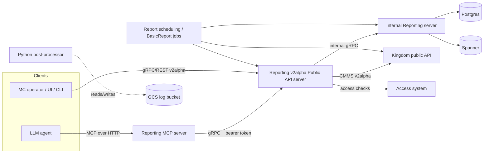
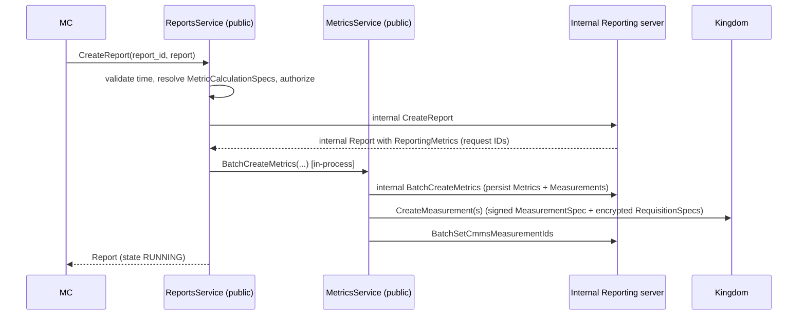

# Reporting Subsystem

The Reporting subsystem is the product-facing layer that lets a Measurement
Consumer (MC) turn raw cross-media measurements produced by the Kingdom/Duchy
MPC pipeline into consumable reach, frequency, impression, watch-duration, and
population reports. It exposes a public `v2alpha` gRPC/REST API for `Report`s,
`ReportingSet`s, `Metric`s, `MetricCalculationSpec`s, `BasicReport`s, and
`EventGroup`s; orchestrates the creation of underlying CMMS `Measurement`s in
the Kingdom; computes point estimates and their variance/standard deviation
using the shared statistics library; persists everything in Postgres and
Spanner; and runs background jobs plus a Python noise-correction step to make
report results internally consistent. It also ships a Model Context Protocol
(MCP) server so LLM agents can drive the same public API.

## 1. Purpose and Responsibilities

- **Compose measurements.** A report references `ReportingSet`s (set
  expressions over CMMS `EventGroup`s) and `MetricCalculationSpec`s. The
  Reporting server expands these into individual `Metric`s (the Cartesian
  product of time intervals, metric types, and grouping slices) and, for each,
  creates one or more CMMS `Measurement`s in the Kingdom.
- **Decrypt and aggregate results.** As Kingdom `Measurement`s complete, the
  server decrypts results with the MC's private key, applies the weighted
  set-union decomposition stored in Postgres, and rolls them up into
  `MetricResult`s.
- **Compute statistics.** Standard deviations / variances are computed via
  `//src/main/kotlin/org/wfanet/measurement/measurementconsumer/stats`
  (`VariancesImpl`), which understands the noise mechanism and methodology
  (Liquid Legions V2, HMSS, deterministic/direct) of each source measurement.
- **Two report surfaces.**
  - `Report` — the low-level composable surface (explicit `ReportingSet` +
    `MetricCalculationSpec` entries).
  - `BasicReport` — a higher-level surface (campaign group + impression
    qualification filters + result-group specs) that the server expands into
    `Report`/`Metric` primitives and stores denoised, consistency-corrected
    results in Spanner.
- **Scheduling.** `ReportSchedule`s produce periodic `Report`s via a cron job.
- **Post-processing.** A Python quadratic-programming solver corrects
  measurement inconsistencies (e.g. `reach(A∪B) ≥ reach(A)`) subject to each
  measurement's variance.

## 2. Where It Sits in the Overall System

- **Upstream (callers):** MC operators/UIs/CLI, and the Reporting MCP server on
  their behalf. Authentication/authorization is delegated to the Access system
  (`Authorization` built on `PermissionsGrpcKt.PermissionsCoroutineStub`).
- **Downstream (dependencies):**
  - **Kingdom** public API (`halo.wfanet.org` domain) — `Measurements`,
    `DataProviders`, `Certificates`, `MeasurementConsumers`, `EventGroups`,
    `ModelLines`, `EventGroupMetadataDescriptors`. The Kingdom actually runs the
    MPC protocols with the Duchies. See [./kingdom.md](./kingdom.md) and
    [./duchy.md](./duchy.md).
  - **Storage:** Postgres (core entities) and Spanner (`BasicReport`s and
    `ReportResult`s).
  - **Access:** all public methods call `authorization.check(...)`. See
    [./access.md](./access.md).

The Reporting server is itself a gRPC server that is also a gRPC client, so it
follows the project rule of catching `StatusException` at each Kingdom/internal
call site and remapping the status (see `createReport` in
`src/main/kotlin/org/wfanet/measurement/reporting/service/api/v2alpha/ReportsService.kt`).

## 3. Key Modules and Packages

All paths are under
`src/main/kotlin/org/wfanet/measurement/reporting/` unless noted.

| Area | Path | Role |
| --- | --- | --- |
| Public API services | `service/api/v2alpha/` | gRPC service impls for the `v2alpha` API |
| Public API helpers | `service/api/EncryptionKeyPairStore.kt`, `service/api/Errors.kt` | MC private-key lookup, error mapping |
| Internal service helpers | `service/internal/` | IQF mapping, normalization, grouping dimensions, internal errors (the DB-backed internal *service impls* live under `deploy/v2/postgres/` and `deploy/v2/gcloud/spanner/`, not here) |
| Report post-processing (Kotlin) | `postprocessing/v2alpha/` | `ReportProcessor` wrapper that shells out to the Python solver |
| Report post-processing (Python) | `src/main/python/wfa/measurement/reporting/postprocessing/` and `.../postprocessingv2/` | `noiseninja` QP solver + report conversion |
| Post-processing job (Python) | `src/main/python/wfa/measurement/reporting/job/` | `PostProcessReportResultJob` — corrects `ReportResult`s for `BasicReport`s |
| gRPC-JSON gateway (Go) | `src/main/go/reporting/grpcgateway.go` | Transcodes REST/JSON to the Reporting public gRPC API |
| Background jobs (Kotlin) | `job/` | `ReportSchedulingJob`, `BasicReportsReportsJob` |
| MCP server | `mcp/`, `mcp/tools/`, `mcp/prompts/`, `mcp/grpc/` | Model Context Protocol server + tools |
| CLI tools | `service/api/v2alpha/tools/Reporting.kt` | `Reporting` command-line client |
| Deployment / servers | `deploy/v2/common/server/`, `deploy/v2/gcloud/server/` | Server and job entry points |
| Persistence impls | `deploy/v2/postgres/`, `deploy/v2/gcloud/spanner/` | Postgres and Spanner data services |
| Stats library | `../measurementconsumer/stats/` | Variance/covariance/methodology math |

Protos live under:

- `src/main/proto/wfa/measurement/reporting/v2alpha/` — public API.
- `src/main/proto/wfa/measurement/internal/reporting/v2/` — internal API and
  DB-row `*Details` messages.
- `src/main/proto/wfa/measurement/config/reporting/` — process configuration.
- `src/main/proto/wfa/measurement/internal/reporting/postprocessing/` —
  post-processor logs/results.

## 4. Services and Daemons

### 4.1 Public API server

Entry point: `deploy/v2/common/server/V2AlphaPublicApiServer.kt`
(binary `V2AlphaPublicApiServer`). It opens a mutual TLS channel to the Kingdom
(`kingdomChannel`) and to the internal Reporting server, wires an
`Authorization` client to the Access system, loads `MetricSpecConfig` (and an
optional BasicReport-specific `MetricSpecConfig`), and starts these public
services:

| Service (`service/api/v2alpha/…Service.kt`) | Public proto service | Notes |
| --- | --- | --- |
| `MetricsService` | `Metrics` | Largest service (~130 KB). Creates CMMS measurements, syncs results, computes variance |
| `ReportsService` | `Reports` | Expands a `Report` into `Metric`s via `BatchCreateMetrics` |
| `ReportingSetsService` | `ReportingSets` | Set-expression compilation into weighted subset unions |
| `MetricCalculationSpecsService` | `MetricCalculationSpecs` | Reusable metric templates |
| `BasicReportsService` | `BasicReports` | High-level report surface (Spanner-backed) |
| `EventGroupsService` | `EventGroups` | Proxies/decorates Kingdom `EventGroup`s |
| `EventGroupMetadataDescriptorsService` | `EventGroupMetadataDescriptors` | Proxies Kingdom descriptors |
| `ImpressionQualificationFiltersService` | `ImpressionQualificationFilters` | Serves the configured IQF mapping |
| `ReportSchedulesService` / `ReportScheduleIterationsService` | `ReportSchedules` / `ReportScheduleIterations` | Periodic report definitions |
| `DataProvidersService`, `ModelLinesService` | `DataProviders`, `ModelLines` | Thin proxies to Kingdom |

Public services talk to the internal server over dedicated in-process channels
per service (e.g. `"$IN_PROCESS_SERVER_NAME-metrics"`) established by
`startInProcessServerWithService`, and `ReportsService` calls `MetricsService`
(also in-process) rather than the internal server directly, so report creation
reuses the full metric-creation logic including CMMS measurement submission.

The public API resource domain is `reporting.halo-cmm.org`; Kingdom resources
it references use `halo.wfanet.org` (e.g. `halo.wfanet.org/EventGroup`,
`halo.wfanet.org/Measurement`, `halo.wfanet.org/ModelLine`).

### 4.2 Internal server

Entry points: `deploy/v2/common/server/InternalReportingServer.kt` and the
Google Cloud variant `deploy/v2/gcloud/server/GCloudInternalReportingServer.kt`
(binary image `postgres-internal-reporting-server`). `DataServices.create(...)`
in `deploy/v2/common/service/DataServices.kt` assembles the `Services` bundle.

This is the **only** tier with database access. It is a hybrid:

- **Postgres-backed** (`deploy/v2/postgres/…Service.kt`):
  `MeasurementConsumers`, `Measurements`, `Metrics`, `ReportingSets`,
  `Reports`, `ReportSchedules`, `ReportScheduleIterations`,
  `MetricCalculationSpecs`.
- **Spanner-backed** (`deploy/v2/gcloud/spanner/`): `SpannerBasicReportsService`
  and `SpannerReportResultsService`. These are only constructed when a Spanner
  client, an IQF mapping, and an event-message descriptor are all present
  (i.e. `--basic-reports-enabled`), so `basicReportsService`,
  `impressionQualificationFiltersService`, and `reportResultsService` are
  nullable in `Services`.

Internal service RPCs are lower-level than the public ones — e.g. internal
`Metrics` has `StreamMetrics`, `BatchCreateMetrics`, `BatchGetMetrics`,
`InvalidateMetric`; internal `ReportResults` has `CreateReportResult`,
`BatchCreateReportingSetResults`, `ListReportingSetResults`,
`AddProcessedResultValues`, `GetReportResult`.

### 4.3 Background jobs (cron)

Defined in `job/` with executors in `deploy/v2/common/job/`:

- **`ReportSchedulingJob`** (`job/ReportSchedulingJob.kt`, executor
  `ReportSchedulingJobExecutor.kt`, image `report-scheduling`). Iterates
  `ReportSchedule`s whose next run is due, resolves the required
  `DataProvider`s/`EventGroup`s from the Kingdom, materializes a `Report` from
  the schedule's `report_template`, creates it through the public
  `Reports` stub (using `ReportScheduleInfoServerInterceptor` /
  `withReportScheduleInfo` for trusted-principal auth), and advances the
  schedule iteration state.
- **`BasicReportsReportsJob`** (`job/BasicReportsReportsJob.kt`, executor
  `BasicReportsReportsJobExecutor.kt`, image `basic-reports-reports`). Polls
  internal `BasicReport`s, drives the underlying `Report`(s) to completion,
  transforms `MetricResult`s into `ResultGroup`/`ReportResult` structures
  (noisy + denoised `BasicMetricSet`s), and writes them via
  `ReportResults` internal RPCs; `FailBasicReport` on error. It does **not**
  compute variance itself — variance is computed upstream in `MetricsService`
  (`variances.computeMetricVariance(...)`). This job simply copies the
  already-computed public `UnivariateStatistics` (with `standardDeviation`) from
  the `Report`/`Metric` results into `NoisyMetricSet.UnivariateStatistics` via
  `toNoisyMetricSetUnivariateStatistics()`. This job runs as the *initContainer*
  of the deployed `report-result-post-processor` CronJob (see Section 9), which
  then runs the Python post-processing container to correct the results.

### 4.4 MCP server

`mcp/ReportingMcpServer.kt` (daemon `mcp/ReportingMcpServerDaemon.kt`, image
`reporting-mcp-server`) exposes the public API to LLM agents over the Model
Context Protocol using stateless Streamable HTTP
(`mcpStatelessStreamableHttp`). It forwards the caller's `Authorization: Bearer`
token to the Reporting public API via `ReportingPublicApiClient`
(`mcp/grpc/`). Registered tool groups (`mcp/tools/`):

- `registerBasicReportTools` — `create_basic_report`, `get_basic_report`,
  `list_basic_reports`.
- `registerEventGroupTools`, `registerReportingSetTools`, `registerIqfTools`.
- `registerReportingPrompts` (`mcp/prompts/ReportingPrompts.kt`).

Tools translate JSON tool arguments into the same protobuf request messages the
public API uses (via `ToolSupport.PROTO_JSON_PARSER` / `PROTO_JSON_PRINTER`).

### 4.5 gRPC-JSON gateway (Go)

`src/main/go/reporting/grpcgateway.go` (image `reporting-grpc-gateway`, built by
`//src/main/go/reporting:grpc_gateway_image`) is a small Go program that
provides gRPC-JSON transcoding (`google.api.http` REST). It uses
[`grpc-gateway`](https://github.com/grpc-ecosystem/grpc-gateway) to expose a
REST/JSON front end and proxies calls over a mutual TLS gRPC connection to the
Reporting `v2alpha` public API server (`--reporting-public-api-target`). It
registers handlers for `EventGroups`, `ReportingSets`,
`ImpressionQualificationFilters`, and `BasicReports` (from the Reporting API)
plus `DataProviders` and `EventGroupMetadataDescriptors` (from the CMMS API),
and serves an HTTPS listener on port `8443` with a `/healthz` endpoint. Unlike
the MCP server, this gateway is externally exposed via a `LoadBalancer` Service
(see Section 9).

## 5. Data Model and Storage

### 5.1 Postgres (core entities)

Schema: `src/main/resources/reporting/postgres/create-v2-reporting-schema.sql`
(plus incremental Liquibase changesets in the same directory). Hierarchy is
rooted at `MeasurementConsumers`:

- **`ReportingSets`** with `ReportingSetEventGroups`, `SetExpressions`,
  `WeightedSubsetUnions`, `PrimitiveReportingSetBases`,
  `PrimitiveReportingSetBasisFilters`. A reporting set is a vertex of a directed
  graph; a composite set is decomposed into a **linear combination of weighted
  subset unions of primitive bases** — this decomposition is what lets the
  server combine individual CMMS measurements (with signed coefficients) into
  set-expression results.
- **`Metrics`** (metric type, DP epsilon/delta, VID sampling interval, max
  frequency, time interval, serialized `MetricDetails`) with `MetricMeasurements`
  (join to `Measurements` with a `Coefficient`).
- **`Measurements`** (`CmmsMeasurementId`, `CmmsCreateMeasurementRequestId`,
  `State`, serialized `MeasurementDetails`) with
  `MeasurementPrimitiveReportingSetBases`.
- **`Reports`** with `MetricCalculationSpecReportingMetrics` (links a report to
  metric-calculation specs and the metrics it fans out to).
- **`MetricCalculationSpecs`**, and the report-scheduling tables.

Per project convention, primary keys are internal `bigint` IDs never exposed
over any API; external IDs are separate columns such as `ExternalReportId`,
`ExternalReportingSetId`, `ExternalMetricId`. `*Details` columns hold serialized
protobuf, each mirrored by a human-readable `*DetailsJson` column for debugging.

### 5.2 Spanner (BasicReports and ReportResults)

Schemas:
`src/main/resources/reporting/spanner/create-basic-report-schema.sql` and
`create-report-results-schema.sql`. Because Spanner can store protobuf columns,
these tables embed message types via a `PROTO BUNDLE`.

- **`BasicReports`** (interleaved in `MeasurementConsumers`): `BasicReportDetails`
  and `BasicReportResultDetails` proto columns, `ExternalCampaignGroupId`
  (a Postgres `ExternalReportingSetId`), plus a `ReportResultId` link.
- **`ReportResults`** tree (interleaved parent/child, ON DELETE CASCADE):
  `ReportResults` → `ReportingSetResults` → `ReportingWindowResults` →
  `ReportResultValues` (denoised `BasicMetricSet`) and `NoisyReportResultValues`
  (noisy `NoisyMetricSet`). `ReportingSetResults` records a
  `VennDiagramRegionType` (`UNION` / `PRIMITIVE`), an
  `ImpressionQualificationFilterId` (`-1` means a custom filter), a
  `MetricFrequencySpec` and its fingerprint, a `GroupingDimensionFingerprint`,
  and a `FilterFingerprint`. Fingerprints use deterministic canonical
  serialization (not raw protobuf serialization, which is non-deterministic) so
  they can be used as stable join keys and dimension identifiers.

The Spanner transformation logic lives in
`deploy/v2/gcloud/spanner/BasicReportProcessedResultsTransformation.kt` and the
row readers/writers (`BasicReports.kt`, `ReportResults.kt`,
`ReportResultValues.kt`, `NoisyReportResultValues.kt`, etc.).

### 5.3 GCS (post-processor logs)

`ReportProcessor` writes each `ReportPostProcessorLog` to a GCS bucket keyed by
report create-time and name (see `getBlobKey` in
`postprocessing/v2alpha/ReportProcessor.kt`).

## 6. API Surface

Three tiers, following the project's public-vs-internal separation:

1. **Public `v2alpha`** (`proto/wfa/measurement/reporting/v2alpha/`). Consumed
   by MC clients. Resources: `Report`, `ReportingSet`, `Metric` (+ `MetricSpec`,
   `MetricResult`, `UnivariateStatistics`), `MetricCalculationSpec`,
   `BasicReport` (+ `ResultGroup`, `ResultGroupSpec`, `ReportingUnit`,
   `ImpressionQualificationFilter`), `EventGroup`, `ReportSchedule`,
   `ReportScheduleIteration`. Follows AIPs with two documented exceptions
   (`proto/wfa/measurement/reporting/README.md`): structured filter/order
   messages instead of AIP-160/AIP-132 strings. Errors carry an `ErrorInfo`
   reason in the `reporting.halo-cmm.org` domain.
2. **Internal `v2`** (`proto/wfa/measurement/internal/reporting/v2/`). Used only
   between the public server, jobs, and the internal server. Exposes internal
   IDs and DB-row `*Details` messages (`BasicReportDetails`,
   `BasicReportResultDetails`, and the `MetricDetails`/`MeasurementDetails`
   etc.). Contains services with no public equivalent such as `ReportResults`
   and internal `Measurements`.
3. **Config** (`proto/wfa/measurement/config/reporting/`). Unversioned process
   configuration: `MetricSpecConfig` (default DP params, VID sampling with
   fixed/random start, per-protocol defaults), `MeasurementConsumerConfig(s)`
   (offline principal + signing material per MC), `EncryptionKeyPairConfig`,
   `ImpressionQualificationFilterConfig`.

### Selected public metric types (`metric.proto`)

`MetricSpec.type` is a oneof of `ReachParams`, `ReachAndFrequencyParams`,
`ImpressionCountParams`, `WatchDurationParams`, `PopulationCountParams`. Newer
params split single-DataProvider vs multiple-DataProvider
sampling-and-privacy parameters (`single_data_provider_params` /
`multiple_data_provider_params`), deprecating the flat `privacy_params`.
`MetricResult` mirrors these with `ReachResult`, `ReachAndFrequencyResult`,
`ImpressionCountResult`, `WatchDurationResult`, `PopulationCountResult`, and
carries `UnivariateStatistics` (standard deviation) on values, histogram bins,
relative values, and K+ counts. `cmms_measurements` records which Kingdom
`Measurement`s produced each result.

## 7. Key Workflows

### 7.1 CreateReport (composable surface)

`ReportsService.createReport`:

1. Validates the request, resolves `MetricCalculationSpec` external IDs, and
   authorizes with `authorization.check(parent, CREATE)`.
2. Calls internal `CreateReport`, which fills request IDs (and reuses existing
   metrics when possible — `disableMetricsReuse` toggles this).
3. Fans out each internal `ReportingMetric` into a `CreateMetricRequest`
   (carrying the MC-level filter and model line) and calls `BatchCreateMetrics`
   on `MetricsService` in batches (`submitBatchRequests`,
   `BATCH_CREATE_METRICS_LIMIT`).

`MetricsService` builds the CMMS `Measurement`s: it constructs an unsigned
`MeasurementSpec` (with `reportingMetadata`), signs it with the MC signing key
(`signMeasurementSpec`), builds and encrypts per-DataProvider `RequisitionSpec`s
(`signRequisitionSpec` + `encryptRequisitionSpec`), and submits via the Kingdom
`Measurements` stub (`createCmmsMeasurements`).

### 7.2 GetReport / result synchronization

On `GetMetric`/report read, `MetricsService.syncInternalMeasurements` pulls the
current state of each CMMS `Measurement` from the Kingdom, decrypts `SUCCEEDED`
results with the MC private key from `EncryptionKeyPairStore`
(`decryptResult`), and writes them back through internal
`BatchSetMeasurementResults` / measurement-failure RPCs. A metric becomes
`SUCCEEDED` only when all its measurements succeed. Point estimates are combined
across `WeightedSubsetUnion`s (signed coefficients), and standard deviations are
computed with `variances.computeMetricVariance(...)` /
`computeMeasurementVariance(...)`, selecting the methodology
(`LiquidLegionsV2Methodology`, `HonestMajorityShareShuffle…`,
`DeterministicMethodology`, `CustomDirect…`) and `NoiseMechanism` from the
measurement's `protocolConfig`.

### 7.3 BasicReport

`CreateBasicReport` (public) validates the request
(`CreateBasicReportRequestValidation.kt`), optionally **synthesizes a campaign
group** `ReportingSet` from the union of the referenced custom groups'
EventGroups when `campaign_group` is omitted (reflected in
`effective_campaign_group`), and inserts a `BasicReport` into Spanner. The
`BasicReportsReportsJob` then drives the underlying `Report`(s), computes noisy
and denoised `BasicMetricSet`s, and stores them in the `ReportResults` Spanner
tree; reads render `ResultGroup`s from those rows.

### 7.4 Scheduling

The `report-scheduling` cron job runs `ReportSchedulingJob.execute()`, which for
each MC config with an `offlinePrincipal` finds due `ReportSchedule`s, expands
the template into a concrete `Report`, and creates it via the public `Reports`
API using trusted-principal authentication.

## 8. Cryptography and Privacy Mechanisms

- **Differential privacy.** Every metric carries DP params
  (`DifferentialPrivacyParams` epsilon/delta) and a VID sampling interval;
  defaults come from `MetricSpecConfig`. The chosen noise mechanism is recorded
  and used when computing variances.
- **Envelope of MC keys.** The Reporting server never sees plaintext event data;
  it only decrypts aggregate `Measurement` results using the MC's private key
  loaded through `EncryptionKeyPairStore` (`InMemoryEncryptionKeyPairStore`),
  and signs/encrypts CMMS requests with the MC signing key material from
  `MeasurementConsumerConfig`. Result decryption uses the consent client's
  `decryptResult`; requisition specs use `encryptRequisitionSpec`.
- **Variance/consistency.** `UnivariateStatistics.standard_deviation` lets
  clients build confidence intervals. The post-processor (below) enforces
  logical consistency between correlated measurements while respecting each
  measurement's variance.
- **Post-processing / noise correction.** The underlying solver is a
  **quadratic-programming solver** (`noiseninja/solver.py`, using `qpsolvers`
  with HiGHS/OSQP) that finds the closest set of measurement values satisfying
  set-relationship constraints (e.g. union ≥ component, `ami ≥ mrc`, monotone
  cumulative reach) weighted by inverse variance. Two paths invoke it:
  - **Kotlin `ReportProcessor`** (`postprocessing/v2alpha/ReportProcessor.kt`)
    converts a `Report` into `ReportSummary` messages and invokes a bundled
    Python program (`post_process_origin_report.zip`). It reports issues such as
    `QP_SOLUTION_NOT_FOUND`, `HAS_LARGE_CORRECTIONS`, and independence-check
    failures via `ReportPostProcessorLog`, and writes corrected
    reach/frequency/impression values back into the report.
  - **Python `PostProcessReportResultJob`**
    (`src/main/python/wfa/measurement/reporting/job/post_process_report_result_job.py`)
    is the deployed post-processing daemon (the `report-result-post-processor`
    CronJob, see Section 9). It lists internal `BasicReport`s in the
    `UNPROCESSED_RESULTS_READY` state, runs `PostProcessReportResult` over each,
    and writes corrected values back to the `ReportResults` Spanner tree via the
    internal `AddProcessedResultValues` RPC (`FailBasicReport` on unrecoverable
    error, retrying on transient failures).

## 9. Deployment Artifacts

Kubernetes manifests are authored in CUE:

- Cloud-agnostic base: `src/main/k8s/reporting_v2.cue`.
- Local dev: `src/main/k8s/local/reporting_v2.cue`.
- Google Cloud (GKE): `src/main/k8s/dev/reporting_v2_gke.cue` and
  `reporting_v2_config_files_kustomization.yaml`.

Workloads defined in `reporting_v2.cue`:

| Kind | Name | Image suffix |
| --- | --- | --- |
| Deployment | `postgres-internal-reporting-server` | `reporting/v2/internal-server` |
| Deployment (LoadBalancer) | `reporting-v2alpha-public-api-server` | `reporting/v2/v2alpha-public-api` |
| Deployment (LoadBalancer) | `reporting-grpc-gateway` | `reporting/grpc-gateway` |
| Deployment (ClusterIP) | `reporting-mcp-server` | `reporting/mcp/server` |
| CronJob | `report-scheduling` | `reporting/v2/report-scheduling` |
| CronJob | `report-result-post-processor` | `reporting/v2/report-result-post-processor` |

The `LoadBalancer`/externally-exposed workloads are those defined with
`#ExternalService` in the CUE: `reporting-v2alpha-public-api-server`,
`reporting-grpc-gateway`, and `access-public-api-server`. The
`reporting-mcp-server` is deliberately **ClusterIP (internal-only)** for now —
`reporting_v2.cue` notes that external exposure (following the
`reporting-grpc-gateway` LoadBalancer + in-server TLS pattern) is tracked in
`TODO(world-federation-of-advertisers/cross-media-measurement#3938)`.

There is **no standalone `basic-reports-reports` CronJob**. The
`basic-reports-reports` image (Kotlin `BasicReportsReportsJob`) runs as an
*initContainer* of the `report-result-post-processor` CronJob; that CronJob's
main container is the Python post-processing job
(`reporting/v2/report-result-post-processor`,
`PostProcessReportResultJob`). The CronJob thus first drives the underlying
reports to completion (initContainer) and then corrects the results (main
container).

The base CUE also defines the `access-internal-api-server` and
`access-public-api-server` Deployments (the Access system, colocated in this
manifest for deployment convenience).

Network policies restrict the public API and jobs to talk only to the internal
server (and the internal server to accept only those). The `basic-reports-enabled`
flag (`--basic-reports-enabled`) gates the Spanner-backed services. Container
images are produced by `java_image` targets in the corresponding `BUILD.bazel`
files (e.g. `deploy/v2/common/server/BUILD.bazel`); the gateway image is an
`oci_image` over a Go `go_binary` (`//src/main/go/reporting:grpc_gateway_image`)
and the post-processor main container is a Python image. The Google Cloud
internal server binary is `GCloudInternalReportingServer`; the cloud-agnostic
base server is `InternalReportingServer`.

## 10. Testing Approach

- Tests mirror `src/main/` under `src/test/kotlin/org/wfanet/measurement/reporting/`
  (`service/api/v2alpha`, `service/internal`, `deploy/v2/postgres`,
  `deploy/v2/gcloud`, `job`, `mcp/tools`, `postprocessing/v2alpha`).
- Reusable, `testonly` test infrastructure lives under `src/main/` `testing`
  subpackages, e.g. `service/internal/testing/v2/` and
  `deploy/v2/postgres/testing/`, `deploy/v2/gcloud/spanner/testing/`.
- Following project standards, tests target the public gRPC contract using
  in-process servers and fakes (e.g. fake Kingdom stubs) rather than mocks, and
  use Truth/ProtoTruth assertions. Integration wiring is shared via
  `//src/main/kotlin/org/wfanet/measurement/integration/common/reporting`.
- Python post-processing has its own tests under
  `src/test/python/wfa/measurement/reporting/postprocessing/` (solver, report
  conversion, summary conversion) with `.textproto`/`.json` fixtures.

## 11. Notable Design Decisions and Gotchas

- **Hybrid Postgres + Spanner storage.** Core entities are in Postgres; only
  `BasicReport`s and `ReportResult`s use Spanner (chosen for protobuf columns
  and interleaved parent/child layout). The Spanner services are optional and
  only enabled with `--basic-reports-enabled`, so `Services` fields for them are
  nullable.
- **Two report abstractions.** `Report`/`Metric` is the flexible primitive;
  `BasicReport` is the opinionated, campaign-group-oriented surface that
  internally expands to the primitives and post-processes results. New callers
  generally use `BasicReport`.
- **Set-expression decomposition.** Composite reporting sets are stored as a
  linear combination of weighted subset unions of primitive bases; results are
  the signed sum of the constituent CMMS measurements. This is why the Postgres
  schema has the `WeightedSubsetUnions` / `PrimitiveReportingSetBases` machinery.
- **Metric reuse.** The internal `Reports` service reuses existing `Metric`s
  across reports when parameters match (indexes exist for this); `Metric` also
  records the `containing_report` that first created it. Reuse can be disabled
  with `disableMetricsReuse`.
- **Statistics live outside Reporting.** All variance math is in the shared
  `measurementconsumer/stats` library (`VariancesImpl`), so the Reporting server
  must know each measurement's protocol/methodology and noise mechanism to
  compute a standard deviation; when that information is missing,
  `UnivariateStatistics` is simply omitted.
- **Post-processor is a subprocess.** `ReportProcessor` shells out to a bundled
  Python zip (`python3 <zip>`), a documented workaround for
  bazelbuild/bazel#17629. It communicates via temp `.binpb` files and re-logs
  the Python program's stderr.
- **Deterministic fingerprints.** `ReportResults` join/dedup keys are computed
  from canonical serializations, deliberately avoiding non-deterministic
  protobuf serialization.
- **AIP exceptions.** List filtering/ordering use structured messages rather
  than AIP-160/AIP-132 strings; this is documented on the affected fields and in
  the API README.

## See Also

- [./kingdom.md](./kingdom.md) — creates and runs the CMMS `Measurement`s that
  Reporting composes.
- [./duchy.md](./duchy.md) — MPC nodes that execute the protocols.
- [../crosscutting/privacy.md](../crosscutting/privacy.md) — how the
  `measurementconsumer/stats` variance/methodology library derives each result's
  variance from its noise mechanism.
- [./access.md](./access.md) — the Access system used for authentication and
  authorization.
