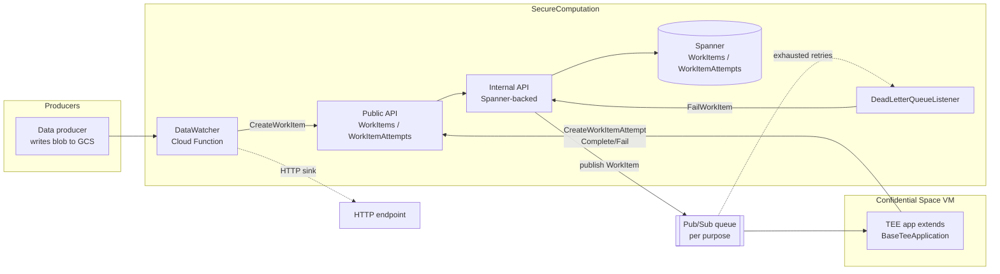
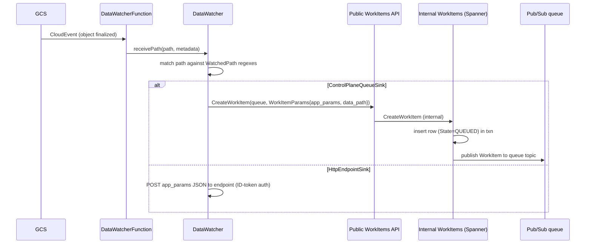
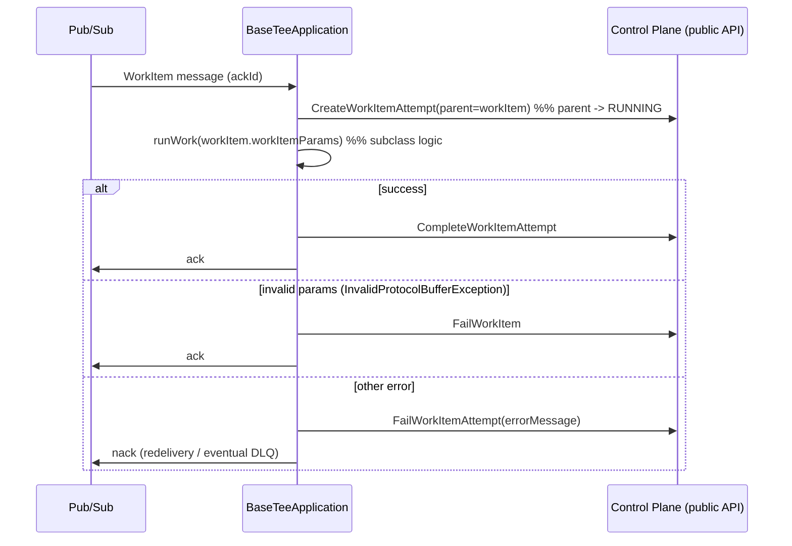

# Secure Computation (TEE) Subsystem

The Secure Computation subsystem is a generic, cloud-hosted **work queue and
orchestration layer for TEE (Trusted Execution Environment) workloads**. It does
not run cryptographic protocols itself. Instead, it (1) watches blob storage for
newly landed data, (2) turns matching events into durable `WorkItem` records,
(3) publishes those work items onto per-purpose queues, and (4) lets enclave
applications claim, run, and report on that work through a small control-plane
API. Its first and primary consumer is the
[EDP Aggregator](./edpaggregator.md), whose TEE apps (results fulfillment, VID
labeling, sub-pool assignment, VID rank building) run inside Google Cloud
Confidential Space VMs and use this subsystem's SDK as their runtime harness.

Code lives under `src/main/kotlin/org/wfanet/measurement/securecomputation`,
with protos under `src/main/proto/wfa/measurement/{internal,config}/securecomputation`
and `src/main/proto/wfa/measurement/securecomputation/controlplane/v1alpha`.

> **Naming caution.** The "TrusTEE" measurement *protocol* (a duchy-side
> reach/frequency protocol) is a separate concept and lives in the
> [Duchy](./duchy.md) subsystem
> (`src/main/proto/wfa/measurement/internal/duchy/protocol/trus_tee.proto`).
> This subsystem is the generic TEE work-orchestration framework; it is used by
> the EDP Aggregator's Confidential Space workloads, which are what run under a
> TrusTEE-style trust model. Do not conflate the two.

## Purpose & Responsibilities

*   **Data watching.** Observe blob-creation events (Google Cloud Storage) and,
    for each configured watched path, either enqueue a control-plane `WorkItem`
    or POST to an HTTP webhook.
*   **Control plane / work queue.** Persist `WorkItem` and `WorkItemAttempt`
    entities in Spanner, expose a public gRPC API to create/get/list/fail them,
    and publish each new `WorkItem` onto its target queue (Google Cloud
    Pub/Sub).
*   **TEE SDK.** Provide `BaseTeeApplication`, an abstract base class that
    enclave workloads extend. It subscribes to a queue, records an attempt,
    invokes the subclass's `runWork`, and reports success/failure back to the
    control plane with correct ack/nack semantics.
*   **Dead-letter handling.** Consume a Pub/Sub dead-letter queue and mark the
    corresponding `WorkItem`s as `FAILED` when a message could not be processed
    after repeated attempts.

## Where It Sits in the System



*   **Upstream / callers:** data producers writing to GCS (e.g. the EDP
    Aggregator's data-availability sync); the `DataWatcher` Cloud Function.
*   **Downstream / callees:** Google Cloud Spanner (persistence), Google Cloud
    Pub/Sub (queues + dead-letter), and TEE applications that subscribe to the
    queues.
*   **Peer subsystems:** the [EDP Aggregator](./edpaggregator.md) supplies the
    concrete TEE apps and their `*Params` protos, and packs its parameters into
    the `WorkItem.WorkItemParams.app_params` `Any`.

## Key Modules & Packages

| Package (under `.../securecomputation/`) | Responsibility |
| --- | --- |
| `controlplane/v1alpha/` | Public v1alpha gRPC services (`WorkItemsService`, `WorkItemAttemptsService`), `Services` wiring, `ResourceConversion` |
| `datawatcher/` | `DataWatcher` (path matching + sink dispatch), `DataWatcherMetrics`, `WatchedBlobs` (GCS metadata keys); `testing/` fake storage client |
| `teesdk/` | `BaseTeeApplication` — the enclave-side SDK; `Errors` (`ControlPlaneApiException`) |
| `service/` | Public-API resource keys (`WorkItemKey`, `WorkItemAttemptKey`), `IdVariable`, public `Errors` |
| `service/internal/` | `WorkItemPublisher` interface, `QueueMapping`, internal `Errors`, `Services`; abstract service test bases under `testing/` |
| `deploy/common/server/` | `PublicApiServer` entry point |
| `deploy/gcloud/spanner/` | `InternalApiServer`, Spanner-backed internal services, `db/` mutation helpers, `tools/UpdateSchema` |
| `deploy/gcloud/datawatcher/` | `DataWatcherFunction` (Cloud Function adapter) |
| `deploy/gcloud/publisher/` | `GoogleWorkItemPublisher` (Pub/Sub) |
| `deploy/gcloud/deadletter/` | `DeadLetterQueueListener` |

## Services & Daemons

### Public API server (`SecureComputationApiServer`)

`deploy/common/server/PublicApiServer.kt` starts a `CommonServer` binding the
v1alpha `WorkItems` and `WorkItemAttempts` services (built by
`controlplane/v1alpha/Services.kt`). It is a thin gRPC facade: each RPC
validates the request, translates the external resource name / ID to the
internal representation, forwards to the internal API over an mTLS channel, and
maps internal error reasons back to public gRPC statuses. It exposes no database
access itself.

### Internal API server (`SecureComputationInternalApiServer`)

`deploy/gcloud/spanner/InternalApiServer.kt` is the only component that touches
the database. It:

1.  Loads a `QueuesConfig` textproto and builds a `QueueMapping`.
2.  Opens Spanner via `SpannerFlags` and constructs `InternalApiServices`
    (`SpannerWorkItemsService` + `SpannerWorkItemAttemptsService`).
3.  Starts the main gRPC server.
4.  Optionally starts a `DeadLetterQueueListener` in a parallel coroutine when
    `--dead-letter-subscription-id` is set (it talks to the work-items service
    over an in-process channel).

### DataWatcher Cloud Function (`DataWatcherFunction`)

`deploy/gcloud/datawatcher/DataWatcherFunction.kt` implements
`CloudEventsFunction`. It receives a GCS `StorageObjectData` CloudEvent, builds
the `gs://bucket/object` path, skips empty blobs (unless the path ends in
`done`), extracts custom object metadata, and hands the path to a `DataWatcher`.
It lazily builds an mTLS channel + `WorkItemsCoroutineStub` to the public API
from environment variables (`CONTROL_PLANE_TARGET`, cert paths, `CONFIG_BLOB_KEY`)
and flushes telemetry before the function freezes.

### DeadLetterQueueListener (daemon, runs inside the internal server)

`deploy/gcloud/deadletter/DeadLetterQueueListener.kt` subscribes to a dead-letter
Pub/Sub subscription. For each message it calls `FailWorkItem`. It acks when the
item is `NOT_FOUND` or already in `FAILED` state (detected via the structured
`INVALID_WORK_ITEM_STATE` error metadata), otherwise nacks for retry.

## Data Model & Storage

### Spanner schema

Defined in `src/main/resources/securecomputation/spanner/create-securecomputation-schema.sql`
(applied via Liquibase `changelog.yaml`). Two interleaved tables:

```
Root
└── WorkItems
    └── WorkItemAttempts   (INTERLEAVE IN PARENT WorkItems ON DELETE CASCADE)
```

`WorkItems`:

| Column | Notes |
| --- | --- |
| `WorkItemId INT64` | Primary key; random internal ID (never exposed) |
| `WorkItemResourceId STRING(63)` | External resource ID; unique index `WorkItemsByResourceId` |
| `QueueId INT64` | FarmHash fingerprint of the queue resource ID (see `QueueMapping`) |
| `State INT64` | `WorkItem.State` enum encoded as int |
| `WorkItemParams BYTES(MAX)` | Serialized `google.protobuf.Any` of params delivered to the TEE app |
| `CreateTime` / `UpdateTime` | Commit-timestamp columns |

`WorkItemAttempts`: `(WorkItemId, WorkItemAttemptId)` primary key, plus
`WorkItemAttemptResourceId STRING(63)`, `State INT64`, `ErrorMessage STRING(MAX)`,
and commit timestamps.

The separate DB primary key (`WorkItemId`) and external resource ID
(`WorkItemResourceId`) columns follow the project rule that internal database IDs
are never exposed outside the internal API. DB access code lives in
`deploy/gcloud/spanner/db/WorkItems.kt` and `.../db/WorkItemAttempts.kt`.

### Blob storage

The subsystem itself stores no payloads — a `WorkItem` carries only a *reference*
to data (typically a `gs://...` path in `WorkItemParams.DataPathParams.data_path`).
The actual data blobs live in GCS and are read by the TEE app.

### Pub/Sub

Each queue is a Pub/Sub topic (for publishing) plus subscription (for TEE apps),
identified by a `queue_resource_id`. `GoogleWorkItemPublisher` publishes; TEE
apps subscribe via a `QueueSubscriber` (`Subscriber` from `common-jvm`). A
dead-letter subscription backs the `DeadLetterQueueListener`.

## API Surface

### Public v1alpha API

`src/main/proto/wfa/measurement/securecomputation/controlplane/v1alpha/`

Resources use halo-style resource names and follow AIP conventions:

*   `WorkItem` — `workItems/{work_item}`; type
    `control-plane.secure-computation.halo-cmm.org/WorkItem`. Carries `queue`, a
    `work_item_params` `Any`, and an output-only `state`.
*   `WorkItemAttempt` — child of a `WorkItem`; carries `state`, `attempt_number`,
    and `error_message`.
*   `Queue` — `queues/{queue}`; declares `app_params_type_url`. Queues are
    static configuration, not created via the API.

Services:

| Service | RPCs |
| --- | --- |
| `WorkItems` | `CreateWorkItem` (also enqueues), `GetWorkItem`, `ListWorkItems`, `FailWorkItem` |
| `WorkItemAttempts` | `CreateWorkItemAttempt`, `GetWorkItemAttempt`, `ListWorkItemAttempts`, `CompleteWorkItemAttempt`, `FailWorkItemAttempt` |

`WorkItem.WorkItemParams` (nested) wraps a queue-specific `app_params` `Any`
(whose `type_url` must match the queue config) plus `DataPathParams.data_path`.
This is the payload the `DataWatcher` builds and the TEE app unpacks.

### Internal API

`src/main/proto/wfa/measurement/internal/securecomputation/controlplane/`

Mirrors the public services (`WorkItems`, `WorkItemAttempts`) but operates on
internal resource IDs and page-token messages, and is Spanner-backed. Only the
public API server (and the in-process dead-letter listener) call it.

### Config protos (unversioned)

`src/main/proto/wfa/measurement/config/securecomputation/`

*   `QueuesConfig` — list of `QueueInfo { queue_resource_id, app_params_type_url }`.
    Loaded by the internal server into `QueueMapping`.
*   `DataWatcherConfig` — list of `WatchedPath { identifier, source_path_regex,
    oneof sink_config { ControlPlaneQueueSink | HttpEndpointSink } }`.

Keeping these in unversioned `config` protos (rather than the versioned API)
follows the project's "API vs. configuration" rule.

## Key Workflows

### 1. Data lands → work item created & enqueued



Notes:

*   `DataWatcher.processPathForConfig` iterates *all* configured paths; a single
    blob can match multiple `WatchedPath`s.
*   In `SpannerWorkItemsService.createWorkItem`, the row is committed first, then
    the message is published; a publish failure surfaces as `INTERNAL`.
*   `QueueMapping` fingerprints each queue resource ID to a stable `QueueId`
    (FarmHash64) and rejects collisions and malformed IDs.

### 2. TEE app processes a work item

`teesdk/BaseTeeApplication.kt`:



Failure handling is deliberate:

*   If `CreateWorkItemAttempt` fails with `WORK_ITEM_NOT_FOUND` or
    `INVALID_WORK_ITEM_STATE`, the message is **acked** (non-retriable);
    otherwise it is nacked.
*   If `CompleteWorkItemAttempt` reports the attempt is already `SUCCEEDED`
    (via `INVALID_WORK_ITEM_ATTEMPT_STATE` metadata), the message is acked
    (idempotent redelivery).
*   Creating an attempt sets (or keeps) the parent `WorkItem` in `RUNNING`:
    `insertWorkItemAttempt` in `db/WorkItemAttempts.kt` unconditionally buffers a
    `WorkItems.State = RUNNING` update on every attempt insert, so a `QUEUED` item
    moves to `RUNNING` on the first attempt and stays `RUNNING` on retries.
    Creating an attempt against a `FAILED`/`SUCCEEDED`/unspecified `WorkItem` is
    rejected with `INVALID_WORK_ITEM_STATE`.

### 3. Dead-letter

When redeliveries are exhausted, Pub/Sub routes the message to the dead-letter
subscription; `DeadLetterQueueListener` calls `FailWorkItem`, which also fails
any outstanding `WorkItemAttempt`s (`SpannerWorkItemsService.failWorkItem`).

### State machines

`WorkItem.State`: `QUEUED → RUNNING → {SUCCEEDED | FAILED}`.
`WorkItemAttempt.State`: `ACTIVE → {SUCCEEDED | FAILED}`.

## Cryptography, Trust & Attestation Model

This subsystem holds no key material and performs no crypto; confidentiality
comes from *where* the work runs and *how* channels are secured.

*   **TEE / Confidential Space.** TEE apps run in Google Cloud Confidential Space
    VMs. The provisioning (see `src/main/terraform/gcloud/modules/mig/main.tf`)
    uses a Confidential Space boot image with
    `enable_confidential_compute = true`, `confidential_instance_type = "SEV"`
    (AMD SEV memory encryption), secure boot, and the
    `roles/confidentialcomputing.workloadUser` role. The container image, command,
    and env are supplied via instance metadata (`tee-image-reference`,
    `tee-cmd`, `tee-env-*`).
*   **Attestation-gated key access.** Inside the enclave, the EDP Aggregator's
    `BaseTeeAppRunner` (`src/main/kotlin/org/wfanet/measurement/edpaggregator/BaseTeeAppRunner.kt`)
    obtains KMS access via Workload Identity Federation using the Confidential
    Space **attestation verifier claims token**
    (`/run/container_launcher/attestation_verifier_claims_token`) as the credential
    source. Data-encryption keys are therefore released only to a correctly
    attested workload; this is the crux of the privacy guarantee.
*   **Transport security.** All control-plane traffic is mutual TLS
    (`buildMutualTlsChannel`, `SigningCerts`). The `DataWatcher` HTTP sink
    authenticates with a Google-issued ID token scoped to the endpoint audience.
*   **Autoscaling MIGs** scale on Pub/Sub `num_undelivered_messages`, so enclave
    capacity tracks queue backlog.

## Deployment Artifacts

*   **Cloud-agnostic core:** `service/`, `service/internal/`,
    `controlplane/v1alpha/`, `teesdk/` — queue access is via the
    `WorkItemPublisher` interface and `common-jvm`'s `QueueSubscriber`. Note that
    `datawatcher/DataWatcher.kt` is *not* fully cloud-agnostic: it depends on the
    Google auth SDK (`com.google.auth.oauth2` `GoogleCredentials`/`IdToken`/
    `IdTokenProvider`), defaulting to Application Default Credentials for
    HTTP-sink ID-token authentication.
*   **Google Cloud implementations** under `deploy/gcloud/`: Spanner services,
    `GoogleWorkItemPublisher` (Pub/Sub), `DataWatcherFunction` (Cloud Function),
    `DeadLetterQueueListener`, and the `UpdateSchema` binary/image
    (`deploy/gcloud/spanner/tools`).
*   **Kubernetes (CUE):** `src/main/k8s/secure_computation.cue` defines the
    `secure-computation-internal-api-server` (Spanner-backed, with a schema-update
    init container) and the externally exposed `secure-computation-public-api-server`,
    plus their services and network policies. `src/main/k8s/dev/secure_computation_gke.cue`
    is the GKE-specific instantiation (Workload Identity service accounts, IP
    address). The internal server mounts `queues_config.textproto`.
*   The TEE apps themselves are **not** GKE deployments; they are Confidential
    Space container images run in MIGs (Terraform), scheduled by Pub/Sub backlog.

## Testing Approach

Tests live under `src/test/kotlin/org/wfanet/measurement/securecomputation/`,
mirroring `src/main/`. Patterns observed:

*   **Abstract service test bases** in `service/internal/testing/`
    (`WorkItemsServiceTest`, `WorkItemAttemptsServiceTest`) define the contract;
    the Spanner deploy tests (`deploy/gcloud/spanner/*ServiceTest.kt`) subclass
    them and wire the real services against a Spanner emulator and a Pub/Sub
    emulator (`GooglePubSubEmulatorProvider`) — real dependencies over mocks.
*   **`DataWatcherSubscribingStorageClient`** (`datawatcher/testing/`) is a
    `testonly` `StorageClient` that emulates GCS notifications by driving a
    `DataWatcher` in-process on `writeBlob`; it is used by the in-process
    EDP-Aggregator integration tests (`DataWatcherTest` itself constructs a
    `DataWatcher` directly and calls `receivePath`).
*   **`BaseTeeApplicationTest`** exercises the SDK's ack/nack and control-plane
    reporting logic; `DeadLetterQueueListenerTest`,
    `SecurecomputationSchemaTest`, and the Cloud Function tracing/invocation
    tests round out coverage.
*   `deploy/gcloud/testing/TestIdTokenProvider.kt` supplies a fake ID-token
    provider for HTTP-sink tests.

## Notable Design Decisions & Gotchas

*   **The framework is generic; the payload is opaque.** `WorkItem.work_item_params`
    is a `google.protobuf.Any` (packing a `WorkItemParams` whose `app_params` is
    itself an `Any`). By convention (per the proto comment) the `app_params`
    `type_url` is expected to match the queue's declared `app_params_type_url`, but
    the subsystem performs no runtime validation of the type against the queue
    config: a mismatch is not detected at enqueue time and instead surfaces later
    when the TEE app's `runWork` fails to unpack the `Any`
    (`InvalidProtocolBufferException`, causing the `WorkItem` to be marked failed).
    The subsystem has no compile-time knowledge of EDP-Aggregator params — new
    workload types are onboarded by adding a queue to `QueuesConfig` and a watched
    path to `DataWatcherConfig`.
*   **Two sink types.** A `WatchedPath` can enqueue a control-plane `WorkItem`
    *or* fire a plain HTTP webhook (`HttpEndpointSink`); they are mutually
    exclusive via `oneof sink_config`.
*   **Queue IDs are hashed, not stored as strings.** `QueueMapping` derives
    `QueueId` from a FarmHash fingerprint of the resource ID; a config change that
    renames a queue changes its `QueueId` and orphans existing rows, so the
    mapping must stay stable.
*   **At-least-once delivery + idempotency.** Because Pub/Sub redelivers,
    `BaseTeeApplication` treats "attempt already succeeded" and "work item already
    failed/absent" as ack-able rather than error cases.
*   **Publish-after-commit is not atomic.** `createWorkItem` commits the Spanner
    row before publishing to Pub/Sub; the dead-letter path and the idempotent SDK
    handling exist partly to tolerate the resulting edge cases.
*   **Empty-blob heuristic is a known TODO.** `DataWatcherFunction` currently
    treats a zero-byte blob whose name ends in `done` as a valid marker
    (referenced TODO: cross-media-measurement#2653), pending real metadata storage.
*   **`DataWatcher` runs blocking work in a coroutine.** The Cloud Function
    bridges into suspend code with `runBlocking`, appropriate for the
    request-scoped function entry point.

## See Also

*   [EDP Aggregator](./edpaggregator.md) — primary consumer; supplies the TEE
    apps and their params.
*   [Duchy](./duchy.md) — home of the *TrusTEE measurement protocol* (distinct
    from this generic TEE framework).
*   [Deployment & Operations](../crosscutting/deployment-and-operations.md) —
    queue, Pub/Sub, and Confidential Space deployment context.
