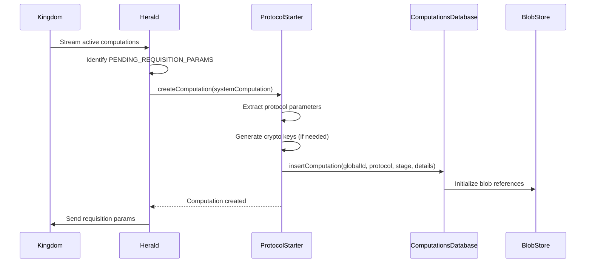
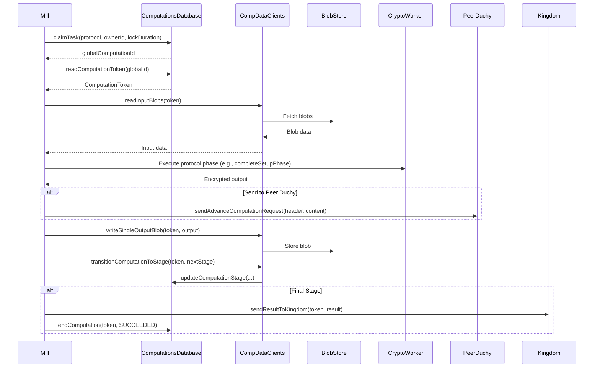

# Computation Subsystem Architecture

## 1. System Overview

The computation subsystem is the core privacy-preserving calculation engine within the Cross-Media Measurement System. It implements cryptographic protocols for secure multi-party computation (MPC) that enable multiple independent duchies (Data Computation Units) to collaboratively compute aggregate measurement metrics without revealing individual-level data.

### Purpose

- **Privacy-Preserving Aggregation**: Compute reach, frequency, and impression metrics across multiple data sources while maintaining differential privacy (DP) and k-anonymity guarantees
- **Multi-Party Computation**: Coordinate distributed cryptographic protocols across multiple independent duchy nodes
- **Protocol Orchestration**: Manage computation lifecycles through multiple stages including initialization, setup, execution, and completion phases
- **Result Calculation**: Apply histogram-based computations with privacy safeguards to produce privacy-safe measurement results

### Role in the Broader System

The computation subsystem operates within the **Duchy** service layer, serving as the computational workhorse that:

- Receives computation tasks from the **Kingdom** (central coordinator)
- Processes encrypted requisition data from **Event Data Providers (EDPs)**
- Coordinates with peer duchies to execute distributed MPC protocols
- Returns encrypted computation results back to the Kingdom for delivery to measurement consumers
- Maintains computation state and blob storage for intermediate cryptographic artifacts

### Supported Protocols

1. **Liquid Legions V2 (LLv2)**: Full reach and frequency measurements using ElGamal encryption and sketch aggregation
2. **Reach-Only Liquid Legions V2 (RoLLv2)**: Optimized variant for reach-only measurements with reduced computational overhead
3. **Honest Majority Share Shuffle (HMSS)**: Three-party protocol using secret sharing and shuffling techniques
4. **TrusTEE**: Trusted Execution Environment protocol for computations within secure enclaves

## 2. Architecture Diagram

```mermaid
graph TB
    subgraph "Kingdom System"
        Kingdom[Kingdom Service]
        KDB[(Kingdom Database)]
    end

    subgraph "Duchy - Computation Subsystem"
        subgraph "Orchestration Layer"
            Herald[Herald Daemon]
            CTM[ContinuationTokenManager]
        end

        subgraph "Processing Layer - Mills"
            MillBase[MillBase Abstract]
            LLv2Mill[LiquidLegionsV2Mill]
            RoLLv2Mill[ReachOnlyLiquidLegionsV2Mill]
            HMSSMill[HonestMajorityShareShuffleMill]
            TrusTeeMill[TrusTeeMill]
        end

        subgraph "Database Layer"
            CompDB[ComputationsDatabase]
            CompDataClients[ComputationDataClients]
            ProtocolStages[ComputationProtocolStages]
            ProtocolDetails[ComputationProtocolStageDetails]
        end

        subgraph "Cryptographic Layer"
            LLv2Crypto[LiquidLegionsV2Encryption]
            RoLLv2Crypto[ReachOnlyLiquidLegionsV2Encryption]
            HMSSCrypto[HonestMajorityShareShuffleCryptor]
            HistogramComp[HistogramComputations]
            ReachFreqComp[ReachAndFrequencyComputations]
            ImpressionComp[ImpressionComputations]
        end

        subgraph "Storage Layer"
            BlobStore[(Blob Storage)]
            CompStore[ComputationStore]
            ReqStore[RequisitionStore]
        end
    end

    subgraph "Peer Duchies"
        PeerDuchy1[Duchy B]
        PeerDuchy2[Duchy C]
    end

    subgraph "Event Data Providers"
        EDP1[EDP 1]
        EDP2[EDP 2]
    end

    Kingdom -->|Stream Computations| Herald
    Herald -->|Create/Update| CompDB
    Herald -->|Protocol Starters| CompDB

    MillBase <|-- LLv2Mill
    MillBase <|-- RoLLv2Mill
    MillBase <|-- HMSSMill
    MillBase <|-- TrusTeeMill

    LLv2Mill -->|Claim Work| CompDB
    RoLLv2Mill -->|Claim Work| CompDB
    HMSSMill -->|Claim Work| CompDB
    TrusTeeMill -->|Claim Work| CompDB

    LLv2Mill -->|Read/Write| CompDataClients
    LLv2Mill -->|Crypto Ops| LLv2Crypto
    RoLLv2Mill -->|Crypto Ops| RoLLv2Crypto
    HMSSMill -->|Crypto Ops| HMSSCrypto

    CompDataClients -->|Access| CompStore
    CompDataClients -->|Access| ReqStore
    CompStore -->|Store| BlobStore
    ReqStore -->|Store| BlobStore

    CompDB -->|Validate| ProtocolStages
    CompDB -->|Details| ProtocolDetails

    LLv2Mill -->|Send Data| PeerDuchy1
    HMSSMill -->|Send Data| PeerDuchy2
    LLv2Mill -->|Send Results| Kingdom

    EDP1 -.->|Requisition Data| ReqStore
    EDP2 -.->|Requisition Data| ReqStore

    LLv2Crypto -->|Compute Metrics| HistogramComp
    LLv2Crypto -->|Compute Metrics| ReachFreqComp
    HMSSCrypto -->|Compute Metrics| ImpressionComp

    style Herald fill:#e1f5ff
    style MillBase fill:#fff4e1
    style CompDB fill:#e8f5e9
    style LLv2Crypto fill:#f3e5f5
```

## 3. Key Components

### 3.1 Orchestration Layer

#### Herald
**Package**: `org.wfanet.measurement.duchy.herald`

**Responsibilities**:
- Synchronizes computation state between Kingdom and duchy storage
- Monitors Kingdom for new computation assignments
- Creates and initializes local duchy computations using protocol-specific starters
- Manages continuation tokens for streaming computation updates
- Handles computation lifecycle events (creation, confirmation, start, failure, deletion)

**Key Operations**:
- `continuallySyncStatuses()`: Main sync loop with retry logic
- `createComputation()`: Delegates to protocol starters (LLv2Starter, HMSSStarter, TrusTeeStarter)
- `confirmParticipant()`: Updates requisitions and cryptographic keys
- `startComputing()`: Transitions from WAIT_TO_START to active execution

#### ContinuationTokenManager
**Package**: `org.wfanet.measurement.duchy.herald`

**Responsibilities**:
- Manages streaming continuation tokens for fault-tolerant computation synchronization
- Ensures in-order processing of computation updates
- Persists latest successfully processed token for recovery

### 3.2 Processing Layer - Mills

Mills are computation processing workers that claim work items, execute protocol-specific cryptographic operations, and coordinate with peer duchies.

#### MillBase
**Package**: `org.wfanet.measurement.duchy.mill`

**Responsibilities**:
- Abstract base class providing common mill infrastructure
- Work claiming and lock management
- Computation lifecycle management (state transitions, completion, failure)
- Kingdom communication (send requisition params, send results)
- Blob I/O operations
- Metrics logging and instrumentation

**Key Methods**:
- `claimAndProcessWork()`: Claims next available computation task with lock
- `processComputationImpl()`: Abstract method for protocol-specific processing
- `sendResultToKingdom()`: Transmits encrypted computation results
- `completeComputation()`: Marks computation as succeeded/failed/canceled

#### LiquidLegionsV2Mill
**Package**: `org.wfanet.measurement.duchy.mill.liquidlegionsv2`

**Variants**:
- **ReachFrequencyLiquidLegionsV2Mill**: Full reach and frequency measurements
- **ReachOnlyLiquidLegionsV2Mill**: Optimized reach-only variant

**Responsibilities**:
- Execute multi-phase ElGamal-based sketch aggregation protocol
- Coordinate cryptographic operations across duchy participants
- Verify EDP participation and duchy signatures
- Aggregate encrypted sketches with differential privacy noise

**Protocol Phases**:
1. **Initialization**: Generate ElGamal keypair, send params to Kingdom
2. **Confirmation**: Verify all participants and cryptographic signatures
3. **Setup**: Aggregate requisitions and apply noise (aggregator) or encrypt local data (non-aggregator)
4. **Execution Phase 1-3**: Multi-round partial decryption and metric computation

#### HonestMajorityShareShuffleMill
**Package**: `org.wfanet.measurement.duchy.mill.shareshuffle`

**Responsibilities**:
- Execute three-party secret sharing and shuffling protocol
- Role-based processing (FIRST_NON_AGGREGATOR, SECOND_NON_AGGREGATOR, AGGREGATOR)
- Generate and verify random seeds for shuffling
- Decrypt requisition data and apply differential privacy noise

**Protocol Phases**:
1. **Initialization**: Send encryption params to Kingdom
2. **Setup**: Exchange shuffle phase inputs between non-aggregators
3. **Shuffle**: Verify seeds, shuffle frequency vectors, send to aggregator
4. **Aggregation**: Combine vectors and compute final metrics

#### TrusTeeMill
**Package**: `org.wfanet.measurement.duchy.mill`

**Responsibilities**:
- Execute computations within Trusted Execution Environment
- Decrypt requisition data using KMS-managed keys
- Compute metrics in secure enclave with workload identity attestation

### 3.3 Database Layer

#### ComputationsDatabase
**Package**: `org.wfanet.measurement.duchy.db.computation`

**Responsibilities**:
- Primary interface for computation persistence and querying
- Transaction management for computation state transitions
- Work queue management with locking and prioritization
- Blob reference tracking and requisition metadata storage
- Computation statistics and metrics logging

**Core Operations**:
- `claimTask()`: Atomically claim and lock next available work item
- `updateComputationStage()`: Transition computation to new stage with blob references
- `endComputation()`: Move to terminal state (SUCCEEDED/FAILED/CANCELED)
- `readComputationToken()`: Retrieve current computation state and metadata

#### ComputationDataClients
**Package**: `org.wfanet.measurement.duchy.db.computation`

**Responsibilities**:
- Unified client for accessing computation storage and blob storage
- Abstracts blob read/write operations from mills
- Handles requisition blob fetching and aggregation
- Manages computation stage transitions with blob I/O

**Key Methods**:
- `transitionComputationToStage()`: Advance stage with input/output blob tracking
- `writeSingleOutputBlob()`: Write computation output to blob storage
- `readInputBlobs()`: Retrieve all input blobs for current stage
- `readRequisitionBlobs()`: Fetch requisition data from EDPs

#### ComputationProtocolStages
**Package**: `org.wfanet.measurement.duchy.db.computation`

**Responsibilities**:
- Protocol-agnostic stage enumeration and validation
- Stage transition validation across all protocols
- Conversion between stage enums and database long values
- Initial and terminal stage identification

**Supported Protocols**:
- LiquidLegionsSketchAggregationV2Protocol
- ReachOnlyLiquidLegionsSketchAggregationV2Protocol
- HonestMajorityShareShuffleProtocol
- TrusTeeProtocol

#### ComputationProtocolStageDetails
**Package**: `org.wfanet.measurement.duchy.db.computation`

**Responsibilities**:
- Manage protocol-specific stage details
- Validate duchy role compatibility with stages
- Determine post-transition behavior (continue working, queue, or don't queue)
- Calculate expected output blob counts
- Parse and serialize stage-specific details

### 3.4 Cryptographic Layer

#### LiquidLegionsV2Encryption
**Package**: `org.wfanet.measurement.duchy.mill.liquidlegionsv2.crypto`

**Responsibilities**:
- ElGamal keypair generation
- Sketch register encryption and aggregation
- Multi-round partial decryption (3 execution phases)
- Reach and frequency distribution computation
- Public key combination

**Implementation**: JniLiquidLegionsV2Encryption (JNI bridge to C++ crypto library)

#### ReachOnlyLiquidLegionsV2Encryption
**Package**: `org.wfanet.measurement.duchy.mill.liquidlegionsv2.crypto`

**Responsibilities**:
- Optimized reach-only variant with simplified execution
- Single execution phase for reach computation
- Reduced computational overhead compared to full protocol

**Implementation**: JniReachOnlyLiquidLegionsV2Encryption

#### HonestMajorityShareShuffleCryptor
**Package**: `org.wfanet.measurement.duchy.mill.shareshuffle.crypto`

**Responsibilities**:
- Shuffle phase cryptographic operations for reach and frequency
- Aggregation phase metric computation
- Support for both reach-only and reach-frequency modes

**Implementation**: JniHonestMajorityShareShuffleCryptor

#### Computation Utilities
**Package**: `org.wfanet.measurement.computation`

**Components**:
- **HistogramComputations**: Build histograms from frequency vectors
- **ReachAndFrequencyComputations**: Compute reach and frequency distributions with DP/k-anonymity
- **ImpressionComputations**: Compute impression counts with privacy guarantees

**Privacy Parameters**:
- DifferentialPrivacyParams (epsilon, delta)
- KAnonymityParams (minUsers, minImpressions, maxFrequency)

### 3.5 Storage Layer

#### ComputationStore
**Package**: `org.wfanet.measurement.duchy.storage`

**Responsibilities**:
- Blob storage abstraction for computation artifacts
- Intermediate cryptographic data storage (encrypted sketches, partial decryptions)
- Output blob management

#### RequisitionStore
**Package**: `org.wfanet.measurement.duchy.storage`

**Responsibilities**:
- Requisition blob storage and retrieval
- Encrypted requisition data from EDPs
- Requisition metadata tracking

## 4. Data Flow

### 4.1 Computation Creation Flow



### 4.2 Mill Processing Flow



### 4.3 Requisition Data Flow

```
EDP → Kingdom → Duchy RequisitionStore → Mill → Crypto Worker → Computation Result
```

1. **EDP Fulfillment**: Event Data Provider encrypts requisition data and uploads to Duchy's RequisitionStore
2. **Mill Retrieval**: Mill reads requisition blobs via CompDataClients.readRequisitionBlobs()
3. **Crypto Processing**: Mill passes encrypted data to protocol-specific crypto worker
4. **Aggregation**: Crypto worker aggregates across requisitions with privacy noise
5. **Result Transmission**: Mill sends encrypted result to Kingdom for delivery to measurement consumer

## 5. Integration Points

### 5.1 Kingdom System

**Protocol**: gRPC (system.v1alpha)

**Services Used**:
- **SystemComputations**: Stream active computations, get computation details
- **SystemComputationParticipants**: Update participant state, confirm participation, send requisition params, send results, fail participant
- **SystemComputationLogEntries**: Create log entries for computation events

**Data Flow**:
- **Inbound**: Kingdom streams computation assignments to Herald via `StreamActiveComputations`
- **Outbound**: Herald sends requisition params, Mills send encrypted results

### 5.2 Peer Duchies

**Protocol**: gRPC (ComputationControl service)

**Operations**:
- `AdvanceComputation`: Send intermediate cryptographic data to next duchy in protocol sequence
- `GetComputationStage`: Query peer duchy's current computation stage for synchronization

**Coordination**:
- **LLv2**: Non-aggregator → Aggregator (setup phase), Aggregator → Non-aggregator (execution phases)
- **HMSS**: First Non-Aggregator → Second Non-Aggregator → Aggregator

### 5.3 Event Data Providers (EDPs)

**Protocol**: Requisition fulfillment via blob storage

**Data Exchange**:
- EDPs receive requisition specifications from Kingdom
- EDPs encrypt event data using duchy public keys
- EDPs upload encrypted requisition blobs to duchy blob storage
- Mills retrieve requisition blobs for computation processing

**Privacy Protection**:
- Requisition data encrypted with duchy-specific keys
- EDP-level differential privacy noise applied before encryption (optional)
- K-anonymity thresholds enforced at computation level

### 5.4 Internal Duchy Services

**ComputationControl Service**: Inter-mill and peer duchy communication
**Computations Service**: Internal computation storage and state management
**ContinuationTokens Service**: Persistence of streaming continuation tokens

## 6. Design Patterns

### 6.1 Abstract Factory Pattern
**Protocol Starters**: Herald uses protocol-specific starter factories (LiquidLegionsV2Starter, HonestMajorityShareShuffleStarter, TrusTeeStarter) to create computations based on protocol type.

### 6.2 Template Method Pattern
**MillBase**: Defines the skeleton of computation processing algorithm in `claimAndProcessWork()`, with protocol-specific implementations in `processComputationImpl()`.

### 6.3 State Machine Pattern
**Computation Stages**: Each protocol implements a finite state machine with validated stage transitions enforced by ComputationProtocolStages.

**Example (LLv2)**:
```
INITIALIZATION_PHASE → WAIT_REQUISITIONS_AND_KEY_SET → CONFIRMATION_PHASE →
WAIT_TO_START → SETUP_PHASE → WAIT_EXECUTION_PHASE_ONE_INPUTS →
EXECUTION_PHASE_ONE → ... → COMPLETE
```

### 6.4 Strategy Pattern
**Cryptographic Workers**: Mills delegate protocol-specific crypto operations to interchangeable strategy implementations (LiquidLegionsV2Encryption, HonestMajorityShareShuffleCryptor).

### 6.5 Observer Pattern
**Herald Streaming**: Herald observes Kingdom computation stream and reacts to state changes with appropriate actions (create, confirm, start).

### 6.6 Repository Pattern
**ComputationsDatabase**: Abstracts computation persistence with clean separation between domain logic (mills) and data access.

### 6.7 Façade Pattern
**ComputationDataClients**: Provides simplified unified interface to complex blob storage and computation storage subsystems.

### 6.8 Retry Pattern with Exponential Backoff
**Herald Operations**: All Herald operations use `runWithRetries()` with exponential backoff for transient failures.

### 6.9 Optimistic Locking
**Computation Tokens**: `editVersion` field enables optimistic concurrency control for computation state updates.

### 6.10 Work Queue Pattern
**Task Claiming**: ComputationsDatabase maintains a work queue with atomic claim operations and lock-based concurrency control.

## 7. Technology Stack

### 7.1 Core Technologies

**Language**: Kotlin
- Coroutines for asynchronous processing
- Null safety for robust error handling
- Extension functions for protocol-specific behavior

**RPC Framework**: gRPC
- Protocol Buffers for message serialization
- Bidirectional streaming for computation data transfer
- Deadline propagation for timeout management

**Concurrency**: Kotlin Coroutines
- Structured concurrency with supervisors
- Flow API for streaming blob data
- Semaphores for concurrency limiting (Herald maxConcurrency)

### 7.2 Cryptographic Libraries

**Google Tink**: Key management and encryption for HMSS and TrusTEE protocols
- Hybrid encryption (ECIES with AES-GCM)
- KeysetHandle abstraction
- KMS integration for TrusTEE

**AnySketch Crypto (C++ via JNI)**: Native cryptographic operations for LLv2 protocols
- ElGamal encryption over elliptic curves
- Sketch aggregation and noise addition
- Multi-party computation primitives

**Google Differential Privacy Library**: Noise generation
- Gaussian noise mechanism
- Sensitivity calculations

### 7.3 Storage

**Blob Storage**: Cloud object storage abstraction (GCS, S3, etc.)
- ComputationStore for computation artifacts
- RequisitionStore for requisition data
- Streaming upload/download for large blobs

**Relational Database**: PostgreSQL or Cloud Spanner
- Computation metadata and state
- Work queue tables with locking
- Requisition metadata
- Computation statistics and metrics

### 7.4 Observability

**OpenTelemetry**: Metrics and instrumentation
- Computation duration histograms
- Stage transition counters
- Error rate metrics

**Logging**: Structured logging for computation lifecycle events

### 7.5 Protocols and Standards

**MPC Protocols**: Liquid Legions V2, Honest Majority Share Shuffle, TrusTEE
**Cryptographic Standards**: ElGamal encryption, Tink ECIES, AES-GCM
**Privacy Standards**: Differential Privacy (ε, δ), k-anonymity
**Certificate Standards**: X.509 for duchy identity and signature verification

### 7.6 Dependencies

**Protocol Buffers**: Schema definition and code generation
**io.grpc**: gRPC client and server stubs
**kotlinx.coroutines**: Asynchronous programming
**com.google.crypto.tink**: Cryptographic operations
**com.google.privacy.differentialprivacy**: DP noise generation
**org.wfanet.anysketch**: Sketch-based MPC primitives

---

## Summary

The computation subsystem is a sophisticated distributed system that implements multiple secure multi-party computation protocols to enable privacy-preserving cross-media measurement. Through careful orchestration of cryptographic operations, state management, and inter-duchy coordination, it enables measurement consumers to obtain aggregate insights without compromising individual privacy. The architecture emphasizes modularity, protocol extensibility, fault tolerance, and privacy-by-design principles.
