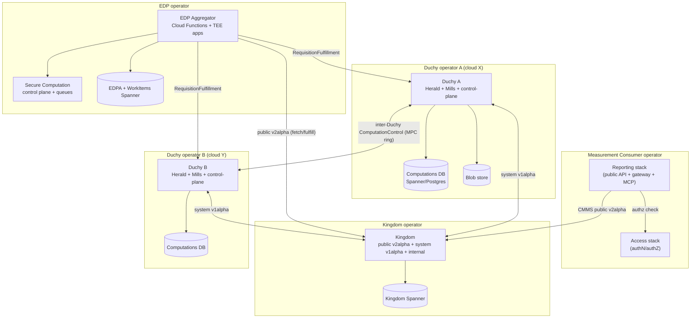

# Deployment & Operations

The WFA Cross-Media Measurement System (CMMS) is not a single deployable — it is
a federation of independently operated deployments (one **Kingdom**, two or more
**Duchies**, one or more **Data Provider** stacks, and a **Reporting/Access**
stack) that trust each other only over mutually-authenticated gRPC. This
cross-cutting doc explains how those pieces are built into container images,
described as Kubernetes manifests, wired to their cloud dependencies (Spanner,
Postgres, Cloud Storage, Pub/Sub, KMS, Confidential Space), and kept running: the
`deploy/` package convention that splits cloud-agnostic code from cloud-specific
code, the CUE-based manifest system, the multi-cloud (GKE / EKS) topology, and
the day-2 operational procedures — certificate/key rotation, protocol
enablement, and retention — documented under [`docs/operations`](../../operations/).
For per-subsystem internals, follow the links into the
[component docs](../components/); this doc only covers how they are shipped and
run.

## 1. Deployment topology

A production CMMS instance is spread across **mutually distrusting operators**.
The multi-party-computation trust model requires that no single operator controls
enough of the system to deanonymize measurement data, so the deployments are
physically and organizationally separate and may even run on different clouds.

| Deployment | Operator | Count | Owns | Key services |
| --- | --- | --- | --- | --- |
| Kingdom | Halo coordinator | 1 | Kingdom Spanner DB | `v2alpha-public-api-server`, `system-api-server`, `gcp-kingdom-data-server` |
| Duchy | independent MPC operators | 2+ | Computations DB (Spanner or Postgres) + blob store | `computation-control-server`, `requisition-fulfillment-server`, Herald daemon, `mill-job-scheduler`, internal data server |
| Data Provider (EDPA) | each EDP | 1 per EDP | EDPA metadata Spanner + blob store | Metadata Storage API, Cloud Functions, Confidential Space TEE apps |
| Reporting + Access | Reporting operator | 1 | Reporting Postgres + Spanner, Access Spanner | `reporting-v2alpha-public-api-server`, `reporting-grpc-gateway`, internal reporting server, `access-public-api-server` |
| Secure Computation | (colocated with EDPA operator) | 1 | WorkItems Spanner | `secure-computation-public-api-server`, internal API server, `DataWatcher` |



Key topology facts, each grounded in the component docs:

*   The **Kingdom is the hub** that everyone else talks to, but it initiates
    almost no outbound RPCs — Duchies and EDPAs poll/stream it. See
    [kingdom.md](../components/kingdom.md).
*   **Duchies form an MPC ring** and talk to each other directly over the
    system-v1alpha `ComputationControl` API; the ring order is derived
    deterministically so no coordination is needed. See
    [duchy.md](../components/duchy.md).
*   **Data Providers** run the EDP Aggregator, which fetches requisitions from
    the Kingdom and fulfills results either directly to the Kingdom or, for MPC
    protocols, to the Duchies' `RequisitionFulfillment` service. See
    [edpaggregator.md](../components/edpaggregator.md) and
    [securecomputation.md](../components/securecomputation.md).
*   **Reporting and Access** are deployed together (see §5) and sit in front of
    the Measurement Consumer; Reporting is a client of the Kingdom's public API.
    See [reporting.md](../components/reporting.md) and
    [access.md](../components/access.md).

## 2. The `deploy/` package convention

Every subsystem separates **cloud-agnostic** code from **cloud-specific** code
using a consistent directory layout under its `deploy/` tree. This is the same
"`common` means shared among siblings" rule described in
[common-libraries.md](../components/common-libraries.md), applied to deployment.

```
.../<subsystem>/deploy/
  common/          # cloud-agnostic: abstract servers, daemons, job entry points, interfaces
    server/        #   e.g. KingdomDataServer, DuchyDataServer, PublicApiServer
    job/ daemon/   #   e.g. MillJobScheduler, retention jobs
  gcloud/          # Google Cloud implementations
    spanner/       #   Spanner-backed internal services + db/ layer
    server/        #   Gcs*/Spanner* concrete servers
    job/ datawatcher/ publisher/ ...
  aws/             # AWS implementations (Duchy only, today)
  postgres/        # Postgres backend (Duchy internal DB, Reporting core entities)
```

Concretely:

*   **Kingdom** — the abstract `KingdomDataServer`
    (`.../kingdom/deploy/common/server/KingdomDataServer.kt`) is specialized by
    `SpannerKingdomDataServer` (`.../kingdom/deploy/gcloud/server/`). Cloud-agnostic
    job wrappers live in `.../kingdom/deploy/common/job`; the BigQuery
    `OperationalMetricsExport` lives in `.../kingdom/deploy/gcloud/job`.
*   **Duchy** — servers in `.../duchy/deploy/common/server` have `ForwardedStorage*`
    and, for GCS/Spanner, `Gcs*`/`Spanner*` concrete variants under
    `.../duchy/deploy/gcloud`. A parallel `.../duchy/deploy/aws` tree
    (verified: `.../deploy/aws/server`, `.../deploy/aws/daemon/herald`,
    `.../deploy/aws/job/mill`, `.../deploy/aws/postgres`) provides the AWS
    backend, and `.../duchy/deploy/common/postgres` provides the Postgres option.
    The Duchy is the subsystem that most fully exercises multi-cloud.
*   **Reporting** — cloud-agnostic servers/jobs under `deploy/v2/common`; Postgres
    data services under `deploy/v2/postgres`; Spanner (`BasicReports`,
    `ReportResults`) under `deploy/v2/gcloud/spanner`.
*   **EDPA / Secure Computation / Access** — a `deploy/common` facade + entry
    points, with all DB and cloud wiring under `deploy/gcloud/spanner`.

The invariant across all of them (see the component docs): **only the internal
API server touches the database**, and cloud SDK dependencies are confined to the
`gcloud`/`aws` subtrees. The `gcloud/BUILD.bazel` `package_group` in
common-libraries even enumerates exactly which packages may import the Google
Cloud layer.

## 3. Container images

Container images are built from Bazel targets and enumerated in
`src/main/docker/images.bzl` (`COMMON_IMAGES`), each a `struct(name, image,
repository)` mapping a Bazel image target to a registry repository suffix under a
shared prefix (e.g. `duchy/mill-job-scheduler`, `kingdom/data-server`,
`kingdom/spanner-update-schema`). Pre-built images for each release are published
to GitHub Packages (`ghcr.io/world-federation-of-advertisers/...`), tagged with
the release version — see [`updating-release.md`](../../operations/updating-release.md).

Notable image families:

*   **Server images** — one per gRPC server binary (e.g. `kingdom/data-server`,
    `duchy/async-computation-control`).
*   **Job images** — retention/cron jobs (`kingdom/completed-measurements-deletion`,
    `duchy/computations-cleaner`) and the Reporting jobs.
*   **Schema-updater images** — e.g. `kingdom/spanner-update-schema`,
    `duchy/spanner-update-schema`, `duchy/postgres-update-schema`. These wrap
    common-jvm's Spanner `UpdateSchema` and are run as **init containers** (§4.3).
*   **TrusTEE mill / TEE app images** — for Confidential Space these must be
    **signed** (by the Sign Images workflow) so the enclave will run them; see
    [`enabling-trustee-in-kingdom-and-duchy.md`](../../operations/enabling-trustee-in-kingdom-and-duchy.md).

## 4. Kubernetes manifests (CUE)

Kubernetes objects are authored in [CUE](https://cuelang.org/) under
`src/main/k8s/` and rendered to manifests (`src/main/k8s/README.md`). All
resources carry `app.kubernetes.io/part-of: halo-cmms` and a
`app.kubernetes.io/component` label (`kingdom`, `duchy`, `simulator`, …).

### 4.1 Base definitions

`src/main/k8s/base.cue` defines partial CUE schemas for the K8s object types the
system uses, plus CMMS-specific conventions:

| Definition | Purpose |
| --- | --- |
| `#Deployment` / `#ServerDeployment` | Long-lived servers; gRPC container port `8443` (`#GrpcPort`), gRPC readiness probe on health port `8080` (`#HealthPort`) |
| `#Service` / `#ExternalService` / `#GrpcService` | A `#Service` is `ClusterIP` by default; `#ExternalService` sets `type: LoadBalancer` for externally reachable endpoints |
| `#CronJob` | Scheduled jobs (retention, metrics, scheduling) |
| `#PodTemplate` | Template pods that the Duchy `MillJobScheduler` instantiates into per-computation `Job`s |
| `#NetworkPolicy` / `defaultNetworkPolicies` | A `default-deny` policy plus explicit allow rules; the default posture denies all pod traffic and only permits kube-dns + declared gRPC edges |
| `#JavaOptions` | Standardized JVM flags (RAM percentages, heap-dump-on-OOM to `/run/heap-dumps`) |

The base `#ExternalService` just sets `LoadBalancer`; the cloud overlays refine
it — e.g. `src/main/k8s/dev/base_eks.cue` adds AWS NLB annotations
(`aws-load-balancer-type: nlb`, `internet-facing`, EIP allocations) and smaller
default JVM heaps, demonstrating how the same base is specialized per cloud.

### 4.2 Base vs. cloud vs. local layering

Each subsystem has a cloud-agnostic base CUE file, a `dev/` (GKE/EKS) overlay,
and a `local/` overlay for in-cluster testing:

| Subsystem | Base | GKE overlay | Local overlay |
| --- | --- | --- | --- |
| Kingdom | `k8s/kingdom.cue` | `k8s/dev/kingdom_gke.cue` | `k8s/local/kingdom.cue` |
| Duchy | `k8s/duchy.cue` | `k8s/dev/duchy_gke.cue`, `k8s/dev/duchy_eks.cue` | `k8s/local/duchies.cue` |
| Reporting + Access | `k8s/reporting_v2.cue` | `k8s/dev/reporting_v2_gke.cue` | `k8s/local/reporting_v2.cue` |
| Secure Computation | `k8s/secure_computation.cue` | `k8s/dev/secure_computation_gke.cue` | — |
| EDP Aggregator | `k8s/edp_aggregator.cue` | `k8s/dev/edp_aggregator_gke.cue` | — |

Image coordinates are injected at render time via CUE tags
(`src/main/k8s/dev/config.cue`: `@tag("container_registry")`,
`@tag("image_repo_prefix")`, `@tag("image_tag")`), so the same manifests can be
pointed at any registry/tag. The `dev/` overlays also pull in Kustomization
files (`*_kustomization.yaml`) for secrets and config files.

### 4.3 What runs where

Externally exposed services (verified `#ExternalService` usages in
`src/main/k8s/*.cue`):

| Deployment | External service(s) |
| --- | --- |
| Kingdom | `system-api-server`, `v2alpha-public-api-server` (`kingdom.cue`) |
| Duchy | `computation-control-server`, `requisition-fulfillment-server` (`duchy.cue`) |
| EDPA | `edp-aggregator-system-api-server` (`edp_aggregator.cue`) |
| Secure Computation | `secure-computation-public-api-server` (`secure_computation.cue`) |
| Reporting/Access | `reporting-v2alpha-public-api-server`, `access-public-api-server`, `reporting-grpc-gateway` (`reporting_v2.cue`) |

Everything else — internal data servers, the Reporting MCP server
(deliberately `ClusterIP` for now), and all jobs — is cluster-internal and
reachable only through mTLS on the internal network, guarded by the
`default-deny` NetworkPolicy plus explicit gRPC allow edges.

**Schema init containers.** Servers that own a Spanner database run a
schema-updater as an init container before the main container starts, applying
Liquibase migrations. For example `kingdom.cue` wires an `update-kingdom-schema`
init container into the data-server deployment; the Duchy, Access, and Secure
Computation manifests do the analogous thing (`update-duchy-schema`,
`update-access-schema`, and a schema-update init container respectively).

**Duchy mill scheduling.** The Duchy's `mill-job-scheduler` Deployment
(`duchy.cue`) is unusual: instead of a long-lived mill Deployment, it watches the
internal `Computations` service and launches short-lived per-computation
Kubernetes `Job`s from `#PodTemplate`s (owning them via `OwnerReference`), one
per claimed computation. TrusTEE mills are the exception — they run as their own
daemon (and, in production, as Confidential Space MIGs), not through the
scheduler. See [duchy.md](../components/duchy.md).

### 4.4 Cron / batch workloads

| Deployment | CronJob(s) | Schedule | Purpose |
| --- | --- | --- | --- |
| Kingdom | `completed-measurements-deletion` | `15 * * * *` | Retention: delete terminal `Measurement`s past TTL |
| Kingdom | `pending-measurements-cancellation` | `45 * * * *` | Cancel stuck pending `Measurement`s past TTL |
| Kingdom | `exchanges-deletion` | `40 6 * * *` | Retention: delete old `Exchange`s |
| Kingdom | `operational-metrics` | `30 * * * *` | Export metrics to BigQuery (`kingdom_gke.cue`) |
| Kingdom | `measurement-system-prober` | `* * * * *` | Synthetic probe / pipeline health (`measurement_system_prober.cue`) |
| Duchy | `computations-cleaner` | `0 * * * *` | Purge terminal computations + blobs (`duchy.cue`) |
| Reporting | `report-scheduling` | (per config) | Materialize scheduled `Report`s |
| Reporting | `report-result-post-processor` | (per config) | initContainer drives `BasicReport`s, main container runs Python noise-correction |

The Kingdom retention schedules and their `--dry-run` / `--time-to-live` /
`--days-to-live` flags are the subject of
[`updating-retention-policies.md`](../../operations/updating-retention-policies.md)
(see §6.3). EDPA and Secure Computation do their scheduling differently: EDPA
Cloud Functions are triggered by **Cloud Scheduler** (HTTP) or by the
`DataWatcher`, and TEE apps are driven by **Pub/Sub** backlog, not by K8s
CronJobs.

## 5. Cloud dependencies

The CMMS relies on managed cloud services, abstracted (mostly by common-jvm) so
the same server code runs on GKE or EKS.

| Dependency | Used by | Notes |
| --- | --- | --- |
| Cloud **Spanner** | Kingdom, Duchy (option), EDPA metadata, Secure Computation WorkItems, Access, Reporting (`BasicReports`/`ReportResults`) | Authoritative relational store; interleaved/cascading tables; dual internal-PK + external-resource-ID columns |
| **Postgres** | Duchy (option), Reporting core entities | Alternative relational backend; on AWS via RDS |
| Cloud **Storage** (GCS / S3 / filesystem) | Duchy blob store, EDPA raw/labeled impressions + grouped requisitions, Reporting post-processor logs | Large encrypted payloads; only paths stored in the DB |
| Cloud **Pub/Sub** | Secure Computation control plane, EDPA TEE apps | Per-purpose work queues + dead-letter subscription |
| Cloud **KMS** | EDPA (envelope encryption of impression DEKs), Duchy (TrusTEE) | Customer KMS via Workload Identity Federation; keys released only to attested enclaves |
| **Confidential Space** (TEE) | EDPA TEE apps, Duchy TrusTEE mill | AMD SEV VMs in MIGs autoscaled on Pub/Sub backlog; attestation-gated key access |
| **BigQuery** | Kingdom operational metrics | CronJob export target |

These are consumed through the `common-jvm` `gcloud.*` wrappers
(`gcloud.spanner`, `gcloud.gcs`, `gcloud.pubsub`, `gcloud.kms`, `gcloud.postgres`)
described in [common-libraries.md](../components/common-libraries.md); AWS
equivalents live in the Duchy `deploy/aws` tree and the AWS Terraform modules.

### Infrastructure as code (Terraform)

Cluster and cloud-resource provisioning is Terraform:

*   **Google Cloud** — `src/main/terraform/gcloud/` with `modules/` (cluster,
    node-pool, duchy, kingdom, reporting, access, edp-aggregator,
    secure-computation, `mig` for Confidential Space, pubsub, cloud-scheduler,
    storage-bucket, workload-identity-user, …) and copy-and-configure
    `examples/`. Backend is typically GCS — see
    [`docs/gke/terraform.md`](../../gke/terraform.md).
*   **AWS** — `src/main/terraform/aws/` with `modules/` (eks-cluster,
    eks-cluster-addons, duchy, rds-postgres, s3-bucket) and `examples/duchy`.
    Backend is typically S3 — see [`docs/eks/terraform.md`](../../eks/terraform.md).
*   **Panel match** — `src/main/terraform/panel-match/`.

The Confidential Space provisioning (`terraform/gcloud/modules/mig/main.tf`)
sets `enable_confidential_compute = true`, `confidential_instance_type = "SEV"`,
secure boot, and the `roles/confidentialcomputing.workloadUser` role, and passes
the container image/command/env via instance metadata
(`tee-image-reference`, `tee-cmd`, `tee-env-*`) — see
[securecomputation.md](../components/securecomputation.md).

## 6. Configuration model

### 6.1 Config protos vs. wire API

A recurring architectural rule (per
[`docs/api-standards.md`](../../api-standards.md)) governs deployment
configuration: **versioned API messages are only for data that crosses the wire
in API calls; static process configuration lives in separate, unversioned
`config` protos.** Examples surfaced as mounted files / flags:

*   Kingdom: `DuchyInfo` / `DuchyIds`, per-protocol config textprotos
    (`Llv2ProtocolConfig`, `RoLlv2ProtocolConfig`, `HmssProtocolConfig`,
    `TrusTeeProtocolConfig`), rate-limit config, the
    authority-key-identifier→principal map.
*   Access: `PermissionsConfig`, `OpenIdProvidersConfig`,
    `AuthorityKeyToPrincipalMap` (under `config/access`).
*   Secure Computation: `QueuesConfig`, `DataWatcherConfig` (under
    `config/securecomputation`).
*   EDPA: per-EDP KMS/TLS/consent config and fetcher/sync configs (under
    `config/edpaggregator`), delivered as text protos in a bucket named by
    `EDPA_CONFIG_STORAGE_BUCKET`.
*   Reporting: `MetricSpecConfig`, `MeasurementConsumerConfig`,
    `ImpressionQualificationFilterConfig` (under `config/reporting`).

Config files are mounted into pods via ConfigMap/Secret volumes (the `#Mount`
helpers in `base.cue`), and process parameters are passed as picocli flags.

### 6.2 Feature flags & protocol enablement

Whether an MPC protocol is available is a **deployment/config decision**, not a
schema change (there is no `Duchies` table — the Duchy set is fixed by config).
The Kingdom public API server gates protocols with flags such as
`--enable-ro-llv2-protocol`, `--enable-hmss`, `--enable-trustee`, plus
per-`MeasurementConsumer` allowlists. Turning a protocol on is coordinated across
Kingdom, Duchies, and EDPs; the operations docs walk through each:

*   [`enabling-reach-only-llv2.md`](../../operations/enabling-reach-only-llv2.md)
*   [`enabling-trustee-in-kingdom-and-duchy.md`](../../operations/enabling-trustee-in-kingdom-and-duchy.md)
    and [`enabling-trustee-on-edp.md`](../../operations/enabling-trustee-on-edp.md)
*   [`enabling-gaussian-noise-and-acdp-pbm.md`](../../operations/enabling-gaussian-noise-and-acdp-pbm.md)

### 6.3 Retention

Retention is enforced by the Kingdom CronJobs from §4.4. Operators tune the
`schedule`, `--dry-run`, and `--time-to-live` / `--days-to-live` container args
(via `kubectl edit`/`kubectl patch`) as documented in
[`updating-retention-policies.md`](../../operations/updating-retention-policies.md).
`--dry-run=true` makes a job log only what it *would* delete.

## 7. Security & identity at deployment time

Deployment-time security rests on mutual TLS and a config-driven identity map:

*   **mTLS everywhere internal.** Edge servers connect to their internal data
    server over mTLS (`--internal-api-target`); Duchies authenticate each other
    and the Kingdom by client certificate. The **authority key identifier (AKID)**
    of a client cert is mapped to a principal / Duchy identity via config
    (`AuthorityKeyToPrincipalMap`, `DuchyCertConfig`) — see
    [common-libraries.md](../components/common-libraries.md) and
    [access.md](../components/access.md).
*   **Certificate & key rotation** is a first-class operational procedure. TLS
    certs live in K8s `Secret`s (rotate by overwriting and `kubectl apply`); API
    (consent-signaling) certificates and encryption public keys are rotated
    through the public API (`CreateCertificate`, `UpdatePublicKey`,
    `RevokeCertificate`) using the `MeasurementSystem` / `EncryptionPublicKeys`
    CLI tools. Root CAs are deliberately hard to rotate and kept in a CA service.
    Full guide: [`certificate-key-rotation.md`](../../operations/certificate-key-rotation.md).
*   **Attestation-gated keys** for TEE workloads: DEKs are released only to a
    correctly attested Confidential Space workload (see §5 and
    [securecomputation.md](../components/securecomputation.md)).

## 8. Day-2 operations reference

| Task | Where |
| --- | --- |
| Provision GKE cluster / infra | [`docs/gke/cluster-config.md`](../../gke/cluster-config.md), [`docs/gke/terraform.md`](../../gke/terraform.md) |
| Provision EKS cluster / infra | [`docs/eks/machine-setup.md`](../../eks/machine-setup.md), [`docs/eks/terraform.md`](../../eks/terraform.md) |
| Deploy Kingdom | [`docs/gke/kingdom-deployment.md`](../../gke/kingdom-deployment.md) |
| Deploy Duchy (GKE / EKS) | [`docs/gke/duchy-deployment.md`](../../gke/duchy-deployment.md), [`docs/eks/duchy-deployment.md`](../../eks/duchy-deployment.md) |
| Deploy Reporting | [`docs/gke/reporting-v2-server-deployment.md`](../../gke/reporting-v2-server-deployment.md) |
| Deploy PDP / simulators | [`docs/gke/population-requisition-fulfiller-deployment.md`](../../gke/population-requisition-fulfiller-deployment.md), [`docs/gke/simulator-deployment.md`](../../gke/simulator-deployment.md) |
| Metrics / observability | [`docs/gke/metrics-deployment.md`](../../gke/metrics-deployment.md), [`docs/eks/metrics-deployment.md`](../../eks/metrics-deployment.md) |
| Local dev cluster | [`src/main/k8s/local/README.md`](../../../src/main/k8s/local/README.md) |
| Create resources (accounts, EDPs, MCs) | [`creating-resources.md`](../../operations/creating-resources.md) |
| Update to a new release | [`updating-release.md`](../../operations/updating-release.md) |
| Rotate certs / keys | [`certificate-key-rotation.md`](../../operations/certificate-key-rotation.md) |
| Enable a protocol | [`enabling-reach-only-llv2.md`](../../operations/enabling-reach-only-llv2.md), [`enabling-trustee-in-kingdom-and-duchy.md`](../../operations/enabling-trustee-in-kingdom-and-duchy.md) |
| Tune retention | [`updating-retention-policies.md`](../../operations/updating-retention-policies.md) |

## 9. Notable decisions & gotchas

*   **Independent operators, mTLS trust.** There is no shared control plane
    across operators; trust is entirely certificate-based and each operator runs
    its own cluster, DB, and secrets. Adding/removing a Duchy is a coordinated
    config change (AKID maps + `DuchyInfo`), not a database change.
*   **Multi-cloud is real for Duchies.** The `deploy/aws` tree and AWS Terraform
    modules exist so a Duchy operator can run on EKS + RDS + S3 while a peer runs
    on GKE + Spanner + GCS; the MPC still works because the protocol only depends
    on the gRPC contract.
*   **Cloud-agnostic vs. cloud-specific split is enforced.** Server logic never
    imports cloud SDKs directly; only `deploy/.../gcloud` (or `/aws`) does, and
    Bazel `package_group`s police it.
*   **Schema migrations run as init containers**, so a rolling deploy of the
    data server applies its own Liquibase changelog before serving.
*   **CronJob edits only affect future Jobs.** Changing a retention schedule or
    TTL does not touch already-running Jobs (see
    [`updating-retention-policies.md`](../../operations/updating-retention-policies.md)).
*   **TEE apps are not K8s Deployments.** EDPA/TrusTEE enclave workloads run in
    Confidential Space MIGs (Terraform), scheduled by Pub/Sub backlog, not by the
    Kubernetes scheduler.

## See also

*   Component docs: [kingdom.md](../components/kingdom.md),
    [duchy.md](../components/duchy.md),
    [edpaggregator.md](../components/edpaggregator.md),
    [reporting.md](../components/reporting.md),
    [securecomputation.md](../components/securecomputation.md),
    [access.md](../components/access.md),
    [common-libraries.md](../components/common-libraries.md).
*   Operations guides: [`docs/operations/`](../../operations/).
*   Deployment guides: [`docs/gke/`](../../gke/), [`docs/eks/`](../../eks/).
*   Standards: [`docs/api-standards.md`](../../api-standards.md) (config vs. API),
    [`docs/bazel-build-standards.md`](../../bazel-build-standards.md) (image/target
    conventions).
</content>
</invoke>
