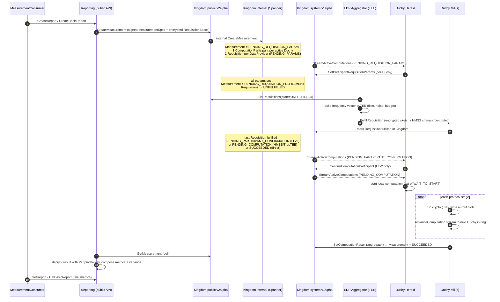
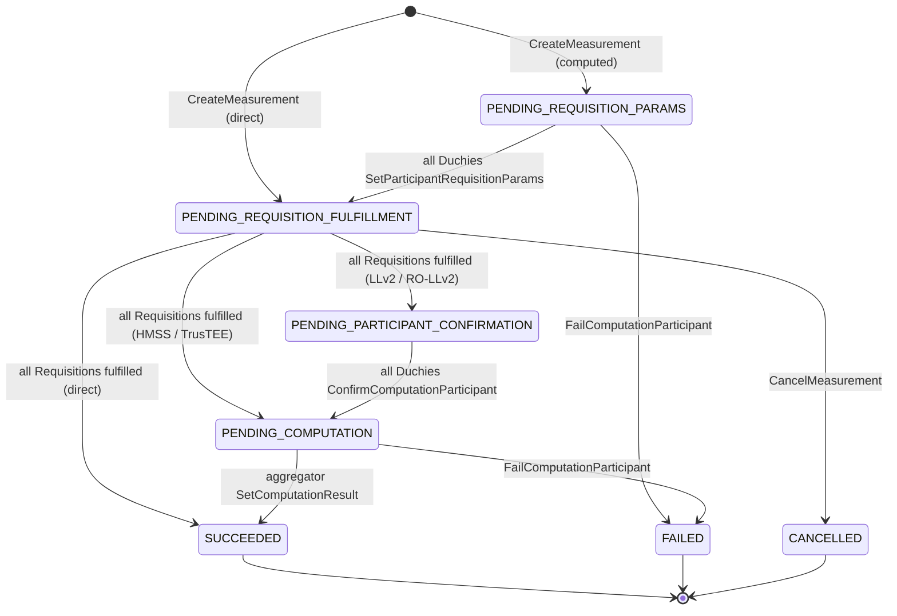
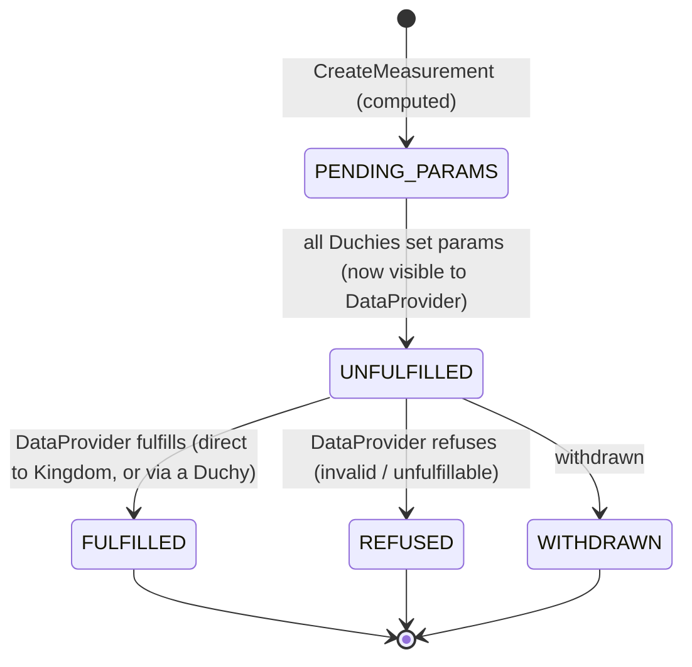

# Measurement Lifecycle (End-to-End Data Flow)

This document traces a single cross-media measurement from beginning to end,
stitching together the per-component docs into one narrative. A
`MeasurementConsumer` (MC) asks for a report; the Reporting subsystem expands it
into CMMS `Measurement`s and submits them to the Kingdom; the Kingdom registers
each `Measurement`, derives one `Requisition` per `DataProvider`, and coordinates
the participating `Duchy`s; `DataProvider`s (typically via the EDP Aggregator)
fetch and fulfill those `Requisition`s with encrypted sketches or secret shares;
the Duchies claim the computation and run the multi-party protocol in a
deterministic order; the encrypted result flows back to the Kingdom; and
Reporting decrypts the aggregate, composes metrics, and serves the report. No
single component ever sees cross-publisher event-level data in the clear — that
is the whole point of the system. Read this after skimming the component docs it
links; it deliberately does not repeat their internals.

## 1. Actors and components

| Role | Component doc | What it does in the lifecycle |
| --- | --- | --- |
| MeasurementConsumer (MC) | [../components/client-libraries.md](../components/client-libraries.md) | Requests reports; owns the private key that decrypts results; computes variance/confidence intervals. |
| Reporting subsystem | [../components/reporting.md](../components/reporting.md) | Expands `Report`/`BasicReport` into `Metric`s and CMMS `Measurement`s; decrypts and composes results. |
| Kingdom | [../components/kingdom.md](../components/kingdom.md) | Central coordinator: registers `Measurement`s, derives `Requisition`s, drives the state machine, coordinates Duchies, stores the encrypted result. |
| DataProvider (EDP) libraries | [../components/event-data-provider.md](../components/event-data-provider.md), [../components/client-libraries.md](../components/client-libraries.md) | Reference libraries to filter events, add DP noise, enforce a privacy budget, and build fulfillment requests. |
| EDP Aggregator (EDPA) | [../components/edpaggregator.md](../components/edpaggregator.md) | Deployable EDP integration: fetches `Requisition`s, computes frequency vectors in TEEs, fulfills to Duchies/Kingdom. |
| Duchies (2+) | [../components/duchy.md](../components/duchy.md) | MPC worker nodes, each holding a key share; run the protocol rounds and report the result. |
| Crypto library (C++) | [../components/crypto-library.md](../components/crypto-library.md) | Native per-round MPC crypto invoked by the Duchy Mills over JNI. |
| API & proto contract | [../components/api-and-protos.md](../components/api-and-protos.md) | Public v2alpha, system v1alpha, and internal proto tiers that all of the above speak. |

Two supporting subsystems appear along the way: the
[Secure Computation](../components/securecomputation.md) control plane (the
`WorkItem` queue that dispatches EDPA's TEE apps) and the
[Access](../components/access.md) service (authorization for Reporting's public
API).

## 2. The three API tiers this flow crosses

Every hop in the lifecycle uses one of three deliberately-separated API tiers
(see [../components/api-and-protos.md](../components/api-and-protos.md)):

*   **Public `v2alpha`** (`wfa.measurement.api.v2alpha`) — external callers. MCs
    create `Measurement`s here; `DataProvider`s list/fulfill/refuse
    `Requisition`s here; Reporting is itself a public-API client of the Kingdom.
*   **System `v1alpha`** (`wfa.measurement.system.v1alpha`) — the Duchy-facing
    contract. Duchies set requisition params, confirm participation, fulfill
    computed requisitions, report progress, and set the final result.
*   **Internal** (`wfa.measurement.internal.*`) — DB-backed contracts private to
    each component's internal servers. Database internal IDs never leave this
    tier; external IDs are used everywhere else.

The Kingdom's `ExternalComputationId` is the cross-component handle for a
`Measurement`: it lets a Duchy reference a `Measurement` over the system API
without knowing the parent `MeasurementConsumer`
(`src/main/proto/wfa/measurement/internal/kingdom/measurement.proto`).

## 3. End-to-end flow

The numbered walkthrough below follows the same path.

### 3.1 MC defines a report (Reporting)

An MC calls `CreateReport` or `CreateBasicReport` on the Reporting public
`v2alpha` API. A `Report` references `ReportingSet`s (set expressions over CMMS
`EventGroup`s) and `MetricCalculationSpec`s; the Reporting server expands these
into individual `Metric`s and, for each, one or more CMMS `Measurement`s. This
expansion (`ReportsService.createReport` calling `MetricsService` in-process,
which builds a signed `MeasurementSpec`, encrypts per-`DataProvider`
`RequisitionSpec`s, and submits to the Kingdom) is documented in
[../components/reporting.md](../components/reporting.md) §7.1. Public methods are
authorized through the [Access](../components/access.md) system before any Kingdom
call.

> A `MeasurementConsumer` can also call the Kingdom's `CreateMeasurement`
> directly (for example the `MeasurementSystemProber` synthetic MC, or the
> load-test `MeasurementConsumerSimulator`); Reporting is the product-facing path
> but not the only one. See [../components/kingdom.md](../components/kingdom.md).

### 3.2 Kingdom registers the Measurement and derives Requisitions

The Kingdom's public `MeasurementsService` validates the consent-signaling
signatures and resolves the enabled protocol, then delegates to the internal
`Measurements` service. The internal `CreateMeasurements` writer
(`src/main/kotlin/org/wfanet/measurement/kingdom/deploy/gcloud/spanner/writers/CreateMeasurements.kt`,
per [../components/kingdom.md](../components/kingdom.md) §7.1):

*   inserts the `Measurement` in state `PENDING_REQUISITION_PARAMS` (computed) or
    `PENDING_REQUISITION_FULFILLMENT` (direct);
*   computes the required Duchy set from the `ProtocolConfig` and per-
    `DataProvider` required Duchies, and inserts one `ComputationParticipant` per
    included **active** Duchy (there is no `Duchies` table — the set is fixed by
    config, so `CreateMeasurements` refuses if too few are active);
*   inserts one `Requisition` per `DataProvider` in `PENDING_PARAMS`.

### 3.3 Duchies supply requisition params

Each Duchy's `Herald` streams the Kingdom's system
`Computations.StreamActiveComputations` and, on a `PENDING_REQUISITION_PARAMS`
computation, creates it locally and drives its Mill to produce protocol params
(an ElGamal key for the LLv2 family; an HPKE key pair / seed for HMSS). The Duchy
calls system `SetParticipantRequisitionParams`. When **all** participants have
set params, the Kingdom writer moves the `Measurement` to
`PENDING_REQUISITION_FULFILLMENT` and flips its `Requisition`s to `UNFULFILLED`,
which is the state that makes them visible to `DataProvider`s on the public API.
(HMSS/TrusTEE participants go straight to `READY`; LLv2/RO-LLv2 go through
`REQUISITION_PARAMS_SET`.) See
[../components/duchy.md](../components/duchy.md) (Herald) and
[../components/kingdom.md](../components/kingdom.md) §7.1.

### 3.4 DataProviders / EDPA fetch and fulfill Requisitions

A `DataProvider` lists `UNFULFILLED` `Requisition`s, verifies the signed
`MeasurementSpec`, decrypts the `RequisitionSpec`, and produces a result. Two
fulfillment shapes exist:

*   **Direct (non-MPC).** The EDP computes the aggregate itself, signs and
    encrypts the `Measurement.Result`, and calls the Kingdom's public
    `FulfillDirectRequisition`. The base flow lives in the client library
    `RequisitionFulfiller` (see
    [../components/client-libraries.md](../components/client-libraries.md) §"DataProvider requisition fulfillment").
*   **Computed (MPC).** The EDP builds an encrypted sketch / secret share and
    streams it to a **Duchy's** public `RequisitionFulfillment` service; that
    Duchy stores the blob and marks the `Requisition` fulfilled at the Kingdom
    over the system API (see [../components/duchy.md](../components/duchy.md)).

At scale, an EDP runs the **EDP Aggregator** instead of hand-rolling this. The
EDPA's `RequisitionFetcher` streams `UNFULFILLED` `Requisition`s and stores them
as `GroupedRequisitions` blobs; the `ResultsFulfiller` TEE app then builds
per-VID frequency vectors and selects a protocol fulfiller
(`DirectMeasurementFulfiller`, `HMShuffleMeasurementFulfiller`,
`TrusTeeMeasurementFulfiller`). The underlying frequency-vector construction,
DP noise, privacy-budget accounting, and wire-request builders come from the EDP
libraries (`FrequencyVectorBuilder`, `noiser`, `PrivacyBudgetManager`, the
per-protocol `FulfillRequisitionRequestBuilder`s) described in
[../components/event-data-provider.md](../components/event-data-provider.md). TEE
apps are dispatched via the [Secure Computation](../components/securecomputation.md)
`WorkItem` control plane. See [../components/edpaggregator.md](../components/edpaggregator.md)
§7.1–§7.2.

When the **last** `Requisition` is fulfilled, the Kingdom's `FulfillRequisition`
writer advances the `Measurement` to `PENDING_PARTICIPANT_CONFIRMATION`
(LLv2/RO-LLv2), `PENDING_COMPUTATION` (HMSS/TrusTEE), or `SUCCEEDED` (direct).

### 3.5 Kingdom schedules the computation; Duchies confirm

For LLv2/RO-LLv2 the Kingdom now needs a confirmation round: each Duchy's Herald
sees `PENDING_PARTICIPANT_CONFIRMATION` and calls
`ConfirmComputationParticipant`; when all reach `READY`, the Kingdom moves the
`Measurement` to `PENDING_COMPUTATION` (HMSS/TrusTEE skip this step). See
[../components/kingdom.md](../components/kingdom.md) §7.1 and
[../components/duchy.md](../components/duchy.md).

### 3.6 Duchies claim and run the MPC in deterministic order

On `PENDING_COMPUTATION` the Herald starts the local computation (moving it out
of `WAIT_TO_START`). Work is picked up by Mill workers — either the
`MillJobScheduler` launching a Kubernetes `Job` per computation, or the
long-lived TrusTEE mill daemon — which claim a computation via an optimistic lock
and run each protocol stage. The heavy crypto is C++ invoked over JNI (see
[../components/crypto-library.md](../components/crypto-library.md)).

Crucially, the **order of Duchies in the MPC ring is deterministic and requires
no coordination**: for LLv2 the Herald's `LiquidLegionsV2Starter.orderByRoles`
sorts non-aggregators by `sha1Hash(elGamalPublicKey + globalComputationId)` and
appends the aggregator last, storing that ordering in the computation details so
every node independently agrees on the ring; at runtime
`LiquidLegionsV2Mill.nextDuchyId` just indexes into it. For HMSS the roles are
fixed by config. Between stages, a worker writes its output as a blob and streams
it to the next Duchy via `AdvanceComputation`; the receiving Duchy advances only
once **all** expected inputs for the stage are present. This ordering and hand-off
mechanism is detailed in [../components/duchy.md](../components/duchy.md)
(§"Deterministic multi-Duchy ordering", §"Advancing a stage").

### 3.7 Result returns to the Kingdom

The aggregator Duchy calls system `SetComputationResult`, which stores the
encrypted result (`DuchyMeasurementResults` / `Measurement.ResultInfo`) and moves
the `Measurement` to the terminal `SUCCEEDED` state. Any Duchy may call
`FailComputationParticipant` to move the whole `Measurement` to `FAILED`. The
Kingdom stores the result opaquely — it holds no part of the decryption key and
cannot read it. See [../components/kingdom.md](../components/kingdom.md) §7.1.

### 3.8 Reporting composes metrics and serves the report

Reporting polls the Kingdom (`MetricsService.syncInternalMeasurements`), decrypts
`SUCCEEDED` results with the MC private key from `EncryptionKeyPairStore`,
combines point estimates across `WeightedSubsetUnion`s, and computes standard
deviations via the shared `measurementconsumer/stats` `VariancesImpl` (selecting
the methodology and `NoiseMechanism` from each measurement's `protocolConfig`). A
`Metric` becomes `SUCCEEDED` only when all its measurements succeed. For
`BasicReport`s, `BasicReportsReportsJob` drives the underlying `Report`(s) and a
Python quadratic-programming post-processor corrects logical inconsistencies
(e.g. `reach(A∪B) ≥ reach(A)`) before results are served. See
[../components/reporting.md](../components/reporting.md) §7.2–§7.3 and
[../components/client-libraries.md](../components/client-libraries.md) (stats).

## 4. State machines

Two state machines drive the whole flow. They live in the Kingdom's internal
proto and are enforced transactionally in the Spanner `writers/` classes.

### 4.1 `Measurement.State`

Defined in
`src/main/proto/wfa/measurement/internal/kingdom/measurement.proto`
(`enum State`: `STATE_UNSPECIFIED`, `PENDING_REQUISITION_PARAMS`,
`PENDING_REQUISITION_FULFILLMENT`, `PENDING_PARTICIPANT_CONFIRMATION`,
`PENDING_COMPUTATION`, `SUCCEEDED`, `FAILED`, `CANCELLED`). The path branches on
protocol: MPC protocols go through Duchy coordination; `DIRECT` measurements skip
it.

### 4.2 `Requisition.State`

Also in `.../internal/kingdom/measurement.proto` (`enum State`:
`STATE_UNSPECIFIED`, `PENDING_PARAMS`, `UNFULFILLED`, `FULFILLED`, `REFUSED`,
`WITHDRAWN`). A `Requisition` starts in `PENDING_PARAMS` (invisible to
`DataProvider`s), flips to `UNFULFILLED` once all Duchy params are set, and ends
in `FULFILLED` or `REFUSED`.

The Kingdom tracks only requisition **state and metadata** — the requisition
**data** itself lives at the Duchy (computed) or is decrypted transiently by the
EDP (direct). The EDPA additionally keeps a local `RequisitionMetadata` mirror
(`STORED → QUEUED → PROCESSING → FULFILLED`, plus `REFUSED`/`WITHDRAWN`) that it
reconciles against the Kingdom's authoritative state — see
[../components/edpaggregator.md](../components/edpaggregator.md) §5.

### 4.3 Duchy computation stages (per-node)

Each Duchy also maintains its **own** stage machine in its local `Computations`
DB, independent of the Kingdom's `Measurement.State`. The Herald maps Kingdom
states onto local actions (`PENDING_REQUISITION_PARAMS → createComputation`,
`PENDING_PARTICIPANT_CONFIRMATION → confirmParticipant`,
`PENDING_COMPUTATION → startComputing`, verified in
`src/main/kotlin/org/wfanet/measurement/duchy/herald/Herald.kt`). The per-protocol
stage graphs (e.g. LLv2 `INITIALIZATION_PHASE → confirmation → setup/execution
phases → COMPLETE`, with `WAIT_*` stages) are owned by the Duchy and covered in
[../components/duchy.md](../components/duchy.md) §"Protocols and cryptography".

## 5. How privacy is preserved end-to-end

The system's guarantee is that no participant sees cross-publisher event-level
data in the clear. That property is spread across the components in this flow:

*   **Consent signaling.** The MC signs the `MeasurementSpec` and encrypts each
    per-`DataProvider` `RequisitionSpec`; the Kingdom verifies signatures at the
    public boundary but stores the encrypted payloads opaquely. Certificates are
    served by the Kingdom (see [../components/kingdom.md](../components/kingdom.md) §8).
*   **Split key shares.** Each Duchy holds only a share of the decryption key, so
    reconstructing a plaintext requires cooperation of a majority
    (see [../components/duchy.md](../components/duchy.md), [../components/crypto-library.md](../components/crypto-library.md)).
*   **Differential privacy + privacy budget.** EDPs add calibrated DP noise and
    charge a per-EDP privacy-budget ledger before fulfilling, refusing on
    over-charge (see [../components/event-data-provider.md](../components/event-data-provider.md)
    and [../components/privacy-budget-manager.md](../components/privacy-budget-manager.md)).
*   **TEE isolation.** In the EDPA path, plaintext impressions and unwrapped DEKs
    exist only inside Confidential Space TEEs
    (see [../components/edpaggregator.md](../components/edpaggregator.md) §8).
*   **Result-only decryption.** Reporting decrypts only the **aggregate**
    `Measurement` result with the MC private key — never event-level data
    (see [../components/reporting.md](../components/reporting.md) §8).

## 6. Failure and retry characteristics

*   **Idempotent, poll-driven progress.** Duchies discover work by streaming
    `StreamActiveComputations` (resumable via a continuation token), and EDPA
    Cloud Functions/TEE apps re-run on the next invocation or Pub/Sub redelivery,
    so a crashed step is retried rather than lost.
*   **Optimistic concurrency.** Kingdom state transitions abort on `etag`
    mismatch; Duchy internal calls carry a monotonically-increasing token
    `version` and work is claimed via an expiring lock.
*   **Terminal-state cleanup.** Cancellation, retention deletion, and the
    operational-metrics/prober jobs run as Kingdom CronJobs
    (see [../components/kingdom.md](../components/kingdom.md) §4.4/§9).
*   **Refusals are first-class.** An EDP that cannot fulfill a `Requisition`
    refuses it (`REFUSED`), which the Reporting/BasicReport layer surfaces rather
    than hanging.

## See also

*   [../components/kingdom.md](../components/kingdom.md) — the coordinator and the
    authoritative `Measurement`/`Requisition` state machines.
*   [../components/duchy.md](../components/duchy.md) — MPC nodes, the ring, and the
    per-node stage machine.
*   [../components/edpaggregator.md](../components/edpaggregator.md) — the
    deployable EDP fulfillment path.
*   [../components/reporting.md](../components/reporting.md) — report/metric
    composition on top of CMMS measurements.
*   [../components/event-data-provider.md](../components/event-data-provider.md),
    [../components/client-libraries.md](../components/client-libraries.md) — the
    EDP/MC libraries used inside the fulfillment and composition steps.
*   [../components/api-and-protos.md](../components/api-and-protos.md) — the
    public / system / internal proto tiers this flow crosses.
</content>
</invoke>
