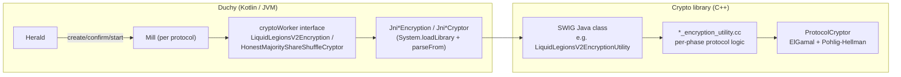
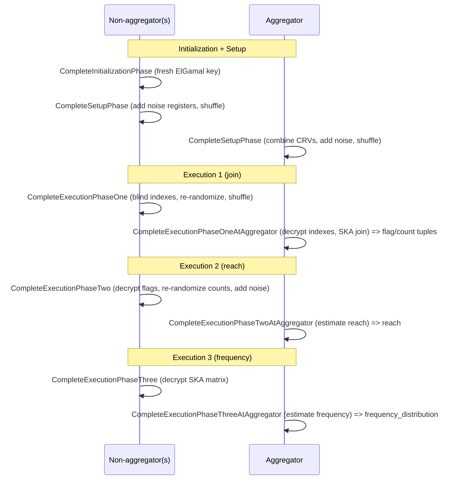
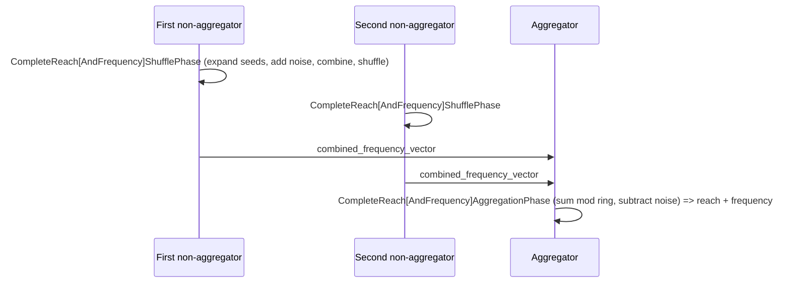

# MPC & Cryptography

The Cross-Media Measurement system computes cross-publisher reach and frequency
without any single operator ever seeing another publisher's data in the clear.
It achieves this with **secure multiparty computation (MPC)**: the decryption
capability is split across two or more independent **Duchies**, and the actual
reach/frequency estimate is produced by a sequence of cryptographic operations
that no single party can complete alone. This document is a roll-up that ties
together the pieces that live in separate subsystem docs — the
[Duchy](../components/duchy.md) worker nodes, the C++
[cryptographic library](../components/crypto-library.md) they call over JNI, the
[system API](../components/api-and-protos.md) the Kingdom uses to drive them, and
the generic [Secure Computation](../components/securecomputation.md) TEE
framework — into one picture of *how the crypto actually runs*. It covers the
four supported protocols (Liquid Legions V2, Reach-Only LLv2, Honest Majority
Share Shuffle, and TrusTEE), the trust model behind them, the deterministic ring
that orders the Duchies, and how the TEE-based TrusTEE protocol differs from the
homomorphic ones.

## The trust model

The whole design rests on **no single party being trusted with plaintext**. A
measurement deployment runs 2+ Duchies, operated by independent organizations.
For the public-key protocols (the Liquid Legions family), the **composite
public key is the product of every Duchy's local ElGamal key**, so a ciphertext
must be *partially decrypted by every Duchy in turn* before it becomes plaintext
— see `combineElGamalPublicKeys` and the layered-ElGamal discussion in the
[crypto library doc](../components/crypto-library.md#cryptography-and-privacy-mechanisms).
This is why **all Duchies must participate**: any one of them can stall a
computation, but none can decrypt alone or reconstruct another publisher's data.

The same "share split" idea takes different concrete forms per protocol:

| Protocol | Key/secret each Duchy holds | Why cooperation is required |
| --- | --- | --- |
| Liquid Legions V2 / Reach-Only LLv2 | A local ElGamal key pair (created in the initialization phase) | The composite key is the product of all local keys; decryption is layered around the ring |
| Honest Majority Share Shuffle (HMSS) | An HPKE key pair / PRNG seed (non-aggregators); the data providers send *additive shares* of the frequency vector | The frequency vector is only recoverable by summing all shares mod the ring modulus |
| TrusTEE | No cross-Duchy key split; a single aggregator runs in an attested enclave, with envelope-encrypted inputs released only to that enclave | The Trusted Execution Environment (not a key split) is what enforces confidentiality |

On top of the cryptographic hiding, every honest party also adds its own
**distributed differential-privacy noise** (geometric or discrete-Gaussian,
selected by the `NoiseMechanism` enum in
`src/main/proto/wfa/measurement/internal/duchy/noise_mechanism.proto`), scaled by
the number of uncorrupted parties; the aggregator subtracts the known noise
baseline before publishing an estimate. See
`noise_parameters_computation.h/.cc` in the crypto library.

## Roles: who does what in a computation

Each Duchy has a fixed **role per protocol**, taken from its local
`ProtocolsSetupConfig` and enumerated by `RoleInComputation`
(`src/main/proto/wfa/measurement/internal/duchy/config/protocols_setup_config.proto`):

*   `AGGREGATOR` / `NON_AGGREGATOR` — used by the Liquid Legions family. The
    aggregator performs the joins and produces the final estimate; non-aggregators
    add noise, re-encrypt, and shuffle.
*   `FIRST_NON_AGGREGATOR` / `SECOND_NON_AGGREGATOR` — used by HMSS, where the
    aggregation is done by a third (aggregator) node and the two non-aggregators
    process shares in a fixed order.

The Kingdom's view of a computation and which protocol it uses lives in the
**system API** as the `Computation` resource
(`src/main/proto/wfa/measurement/system/v1alpha/computation.proto`), whose
`MpcProtocolConfig` selects one of Liquid Legions V2, Reach-Only LLv2, Honest
Majority Share Shuffle, or TrusTEE. For the tier structure of these protos see
the [API & Protobuf Layer](../components/api-and-protos.md#system-api--systemv1alpha).

## How a Duchy drives the crypto

The Kotlin Duchy does **no cryptography itself**. It orchestrates, and delegates
every heavy elliptic-curve or share operation to the native C++ library over a
SWIG-generated JNI boundary. The flow of control is:

1.  The **Herald** (`.../duchy/herald/Herald.kt`) watches the Kingdom's system
    `Computations.StreamActiveComputations` and mirrors each computation into the
    Duchy's local `Computations` database, dispatching to a per-protocol starter
    (`LiquidLegionsV2Starter`, `ReachOnlyLiquidLegionsV2Starter`,
    `HonestMajorityShareShuffleStarter`, `TrusTeeStarter`).
2.  A **Mill** worker claims the computation, runs the current stage, and — for
    ring protocols — streams its output blob to the next Duchy.
3.  Inside a stage, the Mill's `cryptoWorker` serializes a request proto to bytes,
    calls the JNI method, and parses the response proto. The C++ side does the
    real work.



The per-protocol Mill/crypto mapping is:

| Protocol | Mill | JNI wrapper | Native utility |
| --- | --- | --- | --- |
| Liquid Legions V2 | `ReachFrequencyLiquidLegionsV2Mill` | `JniLiquidLegionsV2Encryption` | `liquid_legions_v2_encryption_utility` |
| Reach-Only LLv2 | `ReachOnlyLiquidLegionsV2Mill` | `JniReachOnlyLiquidLegionsV2Encryption` | `reach_only_liquid_legions_v2_encryption_utility` |
| HMSS | `HonestMajorityShareShuffleMill` | `JniHonestMajorityShareShuffleCryptor` | `honest_majority_share_shuffle_utility` |
| TrusTEE | `TrusTeeMill` | `TrusTeeProcessor` (no ring) | TEE processor, not a ring cipher |

Everything crossing JNI is a raw `byte[]` / serialized proto, and a non-OK C++
`absl::Status` surfaces as a Java `RuntimeException`. Because the tests can swap
the JNI implementation for a fake (via the Kotlin protocol interfaces and
`InProcessDuchy.kt`), higher-level tests run without the native libraries. See
the [crypto library doc](../components/crypto-library.md#jni--swig-bridge) for
the full SWIG bridge and native-target layout.

## The deterministic ring

For the Liquid Legions protocols the Duchies form an **ordered ring** with one
aggregator at the end. That order must be identical at every node **without any
coordination**, so it is derived deterministically:

*   The Herald's `LiquidLegionsV2Starter.orderByRoles`
    (`.../duchy/herald/LiquidLegionsV2Starter.kt`) orders the non-aggregators by
    `sha1Hash(elGamalPublicKey + globalComputationId)` and appends the aggregator
    last, storing the ordered list in
    `LiquidLegionsSketchAggregationV2.ComputationDetails.participant`. The
    reach-only variant does the same via `ReachOnlyLiquidLegionsV2Starter`.
*   At runtime `LiquidLegionsV2Mill.nextDuchyId` simply indexes into that stored,
    already-ordered list to find the next hop and the aggregator.

Because the hash depends on public keys and the global computation id — both
known to every Duchy — each node independently agrees on the same ring for a
given computation. (`.../duchy/utils/DuchyOrder.kt` defines a standalone
`getDuchyOrderByPublicKeysAndComputationId` helper, but per the
[Duchy doc](../components/duchy.md#deterministic-multi-duchy-ordering) it is only
exercised by its own test; the live path reuses just the file's `sha1Hash`.) HMSS
does not sort a ring: its roles are fixed by config, and the
`FIRST_NON_AGGREGATOR` is the node the Herald triggers to start.

A stage advances only once **all** expected inputs are present. When a peer
receives an `AdvanceComputation` stream on its system `ComputationControl`
service, it writes the blob and calls the internal `AsyncComputationControl`,
which records the path and — when the stage's outputs are complete — moves to the
next stage. This hand-off is idempotent and tolerant of being exactly one stage
ahead/behind, which is what makes retried inter-Duchy calls safe (see the
[Duchy doc](../components/duchy.md#advancing-a-stage-and-inter-duchy-hand-off)).

## Protocol stages and the multi-Duchy rounds

The heart of the homomorphic protocols is a sequence of "complete phase"
functions in the C++ library, each shipped around the ring as a byte blob.

### Liquid Legions V2 (three rounds)

LLv2 is a **three-round** reach-and-frequency protocol. Every phase is a separate
C++ function in `liquid_legions_v2_encryption_utility.cc`; the aggregator has a
distinct `*AtAggregator` variant of each execution phase.



Key mechanics: **Pohlig-Hellman blinding** (`Blind`) replaces the outer ElGamal
layer with a deterministic layer so equal registers stay equal (enabling the
join) while their identity stays hidden; **Same-Key-Aggregation (SKA)** groups
registers by blinded index and merges counts, dropping over-large groups as
publisher/padding noise; reach and frequency are estimated at the aggregator
after subtracting the DP-noise baselines. Full detail is in the
[crypto library doc](../components/crypto-library.md#liquid-legions-v2-flow).

### Reach-Only LLv2 (one round)

Reach-Only LLv2 collapses the above into initialization → setup → a *single*
execution round. Instead of a frequency histogram it maintains an encrypted
`serialized_excessive_noise_ciphertext` that is partially decrypted along the
ring and finally subtracted, so the aggregator can count unique (non-noise)
registers. Its setup phase is split into a non-aggregator function and a
`CompleteReachOnlySetupPhaseAtAggregator` that combines all workers' noise
ciphertexts.

### Honest Majority Share Shuffle (secret sharing, not public-key)

HMSS **avoids per-register public-key crypto entirely**. Data providers send
additive shares of a frequency vector (as explicit `data` or a compact PRNG
`seed`). The two non-aggregators expand seeds, add DP-noise shares, combine, and
shuffle; the aggregator sums the shares mod the ring modulus and subtracts the
noise offset.



The `NonAggregatorOrder` (FIRST / SECOND) determines the order in which each
worker appends its own vs. the peer's noise share, keeping the two consistent.
Share arithmetic (`VectorAddMod` / `VectorSubMod`, `GenerateShareFromSeed`,
`EstimateReach`) lives in `honest_majority_share_shuffle_utility_helper.h`; see
the [crypto library doc](../components/crypto-library.md#honest-majority-share-shuffle-flow).

## How TrusTEE differs: TEE instead of homomorphic crypto

**TrusTEE trades the multi-party homomorphic protocol for a single aggregator
running inside a Trusted Execution Environment.** There is **no ring, no
composite key, and no round-by-round native cipher** — confidentiality comes from
*where* the computation runs (an attested enclave), not from a key split.

Its stages, defined in
`src/main/proto/wfa/measurement/internal/duchy/protocol/trus_tee.proto`, are a
simple linear chain with no inter-Duchy hand-off:

```
INITIALIZED -> WAIT_TO_START -> COMPUTING -> COMPLETE
```

The `TrusTeeMill` (`.../duchy/mill/trustee/TrusTeeMill.kt`) drives a
`TrusTeeProcessor` (`.../mill/trustee/processor/`) rather than a JNI cipher
worker, and for encrypted inputs performs envelope decryption via a KMS. Per the
`TrusTee.ComputationDetails` message, the role must be `AGGREGATOR`, and the
computation carries its own DP parameters (`reach_dp_params`,
`frequency_dp_params`, `noise_mechanism`) and optional small-cell suppression
thresholds. Operationally, TrusTEE is also **scheduled differently**: it runs as
its own long-lived daemon (`TrusTeeMillDaemon`), because `MillJobScheduler`
explicitly does not support it. See the
[Duchy doc](../components/duchy.md#protocols-and-cryptography) and
[enabling TrusTEE on an EDP](../../operations/enabling-trustee-on-edp.md).

### TrusTEE vs. the generic TEE framework

There are **two distinct "TEE" concepts** in the codebase — do not conflate them:

*   **TrusTEE** is a *measurement protocol* run by a Duchy Mill (this document).
*   The [Secure Computation](../components/securecomputation.md) subsystem is a
    *generic work-queue and orchestration framework* for Confidential Space
    workloads. It runs no cryptographic protocol; it watches storage, creates
    `WorkItem`s, publishes them to Pub/Sub queues, and lets enclave apps claim
    and report work. Its primary consumer is the EDP Aggregator's TEE apps.

Both rely on the same underlying **attestation-gated key access** idea:
data-encryption keys are released (via Workload Identity Federation, using a
Confidential Space attestation token) only to a correctly attested workload — the
crux of the confidentiality guarantee for enclave-based work. See the Secure
Computation doc's
[trust & attestation model](../components/securecomputation.md#cryptography-trust--attestation-model).

## Comparison at a glance

| | Liquid Legions V2 | Reach-Only LLv2 | HMSS | TrusTEE |
| --- | --- | --- | --- | --- |
| Cryptographic basis | Layered ElGamal + Pohlig-Hellman | Same (single round) | Additive secret sharing | TEE attestation + envelope encryption |
| Rounds / topology | 3 rounds around a ring | 1 execution round around a ring | Shuffle + aggregate (fixed roles) | Linear stages, single aggregator, no ring |
| Result | reach + frequency | reach only | reach + frequency | reach and/or frequency |
| All parties must cooperate? | Yes (composite key) | Yes (composite key) | Yes (sum of shares) | N/A (single enclave) |
| Native C++ crypto | Yes | Yes | Yes | No (TEE processor) |
| Scheduling | Mill K8s Job | Mill K8s Job | Mill K8s Job | Long-lived daemon |

## Where to look in the code

| Area | Path |
| --- | --- |
| Per-protocol Mills | `src/main/kotlin/org/wfanet/measurement/duchy/mill/` |
| Herald + per-protocol starters | `src/main/kotlin/org/wfanet/measurement/duchy/herald/` |
| Ring ordering | `.../duchy/herald/LiquidLegionsV2Starter.kt`, `.../duchy/mill/liquidlegionsv2/LiquidLegionsV2Mill.kt` (`nextDuchyId`), `.../duchy/utils/DuchyOrder.kt` |
| Roles / setup config | `src/main/proto/wfa/measurement/internal/duchy/config/protocols_setup_config.proto` |
| C++ LLv2 / RO-LLv2 | `src/main/cc/wfa/measurement/internal/duchy/protocol/liquid_legions_v2/` |
| C++ HMSS | `src/main/cc/wfa/measurement/internal/duchy/protocol/share_shuffle/` |
| Distributed DP noise | `.../protocol/common/noise_parameters_computation.h/.cc` |
| TrusTEE protocol + stages | `src/main/proto/wfa/measurement/internal/duchy/protocol/trus_tee.proto` |
| TrusTEE mill / processor | `src/main/kotlin/org/wfanet/measurement/duchy/mill/trustee/` |
| System protocol config | `src/main/proto/wfa/measurement/system/v1alpha/computation.proto` (`MpcProtocolConfig`) |

## See also

*   [Duchy](../components/duchy.md) — the MPC worker nodes, lifecycle, and mills.
*   [Cryptographic Library (C++)](../components/crypto-library.md) — the native
    per-round crypto and the JNI/SWIG bridge.
*   [Secure Computation (TEE) Subsystem](../components/securecomputation.md) — the
    generic Confidential Space work-orchestration framework (distinct from the
    TrusTEE protocol).
*   [API & Protobuf Layer](../components/api-and-protos.md) — the system-tier
    `Computation` resource and `MpcProtocolConfig` that select the protocol.
*   [Kingdom](../components/kingdom.md) — the coordinator that assigns Duchies to
    a computation and drives its lifecycle.
