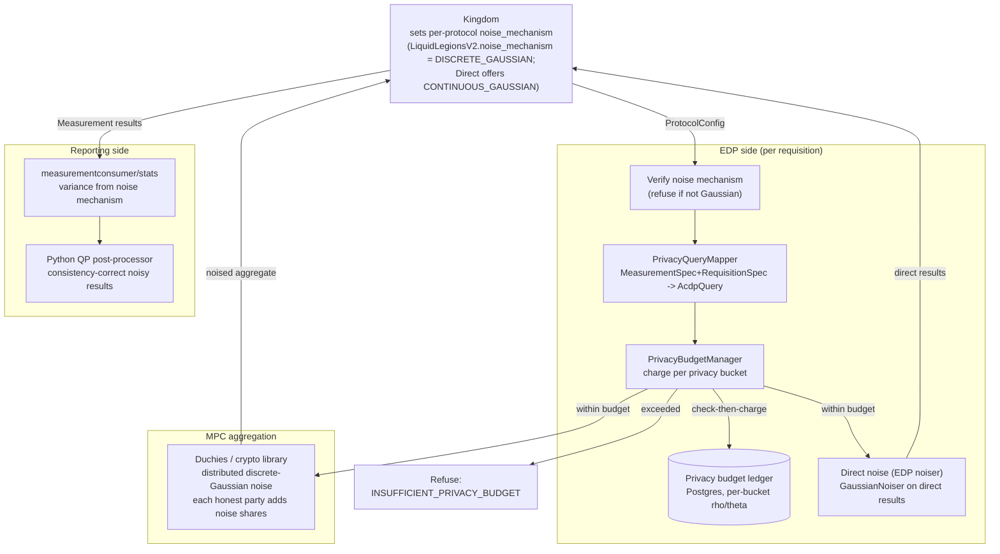

# Privacy Architecture

The WFA Cross-Media Measurement (CMMS) system is built so that no single party
ever sees an individual's cross-publisher activity, and so that the aggregate
numbers it publishes cannot be reverse-engineered into facts about any one
person. Two complementary techniques do this work. **Secure multiparty
computation (MPC)** keeps raw per-person data encrypted and split across
independent parties during aggregation (covered in the
[Duchy](../components/duchy.md) and [crypto-library](../components/crypto-library.md)
docs). **Differential privacy (DP)** — the subject of this document — bounds how
much any single query, or any accumulation of overlapping queries, can reveal
about an individual, by injecting calibrated random noise into results and
by tracking a per-population **privacy budget** that is charged before every
requisition is fulfilled. This roll-up traces DP end to end: the threat it
addresses, where noise is added, how the noise is calibrated and accounted for
under ACDP/Gaussian composition, how budget is charged per requisition, and how
the Reporting layer keeps the resulting noisy numbers internally consistent. For
DP background, see the primers under [../../dp_intro/](../../dp_intro/).

## Threat model DP addresses

MPC and consent-signaling protect data *in transit and during computation*: raw
impressions never leave an EDP in the clear, and no single Duchy can decrypt a
sketch alone. But the *published aggregate itself* is a leak channel. Without DP,
an adversary who can influence which population a query covers could difference
two nearly identical queries — for example `reach(everyone)` vs.
`reach(everyone except Alice)` — and recover whether Alice was reached. DP
defends against exactly this differencing/membership-inference class of attack:

*   **Per-result indistinguishability.** Each reach/frequency/impression result
    is perturbed with random noise calibrated to `(epsilon, delta)`, so that any
    two neighboring inputs (differing in one person) produce nearly
    indistinguishable output distributions.
*   **Composition over many queries.** A single noisy answer is not enough for an
    attacker, but repeated overlapping queries erode the guarantee. The Privacy
    Budget Manager (PBM) accounts for the *cumulative* privacy loss on each slice
    of the population and refuses queries once a slice's budget is exhausted,
    bounding what an attacker can learn no matter how many reports they request.
*   **Trust boundary.** DP accounting is an *EDP-local* responsibility. The PBM
    runs inside the Data Provider (or EDP Aggregator) process, keyed on the
    Measurement Consumer's external resource name, and is the EDP's own defense
    against a curious or adversarial Measurement Consumer. It is a reference
    implementation an EDP may replace, per
    `src/main/kotlin/org/wfanet/measurement/eventdataprovider/README.md`.

The unit of protection is a **privacy bucket** — a slice of
(population demographic × VID sub-interval × date) — so budget is spent and
capped at the granularity of small, overlapping population slices rather than
globally.

## End-to-end DP flow



The rest of this doc walks each stage.

## Where noise is added

Noise is injected differently depending on whether the measurement is computed
by MPC or "directly" by a single EDP. In both cases the mechanism must be
**Gaussian** when ACDP accounting is in effect.

### 1. Kingdom selects the mechanism

The Kingdom does not add noise, but it *fixes the noise mechanism* for each
measurement via the `ProtocolConfig` it stamps onto every `Requisition`
(`ProtocolConfig.Protocol.LiquidLegionsV2.noiseMechanism` for MPC,
`CONTINUOUS_GAUSSIAN`/`CONTINUOUS_LAPLACE` allowed for the Direct protocol). The
operations guide
[../../operations/enabling-gaussian-noise-and-acdp-pbm.md](../../operations/enabling-gaussian-noise-and-acdp-pbm.md)
documents flipping `noise_mechanism` to `DISCRETE_GAUSSIAN` in the Kingdom's
`Llv2ProtocolConfigConfig` textprotos for LLv2 and RO-LLv2, and ensuring
`CONTINUOUS_GAUSSIAN` for direct measurements. The `NoiseMechanism` enum itself
(`NOISE_MECHANISM_UNSPECIFIED`, `GEOMETRIC`, `DISCRETE_GAUSSIAN`,
`CONTINUOUS_GAUSSIAN`, `NONE`) lives in
`src/main/proto/wfa/measurement/internal/duchy/noise_mechanism.proto`.

### 2. Distributed noise inside the MPC protocols (Duchies)

For MPC measurements (Liquid Legions V2, Reach-Only LLv2, Honest Majority Share
Shuffle) the noise is **distributed**: each honest party independently adds noise
so that no single corrupted party can subtract it all out, and the aggregator
subtracts the *known* baseline before publishing. The C++
[crypto library](../components/crypto-library.md) builds these noisers in
`src/main/cc/wfa/measurement/internal/duchy/protocol/common/noise_parameters_computation.cc`,
which constructs `math::DistributedNoiser` instances (blind-histogram,
publisher, global-reach, and frequency noisers) from `DifferentialPrivacyParams`,
the *uncorrupted-party count*, and the selected `NoiseMechanism`. The concrete
`distributed_geometric_noiser` / `distributed_discrete_gaussian_noiser`
implementations come from the external `@any_sketch` module. In LLv2 the noise
registers are added and shuffled during the setup and execution phases and
subtracted at the aggregator during reach/frequency estimation; in HMSS each
non-aggregator adds distributed noise *shares* (discrete-Gaussian under ACDP,
though `GetBlindHistogramNoiser` also supports geometric) whose known baseline
offset (`shift_offset * kWorkerCount`) is subtracted at aggregation. See the
[Duchy](../components/duchy.md) and
[crypto-library](../components/crypto-library.md) docs for the per-phase detail.

### 3. Direct (single-EDP) noise — the EDP noiser

For measurements an EDP fulfills directly (no MPC), the EDP adds the noise itself
using the noiser library at
`src/main/kotlin/org/wfanet/measurement/eventdataprovider/noiser/`. `Noiser` is a
`sample(): Double` + `variance` interface; `GaussianNoiser` solves for sigma from
`(epsilon, delta)` (memoized) and `LaplaceNoiser` uses scale `1/epsilon`. The
`DirectNoiseMechanism` enum (`NONE`, `CONTINUOUS_LAPLACE`, `CONTINUOUS_GAUSSIAN`)
is defined alongside them. In the deployable
[EDP Aggregator](../components/edpaggregator.md), noise selection for direct
results is wired through `resultsfulfiller/NoiserSelector.kt`,
`ContinuousGaussianNoiseSelector.kt`, and `NoNoiserSelector.kt`. See the
[Event Data Provider libraries](../components/event-data-provider.md) doc for the
noiser internals. The related dynamic-clipping / thresholding code
(`eventdataprovider/differentialprivacy/DynamicClipping.kt`) computes a noised
cumulative histogram and an optimized clipping threshold for impression/duration
measurements under ACDP.

> **k-anonymity is separate from DP.** The EDP Aggregator also applies
> small-cell suppression in
> `src/main/kotlin/org/wfanet/measurement/edpaggregator/resultsfulfiller/ResultMinimumThresholder.kt`
> (returning an empty frequency vector when scaled reach/impressions fall below
> configured minimums, unless the protocol already enforces stricter
> thresholds). This is a complementary minimum-audience protection, not part of
> the DP `(epsilon, delta)` accounting.

## Event filtration and the privacy landscape

DP budget is charged against the *population slices a query touches*, so the
system must first decide which buckets a requisition's event filter covers. This
reuses the CEL event-filtration machinery.

*   A `RequisitionSpec` carries, per event group, a CEL `filter.expression` and a
    `collectionInterval`. `PrivacyQueryMapper`
    (`src/main/kotlin/org/wfanet/measurement/eventdataprovider/privacybudgetmanagement/api/v2alpha/PrivacyQueryMapper.kt`)
    turns these into a `LandscapeMask` of `EventGroupSpec(filterExpression,
    dateRange)` plus the `AcdpCharge`.
*   The **privacy landscape** is the fixed grid of buckets. In the current
    (legacy) PBM it is hard-coded in
    `eventdataprovider/privacybudgetmanagement/PrivacyLandscape.kt`: 300 VID
    intervals of width `1/300`, a one-year date period, and all `AgeGroup` /
    `Gender` values. The newer EDP-Aggregator PBM makes this data-driven via a
    `PrivacyLandscape` proto with ordered `Dimension`s.
*   `PrivacyBucketFilter` expands a `LandscapeMask` into the set of
    `PrivacyBucketGroup`s a filter touches, using a `PrivacyBucketMapper` that
    compiles the CEL filter with only the demographic fields (e.g.
    `person.age_group` / `person.gender`) marked as **`operativeFields`**; the VID
    dimension is enumerated separately by iterating
    `PrivacyLandscape.vidsIntervalStartPoints`, range-filtered by the mask's
    `vidSampleStart`/`vidSampleWidth`. Non-operative predicates collapse to `true`
    during normalization (`EventFilterValidator.compile` applies the private
    `Expr.toOperativeNegationNormalForm`, reached via `EventFilters.compileProgram`),
    so a query is *conservatively* charged against every bucket it could possibly
    touch. This filtration
    contract is the same one described in the
    [Event Data Provider libraries](../components/event-data-provider.md) doc.

## The privacy budget ledger and composition model

The Privacy Budget Manager is the accounting authority. It is a **library, not a
service** — there is no gRPC surface; it runs inside the EDP. See the
[Privacy Budget Manager](../components/privacy-budget-manager.md) doc for the full
treatment; the essentials for the cross-cutting picture:

### ACDP / Gaussian composition

Accounting is done in **Almost-Concentrated Differential Privacy (ACDP)** space,
which requires Gaussian noise. Each charge is a pair `AcdpCharge(rho, theta)`.

*   `AcdpParamsConverter`
    (`eventdataprovider/privacybudgetmanagement/AcdpParamsConverter.kt`) converts
    a per-query `DpParams(epsilon, delta)` into `(rho, theta)`. `getMpcAcdpCharge`
    accounts for the *distributed* discrete-Gaussian noise summed across
    `contributorCount` Duchies (memoized); `getDirectAcdpCharge` handles direct
    continuous Gaussian with sensitivity 1 and `theta = 0`. The converter is
    **Gaussian-only** — its own comment states that it "will not work with other
    noising mechanisms (e.g. Laplace)."
*   `Composition.totalPrivacyBudgetUsageUnderAcdpComposition`
    (`.../Composition.kt`) sums `rho` and `theta` over all charges accumulated in
    a bucket and minimizes over the Rényi order alpha (via an Apache Commons
    `BrentOptimizer`) to produce the total `delta` at the target `epsilon`. A
    bucket "exceeds" when that total `delta` is greater than the configured
    maximum.
*   Because charges are **additive in `(rho, theta)`**, per-query `epsilon`/
    `delta` may vary freely between queries. This is the main advantage over
    Laplace + advanced composition, and supports "more than 2x queries with the
    same privacy budget" per
    [../../operations/enabling-gaussian-noise-and-acdp-pbm.md](../../operations/enabling-gaussian-noise-and-acdp-pbm.md).

### The ledger

The current backing store is Postgres
(`eventdataprovider/privacybudgetmanagement/deploy/common/postgres/ledger.sql`):

*   `PrivacyBucketAcdpCharges` — one row per bucket, PK
    `(MeasurementConsumerId, Date, AgeGroup, Gender, VidStart)`, holding the
    aggregated `Rho`/`Theta`. Charges are added with an
    `ON CONFLICT ... DO UPDATE` upsert.
*   `LedgerEntries` — one row per charge transaction
    `(MeasurementConsumerId, ReferenceId, IsRefund, CreateTime)`, used for
    idempotent replay and refunds.

Note the ledger is keyed on the *external* `MeasurementConsumerId` and a textual
`ReferenceId` (the requisition), never on internal database IDs — consistent with
the project rule that internal IDs stay inside internal API servers. An
in-memory backing store is used by simulators and tests.

## How budget is charged per requisition

Budget is charged **once per requisition, before fulfillment**. The reference
caller is the EDP simulator
(`src/main/kotlin/org/wfanet/measurement/loadtest/dataprovider/AbstractEdpSimulator.kt`),
which routes to `chargeIndirectPrivacyBudget` for MPC requisitions and
`chargeDirectPrivacyBudget` for direct ones.

```mermaid
sequenceDiagram
  participant K as Kingdom
  participant EDP as EDP (AbstractEdpSimulator)
  participant Map as PrivacyQueryMapper
  participant PBM as PrivacyBudgetManager
  participant DB as Postgres ledger

  K->>EDP: Requisition (MeasurementSpec, RequisitionSpec, ProtocolConfig)
  EDP->>EDP: verify noise mechanism<br/>(MPC: DISCRETE_GAUSSIAN, direct: CONTINUOUS_GAUSSIAN)
  alt not Gaussian
    EDP->>K: refuse SPEC_INVALID (INCORRECT_NOISE_MECHANISM)
  else Gaussian
    EDP->>Map: getMpcAcdpQuery(reference, spec, eventSpecs, contributorCount) / getDirectAcdpQuery(reference, spec, eventSpecs)
    Map-->>EDP: AcdpQuery(reference, landscapeMask, acdpCharge)
    EDP->>PBM: chargePrivacyBudgetInAcdp(acdpQuery)
    PBM->>PBM: filter -> PrivacyBucketGroups
    PBM->>DB: begin tx; hasLedgerEntry?; read balances; ACDP check
    alt any bucket over budget
      PBM-->>EDP: PRIVACY_BUDGET_EXCEEDED
      EDP->>K: refuse INSUFFICIENT_PRIVACY_BUDGET
    else within budget
      PBM->>DB: upsert charges + LedgerEntry; commit
      EDP->>K: fulfill requisition (with noise)
    end
  end
```

Key points:

*   **Noise verification gate.** Before charging, the EDP checks the requisition's
    noise mechanism. For MPC it must be `NoiseMechanism.DISCRETE_GAUSSIAN`; for
    direct it must be `DirectNoiseMechanism.CONTINUOUS_GAUSSIAN`. Otherwise it
    throws `INCORRECT_NOISE_MECHANISM`, which the simulator maps to a
    `Requisition.Refusal.Justification.SPEC_INVALID` refusal
    (`AbstractEdpSimulator.kt`, ~lines 766 and 820). This is why ACDP and Gaussian
    must be rolled out together.
*   **Per-query params.** The charge is derived from the `MeasurementSpec` DP
    params — `reach.privacyParams`, `reachAndFrequency.reachPrivacyParams` /
    `frequencyPrivacyParams`, `impression.privacyParams`,
    `duration.privacyParams`, each an `(epsilon, delta)` — plus the
    `vidSamplingInterval.start`/`.width` and the per-event-group filter and
    interval (`PrivacyQueryMapper.kt`).
*   **Check-then-charge atomicity.** The ledger reads every targeted bucket's
    balance, tests the ACDP composition against the cap, and either commits all
    charges or throws `PRIVACY_BUDGET_EXCEEDED` and writes nothing. Refunds are
    modeled as negated charges keyed by the same reference for idempotent replay.
*   **Refusal surfaces to the Kingdom.** An over-budget requisition is refused
    with `INSUFFICIENT_PRIVACY_BUDGET`; the Kingdom records the refusal and does
    not run the measurement.

## Reporting-side postprocessing (keeping noised results consistent)

Independent noise on correlated measurements can violate logical relationships —
noised `reach(A∪B)` might come out *less* than noised `reach(A)`, or `ami < mrc`.
The [Reporting subsystem](../components/reporting.md) repairs this without
undoing the privacy guarantee, using the measurement's own noise-derived
variance:

*   **Variance is derived from the noise mechanism.** The shared statistics
    library at
    `src/main/kotlin/org/wfanet/measurement/measurementconsumer/stats/`
    (`VariancesImpl`) computes each result's standard deviation from its
    methodology (Liquid Legions V2, HMSS, deterministic/direct) and
    `NoiseMechanism`, surfaced to clients as
    `UnivariateStatistics.standard_deviation`.
*   **Consistency correction is a quadratic-programming solver.** The Python
    `noiseninja` solver
    (`src/main/python/wfa/measurement/reporting/postprocessing/`) finds the
    closest set of values satisfying set-relationship constraints (union ≥
    component, `ami ≥ mrc`, monotone cumulative reach), weighting each
    measurement by *inverse variance* so noisier estimates move more. Two paths
    invoke it: the Kotlin `ReportProcessor`
    (`reporting/postprocessing/v2alpha/ReportProcessor.kt`) for `Report`s, and the
    deployed `PostProcessReportResultJob`
    (`src/main/python/wfa/measurement/reporting/job/post_process_report_result_job.py`)
    for `BasicReport` results, which writes corrected values back to the
    `ReportResults` Spanner tree. Denoised results are stored alongside the noisy
    ones (`BasicMetricSet` vs. `NoisyMetricSet`), preserving both views.

Because the solver only *reconciles* already-noised numbers within their
variance envelopes, it does not add or remove privacy protection — it makes the
DP-noised report self-consistent for consumers. See the
[Reporting](../components/reporting.md) doc for details.

## Two PBM implementations

There are two PBM code bases in the tree, and they should not be conflated:

| Aspect | Legacy PBM (running today) | New EDP-Aggregator PBM (WIP) |
| --- | --- | --- |
| Package | `org.wfanet.measurement.eventdataprovider.privacybudgetmanagement` | `org.wfanet.measurement.privacybudgetmanager` |
| Landscape | Hard-coded enums + 300 VID intervals | Config-driven `PrivacyLandscape` proto, versioned/migratable |
| Ledger | `PrivacyBucketAcdpCharges` + `LedgerEntries` | `PrivacyCharges` (serialized `Charges` proto per row) + dimension tables + audit log |
| Status | Wired into the EDP simulator / production flows | Skeleton; several core methods are `TODO` |

Both share the same ACDP `(rho, theta)` math and the same per-bucket, additive
composition idea. Full detail on each is in the
[Privacy Budget Manager](../components/privacy-budget-manager.md) doc.

## Where to look in the code

| Concern | Location |
| --- | --- |
| Kingdom noise-mechanism config | `ProtocolConfig` on each `Requisition`; `Llv2ProtocolConfigConfig` / direct protocol config |
| `NoiseMechanism` enum | `src/main/proto/wfa/measurement/internal/duchy/noise_mechanism.proto` |
| Distributed MPC noisers (C++) | `src/main/cc/wfa/measurement/internal/duchy/protocol/common/noise_parameters_computation.cc` (noisers from `@any_sketch`) |
| Direct EDP noiser | `src/main/kotlin/org/wfanet/measurement/eventdataprovider/noiser/` (`GaussianNoiser`, `LaplaceNoiser`, `DirectNoiseMechanism`) |
| EDPA direct-noise selection | `src/main/kotlin/org/wfanet/measurement/edpaggregator/resultsfulfiller/NoiserSelector.kt`, `ContinuousGaussianNoiseSelector.kt` |
| Dynamic clipping (impression/duration) | `src/main/kotlin/org/wfanet/measurement/eventdataprovider/differentialprivacy/DynamicClipping.kt` |
| k-anonymity thresholding | `src/main/kotlin/org/wfanet/measurement/edpaggregator/resultsfulfiller/ResultMinimumThresholder.kt` |
| Query -> ACDP mapping | `.../eventdataprovider/privacybudgetmanagement/api/v2alpha/PrivacyQueryMapper.kt` |
| ACDP param conversion & composition | `.../privacybudgetmanagement/AcdpParamsConverter.kt`, `Composition.kt` |
| Privacy landscape & buckets | `.../privacybudgetmanagement/PrivacyLandscape.kt`, `PrivacyBucketGroup.kt`, `PrivacyBucketFilter.kt` |
| Budget charge / ledger | `.../privacybudgetmanagement/PrivacyBudgetManager.kt`, `PrivacyBudgetLedger.kt`, `deploy/common/postgres/ledger.sql` |
| Per-requisition charge caller | `src/main/kotlin/org/wfanet/measurement/loadtest/dataprovider/AbstractEdpSimulator.kt` (`chargeIndirectPrivacyBudget` / `chargeDirectPrivacyBudget`) |
| Variance from noise | `src/main/kotlin/org/wfanet/measurement/measurementconsumer/stats/` (`VariancesImpl`) |
| Consistency post-processing | `src/main/python/wfa/measurement/reporting/postprocessing/` (`noiseninja`), `reporting/postprocessing/v2alpha/ReportProcessor.kt`, `job/post_process_report_result_job.py` |

## See also

*   [../../dp_intro/](../../dp_intro/) — differential-privacy primers (PDFs).
*   [../components/privacy-budget-manager.md](../components/privacy-budget-manager.md)
    — the DP accounting ledger in depth.
*   [../components/event-data-provider.md](../components/event-data-provider.md)
    — the EDP noiser, event filtration, and dynamic clipping libraries.
*   [../components/edpaggregator.md](../components/edpaggregator.md)
    — the deployable EDP component that adds direct noise and applies
    k-anonymity.
*   [../components/duchy.md](../components/duchy.md) and
    [../components/crypto-library.md](../components/crypto-library.md)
    — distributed noise inside the MPC protocols.
*   [../components/reporting.md](../components/reporting.md)
    — variance computation and noise-consistency post-processing.
*   [../components/kingdom.md](../components/kingdom.md)
    — sets the `ProtocolConfig` noise mechanism per measurement.
*   [../../operations/enabling-gaussian-noise-and-acdp-pbm.md](../../operations/enabling-gaussian-noise-and-acdp-pbm.md)
    — operational rollout of Gaussian noise + ACDP composition.
