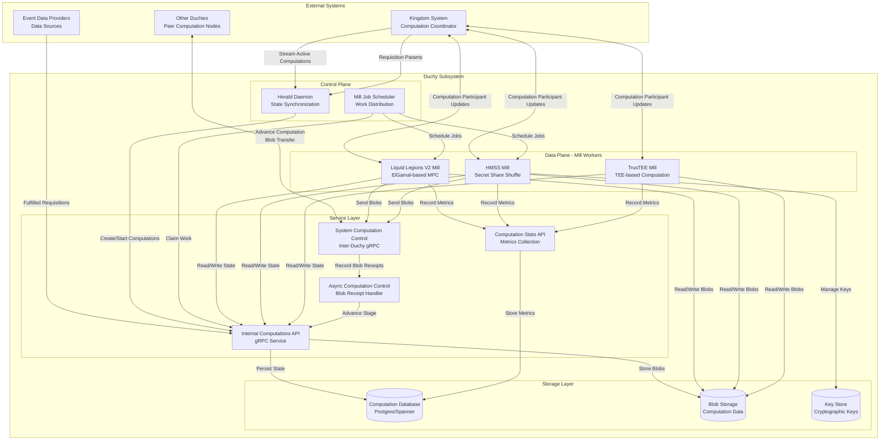
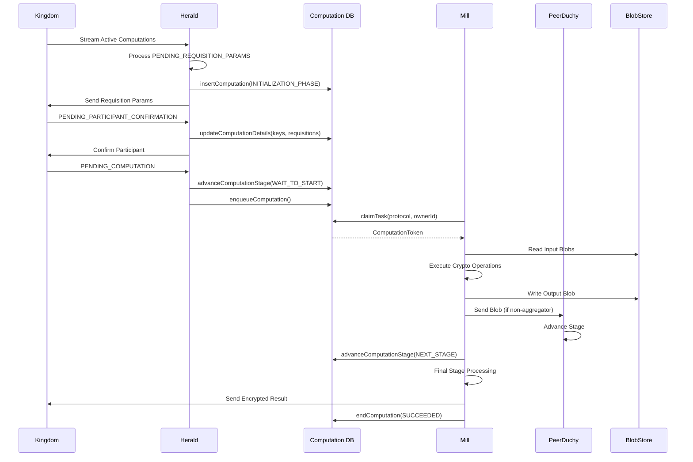

# Duchy Subsystem Architecture

## 1. System Overview

### Purpose

The **Duchy** (Data Computation Unit) subsystem is a core component of the Cross-Media Measurement System that enables privacy-preserving, distributed multi-party computation (MPC) for reach and frequency measurements. A duchy represents an independent computation node operated by a trusted entity that collaborates with other duchies to perform secure aggregations of user engagement data without revealing individual-level information.

### Role in the Broader System

The duchy subsystem serves as the computational engine within a federated measurement ecosystem:

- **Kingdom Integration**: Receives computation requests and measurement specifications from the Kingdom (central coordinator), reports results, and synchronizes computation state.
- **Event Data Provider (EDP) Coordination**: Processes encrypted requisitions (data requests) fulfilled by EDPs containing user event data.
- **Inter-Duchy Collaboration**: Coordinates with peer duchies to execute multi-party cryptographic protocols that distribute trust across multiple independent entities.
- **Privacy Preservation**: Implements differential privacy mechanisms and cryptographic techniques (ElGamal encryption, secret sharing, shuffling) to protect individual privacy while computing aggregate statistics.

### Key Characteristics

- **Distributed Trust**: No single duchy can decrypt or access raw measurement data; results emerge only from collective computation
- **Protocol Flexibility**: Supports multiple MPC protocols (Liquid Legions V2, Honest Majority Share Shuffle, TrusTEE) optimized for different trust models and performance characteristics
- **Scalable Processing**: Handles computation workloads through distributed mill workers that can be scheduled as Kubernetes jobs or persistent daemons
- **Fault Tolerance**: Implements retry logic, work claiming mechanisms, and state persistence to handle transient failures and network partitions

## 2. Architecture Diagram



## 3. Key Components

### 3.1 Herald (org.wfanet.measurement.duchy.herald)

**Responsibility**: Computation lifecycle synchronization with the Kingdom

**Key Functions**:
- Continuously streams active computations from the Kingdom using continuation tokens
- Creates local duchy computations when the Kingdom initiates new measurements
- Confirms duchy participation by updating requisitions and cryptographic key sets
- Starts computations when all prerequisites are met (requisitions fulfilled, keys exchanged)
- Manages protocol-specific initialization for LLv2, Reach-Only LLv2, HMSS, and TrusTEE

**Protocol Starters**:
- `LiquidLegionsV2Starter`: Generates ElGamal keypairs, orders participant keys by role
- `ReachOnlyLiquidLegionsV2Starter`: Optimized variant without frequency parameters
- `HonestMajorityShareShuffleStarter`: Generates Tink encryption keys, random seeds
- `TrusTeeStarter`: Initializes trusted execution environment computations

**Deployment**: Typically runs as a single daemon per duchy to avoid race conditions

### 3.2 Mill (org.wfanet.measurement.duchy.mill)

**Responsibility**: Computation processing execution engine

**Architecture**:
- `MillBase`: Abstract base providing work claiming, error handling, Kingdom communication
- Protocol-specific implementations: `ReachFrequencyLiquidLegionsV2Mill`, `ReachOnlyLiquidLegionsV2Mill`, `HonestMajorityShareShuffleMill`, `TrusTeeMill`

**Key Functions**:
- Claims computation work from internal queue with lock acquisition
- Executes protocol-specific stage transitions (initialization, setup, execution phases)
- Coordinates with peer duchies to exchange encrypted intermediate results
- Applies differential privacy noise at appropriate protocol stages
- Sends final encrypted results to the Kingdom
- Logs wall-clock and CPU duration metrics for observability

**Cryptographic Workers**:
- `JniLiquidLegionsV2Encryption`: Native library for ElGamal operations, sketch aggregation
- `JniReachOnlyLiquidLegionsV2Encryption`: Optimized reach-only crypto operations
- `JniHonestMajorityShareShuffleCryptor`: Secret share shuffling and aggregation

**Deployment**:
- **Kubernetes Jobs**: Scheduled by `MillJobScheduler` for claimed work (horizontal scaling)
- **Persistent Daemons**: Continuous work processing for TrusTEE protocol

### 3.3 Storage (org.wfanet.measurement.duchy.storage)

**Responsibility**: Blob storage abstraction for computation data

**Components**:
- `ComputationStore`: Organizes blobs by `{computationId}/{stageName}/{blobId}`
- `RequisitionStore`: Stores requisition data by `{computationId}/{requisitionId}`
- `TinkKeyStore`: Manages encrypted Tink private keys for HMSS protocol

**Blob Types**:
- **Input Blobs**: Data received from other duchies or previous stages
- **Output Blobs**: Encrypted results produced by current stage
- **Pass-Through Blobs**: Data forwarded unchanged to next stage
- **Requisition Blobs**: Raw data fulfilled by EDPs

**Backend Support**: Cloud-agnostic interface with implementations for GCS, S3, forwarded storage

### 3.4 Database (org.wfanet.measurement.duchy.db.computation)

**Responsibility**: Computation state persistence and work queue management

**Core Interfaces**:
- `ComputationsDatabase`: Unified interface for read/write operations
- `ComputationsDatabaseReader`: Query operations for tokens, IDs, blob keys
- `ComputationsDatabaseTransactor`: State mutations, stage transitions, work claiming

**Key Operations**:
- `insertComputation`: Create new computation with initial stage
- `claimTask`: Atomic work claiming with lock acquisition and priority queue
- `updateComputationStage`: Transition to next stage with blob path management
- `endComputation`: Mark terminal state (SUCCEEDED, FAILED, CANCELED)
- `writeRequisitionBlobPath`: Record fulfilled requisition data

**Database Implementations**:
- **PostgreSQL**: R2DBC-based async implementation with continuation token support
- **Cloud Spanner**: Google Cloud Spanner backend for GCP deployments

**Work Queue Mechanism**:
- Priority-based queue with configurable stage prioritization
- Lock-based concurrency control with configurable lock duration
- Exponential delay for retries on transient failures

### 3.5 Service Layer (org.wfanet.measurement.duchy.service)

#### 3.5.1 Internal Services (org.wfanet.measurement.duchy.service.internal)

**ComputationsService**:
- Implements internal duchy computation management API
- Handles work claiming, stage advancement, computation deletion
- Manages blob path recording and requisition fulfillment
- Provides computation ID queries filtered by stage and update time

**AsyncComputationControlService**:
- Asynchronous blob receipt notification handler
- Advances computation stage when all expected blobs are received
- Tolerates stage mismatches (one step ahead/behind) for distributed coordination
- Automatic retry with exponential backoff for transient errors

**ComputationStatsService**:
- Records computational metrics (wall-clock duration, CPU time, blob sizes)
- Enables performance monitoring and debugging

**ContinuationTokensService**:
- Manages streaming continuation tokens for Herald synchronization
- Ensures in-order processing and persistence of token checkpoints

#### 3.5.2 System API Services (org.wfanet.measurement.duchy.service.system.v1alpha)

**ComputationControlService**:
- External gRPC service for inter-duchy communication
- Receives encrypted computation data from peer duchies
- Routes synchronous/asynchronous requests based on protocol type
- Validates duchy identity using mutual TLS

### 3.6 Deployment Infrastructure (org.wfanet.measurement.duchy.deploy.common)

**Server Implementations**:
- `DuchyDataServer`: Aggregates internal services (Computations, Stats, ContinuationTokens)
- `ComputationControlServer`: External inter-duchy communication endpoint
- `RequisitionFulfillmentServer`: Receives fulfilled requisitions from EDPs

**Job Schedulers**:
- `MillJobScheduler`: Kubernetes Job scheduler for horizontal mill scaling
  - Polls for available work by computation type
  - Creates Jobs from pod templates when below concurrency limit
  - Tracks owned Jobs with label selectors

**Daemon Processes**:
- `HeraldDaemon`: Continuous Kingdom synchronization
- `TrusTeeMillDaemon`: Persistent TrusTEE computation worker
- `ComputationsCleanerJob`: Purges terminal computations older than TTL

**Configuration Flags**:
- `CommonDuchyFlags`: Duchy identification and naming
- `SystemApiFlags`: Kingdom connectivity configuration
- `ComputationsServiceFlags`: Internal service endpoints
- Database connection pools, TLS certificates, storage backends

## 4. Data Flow

### 4.1 Computation Lifecycle



### 4.2 Inter-Duchy Communication Flow

**Synchronous Protocol (Legacy)**:
1. Mill reads input blobs from local storage
2. Mill sends `AdvanceComputationRequest` with streamed blob data to peer duchy
3. Peer duchy writes blob and immediately advances computation stage
4. Response confirms receipt and advancement

**Asynchronous Protocol (Current)**:
1. Mill writes output blob to local storage
2. Mill sends `AdvanceComputationRequest` with blob metadata to peer duchy
3. Peer duchy writes blob path to `AsyncComputationControlService`
4. When all expected blobs received, `AsyncComputationControlService` advances stage
5. Response confirms blob recording (not stage advancement)

**Benefits of Asynchronous Approach**:
- Decouples blob receipt from stage advancement
- Handles out-of-order blob arrivals gracefully
- Enables parallel blob transfers from multiple duchies

### 4.3 Blob Path Management

Each computation stage maintains three types of blob references:

- **Input Blob Paths**: Blobs consumed by current stage (from previous stage or peer duchies)
- **Output Blob Paths**: Blobs produced by current stage for next stage
- **Pass-Through Blob Paths**: Blobs forwarded unchanged (e.g., aggregated sketches)

**Stage Transition**:
```kotlin
updateComputationStage(
  token = currentToken,
  nextStage = EXECUTION_PHASE_ONE,
  inputBlobPaths = ["comp-123/SETUP_PHASE/1"],
  passThroughBlobPaths = [],
  outputBlobs = 1,  // Number of expected output blobs
  afterTransition = ADD_UNCLAIMED_TO_QUEUE
)
```

## 5. Integration Points

### 5.1 Kingdom System API (org.wfanet.measurement.system.v1alpha)

**Herald → Kingdom**:
- `StreamActiveComputations`: Receives stream of active computations requiring duchy action
- `SetParticipantRequisitionParams`: Sends ElGamal public keys or Tink encryption keys
- `ConfirmComputationParticipant`: Acknowledges readiness to start computation
- `FailComputationParticipant`: Reports non-retryable errors

**Mill → Kingdom**:
- `SetComputationResult`: Sends encrypted final result with methodology metadata
- `CreateComputationLogEntry`: Records audit trail for debugging
- `GetComputationParticipant`: Retrieves peer duchy details and keys

### 5.2 Inter-Duchy Communication (System Computation Control)

**gRPC Methods**:
- `AdvanceComputation`: Streams encrypted blob data to peer duchy
- `GetComputationStage`: Queries current stage at peer duchy (for synchronization)

**Protocol-Specific Descriptors**:
- Liquid Legions V2: `SETUP_PHASE_INPUT`, `EXECUTION_PHASE_ONE_INPUT`, etc.
- Reach-Only LLv2: Simplified phase descriptors
- HMSS: `SHUFFLE_PHASE_INPUT_ONE`, `SHUFFLE_PHASE_INPUT_TWO`, `AGGREGATION_INPUT`

**Mutual TLS Authentication**:
- Duchy identity extracted from client certificate
- `DuchyIdentityProvider` validates caller identity
- Only authenticated duchies can advance computations

### 5.3 Event Data Provider (EDP) Integration

**Requisition Fulfillment**:
- EDPs call duchy's `RecordRequisitionFulfillment` with encrypted event data
- Duchy stores requisition blob at `requisitions/{computationId}/{requisitionId}`
- Blob path recorded in database for mill retrieval

**Encryption**:
- LLv2: EDPs encrypt sketches with combined duchy ElGamal public key
- HMSS: EDPs encrypt frequency vectors with each non-aggregator's Tink public key
- TrusTEE: EDPs encrypt with KMS-managed data encryption key

### 5.4 Blob Storage Backend

**Supported Implementations**:
- Google Cloud Storage (GCS)
- Amazon S3
- Forwarded Storage (delegate to external storage service)

**Operations**:
- `write(context, blob)`: Store blob with derived key
- `get(context)`: Retrieve blob by context
- `delete(context)`: Remove blob (for cleanup)

**Key Derivation**:
- `ComputationStore`: `{blobKeyPrefix}/computations/{computationId}/{stageName}/{blobId}`
- `RequisitionStore`: `{blobKeyPrefix}/requisitions/{computationId}/{requisitionId}`

## 6. Design Patterns

### 6.1 State Machine Pattern

Each MPC protocol is modeled as a finite state machine with well-defined stages and transitions:

**Protocol Stage Helpers**:
- `validInitialStages`: Set of allowed starting stages
- `validTerminalStages`: Set of completion stages (COMPLETE, FAILED, CANCELED)
- `validSuccessors`: Map defining legal stage transitions
- `validTransition(current, next)`: Validates transition legality

**Example (Liquid Legions V2)**:
```
INITIALIZATION_PHASE → WAIT_REQUISITIONS_AND_KEY_SET → CONFIRMATION_PHASE →
WAIT_TO_START → SETUP_PHASE → EXECUTION_PHASE_ONE → EXECUTION_PHASE_TWO →
EXECUTION_PHASE_THREE → COMPLETE
```

### 6.2 Work Queue with Optimistic Locking

**Claiming Mechanism**:
1. Query unclaimed tasks or tasks with expired locks
2. Atomically update `lock_owner` and `lock_expiration_time` using `edit_version` for optimistic locking
3. Return global computation ID to caller
4. If concurrent claim detected (version mismatch), return null

**Benefits**:
- Prevents duplicate work processing
- Enables horizontal scaling of mill workers
- Handles worker crashes gracefully (lock expiration)

### 6.3 Protocol Abstraction

**Interface Hierarchy**:
- `ProtocolStageEnumHelper<StageT>`: Stage enumeration operations
- `ProtocolStageDetails<StageT, ComputationDetailsT>`: Stage-specific metadata
- `ComputationProtocolStageDetailsHelper`: Unified helper delegating to protocol-specific implementations

**Benefits**:
- Add new protocols without modifying core computation database logic
- Protocol-specific logic encapsulated in dedicated classes
- Type-safe stage transitions with compile-time validation

### 6.4 Exception Hierarchy for Retry Logic

**Sealed Class Hierarchy**:
- `DuchyInternalException`: Base sealed class with error codes
  - `ComputationNotFoundException`
  - `ComputationTokenVersionMismatchException`
  - `ContinuationTokenInvalidException`

**Mill Error Handling**:
- `TransientErrorException`: Retryable (UNAVAILABLE, DEADLINE_EXCEEDED)
- `PermanentErrorException`: Non-retryable (INVALID_ARGUMENT, signature verification failure)

**Retry Strategy**:
- Exponential backoff with configurable maximum attempts
- Transient errors re-enqueue with delay
- Permanent errors mark computation as FAILED

### 6.5 Asynchronous Blob Receipt Pattern

**Problem**: In synchronous model, peer duchy must be ready to process blob immediately

**Solution**: Decouple blob receipt from stage advancement
- `AsyncComputationControlService` buffers blob paths
- Advances stage only when all expected blobs received
- Tolerates out-of-order arrivals and stage mismatches

**Implementation**:
```kotlin
override suspend fun advanceComputation(
  request: AdvanceComputationRequest
): AdvanceComputationResponse {
  val header = request.header
  val expectedStage = header.stageExpectingInput()

  // Verify stage compatibility
  val token = getComputationToken(header.globalComputationId)
  if (token.computationStage != expectedStage) {
    // Tolerate being one stage ahead or behind
  }

  // Record blob path
  asyncControlClient.advanceComputation(
    globalId = header.globalComputationId,
    blobPath = writtenBlobPath,
    dataOrigin = header.dataOrigin
  )

  // Service advances stage when all blobs received
}
```

### 6.6 Continuation Token Streaming

**Problem**: Herald needs to sync millions of active computations without overwhelming Kingdom

**Solution**: Stateful streaming with continuation tokens
- Kingdom returns `continuation_token` with each batch of computations
- Herald persists token after successfully processing batch
- On restart, Herald resumes from last persisted token

**Ordering Guarantee**:
- `ContinuationTokenManager` tracks pending/processed tokens in order
- Only updates persisted token when all preceding tokens processed
- Prevents gaps in computation coverage

## 7. Technology Stack

### 7.1 Core Technologies

**Language**: Kotlin (100% codebase)
- Coroutines for asynchronous I/O
- Flow API for streaming operations
- Null safety and immutability by default

**Communication**: gRPC
- Protocol Buffers for message serialization
- Bidirectional streaming for blob transfers
- Mutual TLS for authentication

**Cryptography**:
- **AnySketch (C++ via JNI)**: ElGamal encryption, sketch aggregation, MPC operations
- **Google Tink**: Hybrid encryption (ECIES), AEAD, key management
- **BouncyCastle**: X.509 certificate operations, signature verification

### 7.2 Data Storage

**Relational Database**:
- PostgreSQL (R2DBC for reactive access)
- Cloud Spanner (Google Cloud native)

**Blob Storage**:
- Google Cloud Storage
- Amazon S3
- Custom storage backends via `StorageClient` abstraction

**Key-Value Store** (via Database):
- Continuation tokens (Herald checkpoints)
- Computation statistics (metrics)

### 7.3 Infrastructure

**Container Orchestration**: Kubernetes
- Deployments for persistent services (Herald, data server)
- Jobs for ephemeral mill workers (scheduled by MillJobScheduler)
- ConfigMaps for protocol configuration
- Secrets for private keys, certificates

**Cloud Platforms**:
- Google Cloud Platform (GKE, Spanner, GCS, KMS)
- Amazon Web Services (EKS, S3)

**Observability**:
- OpenTelemetry: Metrics (histograms, counters), traces
- Structured logging with computation context
- Custom metrics: stage duration, blob sizes, crypto operation times

### 7.4 Build and Deployment

**Build System**: Bazel
- Hermetic builds for reproducibility
- Remote caching and execution
- Kotlin, Java, Protocol Buffers, Docker image targets

**Deployment Tools**:
- Terraform for infrastructure provisioning
- Helm charts for Kubernetes resource templates
- Custom Kustomize overlays for environment-specific configuration

**CI/CD**:
- GitHub Actions for automated testing
- Container image building and publishing
- Database schema migration automation

### 7.5 Protocol-Specific Libraries

**Liquid Legions V2**:
- `libAnySketchJni.so`: Native crypto library for ElGamal operations
- Sketch noise generation (binomial, geometric distributions)
- Reach/frequency estimation algorithms

**Honest Majority Share Shuffle**:
- `libAnySketchJni.so`: Secret share generation and shuffling
- Prng-based shuffling with cryptographic seeds
- Frequency vector aggregation

**TrusTEE**:
- Google Cloud KMS for workload identity-based key unwrapping
- Tink Streaming AEAD for requisition decryption
- Secure enclave integration (future: AWS Nitro Enclaves, Azure Confidential Computing)

---

## Summary

The Duchy subsystem is a sophisticated distributed computation platform that balances privacy, security, and performance through:

1. **Modular architecture** enabling protocol evolution without breaking existing deployments
2. **Asynchronous coordination** handling network latency and partial failures gracefully
3. **Scalable processing** via work queue abstraction and Kubernetes-based horizontal scaling
4. **Cryptographic rigor** delegating complex operations to native libraries while maintaining type safety
5. **Operational flexibility** supporting multiple cloud platforms and database backends

This design enables measurement providers to collaborate on privacy-preserving analytics while maintaining independent control over computation infrastructure and cryptographic key material.
