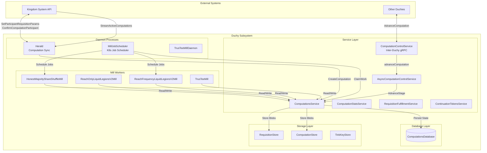
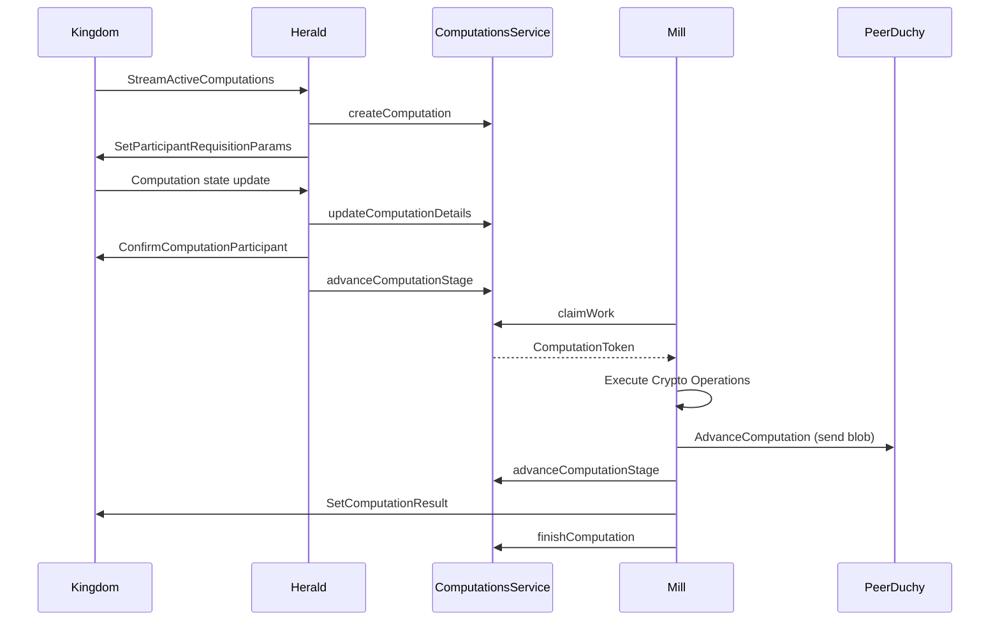

# Duchy Subsystem Architecture

## 1. System Overview

### Purpose

The **Duchy** (Data Computation Unit) subsystem is a core component of the Cross-Media Measurement System that manages multi-party computation (MPC) protocols, computation lifecycle management, storage operations, and coordination between duchies. The package supports multiple MPC protocols including Liquid Legions V2, Reach-Only Liquid Legions V2, Honest Majority Share Shuffle, and TrusTEE.

### Role in the Broader System

The duchy subsystem serves as the computational engine within the measurement ecosystem:

- **Kingdom Integration**: Receives computation requests from the Kingdom, synchronizes computation states, and reports results
- **Requisition Fulfillment**: Receives fulfilled requisition data from Data Providers
- **Inter-Duchy Coordination**: Coordinates with peer duchies to execute multi-party cryptographic protocols

## 2. Architecture Diagram

```mermaid
graph TB
    subgraph "External Systems"
        Kingdom[Kingdom System API]
        OtherDuchies[Other Duchies]
    end

    subgraph "Duchy Subsystem"
        subgraph "Daemon Processes"
            Herald[Herald<br/>Computation Sync]
            MillJobScheduler[MillJobScheduler<br/>K8s Job Scheduler]
            TrusTeeMillDaemon[TrusTeeMillDaemon]
        end

        subgraph "Mill Workers"
            ReachFreqLLv2Mill[ReachFrequencyLiquidLegionsV2Mill]
            ReachOnlyLLv2Mill[ReachOnlyLiquidLegionsV2Mill]
            HMSSMill[HonestMajorityShareShuffleMill]
            TrusTeeMill[TrusTeeMill]
        end

        subgraph "Storage Layer"
            ComputationStore[ComputationStore]
            RequisitionStore[RequisitionStore]
            TinkKeyStore[TinkKeyStore]
        end

        subgraph "Service Layer"
            ComputationsService[ComputationsService]
            AsyncComputationControlService[AsyncComputationControlService]
            ComputationStatsService[ComputationStatsService]
            ComputationControlService[ComputationControlService<br/>Inter-Duchy gRPC]
            RequisitionFulfillmentService[RequisitionFulfillmentService]
            ContinuationTokensService[ContinuationTokensService]
        end

        subgraph "Database Layer"
            ComputationsDatabase[(ComputationsDatabase)]
        end
    end

    Kingdom -->|StreamActiveComputations| Herald
    Kingdom <-->|SetParticipantRequisitionParams<br/>ConfirmComputationParticipant| Herald

    OtherDuchies <-->|AdvanceComputation| ComputationControlService

    Herald -->|CreateComputation| ComputationsService
    MillJobScheduler -->|ClaimWork| ComputationsService
    MillJobScheduler -->|Schedule Jobs| ReachFreqLLv2Mill
    MillJobScheduler -->|Schedule Jobs| HMSSMill

    ReachFreqLLv2Mill -->|Read/Write| ComputationsService
    ReachOnlyLLv2Mill -->|Read/Write| ComputationsService
    HMSSMill -->|Read/Write| ComputationsService
    TrusTeeMill -->|Read/Write| ComputationsService

    ComputationsService -->|Persist State| ComputationsDatabase
    ComputationsService -->|Store Blobs| ComputationStore
    ComputationsService -->|Store Blobs| RequisitionStore

    ComputationControlService -->|advanceComputation| AsyncComputationControlService
    AsyncComputationControlService -->|AdvanceStage| ComputationsService
```

## 3. Key Components

### 3.1 Herald (org.wfanet.measurement.duchy.herald)

**Responsibility**: Computation lifecycle synchronization between duchy nodes and the Kingdom system.

**Key Classes**:
- `Herald`: Main orchestrator that syncs computation states between Kingdom and duchy storage
- `ContinuationTokenManager`: Manages continuation tokens for streaming active computations

**Key Methods**:
- `continuallySyncStatuses()`: Continuously syncs computation statuses in loop with retry logic
- `syncStatuses()`: Streams active computations from Kingdom and processes them
- `createComputation()`: Creates new computation based on protocol type
- `confirmParticipant()`: Updates requisitions and key sets during confirmation phase
- `startComputing()`: Starts computation from WAIT_TO_START stage

**Protocol Starters**:
- `LiquidLegionsV2Starter`: Creates LLv2 computation with parameters extracted from measurement spec
- `ReachOnlyLiquidLegionsV2Starter`: Creates reach-only LLv2 computation without frequency parameters
- `HonestMajorityShareShuffleStarter`: Creates HMSS computation with encryption keys and random seed
- `TrusTeeStarter`: Creates TrusTEE computation for aggregator role

### 3.2 Mill (org.wfanet.measurement.duchy.mill)

**Responsibility**: Computation processing execution engine for MPC protocols.

**Key Classes**:
- `MillBase`: Abstract base class providing work claiming, computation lifecycle management, error handling, and metrics logging
- `LiquidLegionsV2Mill`: Abstract base for Liquid Legions V2 mill implementations
- `ReachFrequencyLiquidLegionsV2Mill`: Mill for reach and frequency computations using LLv2 protocol
- `ReachOnlyLiquidLegionsV2Mill`: Optimized mill for reach-only computations
- `HonestMajorityShareShuffleMill`: Mill for HMSS protocol with three-party roles
- `TrusTeeMill`: Mill for TrusTEE protocol computations

**MillBase Key Methods**:
- `claimAndProcessWork()`: Claims next available work item and processes it
- `processClaimedWork()`: Processes work item that has already been claimed
- `sendResultToKingdom()`: Sends encrypted computation result to Kingdom
- `completeComputation()`: Marks computation as complete with specified reason
- `sendAdvanceComputationRequest()`: Sends computation data to another duchy

**MillType Enumeration**:
- `LIQUID_LEGIONS_V2`: Liquid Legions V2 protocol variants
- `HONEST_MAJORITY_SHARE_SHUFFLE`: Honest majority share shuffle protocol
- `TRUS_TEE`: TrusTEE protocol

### 3.3 Storage (org.wfanet.measurement.duchy.storage)

**Responsibility**: Blob storage abstraction for computation data.

**Components**:
- `ComputationStore`: Manages blob storage for computation-related data, organizing blobs by computation ID, stage, and blob ID
- `RequisitionStore`: Manages blob storage for requisition-related data
- `TinkKeyStore`: Manages blob storage for Tink private cryptographic keys

**Blob Key Derivation**:
- `ComputationStore`: Uses prefix "computations" with key format `{computationId}/{stageName}/{blobId}`
- `RequisitionStore`: Uses prefix "requisitions" with key format `{computationId}/{requisitionId}`
- `TinkKeyStore`: Uses prefix "tink-private-key"

### 3.4 Database (org.wfanet.measurement.duchy.db.computation)

**Responsibility**: Computation state persistence and work queue management.

**Core Interfaces**:
- `ComputationsDatabase`: Primary interface combining read and write capabilities
- `ComputationsDatabaseReader`: Query operations for tokens, IDs, blob keys
- `ComputationsDatabaseTransactor`: State mutations, stage transitions, work claiming

**Key Operations**:
- `insertComputation()`: Creates new computation with initial stage and requisitions
- `claimTask()`: Claims and locks available computation task
- `updateComputationStage()`: Transitions computation to new stage
- `endComputation()`: Moves computation to terminal state
- `writeRequisitionBlobPath()`: Records requisition blob path from fulfillment

**Protocol Helpers**:
- `ComputationProtocolStages`: Provides stage enumeration helpers for all supported protocols
- `ComputationProtocolStageDetails`: Manages protocol-specific stage details
- `LiquidLegionsSketchAggregationV2Protocol`: Protocol-specific helpers for LLv2
- `HonestMajorityShareShuffleProtocol`: Protocol-specific helpers for HMSS
- `TrusTeeProtocol`: Protocol-specific helpers for TrusTEE

### 3.5 Service Layer

#### 3.5.1 Internal Services (org.wfanet.measurement.duchy.service.internal)

**ComputationsService**:
- `claimWork()`: Claims next available computation task
- `createComputation()`: Creates new computation with initial stage
- `deleteComputation()`: Deletes computation and associated blobs
- `purgeComputations()`: Purges old computations in terminal stages
- `finishComputation()`: Ends computation with success/failure/cancel
- `advanceComputationStage()`: Advances computation to next stage
- `recordRequisitionFulfillment()`: Records requisition blob path

**AsyncComputationControlService**:
- `advanceComputation()`: Records blob path and advances stage when ready
- `getOutputBlobMetadata()`: Retrieves output blob metadata for computation
- Tolerates stage mismatches when one step behind or ahead
- Automatic retry with exponential backoff for UNAVAILABLE/ABORTED errors

**ComputationStatsService**:
- `createComputationStat()`: Inserts metric for computation stage attempt

**ContinuationTokensService**:
- `getContinuationToken()`: Retrieves stored continuation token
- `setContinuationToken()`: Updates stored continuation token

#### 3.5.2 System API Services (org.wfanet.measurement.duchy.service.system.v1alpha)

**ComputationControlService**:
- `advanceComputation()`: Receives streamed computation data and advances stage
- `getComputationStage()`: Retrieves current computation stage

#### 3.5.3 Public API Services (org.wfanet.measurement.duchy.service.api.v2alpha)

**RequisitionFulfillmentService**:
- `fulfillRequisition()`: Receives streaming requisition data, validates and stores it
- Supports LLv2, HMSS, and TrusTEE protocols

### 3.6 Deployment Infrastructure (org.wfanet.measurement.duchy.deploy.common)

**Daemon Processes**:
- `HeraldDaemon`: Abstract base class for Herald daemon implementations
- `ForwardedStorageHeraldDaemon`: Concrete Herald daemon with forwarded storage
- `MillJobScheduler`: Kubernetes job scheduler for Mill computation workers
- `TrusTeeMillDaemon`: Daemon for TrusTEE computation processing

**Server Implementations**:
- `DuchyDataServer`: Abstract base server for duchy data services
- `ComputationControlServer`: Abstract server for inter-duchy communication
- `RequisitionFulfillmentServer`: Abstract server for requisition fulfillment
- `AsyncComputationControlServer`: Server for asynchronous computation control
- `ComputationsServer`: Abstract server for internal Computations service

**Job Implementations**:
- `LiquidLegionsV2MillJob`: Abstract job for LLv2 protocol computations
- `HonestMajorityShareShuffleMillJob`: Abstract job for HMSS protocol computations
- `ComputationsCleanerJob`: Maintenance job for purging terminal computations

**Service Composition**:
- `DuchyDataServices`: Aggregates computationsService, computationStatsService, continuationTokensService
- `PostgresDuchyDataServices`: Factory for PostgreSQL-backed services

## 4. Data Flow

### 4.1 Computation Lifecycle

```mermaid
sequenceDiagram
    participant Kingdom
    participant Herald
    participant ComputationsService
    participant Mill
    participant PeerDuchy

    Kingdom->>Herald: StreamActiveComputations
    Herald->>ComputationsService: createComputation
    Herald->>Kingdom: SetParticipantRequisitionParams

    Kingdom->>Herald: Computation state update
    Herald->>ComputationsService: updateComputationDetails
    Herald->>Kingdom: ConfirmComputationParticipant

    Herald->>ComputationsService: advanceComputationStage

    Mill->>ComputationsService: claimWork
    ComputationsService-->>Mill: ComputationToken
    Mill->>Mill: Execute Crypto Operations
    Mill->>PeerDuchy: AdvanceComputation (send blob)
    Mill->>ComputationsService: advanceComputationStage

    Mill->>Kingdom: SetComputationResult
    Mill->>ComputationsService: finishComputation
```

### 4.2 Protocol State Transitions

**Liquid Legions V2 / Reach-Only Liquid Legions V2**:
1. PENDING_REQUISITION_PARAMS -> Herald creates computation -> INITIALIZATION_PHASE
2. PENDING_PARTICIPANT_CONFIRMATION -> Herald updates keys -> CONFIRMATION_PHASE
3. PENDING_COMPUTATION -> Herald starts computation -> SETUP_PHASE -> EXECUTION phases -> COMPLETE

**Honest Majority Share Shuffle**:
1. PENDING_REQUISITION_PARAMS -> Herald creates computation with encryption keys -> INITIALIZED
2. PENDING_COMPUTATION -> Herald starts (FIRST_NON_AGGREGATOR only) -> SETUP_PHASE -> SHUFFLE_PHASE -> AGGREGATION_PHASE -> COMPLETE

**TrusTEE**:
1. PENDING_REQUISITION_PARAMS -> Herald creates computation -> INITIALIZED
2. PENDING_COMPUTATION -> Herald starts aggregator -> WAIT_TO_START -> COMPUTING -> COMPLETE

### 4.3 Blob Management

The service tracks three types of blob dependencies per stage:
- **INPUT**: Required input data consumed by current stage
- **OUTPUT**: Data produced by current stage
- **PASS_THROUGH**: Data passed unchanged to subsequent stages

## 5. Cryptographic Operations

### 5.1 Liquid Legions V2 Crypto

**LiquidLegionsV2Encryption Interface**:
- `completeInitializationPhase()`: Generates ElGamal key pair
- `completeSetupPhase()`: Encrypts and adds noise to sketches
- `completeExecutionPhaseOne/Two/Three()`: Protocol execution phases
- `combineElGamalPublicKeys()`: Combines multiple ElGamal public keys

**Implementations**:
- `JniLiquidLegionsV2Encryption`: JNI-based implementation using native C++ library
- `JniReachOnlyLiquidLegionsV2Encryption`: JNI-based implementation for reach-only variant

### 5.2 Honest Majority Share Shuffle Crypto

**HonestMajorityShareShuffleCryptor Interface**:
- `completeReachAndFrequencyShufflePhase()`: Shuffle phase for reach and frequency
- `completeReachAndFrequencyAggregationPhase()`: Aggregation phase for reach and frequency
- `completeReachOnlyShufflePhase()`: Shuffle phase for reach-only
- `completeReachOnlyAggregationPhase()`: Aggregation phase for reach-only

**Implementation**:
- `JniHonestMajorityShareShuffleCryptor`: JNI bridge to native C++ cryptographic utilities

### 5.3 TrusTEE Crypto

**TrusTeeProcessor Interface**:
- `addFrequencyVector()`: Accumulates frequency vector into internal state
- `computeResult()`: Computes final reach/frequency result from aggregated data

**TrusTeeMill Key Operations**:
- `getKmsClient()`: Creates KMS client with workload identity federation
- `getDekKeysetHandle()`: Decrypts data encryption key using KMS KEK
- `decryptRequisitionData()`: Decrypts frequency vector using streaming AEAD

## 6. Exception Handling

### DuchyInternalException Hierarchy

Sealed exception hierarchy for duchy-specific errors:
- `ComputationNotFoundException`: Computation with specified ID does not exist
- `ComputationAlreadyExistsException`: Attempting to create duplicate computation
- `ComputationTokenVersionMismatchException`: Token version does not match stored version
- `ComputationLockOwnerMismatchException`: Incorrect lock ownership
- `ContinuationTokenInvalidException`: Continuation token validation fails

### Mill Error Handling

- `TransientErrorException`: Retryable computation error
- `PermanentErrorException`: Non-retryable computation error requiring failure

## 7. Data Structures

### ComputationEditToken
| Property | Type | Description |
|----------|------|-------------|
| localId | Long | Local database identifier |
| protocol | ProtocolT | Protocol used for computation |
| stage | StageT | Current computation stage |
| attempt | Int | Current attempt number |
| editVersion | Long | Version for concurrency control |
| globalId | String | Global computation identifier |

### BlobRef
| Property | Type | Description |
|----------|------|-------------|
| idInRelationalDatabase | Long | Database identifier for blob reference |
| key | String | Object storage key for blob retrieval |

### AfterTransition Enum
| Value | Description |
|-------|-------------|
| CONTINUE_WORKING | Retain and extend lock for current owner |
| ADD_UNCLAIMED_TO_QUEUE | Release lock and add to work queue |
| DO_NOT_ADD_TO_QUEUE | Release lock without queueing |

### EndComputationReason Enum
| Value | Description |
|-------|-------------|
| SUCCEEDED | Computation completed successfully |
| FAILED | Computation failed permanently |
| CANCELED | Computation canceled |

## 8. Dependencies

- `org.wfanet.measurement.system.v1alpha` - Kingdom system API for computation coordination
- `org.wfanet.measurement.internal.duchy` - Internal Duchy protocol definitions
- `org.wfanet.measurement.storage` - Blob storage abstraction
- `org.wfanet.measurement.common` - Common utilities and cryptography
- `org.wfanet.measurement.consent.client.duchy` - Consent signaling clients
- `org.wfanet.anysketch.crypto` - ElGamal encryption and sketch operations
- `com.google.crypto.tink` - Cryptographic key management
- `io.grpc` - gRPC communication
- `io.opentelemetry` - Metrics and instrumentation
- `kotlinx.coroutines` - Coroutine support for async operations

---

## Summary

The Duchy subsystem manages multi-party computation protocols through:

1. **Herald synchronization** for computation lifecycle coordination with the Kingdom
2. **Mill workers** for executing protocol-specific cryptographic operations
3. **Storage abstractions** for computation blobs, requisitions, and cryptographic keys
4. **Database layer** for computation state persistence and work queue management
5. **Service layer** providing internal and external gRPC APIs
