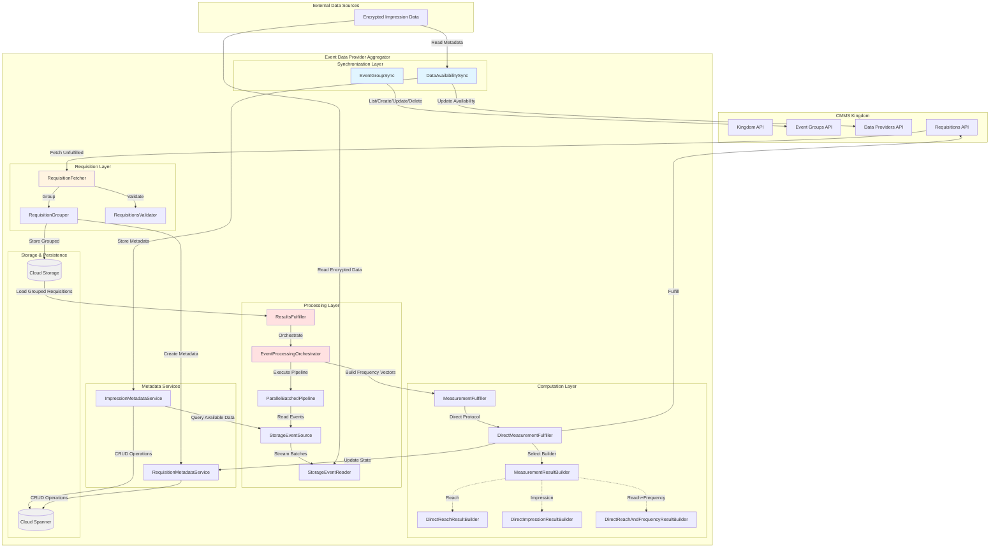

# Event Data Provider Aggregator (edpaggregator) Architecture

## 1. System Overview

The **Event Data Provider Aggregator (EDPA)** is a privacy-preserving advertising measurement subsystem that orchestrates the collection, processing, and fulfillment of measurement requisitions using encrypted impression data. It serves as the bridge between Event Data Providers (EDPs) and the Cross-Media Measurement System (CMMS) Kingdom, enabling privacy-preserving analytics through cryptographic protocols while maintaining differential privacy and k-anonymity guarantees.

### Core Responsibilities

- **Requisition Management**: Fetches, validates, groups, and tracks measurement requisitions from the CMMS Kingdom
- **Event Processing**: Processes encrypted impression data through parallel pipelines with CEL-based filtering
- **Measurement Computation**: Computes reach, frequency, and impression metrics using direct protocol implementations
- **Privacy Preservation**: Applies differential privacy noise and k-anonymity thresholds to protect user privacy
- **Metadata Synchronization**: Maintains bidirectional sync of event groups and data availability with the Kingdom
- **Results Fulfillment**: Signs, encrypts, and submits measurement results back to the Kingdom

### Role in the Broader System

The edpaggregator sits between:
- **Data Providers (EDPs)**: Organizations with impression data stored in encrypted cloud storage
- **CMMS Kingdom**: Central orchestration service managing measurement campaigns
- **Measurement Consumers**: Advertisers requesting privacy-preserving analytics

It acts as the EDP's agent, processing measurement requests while ensuring that raw user-level data never leaves the EDP's control.

## 2. Architecture Diagram



## 3. Key Components

### 3.1 Requisition Fetching

#### RequisitionFetcher
**Location**: `org.wfanet.measurement.edpaggregator.requisitionfetcher`

Orchestrates the complete workflow of fetching unfulfilled requisitions from the Kingdom and persisting them to Cloud Storage.

**Key Methods**:
- `fetchAndStoreRequisitions()`: Fetches requisitions, groups them, and stores to blob storage

**Key Features**:
- Pagination support for large requisition lists
- Metrics tracking (fetch latency, requisitions fetched, storage writes/failures)
- Integration with storage client abstraction

#### RequisitionGrouper
**Location**: `org.wfanet.measurement.edpaggregator.requisitionfetcher`

Abstract base class defining the workflow for transforming raw requisitions into grouped forms ready for execution.

**Implementations**:
- `SingleRequisitionGrouper`: Naive one-per-requisition grouping (not for production)
- `RequisitionGrouperByReportId`: Production-ready grouping by Report ID with metadata persistence and recovery

**Key Features**:
- Validation of requisition specs and measurement specs
- Event group metadata fetching and caching
- Automatic requisition refusal for invalid requests
- Model line consistency validation

#### RequisitionsValidator
**Location**: `org.wfanet.measurement.edpaggregator.requisitionfetcher`

Validates requisitions ensuring they are well-formed and ready for processing.

**Key Features**:
- Decrypts and validates RequisitionSpec using private encryption key
- Validates MeasurementSpec and checks for required Report ID
- Ensures model line consistency across grouped requisitions

### 3.2 Results Fulfillment

#### ResultsFulfiller
**Location**: `org.wfanet.measurement.edpaggregator.resultsfulfiller`

Main orchestrator that manages the lifecycle of grouped requisitions from decryption through fulfillment.

**Key Features**:
- Parallel requisition processing with configurable parallelism
- Integration with EventProcessingOrchestrator for event processing
- Protocol-specific fulfiller selection via FulfillerSelector
- Metrics tracking for fulfillment operations

#### EventProcessingOrchestrator
**Location**: `org.wfanet.measurement.edpaggregator.resultsfulfiller`

Coordinates storage-backed event processing to fulfill requisitions by deduplicating filters and executing a parallel pipeline.

**Key Features**:
- Filter specification deduplication across requisitions
- Creates FrequencyVectorSink instances per unique filter
- Manages parallel event processing pipeline
- Returns frequency vectors mapped to requisition names

#### ParallelBatchedPipeline
**Location**: `org.wfanet.measurement.edpaggregator.resultsfulfiller`

Parallel implementation using structured concurrency with round-robin batch distribution to workers.

**Key Features**:
- Configurable worker count and channel capacity
- Bounded backpressure management
- Thread pool for CPU-intensive operations
- Round-robin batch distribution

#### StorageEventSource / StorageEventReader
**Location**: `org.wfanet.measurement.edpaggregator.resultsfulfiller`

Reads events from cloud storage blobs via impression metadata service.

**Key Features**:
- Parallel blob reading with flow-based streaming
- Encrypted storage support via KMS and Tink
- Batch size configuration
- Integration with ImpressionDataSourceProvider

### 3.3 Computation & Protocol Implementation

#### MeasurementFulfiller Interface
**Location**: `org.wfanet.measurement.edpaggregator.resultsfulfiller.fulfillers`

Interface for protocol-specific requisition fulfillment implementations.

**Implementations**:
- `DirectMeasurementFulfiller`: Fulfills measurements using direct protocol

#### DirectMeasurementResultBuilder
**Location**: `org.wfanet.measurement.edpaggregator.resultsfulfiller.compute.protocols.direct`

Factory and implementations for computing reach, frequency, and impression metrics.

**Implementations**:
- `DirectReachResultBuilder`: Reach-only measurements with DP noise and k-anonymity
- `DirectImpressionResultBuilder`: Impression counts with frequency capping support
- `DirectReachAndFrequencyResultBuilder`: Combined reach and frequency distribution

**Key Features**:
- Differential privacy noise addition (Continuous Gaussian)
- K-anonymity threshold enforcement
- Frequency capping with configurable max frequency per user
- Protocol configuration validation

### 3.4 Synchronization Components

#### EventGroupSync
**Location**: `org.wfanet.measurement.edpaggregator.eventgroups`

Orchestrates event group synchronization with the CMMS Public API.

**Key Features**:
- Three-way merge: create, update, delete
- Flow-based streaming of sync results
- OpenTelemetry metrics (attempts, success, failure, latency)
- Validation of event group fields

#### DataAvailabilitySync
**Location**: `org.wfanet.measurement.edpaggregator.dataavailability`

Synchronizes impression data availability between Cloud Storage and Kingdom.

**Key Features**:
- Triggered by "done" blob signals
- Parses metadata files (.binpb or .json)
- Batch creation of impression metadata
- Model line availability interval computation
- Updates Kingdom data provider availability

### 3.5 Metadata Services

#### ImpressionMetadataService
**Location**: `org.wfanet.measurement.edpaggregator.service.v1alpha`

Public gRPC service for managing impression metadata operations.

**Key Operations**:
- Create, get, delete impression metadata (single and batch)
- List with filtering and pagination
- Compute model line bounds for availability intervals

#### RequisitionMetadataService
**Location**: `org.wfanet.measurement.edpaggregator.service.v1alpha`

Public gRPC service for managing requisition metadata lifecycle.

**Key Operations**:
- Create, get, lookup requisition metadata
- State transitions: queue, start processing, fulfill, refuse, mark withdrawn
- List with filtering by state and pagination
- Fetch latest CMMS create timestamp

### 3.6 Data Structures

#### StripedByteFrequencyVector
**Location**: `org.wfanet.measurement.edpaggregator`

Thread-safe frequency vector using lock striping for concurrent access.

**Key Features**:
- Configurable stripe count (default 1024)
- Atomic increment operations
- Vector merging support
- Uncapped impression tracking

#### FilterSpec
**Location**: `org.wfanet.measurement.edpaggregator`

Immutable specification for event filtering and deduplication.

**Properties**:
- CEL expression for filtering
- Collection interval (time range)
- Event group reference IDs (sorted)

#### ModelLineInfo
**Location**: `org.wfanet.measurement.edpaggregator`

Information required to fulfill requisitions for a specific model line.

**Properties**:
- PopulationSpec: Population specification
- EventDescriptor: Protobuf descriptor for event messages
- VidIndexMap: VID to frequency vector index mapping

## 4. Data Flow

### 4.1 Requisition Fetching Flow

```
1. RequisitionFetcher.fetchAndStoreRequisitions()
   ├─> List unfulfilled requisitions from Kingdom API (paginated)
   ├─> For each requisition:
   │   ├─> RequisitionsValidator.validateMeasurementSpec()
   │   ├─> RequisitionsValidator.validateRequisitionSpec() (decrypt with private key)
   │   └─> RequisitionGrouper.groupRequisitions()
   │       ├─> For each requisition spec:
   │       │   └─> getEventGroupMapEntries() (fetch event group metadata, cached)
   │       ├─> RequisitionGrouperByReportId.createGroupedRequisitions()
   │       │   ├─> Group requisitions by Report ID
   │       │   ├─> Create/lookup RequisitionMetadata for each
   │       │   ├─> Union overlapping collection intervals
   │       │   └─> Recover missing groups from metadata if needed
   │       └─> Refuse invalid requisitions to Kingdom
   └─> Store GroupedRequisitions to Cloud Storage (serialized protobuf)
```

### 4.2 Data Availability Sync Flow

```
1. DataAvailabilitySync.sync(doneBlobPath)
   ├─> Parse done blob path to extract folder
   ├─> List metadata blobs in folder (*.binpb, *.json with "metadata" in name)
   ├─> For each metadata blob:
   │   ├─> Read blob bytes
   │   ├─> Parse as BlobDetails (try binary, fallback to JSON)
   │   ├─> Validate interval (startTime and endTime required)
   │   ├─> Check impression blob exists in storage
   │   └─> Build ImpressionMetadata with deterministic UUID
   ├─> Group metadata by model line
   ├─> Batch create ImpressionMetadata (idempotent with request IDs)
   ├─> For each model line:
   │   ├─> Compute availability intervals (min startTime, max endTime)
   │   └─> Update Kingdom DataProvider availability via replaceDataAvailabilityIntervals
   └─> Record sync metrics (duration, records synced, errors)
```

### 4.3 Results Fulfillment Flow

```
1. ResultsFulfiller.fulfillRequisitions(parallelism)
   ├─> For each GroupedRequisitions (with parallelism limit):
   │   ├─> Extract model line from requisitions
   │   ├─> Get ModelLineInfo (populationSpec, eventDescriptor, vidIndexMap)
   │   └─> EventProcessingOrchestrator.run()
   │       ├─> Build FilterSpecIndex from requisitions (deduplicate filters)
   │       ├─> Create FrequencyVectorSink per unique FilterSpec
   │       ├─> Create StorageEventSource
   │       │   ├─> Query ImpressionMetadataService for available data
   │       │   ├─> For each impression blob:
   │       │   │   └─> Create StorageEventReader (handles encryption/decryption)
   │       │   └─> Generate EventBatch flow (batched by configured size)
   │       ├─> ParallelBatchedPipeline.processEventBatches()
   │       │   ├─> Distribute batches round-robin to workers
   │       │   ├─> Each worker:
   │       │   │   └─> For each FrequencyVectorSink:
   │       │   │       ├─> FilterProcessor.processBatch() (CEL, time, event group filtering)
   │       │   │       └─> StripedByteFrequencyVector.increment() (thread-safe)
   │       │   └─> Wait for all batches processed
   │       └─> Return Map<RequisitionName, StripedByteFrequencyVector>
   │
   │   ├─> For each requisition:
   │   │   ├─> Get frequency vector for requisition
   │   │   ├─> Update RequisitionMetadata state to PROCESSING
   │   │   ├─> FulfillerSelector.selectFulfiller()
   │   │   │   └─> Return DirectMeasurementFulfiller
   │   │   ├─> DirectMeasurementFulfiller.fulfillRequisition()
   │   │   │   ├─> DirectMeasurementResultFactory.buildMeasurementResult()
   │   │   │   │   ├─> Route by measurement type:
   │   │   │   │   │   ├─> REACH -> DirectReachResultBuilder
   │   │   │   │   │   ├─> IMPRESSION -> DirectImpressionResultBuilder
   │   │   │   │   │   └─> REACH_AND_FREQUENCY -> DirectReachAndFrequencyResultBuilder
   │   │   │   │   ├─> Build histogram from frequency data
   │   │   │   │   ├─> Apply k-anonymity thresholds (if configured)
   │   │   │   │   ├─> Add differential privacy noise (if CONTINUOUS_GAUSSIAN)
   │   │   │   │   └─> Return Measurement.Result
   │   │   │   ├─> Sign result with private key
   │   │   │   ├─> Encrypt result for measurement consumer
   │   │   │   ├─> Submit to Kingdom via FulfillDirectRequisitionRequest
   │   │   │   └─> Update RequisitionMetadata state to FULFILLED
   │   │   └─> On error:
   │   │       └─> Update RequisitionMetadata state to REFUSED (with message)
   │   └─> Record fulfillment metrics
   └─> All requisitions processed
```

### 4.4 Event Group Sync Flow

```
1. EventGroupSync.sync()
   ├─> Fetch existing event groups from Kingdom (paginated)
   ├─> Build map of existing EventGroupKey -> CmmsEventGroup
   ├─> For each local EventGroup:
   │   ├─> EventGroupSync.validateEventGroup()
   │   ├─> Check if exists in Kingdom:
   │   │   ├─> Not exists:
   │   │   │   └─> createCmmsEventGroup() -> emit MappedEventGroup
   │   │   ├─> Exists and different:
   │   │   │   ├─> updateEventGroup() (create updated copy)
   │   │   │   └─> updateCmmsEventGroup() -> emit MappedEventGroup
   │   │   └─> Exists and same:
   │   │       └─> emit existing MappedEventGroup
   │   └─> Record sync metrics (attempts, success/failure, latency)
   ├─> For each Kingdom EventGroup not in local flow:
   │   └─> deleteCmmsEventGroup()
   └─> Return Flow<MappedEventGroup>
```

## 5. Integration Points

### 5.1 CMMS Kingdom API Integration

**API Surface**:
- `RequisitionsCoroutineStub`: Fetch, fulfill, refuse requisitions
- `EventGroupsCoroutineStub`: List, create, update, delete event groups
- `DataProvidersCoroutineStub`: Update data availability intervals
- `MeasurementsCoroutineStub`: Submit measurement results

**Authentication**: Uses gRPC with mutual TLS and API authentication tokens

**Resource Names**: Follows Kingdom resource naming conventions:
- `dataProviders/{data_provider_id}`
- `dataProviders/{data_provider_id}/requisitions/{requisition_id}`
- `dataProviders/{data_provider_id}/eventGroups/{event_group_id}`

### 5.2 Cloud Storage Integration

**Storage Operations**:
- List blobs (for metadata discovery)
- Read blobs (for impression data and metadata)
- Write blobs (for grouped requisitions)
- Get blob (for existence checks)

**Encryption**:
- Envelope encryption using Google Cloud KMS
- Data Encryption Keys (DEK) encrypted with Key Encryption Keys (KEK)
- Support for Tink keysets with AES128_GCM

**Blob Formats**:
- Impression data: Mesos Record IO format with encrypted messages
- Metadata: Protocol Buffer binary (.binpb) or JSON (.json)
- Grouped requisitions: Serialized GroupedRequisitions protobuf

### 5.3 Cloud Spanner Integration

**Database Schema**:

Tables:
- `ImpressionMetadata`: Stores impression metadata records
- `RequisitionMetadata`: Stores requisition metadata with state transitions
- `RequisitionMetadataActions`: Audit trail for requisition state changes
- `DataProviders`: Data provider configuration (inherited from parent schema)

**Indexes**:
- `ImpressionMetadataByResourceId`: Lookup by public resource ID
- `ImpressionMetadataByBlobUri`: Lookup by blob URI
- `RequisitionMetadataByResourceId`: Lookup by public resource ID
- `RequisitionMetadataByBlobUri`: Lookup by blob URI
- `RequisitionMetadataByCmmsRequisition`: Lookup by CMMS requisition name
- `RequisitionMetadataByState`: Filtering and pagination by state

**Operations**:
- CRUD operations for metadata entities
- Batch create with idempotency via request IDs
- State transitions with optimistic concurrency (ETags)
- Cursor-based pagination with compound keys

### 5.4 Internal Service Integration

**Service Architecture**:
- Public v1alpha API (ImpressionMetadataService, RequisitionMetadataService)
- Internal API (InternalImpressionMetadataService, InternalRequisitionMetadataService)
- Public API delegates to Internal API via gRPC channel

**Error Handling**:
- Custom exception hierarchy (ServiceException subclasses)
- gRPC ErrorInfo with reason codes and metadata
- Status codes mapped to appropriate gRPC codes (NOT_FOUND, ALREADY_EXISTS, FAILED_PRECONDITION)

## 6. Design Patterns

### 6.1 Strategy Pattern

**RequisitionGrouper Hierarchy**:
- Abstract `RequisitionGrouper` defines template method `groupRequisitions()`
- Concrete implementations provide `createGroupedRequisitions()`:
  - `SingleRequisitionGrouper`: One-per-requisition strategy
  - `RequisitionGrouperByReportId`: Group-by-report-id strategy with recovery

**FulfillerSelector**:
- Interface allows pluggable protocol selection
- Currently supports Direct protocol
- Extensible to HonestMajority Shuffle (HMShuffle) in future

### 6.2 Factory Pattern

**DirectMeasurementResultFactory**:
- Routes to appropriate builder based on measurement type
- Encapsulates builder instantiation logic
- Provides single entry point for result building

**EventSource / EventReader**:
- Abstract interfaces with storage-backed implementations
- Allows different data source types (cloud storage, streaming, etc.)

### 6.3 Builder Pattern

**MeasurementResultBuilder Interface**:
- Multiple implementations for different measurement types
- Each builder encapsulates complex construction logic
- Validates protocol configuration requirements

### 6.4 Pipeline Pattern

**EventProcessingPipeline**:
- Separates event source, processing, and sinks
- `ParallelBatchedPipeline`: Structured concurrency with worker pools
- Flow-based event streaming with backpressure

**Filter-Sink Architecture**:
- Each unique FilterSpec gets dedicated FrequencyVectorSink
- Deduplication minimizes redundant processing
- Parallel processing across independent sinks

### 6.5 Repository Pattern

**Spanner Database Layer**:
- Extension functions on ReadContext and TransactionContext
- Encapsulates query and mutation logic
- Result objects separate from database implementation

**StorageClient Abstraction**:
- Cloud-agnostic blob storage interface
- Implementations for GCS (Google Cloud Storage)
- Supports encrypted storage via decorator pattern

### 6.6 Observer Pattern

**OpenTelemetry Metrics**:
- Metrics objects (EventGroupSyncMetrics, RequisitionFetcherMetrics, etc.)
- Instruments observe operations and emit telemetry
- Centralized via EdpaTelemetry singleton

### 6.7 Template Method Pattern

**RequisitionGrouper.groupRequisitions()**:
- Defines overall workflow (validate, group, refuse invalid)
- Subclasses implement `createGroupedRequisitions()` for specific strategy
- Protected helpers for event group fetching and refusal

### 6.8 Adapter Pattern

**Service Converters**:
- Extension functions convert between internal and public protobuf models
- `toImpressionMetadata()`, `toInternal()`, etc.
- Bidirectional conversion with resource key handling

### 6.9 Singleton Pattern

**EdpaTelemetry**:
- Kotlin object for global OpenTelemetry SDK initialization
- Lazy initialization on first access
- Manages SDK lifecycle (flush, shutdown)

**Tracing**:
- Kotlin object for distributed tracing utilities
- W3C trace context propagation support
- Convenience methods for span creation

## 7. Technology Stack

### 7.1 Core Technologies

**Language**:
- Kotlin (JVM)
- Coroutines for asynchronous programming
- Flow for reactive streams

**Frameworks**:
- gRPC and Protocol Buffers for service communication
- Google Cloud SDK (Storage, Spanner, KMS)
- OpenTelemetry for observability

### 7.2 Data & Storage

**Databases**:
- Google Cloud Spanner (relational, globally distributed)
  - Metadata persistence (impressions, requisitions, actions)
  - Transactional guarantees with optimistic concurrency

**Blob Storage**:
- Google Cloud Storage
  - Encrypted impression data
  - Metadata files (.binpb, .json)
  - Grouped requisitions

### 7.3 Cryptography & Privacy

**Encryption**:
- Google Tink for envelope encryption
- Google Cloud KMS for key management
- Support for AES128_GCM and other Tink key templates

**Privacy Technologies**:
- Differential Privacy (Continuous Gaussian noise)
- K-anonymity thresholds
- Homomorphic encryption (planned for secure computation protocols)

**Signing**:
- Private key signing for result integrity
- Public key encryption for measurement consumers

### 7.4 Event Processing

**CEL (Common Expression Language)**:
- Event filtering expressions
- Dynamic evaluation on event protobuf messages
- Integration via ProjectNessie CEL library

**Protocol Buffers**:
- Message serialization (events, metadata, requests)
- Dynamic message parsing with Descriptors
- JSON format support for metadata

### 7.5 Concurrency & Parallelism

**Kotlin Coroutines**:
- Structured concurrency for lifecycle management
- Channels for inter-coroutine communication
- Dispatchers for thread pool management

**Threading**:
- Configurable thread pools for CPU-intensive operations
- Lock striping for thread-safe frequency vectors
- Throttlers for rate limiting external API calls

### 7.6 Observability

**OpenTelemetry**:
- Metrics: Counters, histograms for operations
- Traces: Distributed tracing with W3C context propagation
- Logs: Structured logging via SDK

**JVM Instrumentation**:
- Runtime metrics (CPU, memory, GC, threads, classes)
- Auto-instrumentation for JVM observability

**Cloud Integration**:
- Google Cloud Trace and Monitoring
- Cloud Functions telemetry flushing
- CloudEvents distributed tracing extension

### 7.7 Deployment & Runtime

**Container Platform**:
- Docker containers
- Kubernetes orchestration (GKE)

**Execution Models**:
- Long-running daemons (requisition fetcher, results fulfiller)
- Cloud Functions (event-driven sync operations)
- Cron jobs (scheduled fetching and sync)

**Configuration**:
- Environment variables for OpenTelemetry
- TextFormat protocol configurations
- Flag-based service configuration

### 7.8 Key Libraries

| Library | Purpose | Package |
|---------|---------|---------|
| `grpc-kotlin` | gRPC Kotlin coroutine stubs | io.grpc |
| `protobuf-kotlin` | Protocol Buffer Kotlin DSL | com.google.protobuf |
| `google-cloud-spanner` | Cloud Spanner client | com.google.cloud.spanner |
| `google-cloud-storage` | Cloud Storage client | com.google.cloud.storage |
| `google-cloud-kms` | KMS client for encryption | com.google.cloud.kms |
| `tink` | Cryptographic library | com.google.crypto.tink |
| `cel-java` | CEL expression evaluation | org.projectnessie.cel |
| `opentelemetry-sdk` | OpenTelemetry implementation | io.opentelemetry |
| `kotlinx-coroutines-core` | Coroutines primitives | org.jetbrains.kotlinx |
| `functions-framework-api` | Cloud Functions support | com.google.cloud.functions |

---

## Appendix A: State Machines

### A.1 RequisitionMetadata State Machine

```
REQUISITION_METADATA_STATE_UNSPECIFIED
    |
    v
STORED (created from Kingdom requisition)
    |
    +---> QUEUED (assigned to work item)
            |
            +---> PROCESSING (actively being fulfilled)
                    |
                    +---> FULFILLED (submitted to Kingdom)
                    |
                    +---> REFUSED (invalid or failed)
                    |
                    +---> WITHDRAWN (canceled by Kingdom)
```

### A.2 ImpressionMetadata State Machine

```
IMPRESSION_METADATA_STATE_UNSPECIFIED
    |
    v
ACTIVE (available for requisition fulfillment)
    |
    +---> DELETED (removed from availability)
```

---

## Appendix B: Security Considerations

### B.1 Data Protection

- **Encryption at Rest**: All impression data encrypted in Cloud Storage using KMS
- **Encryption in Transit**: gRPC with mutual TLS for all Kingdom communication
- **Key Management**: Envelope encryption with KEK in Cloud KMS, DEK per data blob
- **Access Control**: IAM-based access to storage, Spanner, and KMS resources

### B.2 Privacy Guarantees

- **Differential Privacy**: Configurable epsilon/delta parameters, Continuous Gaussian noise
- **K-Anonymity**: Minimum user and impression thresholds, frequency capping
- **Secure Computation**: Direct protocol current, HMShuffle planned for future
- **Result Signing**: Private key signing ensures result integrity and non-repudiation

### B.3 Audit & Compliance

- **State Transitions**: RequisitionMetadataActions table logs all state changes
- **Request IDs**: Idempotent operations with request ID deduplication
- **OpenTelemetry**: Distributed tracing for audit trails
- **Resource Names**: Traceable resource hierarchies across Kingdom and EDP

---

## Appendix C: Performance Characteristics

### C.1 Scalability

- **Parallel Processing**: Configurable worker count for event processing pipeline
- **Batch Processing**: Configurable batch sizes for event reading and API operations
- **Cloud Spanner**: Horizontally scalable metadata storage
- **Cloud Storage**: Unlimited blob storage with parallel reads

### C.2 Optimization Techniques

- **Filter Deduplication**: Minimizes redundant event processing across requisitions
- **Event Group Caching**: Reduces Kingdom API calls during requisition grouping
- **Lock Striping**: Thread-safe frequency vectors with configurable stripe count (default 1024)
- **Pagination**: Efficient large result set handling for listings
- **Throttling**: Rate limiting for external API calls to prevent quota exhaustion

### C.3 Configuration Parameters

| Parameter | Default | Purpose |
|-----------|---------|---------|
| `batchSize` | 256 | Events per batch in pipeline |
| `channelCapacity` | 128 | Per-worker channel capacity in batches |
| `threadPoolSize` | 8 | Thread pool size for dispatcher |
| `workers` | 8 | Parallel worker coroutines |
| `stripeCount` | 1024 | Lock stripes for frequency vector |
| `responsePageSize` | 100 | API pagination page size |
| `impressionMetadataBatchSize` | 100 | Batch size for metadata creation |

---

## Appendix D: Future Enhancements

### D.1 Planned Protocol Support

- **HonestMajority Shuffle (HMShuffle)**: Secure multi-party computation protocol
- **Duration Measurements**: Time-based metrics (watch time, engagement duration)
- **Population Measurements**: Unique user counts across campaigns

### D.2 Potential Optimizations

- **Incremental Processing**: Avoid reprocessing unchanged impression data
- **Result Caching**: Cache computed frequency vectors for reuse
- **Adaptive Parallelism**: Auto-tune worker count based on load
- **Streaming Aggregation**: Reduce memory footprint for large datasets

### D.3 Extended Integrations

- **Multiple Cloud Providers**: AWS S3, Azure Blob Storage support
- **Alternative Databases**: PostgreSQL backend for Spanner compatibility
- **Enhanced Telemetry**: Custom dashboards, alerting, SLO tracking

---

**Document Version**: 1.0
**Last Updated**: 2026-01-16
**Maintainer**: Cross-Media Measurement Team
