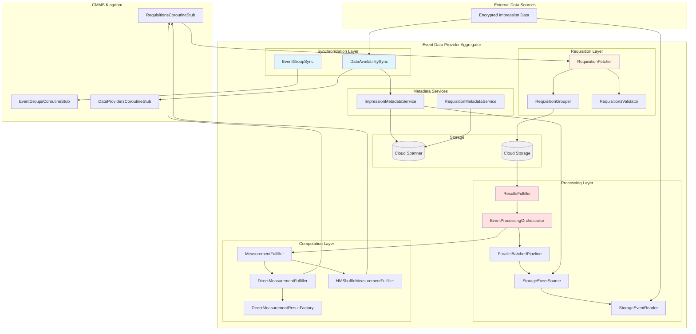

# Event Data Provider Aggregator (edpaggregator) Architecture

## 1. System Overview

The **Event Data Provider Aggregator (EDPA)** is a package that provides infrastructure for event-level measurement in privacy-preserving advertising measurement systems. It orchestrates the collection, validation, processing, and fulfillment of measurement requisitions using encrypted impression data. The package coordinates synchronization with the CMMS (Cross-Media Measurement System) Kingdom, manages impression and requisition metadata, and executes cryptographic measurement protocols including Direct and HonestMajority Shuffle (HMShuffle) approaches.

### Core Responsibilities

- **Requisition Management**: Fetches, validates, groups, and tracks measurement requisitions from the CMMS Kingdom
- **Event Processing**: Processes encrypted impression data through parallel pipelines with CEL-based filtering
- **Measurement Computation**: Computes reach, frequency, and impression metrics using direct protocol implementations
- **Privacy Preservation**: Applies differential privacy noise and k-anonymity thresholds to protect user privacy
- **Metadata Synchronization**: Synchronizes event groups and data availability with the Kingdom
- **Results Fulfillment**: Signs, encrypts, and submits measurement results back to the Kingdom

## 2. Architecture Diagram


```mermaid
graph TB
    subgraph "CMMS Kingdom"
        REQUISITIONS[RequisitionsCoroutineStub]
        EVENTGROUPS[EventGroupsCoroutineStub]
        DATAPROVIDERS[DataProvidersCoroutineStub]
    end

    subgraph "Event Data Provider Aggregator"
        subgraph "Synchronization Layer"
            EVENTGROUPSYNC[EventGroupSync]
            DATAAVAILSYNC[DataAvailabilitySync]
        end

        subgraph "Requisition Layer"
            REQFETCHER[RequisitionFetcher]
            REQGROUPER[RequisitionGrouper]
            REQVALIDATOR[RequisitionsValidator]
        end

        subgraph "Processing Layer"
            RESULTSFULFILLER[ResultsFulfiller]
            ORCHESTRATOR[EventProcessingOrchestrator]
            PIPELINE[ParallelBatchedPipeline]
            EVENTSOURCE[StorageEventSource]
            EVENTREADER[StorageEventReader]
        end

        subgraph "Computation Layer"
            FULFILLERS[MeasurementFulfiller]
            DIRECTFULFILLER[DirectMeasurementFulfiller]
            HMSSFULFILLER[HMShuffleMeasurementFulfiller]
            DIRECTFACTORY[DirectMeasurementResultFactory]
        end

        subgraph "Metadata Services"
            IMPRESSIONMETA[ImpressionMetadataService]
            REQUISITIONMETA[RequisitionMetadataService]
        end

        subgraph "Storage"
            SPANNER[(Cloud Spanner)]
            CLOUDSTORAGE[(Cloud Storage)]
        end
    end

    subgraph "External Data Sources"
        IMPRESSIONS[Encrypted Impression Data]
    end

    %% Synchronization flows
    EVENTGROUPSYNC --> EVENTGROUPS
    DATAAVAILSYNC --> DATAPROVIDERS
    DATAAVAILSYNC --> IMPRESSIONMETA
    IMPRESSIONS --> DATAAVAILSYNC

    %% Requisition flows
    REQUISITIONS --> REQFETCHER
    REQFETCHER --> REQVALIDATOR
    REQFETCHER --> REQGROUPER
    REQGROUPER --> CLOUDSTORAGE

    %% Processing flows
    CLOUDSTORAGE --> RESULTSFULFILLER
    RESULTSFULFILLER --> ORCHESTRATOR
    ORCHESTRATOR --> PIPELINE
    PIPELINE --> EVENTSOURCE
    EVENTSOURCE --> EVENTREADER
    IMPRESSIONS --> EVENTREADER
    IMPRESSIONMETA --> EVENTSOURCE

    %% Computation flows
    ORCHESTRATOR --> FULFILLERS
    FULFILLERS --> DIRECTFULFILLER
    FULFILLERS --> HMSSFULFILLER
    DIRECTFULFILLER --> DIRECTFACTORY

    %% Result submission
    DIRECTFULFILLER --> REQUISITIONS
    HMSSFULFILLER --> REQUISITIONS

    %% Persistence
    IMPRESSIONMETA --> SPANNER
    REQUISITIONMETA --> SPANNER

    style EVENTGROUPSYNC fill:#e1f5ff
    style DATAAVAILSYNC fill:#e1f5ff
    style REQFETCHER fill:#fff4e1
    style RESULTSFULFILLER fill:#ffe1e1
    style ORCHESTRATOR fill:#ffe1e1
    style SPANNER fill:#f0f0f0
    style CLOUDSTORAGE fill:#f0f0f0
```

## 3. Key Components

### 3.1 Requisition Fetching

#### RequisitionFetcher
**Location**: `org.wfanet.measurement.edpaggregator.requisitionfetcher`

Orchestrates the complete workflow of fetching unfulfilled requisitions from the Kingdom and persisting them to Google Cloud Storage.

**Key Methods**:
- `fetchAndStoreRequisitions()`: Fetches unfulfilled requisitions and stores grouped requisitions to storage

**Constructor Parameters**:
- `requisitionsStub: RequisitionsCoroutineStub` - gRPC client for Kingdom requisition operations
- `storageClient: StorageClient` - Client for blob storage operations
- `dataProviderName: String` - Resource name of the data provider
- `storagePathPrefix: String` - Blob key prefix for storage
- `requisitionGrouper: RequisitionGrouper` - Strategy for grouping requisitions
- `responsePageSize: Int?` - Optional page size for listing operations
- `metrics: RequisitionFetcherMetrics` - OpenTelemetry metrics instance

#### RequisitionGrouper
**Location**: `org.wfanet.measurement.edpaggregator.requisitionfetcher`

Abstract base class defining the core workflow for transforming raw requisitions into grouped forms ready for execution.

**Key Methods**:
- `groupRequisitions(requisitions: List<Requisition>)`: Validates and groups requisitions, refusing invalid ones
- `createGroupedRequisitions(requisitions: List<Requisition>)` (abstract): Combines validated requisitions using subclass-specific strategy

**Implementations**:
- `SingleRequisitionGrouper`: Naive grouping strategy that creates one group per requisition (not recommended for production)
- `RequisitionGrouperByReportId`: Production-ready grouping strategy that aggregates requisitions by Report ID with metadata persistence and recovery capabilities

#### RequisitionsValidator
**Location**: `org.wfanet.measurement.edpaggregator.requisitionfetcher`

Validates requisitions ensuring they are well-formed and ready for processing.

**Key Methods**:
- `validateMeasurementSpec(requisition: Requisition)`: Validates and unpacks MeasurementSpec, checking for report ID
- `getRequisitionSpec(requisition: Requisition)`: Decrypts and unpacks RequisitionSpec
- `validateRequisitionSpec(requisition: Requisition)`: Validates RequisitionSpec decryption and parsing
- `validateModelLines(groupedRequisitions: List<GroupedRequisitions>, reportId: String)`: Ensures all requisitions have consistent model lines

### 3.2 Results Fulfillment

#### ResultsFulfiller
**Location**: `org.wfanet.measurement.edpaggregator.resultsfulfiller`

Main orchestrator that manages the lifecycle of grouped requisitions from decryption through fulfillment.

**Key Methods**:
- `fulfillRequisitions(parallelism: Int)`: Processes requisitions in batches with concurrent fulfillment

**Constructor Parameters**:
- `dataProvider: String` - Data provider resource name
- `requisitionMetadataStub: RequisitionMetadataServiceCoroutineStub` - Metadata service stub
- `requisitionsStub: RequisitionsCoroutineStub` - Kingdom requisitions stub
- `privateEncryptionKey: PrivateKeyHandle` - Key for decrypting requisition specs
- `groupedRequisitions: GroupedRequisitions` - Requisitions to fulfill
- `modelLineInfoMap: Map<String, ModelLineInfo>` - Model line configurations
- `pipelineConfiguration: PipelineConfiguration` - Event processing config
- `impressionDataSourceProvider: ImpressionDataSourceProvider` - Impression data resolver
- `kmsClient: KmsClient?` - Optional KMS client for encrypted storage
- `impressionsStorageConfig: StorageConfig` - Storage configuration
- `fulfillerSelector: FulfillerSelector` - Protocol implementation selector
- `metrics: ResultsFulfillerMetrics` - Telemetry metrics

#### EventProcessingOrchestrator
**Location**: `org.wfanet.measurement.edpaggregator.resultsfulfiller`

Coordinates storage-backed event processing to fulfill requisitions by deduplicating filters and executing a parallel pipeline.

**Key Methods**:
- `run(eventSource, vidIndexMap, populationSpec, requisitions, eventGroupReferenceIdMap, config, eventDescriptor)`: Runs pipeline and returns frequency vectors by requisition name
- `createSinksFromFilterSpecs(filterSpecs, vidIndexMap, populationSpec, eventDescriptor)`: Creates one sink per unique filter specification

#### EventProcessingPipeline
**Location**: `org.wfanet.measurement.edpaggregator.resultsfulfiller`

Interface defining event batch processing strategy.

**Key Methods**:
- `processEventBatches(eventSource, sinks)`: Processes event batches through all sinks

#### ParallelBatchedPipeline
**Location**: `org.wfanet.measurement.edpaggregator.resultsfulfiller`

Parallel implementation using structured concurrency with round-robin batch distribution to workers.

**Key Methods**:
- `processEventBatches(eventSource, sinks)`: Processes batches with parallel workers and bounded backpressure

#### StorageEventSource
**Location**: `org.wfanet.measurement.edpaggregator.resultsfulfiller`

Reads events from cloud storage blobs via impression metadata service.

**Key Methods**:
- `generateEventBatches()`: Generates batches by reading from storage in parallel

#### StorageEventReader
**Location**: `org.wfanet.measurement.edpaggregator.resultsfulfiller`

Reads labeled events from encrypted impression blobs in storage.

**Key Methods**:
- `readEvents()`: Streams events from blob with decryption support
- `getBlobDetails()`: Returns underlying blob metadata

### 3.3 Computation & Protocol Implementation

#### MeasurementFulfiller Interface
**Location**: `org.wfanet.measurement.edpaggregator.resultsfulfiller.fulfillers`

Interface defining the contract for fulfilling measurement requisitions.

**Key Methods**:
- `fulfillRequisition()`: Fulfills a requisition

**Implementations**:
- `DirectMeasurementFulfiller`: Fulfiller for direct measurement protocol - signs, encrypts, and submits direct measurement result
- `HMShuffleMeasurementFulfiller`: Fulfiller for Honest Majority Share Shuffle protocol with k-anonymization support

#### FulfillerSelector
**Location**: `org.wfanet.measurement.edpaggregator.resultsfulfiller`

Interface for selecting protocol-specific measurement fulfillers.

**Key Methods**:
- `selectFulfiller(requisition, measurementSpec, requisitionSpec, frequencyVector, populationSpec)`: Selects appropriate fulfiller implementation

#### DirectMeasurementResultFactory
**Location**: `org.wfanet.measurement.edpaggregator.resultsfulfiller.compute.protocols.direct`

Factory object that orchestrates the creation of measurement results based on measurement type specification.

**Key Methods**:
- `buildMeasurementResult(directProtocolConfig, directNoiseMechanism, measurementSpec, frequencyData, maxPopulation, kAnonymityParams, impressionMaxFrequencyPerUser, totalUncappedImpressions)`: Routes to appropriate builder based on measurement type

**Supported Measurement Types**:
- REACH: Uses `DirectReachResultBuilder`
- IMPRESSION: Uses `DirectImpressionResultBuilder`
- REACH_AND_FREQUENCY: Uses `DirectReachAndFrequencyResultBuilder`
- DURATION: Not yet implemented
- POPULATION: Not yet implemented

#### MeasurementResultBuilder Interface
**Location**: `org.wfanet.measurement.edpaggregator.resultsfulfiller.compute`

Interface defining the contract for building measurement results.

**Key Methods**:
- `buildMeasurementResult()`: Builds and returns a measurement result

**Implementations**:
- `DirectReachResultBuilder`: Builds reach-only metrics with differential privacy and k-anonymity
- `DirectImpressionResultBuilder`: Builds impression counts with configurable frequency capping
- `DirectReachAndFrequencyResultBuilder`: Builds combined reach and frequency distribution metrics

### 3.4 Synchronization Components

#### EventGroupSync
**Location**: `org.wfanet.measurement.edpaggregator.eventgroups`

Orchestrates event group synchronization with the CMMS Public API, performing create, update, and delete operations based on input flow differences.

**Key Methods**:
- `sync()`: Synchronizes event groups with CMMS, returning mapped results as Flow<MappedEventGroup>
- `validateEventGroup(eventGroup: EventGroup)`: Validates event group fields are properly populated

**Constructor Parameters**:
- `edpName: String` - Data provider resource name
- `eventGroupsStub: EventGroupsCoroutineStub` - gRPC stub for CMMS event groups API
- `eventGroups: Flow<EventGroup>` - Flow of event groups to synchronize
- `throttler: Throttler` - Rate limiter for API calls
- `listEventGroupPageSize: Int` - Page size for listing operations
- `tracer: Tracer` - OpenTelemetry tracer

**Synchronization Behavior**:
The `EventGroupSync.sync()` method performs a three-way merge:
1. **Create**: Event groups in input flow but not in CMMS are created
2. **Update**: Event groups in both locations are updated if content differs
3. **Delete**: Event groups in CMMS but not in input flow are removed

#### DataAvailabilitySync
**Location**: `org.wfanet.measurement.edpaggregator.dataavailability`

Coordinates the complete workflow for synchronizing impression metadata from Cloud Storage to the Kingdom after a "done" blob signals upload completion.

**Key Methods**:
- `sync(doneBlobPath: String)`: Synchronizes impression availability data after completion signal

**Constructor Parameters**:
- `edpImpressionPath: String` - Path name for the EDP; all impressions reside in subfolders
- `storageClient: StorageClient` - Client for accessing Cloud Storage blobs
- `dataProvidersStub: DataProvidersCoroutineStub` - gRPC stub for Kingdom Data Providers service
- `impressionMetadataServiceStub: ImpressionMetadataServiceCoroutineStub` - gRPC stub for impression metadata operations
- `dataProviderName: String` - Resource name of the data provider
- `throttler: Throttler` - Rate limiting utility for external service requests
- `impressionMetadataBatchSize: Int` - Batch size for creating impression metadata
- `metrics: DataAvailabilitySyncMetrics` - OpenTelemetry metrics

### 3.5 Metadata Services

#### ImpressionMetadataService
**Location**: `org.wfanet.measurement.edpaggregator.service.v1alpha`

Public gRPC service for managing impression metadata resources with CRUD operations and batch processing capabilities.

**Key Methods**:
- `getImpressionMetadata(request)`: Retrieves impression metadata by name
- `createImpressionMetadata(request)`: Creates new impression metadata with deduplication via requestId
- `batchCreateImpressionMetadata(request)`: Creates multiple impression metadata in single transaction
- `deleteImpressionMetadata(request)`: Soft-deletes impression metadata by name
- `batchDeleteImpressionMetadata(request)`: Deletes multiple impression metadata in single transaction
- `listImpressionMetadata(request)`: Lists impression metadata with filtering and pagination
- `computeModelLineBounds(request)`: Computes time bounds for specified model lines

#### RequisitionMetadataService
**Location**: `org.wfanet.measurement.edpaggregator.service.v1alpha`

Public gRPC service for managing requisition metadata with state machine transitions and workflow operations.

**Key Methods**:
- `createRequisitionMetadata(request)`: Creates new requisition metadata
- `batchCreateRequisitionMetadata(request)`: Creates multiple requisition metadata in batch
- `getRequisitionMetadata(request)`: Retrieves requisition metadata by resource name
- `listRequisitionMetadata(request)`: Lists requisition metadata with filtering and pagination
- `lookupRequisitionMetadata(request)`: Looks up by CMMS requisition key
- `fetchLatestCmmsCreateTime(request)`: Retrieves latest CMMS creation timestamp
- `queueRequisitionMetadata(request)`: Transitions to QUEUED state with etag validation
- `startProcessingRequisitionMetadata(request)`: Transitions to PROCESSING state
- `fulfillRequisitionMetadata(request)`: Transitions to FULFILLED state
- `refuseRequisitionMetadata(request)`: Transitions to REFUSED state with message
- `markWithdrawnRequisitionMetadata(request)`: Transitions to WITHDRAWN state

### 3.6 Data Structures

#### StripedByteFrequencyVector
**Location**: `org.wfanet.measurement.edpaggregator`

Thread-safe frequency vector using lock striping for concurrent access.

**Key Methods**:
- `increment(index: Int)`: Increments frequency count at index
- `getByteArray()`: Returns cloned byte array
- `getTotalUncappedImpressions()`: Returns total uncapped impression count
- `merge(other: StripedByteFrequencyVector)`: Merges another frequency vector into this one

**Properties**:
- `size: Int` - Number of entries in the vector
- `stripeCount: Int` - Number of lock stripes (default 1024)

#### FilterSpec
**Location**: `org.wfanet.measurement.edpaggregator`

Immutable specification for event filtering and deduplication.

**Properties**:
- `celExpression: String` - CEL expression for filtering events
- `collectionInterval: Interval` - Time interval for event collection
- `eventGroupReferenceIds: List<String>` - Sorted reference IDs of event groups

#### ModelLineInfo
**Location**: `org.wfanet.measurement.edpaggregator`

Information required to fulfill requisitions for a specific model line.

**Properties**:
- `populationSpec: PopulationSpec` - Population specification for the model line
- `eventDescriptor: Descriptor` - Protobuf descriptor for event messages
- `vidIndexMap: VidIndexMap` - VID to frequency vector index mapping

#### PipelineConfiguration
**Location**: `org.wfanet.measurement.edpaggregator.resultsfulfiller`

Configuration for event processing pipeline.

**Properties**:
- `batchSize: Int` - Events per batch
- `channelCapacity: Int` - Per-worker channel capacity in batches
- `threadPoolSize: Int` - Thread pool size for dispatcher
- `workers: Int` - Parallel worker coroutines

#### FilterSpecIndex
**Location**: `org.wfanet.measurement.edpaggregator`

Index for requisition-to-filter mappings enabling deduplication.

**Properties**:
- `filterSpecToRequisitionNames: Map<FilterSpec, List<String>>` - Maps filter specs to requisition names
- `requisitionNameToFilterSpec: Map<String, FilterSpec>` - Maps requisition names to filter specs

**Static Methods**:
- `fromRequisitions(requisitions, eventGroupReferenceIdMap, privateEncryptionKey)`: Builds index from requisitions with canonicalized filter specs

#### EventGroupKey
**Location**: `org.wfanet.measurement.edpaggregator`

Unique identifier for event groups across measurement consumers.

**Properties**:
- `eventGroupReferenceId: String` - Event group reference identifier
- `measurementConsumer: String` - Measurement consumer owner

## 4. Data Flow

### 4.1 Requisition Fetching Workflow

1. `RequisitionFetcher` lists unfulfilled requisitions from Kingdom
2. `RequisitionGrouper` validates and groups requisitions by strategy (e.g., report ID)
3. Invalid requisitions are refused to Kingdom
4. Valid grouped requisitions are serialized and stored in Cloud Storage
5. Metrics and telemetry events are recorded

### 4.2 Results Fulfillment Workflow

1. `ResultsFulfiller` loads grouped requisitions from storage
2. `EventProcessingOrchestrator` deduplicates filter specifications across requisitions
3. `EventSource` streams encrypted impression data from storage
4. `EventProcessingPipeline` processes event batches through `FrequencyVectorSink` instances
5. Each sink maintains a `StripedByteFrequencyVector` counting matching events
6. `FulfillerSelector` chooses protocol implementation (Direct or HMShuffle)
7. `MeasurementFulfiller` submits computed results to Kingdom
8. `RequisitionMetadataService` updates metadata states through lifecycle transitions

### 4.3 Data Availability Sync Workflow

1. Impression upload completes with a "done" blob signal
2. `DataAvailabilitySync` crawls folder for metadata files (`.binpb` or `.json`)
3. Metadata is parsed and validated
4. `ImpressionMetadataService` persists metadata records in batches
5. Model line availability intervals are computed from metadata
6. Kingdom data provider availability is updated via `replaceDataAvailabilityIntervals`

### 4.4 Event Group Sync Workflow

1. `EventGroupSync` fetches existing event groups from Kingdom
2. Local event groups are compared with Kingdom state
3. Missing event groups are created in Kingdom
4. Changed event groups are updated in Kingdom
5. Orphaned event groups are deleted from Kingdom
6. `MappedEventGroup` results are emitted for successfully synced groups

## 5. Integration Points

### 5.1 CMMS Kingdom API Integration

**API Surface**:
- `RequisitionsCoroutineStub`: Fetch, fulfill, refuse requisitions
- `EventGroupsCoroutineStub`: List, create, update, delete event groups
- `DataProvidersCoroutineStub`: Update data availability intervals

### 5.2 Cloud Storage Integration

**Storage Operations**:
- List blobs (for metadata discovery)
- Read blobs (for impression data and metadata)
- Write blobs (for grouped requisitions)
- Get blob (for existence checks)

**Blob Formats**:
- Impression data: Mesos Record IO format with encrypted messages
- Metadata: Protocol Buffer binary (.binpb) or JSON (.json)
- Grouped requisitions: Serialized GroupedRequisitions protobuf

### 5.3 Cloud Spanner Integration

**Database Tables** (from deploy.gcloud.spanner.db):
- `ImpressionMetadata`: Stores impression metadata records
- `RequisitionMetadata`: Stores requisition metadata with state transitions
- `RequisitionMetadataActions`: Audit trail for requisition state changes

**Operations**:
- CRUD operations for metadata entities
- Batch create with idempotency via request IDs
- State transitions with optimistic concurrency (ETags)
- Cursor-based pagination

### 5.4 Internal Service Architecture

**Service Layers**:
- Public v1alpha API (ImpressionMetadataService, RequisitionMetadataService)
- Internal API (InternalImpressionMetadataService, InternalRequisitionMetadataService)
- Public API delegates to Internal API via gRPC channel

## 6. State Machines

### 6.1 RequisitionMetadata State Machine

```
STORED (created from Kingdom requisition)
    |
    +---> QUEUED (assigned to work item)
            |
            +---> PROCESSING (actively being fulfilled)
                    |
                    +---> FULFILLED (submitted to Kingdom)
                    |
                    +---> REFUSED (invalid or failed)
                    |
                    +---> WITHDRAWN (canceled by Kingdom)
```

### 6.2 ImpressionMetadata State Machine

```
ACTIVE (available for requisition fulfillment)
    |
    +---> DELETED (removed from availability)
```

## 7. Privacy and Security

### 7.1 Differential Privacy

All direct measurement builders support optional differential privacy noise addition:
- Noise mechanisms: NONE, CONTINUOUS_LAPLACE, CONTINUOUS_GAUSSIAN
- Current implementation uses Continuous Gaussian for DP operations
- Privacy budgets controlled via epsilon and delta parameters
- Separate privacy parameters for reach and frequency in combined measurements

### 7.2 K-Anonymity

Optional k-anonymity thresholds protect against low-count disclosure:
- `minUsers`: Minimum user count threshold
- `minImpressions`: Minimum impression count threshold
- `reachMaxFrequencyPerUser`: Maximum frequency per user for reach calculations
- Returns zero values when thresholds are not met

### 7.3 Encryption

**Encryption Support** (from EncryptedStorage utility):
- `generateSerializedEncryptionKey()`: Generates serialized encrypted keyset using KMS client
- `buildEncryptedMesosStorageClient()`: Builds envelope encryption storage client wrapped by Mesos Record IO
- `writeDek()`: Writes data encryption key to storage

**Key Types Supported** (from resultsfulfiller.crypto):
- AES-GCM-HKDF streaming encryption keys
- Standard AES-GCM encryption keys

## 8. Telemetry

### 8.1 EdpaTelemetry
**Location**: `org.wfanet.measurement.edpaggregator.telemetry`

Singleton object managing OpenTelemetry SDK initialization, JVM runtime metrics, and telemetry lifecycle.

**Key Methods**:
- `ensureInitialized()`: Triggers initialization
- `flush(timeout: Duration)`: Forces parallel export of pending metrics, traces, and logs
- `shutdown()`: Shuts down SDK and flushes all telemetry

**Features**:
- Auto-initializes on first access
- Configures SDK using environment variables (OTEL_SERVICE_NAME, OTEL_METRICS_EXPORTER, OTEL_TRACES_EXPORTER, OTEL_METRIC_EXPORT_INTERVAL)
- Registers JVM runtime metrics observers (Classes, CPU, GarbageCollector, MemoryPools, Threads)
- Creates global meter and tracer instances with instrumentation scope "edpa-instrumentation"

### 8.2 Tracing
**Location**: `org.wfanet.measurement.edpaggregator.telemetry`

Singleton object providing distributed tracing helpers with W3C trace context propagation support.

**Key Methods**:
- `withW3CTraceContext(request: HttpRequest, block)`: Extracts W3C context from HTTP request
- `withW3CTraceContext(event: CloudEvent, block)`: Extracts W3C context from CloudEvent
- `trace(spanName, attributes, block)`: Executes block within a new internal span
- `traceSuspending(spanName, attributes, block)`: Executes suspending block within a new span

### 8.3 Metrics Classes

- `RequisitionFetcherMetrics`: Tracks fetch latency, requisitions fetched, storage writes/failures
- `EventGroupSyncMetrics`: Tracks sync attempts, success, failure, latency
- `DataAvailabilitySyncMetrics`: Tracks sync duration, records synced, CMMS RPC errors
- `ResultsFulfillerMetrics`: Tracks fulfillment operations

## 9. Dependencies

### Core Libraries
- `org.wfanet.measurement.api.v2alpha` - CMMS Kingdom API client definitions
- `org.wfanet.measurement.storage` - Storage abstraction layer
- `org.wfanet.measurement.common.crypto` - Cryptographic primitives and key handling
- `org.wfanet.measurement.consent.client.dataprovider` - Consent and encryption utilities
- `org.wfanet.measurement.eventdataprovider` - Event filtering, VID indexing, and noise mechanism support

### External Libraries
- `com.google.crypto.tink` - Google Tink cryptography library
- `io.grpc` - gRPC framework for service communication
- `io.opentelemetry.api` - OpenTelemetry observability
- `kotlinx.coroutines` - Kotlin coroutines for async/concurrent operations
- `com.google.protobuf` - Protocol Buffers message serialization
- `org.projectnessie.cel` - Common Expression Language (CEL) program compilation and execution
- `com.google.cloud.spanner` - Google Cloud Spanner client
- `com.google.cloud.functions` - Cloud Functions support

---

**Document Version**: 1.1
**Last Updated**: 2026-01-20
**Based on**: Source documentation files in `docs/org.wfanet.measurement.edpaggregator*.md`
