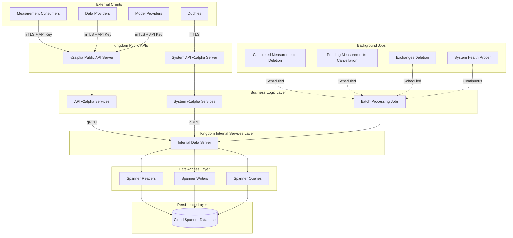
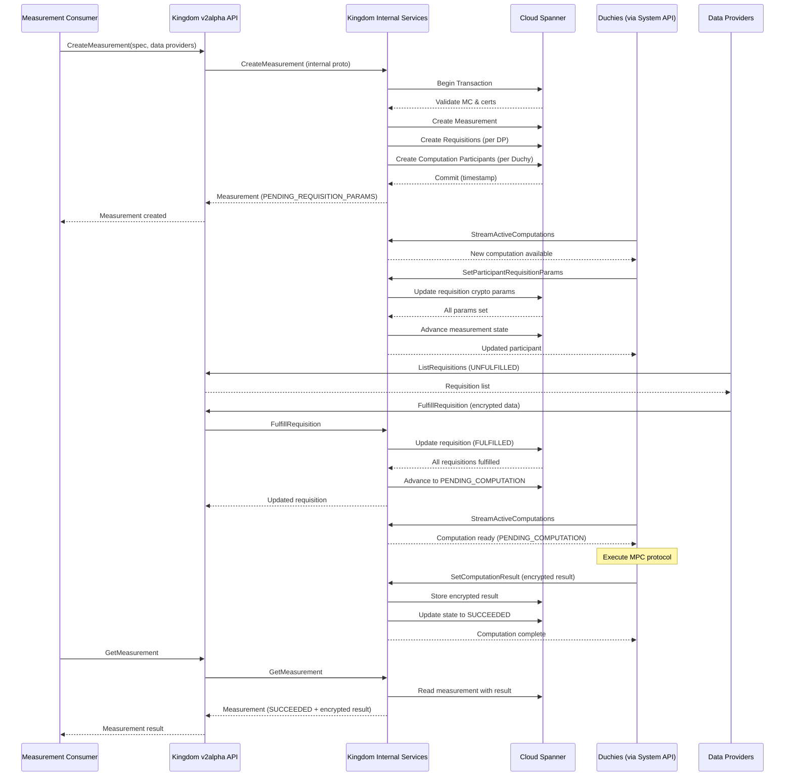

# Kingdom Subsystem Architecture

## 1. System Overview

### Purpose

The **Kingdom** subsystem is the central coordination and orchestration component of the Cross-Media Measurement (CMM) system. It serves as the authoritative source of truth for all measurement operations, managing the complete lifecycle of privacy-preserving measurements across multiple participating entities.

### Role in the Broader System

The Kingdom acts as the trusted central authority that:

- **Coordinates Multi-Party Computations (MPC)**: Orchestrates secure computations across multiple Duchies (computation nodes) without exposing raw data
- **Manages Entity Registration**: Maintains registries of Measurement Consumers (advertisers/agencies), Data Providers (publishers/platforms), Model Providers, and Duchies
- **Handles Measurement Lifecycle**: Manages the creation, execution, completion, and result delivery of privacy-preserving measurements
- **Enforces Privacy Policies**: Validates differential privacy parameters, privacy budget constraints, and consent signals
- **Facilitates Data Exchanges**: Coordinates recurring data exchanges between Model Providers and Data Providers for model evaluation
- **Provides Authentication & Authorization**: Manages certificates, API keys, accounts, and access control across the system

### Key Responsibilities

1. **Measurement Orchestration**: Creating measurements, generating requisitions for data providers, coordinating computation participants, and tracking measurement state through completion
2. **Entity Management**: Registration and lifecycle management of all system participants
3. **Certificate Management**: X.509 certificate lifecycle including issuance, revocation, and validation
4. **Event Group Management**: Managing collections of measurement events with encrypted metadata
5. **Model Management**: Coordinating model deployment, rollouts, sharding, and outages for machine learning pipelines
6. **System Maintenance**: Automated retention policies, health monitoring, and data lifecycle management

## 2. Architecture Diagram

### High-Level Component Architecture



### Measurement Flow Architecture



## 3. Key Components

### 3.1 Service Layer (`kingdom.service`)

#### Public API v2alpha (`kingdom.service.api.v2alpha`)
External-facing gRPC services for measurement consumers, data providers, and model providers.

**Core Services:**
- **MeasurementsService**: Create, list, cancel, and retrieve measurements with protocol configuration (LLv2, RoLLv2, HMSS, TrusTEE, Direct)
- **RequisitionsService**: List, fulfill, and refuse data requisitions
- **DataProvidersService**: Manage data provider capabilities, required duchies, and data availability
- **MeasurementConsumersService**: Register measurement consumers, manage owners, handle public keys
- **CertificatesService**: X.509 certificate lifecycle (create, revoke, release hold)
- **EventGroupsService**: Create, update, delete, and list event groups with encrypted metadata
- **AccountsService**: User account management with OpenID Connect authentication
- **ApiKeysService**: API key generation and revocation
- **ExchangesService / ExchangeStepsService / ExchangeStepAttemptsService**: Coordinate recurring data exchanges
- **Model Management Services**: ModelProvidersService, ModelSuitesService, ModelLinesService, ModelReleasesService, ModelRolloutsService, ModelOutagesService, ModelShardsService
- **PopulationsService**: Manage population definitions for model evaluation

**Key Features:**
- Multi-protocol support with dynamic protocol selection
- Measurement types: Reach, Reach & Frequency, Impression, Duration, Population
- Noise mechanisms: Geometric, Discrete Gaussian, Continuous Laplace/Gaussian
- Privacy budget validation (epsilon/delta parameters)
- Account-based authentication (OpenID Connect) and API key authentication
- Rate limiting per client certificate
- Proto conversions between public and internal formats

#### System API v1alpha (`kingdom.service.system.v1alpha`)
Internal-facing gRPC services for Duchies to participate in computations.

**Core Services:**
- **ComputationsService**: Stream active computations, get computation details, set computation results
- **ComputationParticipantsService**: Get participant info, set requisition parameters, confirm/fail participants
- **RequisitionsService**: Fulfill requisitions with encrypted data and nonces
- **ComputationLogEntriesService**: Create computation log entries for debugging

**Key Features:**
- Streaming API for active computation polling (10-minute timeout, 1-second throttle)
- Continuation token-based pagination
- Protocol-specific parameter handling (ElGamal for LLv2, Tink keys for HMSS)
- Duchy identity verification and authorization

### 3.2 Deployment Layer (`kingdom.deploy`)

#### Common Deployment (`kingdom.deploy.common`)
Shared deployment infrastructure and protocol configuration.

**Configuration Components:**
- **DuchyIds**: Maps internal/external Duchy IDs with time-based activation ranges
- **Llv2ProtocolConfig**: Liquid Legions V2 configuration with duchy requirements
- **RoLlv2ProtocolConfig**: Reach-Only Liquid Legions V2 configuration
- **HmssProtocolConfig**: Honest Majority Share Shuffle (3-duchy) configuration
- **TrusTeeProtocolConfig**: Trusted Execution Environment configuration

**Server Components:**
- **KingdomDataServer**: Abstract base for internal data layer servers
- **SystemApiServer**: System API v1alpha server daemon
- **V2alphaPublicApiServer**: Public API v2alpha server daemon with multi-protocol support

**Job Components:**
- **CompletedMeasurementsDeletionJob**: Removes completed measurements after TTL (default: 100 days)
- **PendingMeasurementsCancellationJob**: Cancels stale pending measurements (default: 30 days)
- **ExchangesDeletionJob**: Deletes expired exchange records (default: 100 days)
- **MeasurementSystemProberJob**: Continuous health monitoring via test measurements

#### Spanner Deployment (`kingdom.deploy.gcloud.spanner`)
Google Cloud Spanner-based persistence layer.

**Pattern: Reader-Writer-Query**
- **Readers**: Execute SELECT queries, transform Spanner rows to protobuf
- **Writers**: Execute INSERT/UPDATE/DELETE within read-write transactions
- **Queries**: Combine readers with filtering, pagination, and streaming
- **Services**: gRPC endpoints orchestrating readers/writers

**Key Service Implementations:**
- **SpannerMeasurementsService**: Measurement CRUD with transaction management
- **SpannerDataProvidersService**: Data provider management
- **SpannerEventGroupsService**: Event group operations with batch support
- **SpannerRequisitionsService**: Requisition lifecycle management
- **SpannerCertificatesService**: Certificate operations with revocation
- **SpannerExchangesService**: Exchange workflow coordination
- **SpannerModelLinesService / SpannerModelRolloutsService**: Model deployment management
- **SpannerAccountsService**: Account and identity management
- **SpannerApiKeysService**: API key authentication

**Transaction Patterns:**
- Read-modify-write with optimistic concurrency (ETag validation)
- Idempotent creation using request IDs
- Batch operations with rollback on partial failure

### 3.3 Batch Processing (`kingdom.batch`)

Automated maintenance and monitoring jobs.

**CompletedMeasurementsDeletion**
- Deletes measurements in terminal states (SUCCEEDED, FAILED, CANCELLED) after TTL
- Batch size: 25 per RPC (configurable)
- Metric: `wfanet.measurement.retention.deleted_measurements`

**PendingMeasurementsCancellation**
- Cancels measurements stuck in pending states beyond TTL
- Pending states: PENDING_COMPUTATION, PENDING_PARTICIPANT_CONFIRMATION, PENDING_REQUISITION_FULFILLMENT, PENDING_REQUISITION_PARAMS
- Batch size: 1000 measurements
- Metric: `wfanet.measurement.retention.cancelled_measurements`

**ExchangesDeletion**
- Removes exchange records older than configured days
- Batch size: 1000 exchanges
- Metric: `wfanet.measurement.retention.deleted_exchanges`

**MeasurementSystemProber**
- Creates periodic probe measurements (reach-and-frequency)
- Tracks measurement and requisition completion times
- Metrics: `wfanet.measurement.prober.last_terminal_measurement.timestamp`, `wfanet.measurement.prober.last_terminal_requisition.timestamp`
- Privacy params: epsilon=0.005, delta=1e-15

## 4. Data Flow

### 4.1 Measurement Creation Flow

1. **Request Validation** (v2alpha API)
   - Parse measurement specification
   - Validate measurement consumer identity
   - Verify measurement consumer certificate
   - Extract data provider entries with encrypted requisition specs

2. **Protocol Selection** (Internal Service)
   - Determine protocol based on data provider count and capabilities
   - Select from: Direct (1 DP), LLv2 (2+ DPs), RoLLv2 (reach-only), HMSS (3+ DPs with capability), TrusTEE (1+ DPs with capability)
   - Validate protocol configuration and required duchies

3. **Entity Creation** (Spanner Writer)
   - **Transaction begins**
   - Validate measurement consumer and certificates exist
   - Check for duplicate via create request ID (idempotency)
   - Create Measurement record (state: PENDING_REQUISITION_PARAMS or PENDING_REQUISITION_FULFILLMENT)
   - Create Requisition records (one per data provider)
   - Create ComputationParticipant records (one per required duchy)
   - **Transaction commits** with timestamp

4. **Result Propagation**
   - Convert internal measurement to public API format
   - Return measurement with external IDs
   - Measurement Consumer receives created measurement

### 4.2 Requisition Fulfillment Flow

1. **Parameter Setting** (Duchies via System API)
   - Duchy streams active computations
   - Duchy calls SetParticipantRequisitionParams with crypto parameters (ElGamal public key, Tink public key, etc.)
   - All participants set parameters → Measurement advances to PENDING_REQUISITION_FULFILLMENT

2. **Data Provider Fulfillment** (EDPs via v2alpha API)
   - Data Provider lists unfulfilled requisitions
   - Data Provider encrypts measurement data with protocols
   - Data Provider calls FulfillRequisition with encrypted data and nonce
   - Requisition state changes to FULFILLED

3. **Computation Triggering**
   - All requisitions fulfilled → Measurement advances to PENDING_PARTICIPANT_CONFIRMATION
   - Duchies confirm readiness → Measurement advances to PENDING_COMPUTATION
   - Duchies begin MPC protocol execution

### 4.3 Computation Result Flow

1. **Result Submission** (Duchy via System API)
   - Duchy completes MPC computation
   - Duchy calls SetComputationResult with encrypted result and aggregator certificate
   - Result stored in DuchyMeasurementResult table

2. **State Transition** (Internal Service)
   - Measurement state updated to SUCCEEDED
   - Update timestamp recorded
   - Commit logged

3. **Result Retrieval** (Measurement Consumer via v2alpha API)
   - Measurement Consumer calls GetMeasurement
   - Returns measurement with encrypted result
   - Measurement Consumer decrypts result with private key

### 4.4 Event Group Data Flow

1. **Creation** (Data Provider via v2alpha API)
   - Data Provider creates EventGroup with encrypted metadata
   - Metadata encrypted with Measurement Consumer's public key
   - Event templates define expected event structure
   - VID model line associations for virtual ID models

2. **Discovery** (Measurement Consumer via v2alpha API)
   - Measurement Consumer lists EventGroups
   - Filter by metadata (encrypted search capability)
   - Retrieve data availability intervals

3. **Measurement Association**
   - Measurement references EventGroups via data provider entries
   - Requisition spec includes event group filters and time ranges
   - Data Provider fulfills using events from specified EventGroups

## 5. Integration Points

### 5.1 External Integrations

#### Duchies (Computation Nodes)
- **Protocol**: gRPC over mTLS
- **API**: System API v1alpha
- **Operations**: Stream computations, set requisition params, confirm participation, set results, create log entries
- **Authentication**: Client certificate with Duchy identity
- **Data Flow**: Bidirectional (stream computations from Kingdom, push results to Kingdom)

#### Measurement Consumers (Advertisers/Agencies)
- **Protocol**: gRPC over mTLS
- **API**: Public API v2alpha
- **Operations**: Create measurements, list measurements, cancel measurements, retrieve results, manage certificates, create accounts
- **Authentication**: API key or Account-based (OpenID Connect)
- **Data Flow**: Request-response (create measurements, retrieve encrypted results)

#### Data Providers (Publishers/Platforms)
- **Protocol**: gRPC over mTLS
- **API**: Public API v2alpha
- **Operations**: List requisitions, fulfill requisitions, refuse requisitions, manage event groups, update capabilities
- **Authentication**: API key with certificate-based principal
- **Data Flow**: Pull requisitions, push fulfillment data

#### Model Providers (ML/AI Platforms)
- **Protocol**: gRPC over mTLS
- **API**: Public API v2alpha
- **Operations**: Create model suites/lines/releases, manage rollouts, create populations, coordinate exchanges
- **Authentication**: API key with certificate-based principal
- **Data Flow**: Bidirectional (exchange workflows)

### 5.2 Internal Integrations

#### Cloud Spanner Database
- **Protocol**: gRPC (Cloud Spanner API)
- **Operations**: Read-write transactions, streaming queries, batch mutations
- **Consistency**: Strong consistency with external consistency (TrueTime)
- **Schema**: Multi-table relational schema with foreign key constraints
- **Data Flow**: Bidirectional (reads via queries, writes via transactions)

#### OpenTelemetry Metrics
- **Integration**: OpenTelemetry API
- **Metrics Exported**:
  - `wfanet.measurement.retention.deleted_measurements`
  - `wfanet.measurement.retention.cancelled_measurements`
  - `wfanet.measurement.retention.deleted_exchanges`
  - `wfanet.measurement.prober.last_terminal_measurement.timestamp`
  - `wfanet.measurement.prober.last_terminal_requisition.timestamp`
- **Backend**: Cloud Monitoring, Prometheus, or custom collector

#### Kubernetes (GKE)
- **Deployments**: gcp-kingdom-data-server, system-api-server, v2alpha-public-api-server
- **Services**: ClusterIP (internal data server), LoadBalancer (public/system APIs)
- **CronJobs**: Scheduled batch jobs for retention and health monitoring
- **NetworkPolicies**: Firewall rules for internal/external traffic
- **ConfigMaps**: Authority key identifier maps, event group metadata types
- **Secrets**: TLS certificates, private keys, protocol configurations

## 6. Design Patterns

### 6.1 Layered Architecture
The Kingdom follows a strict layered architecture:

**Layer 1: External API Layer**
- Public API v2alpha and System API v1alpha
- Protocol buffer-based gRPC services
- Authentication and authorization interceptors

**Layer 2: Business Logic Layer**
- Service implementations with domain logic
- Protocol conversions (public ↔ internal)
- Error handling and validation

**Layer 3: Internal API Layer**
- Internal gRPC services with storage-agnostic interface
- Transaction coordination
- Entity lifecycle management

**Layer 4: Data Access Layer**
- Reader-Writer-Query pattern
- Storage backend abstraction

**Layer 5: Persistence Layer**
- Cloud Spanner database
- Schema management via Liquibase

### 6.2 Reader-Writer-Query Pattern
Separation of concerns for database operations:

- **Readers**: Stateless query execution, row-to-protobuf transformation
- **Writers**: Transaction management, optimistic concurrency, idempotency
- **Queries**: Streaming results with filtering and pagination

Benefits:
- Testability (mock readers/writers independently)
- Reusability (compose readers in queries)
- Performance (optimize queries separately from business logic)

### 6.3 Protocol Buffer-Based RPC
All APIs defined using Protocol Buffers:

- **Versioning**: v2alpha (public), v1alpha (system), internal (storage)
- **Backward Compatibility**: Additive changes only
- **Type Safety**: Strongly-typed messages across language boundaries
- **Code Generation**: Generated clients/servers for multiple languages

### 6.4 Optimistic Concurrency Control
ETags computed from update timestamps:

1. Client reads entity with ETag (based on Spanner commit timestamp)
2. Client modifies entity locally
3. Client sends update with original ETag
4. Server validates ETag matches current timestamp
5. On mismatch: reject with ABORTED/FAILED_PRECONDITION
6. On match: apply update and generate new ETag

### 6.5 Idempotent Operations
Request ID-based deduplication:

- Create operations accept optional request_id
- On duplicate request_id: return existing entity
- Implemented via transaction check before insert
- Prevents duplicate measurements, certificates, accounts

### 6.6 State Machine Pattern
Measurement and requisition lifecycles as state machines:

**Measurement States:**
```
PENDING_REQUISITION_PARAMS → PENDING_REQUISITION_FULFILLMENT →
PENDING_PARTICIPANT_CONFIRMATION → PENDING_COMPUTATION →
COMPUTING → (SUCCEEDED | FAILED | CANCELLED)
```

**Requisition States:**
```
PENDING_PARAMS → UNFULFILLED → (FULFILLED | REFUSED | WITHDRAWN)
```

Transitions validated via state checks in writers.

### 6.7 Interceptor Chain Pattern
gRPC interceptors for cross-cutting concerns:

1. **AuthorityKeyServerInterceptor**: Extract client certificate AKID
2. **AkidPrincipalServerInterceptor**: Resolve AKID to principal
3. **AccountAuthenticationServerInterceptor**: Validate OpenID ID token
4. **ApiKeyAuthenticationServerInterceptor**: Validate API key
5. **RateLimitingServerInterceptor**: Enforce per-client rate limits
6. **DuchyIdentityServerInterceptor**: Inject Duchy identity context

### 6.8 Abstract Factory Pattern
DataServices interface abstracts service creation:

- **Interface**: `DataServices.buildDataServices(CoroutineContext)`
- **Implementation**: `SpannerDataServices` (Cloud Spanner backend)
- **Extensibility**: Supports alternative backends (PostgreSQL, etc.)
- **Testing**: Mock implementations for unit tests

## 7. Technology Stack

### 7.1 Core Technologies

#### Language & Runtime
- **Kotlin**: Primary language (JVM-based)
- **Kotlin Coroutines**: Asynchronous programming with structured concurrency
- **Java 11+**: Runtime environment

#### RPC Framework
- **gRPC**: High-performance RPC framework
- **Protocol Buffers**: Interface definition and serialization
- **gRPC-Kotlin**: Kotlin coroutine-based gRPC stubs

#### Database
- **Google Cloud Spanner**: Globally-distributed, horizontally-scalable relational database
- **Liquibase**: Database schema version control and migration
- **Cloud Spanner Client Library**: Async Spanner client for Kotlin

### 7.2 Infrastructure

#### Container Orchestration
- **Kubernetes (GKE)**: Container orchestration on Google Kubernetes Engine
- **Docker**: Container runtime
- **Kustomize**: Kubernetes configuration management
- **CUE**: Configuration generation language for K8s manifests

#### Build System
- **Bazel**: Polyglot build and test system
- **rules_kotlin**: Bazel rules for Kotlin compilation
- **rules_docker**: Bazel rules for container image building

#### Cloud Platform
- **Google Cloud Platform (GCP)**: Primary cloud provider
- **Cloud Spanner**: Database service
- **Cloud Load Balancing**: External traffic distribution
- **Cloud Monitoring**: Metrics and observability
- **Cloud Certificate Authority Service**: Certificate issuance (optional)

### 7.3 Security

#### TLS & Certificates
- **Mutual TLS (mTLS)**: Bidirectional authentication
- **X.509 Certificates**: Client and server authentication
- **Certificate Revocation**: Support for revocation and hold states

#### Authentication
- **OpenID Connect**: Account-based authentication with self-issued ID tokens
- **API Keys**: Programmatic access authentication
- **Certificate-based Authentication**: Principal identification via Authority Key Identifier (AKID)

#### Cryptography
- **Tink**: Cryptographic library for key management
- **Bouncy Castle**: X.509 certificate parsing and validation
- **SHA-256**: Certificate fingerprinting and ETag computation

### 7.4 Observability

#### Metrics
- **OpenTelemetry**: Metrics API and SDK
- **Prometheus**: Metrics collection (optional)
- **Cloud Monitoring**: GCP-native metrics backend

#### Logging
- **java.util.logging**: Structured logging
- **gRPC Logging**: Verbose request/response logging (debug mode)

### 7.5 Testing

#### Test Frameworks
- **JUnit 5**: Unit and integration testing
- **Mockito**: Mocking framework
- **Truth**: Fluent assertion library
- **gRPC In-Process Server**: In-memory gRPC testing

#### Test Infrastructure
- **Spanner Emulator**: Local Cloud Spanner for integration tests
- **Testcontainers**: Containerized test dependencies (optional)

### 7.6 Developer Tools

#### CLI Tools
- **picocli**: Command-line interface framework
- **kubectl**: Kubernetes cluster management
- **gcloud**: Google Cloud SDK

#### Configuration
- **TextProto**: Human-readable Protocol Buffer configuration files
- **YAML**: Kubernetes resource definitions
- **CUE**: Type-safe configuration generation

### 7.7 Dependencies (Key Libraries)

```kotlin
// gRPC & Protobuf
io.grpc:grpc-kotlin-stub
io.grpc:grpc-netty
io.grpc:grpc-protobuf
com.google.protobuf:protobuf-kotlin

// Cloud Spanner
com.google.cloud:google-cloud-spanner
org.wfanet.measurement.gcloud:gcloud-spanner

// Coroutines
org.jetbrains.kotlinx:kotlinx-coroutines-core
org.jetbrains.kotlinx:kotlinx-coroutines-jdk8

// Cryptography
com.google.crypto.tink:tink
org.bouncycastle:bcpkix-jdk15on

// Observability
io.opentelemetry:opentelemetry-api
io.opentelemetry:opentelemetry-sdk

// CLI
info.picocli:picocli

// Testing
org.junit.jupiter:junit-jupiter
org.mockito.kotlin:mockito-kotlin
com.google.truth:truth
```

### 7.8 Deployment Configuration

#### Production Topology
```
┌─────────────────────────────────────────────────────────┐
│                   Load Balancer (GCP)                    │
│  ┌────────────────────┐   ┌──────────────────────────┐  │
│  │ v2alpha Public API │   │ System API v1alpha       │  │
│  │ (External IP)      │   │ (External IP)            │  │
│  └────────────────────┘   └──────────────────────────┘  │
└─────────────────────────────────────────────────────────┘
                    │                     │
                    ▼                     ▼
┌────────────────────────────────────────────────────────┐
│              Kubernetes Cluster (GKE)                   │
│  ┌──────────────────┐ ┌──────────────────────────────┐ │
│  │ v2alpha API      │ │ System API                   │ │
│  │ Server Pods      │ │ Server Pods                  │ │
│  │ (Deployment)     │ │ (Deployment)                 │ │
│  └──────────────────┘ └──────────────────────────────┘ │
│           │                         │                   │
│           └─────────────┬───────────┘                   │
│                         ▼                               │
│           ┌──────────────────────────┐                  │
│           │ Internal Data Server     │                  │
│           │ (ClusterIP Service)      │                  │
│           └──────────────────────────┘                  │
│                         │                               │
│  ┌──────────────────────┴───────────────────────────┐  │
│  │            CronJobs (Scheduled)                   │  │
│  │  - CompletedMeasurementsDeletion                 │  │
│  │  - PendingMeasurementsCancellation               │  │
│  │  - ExchangesDeletion                              │  │
│  │  - MeasurementSystemProber                        │  │
│  └──────────────────────────────────────────────────┘  │
└────────────────────────────────────────────────────────┘
                         │
                         ▼
           ┌──────────────────────────┐
           │   Cloud Spanner          │
           │   (Global Database)      │
           │   - Kingdom Schema       │
           │   - Multi-Region         │
           │   - Strong Consistency   │
           └──────────────────────────┘
```

#### Scaling Characteristics
- **Horizontal Scaling**: API servers scale via Kubernetes replica count
- **Database Scaling**: Cloud Spanner auto-scales with node count and regional replication
- **Rate Limiting**: Per-client limits prevent resource exhaustion
- **Stateless Services**: All API servers are stateless (state in Spanner)

---

## Summary

The Kingdom subsystem is a sophisticated, production-grade orchestration platform for privacy-preserving cross-media measurements. It leverages modern cloud-native technologies (Kubernetes, Cloud Spanner, gRPC) with enterprise-grade security (mTLS, certificate management, rate limiting) to coordinate complex multi-party computations across untrusted parties. The architecture prioritizes:

- **Scalability**: Horizontally scalable API servers with globally-distributed database
- **Security**: Multi-layered authentication, authorization, and encryption
- **Extensibility**: Protocol-agnostic design supporting multiple MPC protocols
- **Reliability**: Transactional consistency, idempotent operations, automated health monitoring
- **Maintainability**: Clean separation of concerns, comprehensive testing, automated retention policies

This makes the Kingdom the foundational component enabling privacy-preserving measurement and attribution at internet scale.
