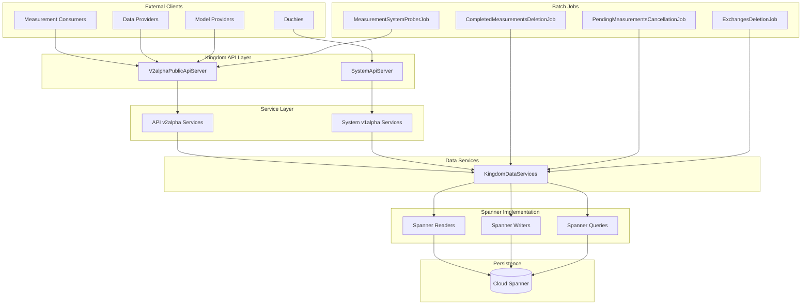

# Kingdom Subsystem Architecture

## 1. System Overview

### Purpose

The Kingdom subsystem is the central coordination component of the Cross-Media Measurement (CMM) system. It manages the lifecycle of privacy-preserving measurements across multiple participating entities.

### Role in the Broader System

The Kingdom acts as the central authority that:

- **Coordinates Multi-Party Computations (MPC)**: Orchestrates secure computations across multiple Duchies (computation nodes)
- **Manages Entity Registration**: Maintains registries of Measurement Consumers, Data Providers, Model Providers, and Duchies
- **Handles Measurement Lifecycle**: Manages the creation, execution, completion, and result delivery of measurements
- **Manages Certificates**: X.509 certificate lifecycle including creation, revocation, and validation
- **Facilitates Data Exchanges**: Coordinates recurring data exchanges between Model Providers and Data Providers

### Key Responsibilities

1. **Measurement Orchestration**: Creating measurements, generating requisitions for data providers, and tracking measurement state
2. **Entity Management**: Registration and lifecycle management of system participants
3. **Certificate Management**: X.509 certificate lifecycle for all entity types
4. **Event Group Management**: Managing collections of measurement events with metadata
5. **Model Management**: Coordinating model suites, lines, releases, rollouts, outages, and shards
6. **System Maintenance**: Automated retention policies and health monitoring via batch jobs

## 2. Architecture Diagram

### High-Level Component Architecture

```mermaid
graph TB
    subgraph "External Clients"
        MC[Measurement Consumers]
        DP[Data Providers]
        DU[Duchies]
        MP[Model Providers]
    end

    subgraph "Kingdom API Layer"
        V2API[V2alphaPublicApiServer]
        SysAPI[SystemApiServer]
    end

    subgraph "Service Layer"
        ApiV2[API v2alpha Services]
        ApiSys[System v1alpha Services]
    end

    subgraph "Data Services"
        DataSvc[KingdomDataServices]
    end

    subgraph "Spanner Implementation"
        Readers[Spanner Readers]
        Writers[Spanner Writers]
        Queries[Spanner Queries]
    end

    subgraph "Persistence"
        Spanner[(Cloud Spanner)]
    end

    subgraph "Batch Jobs"
        DelJob[CompletedMeasurementsDeletionJob]
        CancelJob[PendingMeasurementsCancellationJob]
        ExchJob[ExchangesDeletionJob]
        ProbeJob[MeasurementSystemProberJob]
    end

    MC --> V2API
    DP --> V2API
    MP --> V2API
    DU --> SysAPI

    V2API --> ApiV2
    SysAPI --> ApiSys

    ApiV2 --> DataSvc
    ApiSys --> DataSvc

    DataSvc --> Readers
    DataSvc --> Writers
    DataSvc --> Queries

    Readers --> Spanner
    Writers --> Spanner
    Queries --> Spanner

    DelJob --> DataSvc
    CancelJob --> DataSvc
    ExchJob --> DataSvc
    ProbeJob --> V2API
```

## 3. Key Components

### 3.1 Service Layer

#### Public API v2alpha (`kingdom.service.api.v2alpha`)

External-facing gRPC services for measurement consumers, data providers, and model providers.

**Core Services:**
- **AccountsService**: Account creation, activation, identity management, and OpenID Connect authentication
- **MeasurementsService**: Create, list, cancel, and retrieve measurements with batch operations
- **RequisitionsService**: List, fulfill, and refuse data requisitions
- **DataProvidersService**: Manage data provider capabilities and data availability
- **MeasurementConsumersService**: Register measurement consumers, manage owners
- **CertificatesService**: X.509 certificate lifecycle (create, revoke, release hold)
- **EventGroupsService**: Create, update, delete, and list event groups with batch operations
- **ApiKeysService**: API key generation and deletion
- **ExchangesService / ExchangeStepsService / ExchangeStepAttemptsService**: Coordinate recurring data exchanges
- **EventGroupMetadataDescriptorsService**: Schema definitions for event group metadata
- **PublicKeysService**: Public key management for duchies

**Model Management Services:**
- **ModelProvidersService**: Model provider retrieval
- **ModelSuitesService**: Create, get, and list model suites
- **ModelLinesService**: Create, get, list model lines, set active end time
- **ModelReleasesService**: Create and list model releases
- **ModelRolloutsService**: Create, delete, list rollouts, schedule freeze
- **ModelOutagesService**: Create, delete, and list model outages
- **ModelShardsService**: Create, delete, and list model shards
- **PopulationsService**: Create, get, and list populations

**Protocol Support:**
- Direct (single data provider)
- Liquid Legions V2 (LLv2)
- Reach-Only Liquid Legions V2 (RoLLv2)
- Honest Majority Share Shuffle (HMSS)
- TrusTEE (Trusted Execution Environment)

**Measurement Types:**
- Reach
- Reach and Frequency
- Impression
- Duration
- Population

**Noise Mechanisms:**
- None
- Geometric
- Discrete Gaussian
- Continuous Laplace
- Continuous Gaussian

**Authentication Methods:**
- Account-based: OpenID Connect ID tokens (self-issued)
- API Key-based: Bearer token authentication
- Certificate-based: X.509 certificate verification

#### System API v1alpha (`kingdom.service.system.v1alpha`)

Internal-facing gRPC services for Duchies to participate in computations.

**Core Services:**
- **ComputationsService**: Get computation, stream active computations, set computation result
- **ComputationParticipantsService**: Get participant info, set requisition parameters, confirm/fail participants
- **RequisitionsService**: Fulfill requisitions
- **ComputationLogEntriesService**: Create computation log entries

**Key Features:**
- Streaming API for active computation polling (configurable timeout and throttle)
- Continuation token-based pagination
- Protocol-specific parameter handling

### 3.2 Deployment Layer

#### Common Deployment (`kingdom.deploy.common`)

**Protocol Configuration Components:**
- **DuchyIds**: Maps internal/external Duchy IDs with time-based activation ranges
- **Llv2ProtocolConfig**: Liquid Legions V2 configuration
- **RoLlv2ProtocolConfig**: Reach-Only Liquid Legions V2 configuration
- **HmssProtocolConfig**: Honest Majority Share Shuffle (3-duchy) configuration
- **TrusTeeProtocolConfig**: Trusted Execution Environment configuration

**Server Components:**
- **KingdomDataServer**: Abstract base for internal data layer servers
- **SystemApiServer**: System API v1alpha server daemon
- **V2alphaPublicApiServer**: Public API v2alpha server daemon

**Service Infrastructure:**
- **DataServices**: Interface for building Kingdom internal data layer services
- **KingdomDataServices**: Data class containing all Kingdom internal gRPC service implementations

**Job Components:**
- **CompletedMeasurementsDeletionJob**: Removes completed measurements after configurable TTL
- **PendingMeasurementsCancellationJob**: Cancels stale pending measurements
- **ExchangesDeletionJob**: Deletes expired exchange records
- **MeasurementSystemProberJob**: Continuous health monitoring via test measurements

#### Spanner Deployment (`kingdom.deploy.gcloud.spanner`)

Google Cloud Spanner-based persistence layer.

**Core Pattern: Reader-Writer-Query**
- **Readers**: Execute SELECT queries, transform Spanner rows to protobuf (BaseSpannerReader, SpannerReader)
- **Writers**: Execute INSERT/UPDATE/DELETE within read-write transactions (SpannerWriter, SimpleSpannerWriter)
- **Queries**: Combine readers with filtering, pagination, and streaming (SpannerQuery, SimpleSpannerQuery)

**Service Entry Point:**
- **SpannerDataServices**: Factory for constructing all Kingdom data services with Spanner backend

**Key Reader Implementations:**
- MeasurementReader (with views: DEFAULT, COMPUTATION, COMPUTATION_STATS)
- DataProviderReader
- CertificateReader (supports parent types: DATA_PROVIDER, MEASUREMENT_CONSUMER, DUCHY, MODEL_PROVIDER)
- RequisitionReader
- EventGroupReader
- ComputationParticipantReader
- AccountReader
- And others for model management entities

**Key Writer Implementations:**
- CreateMeasurements
- SetMeasurementResult
- CancelMeasurement
- FulfillRequisition
- CreateCertificate
- RevokeCertificate
- CreateDataProvider
- CreateMeasurementConsumer
- CreateAccount
- And many others for all entity types

**Key Query Implementations:**
- StreamMeasurements
- StreamRequisitions
- StreamEventGroups
- StreamCertificates
- StreamModelLines, StreamModelReleases, StreamModelRollouts
- And others for all streamable entities

### 3.3 Batch Processing (`kingdom.batch`)

Automated maintenance and monitoring jobs.

**CompletedMeasurementsDeletion**
- Deletes measurements in terminal states (SUCCEEDED, FAILED, CANCELLED) after TTL
- Configurable batch size via `maxToDeletePerRpc`
- Supports dry-run mode
- Metric: `wfanet.measurement.retention.deleted_measurements`

**PendingMeasurementsCancellation**
- Cancels measurements stuck in pending states beyond TTL
- Pending states: PENDING_COMPUTATION, PENDING_PARTICIPANT_CONFIRMATION, PENDING_REQUISITION_FULFILLMENT, PENDING_REQUISITION_PARAMS
- Batches cancellations in chunks of 1000 measurements
- Metric: `wfanet.measurement.retention.cancelled_measurements`

**ExchangesDeletion**
- Removes exchange records older than configured days
- Batches deletions in chunks of 1000 exchanges
- Metric: `wfanet.measurement.retention.deleted_exchanges`

**MeasurementSystemProber**
- Creates periodic probe measurements (reach-and-frequency)
- Tracks measurement and requisition completion times
- Metrics: `wfanet.measurement.prober.last_terminal_measurement.timestamp`, `wfanet.measurement.prober.last_terminal_requisition.timestamp`
- Privacy params: epsilon=0.005, delta=1e-15

## 4. Data Flow

### 4.1 Measurement States

**Measurement State Progression:**
- PENDING_REQUISITION_PARAMS
- PENDING_REQUISITION_FULFILLMENT
- PENDING_PARTICIPANT_CONFIRMATION
- PENDING_COMPUTATION
- Terminal states: SUCCEEDED, FAILED, CANCELLED

**Requisition States:**
- PENDING_PARAMS
- UNFULFILLED
- FULFILLED
- REFUSED
- WITHDRAWN

### 4.2 Certificate Validation

Certificates support parent types:
- DATA_PROVIDER
- MEASUREMENT_CONSUMER
- DUCHY
- MODEL_PROVIDER

Certificate validation checks:
- Not yet active (before validity period)
- Expired (past validity period)
- Revocation state

## 5. Exception Handling

The Kingdom uses a structured exception hierarchy via `KingdomInternalException`:

**Validation Exceptions:**
- RequiredFieldNotSetException
- InvalidFieldValueException

**Entity Not Found Exceptions:**
- MeasurementNotFoundException, MeasurementNotFoundByComputationException, MeasurementNotFoundByMeasurementConsumerException
- CertificateNotFoundException (with subclasses for each parent type)
- DataProviderNotFoundException
- MeasurementConsumerNotFoundException
- DuchyNotFoundException
- RequisitionNotFoundException
- ComputationParticipantNotFoundException
- AccountNotFoundException, ApiKeyNotFoundException
- EventGroupNotFoundException
- Model-related: ModelSuiteNotFoundException, ModelLineNotFoundException, ModelReleaseNotFoundException, ModelRolloutNotFoundException, ModelOutageNotFoundException, ModelShardNotFoundException
- PopulationNotFoundException
- Exchange-related: RecurringExchangeNotFoundException, ExchangeNotFoundException, ExchangeStepNotFoundException, ExchangeStepAttemptNotFoundException

**State Validation Exceptions:**
- MeasurementStateIllegalException
- CertificateRevocationStateIllegalException
- ComputationParticipantStateIllegalException
- RequisitionStateIllegalException
- AccountActivationStateIllegalException
- EventGroupStateIllegalException
- DuchyNotActiveException

**ETag Mismatch Exceptions:**
- MeasurementEtagMismatchException
- ComputationParticipantETagMismatchException
- RequisitionEtagMismatchException

## 6. Design Patterns

### 6.1 Reader-Writer-Query Pattern

Separation of concerns for database operations:

- **Readers**: Stateless query execution, row-to-protobuf transformation
- **Writers**: Transaction management with TransactionScope and ResultScope
- **Queries**: Streaming results with filtering and pagination

### 6.2 Abstract Factory Pattern

DataServices interface abstracts service creation:

- **Interface**: `DataServices.buildDataServices(CoroutineContext)`
- **Implementation**: `SpannerDataServices` (Cloud Spanner backend)

### 6.3 Optimistic Concurrency Control

ETags computed from Spanner commit timestamps via `ETags.computeETag(updateTime)`.

### 6.4 Idempotent Operations

- Create operations accept optional request IDs
- Writers check for existing entities by request ID before creating

## 7. Dependencies

### Core Libraries
- `org.wfanet.measurement.internal.kingdom` - Internal Kingdom gRPC services and protobuf definitions
- `org.wfanet.measurement.api.v2alpha` - Public API v2alpha services and types
- `org.wfanet.measurement.system.v1alpha` - System API v1alpha definitions
- `org.wfanet.measurement.common` - Common utilities (identity, crypto, gRPC helpers)
- `org.wfanet.measurement.gcloud.spanner` - Spanner client abstractions

### External Dependencies
- `io.grpc` - gRPC framework
- `com.google.protobuf` - Protocol Buffers
- `com.google.cloud.spanner` - Google Cloud Spanner client
- `kotlinx.coroutines` - Kotlin coroutines
- `io.opentelemetry.api.metrics` - Metrics instrumentation
- `picocli` - Command-line interface framework

## 8. Testing Support

### Testing Utilities (`kingdom.service.internal.testing`)

- **Population**: Test data factory for creating Kingdom entities with realistic relationships
- **SequentialIdGenerator**: Produces sequential identifiers for deterministic tests
- **Abstract Test Suites**: Reusable test classes for all Kingdom services (AccountsServiceTest, MeasurementsServiceTest, CertificatesServiceTest, etc.)

### Spanner Testing (`kingdom.deploy.gcloud.spanner.testing`)

- **KingdomDatabaseTestBase**: Base class for integration tests with Spanner emulator
- **Schemata**: Provides access to Kingdom database schema changelog

### API Testing (`kingdom.service.api.v2alpha.testing`)

- **FakeMeasurementsService**: In-memory service implementation for testing

## 9. Tools

### CreateResource (`kingdom.deploy.tools`)

Command-line tool for creating core Kingdom resources:
- account
- mc-creation-token
- data-provider
- model-provider
- duchy-certificate
- recurring-exchange

### ModelRepository (`kingdom.deploy.tools`)

Command-line tool for managing Model Repository artifacts:
- model-providers (get, list)
- model-suites (create, get, list)
- populations (create, get, list)
- model-lines (create, get, list, set-active-end-time)

### OperationalMetricsExport (`kingdom.deploy.gcloud.job`)

Batch job for exporting operational metrics to BigQuery:
- Streams measurements, requisitions, and computation data
- Supports incremental export with state tracking
- Configurable batch sizes

---

## Summary

The Kingdom subsystem is the central orchestration platform for privacy-preserving cross-media measurements. Key characteristics:

- **Layered Architecture**: Public API v2alpha, System API v1alpha, Internal Data Services, Spanner Persistence
- **Protocol Support**: Direct, LLv2, RoLLv2, HMSS, and TrusTEE protocols
- **Entity Management**: Measurement Consumers, Data Providers, Model Providers, Duchies, Certificates
- **Batch Processing**: Automated retention policies and health monitoring
- **Cloud Spanner Backend**: Reader-Writer-Query pattern with optimistic concurrency
