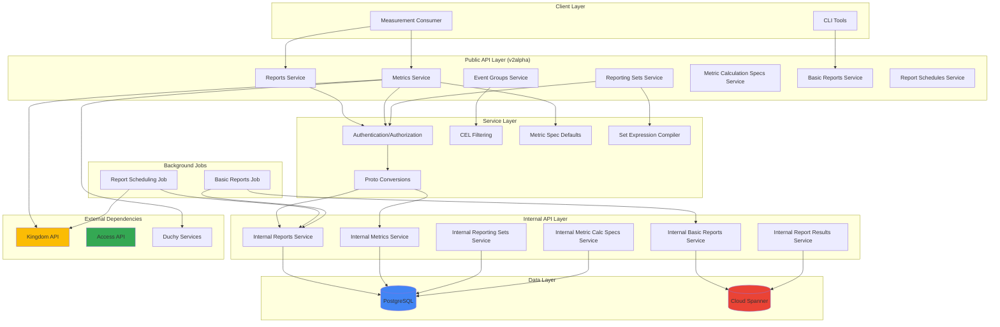
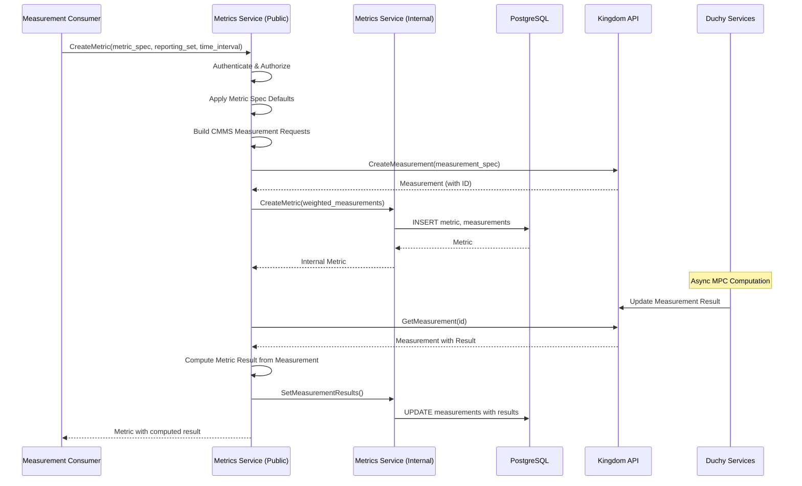
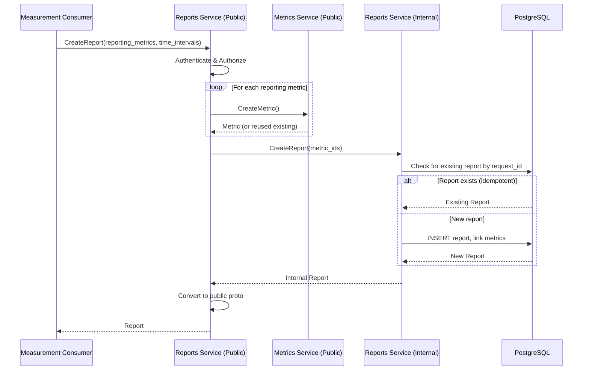
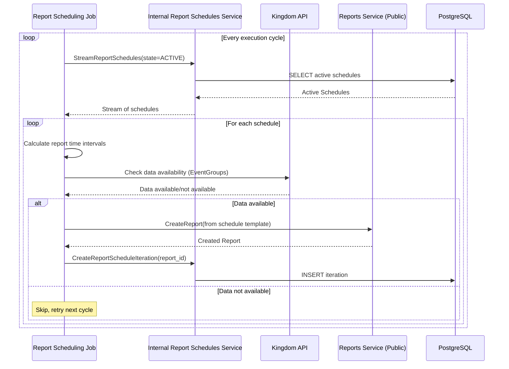
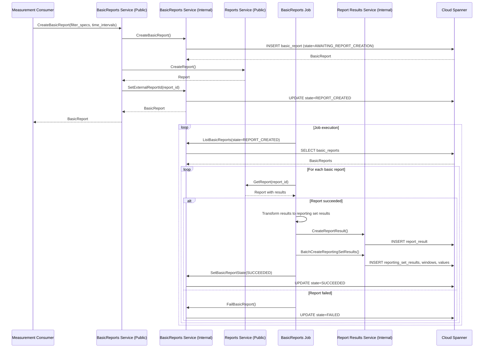

# Reporting Subsystem Architecture

## 1. System Overview

The Reporting subsystem is a core component of the Cross-Media Measurement (CMM) system that provides comprehensive reporting capabilities for privacy-preserving audience measurement and reach/frequency analysis. It enables Measurement Consumers to create, schedule, and retrieve aggregated metrics across multiple Event Data Providers (EDPs) while maintaining differential privacy guarantees.

### Purpose

The Reporting subsystem serves as the abstraction layer between measurement consumers and the underlying secure Multi-Party Computation (MPC) protocols. It:

- **Simplifies Measurement Creation**: Provides high-level APIs for creating metrics and reports without requiring deep knowledge of cryptographic protocols
- **Orchestrates Complex Workflows**: Manages the lifecycle of measurements from creation through computation to result delivery
- **Ensures Privacy Compliance**: Enforces differential privacy constraints and manages noise mechanisms
- **Enables Report Automation**: Supports scheduled recurring reports with configurable frequencies
- **Aggregates Multi-Source Data**: Combines data from multiple event groups and data providers into cohesive reports

### Role in the Broader System

The Reporting subsystem integrates with several other CMM subsystems:

- **Kingdom**: Coordinates with the Kingdom for measurement orchestration, certificate management, and event group metadata
- **Duchy**: Submits measurement requests to Duchies for secure MPC computation
- **Access Control**: Integrates with the Access API for authentication and authorization
- **Event Data Providers**: Retrieves event group metadata and validates data availability

## 2. Architecture Diagram



## 3. Key Components

### 3.1 Deploy Layer (`org.wfanet.measurement.reporting.deploy.v2`)

The deployment layer provides executable servers, job executors, and infrastructure configuration.

#### 3.1.1 Common (`deploy.v2.common`)

**Purpose**: Shared deployment infrastructure and configuration

**Key Classes**:
- `InternalReportingServer`: Main server hosting internal gRPC services
- `V2AlphaPublicApiServer`: Public API server with authentication/authorization
- `DataServices`: Factory for creating all internal service implementations
- `EncryptionKeyPairMap`: Manages encryption keys for Measurement Consumers
- Various flag classes for configuration (InternalApiFlags, KingdomApiFlags, SpannerFlags, V2AlphaFlags)

#### 3.1.2 Server (`deploy.v2.common.server`)

**Purpose**: Server implementations and startup logic

**Key Classes**:
- `AbstractInternalReportingServer`: Base class for internal server implementations
- `V2AlphaPublicServerFlags`: Configuration for public API server

#### 3.1.3 Service (`deploy.v2.common.service`)

**Purpose**: Service factory and common service implementations

**Key Classes**:
- `DataServices.create()`: Creates all internal service instances with dependency injection
- `ImpressionQualificationFiltersService`: Static filter configuration service
- `Services`: Data class containing all service instances

#### 3.1.4 Job (`deploy.v2.common.job`)

**Purpose**: Background job executors

**Key Classes**:
- `ReportSchedulingJobExecutor`: Executes scheduled report creation
- `BasicReportsReportsJobExecutor`: Processes completed basic reports

### 3.2 PostgreSQL Layer (`deploy.v2.postgres`)

**Purpose**: PostgreSQL-backed persistence for core reporting entities

**Key Services**:
- `PostgresMeasurementConsumersService`: Measurement consumer management
- `PostgresMetricsService`: Metric lifecycle management (create, batch create, stream, invalidate)
- `PostgresReportsService`: Report creation with metric reuse optimization
- `PostgresReportingSetsService`: Reporting set management (primitive and composite)
- `PostgresMetricCalculationSpecsService`: Metric calculation specification management
- `PostgresReportSchedulesService`: Recurring report schedule management
- `PostgresReportScheduleIterationsService`: Schedule iteration tracking
- `PostgresMeasurementsService`: Measurement batch operations

**Readers** (under `readers/`):
- `MeasurementConsumerReader`: Query measurement consumers
- `MetricReader`: Query metrics with complex filters
- `ReportReader`: Query reports with joins
- `ReportingSetReader`: Query reporting sets
- `MetricCalculationSpecReader`: Query metric calculation specs
- `ReportScheduleReader`: Query report schedules
- `ReportScheduleIterationReader`: Query schedule iterations
- `EventGroupReader`: Query event groups
- `MeasurementReader`: Query measurements

**Writers** (under `writers/`):
- `CreateMeasurementConsumer`: Insert measurement consumer
- `CreateMetrics`: Insert metrics with weighted measurements
- `CreateReport`: Insert report with metric reuse
- `CreateReportingSet`: Insert reporting set (primitive or composite)
- `CreateMetricCalculationSpec`: Insert metric calculation spec
- `CreateReportSchedule`: Insert report schedule
- `CreateReportScheduleIteration`: Insert schedule iteration
- `InvalidateMetric`: Mark metric as invalid
- `SetCmmsMeasurementIds`: Assign CMMS measurement IDs
- `SetMeasurementResults`: Update measurement results
- `SetMeasurementFailures`: Record measurement failures
- `StopReportSchedule`: Stop active schedule
- `SetReportScheduleIterationState`: Update iteration state

### 3.3 Cloud Spanner Layer (`deploy.v2.gcloud.spanner`)

**Purpose**: Cloud Spanner-backed persistence for BasicReports and advanced reporting features

**Key Services**:
- `SpannerBasicReportsService`: BasicReport lifecycle management
- `SpannerReportResultsService`: Report results and reporting set results management

**Database Operations** (under `db/`):
- `BasicReports`: BasicReport CRUD operations with state transitions
- `ReportResults`: ReportResult storage and retrieval
- `ReportingSetResults`: Reporting set dimensional results
- `ReportingWindowResults`: Temporal window management
- `NoisyReportResultValues`: Unprocessed metric values
- `ReportResultValues`: Processed/denoised metric values
- `MeasurementConsumers`: Measurement consumer tracking

**Utilities**:
- `BasicReportProcessedResultsTransformation`: Transforms reporting set results into result groups for BasicReports

### 3.4 Service API Layer (`service.api.v2alpha`)

**Purpose**: Public v2alpha gRPC service implementations

**Core Services**:
- `MetricsService`: Creates metrics, orchestrates measurements, computes metric results
- `ReportsService`: Creates reports with multiple metrics
- `ReportingSetsService`: Manages reporting sets (primitive and composite)
- `MetricCalculationSpecsService`: Manages metric calculation specifications
- `ReportSchedulesService`: Manages recurring report schedules
- `ReportScheduleIterationsService`: Lists schedule iterations
- `BasicReportsService`: Simplified reporting API
- `EventGroupsService`: Lists and filters event groups with CEL
- `EventGroupMetadataDescriptorsService`: Retrieves event metadata descriptors
- `DataProvidersService`: Retrieves data provider information
- `ModelLinesService`: Enumerates valid model lines
- `ImpressionQualificationFiltersService`: Manages impression qualification filters

**Utilities**:
- `ProtoConversions`: Converts between public and internal proto representations
- `MetricSpecDefaults`: Applies default values to metric specifications from config
- `SetExpressionCompiler`: Compiles set expressions into weighted subset unions
- `CelFilteringMethods`: CEL-based filtering for event groups
- `ReportScheduleInfoServerInterceptor`: Extracts report schedule context from metadata

**Resource Keys**:
- `MetricKey`, `ReportKey`, `ReportingSetKey`, `MetricCalculationSpecKey`, `ReportScheduleKey`, `ReportScheduleIterationKey`, `BasicReportKey`, `EventGroupKey`, `ImpressionQualificationFilterKey`

### 3.5 Service Internal Layer (`service.internal`)

**Purpose**: Internal service utilities and error handling

**Key Components**:
- `GroupingDimensions`: Manages event grouping dimensions and fingerprinting
- `Normalization`: Normalizes event filters and computes fingerprints
- `Errors`: Error domain, reasons, and metadata definitions
- `ServiceException`: Base class for structured exceptions
- `ReportingInternalException`: Legacy exception base class
- `ImpressionQualificationFilterMapping`: Maps and validates filter configurations

### 3.6 Job Layer (`job`)

**Purpose**: Background job implementations

**Key Jobs**:
- `ReportSchedulingJob`: Polls active report schedules, validates data availability, creates reports when ready
- `BasicReportsReportsJob`: Retrieves basic reports with state REPORT_CREATED, processes results, transforms into structured report results

### 3.7 Post-Processing Layer (`postprocessing.v2alpha`)

**Purpose**: Report post-processing and correction

**Key Components**:
- `ReportProcessor`: Interface for correcting inconsistent measurements
- `ReportProcessor.Default`: Python-based correction implementation
- `NoOpReportProcessor`: No-operation processor for testing
- `ReportConversion`: Utility functions for converting and parsing report data
- `GcsStorageFactory`: Creates GCS storage clients for logging

## 4. Data Flow

### 4.1 Metric Creation Flow



### 4.2 Report Creation Flow



### 4.3 Report Scheduling Flow



### 4.4 BasicReport Processing Flow



## 5. Integration Points

### 5.1 Kingdom API Integration

The Reporting subsystem heavily relies on the Kingdom for:

- **Measurement Orchestration**: Creating and managing CMMS measurements through the Measurements API
- **Event Group Management**: Retrieving event group metadata, validating data availability
- **Data Provider Information**: Getting data provider details
- **Certificate Management**: Accessing certificates for encryption and signing
- **Model Line Validation**: Validating VID model lines for time intervals

**Key Interactions**:
- `MetricsService` → Kingdom Measurements API (create measurements, retrieve results)
- `EventGroupsService` → Kingdom EventGroups API (list, filter event groups)
- `ModelLinesService` → Kingdom ModelLines API (enumerate valid model lines)
- `ReportSchedulingJob` → Kingdom EventGroups API (check data availability)

### 5.2 Access API Integration

Authentication and authorization are handled through the Access API:

- **Authentication**: OpenID Connect (OIDC) integration via `PrincipalAuthInterceptor`
- **Authorization**: Policy-based authorization checks for all public API operations
- **Certificate Validation**: Authority key identifier to principal mapping

**Integration Pattern**:
```kotlin
val authClient = Authorization.forServices(accessApiChannel)
// Used in all public service implementations
service.withAuthorization(authClient, principalName)
```

### 5.3 Duchy Integration

The Reporting subsystem does not directly communicate with Duchy services. Instead:

1. Reports creates measurements through Kingdom API
2. Kingdom coordinates with Duchies for MPC computation
3. Duchies update measurement results in Kingdom
4. Reports polls Kingdom for measurement completion and retrieves results

### 5.4 Event Data Provider (EDP) Integration

Indirect integration through Kingdom:

- Event group metadata encrypted with EDP public keys
- Reporting subsystem decrypts metadata using MC private keys
- Data availability validation through Kingdom EventGroups API

## 6. Design Patterns

### 6.1 Repository Pattern

The PostgreSQL layer implements a clear repository pattern with separate readers and writers:

**Reader Classes**: Query operations, streaming, batch retrieval
**Writer Classes**: Transactional write operations with database clients

Example:
```kotlin
// Reader
MetricReader.readMetricsByRequestId(measurementConsumerId, requestIds): Flow<Result>

// Writer
CreateMetrics(request).execute(client, idGenerator): List<Metric>
```

### 6.2 Service Layer Pattern

Three-tier service architecture:

1. **Public API Layer** (`service.api.v2alpha`): Exposes gRPC services, handles auth, validation, proto conversion
2. **Internal API Layer** (`deploy.v2.postgres`, `deploy.v2.gcloud.spanner`): gRPC services backed by persistence
3. **Data Access Layer** (`readers`, `writers`, `db`): Direct database operations

### 6.3 Factory Pattern

`DataServices.create()` factory method creates all service instances with dependency injection:

```kotlin
val services = DataServices.create(
  idGenerator = idGenerator,
  postgresClient = postgresClient,
  spannerClient = spannerClient,
  impressionQualificationFilterMapping = mapping,
  eventMessageDescriptor = descriptor,
  disableMetricsReuse = false,
  coroutineContext = coroutineContext
)
```

### 6.4 Strategy Pattern

Report processing uses strategy pattern via `ReportProcessor` interface:

- `ReportProcessor.Default`: Python-based correction library
- `NoOpReportProcessor`: Pass-through for testing

### 6.5 Builder Pattern

Protobuf builders used extensively with Kotlin DSL:

```kotlin
val metric = metric {
  cmmsMeasurementConsumerId = "consumers/123"
  externalReportingSetId = "sets/456"
  timeInterval = interval {
    startTime = timestamp { seconds = 1640000000 }
    endTime = timestamp { seconds = 1640086400 }
  }
}
```

### 6.6 Adapter Pattern

`LegacyIdGeneratorAdapter` adapts new `IdGenerator` to legacy `LegacyIdGenerator` interface:

```kotlin
private class LegacyIdGeneratorAdapter(idGenerator: IdGenerator) : LegacyIdGenerator {
  override fun generateInternalId() = InternalId(idGenerator.generateInternalId())
  override fun generateExternalId() = ExternalId(idGenerator.generateExternalId())
}
```

### 6.7 Chain of Responsibility

gRPC interceptors form a chain:

1. `PrincipalAuthInterceptor`: Authenticates principal from OIDC
2. `AuthorizationServerInterceptor`: Checks permissions via Access API
3. `ReportScheduleInfoServerInterceptor`: Extracts report schedule metadata
4. Service implementation handlers

### 6.8 Command Pattern

Writer classes encapsulate database operations as commands:

```kotlin
CreateReport(request).execute(client, idGenerator)
InvalidateMetric(request).execute(client, idGenerator)
```

### 6.9 Observer Pattern (Implicit)

Background jobs act as observers:

- `ReportSchedulingJob`: Observes active report schedules, triggers report creation
- `BasicReportsReportsJob`: Observes basic reports in REPORT_CREATED state, processes results

### 6.10 Fingerprinting and Normalization

`Normalization` object provides deterministic fingerprinting:

```kotlin
val normalized = Normalization.normalizeEventFilters(eventFilters)
val fingerprint = Normalization.computeFingerprint(normalized)
```

Used for:
- Metric reuse optimization
- Grouping dimension mapping
- Filter deduplication

## 7. Technology Stack

### 7.1 Core Technologies

| Technology | Usage | Location |
|------------|-------|----------|
| **Kotlin** | Primary programming language | All source code |
| **gRPC** | RPC framework for service communication | All service layers |
| **Protocol Buffers** | Data serialization and API definitions | `/src/main/proto` |
| **Coroutines** | Asynchronous programming | All async operations |
| **Flow API** | Reactive streams | Database readers, streaming APIs |

### 7.2 Database Technologies

| Technology | Usage | Data Stored |
|------------|-------|-------------|
| **PostgreSQL** | Primary relational database | Metrics, Reports, ReportingSets, MetricCalculationSpecs, ReportSchedules, Measurements, MeasurementConsumers |
| **R2DBC** | Reactive database client for Postgres | All Postgres operations |
| **Cloud Spanner** | Distributed SQL database | BasicReports, ReportResults, ReportingSetResults, ReportingWindowResults, NoisyReportResultValues, ReportResultValues |
| **Liquibase** | Database schema migration | Schema versioning |

### 7.3 Infrastructure and Deployment

| Technology | Usage |
|------------|-------|
| **Bazel** | Build system |
| **Docker** | Containerization |
| **Kubernetes (GKE)** | Container orchestration |
| **Terraform** | Infrastructure as code |

### 7.4 Security and Cryptography

| Technology | Usage |
|------------|-------|
| **TLS/mTLS** | Transport layer security for all gRPC channels |
| **OpenID Connect** | Authentication protocol |
| **Tink** | Cryptographic library for encryption/signing |
| **X.509 Certificates** | PKI for identity and encryption |

### 7.5 Libraries and Frameworks

| Library | Purpose |
|---------|---------|
| **PicoCLI** | Command-line parsing |
| **Guava** | Utility libraries (hashing, collections) |
| **Caffeine** | In-memory caching |
| **Gson** | JSON serialization |
| **CEL (Common Expression Language)** | Event group filtering |
| **JUnit** | Unit testing framework |
| **Truth** | Assertion library |
| **Mockito/MockK** | Mocking framework |

### 7.6 External Services

| Service | Integration |
|---------|-------------|
| **Google Cloud Storage** | Report post-processing logs |
| **Stackdriver/Cloud Logging** | Application logging |
| **Cloud Monitoring** | Metrics and alerting |

### 7.7 API Versions

| API | Version | Purpose |
|-----|---------|---------|
| **Public Reporting API** | v2alpha | External client-facing API |
| **Internal Reporting API** | v2 | Internal data-layer API |
| **Kingdom API** | v2alpha | Cross-system integration |
| **Access API** | v1alpha | Authorization |

### 7.8 Data Processing

| Technology | Purpose |
|------------|---------|
| **Python** | Report post-processing and correction (via JNI) |
| **Statistics Libraries** | Variance and statistical calculations |

### 7.9 Development Tools

| Tool | Purpose |
|------|---------|
| **ktfmt** | Kotlin code formatting |
| **detekt** | Static code analysis |
| **buf** | Protocol buffer linting and breaking change detection |

## 8. Key Architectural Decisions

### 8.1 Dual Database Architecture

**Decision**: Use PostgreSQL for core entities and Cloud Spanner for BasicReports

**Rationale**:
- PostgreSQL provides strong transactional guarantees for core reporting entities
- Cloud Spanner offers horizontal scalability and global distribution for large-scale BasicReports results
- Separation allows independent scaling of core reporting and advanced analytics features

### 8.2 Metric Reuse Optimization

**Decision**: Reuse existing metrics when creating reports with identical specifications

**Rationale**:
- Reduces duplicate MPC computations
- Improves report creation performance
- Minimizes resource consumption across Duchy network

**Implementation**: `CreateReport` writer checks for existing metrics by fingerprinting metric specifications

### 8.3 Fingerprinting for Deduplication

**Decision**: Use FarmHash fingerprints for normalized event filters and grouping dimensions

**Rationale**:
- Enables efficient deduplication and lookups
- Provides deterministic hashing for identical semantic structures
- Supports metric reuse and grouping dimension mapping

### 8.4 In-Process gRPC Servers for Jobs

**Decision**: Background jobs use in-process gRPC servers for MetricsService and ReportsService

**Rationale**:
- Maintains clean separation between job logic and service implementations
- Enables code reuse without direct dependencies
- Simplifies testing with standard gRPC patterns

### 8.5 Layered Service Architecture

**Decision**: Three-tier service architecture (Public API, Internal API, Data Access)

**Rationale**:
- Separation of concerns between API contract, business logic, and persistence
- Enables independent evolution of API versions
- Facilitates testing at each layer

### 8.6 Coroutine-Based Asynchronous I/O

**Decision**: Use Kotlin coroutines and Flow API for all async operations

**Rationale**:
- Better resource utilization with non-blocking I/O
- Improved scalability for concurrent requests
- Cleaner code compared to callback-based approaches

### 8.7 Configuration-Based Impression Qualification Filters

**Decision**: Impression qualification filters loaded from static configuration files

**Rationale**:
- Filters are relatively static and don't require frequent updates
- Avoids database roundtrips for filter lookups
- Simplifies validation against event message descriptors

### 8.8 State Machine for BasicReports

**Decision**: BasicReports follow explicit state machine: AWAITING_REPORT_CREATION → REPORT_CREATED → UNPROCESSED_RESULTS_READY → SUCCEEDED/FAILED

**Rationale**:
- Provides clear lifecycle tracking
- Enables idempotent state transitions
- Facilitates debugging and monitoring

## 9. Security Considerations

### 9.1 Authentication

- OpenID Connect (OIDC) for principal authentication
- mTLS for service-to-service communication
- API keys for measurement consumer credentials

### 9.2 Authorization

- Policy-based access control via Access API
- Resource-level permissions checked on all operations
- Principal mapping from certificate authority key identifiers

### 9.3 Encryption

- Event group metadata encrypted with MC public keys
- Private keys stored securely and loaded from disk
- Measurement requests signed with MC private signing keys

### 9.4 Privacy

- Differential privacy enforced on all metrics
- Noise mechanisms (GAUSSIAN, DISCRETE_GAUSSIAN) configured per metric
- Privacy budget tracking via PrivacyBudgetManager (external)

## 10. Scalability and Performance

### 10.1 Horizontal Scaling

- Stateless public API servers can scale horizontally
- Background jobs can run multiple instances with coordination
- Database connection pools configured per deployment

### 10.2 Caching

- Certificate caching with configurable expiration (default: 60 minutes)
- Data provider caching with configurable expiration (default: 60 minutes)
- Event group metadata descriptor caching

### 10.3 Batch Operations

- `BatchCreateMetrics`: Create up to 1000 metrics in single request
- `BatchGetMetrics`: Retrieve multiple metrics efficiently
- `BatchCreateReportingSetResults`: Create multiple reporting set results atomically

### 10.4 Streaming APIs

- `StreamMetrics`: Stream metrics with pagination
- `StreamReports`: Stream reports with filters
- `StreamReportingSets`: Stream reporting sets by measurement consumer

### 10.5 Database Optimizations

- Read replicas supported via separate reader/writer split
- Indexes on frequently queried columns (external IDs, CMMS IDs, states)
- Connection pooling with R2DBC

## 11. Testing Strategy

### 11.1 Unit Tests

- Service implementation tests extending abstract base classes
- Proto conversion tests
- Utility function tests (normalization, fingerprinting, CEL filtering)

### 11.2 Integration Tests

- Database integration tests with test containers
- gRPC service integration tests
- End-to-end workflow tests

### 11.3 Test Utilities

- `ResourceCreationMethods`: Helper functions for creating test resources
- Abstract test base classes for service implementations
- In-memory test databases (H2, Spanner emulator)

## 12. Monitoring and Observability

### 12.1 Logging

- Structured logging with context propagation
- Verbose gRPC logging flag for debugging
- Error logs with structured error information

### 12.2 Metrics

- gRPC request/response metrics
- Database query performance metrics
- Job execution metrics

### 12.3 Tracing

- Distributed tracing via OpenTelemetry
- Request ID propagation through gRPC metadata

## 13. Future Enhancements

### 13.1 Planned Features

- Enhanced post-processing algorithms for report correction
- Additional metric types (watch time, view-through rate)
- Advanced filtering capabilities with complex CEL expressions
- Report templating and customization

### 13.2 Technical Debt

- Migration from legacy error codes to structured error reasons
- Consolidation of dual database architecture if possible
- Improved metric reuse heuristics
- Performance optimization for large-scale report schedules

## 14. References

- [Kingdom API Documentation](../org.wfanet.measurement.kingdom.deploy.gcloud.spanner.md)
- [Access API Documentation](../org.wfanet.measurement.access.deploy.gcloud.spanner.md)
- [Duchy Deployment Guide](../gke/duchy-deployment.md)
- [Reporting v2 Server Deployment Guide](../gke/reporting-v2-server-deployment.md)
- [Protocol Buffer Definitions](../../src/main/proto/wfa/measurement/reporting/)
