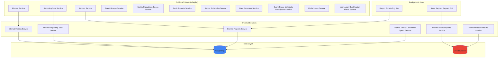

# Reporting Subsystem Architecture

## 1. System Overview

The Reporting subsystem provides reporting capabilities for the Cross-Media Measurement (CMM) system. It enables Measurement Consumers to create reports, metrics, and reporting sets with support for scheduled recurring reports.

### Role in the Broader System

The Reporting subsystem integrates with:

- **Kingdom**: Retrieves event group metadata, data provider information, and model lines through Kingdom API
- **Access API**: Authentication and authorization through the Access API v1alpha

## 2. Architecture Diagram

```mermaid
graph TB
    subgraph "Public API Layer (v2alpha)"
        RAPI[Reports Service]
        MAPI[Metrics Service]
        RSAPI[Reporting Sets Service]
        EGAPI[Event Groups Service]
        MCSAPI[Metric Calculation Specs Service]
        BRAPI[Basic Reports Service]
        SCHAPI[Report Schedules Service]
        DPAPI[Data Providers Service]
        EGMDAPI[Event Group Metadata Descriptors Service]
        MLAPI[Model Lines Service]
        IQFAPI[Impression Qualification Filters Service]
    end

    subgraph "Internal Services"
        IMAPI[Internal Metrics Service]
        IRSAPI[Internal Reporting Sets Service]
        IRAPI[Internal Reports Service]
        IMCAPI[Internal Metric Calculation Specs Service]
        IBRAPI[Internal Basic Reports Service]
        IRRAPI[Internal Report Results Service]
    end

    subgraph "Data Layer"
        POSTGRES[(PostgreSQL)]
        SPANNER[(Cloud Spanner)]
    end

    subgraph "Background Jobs"
        SCHEDJOB[Report Scheduling Job]
        BRJOB[Basic Reports Reports Job]
    end

    RAPI --> IRAPI
    MAPI --> IMAPI
    RSAPI --> IRSAPI

    IMAPI --> POSTGRES
    IRSAPI --> POSTGRES
    IRAPI --> POSTGRES
    IMCAPI --> POSTGRES

    IBRAPI --> SPANNER
    IRRAPI --> SPANNER

    SCHEDJOB --> IRAPI
    BRJOB --> IBRAPI

    style POSTGRES fill:#4285f4
    style SPANNER fill:#ea4335
```

## 3. Key Components

### 3.1 Deploy Layer (`org.wfanet.measurement.reporting.deploy.v2`)

#### 3.1.1 Common (`deploy.v2.common`)

Shared deployment infrastructure and configuration.

**Key Classes**:
- `EncryptionKeyPairMap`: Manages encryption key pairs for MeasurementConsumers by loading public/private key pairs from disk
- `InternalApiFlags`: Defines connection parameters for the Reporting internal API server
- `KingdomApiFlags`: Defines connection parameters for the Kingdom public API server
- `ReportingApiServerFlags`: Configuration flags for Reporting API servers including access control and caching
- `SpannerFlags`: Command-line flags for connecting to Google Cloud Spanner database
- `V2AlphaFlags`: Configuration flags specific to V2Alpha API version
- `EventMessageFlags`: Provides command-line flags for configuring event message descriptors

#### 3.1.2 Server (`deploy.v2.common.server`)

**Key Classes**:
- `AbstractInternalReportingServer`: Abstract base class for internal reporting server implementations with configurable database backends
- `InternalReportingServer`: Concrete implementation using PostgreSQL and optionally Cloud Spanner
- `V2AlphaPublicApiServer`: Public API server exposing Reporting v2alpha gRPC services with authentication and authorization
- `V2AlphaPublicServerFlags`: Command-line flags for V2AlphaPublicApiServer configuration

**V2AlphaPublicApiServer Key Services Exposed**:
- DataProvidersService
- EventGroupsService
- EventGroupMetadataDescriptorsService
- MetricsService
- ReportsService
- ReportingSetsService
- ReportSchedulesService
- ReportScheduleIterationsService
- MetricCalculationSpecsService
- BasicReportsService
- ModelLinesService

#### 3.1.3 Service (`deploy.v2.common.service`)

**Key Classes**:
- `DataServices`: Factory object that creates all internal gRPC service implementations with dependency injection
- `ImpressionQualificationFiltersService`: Internal service that provides impression qualification filters based on static configuration mapping
- `Services`: Container for all instantiated reporting service implementations

**DataServices.create() Returns**:
- MeasurementConsumersService
- MeasurementsService
- MetricsService
- ReportingSetsService
- ReportsService
- ReportSchedulesService
- ReportScheduleIterationsService
- MetricCalculationSpecsService
- BasicReportsService (optional, requires Spanner)
- ImpressionQualificationFiltersService (optional)
- ReportResultsService (optional, requires Spanner)

#### 3.1.4 Job (`deploy.v2.common.job`)

**Key Classes**:
- `ReportSchedulingJobExecutor`: Command-line application that executes scheduled report generation tasks
- `BasicReportsReportsJobExecutor`: Command-line application that polls reports associated with BasicReports to verify completion

### 3.2 PostgreSQL Layer (`deploy.v2.postgres`)

PostgreSQL-backed persistence for core reporting entities.

**Key Services**:
- `PostgresMeasurementConsumersService`: Measurement consumer management
- `PostgresMeasurementsService`: Batch operations for measurement lifecycle
- `PostgresMetricsService`: Metric lifecycle management (create, batch create, stream, invalidate)
- `PostgresReportsService`: Report creation with metric reuse support
- `PostgresReportingSetsService`: Reporting set management (primitive and composite)
- `PostgresMetricCalculationSpecsService`: Metric calculation specification management
- `PostgresReportSchedulesService`: Recurring report schedule management
- `PostgresReportScheduleIterationsService`: Schedule iteration tracking

**Readers**:
- `MeasurementConsumerReader`: Queries measurement consumer entities by CMMS ID
- `MetricReader`: Queries metric entities with complex relationships to measurements
- `ReportReader`: Queries report entities with complex joins
- `ReportingSetReader`: Queries reporting set entities including batch operations
- `MetricCalculationSpecReader`: Queries metric calculation specifications
- `ReportScheduleReader`: Reads ReportSchedule entities with latest iteration information
- `ReportScheduleIterationReader`: Reads ReportScheduleIteration entities
- `EventGroupReader`: Queries event group ID mappings
- `MeasurementReader`: Queries measurement entities

**Writers**:
- `CreateMeasurementConsumer`: Inserts measurement consumer into database
- `CreateMetrics`: Inserts metrics with weighted measurements
- `CreateReport`: Inserts report with metric reuse optimization
- `CreateReportingSet`: Inserts primitive or composite reporting set
- `CreateMetricCalculationSpec`: Inserts metric calculation specification
- `CreateReportSchedule`: Inserts report schedule with validation
- `CreateReportScheduleIteration`: Inserts report schedule iteration
- `InvalidateMetric`: Updates metric state to INVALID
- `SetCmmsMeasurementIds`: Assigns CMMS measurement IDs to existing measurements
- `SetMeasurementResults`: Updates measurements with computation results
- `SetMeasurementFailures`: Records failure states for measurements
- `StopReportSchedule`: Transitions active report schedule to stopped state
- `SetReportScheduleIterationState`: Updates iteration state

### 3.3 Cloud Spanner Layer (`deploy.v2.gcloud.spanner`)

Cloud Spanner-backed persistence for BasicReports and report results.

**Key Services**:
- `SpannerBasicReportsService`: BasicReport lifecycle management
- `SpannerReportResultsService`: Report results and reporting set results management

**Database Operations** (under `db/`):
- `BasicReports`: BasicReport CRUD operations with state transitions
- `ReportResults`: ReportResult storage and retrieval
- `ReportingSetResults`: Reporting set dimensional results
- `ReportingWindowResults`: Temporal window management
- `NoisyReportResultValues`: Unprocessed metric values
- `ReportResultValues`: Processed metric values
- `MeasurementConsumers`: Measurement consumer tracking

**Utilities**:
- `BasicReportProcessedResultsTransformation`: Transforms ReportingSetResults into ResultGroups for BasicReports

### 3.4 Service API Layer (`service.api.v2alpha`)

Public v2alpha gRPC service implementations.

**Core Services**:
- `MetricsService`: Creates metrics, handles state transitions
- `ReportsService`: Creates reports with reporting metrics
- `ReportingSetsService`: Manages reporting sets (primitive and composite)
- `MetricCalculationSpecsService`: Manages metric calculation specifications
- `ReportSchedulesService`: Manages recurring report schedules
- `ReportScheduleIterationsService`: Lists schedule iterations
- `BasicReportsService`: BasicReport creation and management
- `EventGroupsService`: Lists event groups with metadata decryption and CEL filtering
- `EventGroupMetadataDescriptorsService`: Retrieves event metadata descriptors
- `DataProvidersService`: Retrieves data provider information
- `ModelLinesService`: Enumerates valid model lines
- `ImpressionQualificationFiltersService`: Manages impression qualification filters

**Utilities**:
- `ProtoConversions`: Converts between public and internal proto representations
- `MetricSpecDefaults`: Applies default values to metric specifications from config
- `SetExpressionCompiler`: Compiles set expressions into weighted subset unions
- `CelFilteringMethods`: CEL-based filtering utilities
- `ReportScheduleInfoServerInterceptor`: gRPC interceptor for extracting report schedule context

**Resource Keys**:
- `MetricKey`, `ReportKey`, `ReportingSetKey`, `MetricCalculationSpecKey`, `ReportScheduleKey`, `ReportScheduleIterationKey`, `BasicReportKey`, `EventGroupKey`, `ImpressionQualificationFilterKey`

### 3.5 Service Internal Layer (`service.internal`)

Internal service utilities and error handling.

**Key Components**:
- `GroupingDimensions`: Manages event message grouping dimensions and generates fingerprint mappings
- `Normalization`: Provides normalization and fingerprinting utilities for event filters and grouping dimensions
- `Errors`: Defines error domains, reasons, and metadata keys for reporting service exceptions
- `ServiceException`: Sealed base class for reporting service exceptions
- `ReportingInternalException`: Sealed base class for legacy internal reporting exceptions
- `ImpressionQualificationFilterMapping`: Maps and validates impression qualification filter configurations

### 3.6 Job Layer (`job`)

Background job implementations.

**Key Jobs**:
- `ReportSchedulingJob`: Processes active report schedules and creates reports when data is available
- `BasicReportsReportsJob`: Retrieves basic reports with state REPORT_CREATED and processes results

### 3.7 Post-Processing Layer (`postprocessing.v2alpha`)

Report post-processing capabilities.

**Key Components**:
- `ReportProcessor`: Interface for correcting inconsistent measurements in serialized Report objects
- `ReportProcessor.Default`: Default implementation using correction libraries
- `NoOpReportProcessor`: No-operation implementation that returns reports unchanged
- `ReportConversion`: Utility functions for converting and parsing report data
- `GcsStorageFactory`: Implementation of StorageFactory for Google Cloud Storage

### 3.8 CLI Tools (`service.api.v2alpha.tools`)

Command-line interface for interacting with the Reporting API v2alpha.

**Main Command**:
- `Reporting`: Main entry point with subcommands for reporting-sets, reports, metric-calculation-specs, event-groups, data-providers, event-group-metadata-descriptors, and metrics

## 4. Design Patterns

### 4.1 Repository Pattern

The PostgreSQL layer implements readers and writers:

**Reader Classes**: Query operations with database context
**Writer Classes**: Transactional write operations extending `PostgresWriter`

### 4.2 Factory Pattern

`DataServices.create()` factory method creates all service instances with dependency injection.

### 4.3 Adapter Pattern

`LegacyIdGeneratorAdapter` bridges new `IdGenerator` interface to legacy `LegacyIdGenerator` interface, wrapping generated IDs in `InternalId` and `ExternalId` types.

### 4.4 Conditional Service Instantiation

`DataServices.create()` conditionally creates Spanner-backed services (`basicReportsService`, `impressionQualificationFiltersService`, `reportResultsService`) only when all required dependencies are present.

### 4.5 Config-Based Implementation

`ImpressionQualificationFiltersService` implements gRPC service methods by delegating to an immutable `ImpressionQualificationFilterMapping` configuration object.

## 5. Database Architecture

### 5.1 PostgreSQL

Stores core entities:
- Measurement Consumers
- Metrics
- Reports
- Reporting Sets
- Report Schedules
- Report Schedule Iterations
- Metric Calculation Specs
- Measurements

### 5.2 Cloud Spanner

Stores BasicReports functionality (when enabled):
- BasicReports
- ReportResults
- ReportingSetResults
- ReportingWindowResults
- NoisyReportResultValues
- ReportResultValues
- MeasurementConsumers

### 5.3 Configuration Modes

**Standard Mode** (basicReportsEnabled = false):
- Uses only PostgreSQL for all data storage
- No Spanner connection required

**BasicReports Mode** (basicReportsEnabled = true):
- Uses PostgreSQL for core entities
- Uses Spanner for BasicReports and ReportResults
- Requires impression qualification filter configuration
- Requires event message descriptor configuration

## 6. Dependencies

### 6.1 Internal Dependencies
- `org.wfanet.measurement.api.v2alpha` - Kingdom API protobuf stubs
- `org.wfanet.measurement.internal.reporting.v2` - Internal reporting API protobuf stubs
- `org.wfanet.measurement.reporting.v2alpha` - Public reporting API v2alpha protobuf stubs
- `org.wfanet.measurement.access.client.v1alpha` - Access control authorization client
- `org.wfanet.measurement.config.reporting` - Configuration protobuf definitions
- `org.wfanet.measurement.common.db.r2dbc.postgres` - PostgreSQL database client
- `org.wfanet.measurement.gcloud.spanner` - Google Cloud Spanner database connector

### 6.2 External Dependencies
- `io.grpc` - gRPC framework
- `com.google.protobuf` - Protocol buffer support
- `org.projectnessie.cel` - Common Expression Language
- `picocli` - Command-line parsing framework
- `kotlinx.coroutines` - Kotlin coroutines
- `com.google.cloud.storage` - Google Cloud Storage integration

## 7. Testing

### 7.1 Test Utilities

**Postgres Testing** (`deploy.v2.postgres.testing`):
- `Schemata`: Provides access to Liquibase changelog file (changelog-v2.yaml)

**Spanner Testing** (`deploy.v2.gcloud.spanner.testing`):
- `Schemata`: Provides access to Spanner schema changelog

### 7.2 Abstract Test Classes (`service.internal.testing.v2`)

- `MeasurementConsumersServiceTest`
- `MeasurementsServiceTest`
- `MetricCalculationSpecsServiceTest`
- `ReportScheduleIterationsServiceTest`
- `ReportSchedulesServiceTest`
- `ReportsServiceTest`
- `ReportingSetsServiceTest`
- `BasicReportsServiceTest`
- `ImpressionQualificationFiltersServiceTest`
- `ReportResultsServiceTest`
- `MetricsServiceTest`

**Test Utilities**:
- `ResourceCreationMethods`: Provides suspend functions for creating test resources

## 8. Error Handling

### 8.1 Error Domain
`internal.reporting.halo-cmm.org`

### 8.2 Service Exceptions
- `MeasurementConsumerNotFoundException`
- `BasicReportNotFoundException`
- `BasicReportAlreadyExistsException`
- `BasicReportStateInvalidException`
- `ReportResultNotFoundException`
- `ReportingSetResultNotFoundException`
- `ReportingWindowResultNotFoundException`
- `RequiredFieldNotSetException`
- `ImpressionQualificationFilterNotFoundException`
- `InvalidFieldValueException`
- `MetricNotFoundException`
- `InvalidMetricStateTransitionException`
- `InvalidBasicReportException`

### 8.3 Legacy Exceptions
- `ReportingSetAlreadyExistsException`
- `MetricAlreadyExistsException`
- `ReportAlreadyExistsException`
- `MeasurementNotFoundException`
- `ReportingSetNotFoundException`
- `ReportNotFoundException`
- `CampaignGroupInvalidException`
- `MeasurementConsumerAlreadyExistsException`
- `MetricCalculationSpecAlreadyExistsException`
- `MetricCalculationSpecNotFoundException`
- `ReportScheduleAlreadyExistsException`
- `ReportScheduleNotFoundException`
- `ReportScheduleStateInvalidException`
- `ReportScheduleIterationNotFoundException`
- `ReportScheduleIterationStateInvalidException`
