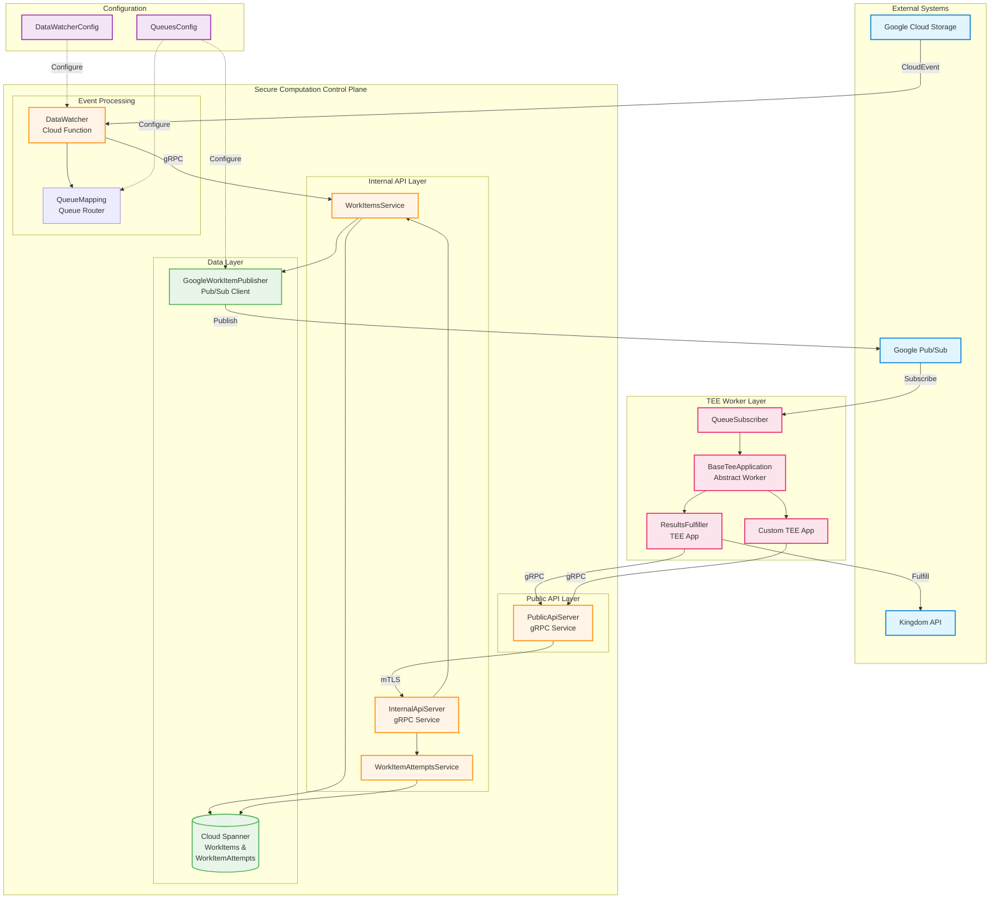
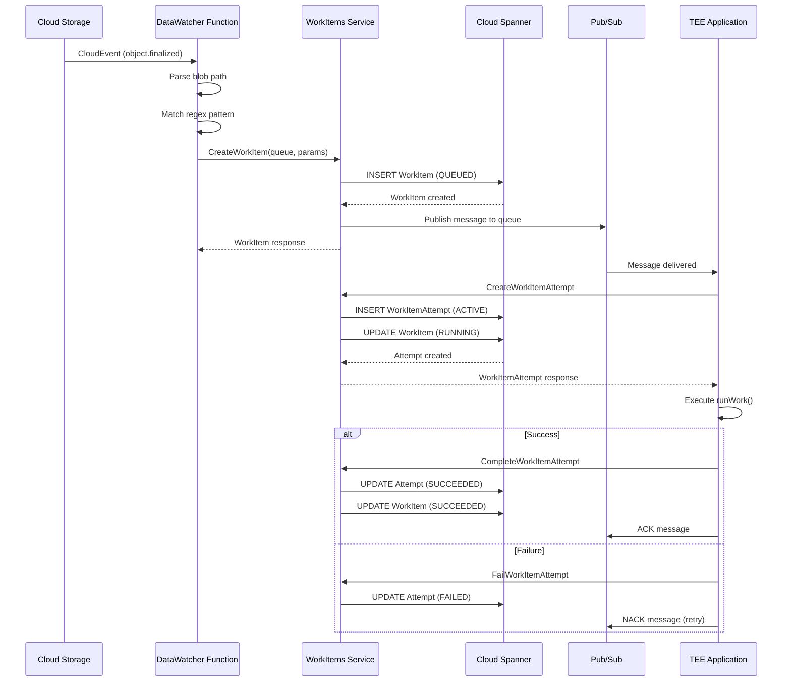

# Secure Computation Subsystem Architecture

## 1. System Overview

The **Secure Computation** subsystem provides a distributed work orchestration framework for privacy-preserving computations executed within Trusted Execution Environments (TEEs). It serves as the control plane for managing asynchronous workloads in the WFA Measurement System, particularly for the EDP (Event Data Provider) Aggregator components.

### Purpose

The subsystem enables:
- **Asynchronous Task Distribution**: Queue-based work item distribution across distributed TEE workers
- **Lifecycle Management**: Complete tracking of work items from creation through completion or failure
- **Retry Mechanisms**: Automatic retry handling through work item attempts with state tracking
- **Event-Driven Processing**: Storage event observation and automatic workflow triggering
- **Privacy-First Computation**: Integration with TEE environments for secure data processing

### Role in the Broader System

Within the WFA Measurement System ecosystem:
- **Kingdom**: Central controller for measurement campaigns and report configuration
- **Duchies**: Distributed secure multiparty computation nodes for encrypted data processing
- **EDP Aggregator**: Event data aggregation system using the Secure Computation control plane
- **Secure Computation**: Provides the control plane infrastructure for orchestrating TEE-based workloads in the EDP Aggregator

The Secure Computation subsystem abstracts the complexity of distributed task management, allowing higher-level systems (like EDP Aggregator) to focus on business logic rather than infrastructure concerns.

## 2. Architecture Diagram



## 3. Key Components

### 3.1 Control Plane Services (`controlplane.v1alpha`)

**Purpose**: Public gRPC API for external clients to manage work items and attempts.

**Components**:
- `WorkItemsService`: CRUD operations for work items
  - `createWorkItem()`: Create new work item in a queue
  - `getWorkItem()`: Retrieve work item by resource name
  - `listWorkItems()`: Paginated listing of work items
  - `failWorkItem()`: Mark work item as failed

- `WorkItemAttemptsService`: Manage execution attempts
  - `createWorkItemAttempt()`: Start new execution attempt
  - `getWorkItemAttempt()`: Retrieve attempt details
  - `completeWorkItemAttempt()`: Mark attempt as successful
  - `failWorkItemAttempt()`: Mark attempt as failed with error details
  - `listWorkItemAttempts()`: List attempts for a work item

**Key Features**:
- Resource name-based addressing (`workItems/{id}/workItemAttempts/{attempt-id}`)
- Pagination support (default 50, max 100 items)
- State transition validation
- Error translation from internal to public API exceptions

### 3.2 Service Layer (`service`)

**Purpose**: Core business logic and error handling infrastructure.

**Components**:
- `WorkItemKey` / `WorkItemAttemptKey`: Resource name parsing and validation
- `ServiceException` hierarchy: Domain-specific exceptions with gRPC status mapping
  - `WorkItemNotFoundException`
  - `WorkItemAlreadyExistsException`
  - `WorkItemInvalidStateException`
  - `RequiredFieldNotSetException`
  - `InvalidFieldValueException`

**Error Domain**: `internal.control-plane.secure-computation.halo-cmm.org`

**Internal Package**:
- `WorkItemPublisher`: Interface for publishing messages to queues
- `QueueMapping`: Maps queue resource IDs to numeric fingerprints using FarmHash
- `Services`: Container for internal API gRPC service implementations

### 3.3 Data Watcher (`datawatcher`)

**Purpose**: Observe blob storage events and trigger workflows.

**Components**:
- `DataWatcher`: Core path processing and routing logic
  - Evaluates blob paths against regex patterns
  - Routes to Control Plane queues or HTTP endpoints
  - OpenTelemetry instrumentation

- `DataWatcherFunction`: Google Cloud Function implementation
  - Processes CloudEvents from GCS bucket notifications
  - Validates blob paths (allows empty blobs ending with "done")
  - W3C trace context propagation

**Supported Sinks**:
1. **Control Plane Queue Sink**: Creates work items in specified queue
2. **HTTP Endpoint Sink**: Sends authenticated POST with Google Cloud ID token

**Metrics**:
- `edpa.data_watcher.processing_duration`: Processing time histogram
- `edpa.data_watcher.queue_writes`: Work items submitted counter

### 3.4 TEE SDK (`teesdk`)

**Purpose**: Framework for building TEE applications that process work items.

**Components**:
- `BaseTeeApplication`: Abstract base class for TEE workers
  - Automatic queue subscription and message handling
  - Work item attempt lifecycle management
  - Error classification (retriable vs. non-retriable)
  - Graceful shutdown and cleanup

**Lifecycle**:
1. Subscribe to Pub/Sub queue
2. Receive work item message
3. Create work item attempt (UUID-based)
4. Parse and validate work item parameters
5. Execute `runWork()` (abstract method)
6. Complete or fail attempt based on outcome
7. Acknowledge/Nack message for retry control

**Error Handling**:
- Non-retriable errors (invalid state, not found): Acknowledge message
- Protocol buffer parsing errors: Fail work item, acknowledge
- Work processing errors: Fail attempt, nack for retry
- Idempotency: Completing already-succeeded attempt treated as success

### 3.5 Deployment Layer (`deploy`)

#### Common (`deploy.common.server`)
- `PublicApiServer`: Gateway server with mutual TLS
  - Forwards validated requests to internal API
  - Command-line configuration
  - Certificate-based authentication

#### Google Cloud (`deploy.gcloud`)

**Spanner Database** (`deploy.gcloud.spanner.db`):
- `WorkItems.kt`: Extension functions for WorkItem CRUD
  - State transitions: QUEUED → RUNNING → SUCCEEDED/FAILED
  - Commit timestamp tracking

- `WorkItemAttempts.kt`: Extension functions for WorkItemAttempt CRUD
  - State transitions: ACTIVE → SUCCEEDED/FAILED
  - Parent-child relationship with WorkItems

**Schema**:
```
WorkItems
  ├─ WorkItemId (PK)
  ├─ WorkItemResourceId
  ├─ QueueId
  ├─ State
  ├─ WorkItemParams (Any)
  ├─ CreateTime (commit timestamp)
  └─ UpdateTime (commit timestamp)

WorkItemAttempts
  ├─ (WorkItemId, WorkItemAttemptId) (PK)
  ├─ WorkItemAttemptResourceId
  ├─ State
  ├─ ErrorMessage
  ├─ CreateTime (commit timestamp)
  └─ UpdateTime (commit timestamp)
```

**Publisher** (`deploy.gcloud.publisher`):
- `GoogleWorkItemPublisher`: Pub/Sub message publishing
  - Implements `WorkItemPublisher` interface
  - Project-scoped topic management

**Data Watcher** (`deploy.gcloud.datawatcher`):
- Cloud Function deployment with environment-based configuration
- mTLS channel to Control Plane
- Telemetry flush before function termination

### 3.6 Queue Management

**QueueMapping**:
- Fingerprint-based ID generation (FarmHash 64-bit)
- Resource ID validation (RFC 1034 compliance)
- Collision detection
- Bidirectional lookup (ID ↔ Resource ID)

**Configuration** (`QueuesConfig`):
```protobuf
message QueueInfo {
  string queue_resource_id = 1;
}

message QueuesConfig {
  repeated QueueInfo queue_infos = 1;
}
```

## 4. Data Flow

### 4.1 Work Item Creation Flow



### 4.2 State Transitions

**WorkItem States**:
```
QUEUED → RUNNING → SUCCEEDED
                 ↘ FAILED
```

**WorkItemAttempt States**:
```
ACTIVE → SUCCEEDED
       ↘ FAILED
```

## 5. Integration Points

### 5.1 Google Cloud Platform

**Cloud Storage**:
- CloudEvents via bucket notifications
- Blob path pattern matching
- Storage client abstraction for testing

**Cloud Spanner**:
- Primary data store for work items and attempts
- Commit timestamp-based ordering
- Transaction support for atomic state updates

**Cloud Pub/Sub**:
- Message queue infrastructure
- At-least-once delivery guarantees
- Subscription-based worker pools

**Cloud Functions**:
- Serverless event handlers
- CloudEvents protocol
- Environment variable configuration

**Google Secrets Manager**:
- Certificate storage
- mTLS credential management
- Service account authentication

### 5.2 EDP Aggregator

The Secure Computation subsystem serves as the foundational control plane for EDP Aggregator workflows:

**DataWatcher Integration**:
- Requisition detection triggers ResultsFulfiller workflow
- Event group detection triggers synchronization
- Impressions detection triggers data availability updates

**TEE Applications**:
- `ResultsFulfiller`: Processes requisitions in confidential VMs
- Custom aggregation pipelines using `BaseTeeApplication`

**Configuration**:
- DataWatcherConfig defines path patterns and routing
- QueuesConfig defines work distribution topology

### 5.3 Kingdom System

**Indirect Integration**:
- TEE applications (e.g., ResultsFulfiller) interact with Kingdom APIs
- Work item completion triggers Kingdom state updates
- Requisition fulfillment workflow orchestrated through Secure Computation

### 5.4 External HTTP Endpoints

**HTTP Endpoint Sink**:
- Google Cloud ID token authentication
- `X-DataWatcher-Path` header with blob path
- JSON-serialized application parameters in body
- Expected HTTP 200 response

## 6. Design Patterns

### 6.1 Control Plane Pattern

The subsystem implements a classic control plane architecture separating orchestration from execution:
- **Control Plane**: Manages work item lifecycle, state persistence, queue routing
- **Data Plane**: TEE workers execute actual computations independently

### 6.2 Gateway Pattern

**PublicApiServer** acts as a gateway:
- External clients connect via mTLS
- Requests validated and forwarded to internal API
- Separation of concerns (authentication vs. business logic)

### 6.3 State Machine Pattern

Work items and attempts follow explicit state machines:
- State transitions validated before database updates
- Invalid state exceptions prevent illegal transitions
- Idempotent operations for retry safety

### 6.4 Extension Function Pattern

Kotlin extension functions augment Spanner database contexts:
- `TransactionContext.insertWorkItem()`
- `ReadContext.readWorkItems()`
- Clean separation of database operations from business logic

### 6.5 Observer Pattern

DataWatcher observes storage events:
- Decoupled event source (GCS) from processors
- Configuration-driven routing
- Extensible sink types (queues, HTTP endpoints)

### 6.6 Queue-Based Load Leveling

Pub/Sub queues buffer work items:
- Decouples producers (DataWatcher) from consumers (TEE apps)
- Natural load distribution across worker pools
- Retry mechanisms for transient failures

### 6.7 Retry Pattern

Multi-level retry strategy:
- **Message-level**: Pub/Sub automatic retry on NACK
- **Attempt-level**: WorkItemAttempts track individual retries
- **Classification**: Distinguish retriable vs. non-retriable errors

### 6.8 Resource Name Pattern

API-style resource naming:
- Hierarchical: `workItems/{id}/workItemAttempts/{attempt-id}`
- Parseable keys for validation and extraction
- RESTful semantics in gRPC API

## 7. Technology Stack

### 7.1 Core Technologies

**Language**:
- Kotlin (primary implementation language)
- Protocol Buffers (data serialization)
- SQL (Spanner schema definitions)

**Frameworks**:
- gRPC (service communication)
- Coroutines (asynchronous programming)
- Picocli (command-line parsing)

**Build System**:
- Bazel (build orchestration)
- Gradle (dependency management)

### 7.2 Google Cloud Services

**Compute**:
- Google Kubernetes Engine (GKE) - Service hosting
- Confidential VMs (Managed Instance Groups) - TEE workers
- Cloud Functions (2nd gen) - Event handlers

**Storage**:
- Cloud Spanner - Primary database
- Cloud Storage - Blob storage

**Messaging**:
- Cloud Pub/Sub - Message queues

**Security**:
- Secrets Manager - Certificate storage
- Identity-Aware Proxy (IAP) - Authentication
- Mutual TLS - Service-to-service auth

**Observability**:
- OpenTelemetry - Metrics and tracing
- Cloud Logging - Log aggregation

### 7.3 Libraries and Dependencies

**gRPC Ecosystem**:
- `io.grpc:grpc-kotlin-stub` - Kotlin coroutine support
- `io.grpc:grpc-netty` - HTTP/2 transport
- `io.grpc:grpc-services` - Health checking, reflection

**Google Cloud Client Libraries**:
- `com.google.cloud:google-cloud-spanner` - Spanner database client
- `com.google.cloud:google-cloud-pubsub` - Pub/Sub messaging
- `com.google.cloud:google-cloud-storage` - Blob storage
- `com.google.cloud.functions:functions-framework-api` - Cloud Functions

**Protocol Buffers**:
- `com.google.protobuf:protobuf-kotlin` - Protobuf runtime
- `com.google.protobuf:protobuf-java-util` - Any type support

**Authentication**:
- `com.google.auth:google-auth-library-oauth2-http` - OAuth2 tokens

**Observability**:
- `io.opentelemetry:opentelemetry-api` - Metrics and tracing API
- `io.opentelemetry:opentelemetry-sdk` - SDK implementation

**Utilities**:
- `com.google.common:guava` - Common utilities (FarmHash)
- `kotlinx.coroutines:kotlinx-coroutines-core` - Coroutine primitives
- `kotlinx.coroutines:kotlinx-coroutines-flow` - Reactive streams

### 7.4 Development and Testing

**Testing**:
- JUnit 5 - Test framework
- Mockito / MockK - Mocking
- Truth - Assertions
- Testcontainers - Integration testing

**CI/CD**:
- GitHub Actions - Continuous integration
- Bazel Remote Execution - Build caching
- Container Registry - Image storage

### 7.5 Protocols and Standards

**APIs**:
- gRPC / Protocol Buffers 3
- CloudEvents 1.0 (storage notifications)
- W3C Trace Context (distributed tracing)

**Authentication**:
- X.509 certificates (mTLS)
- Google Cloud ID tokens (HTTP endpoints)

**Resource Naming**:
- RFC 1034 (domain name syntax for resource IDs)
- Google API Resource Names (hierarchical naming)

## 8. Operational Characteristics

### 8.1 Scalability

**Horizontal Scaling**:
- Stateless API servers scale independently
- TEE worker pools scale via Managed Instance Groups
- Queue-based decoupling enables elastic scaling

**Database Scaling**:
- Cloud Spanner provides horizontal scalability
- Automatic sharding and replication

### 8.2 Reliability

**Fault Tolerance**:
- At-least-once message delivery (Pub/Sub)
- Idempotent operations (attempt completion)
- Automatic retry for transient failures

**Data Durability**:
- Spanner multi-region replication
- Commit timestamp-based consistency

### 8.3 Security

**Confidentiality**:
- mTLS for all service-to-service communication
- TEE execution for sensitive computations
- Secrets Manager for credential storage

**Authentication**:
- Certificate-based mutual authentication
- Service account identity
- Google Cloud ID tokens for HTTP

**Authorization**:
- IAM-based access control
- Queue-level permissions
- Resource name validation

### 8.4 Observability

**Metrics**:
- Processing duration histograms
- Queue write counters
- gRPC call instrumentation

**Tracing**:
- Distributed traces across components
- W3C Trace Context propagation
- Span attributes for debugging

**Logging**:
- Structured logging throughout
- Error context capture
- Audit trails for state transitions

## 9. Future Considerations

### 9.1 Potential Enhancements

**Multi-Cloud Support**:
- Abstract cloud-specific implementations (Pub/Sub, Spanner)
- Pluggable storage and queue backends
- AWS/Azure deployment modules

**Advanced Scheduling**:
- Priority queues for urgent work items
- Deadline-based scheduling
- Resource-aware placement

**Enhanced Monitoring**:
- Custom dashboards and alerts
- SLO tracking and reporting
- Anomaly detection

**Developer Experience**:
- SDK for building TEE applications
- Testing utilities and simulators
- Documentation and examples

### 9.2 Known Limitations

**Queue Management**:
- FarmHash collisions possible (requires manual resolution)
- No queue priority or ordering guarantees beyond FIFO

**Error Handling**:
- Limited automatic recovery for some error classes
- Manual intervention required for certain failure modes

**Configuration**:
- Static configuration (requires redeployment for changes)
- No dynamic routing rules

## 10. References

### Internal Documentation
- `/Users/mmg/xmm/docs/org.wfanet.measurement.securecomputation.*.md` - Package-level documentation
- `/Users/mmg/xmm/docs/edpaggregator/deployment-guide.md` - EDP Aggregator integration

### Protocol Definitions
- `/Users/mmg/xmm/src/main/proto/wfa/measurement/securecomputation/controlplane/v1alpha/` - Public API
- `/Users/mmg/xmm/src/main/proto/wfa/measurement/internal/securecomputation/controlplane/` - Internal API
- `/Users/mmg/xmm/src/main/proto/wfa/measurement/config/securecomputation/` - Configuration protos

### Source Code
- `/Users/mmg/xmm/src/main/kotlin/org/wfanet/measurement/securecomputation/` - Main implementation
- `/Users/mmg/xmm/src/test/kotlin/org/wfanet/measurement/securecomputation/` - Test suite

### External Resources
- [Google Cloud Spanner Documentation](https://cloud.google.com/spanner/docs)
- [Google Cloud Pub/Sub Documentation](https://cloud.google.com/pubsub/docs)
- [gRPC Documentation](https://grpc.io/docs/)
- [OpenTelemetry Documentation](https://opentelemetry.io/docs/)
