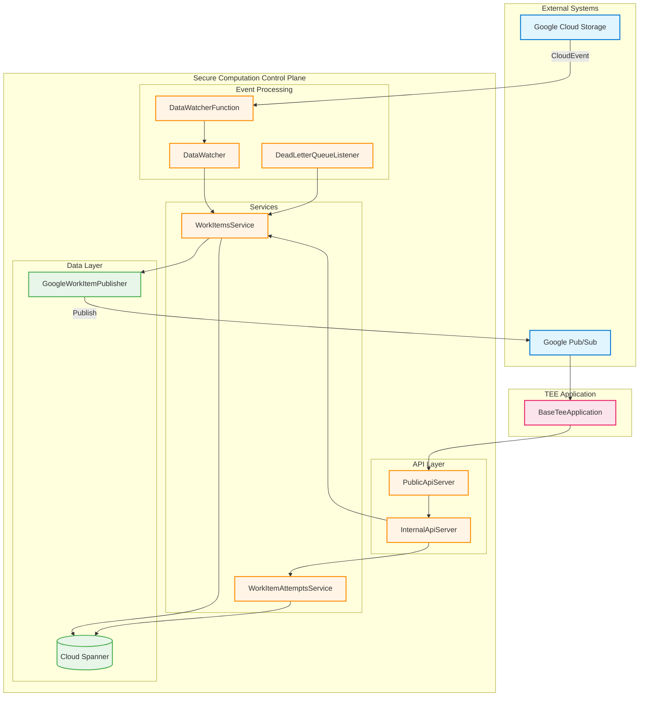
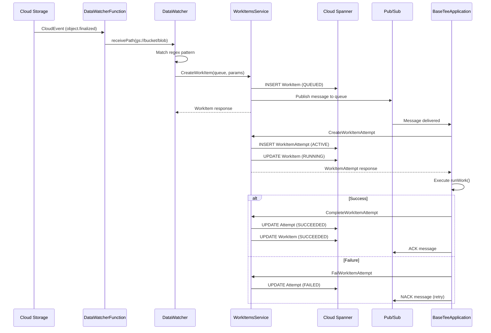

# Secure Computation Subsystem Architecture

## 1. System Overview

The **Secure Computation** subsystem provides a control plane for managing work items and their execution attempts. It includes gRPC services for work item lifecycle management, storage event observation via DataWatcher, and infrastructure for building TEE (Trusted Execution Environment) applications.

### Purpose

The subsystem enables:
- **Work Item Management**: Creation, retrieval, listing, and failure handling of work items
- **Attempt Tracking**: Management of execution attempts for work items with state transitions
- **Event-Driven Processing**: Storage event observation via DataWatcher with path pattern matching
- **TEE Application Framework**: Base infrastructure for building applications that process work items from queues

## 2. Architecture Diagram


```mermaid
graph TB
    subgraph "External Systems"
        GCS[Google Cloud Storage]
        PubSub[Google Pub/Sub]
    end

    subgraph "Secure Computation Control Plane"
        direction TB

        subgraph "API Layer"
            PublicAPI[PublicApiServer]
            InternalAPI[InternalApiServer]
        end

        subgraph "Services"
            WorkItemsSvc[WorkItemsService]
            WorkItemAttemptsSvc[WorkItemAttemptsService]
        end

        subgraph "Data Layer"
            Spanner[(Cloud Spanner)]
            Publisher[GoogleWorkItemPublisher]
        end

        subgraph "Event Processing"
            DataWatcherFn[DataWatcherFunction]
            DataWatcher[DataWatcher]
            DLQListener[DeadLetterQueueListener]
        end
    end

    subgraph "TEE Application"
        BaseTeeApp[BaseTeeApplication]
    end

    %% External to Control Plane
    GCS -->|CloudEvent| DataWatcherFn
    DataWatcherFn --> DataWatcher

    %% Within Control Plane
    PublicAPI --> InternalAPI
    InternalAPI --> WorkItemsSvc
    InternalAPI --> WorkItemAttemptsSvc
    WorkItemsSvc --> Spanner
    WorkItemsSvc --> Publisher
    WorkItemAttemptsSvc --> Spanner
    DataWatcher --> WorkItemsSvc
    Publisher -->|Publish| PubSub
    DLQListener --> WorkItemsSvc

    %% TEE Layer
    PubSub --> BaseTeeApp
    BaseTeeApp --> PublicAPI

    classDef external fill:#e1f5ff,stroke:#0078d4,stroke-width:2px
    classDef api fill:#fff4e6,stroke:#ff8c00,stroke-width:2px
    classDef data fill:#e8f5e9,stroke:#4caf50,stroke-width:2px
    classDef worker fill:#fce4ec,stroke:#e91e63,stroke-width:2px

    class GCS,PubSub external
    class PublicAPI,InternalAPI,WorkItemsSvc,WorkItemAttemptsSvc,DataWatcherFn,DataWatcher,DLQListener api
    class Spanner,Publisher data
    class BaseTeeApp worker
```

## 3. Key Components

### 3.1 Control Plane Services (`controlplane.v1alpha`)

**Purpose**: Public gRPC API for managing work items and attempts.

**Components**:
- `WorkItemsService`: gRPC service managing work item lifecycle
  - `createWorkItem(request: CreateWorkItemRequest)`: Creates a new work item in a queue
  - `getWorkItem(request: GetWorkItemRequest)`: Retrieves a work item by resource name
  - `listWorkItems(request: ListWorkItemsRequest)`: Lists work items with pagination support
  - `failWorkItem(request: FailWorkItemRequest)`: Marks a work item as failed

- `WorkItemAttemptsService`: gRPC service managing execution attempts
  - `createWorkItemAttempt(request: CreateWorkItemAttemptRequest)`: Creates a new execution attempt for a work item
  - `getWorkItemAttempt(request: GetWorkItemAttemptRequest)`: Retrieves an attempt by resource name
  - `completeWorkItemAttempt(request: CompleteWorkItemAttemptRequest)`: Marks an attempt as successfully completed
  - `failWorkItemAttempt(request: FailWorkItemAttemptRequest)`: Marks an attempt as failed with error message
  - `listWorkItemAttempts(request: ListWorkItemAttemptsRequest)`: Lists attempts with pagination support

- `Services`: Service container and factory for instantiating public API service implementations
  - `toList()`: Converts service container to bindable list
  - `build(internalApiChannel, coroutineContext)`: Creates service instances from internal channel

**Pagination**:
- Default page size: 50 items
- Maximum page size: 100 items
- Page tokens use base64-URL-encoded internal protobuf tokens

### 3.2 Service Layer (`service`)

**Purpose**: Core service abstractions, resource keys, and error handling.

**Components**:
- `WorkItemKey`: Resource key for work item entities with name parsing
  - `toName()`: Converts key to resource name
  - `fromName(resourceName)`: Parses resource name to key

- `WorkItemAttemptKey`: Child resource key for work item attempts
  - `toName()`: Converts key to resource name
  - `fromName(resourceName)`: Parses resource name to key
  - Properties: `workItemId`, `workItemAttemptId`, `parentKey`

**Error Domain**: `internal.control-plane.secure-computation.halo-cmm.org`

**Exception Types**:
| Exception | gRPC Status Code | Description |
|-----------|------------------|-------------|
| RequiredFieldNotSetException | INVALID_ARGUMENT | Required field not populated in request |
| InvalidFieldValueException | INVALID_ARGUMENT | Invalid field value |
| WorkItemNotFoundException | NOT_FOUND | Work item does not exist |
| WorkItemAttemptNotFoundException | NOT_FOUND | Work item attempt does not exist |
| WorkItemAlreadyExistsException | ALREADY_EXISTS | Duplicate work item creation |
| WorkItemAttemptAlreadyExistsException | ALREADY_EXISTS | Duplicate attempt creation |
| WorkItemInvalidStateException | FAILED_PRECONDITION | Work item state prevents operation |
| WorkItemAttemptInvalidStateException | FAILED_PRECONDITION | Attempt state prevents operation |
| QueueNotFoundException | NOT_FOUND | Queue does not exist |
| QueueNotFoundForWorkItem | NOT_FOUND | No queue mapping for work item |

**Internal Package**:
- `WorkItemPublisher`: Interface for publishing work item messages to queues
  - `publishMessage(queueName: String, message: Message)`: Publishes protobuf message to specified queue

- `QueueMapping`: Maps queue resource IDs to numeric queue IDs using FarmHash fingerprinting
  - `getQueueById(queueId: Long)`: Retrieves queue by numeric fingerprint ID
  - `getQueueByResourceId(queueResourceId: String)`: Retrieves queue by string resource identifier
  - Properties: `queues: List<Queue>`

- `Queue`: Represents a work queue
  - Properties: `queueId: Long`, `queueResourceId: String`

- `Services`: Container for control plane internal API gRPC services
  - Properties: `workItems: WorkItemsCoroutineImplBase`, `workItemAttempts: WorkItemAttemptsCoroutineImplBase`
  - `toList()`: Converts services to bindable list

### 3.3 Data Watcher (`datawatcher`)

**Purpose**: Observe blob storage events and route them to configured sinks.

**Components**:
- `DataWatcher`: Observes blob creation events and routes them based on path regex matching
  - `receivePath(path: String)`: Evaluates path against all configs and processes matches
  - `sendToControlPlane(config, path)`: Creates work item and submits to control plane queue
  - `sendToHttpEndpoint(config, path)`: Sends authenticated HTTP POST to configured endpoint

- `DataWatcherMetrics`: Collects OpenTelemetry metrics
  - `recordProcessingDuration(config, durationSeconds)`: Records histogram of processing time
  - `recordQueueWrite(config, queueName)`: Increments counter for work items submitted

**Metrics**:
| Metric Name | Type | Unit | Description |
|-------------|------|------|-------------|
| edpa.data_watcher.processing_duration | DoubleHistogram | s | Time from regex match to successful sink submission |
| edpa.data_watcher.queue_writes | LongCounter | - | Number of work items submitted to control plane queue |

**Trace Events**:
| Event Name | Description |
|------------|-------------|
| edpa.data_watcher.processing_completed | Successful path processing |
| edpa.data_watcher.processing_failed | Failed path processing |
| edpa.data_watcher.queue_write | Work item submitted to queue |
| edpa.data_watcher.http_dispatch_completed | HTTP endpoint notification sent |

**HTTP Endpoint Integration**:
- Authentication: Google Cloud ID token (Bearer token)
- Header: `X-DataWatcher-Path` contains the blob path
- Body: JSON-serialized application parameters from configuration
- Expected Response: HTTP 200

### 3.4 TEE SDK (`teesdk`)

**Purpose**: Framework for building TEE applications that process work items.

**Components**:
- `BaseTeeApplication`: Abstract base class for TEE applications
  - `run()`: Starts the application and listens for messages
  - `runWork(message: Any)`: Abstract method to implement work processing logic
  - `close()`: Closes the application and queue subscriber

- `ControlPlaneApiException`: Custom exception wrapping failures in control plane API interactions

**Constructor Parameters**:
- `subscriptionId: String` - Name of the subscription to monitor
- `queueSubscriber: QueueSubscriber` - Client for queue interactions
- `parser: Parser<WorkItem>` - Protobuf parser for work items
- `workItemsStub: WorkItemsCoroutineStub` - gRPC stub for work item operations
- `workItemAttemptsStub: WorkItemAttemptsCoroutineStub` - gRPC stub for work item attempt operations

**Key Behavior**:
- Automatically creates work item attempts with unique UUIDs
- Handles message acknowledgment/negative-acknowledgment based on processing outcomes
- Gracefully handles non-retriable errors (invalid state, not found) by acknowledging messages
- Manages work item attempt lifecycle (create, complete, fail)

**Error Handling Strategy**:
1. Non-retriable Control Plane Errors: When work item creation fails due to `INVALID_WORK_ITEM_STATE` or `WORK_ITEM_NOT_FOUND`, messages are acknowledged
2. Protocol Buffer Parsing Errors: Invalid messages trigger work item failure and message acknowledgment
3. Work Processing Errors: Exceptions during `runWork` execution cause work item attempt failure and message negative-acknowledgment for retry
4. Idempotency Protection: Completing an already-succeeded work item attempt is treated as success

### 3.5 Deployment Layer (`deploy`)

#### Common (`deploy.common.server`)

- `PublicApiServer`: Command-line application that runs the Secure Computation public API server
  - Acts as a gateway to the internal API with mutual TLS authentication
  - `run()`: Initializes TLS certificates, builds internal API channel, creates gRPC services, and starts the server
  - `main(args)`: Entry point that parses command-line arguments

**Command-Line Options**:
| Option | Type | Required | Description |
|--------|------|----------|-------------|
| `--secure-computation-internal-api-target` | String | Yes | gRPC target of the internal API server |
| `--secure-computation-internal-api-cert-host` | String | No | Expected hostname in internal API TLS certificate |
| `--debug-verbose-grpc-client-logging` | Boolean | No | Enables full gRPC request/response logging |
| `--channel-shutdown-timeout` | Duration | No | Grace period for gRPC channel shutdown (default: 3s) |

#### Google Cloud Spanner (`deploy.gcloud.spanner`)

**SpannerWorkItemsService**: gRPC service implementation with Spanner persistence
- `createWorkItem`: Creates new work item in queue with validation
- `getWorkItem`: Retrieves work item by resource identifier
- `listWorkItems`: Lists work items with pagination support
- `failWorkItem`: Marks work item and all attempts as failed

**SpannerWorkItemAttemptsService**: gRPC service for execution attempts
- `createWorkItemAttempt`: Creates new attempt, transitions parent to RUNNING
- `getWorkItemAttempt`: Retrieves attempt by resource identifiers
- `completeWorkItemAttempt`: Marks attempt SUCCEEDED, parent to SUCCEEDED
- `failWorkItemAttempt`: Marks attempt as FAILED
- `listWorkItemAttempts`: Lists attempts for work item with pagination

**InternalApiServer**: Command-line server application
- Orchestrates gRPC services with optional dead letter queue monitoring
- Command-line flags: `--queue-config`, `--google-project-id`, `--dead-letter-subscription-id`, `--channel-shutdown-timeout`

**InternalApiServices**: Factory for constructing configured service instances

**Database Operations** (`db` subpackage):

*WorkItems.kt*:
- `workItemIdExists(workItemId)`: Checks if work item ID exists
- `insertWorkItem(workItemId, workItemResourceId, queueId, workItemParams)`: Inserts new work item with QUEUED state
- `getWorkItemByResourceId(queueMapping, workItemResourceId)`: Retrieves work item
- `readWorkItems(queueMapping, limit, after)`: Streams paginated work items
- `failWorkItem(workItemId)`: Updates work item to FAILED state

*WorkItemAttempts.kt*:
- `workItemAttemptExists(workItemId, workItemAttemptId)`: Checks if attempt exists
- `insertWorkItemAttempt(workItemId, workItemAttemptId, workItemAttemptResourceId)`: Inserts attempt, updates parent to RUNNING
- `getWorkItemAttemptByResourceId(workItemResourceId, workItemAttemptResourceId)`: Retrieves attempt
- `completeWorkItemAttempt(workItemId, workItemAttemptId)`: Updates attempt and parent to SUCCEEDED
- `failWorkItemAttempt(workItemId, workItemAttemptId)`: Updates attempt to FAILED
- `readWorkItemAttempts(limit, workItemResourceId, after)`: Streams paginated attempts

**Database Schema**:

WorkItems table:
- Primary Key: `WorkItemId`
- Fields: `WorkItemResourceId`, `QueueId`, `State`, `WorkItemParams`, `CreateTime`, `UpdateTime`

WorkItemAttempts table:
- Primary Key: `(WorkItemId, WorkItemAttemptId)`
- Fields: `WorkItemAttemptResourceId`, `State`, `ErrorMessage`, `CreateTime`, `UpdateTime`
- Foreign Key relationship with WorkItems table

Both tables use commit timestamps for `CreateTime` and `UpdateTime` fields.

#### Publisher (`deploy.gcloud.publisher`)

- `GoogleWorkItemPublisher`: Google Cloud Pub/Sub implementation of WorkItemPublisher
  - `publishMessage(queueName, message)`: Publishes a protobuf message to the specified Pub/Sub queue
  - Constructor: `projectId: String`, `googlePubSubClient: GooglePubSubClient`

#### DataWatcher Function (`deploy.gcloud.datawatcher`)

- `DataWatcherFunction`: Google Cloud Function that processes storage object events
  - `accept(event: CloudEvent)`: Processes incoming CloudEvent from GCS bucket notifications
  - Constructs GCS path in format `gs://bucket/blobKey`
  - Validates blob size (allows empty blobs only if name ends with "done")
  - Extracts W3C trace context for distributed tracing
  - Flushes telemetry metrics before function termination

**Environment Variables**:
| Variable | Required | Description |
|----------|----------|-------------|
| CERT_FILE_PATH | Yes | Path to client certificate PEM file |
| PRIVATE_KEY_FILE_PATH | Yes | Path to client private key PEM file |
| CERT_COLLECTION_FILE_PATH | Yes | Path to trusted CA certificate collection |
| CONTROL_PLANE_TARGET | Yes | gRPC target address for control plane service |
| CONTROL_PLANE_CERT_HOST | Yes | Expected hostname in control plane certificate |

#### Dead Letter Queue (`deploy.gcloud.deadletter`)

- `DeadLetterQueueListener`: Monitors dead letter queue and marks failed work items
  - `run()`: Starts the listener by subscribing to the dead letter queue
  - `close()`: Closes the queue subscriber connection

**Message Processing Flow**:
1. Subscribes to configured dead letter queue subscription
2. Receives messages from the queue
3. Parses each message to extract the WorkItem
4. Invokes `failWorkItem` on the WorkItems API
5. Acknowledges message if successfully processed, or if work item not found, or if already in FAILED state
6. Nacks message for retry on other errors

#### Testing Utilities (`deploy.gcloud.spanner.testing`, `deploy.gcloud.testing`)

- `Schemata`: Provides access to Spanner database schema resources
  - `SECURECOMPUTATION_CHANGELOG_PATH`: Path to Liquibase changelog YAML file

- `TestIdTokenProvider`: Test implementation of IdTokenProvider that returns a hardcoded JWT token

### 3.6 Queue Management

**QueueMapping**:
- Maps queue resource IDs to numeric queue IDs using FarmHash fingerprinting (64-bit)
- Constructor: `config: QueuesConfig`
- Properties: `queues: List<Queue>` (sorted by resource ID)

**Queue**:
- `queueId: Long` - FarmHash fingerprint of queue resource ID
- `queueResourceId: String` - Human-readable queue identifier string

## 4. Data Flow

### 4.1 Work Item Creation Flow


```mermaid
sequenceDiagram
    participant GCS as Cloud Storage
    participant DWF as DataWatcherFunction
    participant DW as DataWatcher
    participant WIS as WorkItemsService
    participant DB as Cloud Spanner
    participant PS as Pub/Sub
    participant TEE as BaseTeeApplication

    GCS->>DWF: CloudEvent (object.finalized)
    DWF->>DW: receivePath(gs://bucket/blob)
    DW->>DW: Match regex pattern
    DW->>WIS: CreateWorkItem(queue, params)
    WIS->>DB: INSERT WorkItem (QUEUED)
    WIS->>PS: Publish message to queue
    WIS-->>DW: WorkItem response
    PS->>TEE: Message delivered
    TEE->>WIS: CreateWorkItemAttempt
    WIS->>DB: INSERT WorkItemAttempt (ACTIVE)
    WIS->>DB: UPDATE WorkItem (RUNNING)
    WIS-->>TEE: WorkItemAttempt response
    TEE->>TEE: Execute runWork()
    alt Success
        TEE->>WIS: CompleteWorkItemAttempt
        WIS->>DB: UPDATE Attempt (SUCCEEDED)
        WIS->>DB: UPDATE WorkItem (SUCCEEDED)
        TEE->>PS: ACK message
    else Failure
        TEE->>WIS: FailWorkItemAttempt
        WIS->>DB: UPDATE Attempt (FAILED)
        TEE->>PS: NACK message (retry)
    end
```

### 4.2 State Transitions

**WorkItem States**:
```
QUEUED -> RUNNING -> SUCCEEDED
                  -> FAILED
```
- **QUEUED**: Initial state when work item is created
- **RUNNING**: Set when first WorkItemAttempt is created
- **SUCCEEDED**: Set when any attempt completes successfully
- **FAILED**: Set via explicit failWorkItem call or DLQ processing

**WorkItemAttempt States**:
```
ACTIVE -> SUCCEEDED
       -> FAILED
```
- **ACTIVE**: Initial state when attempt is created
- **SUCCEEDED**: Terminal state when completeWorkItemAttempt is called
- **FAILED**: Terminal state when failWorkItemAttempt is called

## 5. Resource Naming

Resource names follow these patterns:
- Work Items: `workItems/{work_item}`
- Work Item Attempts: `workItems/{work_item}/workItemAttempts/{work_item_attempt}`

Validation includes:
- Resource name format validation using `WorkItemKey` and `WorkItemAttemptKey` parsers
- RFC 1034 compliance for resource IDs

## 6. Dependencies

### Core Dependencies
- `io.grpc` - gRPC framework for service implementation and channel management
- `com.google.protobuf` - Protocol buffer serialization
- `kotlinx.coroutines` - Coroutine support for async operations

### Google Cloud Dependencies
- `com.google.cloud.spanner` - Spanner client library for database operations
- `com.google.cloud.functions` - Cloud Functions framework for event handling
- `com.google.auth.oauth2` - Google authentication for ID tokens

### Internal Dependencies
- `org.wfanet.measurement.common` - Resource name parsing, API utilities, crypto certificate handling
- `org.wfanet.measurement.common.grpc` - gRPC utilities including error info extraction
- `org.wfanet.measurement.gcloud.spanner` - Custom async Spanner client wrapper
- `org.wfanet.measurement.gcloud.pubsub` - Google Pub/Sub client
- `org.wfanet.measurement.queue` - Queue subscription abstraction
- `org.wfanet.measurement.config.securecomputation` - Configuration protocol buffers
- `io.opentelemetry.api` - Metrics and tracing instrumentation

## 7. Testing Infrastructure

### Abstract Test Suites (`service.internal.testing`)

- `WorkItemsServiceTest`: Abstract test suite for validating WorkItems service implementations
  - Tests: creation, retrieval, listing, pagination, failure handling, field validation

- `WorkItemAttemptsServiceTest`: Abstract test suite for validating WorkItemAttempts service implementations
  - Tests: creation, retrieval, listing, pagination, state transitions, field validation

- `TestConfig`: Provides shared test configuration including pre-configured queue mapping

### Testing Utilities

- `DataWatcherSubscribingStorageClient`: Test harness that wraps StorageClient to simulate storage notifications
  - `writeBlob(blobKey, content)`: Writes blob and notifies all subscribed watchers
  - `subscribe(watcher)`: Registers watcher to receive notifications on blob writes

## 8. References

### Source Documentation
- `docs/org.wfanet.measurement.securecomputation.controlplane.v1alpha.md`
- `docs/org.wfanet.measurement.securecomputation.service.md`
- `docs/org.wfanet.measurement.securecomputation.service.internal.md`
- `docs/org.wfanet.measurement.securecomputation.datawatcher.md`
- `docs/org.wfanet.measurement.securecomputation.teesdk.md`
- `docs/org.wfanet.measurement.securecomputation.deploy.common.server.md`
- `docs/org.wfanet.measurement.securecomputation.deploy.gcloud.spanner.md`
- `docs/org.wfanet.measurement.securecomputation.deploy.gcloud.spanner.db.md`
- `docs/org.wfanet.measurement.securecomputation.deploy.gcloud.publisher.md`
- `docs/org.wfanet.measurement.securecomputation.deploy.gcloud.datawatcher.md`
- `docs/org.wfanet.measurement.securecomputation.deploy.gcloud.deadletter.md`
