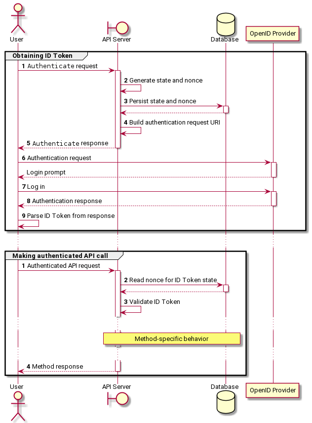

# Authentication Flow

## Obtaining ID Token

1.  The user calls `Authenticate`.
1.  The API server generates a random `nonce` and a `state` identifier.
1.  " persists these in a database for later lookup by `state`.
1.  " builds an authentication request URI using these parameters.
1.  " returns the authentication request URI in the `Authenticate` response.
1.  The user navigates to the returned authentication request URI in a user
    agent (web browser) and logs in.
1.  The OpenID Provider returns an authentication response to the user agent.
1.  The user parses the ID Token from the authentication response.

## Making authenticated API call

1.  The user calls an authenticated API method, passing its ID Token in the call
    credentials.
1.  The API server reads the `nonce` value for the ID Token `state` from a
    database.
1.  " validates the ID Token using the `nonce` value.
1.  " performs the actions specific to the API method and returns its response.
