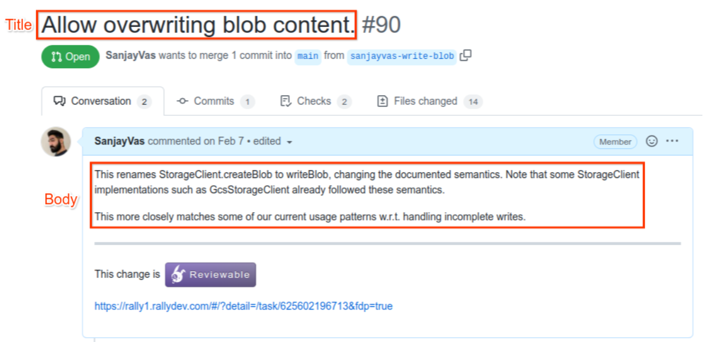
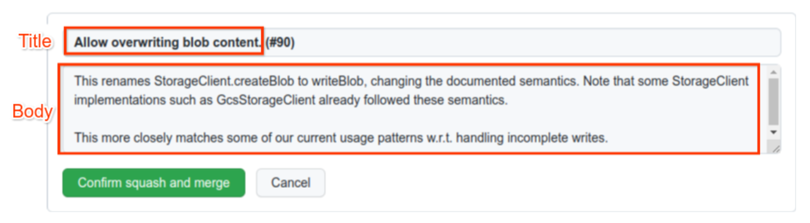

# WFA Dev Standards
Originally by efoxepstein@google.com, sanjayvas@google.com / August 2021 

# What Is This?
This guide lays out the standards and practices for developers contributing to repositories owned by the WFA.

It is the intention that eventually this doc is converted to Markdown and put in one of the WFA GitHub repositories.
# Code Review
## Pull Request Description
The title of a pull request (PR) should be a short summary of what is being done by the PR. This should be a complete imperative (written as if it were an order) sentence. For example, "Delete the Foo method from the Bar service." as opposed to "Deletes the Foo method from the Bar service."

The body of a PR description is optional, and should be used to add additional context.

[Example pull request:](https://github.com/world-federation-of-advertisers/common-jvm/pull/90)

Make sure to adjust the final merge description when merging a PR, as GitHub by default generates an undesirable body.

## Use Reviewable
Use https://reviewable.io for code reviews. GitHub’s code review tool does not work very well for our purposes at time of writing. Make sure to read through the [Reviewable user guide](https://docs.reviewable.io/introduction.html), particularly the section on [Code review discussions](https://docs.reviewable.io/discussions.html).

Note that merging an approved PR should still be done through the GitHub UI (see above section).

### Code Review Workflow
The general workflow when using Reviewable goes as follows:
  * The reviewer leaves comments in either the Blocking or a non-Blocking disposition.
  * The author pushes code changes and responds to comments, changing their disposition to "Satisfied" as appropriate.
  * Repeat 1-2 until the reviewer approves. The Publish button in Reviewable will automatically shift to "Publish & Approve" once the reviewer has accepted all of their previous blocking comments as "Satisfied" and marked all files as reviewed.

It's assumed that if the author hasn't resolved a comment then they are still working on it. The cases where the author should leave a comment indicating that they're still working on something are rare, and are usually when something needs more work than expected. In this rare case, the author should set their disposition on the comment to "Working".

Otherwise, the author should just wait until they've actually pushed the fix before replying. Put another way, the author should only publish comments on a PR once there's some action for the reviewer to take.

## Review Code Quickly
It’s important to prioritize keeping other engineers unblocked (without sacrificing code quality):

  * Reviewing others’ code is an urgent asynchronous task. When context switching, code review should generally be prioritized over tasks like writing design documents, coding, and addressing comments on your own PRs.

  * Don’t block PRs needlessly.
    * Consider proactively suggesting that the author add a TODO and file a GitHub issue instead of fixing some non-pressing problems.
    * Consider preemptively approving PRs as you post comments if it’s straightforward for the PR author to fix the issues and you don’t feel the need to verify the fixes – in such situations, it is acceptable for the author to click the “dismiss dissenters” button and merge the PR after addressing the reviewers’ comments.

  * Link to citations when possible – if you’re blocking a PR because of readability or code style issues, try to find a citation justifying your comment. Often, that will be linking to a section within this doc.

While code review shouldn’t be rushed, it is a considerable drag on productivity when it takes more than 48 hours for PRs to be merged. This is because:
  * More merge conflicts arise
  * More effort to manage dependent branches or chains of PRs
  * More context switching

# Code Authorship
## Review Your Own Code First
Before adding other reviewers, please:
  * Ensure the PR description has adequate detail – frequently, this will include a link to a related Rally task
  * Check for typos
  * Check for style guide violations (see the next subsection)
  * Make sure there’s sufficient documentation

## Code Style
Rather than providing a complete style guide, this section outlines some specific code style issues that tend to come up in code reviews. Besides familiarizing yourself with these, please feel free to link to particular sections of this when reviewing others’ code.

### General
  * Code should be thoroughly unit tested:
  * Test the contract, not the implementation.
  * For dependencies in tests, carefully consider when to use fakes, mocks, stubs, or the real dependency. See [this article](https://testing.googleblog.com/2013/07/testing-on-toilet-know-your-test-doubles.html) for definitions and [this one](https://testing.googleblog.com/2013/05/testing-on-toilet-dont-overuse-mocks.html) for some guidance.
  * Code should be autoformatted and linted
  * Eliminate compiler warnings when practical, using language-appropriate suppression annotations as appropriate (with a comment explaining why)
  * Limit usage of unnecessary third party dependencies

### Kotlin
  * Generally follow the [Android Kotlin Style Guide](https://developer.android.com/kotlin/style-guide) – but use 2 space indents instead of 4. This is enforced by the `.editorconfig` file in each repository.
  * Use the Truth library for most test assertions, except for `assertFails` and `assertFailsWith` (which Kotlin provides). Be sure to use the ProtoTruth extension to Truth for assertions on protocol buffers. 

### C++
  * Follow the [Google C++ Style Guide](https://google.github.io/styleguide/cppguide.html)
  * Follow [Abseil’s Tips of the Week](http://abseil.io/tips)
  * Don’t rely on transitive includes. (You can [include what you use](https://include-what-you-use.org) to help.) 

### Protocol Buffers and gRPC
  * Throw `StatusRuntimeExceptions` with the appropriate status code as needed from service implementations.
    * The common gRPC [Preconditions](https://github.com/world-federation-of-advertisers/common-jvm/blob/4145929d3fd862f4181fc0f545590284d7152f08/src/main/kotlin/org/wfanet/measurement/common/grpc/Preconditions.kt) util can help with this.
  * In Kotlin, prefer using the Kotlin DSL for protocol buffers over the Java APIs.

### Bazel
  * Don’t rely on transitive deps. Depend on what you use.
  * Put test infrastructure that could be used by more than one package into a `testing` subpackage in the `main` source tree, with the package's `default_testonly` attribute set to `True`.

