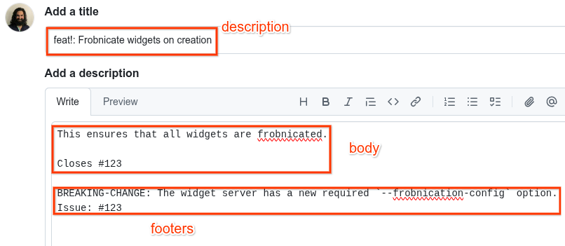

# WFA Dev Standards

Originally by efoxepstein@google.com, sanjayvas@google.com / August 2021

## What Is This?

This guide lays out the standards and practices for developers contributing to
repositories owned by the WFA.

## Code Review

### Pull Request Description

The pull request (PR) description is also used to populate the commit message
when the PR is merged. New commits should adhere to the
[Conventional Commits](https://www.conventionalcommits.org/) specification, with
the addendum that the breaking change indicator (`!`) must be used for any
change that needs to be mentioned in the release notes. The first line of the
commit message corresponds to the PR title, and the body and footers correspond
to the PR description body.

The `description` element of the commit message should be a short summary of
what is being done by the PR. This should be a complete imperative (written as
if it were an order) sentence. For example, "Delete the Foo method from the Bar
service." as opposed to "Deletes the Foo method from the Bar service."

The `body` and `footer(s)` elements of the commit message are optional, and
should be used to add additional context.

[Example pull request:](https://github.com/world-federation-of-advertisers/cross-media-measurement/pull/1718)

### Use Reviewable

Use https://reviewable.io for code reviews. GitHub’s code review tool does not
work very well for our purposes at time of writing. Make sure to read through
the [Reviewable user guide](https://docs.reviewable.io/introduction.html),
particularly the section on
[Code review discussions](https://docs.reviewable.io/discussions.html).

Note that merging an approved PR should still be done through the GitHub UI (see
above section).

#### Code Review Workflow

The general workflow when using Reviewable goes as follows:

1.  The reviewer leaves comments in either the Blocking or a non-Blocking
    disposition.
1.  The author pushes code changes and responds to comments, changing their
    disposition to "Satisfied" as appropriate.
1.  Repeat 1-2 until the reviewer approves. The Publish button in Reviewable
    will automatically shift to "Publish & Approve" once the reviewer has
    accepted all of their previous blocking comments as "Satisfied" and marked
    all files as reviewed.

It's assumed that if the author hasn't resolved a comment then they are still
working on it. The cases where the author should leave a comment indicating that
they're still working on something are rare, and are usually when something
needs more work than expected. In this rare case, the author should set their
disposition on the comment to "Working".

Otherwise, the author should just wait until they've actually pushed the fix
before replying. Put another way, the author should only publish comments on a
PR once there's some action for the reviewer to take.

### Review Code Quickly

It’s important to prioritize keeping other engineers unblocked (without
sacrificing code quality):

*   Reviewing others’ code is an urgent asynchronous task. When context
    switching, code review should generally be prioritized over tasks like
    writing design documents, coding, and addressing comments on your own PRs.

*   Don’t block PRs needlessly.

    *   Consider proactively suggesting that the author add a TODO and file a
        GitHub issue instead of fixing some non-pressing problems.
    *   Consider preemptively approving PRs as you post comments if it’s
        straightforward for the PR author to fix the issues and you don’t feel
        the need to verify the fixes – in such situations, it is acceptable for
        the author to click the “dismiss dissenters” button and merge the PR
        after addressing the reviewers’ comments.

*   Link to citations when possible – if you’re blocking a PR because of
    readability or code style issues, try to find a citation justifying your
    comment. Often, that will be linking to a section within this doc.

While code review shouldn’t be rushed, it is a considerable drag on productivity
when it takes more than 48 hours for PRs to be merged. This is because:

*   More merge conflicts arise
*   More effort to manage dependent branches or chains of PRs
*   More context switching

## Code Authorship

### Review Your Own Code First

Before adding other reviewers, please:

*   Ensure the PR description has adequate detail – frequently, this will
    include a link to a related Rally task
*   Check for typos
*   Check for style guide violations (see the next subsection)
*   Make sure there’s sufficient documentation

### Code Style

See [Code Style](code-style.md).
