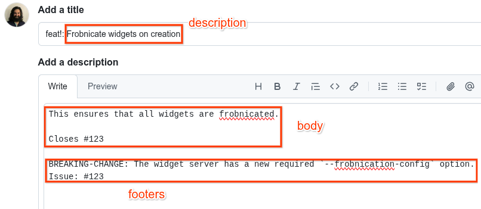

# WFA Dev Standards

Originally by efoxepstein@google.com, sanjayvas@google.com / August 2021

## What Is This?

This guide lays out the standards and practices for developers contributing to
repositories owned by the WFA.

## Code Review

### Commit Message Format

The final commit message must adhere strictly to the format below. This enables
tooling to parse commit messages.

New commits must adhere to the
[Conventional Commits](https://www.conventionalcommits.org/) specification, with
the following details:

1.  Type definitions are as follows, adopted from the
    [Angular Commit Message Guidelines](https://github.com/angular/angular/blob/main/contributing-docs/commit-message-guidelines.md#type)

    Type         | Description
    ------------ | -----------
    **build**    | Changes that affect the build system or external dependencies (example scopes: gulp, broccoli, npm)
    **ci**       | Changes to our CI configuration files and scripts (examples: Github Actions, SauceLabs)
    **docs**     | Documentation only changes
    **feat**     | A new feature
    **fix**      | A bug fix
    **perf**     | A code change that improves performance
    **refactor** | A code change that neither fixes a bug nor adds a feature, i.e. has no externally visible changes
    **test**     | Adding missing tests or correcting existing tests

2.  The breaking change indicator (`!`) **must** be used for any breaking
    change. These are changes that need to be mentioned in release notes as
    potentially requiring action.

3.  `BREAKING-CHANGE` is used instead of `BREAKING CHANGE` so that it is a valid
    [Git trailer](https://git-scm.com/docs/git-interpret-trailers). The value of
    the trailer is intended to be directly copied into release notes.

The `description` element of the commit message should be a short summary of
what is being done by the PR. This should be a complete imperative (written as
if it were an order) sentence. For example, "Delete the Foo method from the Bar
service." as opposed to "Deletes the Foo method from the Bar service."

The `body` and `footer(s)` elements of the commit message are optional, and
should be used to add additional context. The `footer(s)` must be formatted as
valid Git trailers.

This project uses the following additional trailers:

*   `Issue`

    A GitHub issue associated with the PR. The trailer can be repeated for
    multiple issues. The value should use the same
    [short link format](https://docs.github.com/en/get-started/writing-on-github/working-with-advanced-formatting/autolinked-references-and-urls#issues-and-pull-requests)
    as TODOs, *not* full URLs.

    Every significant PR should be associated with at least one GitHub issue.
    Note that this trailer is in addition to any closing keywords used in the
    `body` element.

*   `RELNOTES`

    Text that is intended to be included in release notes, but isn't related to
    a breaking change.

The pull request (PR) description is used to populate the initial commit message
when the PR is merged. As such, much of the above format applies to the PR
description as well. The first line of the commit message corresponds to the PR
title, and the body and footers correspond to the PR description body.

Note that it is **critical** to ensure that GitHub's line wrapping behavior does
not interfere with the parseability of the commit message. Remove any line
wrapping that GitHub introduces into PR title and the final commit message.

### Use Reviewable

Use https://reviewable.io for code reviews. GitHub’s code review tool does not
work very well for our purposes at time of writing. Make sure to read through
the [Reviewable user guide](https://docs.reviewable.io/introduction.html),
particularly the section on
[Code review discussions](https://docs.reviewable.io/discussions.html).

Note that merging an approved PR should still be done through the GitHub UI (see
above section).

#### Code Review Workflow

The general workflow when using Reviewable goes as follows:

1.  The reviewer leaves comments in either the Blocking or a non-Blocking
    disposition.
1.  The author pushes code changes and responds to comments, changing their
    disposition to "Satisfied" as appropriate.
1.  Repeat 1-2 until the reviewer approves. The Publish button in Reviewable
    will automatically shift to "Publish & Approve" once the reviewer has
    accepted all of their previous blocking comments as "Satisfied" and marked
    all files as reviewed.

It's assumed that if the author hasn't resolved a comment then they are still
working on it. The cases where the author should leave a comment indicating that
they're still working on something are rare, and are usually when something
needs more work than expected. In this rare case, the author should set their
disposition on the comment to "Working".

Otherwise, the author should just wait until they've actually pushed the fix
before replying. Put another way, the author should only publish comments on a
PR once there's some action for the reviewer to take.

### Review Code Quickly

It’s important to prioritize keeping other engineers unblocked (without
sacrificing code quality):

*   Reviewing others’ code is an urgent asynchronous task. When context
    switching, code review should generally be prioritized over tasks like
    writing design documents, coding, and addressing comments on your own PRs.

*   Don’t block PRs needlessly.

    *   Consider proactively suggesting that the author add a TODO and file a
        GitHub issue instead of fixing some non-pressing problems.
    *   Consider preemptively approving PRs as you post comments if it’s
        straightforward for the PR author to fix the issues and you don’t feel
        the need to verify the fixes – in such situations, it is acceptable for
        the author to click the “dismiss dissenters” button and merge the PR
        after addressing the reviewers’ comments.

*   Link to citations when possible – if you’re blocking a PR because of
    readability or code style issues, try to find a citation justifying your
    comment. Often, that will be linking to a section within this doc.

While code review shouldn’t be rushed, it is a considerable drag on productivity
when it takes more than 48 hours for PRs to be merged. This is because:

*   More merge conflicts arise
*   More effort to manage dependent branches or chains of PRs
*   More context switching

## Code Authorship

### Review Your Own Code First

Before adding other reviewers, please:

*   Ensure the PR description has adequate detail – frequently, this will
    include a reference to a related GitHub issue
*   Check for typos
*   Check for style guide violations (see the next subsection)
*   Make sure there’s sufficient documentation
*   Ensure that any temporary change that should not be merged is clearly marked with a `DO_NOT_SUBMIT` comment. This tag is detected by an automated check and will block the PR from being merged.

### Code Style

See [Code Style](code-style.md).

## Pull Requests, Issues & Milestones

### Pull Requests
- Every PR should be associated with an existing Issue.
- If a PR is associated with an Issue, it **must** have an `Issue` trailer.

### Issues
- **Type**: Each issue **must** have it's type assigned (e.g. `Bug`, `Feature request`, etc.). Labels should be used only for additional context, not as a substitute for the type.
- **Title**: Issue titles must be self-contained — i.e. meaningful and readable without needing context from a parent issue.
- **Dependency**: If an issue is blocked by, or is blocking another issue, the dependency should be declared in the the Issue's `Relationships` field (blocked by / blocking).
- **Template**: Use the appropriate issue template when creating an issue. If no special template applies, fall back to the 'blank' template.

### Milestones
- Issues that don't relate to `src` files in the repo have type Process and aren't associated with a given milestone.
- Only **issues** — not PRs — should be linked to milestones.
