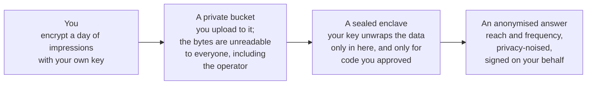
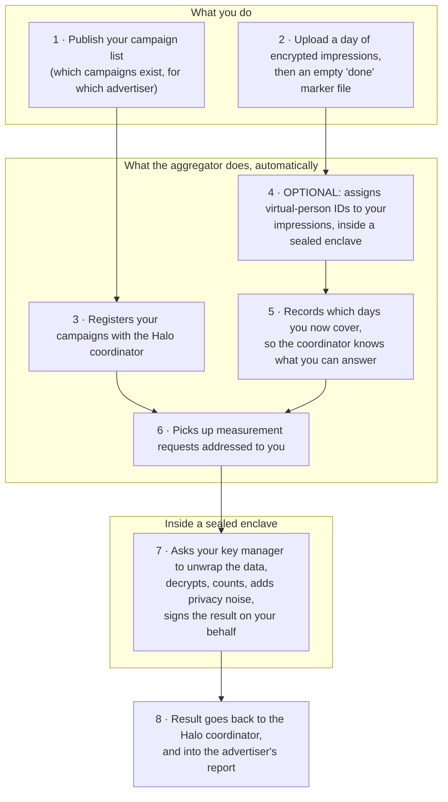
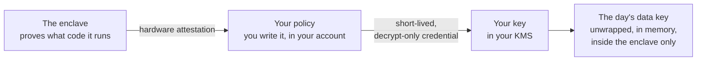

# The EDP Aggregator

**A managed on-ramp to Halo cross-media measurement, for publishers.**

If you are a publisher (an *Event Data Provider*, or **EDP**) and an advertiser wants
to know how many distinct people saw their campaign across your inventory and
everybody else's, this is the piece of Halo you integrate with.

You do one thing: **drop encrypted files in a bucket.** Everything after that —
registering your campaigns, answering measurement requests, adding privacy noise,
signing results — is run for you by the market operator, inside hardware that cannot
show your data to anyone, including the operator.

This page starts from zero and gets more detailed as you scroll. Stop wherever you have
what you need.

| I want to… | Go to |
| --- | --- |
| Understand what this is in 60 seconds | [1. The idea](#1-the-idea) |
| See how the whole thing works | [2. How it works](#2-how-it-works) |
| Know why my data is safe | [3. Why you can send us your data](#3-why-you-can-send-us-your-data) |
| Find out which integration applies to me | [4. Choose your path](#4-choose-your-path) |
| Know exactly what files to produce | [5. What you actually produce](#5-what-you-actually-produce) |
| Start onboarding for real | [6. The onboarding checklist](#6-the-onboarding-checklist) |
| Read the deep guides | [7. Going deeper](#7-going-deeper) |
| Deploy or operate this myself | [7. Going deeper](#7-going-deeper) → operator guides |

---

## 1. The idea

An advertiser wants one number: **how many real people saw this campaign, and how
often** — counted once across every publisher, not once per publisher.

Getting that number has always meant one of two bad options: publishers ship
user-level data to a third party, or nobody gets a cross-publisher answer. Halo's
answer is that **nobody ever sees anybody's raw data**. Each publisher's data is
decrypted only inside sealed hardware that can prove which code it is running, and only
aggregate, noise-protected numbers ever come out.

The EDP Aggregator is the part that makes participating in that cheap for you.
Without it, you would run measurement software in your own infrastructure and keep it
in sync with the platform forever. With it:

| You do | The operator does |
| --- | --- |
| Encrypt a day of impressions with **your own key** | Runs every service |
| Upload them to a bucket | Notices the upload, registers it |
| Publish your campaign list | Answers measurement requests |
| Keep your key policy up to date | Applies privacy noise and thresholds |
| — | Signs the result on your behalf, using a key you approved |

You run **no Halo software**. You never share a private key. You can revoke access at
any time by changing a policy in your own cloud account.

> **The one thing you keep control of.** The system can only read your impressions by
> asking *your* key manager to unwrap them, and *you* decide which software is allowed
> to ask. That is the whole privacy model, and it is described in
> [section 3](#3-why-you-can-send-us-your-data).

---

## 2. How it works

### The short version



### The longer version

Two things flow in from you, on your own schedule: a **campaign list** (rarely changes)
and a **day of impressions** (usually daily). Everything else is automatic.



Step by step:

1. **You publish your campaign list.** A file describing each campaign: the brand, the
   advertiser it belongs to, the media types, and the date range you have data for.
   Upload it and it is registered for you. You only redo this when campaigns change.

2. **You upload a day of impressions.** Encrypted, in a folder named for the date. When
   the last file is up, you write an empty file called `done`. That marker is the only
   signal the system waits for — nothing is read until it appears.

3. **Your campaigns get registered** with the Halo coordinator so advertisers can
   request measurements against them.

4. **Optionally, the system labels your impressions for you.** Halo counts *people*, not
   cookies or devices, so every impression needs a virtual-person ID (**VID**). You can
   assign those yourself before uploading, or upload unlabeled impressions and have the
   system assign them inside a sealed enclave. See
   [section 4](#41-decision-1--who-assigns-the-virtual-person-ids).

5. **Your coverage is recorded.** The system notes which dates you now have data for.
   The coordinator will only ask you questions you can actually answer.

6. **Measurement requests are picked up for you.** When an advertiser asks for a report,
   the coordinator creates a request addressed to you. The aggregator polls for it and
   queues up the work — you are not called, and you do not need an endpoint.

7. **The answer is computed inside a sealed enclave.** This is the only moment your
   data exists in the clear, and it happens on hardware that proves what code it is
   running before your key manager will unwrap anything. The enclave counts, applies
   differential-privacy noise and any minimum-audience thresholds, signs the result with
   a consent key held for you, and hands it back.

8. **The advertiser gets a report** — aggregate numbers only.

For a cross-publisher measurement there is one extra hop: instead of releasing your
numbers, the enclave re-encrypts an intermediate frequency vector and sends it to a
second enclave that combines the vectors from every participating publisher. No
publisher's individual contribution is ever revealed. That protocol is called
**TrusTEE**, and supporting it is optional — see
[section 4.4](#44-decision-4--single-publisher-only-or-cross-publisher-too).

---

## 3. Why you can send us your data

Four properties, and how each one is enforced.

### 3.1 The data is encrypted with a key you own and never share

Each day of impressions is encrypted with a fresh single-use data key, and that data key
is itself wrapped by a **master key that lives in your own KMS**, in your own cloud
account. You give the operator the key's *URI* — its address. You never give them the
key, and there is no copy of it anywhere in the system.

### 3.2 The only thing that can unwrap it is attested code

The workload that reads your data runs in a **Confidential Space** enclave. Before it
can use your key it must present a hardware-signed attestation describing exactly what
it is: the container image and its signature, the enclave software, the project it runs
in, whether it is a debug build.

You write the policy that judges that attestation. It lives in your cloud account, and
it typically says: *only a workload running in a genuine, non-debug Confidential Space,
running an image signed with this exact key, may obtain a short-lived decrypt-only
credential for this key.* If the operator rebuilds the image with different code, the
signature changes, your policy rejects it, and your data stays encrypted.



### 3.3 Nobody can look inside the enclave — including the operator

Confidential Space memory is encrypted by the CPU and the operator has no shell, no
debugger and no log access into a production enclave. Plaintext impressions exist only
in that memory, only for the duration of one computation.

### 3.4 Only privacy-protected aggregates come out

Results carry differential-privacy noise, and the operator can configure minimum-audience
thresholds below which a result is suppressed entirely. Each result is signed with a
consent key associated with your identity, so the platform can verify a result really
came from your data.

**What the operator can see:** that you uploaded a file, how big it was, and what date
folder it was in. **What they cannot see:** anything inside it.

**What you can revoke, unilaterally, at any time:** access to your key. Change the
policy in your own account and the next decryption attempt fails. No coordination with
the operator required.

---

## 4. Choose your path

Four decisions. Most publishers can make all four in a few minutes. Each has a
recommended default.

### 4.1 Decision 1 — who assigns the virtual-person IDs?

Halo counts people. Every impression must carry a **VID** — a market-specific virtual
person identifier — before it can be counted.

| | **A · You label** | **B · The system labels** |
| --- | --- | --- |
| You upload | Impressions that already have a VID on each row | Unlabeled impressions plus the demographic signals the model needs |
| You run | The market's VID model, in your own infrastructure | Nothing |
| File format | Protobuf records, RecordIO-framed | **Parquet** |
| You must keep in sync with | Every model update the market ships | Nothing |
| Availability | Everywhere | Per market — ask your operator whether it is enabled |
| Details | [5.1](#51-option-a--you-upload-labeled-impressions) | [5.2](#52-option-b--you-upload-raw-impressions-and-the-system-labels-them) |

**Recommended: B, if your market has it enabled.** Running someone else's identity model
inside your own stack, and re-running it every time the model changes, is the single
largest ongoing cost of participating. Option B removes it: you export the columns you
already have, and labeling happens inside the same enclave protection as everything else.

Choose A if you already run the model, or if you are not willing to ship the
demographic signals the model needs even in encrypted form.

You can also mix: this is decided per *model line*, so you can move over gradually.

### 4.2 Decision 2 — where does your key live, and how does the enclave reach it?

Three supported paths. They differ only in how the enclave proves its identity to your
key manager; the data flow is identical.

| | **Your KMS** | **You must operate** | **The chain** | **Pick this if** |
| --- | --- | --- | --- | --- |
| **G · Google Cloud KMS** | GCP | A GCP project with a Workload Identity Pool and a service account | attestation → your identity pool → your service account → your key | You are on Google Cloud |
| **A1 · AWS KMS, direct** | AWS | An AWS account. **No GCP project at all.** | attestation → your key | You are on AWS *(recommended for AWS)* |
| **A2 · AWS KMS via Google federation** | AWS | An AWS account **and** a GCP project with a Workload Identity Pool | attestation → your identity pool → your service account → AWS STS → your key | You are on AWS and have a specific reason to keep a Google identity pool in the chain |

**Recommended: G if you are on Google Cloud, A1 if you are on AWS.** A1 registers the
Confidential Space attestation issuer directly as an OIDC provider in your AWS account,
so the enclave's attestation is validated by AWS itself, with no intermediary. It is
fewer moving parts and fewer things to get wrong.

Whichever you choose, the property in [section 3.2](#32-the-only-thing-that-can-unwrap-it-is-attested-code)
holds: the policy that decides which workloads may use your key is **yours**, in **your**
account. In path A2 in particular, the Google identity pool must be in *your* GCP
project, never the operator's — otherwise the operator could mint tokens without a
genuine enclave.

> Setup for G is in the [EDP Onboarding Guide](edp-onboarding.md#22-kms-setup--google-cloud).
> Setup for A1 and A2 is in the [AWS KMS Setup Guide](aws-kms-setup.md), which calls them
> Option 1 and Option 2.

### 4.3 Decision 3 — how do your campaigns get registered?

| | **Self-published** | **Operator-linked (self-serve)** |
| --- | --- | --- |
| You publish | A campaign list naming the advertiser directly | A campaign list naming your own internal account id |
| The operator does | Nothing extra | Links your account ids to advertiser identities once |
| Pick this if | You know the advertiser's Halo identity | You want to publish campaigns using your own account ids and let the operator resolve them |

Both are supported at the same time; the campaign record carries either an advertiser
identity or your own account reference id. See the
[Self-Serve Onboarding Guide](self-serve-onboarding.md) for the operator side.

### 4.4 Decision 4 — single-publisher only, or cross-publisher too?

| | **Single-publisher** | **Cross-publisher (TrusTEE)** |
| --- | --- | --- |
| Answers | Reach and frequency across your inventory | Deduplicated reach across all participating publishers |
| Your key must allow | Decrypt | Decrypt **and** encrypt |
| Your policy must trust | The answering workload | The answering workload **and** the aggregating enclave |
| Extra key needed | No | Optional — you may use one key for both, or a dedicated second key on the same key ring |

Cross-publisher measurement is the reason Halo exists, but it is opt-in and it is a
strictly additive change to your setup — you can start single-publisher and enable it
later. Details in the
[EDP Onboarding Guide](edp-onboarding.md#6-enabling-trustee-optional).

### 4.5 Three worked profiles

| Profile | 4.1 | 4.2 | 4.3 | 4.4 |
| --- | --- | --- | --- | --- |
| **Google-Cloud publisher, wants the least work** | B — system labels | G — GCP KMS | Operator-linked | Enable later |
| **AWS publisher, already runs the VID model** | A — you label | A1 — AWS direct | Self-published | Enable now |
| **Publisher trialling the platform** | A — you label | G — GCP KMS | Self-published | Single-publisher only |

---

## 5. What you actually produce

Everything you send is a file in a bucket. There are two kinds — a **campaign list** and
a **day of impressions** — and the impression format depends on
[decision 4.1](#41-decision-1--who-assigns-the-virtual-person-ids).

Three rules apply to every upload:

1. **Paths are strict.** The system matches upload paths against configured patterns. A
   file in the wrong place is silently not processed. Your operator gives you your exact
   prefixes.
2. **`done` is the trigger and it goes last.** Nothing in a date folder is read until an
   empty file named `done` appears in it. Upload every data file first, then `done`.
3. **A finished folder is immutable.** Once `done` is written, do not add to, change, or
   remove anything in that folder.

> **The protos in this repository are the authoritative schema.** Generate your writer
> against them; do not hand-copy the field lists below.
> [`src/main/proto/wfa/measurement/edpaggregator/`](../../src/main/proto/wfa/measurement/edpaggregator/)

### 5.1 Option A — you upload labeled impressions

You have already assigned a VID to every impression.

**Layout**

```
{your-impression-prefix}/model-line/{modelLineId}/{YYYY-MM-DD}/metadata.binpb
{your-impression-prefix}/model-line/{modelLineId}/{YYYY-MM-DD}/done
{...}/the encrypted impressions blob            (may live in a separate tree)
```

**The impressions blob** — a stream of `LabeledImpression` messages, RecordIO-framed,
envelope-encrypted with that day's data key.

| Field | Type | Required | What it is |
| --- | --- | --- | --- |
| `event_time` | `Timestamp` | yes | When the impression happened |
| `vid` | `int64` | yes | The virtual person you assigned |
| `event` | `Any` | yes | Your market's event message (see its event template) |
| `event_group_reference_id` | `string` | yes | Which campaign this belongs to |
| `entity_keys` | repeated `EntityKey` | no | `{entity_type, entity_id}` tags — creative, placement, and so on — for downstream filtering |

**The metadata sidecar** — one small file per impressions blob whose filename *contains*
the string `metadata` (for example `metadata.binpb`). It holds a **`BlobDetails`**
message. This is the most common thing to get wrong: it must be a `BlobDetails`, not a
bare encrypted-key message.

| Field | Required | What it is |
| --- | --- | --- |
| `blob_uri` | yes | Where the encrypted impressions blob is |
| `encrypted_dek` | yes | The day's data key, wrapped by your master key — this is how the enclave unwraps it |
| `model_line` | yes | Which model line these impressions belong to; must match the `{modelLineId}` in the path |
| `interval` | yes | The time range this data covers |
| `entity_keys` | yes | The entity keys present in the blob |
| `event_group_reference_id` | legacy | Still accepted; new writers should populate `entity_keys` |

Full field-level detail: [EDP Onboarding Guide § 3](edp-onboarding.md#3-data-formatting).

### 5.2 Option B — you upload raw impressions and the system labels them

You upload **unlabeled** impressions as encrypted **Parquet**, and the pipeline assigns
the VIDs inside an enclave, then writes labeled output in the Option A format on your
behalf. From that point on the flow is identical.

**Layout** — note there is no model line in the path. The system resolves which model
lines apply and can label the same day for several of them.

```
{your-raw-impression-prefix}/{YYYY-MM-DD}/{any-filename}.parquet
{your-raw-impression-prefix}/{YYYY-MM-DD}/done
```

**One file holds exactly one day of events.** Multiple files per day are fine.

**Columns.** One flat column per input, one row per impression. **The column names are
yours** — you tell your operator which column carries which concept, and they configure
the mapping. The names below are the conventions used by the reference writer.

| Concept | Conventional name | Parquet type | Required | Notes |
| --- | --- | --- | --- | --- |
| Impression id | `event_id` | STRING | yes | Unique per impression |
| Event time | `event_time_usec` | INT64 | yes | Epoch **microseconds**, UTC |
| Entity ids | `person_id`, `creative_id`, … | STRING | **at least one per row** | One column per entity type. Your operator marks each as required or optional; a required column must be non-empty on every row |
| Model inputs | `person_gender`, `person_age_group`, … | as mapped | as the model needs | The demographic and identity signals the market's VID model consumes |
| Filter inputs | `video_ad_viewed_fraction`, … | as mapped | if measured | Any field a measurement filter predicates on. **A field the filter reads but the file omits silently fails the predicate for every impression** rather than raising |

Every row must carry the same columns — the schema is derived from the first row. The
pipeline validates your columns against the configured mapping when it opens the file
and fails loudly on a renamed, dropped, or retyped column, rather than corrupting the
output.

Ages can be supplied however you already store them — a single age column, a
min/max pair, or your own bucket labels (`"18-24"`, `"65 and over"`) with a lookup table
your operator configures. Enum-valued columns are mapped the same way. You do not have to
reshape your data to a Halo taxonomy.

**Footer.** Each file's plaintext Parquet key-value metadata must contain:

| Key | Value |
| --- | --- |
| `event_date` | The file's UTC calendar date, ISO `YYYY-MM-DD` |

This one key name is fixed. A file without it is rejected as a producer bug.

**Encryption — Parquet Modular Encryption (PME).** Encrypt the data with parquet-mr's
native modular encryption, using **your master key URI as the uniform key**, and leave
the footer plaintext:

```
parquet.encryption.uniform.key       = <your KEK URI, e.g. gcp-kms://... or aws-kms://...>
parquet.encryption.plaintext.footer  = true
```

The plaintext footer is deliberate: it lets the pipeline read the schema and the
`event_date` with a cheap tail read and **no key access at all**, while every column of
actual data stays encrypted. Your key is still only reachable by an attested enclave.

**You write no metadata sidecar for raw impressions.** When `done` appears, the system
lists the folder and registers the files itself.

Reference implementation, readable as a spec:
[`RawImpressionsWriter.kt`](../../src/main/kotlin/org/wfanet/measurement/loadtest/edpaggregator/testing/RawImpressionsWriter.kt).

### 5.3 The campaign list (both options)

A list of campaigns, as protobuf records or JSON, uploaded to your event-groups prefix.
Uploading it triggers registration.

```
{bucket}/{your-id}/event-groups/{filename}.{binpb|json}
```

| Field | Required | What it is |
| --- | --- | --- |
| `event_group_metadata` | yes | Brand and campaign metadata, plus your own structured metadata |
| `data_availability_interval` | yes | The window you have data for |
| `media_types` | yes | `VIDEO` / `DISPLAY` / `NATIVE` / `OTHER` |
| `measurement_consumer` | one of | The advertiser's Halo identity… |
| `client_account_reference_id` | one of | …or your own account id, resolved by the operator ([4.3](#43-decision-3--how-do-your-campaigns-get-registered)) |
| `entity_key` | one of | `{entity_type, entity_id}` — what this campaign *is*, used to match impressions to it |
| `event_group_reference_id` | one of | Legacy, superseded by `entity_key`; at least one of these two must be set |

---

## 6. The onboarding checklist

Onboarding is **per market**. Repeat it for each market you join, with that market's
values.

**Before you start, get these from your operator:**

- [ ] Your `DataProvider` resource name — your identity in Halo
- [ ] The bucket URI and the prefixes assigned to you (campaigns, impressions, and — for
      option B — raw impressions)
- [ ] The service account of the answering workload, and of the aggregating enclave if
      you are enabling cross-publisher measurement
- [ ] The container image signature fingerprint you should trust
- [ ] The market's event template, and the model line(s) you will supply data for

**Set up on your side:**

- [ ] A symmetric master key in your own KMS ([decision 4.2](#42-decision-2--where-does-your-key-live-and-how-does-the-enclave-reach-it))
- [ ] The attestation policy that gates it — a Workload Identity Provider on Google
      Cloud, or an IAM role trust policy on AWS
- [ ] An export job that writes your campaign list
- [ ] An export job that writes a day of impressions and then the `done` marker

**Hand back to your operator:**

- [ ] Your master key URI
- [ ] For Google Cloud: the identity-pool provider resource name and the service account
- [ ] For AWS: the role ARN, region, and audience
- [ ] For option B: which column carries which concept, so they can configure the mapping
- [ ] Whether you support cross-publisher measurement, and if so whether you use a
      dedicated re-encryption key

**Then validate:** upload one day, confirm your coverage is registered, and run a test
measurement against it with your operator.

You never send: a private key, an unencrypted impression, or a certificate.

---

## 7. Going deeper

### If you are a publisher integrating

| Guide | What it covers |
| --- | --- |
| [EDP Onboarding Guide](edp-onboarding.md) | The full integration: key setup, attestation policy, schemas, encryption, upload paths, the daily workflow, and enabling cross-publisher measurement |
| [AWS KMS Setup Guide](aws-kms-setup.md) | Both AWS paths from [decision 4.2](#42-decision-2--where-does-your-key-live-and-how-does-the-enclave-reach-it), end to end, with trust policies |
| [Dashboard EDP Onboarding Guide](dashboard/onboarding-guide.md) | Getting access to your own reporting dashboard data |

### If you are a market operator

| Guide | What it covers |
| --- | --- |
| [Deployment Guide](deployment-guide.md) | Every component, its Terraform configuration, storage lifecycle and versioning, the GKE services, and end-to-end validation |
| [Metadata Operator Guide](metadata-operator-guide.md) | Request pickup and impression bookkeeping: internals, tuning knobs, behavior at scale |
| [Report Debugging Guide](report-debugging-guide.md) | Trace one report end to end and diagnose the common failure modes |
| [Self-Serve Onboarding Guide](self-serve-onboarding.md) | Linking advertisers to publisher account ids for automatic campaign registration |
| [Dashboard Deployment Guide](dashboard/deployment-guide.md) | Deploying the reporting dashboard |

### Conventions in those guides

They use generic placeholders — `PROJECT_ID`, `EDPA_STORAGE_BUCKET`,
`dataProviders/DATA_PROVIDER_ID`, `<edp-id>`. Substitute your market's real values. The
protos under `src/main/proto/wfa/measurement/` are the authoritative schemas.

---

## Appendix A — plain English to real component names

This page deliberately avoids internal component names, because you do not need them to
integrate. You *will* meet them in the deep guides, in configuration files, and in logs.
Here is the map.

| On this page | In the code, config and logs |
| --- | --- |
| The Halo coordinator | **Kingdom** |
| Your identity in Halo | **DataProvider** |
| A campaign | **EventGroup** |
| A measurement request addressed to you | **Requisition** |
| The intake trigger that notices your uploads | **DataWatcher** (and **DataWatcherDelete** for deletions) |
| Campaign registration | **EventGroupSync** |
| Coverage registration | **DataAvailabilitySync** (with **DataAvailabilityCleanup** and **DataAvailabilityMonitor**) |
| Request pickup | **RequisitionFetcher** |
| The answering workload in the enclave | **ResultsFulfiller** |
| The labeling service ([option B](#52-option-b--you-upload-raw-impressions-and-the-system-labels-them)) | The **VID Labeling pipeline** — **VidLabelingDispatcher**, **SubpoolAssigner** (phase 0), **VidRankBuilder** (phase 1), **VidLabeler** (phase 2), **VidLabelingMonitor** |
| The bookkeeping service | **EDP Aggregator (Metadata Storage) API** — `ImpressionMetadata`, `RequisitionMetadata` |
| The work router and queues | **Secure Computation API** + Pub/Sub |
| Cross-publisher aggregation | **TrusTEE**, run by a **TrusTEE Duchy** |
| Sealed enclave | **Confidential Space** TEE |
| Your master key | **KEK** (key-encryption key) |
| The day's single-use data key | **DEK** (data-encryption key) |

## Appendix B — glossary

| Term | Meaning |
| --- | --- |
| **EDP** | Event Data Provider — a publisher supplying event data to a market. You. |
| **Market operator** | The organization that hosts and runs Halo and the EDP Aggregator for a market. |
| **MC** | Measurement Consumer — an advertiser or agency requesting a report. Can also be an EDP measuring its own inventory. |
| **VID** | Virtual Person ID — a market-specific identifier for a person, which is what makes cross-publisher deduplication possible. |
| **Model line** | A specific version lineage of the market's VID model. Impressions are labeled against one, and results are computed per model line. |
| **Event template** | The market-defined schema of an impression's event payload — what fields a measurement may filter on. |
| **Entity key** | A `{type, id}` tag on an impression or campaign (person, creative, placement…) used to match impressions to campaigns and to filter results. |
| **Reach / frequency** | How many distinct people saw a campaign, and how many times each. |
| **Attestation** | A hardware-signed statement of exactly what code an enclave is running. Your key policy judges it. |
| **TEE / Confidential Space** | Trusted Execution Environment — hardware-isolated, memory-encrypted compute the host cannot inspect. |
| **KEK / DEK** | Your master key, in your KMS / the single-use key that encrypts one batch of data, wrapped by the KEK. |
| **PME** | Parquet Modular Encryption — column-level encryption native to Parquet, used for [option B](#52-option-b--you-upload-raw-impressions-and-the-system-labels-them). |
| **RecordIO** | A framing format for writing a stream of protobuf messages to one file. |
| **TrusTEE** | The protocol that combines several publishers' encrypted intermediate results inside a single enclave to produce deduplicated cross-publisher reach. |
