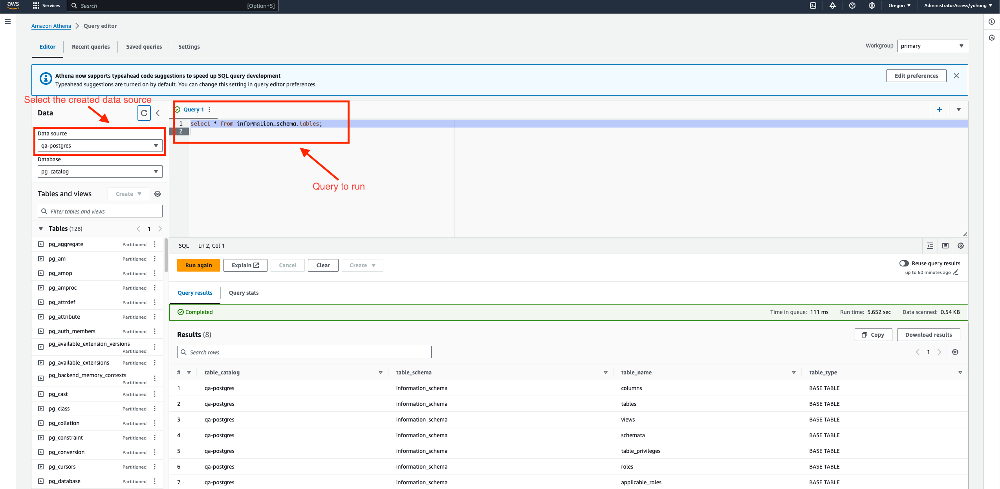

# How to deploy a Halo Duchy on EKS

## Background

The configuration for the [`dev` environment](../../src/main/k8s/dev) can be
used as the basis for deploying CMMS components using Amazon Elastic Kubernetes
Service (EKS) on another AWS Cloud project.

***Disclaimer***:

-   This guide is just one way of achieving the goal, not necessarily the best
    approach.
-   Almost all steps can be done via either the
    [AWS Cloud Console](https://console.aws.amazon.com/) UI or the
    [`aws` CLI](https://aws.amazon.com/cli/). The doc picks the easier one for
    each step. But you are free to do it in an alternative way.
-   All names used in this doc can be replaced with something else. We use
    specific names in the doc for ease of reference.
-   All quotas and resource configs are just examples, adjust the quota and size
    based on the actual usage.
-   In the doc, we assume we are deploying to a single region, i.e. us-west-2.
    If you are deploying to another region or multiple regions, just need to
    adjust each step mentioning "region" accordingly.

## What are we creating/deploying?

See the
[example Terraform configuration](../../src/main/terraform/aws/examples/duchy)
to see what resources are created.

For a Duchy named `worker2`, the cluster will be populated with the following:

-   Secret
    -   `certs-and-configs-<hash>`
-   ConfigMap
    -   `config-files-<hash>`
-   Deployment
    -   `worker2-async-computation-control-server-deployment`
    -   `worker2-computation-control-server-deployment` (System API server)
    -   `worker2-herald-daemon-deployment`
    -   `worker2-requisition-fulfillment-server-deployment` (Public API server)
    -   `worker2-spanner-computations-server-deployment` (Internal API server)
    -   `worker2-mill-job-scheduler-deployment`
-   Service
    -   `worker2-async-computation-control-server` (Cluster IP)
    -   `worker2-internal-api-server` (Cluster IP)
    -   `worker2-computation-control-server` (External load balancer)
    -   `worker2-requisition-fulfillment-server` (External load balancer)
-   PodTemplate
    -   `worker2-llv2-mill`
    -   `worker2-hmss-mill`
-   CronJob
    -   `worker2-computations-cleaner-cronjob`
-   NetworkPolicy
    -   `default-deny-network-policy`
    -   `kube-dns-network-policy`
    -   `worker2-async-computation-controls-server-network-policy`
    -   `worker2-computation-control-server-network-policy`
    -   `worker2-computations-cleaner-network-policy`
    -   `worker2-herald-daemon-network-policy`
    -   `worker2-mill-job-scheduler-network-policy`
    -   `worker2-llv2-mill-network-policy`
    -   `worker2-hmss-mill-network-policy`
    -   `worker2-requisition-fulfillment-server-network-policy`
    -   `worker2-spanner-computations-server-network-policy`
-   Role
    -   `worker2-mill-job-scheduler`
-   RoleBinding
    -   `worker2-mill-job-scheduler-binding`

## Before you start

See [Machine Setup](machine-setup.md).

## Register your Duchy with the Kingdom (offline)

In order to join the Cross-Media Measurement System, the Duchy needs to first be
registered with the Kingdom. This will be done offline with the help from the
Kingdom operator.

The Duchy operator needs to share the following information with the Kingdom
operator:

-   The name (a string, used as an ID) of the Duchy (unique amongst all Duchies)
-   The CA ("root") certificate
-   A consent signaling ("leaf") certificate

The Kingdom operator will
[register all corresponding resources](../operations/creating-resources.md) for
the Duchy via internal admin tools. The resource names will be shared with the
Duchy operator.

## Provision AWS cloud infrastructure

This can be done using Terraform. See [the guide](terraform.md) to use the
example configuration for the Duchy.

Applying the Terraform configuration will create a new cluster. You can use the
`aws` CLI to obtain credentials so that you can access the cluster via
`kubectl`. For example:

```shell
aws eks update-kubeconfig --region us-west-2 --name worker2-duchy
```

Applying the Terraform configuration will also create external IP resources and
output the EIP allocation IDs. These will be needed in later steps.

## Build and push the container images (optional)

If you aren't using
[pre-built release images](https://github.com/orgs/world-federation-of-advertisers/packages?repo_name=cross-media-measurement),
you can build the images yourself from source and push them to a container
registry. For example, if you're using the
[Amazon Elastic Container Registry](https://aws.amazon.com/ecr/), you would
specify `<account-id>.dkr.ecr.<account-region>.amazonaws.com` as your container
registry and your Cloud project name as your image repository prefix.

Assuming a project named `halo-worker2-demo`, an image tag `build-0001` and
targeting aws account `010295286036` in `us-west-2` region, run the following to
build and push the images:

```shell
bazel run -c opt //src/main/docker:push_all_duchy_eks_images \
  --define container_registry=010295286036.dkr.ecr.us-west-2.amazonaws.com \
  --define image_repo_prefix=halo-worker2-demo \
  --define image_tag=build-0001
```

Tip: If you're using [Hybrid Development](../building.md#hybrid-development) for
containerized builds, replace `bazel build` with `tools/bazel-container build`
and `bazel run` with `tools/bazel-container-run`.

## Add metrics to the cluster (optional)

See [Metrics Deployment](metrics-deployment.md).

## Generate the K8s Kustomization

Populating a cluster is generally done by applying a K8s Kustomization. You can
use the `dev` configuration as a base to get started. The Kustomization is
generated using Bazel rules from files written in [CUE](https://cuelang.org/).

To generate the `dev` Kustomization, run the following (substituting your own
values):

```shell
bazel build //src/main/k8s/dev:worker2_duchy_aws.tar \
  --define kingdom_system_api_target=v1alpha.system.kingdom.dev.halo-cmm.org:8443 \
  --define s3_bucket=halo-cmm-dev-bucket \
  --define s3_region=us-west-2 \
  --define duchy_cert_id=Yq3IyKAQ5Qc \
  --define postgres_host=dev-postgres.c7lbzsffeehq.us-west-2.rds.amazonaws.com \
  --define postgres_port=5432 \
  --define postgres_region=us-west-2 \
  --define postgres_credential_secret_name="rds\!db-b4bebc1a-b72d-4d6f-96d4-d3cde3c6af91" \
  --define duchy_public_api_eip_allocs="eipalloc-1234abc,eipalloc-5678def" \
  --define duchy_system_api_eip_allocs="eipalloc-1234def,eipalloc-5678abc" \
  --define container_registry=ghcr.io \
  --define image_repo_prefix=world-federation-of-advertisers \
  --define image_tag=0.5.2
```

Extract the generated archive to some directory. It is recommended that you
extract it to a secure location, as you will be adding sensitive information to
it in the following step. It is also recommended that you persist this directory
so that you can use it to apply updates

You can customize this generated object configuration with your own settings
such as the number of replicas per deployment, the memory and CPU requirements
of each container, and the JVM options of each container.

## Customize the K8s secret

We use a K8s secret to hold sensitive information, such as private keys.

The Duchy binaries are configured to read certificates and config files from a
mounted Kubernetes secret volume.

Prepare all the files we want to include in the Kubernetes secret. The following
files are required in a Duchy:

1.  `all_root_certs.pem`

    This makes up the TLS trusted CA store for the Duchy. It's the concatenation
    of the CA ("root") certificates for all the entites that connect to the
    Duchy, including:

    -   All other Duchies
    -   EDPs that select to fulfill requisitions at this Duchy
    -   This Duchy's own CA certificate (for Duchy internal traffic)

    Supposing your root certs are all in a single folder and end with
    `_root.pem`, you can concatenate them all with a simple shell command:

    ```shell
    cat *_root.pem > all_root_certs.pem
    ```

    Note: This assumes that all your root certificate PEM files end in newline.

1.  `worker2_tls.pem`

    The `worker2` Duchy's TLS certificate in PEM format.

1.  `worker2_tls.key`

    The private key for the TLS certificate in PEM format.

1.  `worker2_cs_cert.der`

    The `worker2` Duchy's consent signaling certificate in DER format.

1.  `worker2_cs_private.der`

    The private key for the Duchy's consent signaling certificate in DER format.

1.  `duchy_cert_config.textproto`

    Configuration mapping Duchy root certificates to the corresponding Duchy ID.

    -   [Example](../../src/main/k8s/testing/secretfiles/duchy_cert_config.textproto)

1.  `xxx_protocols_setup_config.textproto` (replace xxx with the role)

    -   This contains information about the protocols run in the duchy
    -   Set the role (aggregator or non_aggregator) in the config appropriately
    -   [Example](../../src/main/k8s/testing/secretfiles/aggregator_protocols_setup_config.textproto)

1.  `worker2_kek.tink`

    Key encryption key used in HMSS protocol to encrypt Tink key pairs.

    -   One way to create the key is to use the Tinkey command line tool

        ```shell
        tinkey create-keyset --key-template AES128_GCM --out-format binary --out worker2_kek.tink
        ```

    -   [Example](../../src/main/k8s/testing/secretfiles/worker2_kek.tink)

Place these files into the `src/main/k8s/dev/worker2_duchy_secret/` path within
the Kustomization directory.

### Secret files for testing

There are some [secret files](../../src/main/k8s/testing/secretfiles) within the
repository. These can be used for testing, but **must not** be used for
production environments as doing so would be highly insecure.

Generate the archive:

```shell
bazel build //src/main/k8s/testing/secretfiles:archive
```

Extract the generated archive to the `src/main/k8s/dev/worker2_duchy_secret/`
path within the Kustomization directory.

## Customize the K8s configMap

Configuration that may frequently change is stored in a K8s configMap. The `dev`
configuration uses one named `config-files` containing the file
`authority_key_identifier_to_principal_map.textproto`.

Place this file in the `src/main/k8s/dev/config_files/` path within the
Kustomization directory.

See [Creating Resources](../operations/creating-resources.md) for information on
this file format.

## Apply the K8s Kustomization

Use `kubectl` to apply the Kustomization. From the Kustomization directory run:

```shell
kubectl apply -k src/main/k8s/dev/worker2_duchy_aws
```

Now all Duchy components should be successfully deployed to your EKS cluster.
You can verify by running

```shell
kubectl get deployments
```

and

```shell
kubectl get services
```

You should see something like the following:

```
NAME                                                READY UP-TO-DATE AVAILABLE AGE
worker2-async-computation-control-server-deployment 1/1   1          1         1m
worker2-computation-control-server-deployment       1/1   1          1         1m
worker2-herald-daemon-deployment                    1/1   1          1         1m
worker2-liquid-legions-v2-mill-daemon-deployment    1/1   1          1         1m
worker2-requisition-fulfillment-server-deployment   1/1   1          1         1m
worker2-spanner-computations-server-deployment      1/1   1          1         1m
```

```
NAME                                       TYPE           CLUSTER-IP       EXTERNAL-IP                                                                    PORT(S)          AGE
kubernetes                                 ClusterIP      172.20.0.1       <none>                                                                         443/TCP          27d
worker2-async-computation-control-server   ClusterIP      172.20.140.121   <none>                                                                         8443/TCP         27d
worker2-computation-control-server         LoadBalancer   172.20.149.9     k8s-default-worker2c-654c985a4d-a42255de14c5da74.elb.us-west-2.amazonaws.com   8443:31123/TCP   27d
worker2-internal-api-server                ClusterIP      172.20.16.155    <none>                                                                         8443/TCP         27d
worker2-requisition-fulfillment-server     LoadBalancer   172.20.131.74    k8s-default-worker2r-c107e4a034-81f68e7731e3ee0b.elb.us-west-2.amazonaws.com   8443:32751/TCP   27d
```

## Set up Athena to query the Postgres Database

Follow this
[instruction](https://docs.aws.amazon.com/athena/latest/ug/connectors-postgresql.html)
to create an athena_postgres_connector. This instruction will guide you to:

1.  create a lambda function that will be used to execute queries against
    Postgres.

    Configs for creating the lambda function:

    *   The SecretNamePrefix should be `rds`.
    *   The ConnectionString should be something like
        `postgres://jdbc:postgresql://{postgres_hostname}:5432/postgres?secret=${secret_name}`.

        Take QA env as example:

        *   `postgres_hostname` is
            `qa-postgres.cncisa22uo1o.us-west-2.rds.amazonaws.com`
        *   `secret_name` is `rds!db-04a89418-6fe8-4c5d-a870-d281981eec5b`

    *   The Subnets should contain at two db subnet Ids, which could be found
        from the RDS connection console.

        For example:

        *   `subnet-0e3cdc48416db8801` tagged as halo-cmm-qa-db-us-west-2a
        *   `subnet-08dc813bdebc2e5c1` tagged as halo-cmm-qa-db-us-west-2b

    *   The Security should be the eks-cluster-worker2-duchy security group.

        e.g.

        *   `sg-035eaa8e939aa6a26` tagged as
            eks-cluster-sg-worker2-duchy-104327146.

    *   Other configs could be left as default.

2.  create an Athena data source with the above created connection.

3.  run Athena query in query edition.

    

## Q/A

### Q1. How to generate certificates/key pairs?

Refer to the
[GKE answer](../gke/duchy-deployment.md#q1-how-to-generate-certificateskey-pairs)

### Q2. What if the secret or configuration files need to be updated?

Modify the Kustomization directory and re-apply it.

### Q3. How to test if the Duchy is working properly?

Since only Duchy can be run in AWS, all other resources for correctness test
still has to be created in GKE. The same
["How to complete multi-cluster correctnessTest on GKE"](../gke/correctness-test.md)
doc could still be used to complete a correctness test using the duchy you have
deployed to AWS.
