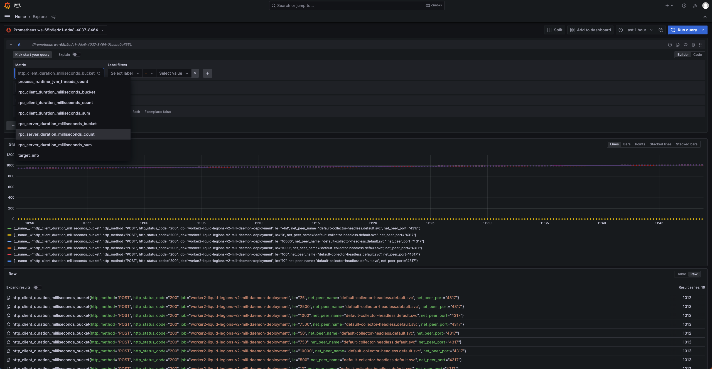

# Halo Metrics Deployment on EKS

Getting visibility into CMMS metrics using Amazon Managed Service for Prometheus
and Grafana.

## Background

We can use [Amazon Managed Prometheus (AMP)](https://aws.amazon.com/prometheus/)
to collect metrics from EKS cluster and then viewing them in
[Amazon Managed Grafana](https://aws.amazon.com/grafana/) dashboards. Using
OpenTelemetry we can also collect more detailed metrics from CMMS component
pods.

The configuration for the [`dev` environment](../../src/main/k8s/dev) can be
used as the basis for deploying CMMS components using Amazon Elastic Kubernetes
Service (EKS) on another AWS Cloud project.

Many operations can be done either via the `aws` CLI or the AWS web console.
This guide picks whichever is most convenient for that operation. Feel free to
use whichever you prefer.

### What are we creating/deploying?

*   OpenTelemetryCollector
    *   `default`
*   OpenTelemetry Instrumentation
    *   `open-telemetry-java-agent`
*   NetworkPolicy
    *   `opentelemetry-collector-network-policy`
    *   `to-opentelemetry-collector-network-policy`

## Before you start

Deploy a Halo component. See the related guides:
[Create Duchy Cluster](duchy-deployment.md)

## Create a workspace in Amazon Managed Prometheus

Go to the
[Amazon Managed Service for Prometheus](https://us-east-1.console.aws.amazon.com/prometheus/home?region=us-east-1#/)
page, and using the `Create` button and follow the instructions to create a new
workspace.

Then retrieve the remote write URL endpoint of this workspace from the AWS web
console which will be used in later steps. It will be a URL like
`https://aps-workspaces.<region>.amazonaws.com/workspaces/<id>/api/v1/remote_write`

## Create a workspace in Amazon Managed Grafana

Go to the
[Amazon Managed Service for Grafana](https://us-east-1.console.aws.amazon.com/grafana/home?region=us-east-1)
page, and using the `Create` button and follow the instructions to create a new
workspace.

Once created, follow this
[doc](https://docs.aws.amazon.com/prometheus/latest/userguide/AMP-onboard-amg.html)
to set up Amazon Managed Grafana for use with Amazon Managed Service for
Prometheus.

## Set up EKS cluster to send metric to AMP

[AWS Distro for OpenTelemetry (ADOT)](https://aws-otel.github.io/) is a secure,
production-ready, AWS-supported distribution of the OpenTelemetry project that
can help publishing EKS cluster metrics to Amazon Managed Prometheus. Follow
[Install ADOT](https://docs.aws.amazon.com/eks/latest/userguide/adot-manage.html#adot-install)
doc to create:

*   the ADOT addon to the existing EKS cluster. (using console to install the
    version `v0.80.0-eksbuild.2`. There were some breaking changes in later
    versions.)
*   a service account that allows ADOT addon to publish metrics to Amazon
    Managed Prometheus.

    ```shell
    # command to create service account
    eksctl create iamserviceaccount \
      --name adot-collector \
      --namespace default \
      --cluster worker2-duchy \
      --attach-policy-arn arn:aws:iam::aws:policy/AmazonPrometheusRemoteWriteAccess \
      --attach-policy-arn arn:aws:iam::aws:policy/AWSXrayWriteOnlyAccess \
      --attach-policy-arn arn:aws:iam::aws:policy/CloudWatchAgentServerPolicy \
      --approve \
      --override-existing-serviceaccounts
    ```

With ADOT addon, EKS cluster can publish metrics to AMP through the remote write
url, see [open telemetry config](#opentelemetry-collectors-and-instrumentation)

## Create the K8s Object Configurations

Deploying to the cluster is generally done by applying a K8s object
configuration file. You can use the `dev` configurations as a base to get
started. The `dev` configurations are YAML files that are generated from files
written in [CUE](https://cuelang.org/) using Bazel rules.

You can customize the generated object configuration as-needed.

### OpenTelemetry Collectors and Instrumentation

The default `dev` configuration for OpenTelemetry collection is in
[`open_telemetry_eks.cue`](../../src/main/k8s/dev/open_telemetry_eks.cue), which
depends on [`open_telemetry.cue`](../../src/main/k8s/open_telemetry.cue).

The default build target is `//src/main/k8s/dev:open_telemetry_eks`.

The generated `OpenTelemetryCollector` should have `prometheusremotewrite`
exporter similar to:

```yaml
        exporters:
          prometheusremotewrite:
            endpoint: https://aps-workspaces.us-west-2.amazonaws.com/workspaces/ws-65b9edc1-dda8-4037-8464-01eebe0e7651/api/v1/remote_write
            auth:
              authenticator: sigv4auth
```

## Apply the K8s Object Configurations

### Install cert-manager

You must use a [cert-manager](https://github.com/cert-manager/cert-manager/),
[OpenTelemetry Operator](https://github.com/open-telemetry/opentelemetry-operator/),
and collector image that are compatible with each other. See the
[Compatibility matrix](https://github.com/open-telemetry/opentelemetry-operator#compatibility-matrix)
and the collector image specified in
[`open_telemetry.cue`](../../src/main/k8s/open_telemetry.cue).

```shell
kubectl apply -f https://github.com/cert-manager/cert-manager/releases/download/v1.14.5/cert-manager.yaml
```

### Install OpenTelemetry Operator

```shell
kubectl apply -f https://github.com/open-telemetry/opentelemetry-operator/releases/download/v0.99.0/opentelemetry-operator.yaml
```

### Apply OpenTelemetry and Prometheus Configurations

You can just use `kubectl apply`, specifying the configuration files you created
in the previous step.

## Restart Deployments to Start Collecting Metrics

You will need to restart all the Deployments to pick up the Java agent
instrumentation.

```shell
for deployment in $(kubectl get deployments -o name); do kubectl rollout restart $deployment; done
```

## View metrics in Amazon Managed Grafana

Once the setup is done, you should be able to view the metrics in Amazon Managed
Grafana like: 

## Adding Additional Metrics

The above adds OpenTelemetry JVM and RPC metrics. With the above as a base, it
is possible to add other metrics that can be scraped.

### kubelet and cAdvisor

See
[kubelet](https://cloud.google.com/stackdriver/docs/managed-prometheus/setup-managed#kubelet-metrics)

## Exported Metrics

### Automatic Java instrumentation

-   rpc_client_duration_bucket
-   rpc_client_duration_count
-   rpc_client_duration_sum
-   rpc_server_duration_bucket
-   rpc_server_duration_count
-   rpc_server_duration_sum
-   process_runtime_jvm_buffer_count
-   process_runtime_jvm_buffer_limit
-   process_runtime_jvm_buffer_usage
-   process_runtime_jvm_classes_current_loaded
-   process_runtime_jvm_classes_loaded
-   process_runtime_jvm_classes_unloaded
-   process_runtime_jvm_cpu_utilization
-   process_runtime_jvm_memory_committed
-   process_runtime_jvm_memory_init
-   process_runtime_jvm_memory_limit
-   process_runtime_jvm_memory_usage
-   process_runtime_jvm_system_cpu_load_1m
-   process_runtime_jvm_system_cpu_utilization
-   process_runtime_jvm_threads_count

### Halo instrumentation

-   halo_cmm_thread_pool_size
-   halo_cmm_thread_pool_active_count
-   halo_cmm_computation_stage_crypto_cpu_time_seconds
-   halo_cmm_computation_stage_crypto_time_seconds
-   halo_cmm_computation_stage_time_seconds
-   halo_cmm_retention_deleted_measurements
-   halo_cmm_retention_deleted_exchanges
-   halo_cmm_retention_cancelled_measurements
