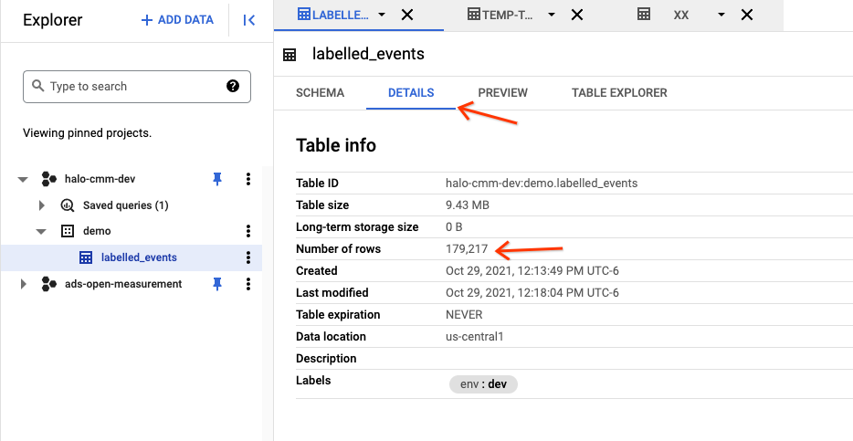

# Correctness Test on GKE

How to run the Kubernetes correctness test against a CMMS using simulators on
GKE.

## Overview

In order to run the correctness test, it is assumed that the CMMS instance has a
Kingdom as well as Duchies named `worker1`, `worker2`, and `aggregator`.

See the [Kingdom deployment guide](kingdom-deployment.md) and
[Duchy deployment guide](duchy-deployment.md).

Note: The test currently also assumes that the CMMS instance is using the
[testing secret files](kingdom-deployment.md#secret-files-for-testing).
Therefore, the correctness test cannot be run on a production CMMS instance.

## Run ResourceSetup

The `ResourceSetup` tool will create API resources for testing. If you have not
yet run the `ResourceSetup` tool against this CMMS instance, you will need to do
so. Note that this can only be done once per instance, and requires access to
the Kingdom cluster.

First, build the tool:

```shell
bazel build //src/main/kotlin/org/wfanet/measurement/loadtest/resourcesetup:ResourceSetup
```

We'll then need to be able to access the internal API from the host machine.
This can be done by forwarding the service port:

```shell
kubectl port-forward --address=localhost services/gcp-kingdom-data-server 9443:8443
```

Then run the tool, outputting to some directory (e.g. `/tmp/resource-setup`):

```shell
src/main/k8s/testing/resource_setup.sh \
  --kingdom-public-api-target=v2alpha.kingdom.dev.halo-cmm.org:8443 \
  --kingdom-internal-api-target=localhost:9443 \
  --bazel-config-name=halo-dev \
  --output-dir=/tmp/resource-setup
```

Tip: The job will output a `resource-setup.bazelrc` file with `--define` options
that you can include in your `.bazelrc` file. You can then specify
`--config=halo-dev` to Bazel commands instead of those individual options.

### Update the Kingdom

After running the `ResourceSetup` tool, you will need to update the Kingdom
using its output. Copy the entries from the
`authority_key_identifier_to_principal_map.textproto` file output by the
`ResourceSetup` tool into your Kingdom Kustomization directory. You can then
apply the Kustomization to update the running Kingdom.

Assuming your KUBECONFIG is pointing at the Kingdom cluster, run the following
from the Kustomization directory:

```shell
kubectl apply -k src/main/k8s/dev/kingdom
```

## Configure event data source

There are two data sources that can be used for
[test events](../../src/main/proto/wfa/measurement/api/v2alpha/event_templates/testing/test_event.proto):

1.  Synthetic generator

    Events are generated according to
    [simulator synthetic data specifications](../../src/main/proto/wfa/measurement/api/v2alpha/event_group_metadata/testing/simulator_synthetic_data_spec.proto),
    consisting of a single `SyntheticPopulationSpec` and a
    `CartesianSyntheticEventGroupSpecRecipe` for each `EventGroup`. There are
    default specifications included, but you can replace these with your own
    after before you apply the K8s Kustomization.

2.  BigQuery table

    Events are read from a Google Cloud BigQuery table. See the section below on
    how to populate the table.

### Populate BigQuery table

We can upload pre-generated synthetic test data from the
[synthetic-labelled-events.csv](../../src/main/k8s/testing/data/synthetic-labelled-events.csv)
file.

1.  Visit the GCloud console
    [Bigquery](https://console.cloud.google.com/bigquery) page. Enable the
    BiqQuery API in the project if you haven't done it yet.
2.  Create a dataset
    -   Click the three-dot button to the right of the project
    -   Click `Create dataset`
    -   Set the "Dataset ID" to `demo`
    -   Set the "data location" to (e.g. `us-central1`)
    -   Click `CREATE DATASET`
3.  Create a table
    -   Click the three-dot button to the right of the `demo` data set.
    -   Click `create table`
    -   Set "create table from" to `upload`
    -   Select the local file `halo-cmm-test-labelled-events.csv` in your local
        branch
    -   Set Destination Table to `labelled_events`
    -   Check the Schema -> Auto detect box
    -   Click `CREATE TABLE`
    -   You should see a table named `labelled_events` being created. But the
        `create table` window might still be open, just click `CANCEL` to quit
        it.
4.  Check the table is valid
    -   Click on the `labelled_events` table. You should see something like this



You will need to ensure that the simulator service account has access to this
table. See
[Granting BigQuery table access](cluster-config.md#granting-bigquery-table-access).

## Deploy EDP simulators

The correctness test assumes that you have six Event Data Provider (EDP)
simulators running, each acting as a different fake `DataProvider`.

### Initial setup

1.  Create a K8s cluster

    The simulators can run in their own cluster. You can use the Google Cloud
    SDK to create a new one, substituting your own
    [Use least privilege service account](https://cloud.google.com/kubernetes-engine/docs/how-to/hardening-your-cluster#use_least_privilege_sa)
    address:

    ```shell
    gcloud container clusters create simulators \
    --service-account="gke-cluster@halo-cmm-demo.iam.gserviceaccount.com" \
    --num-nodes=4 --enable-autoscaling --min-nodes=4 --max-nodes=8 \
    --machine-type=e2-small
    ```

    Point your KUBECONFIG to this cluster:

    ```shell
    gcloud container clusters get-credentials simulators
    ```

1.  Create a `simulator` K8s service account

    The underlying IAM service account must be able to create BigQuery jobs and
    access the `labelled_events` BigQuery table. See the
    [configuration guide](cluster-config.md#workload-identity) for details.

### Build and push simulator image

If you aren't using pre-built release images, you can build the image yourself
from source and push them to a container registry. For example, if you're using
the [Google Container Registry](https://cloud.google.com/container-registry),
you would specify `gcr.io` as your container registry and your Cloud project
name as your image repository prefix.

The build target to use depends on the event data source. Assuming a project
named `halo-cmm-demo` and an image tag `build-0001`, run the following to build
and push the image:

*   Synthetic generator

    ```shell
    bazel run -c opt //src/main/docker:push_synthetic_generator_edp_simulator_runner_image \
      --define container_registry=gcr.io \
      --define image_repo_prefix=halo-cmm-demo --define image_tag=build-0001
    ```

*   BigQuery

    ```shell
    bazel run -c opt //src/main/docker:push_bigquery_edp_simulator_runner_image \
      --define container_registry=gcr.io \
      --define image_repo_prefix=halo-cmm-demo --define image_tag=build-0001
    ```

### Generate K8s Kustomization

Run the following, substituting your own values:

*   Synthetic generator

    ```shell
    bazel build //src/main/k8s/dev:synthetic_generator_edp_simulators.tar \
    --define=kingdom_public_api_target=v2alpha.kingdom.dev.halo-cmm.org:8443 \
    --define=duchy_public_api_target=public.worker1.dev.halo-cmm.org:8443 \
    --define=mc_name=measurementConsumers/TGWOaWehLQ8 \
    --define=edp1_name=dataProviders/HRL1wWehTSM \
    --define=edp1_cert_name=dataProviders/HRL1wWehTSM/certificates/HRL1wWehTSM \
    --define=edp2_name=dataProviders/djQdz2ehSSE \
    --define=edp2_cert_name=dataProviders/djQdz2ehSSE/certificates/djQdz2ehSSE \
    --define=edp3_name=dataProviders/SQ99TmehSA8 \
    --define=edp3_cert_name=dataProviders/SQ99TmehSA8/certificates/SQ99TmehSA8 \
    --define=edp4_name=dataProviders/TBZkB5heuL0 \
    --define=edp4_cert_name=dataProviders/TBZkB5heuL0/certificates/TBZkB5heuL0 \
    --define=edp5_name=dataProviders/HOCBxZheuS8 \
    --define=edp5_cert_name=dataProviders/HOCBxZheuS8/certificates/HOCBxZheuS8 \
    --define=edp6_name=dataProviders/VGExFmehRhY \
    --define=edp6_cert_name=dataProviders/VGExFmehRhY/certificates/VGExFmehRhY \
    --define container_registry=gcr.io \
    --define image_repo_prefix=halo-cmm-demo --define image_tag=build-0001
    ```

    The resulting archive will contain `CartesianSyntheticEventGroupSpecRecipe`
    messages in text format under
    `src/main/k8s/dev/synthetic_generator_config_files/`. These can be replaced
    in order to customize the synthetic generator.

*   BigQuery

    ```shell
    bazel build //src/main/k8s/dev:bigquery_edp_simulators.tar \
      --define=kingdom_public_api_target=v2alpha.kingdom.dev.halo-cmm.org:8443 \
      --define=duchy_public_api_target=public.worker1.dev.halo-cmm.org:8443 \
      --define=mc_name=measurementConsumers/TGWOaWehLQ8 \
      --define=edp1_name=dataProviders/HRL1wWehTSM \
      --define=edp1_cert_name=dataProviders/HRL1wWehTSM/certificates/HRL1wWehTSM \
      --define=edp2_name=dataProviders/djQdz2ehSSE \
      --define=edp2_cert_name=dataProviders/djQdz2ehSSE/certificates/djQdz2ehSSE \
      --define=edp3_name=dataProviders/SQ99TmehSA8 \
      --define=edp3_cert_name=dataProviders/SQ99TmehSA8/certificates/SQ99TmehSA8 \
      --define=edp4_name=dataProviders/TBZkB5heuL0 \
      --define=edp4_cert_name=dataProviders/TBZkB5heuL0/certificates/TBZkB5heuL0 \
      --define=edp5_name=dataProviders/HOCBxZheuS8 \
      --define=edp5_cert_name=dataProviders/HOCBxZheuS8/certificates/HOCBxZheuS8 \
      --define=edp6_name=dataProviders/VGExFmehRhY \
      --define=edp6_cert_name=dataProviders/VGExFmehRhY/certificates/VGExFmehRhY \
      --define container_registry=gcr.io \
      --define=google_cloud_project=halo-cmm-demo \
      --define=bigquery_dataset=demo \
      --define=bigquery_table=labelled_events \
      --define image_repo_prefix=halo-cmm-demo --define image_tag=build-0001
    ```

Extract the generated archive to some directory.

### Apply K8s Kustomization

From the Kustomization directory, run

*   Synthetic generator

    ```shell
    kubectl apply -k src/main/k8s/dev/synthetic_generator_edp_simulators
    ```

*   BigQuery

    ```shell
    kubectl apply -k src/main/k8s/dev/bigquery_edp_simulators
    ```

## Run the correctness test

Run the following, substituting your own values:

*   Synthetic generator

    ```shell
    bazel test //src/test/kotlin/org/wfanet/measurement/integration/k8s:SyntheticGeneratorCorrectnessTest
    --test_output=streamed \
    --define=kingdom_public_api_target=v2alpha.kingdom.dev.halo-cmm.org:8443 \
    --define=mc_name=measurementConsumers/Rcn7fKd25C8 \
    --define=mc_api_key=W9q4zad246g
    ```

*   BigQuery

    ```shell
    bazel test //src/test/kotlin/org/wfanet/measurement/integration/k8s:BigQueryCorrectnessTest
      --test_output=streamed \
      --define=kingdom_public_api_target=v2alpha.kingdom.dev.halo-cmm.org:8443 \
      --define=mc_name=measurementConsumers/Rcn7fKd25C8 \
      --define=mc_api_key=W9q4zad246g \
      --define=google_cloud_project=halo-cmm-demo \
      --define=bigquery_dataset=demo \
      --define=bigquery_table=labelled_events
    ```

The test generally takes around 6 minutes to complete, since that is how long
the MPC protocol takes to finish. Eventually, you should see logs like this

```
Jan 27, 2022 12:47:01 AM org.wfanet.measurement.loadtest.frontend.FrontendSimulator process
INFO: Created measurement measurementConsumers/TGWOaWehLQ8/measurements/Y6gTFpj__3g.
Jan 27, 2022 12:47:02 AM org.wfanet.measurement.loadtest.frontend.FrontendSimulator process
INFO: Computation not done yet, wait for another 30 seconds.
Jan 27, 2022 12:47:32 AM org.wfanet.measurement.loadtest.frontend.FrontendSimulator process
...
...
Jan 27, 2022 12:52:33 AM org.wfanet.measurement.loadtest.frontend.FrontendSimulator process
INFO: Got computed result from Kingdom: reach {
  value: 11542
}
frequency {
  relative_frequency_distribution {
    key: 1
    value: 0.2601439790575916
  }
  relative_frequency_distribution {
    key: 2
    value: 0.17981020942408377
  }
  ...
}
Jan 27, 2022 12:52:39 AM org.wfanet.measurement.loadtest.frontend.FrontendSimulator process
INFO: Expected result: reach {
  value: 11570
}
frequency {
  relative_frequency_distribution {
    key: 1
    value: 0.25174145472217724
  }
  relative_frequency_distribution {
    key: 2
    value: 0.18078729953021222
  }
  ...
}
Jan 27, 2022 12:52:40 AM org.wfanet.measurement.loadtest.frontend.FrontendSimulator process
INFO: Computed result is equal to the expected result. Correctness Test passes.
```

## How to monitor the computation after a measurement is created?

There are two places you can monitor the process of a measurement. The log of
various pods and the Kingdom Spanner table.

For monitoring purposes, we will mainly use the GCloud Spanner UI to query the
databases. If something is wrong, we will see logs to debug.

1.  Visit the GCloud console
    [spanner](https://console.cloud.google.com/spanner/instances) page.
2.  Select your instance
3.  Select the `kingdom` database.
4.  Click Query on the left

### Query the measurement status

```
SELECT
  MeasurementId,
  CASE State
    WHEN 1 THEN "PENDING_REQUISITION_PARAMS"
    WHEN 2 THEN "PENDING_REQUISITION_FULFILLMENT"
    WHEN 3 THEN "PENDING_PARTICIPANT_CONFIRMATION"
    WHEN 4 THEN "PENDING_COMPUTATION"
    WHEN 5 THEN "SUCCEEDED"
    WHEN 6 THEN "FAILED"
    WHEN 7 THEN "CANCELLED"
    ELSE "MEASUREMENT_STATE_UNKNOWN"
  END AS State,
  CAST(JSON_VALUE(MeasurementDetailsJson, '$.encryptedResult') AS STRING) AS Result,
FROM
  Measurements
```

Example result


Note that the final result is encrypted, so you won't be able to see the reach
and frequency result in plaintext.

### Query the requisition status

```
SELECT
  MeasurementId,
  RequisitionId,
  CASE State
    WHEN 1 THEN "PENDING_PARAMS"
    WHEN 2 THEN "UNFULFILLED"
    WHEN 3 THEN "FULFILLED"
    WHEN 4 THEN "REFUSED"
    ELSE "STATE_UNKNOWN"
  END AS State,
FROM
  Requisitions
```

Example result 

If all requisitions are stuck at `UNFULFILLED` state for more than 1 minute,
then something is wrong.

### Query the MPC protocol progress

```
SELECT
  MeasurementId,
  FORMAT_TIMESTAMP("%Y-%m-%d %H:%M:%E2S", CreateTime) as CreateTime,
  CASE DuchyId
    WHEN 1234 THEN "Aggregator"
    WHEN 2345 THEN "Worker 1"
    WHEN 3456 THEN "Worker 2"
    ELSE "UNKNOWN"
  END as MpcWoker,
  JSON_VALUE(DuchyMeasurementLogDetailsJson,'$.stageAttempt.stageName') AS StageName,
  JSON_VALUE(DuchyMeasurementLogDetailsJson,'$.stageAttempt.attemptNumber') AS Attempt,
FROM DuchyMeasurementLogEntries
ORDER BY CreateTime DESC
```

Example result


## Troubleshooting

If anything is wrong, first check

1.  if the resource name in the commands is correct.
2.  if you have created the secret in all clusters and configmap in all clusters
    but the simulator cluster
3.  if you have set the DNS record for all kingdom and duchies public and system
    APIs. (In total, there are 8 of them).

### Requisition can not be fulfilled

Check the log of any EDP simulator, if the FulfillRequisition RPC fails, it is
highly likely that the IP address the simulator sends traffic to is not correct.
If you are reusing the same subdomain and are updating its IP address, the
update may not be effective for a long time. So the best practice is to create a
new Type A record instead of updating an existing one.
