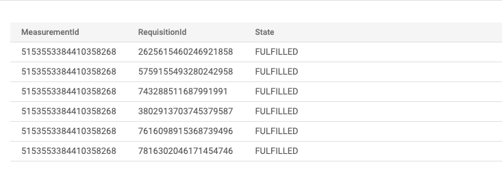

# Multi-cluster Correctness Test on GKE

This documentation provides step-by-step instructions on how to complete a GKE
multi-cluster correctness test for the Cross-Media Measurement system.

For the purposes of the correctness test, we use
[testing files](../../src/main/k8s/testing) that are checked-in to the
repository. These are *not* suitable for a production environment.

## Overview

In the correctness test, we will create

-   4 Spanner databases
    -   One for each Duchy as well as the Kingdom.
    -   These can all be in the same Spanner instance.
-   1 BigQuery table (`demo.labelled_events`)
    -   This will contain pre-generated Synthetic test data that will be used by
        all EDP simulators.
-   5 Kubernetes clusters
    -   Kingdom
    -   Duchy `aggregator`
    -   Duchy `worker1`
    -   Duchy `worker2`
    -   Simulators
        -   6 EDP simulators
        -   1 MC frontend simulator

***Since we are doing multi-cluster deployment, you will need your own domain to
manage the DNS records of the Kingdom and Duchies' public and system APIs. Make
sure you have a domain you can configure.***

## Step 1. Deploy the Kingdom

Follow the steps in [Kingdom Deployment](kingdom-deployment.md), with the
following modifications:

*   Use the
    [testing secret files](kingdom-deployment.md#secret-files-for-testing) for
    your K8s secret.

## Step 2. Set up Kingdom API resources

We have a `resource-setup` job that can be run in the Kingdom cluster to create
the Kingdom API resources that we'll use for the test.

This will create:

*   1 `Account`
*   1 `MeasurementConsumer`
*   1 API key
*   6 `DataProvider`s, named `edp1` through `edp6`.
*   3 Duchy `Certificate`s, one for each of the three Duchies.

### Build and push container image

You can build and push the container for this job by running (substituting the
values for your container registry):

```shell
bazel run //src/main/docker:push_resource_setup_runner_image \
  -c opt --define container_registry=gcr.io \
  --define image_repo_prefix=halo-cmm-demo --define image_tag=build-0001
```

### Create and apply K8s manifest

You can generate the K8s manifest for this job using the
`//src/main/k8s/dev:resource_setup_gke` Bazel target. Run the following
(substituting your Kingdom secret name):

```shell
bazel build //src/main/k8s/dev:resource_setup_gke \
  --define=k8s_kingdom_secret_name=certs-and-configs-gb46dm7468 \
  --define container_registry=gcr.io \
  --define image_repo_prefix=halo-cmm-demo --define image_tag=build-0001
```

By default, this will generate the manifest at
`bazel-bin/src/main/k8s/dev/resource_setup_gke.yaml`. Copy this file to another
location and modify it to point to where you pushed the image. You can then
apply it using `kubectl`.

### Update ConfigMap

Look at the log for the resource setup job:

```shell
kubectl logs -f jobs/resource-setup-job
```

You should get something like

```
Jan 26, 2022 9:50:43 PM org.wfanet.measurement.loadtest.resourcesetup.ResourceSetup process
INFO: Starting with RunID: 2022-01-2621-50-31-988 ...
Jan 26, 2022 9:50:51 PM org.wfanet.measurement.loadtest.resourcesetup.ResourceSetup process
INFO: Successfully created data provider: dataProviders/HRL1wWehTSM
Jan 26, 2022 9:50:51 PM org.wfanet.measurement.loadtest.resourcesetup.ResourceSetup process
INFO: Successfully created data provider: dataProviders/djQdz2ehSSE
Jan 26, 2022 9:50:51 PM org.wfanet.measurement.loadtest.resourcesetup.ResourceSetup process
INFO: Successfully created data provider: dataProviders/SQ99TmehSA8
Jan 26, 2022 9:50:51 PM org.wfanet.measurement.loadtest.resourcesetup.ResourceSetup process
INFO: Successfully created data provider: dataProviders/TBZkB5heuL0
Jan 26, 2022 9:50:51 PM org.wfanet.measurement.loadtest.resourcesetup.ResourceSetup process
INFO: Successfully created data provider: dataProviders/HOCBxZheuS8
Jan 26, 2022 9:50:51 PM org.wfanet.measurement.loadtest.resourcesetup.ResourceSetup process
INFO: Successfully created data provider: dataProviders/VGExFmehRhY
Jan 26, 2022 9:50:58 PM org.wfanet.measurement.loadtest.resourcesetup.ResourceSetup process
INFO: Successfully created measurement consumer: measurementConsumers/TGWOaWehLQ8
Jan 26, 2022 9:50:58 PM org.wfanet.measurement.loadtest.resourcesetup.ResourceSetup process
INFO: API key for measurement consumer measurementConsumers/TGWOaWehLQ8: ZEhkVZhe1Q0
Jan 26, 2022 9:50:59 PM org.wfanet.measurement.loadtest.resourcesetup.ResourceSetup process
INFO: Successfully created certificate duchies/aggregator/certificates/DTDmi5he1do
Jan 26, 2022 9:50:59 PM org.wfanet.measurement.loadtest.resourcesetup.ResourceSetup process
INFO: Successfully created certificate duchies/worker1/certificates/Vr9cWmehKZM
Jan 26, 2022 9:50:59 PM org.wfanet.measurement.loadtest.resourcesetup.ResourceSetup process
INFO: Successfully created certificate duchies/worker2/certificates/QBC5Lphe1p0
```

Note: We will use the values from the log in future commands. You may wish to
save it.

Tip: The job will output a `resource-setup.bazelrc` file with `--define` options
that you can include in your `.bazelrc` file. You can then specify
`--config=halo-kind` to Bazel commands instead of those individual options.

Now that we know the `DataProvider` resource names, we can update the AKID
mapping in the `config-files` ConfigMap.

The resource setup job will output an
`authority_key_identifier_to_principal_map.textproto` file with entries for each
of the test EDPs, using the AKIDs from the test certificates in
[secretfiles](../../src/main/k8s/testing/secretfiles). You can copy this file
and use it to replace the ConfigMap:

```shell
kubectl create configmap config-files --output=yaml --dry-run=client \
  --from-file=authority_key_identifier_to_principal_map.textproto \
  | kubectl replace -f -
```

For more information on the file format, see
[Creating Resources](../operations/creating-resources.md).

You can then restart the Kingdom deployments that depend on `config-files`. At
the moment, this is just the public API server.

```shell
kubectl rollout restart deployments v2alpha-public-api-server-deployment
```

## Step 3. Prepare EDP test data

The EDP simulators read their labelled events from a dataset in Google Cloud
BigQuery. We can upload pre-generated synthetic test data from the
[synthetic-labelled-events.csv](../../src/main/k8s/testing/data/synthetic-labelled-events.csv)
file.

***(Note that in M1B, the EDP simulators do a fixed query since the EventFilter
implementation is not done yet. In other words, all measurements will have the
same result but with random noise. In M2, we will be able to specify query
parameters in the Frontend simulator and create different measurements.)***

1.  Visit the GCloud console
    [Bigquery](https://console.cloud.google.com/bigquery) page. Enable the
    BiqQuery API in the project if you haven't done it yet.
2.  Create a dataset
    -   Click the three-dot button to the right of the `halo-cmm-demo` project
    -   Click `Create dataset`
    -   Set the "Dataset ID" to `demo`
    -   Set the "data location" to `us-central1`
    -   Click `CREATE DATASET`
3.  Create a table
    -   Click the three-dot button to the right of the `demo` data set.
    -   Click `create table`
    -   Set "create table from" to `upload`
    -   Select the local file `halo-cmm-test-labelled-events.csv` in your local
        branch
    -   Set Destination Table to `labelled_events`
    -   Check the Schema -> Auto detect box
    -   Click `CREATE TABLE`
    -   You should see a table named `labelled_events` being created. But the
        `create table` window might still be open, just click `CANCEL` to quit
        it.
4.  Check the table is valid
    -   Click on the `labelled_events` table. You should see something like this


Now this synthetic test data is ready to use in the correctness test.

## Step 4. Deploy the Duchies

Follow the steps in the [Duchy deployment guide](duchy-deployment.md). You'll
need to repeat the process for each of the three Duchies for the correctness
test: `aggregator`, `worker1`, and `worker2`.

There are separate BUILD targets to generate a manifest for each of the three
Duchies:

*   `//src/main/k8s/dev:aggregator_duchy_gke`
*   `//src/main/k8s/dev:worker1_duchy_gke`
*   `//src/main/k8s/dev:worker2_duchy_gke`

You'll only need to build and push the images once,and you can share the IAM
service accounts across the Duchies. You will need a separate cluster for each
Duchy.

Tip: Don't forget to use the `gcloud` CLI to switch which cluster `kubectl` is
connected to. e.g.

```shell
gcloud container clusters get-credentials halo-cmm-aggregator-demo-cluster
```

## Step 5. Update Duchy DNS records

You can obtain the public IPs of a Duchy's public API and system API servers
using the following command

```shell
kubectl get services
```

You should see something like the following:

```
NAME                                        TYPE         CLUSTER-IP  EXTERNAL-IP   PORT(S)        AGE
aggregator-async-computation-control-server ClusterIP    10.16.12.88 <none>        8443/TCP       97m
aggregator-computation-control-server       LoadBalancer 10.16.4.6   34.133.4.73   8443:30898/TCP 97m
aggregator-requisition-fulfillment-server   LoadBalancer 10.16.1.214 35.224.63.238 8443:31523/TCP 97m
aggregator-spanner-computations-server      ClusterIP    10.16.2.183 <none>        8443/TCP       97m
kubernetes                                  ClusterIP    10.16.0.1   <none>        443/TCP        32h
```

The above example is from an aggregator cluster. The public API is
`aggregator-requisition-fulfillment-server`, and we point a subdomain (e.g.
`public.aggregator.dev.halo-cmm.org`) to `35.224.63.238` The system API is
`aggregator-computation-control-server`, and we point a subdomain (e.g.
`system.aggregator.dev.halo-cmm.org`) to `34.133.4.73`.

You'll need to do this for each Duchy.

### Verifying a Duchy is running

Take `worker2` as an example. If you run

```shell
kubectl get pods
```

in that cluster, you should see something like the following

```
NAME                                                            READY STATUS    RESTARTS AGE
worker2-async-computation-control-server-deployment-5f6b7dc6gt4 1/1   Running   0        107s
worker2-computation-control-server-deployment-6574d489db-4nlvd  1/1   Running   0        107s
worker2-herald-daemon-deployment-f4464fdbb-lwrmm                1/1   Running   0        107s
worker2-liquid-legions-v2-mill-daemon-deployment-55cdf8f78d7gxf 1/1   Running   0        107s
worker2-push-spanner-schema-job-cd2xk                           0/1   Completed 0        107s
worker2-requisition-fulfillment-server-deployment-64b4d6bbfnz94 1/1   Running   0        107s
worker2-spanner-computations-server-deployment-f57b576bc-wvvhk  1/1   Running   1        107s
```

View the logs of the Mill

```shell
kubectl logs deployment/worker2-liquid-legions-v2-mill-daemon-deployment
```

It should show that it is running `pollAndProcessNextComputation`, but none is
available yet. (You may see connection errors earlier in the logs. This is fine,
as it could mean dependent servers weren't yet ready.)

```
...
Jan 26, 2022 11:35:49 PM org.wfanet.measurement.duchy.daemon.mill.MillBase pollAndProcessNextComputation
INFO: @Mill worker2-liquid-legions-v2-mill-daemon-deployment-55cdf8f78d7gxf:
No computation available, waiting for the next poll...
Jan 26, 2022 11:35:50 PM org.wfanet.measurement.duchy.daemon.mill.MillBase pollAndProcessNextComputation
INFO: @Mill worker2-liquid-legions-v2-mill-daemon-deployment-55cdf8f78d7gxf:
Polling available computations...
Jan 26, 2022 11:35:50 PM org.wfanet.measurement.duchy.daemon.mill.MillBase pollAndProcessNextComputation
INFO: @Mill worker2-liquid-legions-v2-mill-daemon-deployment-55cdf8f78d7gxf:
No computation available, waiting for the next poll... ...
```

## Step 6. Deploy the EDP Simulators

In this step, we deploy 6 EDP simulators in the same GCP clusters. Each of them
acts as one of the 6 different EDPs.

1.  Create Cloud Storage bucket

    While it may be possible to share one of a Duchy bucket, it's probably safer
    to create a separate storage bucket for the simulators. Follow the same
    process as creating a storage bucket for a Duchy.

1.  Create K8s cluster

    You may use the same cluster service account as the Kingdom/Duchies.

    ```shell
    gcloud container clusters create halo-cmm-simulator-demo-cluster \
    --service-account="gke-cluster@halo-cmm-demo.iam.gserviceaccount.com" \
    --num-nodes=4 --enable-autoscaling --min-nodes=4 --max-nodes=8 \
    --machine-type=e2-small
    ```

1.  Configure `kubectl` to connect to the cluster

    ```shell
    gcloud container clusters get-credentials halo-cmm-simulator-demo-cluster
    ```

1.  Create a `simulator` K8s service account

    Follow the same steps as in Kingdom/Duchy deployment. The underlying IAM
    service account must be able to access the Cloud Storage bucket, create
    BigQuery jobs, and access the `labelled_events` BigQuery table. See the
    [configuration guide](cluster-config.md#workload-identity) for details.

1.  Create the k8s secret which contains the certificates and config files used
    by the EDP simulators.

    ```shell
    bazel run //src/main/k8s/testing/secretfiles:apply_kustomization
    ```

    Since we are using the same files to create the secret, the name of the k8s
    secret should be the same as the one in the kingdom cluster. And in our
    case, it is certs-and-configs-gb46dm7468

1.  Push container image

    ```shell
    bazel run -c opt //src/main/docker:push_gcs_edp_simulator_runner_image \
      --define container_registry=gcr.io \
      --define image_repo_prefix=halo-cmm-demo --define image_tag=build-0001
    ```

1.  Generate K8s manifest

    The CUE files for the EDP simulators are
    [`config.cue`](../../src/main/k8s/dev/config.cue) and
    [`edp_simulator_gke.cue`](../../src/main/k8s/dev/edp_simulator_gke.cue).

    Update the definitions in these files for your configuration. For example:

    ```cue
    #GloudProject: "halo-cmm-demo"
    #ContainerRegistry: "gcr.io"
    ```

    ```cue
    #KingdomPublicApiTarget: "your kingdom public API domain/subdomain:8443"
    #DuchyPublicApiTarget:   "your kingdom system API domain/subdomain:8443"
    ```

    Generate the manifest using the `//src/main/k8s/dev:edp_simulator_gke`
    target:

    ```shell
    bazel build //src/main/k8s/dev:edp_simulator_gke \
      --define=k8s_simulator_secret_name=certs-and-configs-gb46dm7468 \
      --define=simulator_storage_bucket=halo-cmm-demo-bucket \
      --define=mc_name=measurementConsumers/TGWOaWehLQ8 \
      --define=edp1_name=dataProviders/HRL1wWehTSM \
      --define=edp2_name=dataProviders/djQdz2ehSSE \
      --define=edp3_name=dataProviders/SQ99TmehSA8 \
      --define=edp4_name=dataProviders/TBZkB5heuL0 \
      --define=edp5_name=dataProviders/HOCBxZheuS8 \
      --define=edp6_name=dataProviders/VGExFmehRhY \
      --define container_registry=gcr.io \
      --define image_repo_prefix=halo-cmm-demo --define image_tag=build-0001
    ```

1.  Apply the K8s manifest

    ```shell
    k8s apply -f bazel-bin/src/main/k8s/dev/edp_simulator_gke.yaml
    ```

1.  Verify everything is fine.

    ```shell
    kubectl get pods
    ```

    Example output showing all pods are running and ready:

    ```
    NAME                                         READY   STATUS      RESTARTS   AGE
    edp1-simulator-deployment-d8bddf566-tm2sh    1/1     Running     0          78s
    edp2-simulator-deployment-775bb96f55-2jzbm   1/1     Running     0          78s
    edp3-simulator-deployment-5d48c86954-xlrfm   1/1     Running     0          78s
    edp4-simulator-deployment-f44c67c66-6c8nn    1/1     Running     0          78s
    edp5-simulator-deployment-86888c855b-l77fg   1/1     Running     0          77s
    edp6-simulator-deployment-598d8f7d49-2qzh9   1/1     Running     0          77s
    ```

    Check the logs of any one of them:

    ```shell
    kubectl logs -f deployments/edp1-simulator-deployment
    ```

    You should see something like this:

    ```
    Jan 26, 2022 10:55:16 PM org.wfanet.measurement.loadtest.dataprovider.EdpSimulator createEventGroup
    INFO: Successfully created eventGroup dataProviders/HRL1wWehTSM/eventGroups/NeQ2xZiZsN0...
    Jan 26, 2022 10:55:16 PM org.wfanet.measurement.loadtest.dataprovider.EdpSimulator executeRequisitionFulfillingWorkflow
    INFO: Executing requisitionFulfillingWorkflow...
    Jan 26, 2022 10:55:18 PM org.wfanet.measurement.loadtest.dataprovider.EdpSimulator executeRequisitionFulfillingWorkflow
    INFO: No unfulfilled requisition. Polling again later...
    Jan 26, 2022 10:55:18 PM org.wfanet.measurement.loadtest.dataprovider.EdpSimulator executeRequisitionFulfillingWorkflow
    INFO: Executing requisitionFulfillingWorkflow...
    Jan 26, 2022 10:55:18 PM org.wfanet.measurement.loadtest.dataprovider.EdpSimulator executeRequisitionFulfillingWorkflow
    INFO: No unfulfilled requisition. Polling again later... ...
    ```

## Step 7. Deploy the Frontend simulator test runner

Now the kingdom + 3 duchies + 6 EDP simulators are all deployed and running. We
can deploy the Frontend simulator to act as the measurement consumer and create
a measurement. The Frontend simulator acts as the test runner for the
correctness test. It works by:

-   periodically (time interval of 30s) polling from the kingdom to get the
    result of the measurement.
-   then read the raw data provided by the EDP simulators and compute the
    expected measurement result.
-   compare the measured result from the kingdom to the expected result and make
    sure they pass.

1.  Connect to the simulator cluster in `kubectl` by running:

    ```shell
    gcloud container clusters get-credentials halo-cmm-simulator-demo-cluster
    ```

2.  Create the K8s secret

    ```shell
    bazel run //src/main/k8s/testing/secretfiles:apply_kustomization
    ```

3.  Push container image

    ```shell
    bazel run -c opt //src/main/docker:gcs_frontend_simulator_runner_image \
      --define container_registry=gcr.io \
      --define image_repo_prefix=halo-cmm-demo
    ```

4.  Generate the K8s manifest

    Similar to what we did for the EDP simulator, you may need to adjust some of
    the definitions in
    [`frontend_simulator_gke.cue`](../../src/main/k8s/dev/frontend_simulator_gke.cue).

    Generate the manifest using the `//src/main/k8s/dev:frontend_simulator_gke`
    target:

    ```shell
    bazel build //src/main/k8s/dev:frontend_simulator_gke \
      --define=k8s_simulator_secret_name=certs-and-configs-gb46dm7468 \
      --define=simulator_storage_bucket=halo-cmm-demo-bucket \
      --define=mc_name=measurementConsumers/TGWOaWehLQ8 \
      --define=mc_api_key=ZEhkVZhe1Q0 \
      --define container_registry=gcr.io \
      --define image_repo_prefix=halo-cmm-demo --define image_tag=build-0001
    ```

5.  Apply the K8s manifest

    ```shell
    k8s apply -f bazel-bin/src/main/k8s/dev/frontend_simulator_gke.yaml
    ```

The frontend simulator job takes about 6 minutes to complete, since that is how
long the MPC protocol takes to finish. Eventually, you should see logs like this

```shell
$ kubectl logs -f job.batch/frontend-simulator-job
Jan 27, 2022 12:47:01 AM org.wfanet.measurement.loadtest.frontend.FrontendSimulator process
INFO: Created measurement measurementConsumers/TGWOaWehLQ8/measurements/Y6gTFpj__3g.
Jan 27, 2022 12:47:02 AM org.wfanet.measurement.loadtest.frontend.FrontendSimulator process
INFO: Computation not done yet, wait for another 30 seconds.
Jan 27, 2022 12:47:32 AM org.wfanet.measurement.loadtest.frontend.FrontendSimulator process
...
...
Jan 27, 2022 12:52:33 AM org.wfanet.measurement.loadtest.frontend.FrontendSimulator process
INFO: Got computed result from Kingdom: reach {
  value: 11542
}
frequency {
  relative_frequency_distribution {
    key: 1
    value: 0.2601439790575916
  }
  relative_frequency_distribution {
    key: 2
    value: 0.17981020942408377
  }
  ...
}
Jan 27, 2022 12:52:39 AM org.wfanet.measurement.loadtest.frontend.FrontendSimulator process
INFO: Expected result: reach {
  value: 11570
}
frequency {
  relative_frequency_distribution {
    key: 1
    value: 0.25174145472217724
  }
  relative_frequency_distribution {
    key: 2
    value: 0.18078729953021222
  }
  ...
}
Jan 27, 2022 12:52:40 AM org.wfanet.measurement.loadtest.frontend.FrontendSimulator process
INFO: Computed result is equal to the expected result. Correctness Test passes.
```

## How to monitor the computation after a measurement is created?

There are two places you can monitor the process of a measurement. The log of
various pods and the Kingdom Spanner table.

For monitoring purposes, we will mainly use the GCloud Spanner UI to query the
databases. If something is wrong, we will see logs to debug.

1.  Visit the GCloud console
    [spanner](https://console.cloud.google.com/spanner/instances) page.
2.  Select demo-instance
3.  Select kingdom
4.  Click Query on the left

### Query the measurement status

```
SELECT
  MeasurementId,
  CASE State
    WHEN 1 THEN "PENDING_REQUISITION_PARAMS"
    WHEN 2 THEN "PENDING_REQUISITION_FULFILLMENT"
    WHEN 3 THEN "PENDING_PARTICIPANT_CONFIRMATION"
    WHEN 4 THEN "PENDING_COMPUTATION"
    WHEN 5 THEN "SUCCEEDED"
    WHEN 6 THEN "FAILED"
    WHEN 7 THEN "CANCELLED"
    ELSE "MEASUREMENT_STATE_UNKNOWN"
  END AS State,
  CAST(JSON_VALUE(MeasurementDetailsJson, '$.encryptedResult') AS STRING) AS Result,
FROM
  Measurements
```

Example result


Note that the final result is encrypted, so you won't be able to see the reach
and frequency result in plaintext.

### Query the requisition status

```
SELECT
  MeasurementId,
  RequisitionId,
  CASE State
    WHEN 1 THEN "PENDING_PARAMS"
    WHEN 2 THEN "UNFULFILLED"
    WHEN 3 THEN "FULFILLED"
    WHEN 4 THEN "REFUSED"
    ELSE "STATE_UNKNOWN"
  END AS State,
FROM
  Requisitions
```

Example result 

If all requisitions are stuck at `UNFULFILLED` state for more than 1 minute,
then something is wrong.

### Query the MPC protocol progress

```
SELECT
  MeasurementId,
  FORMAT_TIMESTAMP("%Y-%m-%d %H:%M:%E2S", CreateTime) as CreateTime,
  CASE DuchyId
    WHEN 1234 THEN "Aggregator"
    WHEN 2345 THEN "Worker 1"
    WHEN 3456 THEN "Worker 2"
    ELSE "UNKNOWN"
  END as MpcWoker,
  JSON_VALUE(DuchyMeasurementLogDetailsJson,'$.stageAttempt.stageName') AS StageName,
  JSON_VALUE(DuchyMeasurementLogDetailsJson,'$.stageAttempt.attemptNumber') AS Attempt,
FROM DuchyMeasurementLogEntries
ORDER BY CreateTime DESC
```

Example result


## Cleanup

It costs money to keep all the kingdom, duchies and simulators running, even if
there is no measurement being computed. With the setting of the clusters in this
docs, it costs several tens of dollars per 24 hours. Most cost comes from these
Kubernetes clusters.

If you are just curious about the project and want to try running the
correctnessTest once and don't plan to run it again in the near future.

-   Just delete the GCP project. Everything will be gone.

If you plan to run the correctnessTest once in a while, but not frequently, for
example once a week.

-   Delete all GKE clusters in the GCP console
-   No need to touch the GCloud storage bucket and BigQuery tables

If you plan to run the correctnessTest lots of time, but want an empty database
before a certain run.

-   Delete all tables in the Spanner instance.
-   or simply delete the Spanner instance and create it again.

Note: In Step 2, the resources created are persisted in the Spanner database.
You can use the same resourceNames to complete as many correctnessTest as you
like.

You only need to run step 2 if you have reset the kingdom Spanner database. In
other words, delete/recreate the clusters or redeploy the kingdom or any other
components, doesn't have any impact on the resources, thus the parameters in
those commands don't change. As a result, you should keep a copy of those result
names in the log of the ResourceSetupJob, if you want to reuse the same
resources (EDP, MC, etc.) for different measurements.

## Troubleshooting

If anything is wrong, first check

1.  if the resource name in the commands is correct.
2.  if you have created the secret in all clusters and configmap in all clusters
    but the simulator cluster
3.  if you have set the DNS record for all kingdom and duchies public and system
    APIs. (In total, there are 8 of them).

### Requisition can not be fulfilled

Check the log of any EDP simulator, if the FulfillRequisition RPC fails, it is
highly likely that the IP address the simulator sends traffic to is not correct.
If you are reusing the same subdomain and are updating its IP address, the
update may not be effective for a long time. So the best practice is to create a
new Type A record instead of updating an existing one.
