# org.wfanet.measurement.access.client

## Overview
This package provides client-side components for the Access API, including authorization checking, authentication interceptors, scope-based permission validation, and testing utilities. It enables gRPC services to authenticate principals via OAuth tokens or TLS certificates and verify permissions on protected resources.

## Components

### ValueInScope
Predicate that tests whether a value matches any scope in a set using hierarchical wildcard matching.

| Method | Parameters | Returns | Description |
|--------|------------|---------|-------------|
| test | `value: String` | `Boolean` | Checks if value matches any configured scope |

**Scope Matching Rules:**
- Scopes are delimited by `.` (e.g., `foo.bar.baz`)
- Final segment may be `*` wildcard
- `foo.bar` matches scopes: `foo.bar`, `foo.*`, `*`

### Authorization
Performs authorization checks by verifying that a Principal has required permissions on protected resources via the Permissions gRPC service.

| Method | Parameters | Returns | Description |
|--------|------------|---------|-------------|
| check | `protectedResourceNames: Collection<String>`, `requiredPermissionIds: Set<String>` | `suspend Unit` | Verifies Principal has all required permissions on any resource |

**Extension Functions:**

| Function | Parameters | Returns | Description |
|----------|------------|---------|-------------|
| check | `protectedResourceName: String`, `requiredPermissionIds: Set<String>` | `suspend Unit` | Single resource overload |
| check | `protectedResourceNames: Collection<String>`, `vararg requiredPermissionIds: String` | `suspend Unit` | Varargs permission IDs overload |
| check | `protectedResourceName: String`, `vararg requiredPermissionIds: String` | `suspend Unit` | Single resource with varargs permissions |

**Behavior:**
- Throws `StatusRuntimeException` with `PERMISSION_DENIED` if permissions missing
- Throws `StatusRuntimeException` with `UNAUTHENTICATED` if Principal not in context
- Checks scopes from context before making RPC calls (optimization)
- Executes parallel permission checks when multiple resources provided, short-circuits on success
- Records OpenTelemetry metrics for authorization check duration

### ContextKeys
Defines gRPC Context keys for storing authentication state.

| Key | Type | Description |
|-----|------|-------------|
| PRINCIPAL | `Context.Key<Principal>` | Authenticated principal identity |
| SCOPES | `Context.Key<Set<String>>` | OAuth scopes granted to principal |

**Extension Functions:**

| Function | Parameters | Returns | Description |
|----------|------------|---------|-------------|
| withPrincipalAndScopes | `principal: Principal`, `scopes: Set<String>` | `Context` | Creates context with both values set |

### PrincipalAuthInterceptor
Server interceptor that authenticates requests using OAuth bearer tokens or TLS client certificates, then populates gRPC context with Principal and scopes.

| Constructor Parameter | Type | Description |
|----------------------|------|-------------|
| openIdProvidersConfig | `OpenIdProvidersConfig` | OIDC provider configuration with JWKS |
| principalsStub | `PrincipalsCoroutineStub` | gRPC stub for principal lookup |
| tlsClientSupported | `Boolean` | Whether to support TLS certificate authentication |
| clock | `Clock` | Clock for token validation (defaults to system UTC) |

| Method | Parameters | Returns | Description |
|--------|------------|---------|-------------|
| interceptCallSuspending | `call: ServerCall<ReqT, RespT>`, `headers: Metadata`, `next: ServerCallHandler<ReqT, RespT>` | `suspend ServerCall.Listener<ReqT>` | Authenticates request and populates context |

**Authentication Flow:**
1. Extracts bearer token or TLS client certificate from headers
2. Verifies credentials (JWT validation or certificate authority key identifier)
3. Looks up Principal via Principals service
4. Sets PRINCIPAL and SCOPES in gRPC context
5. Returns `UNAUTHENTICATED` if any step fails

### TrustedPrincipalAuthInterceptor
Server interceptor for environments where the server trusts the client to have already authenticated the caller, accepting credentials directly from headers.

| Method | Parameters | Returns | Description |
|--------|------------|---------|-------------|
| interceptCall | `call: ServerCall<ReqT, RespT>`, `headers: Metadata`, `next: ServerCallHandler<ReqT, RespT>` | `ServerCall.Listener<ReqT>` | Extracts trusted credentials and sets context |

**Extension Functions:**

| Function | Parameters | Returns | Description |
|----------|------------|---------|-------------|
| withTrustedPrincipalAuthentication | `this: BindableService` | `ServerServiceDefinition` | Wraps service with trusted auth interceptor |
| withForwardedTrustedCredentials | `this: AbstractStub<T>` | `T` | Forwards current context credentials to stub |

### TrustedPrincipalAuthInterceptor.Credentials
CallCredentials implementation that serializes Principal and scopes into metadata headers for trusted authentication.

| Constructor Parameter | Type | Description |
|----------------------|------|-------------|
| principal | `Principal` | The authenticated principal |
| scopes | `Set<String>` | OAuth scopes granted |

| Method | Parameters | Returns | Description |
|--------|------------|---------|-------------|
| applyRequestMetadata | `requestInfo: RequestInfo`, `appExecutor: Executor`, `applier: MetadataApplier` | `Unit` | Adds credentials to request metadata |
| fromHeaders | `headers: Metadata` | `Credentials?` | Extracts credentials from metadata (static) |

**Metadata Keys:**
- `x-trusted-principal-bin`: Binary-serialized Principal protobuf
- `x-trusted-scopes`: Space-delimited scope string

## Testing Utilities

### Authentication
Testing utility for executing code blocks with authentication context.

| Method | Parameters | Returns | Description |
|--------|------------|---------|-------------|
| withPrincipalAndScopes | `principal: Principal`, `scopes: Set<String>`, `action: () -> T` | `T` | Executes action with authentication context |

### PermissionMatcher
Mockito ArgumentMatcher for verifying CheckPermissionsRequest contains specific permissions.

| Method | Parameters | Returns | Description |
|--------|------------|---------|-------------|
| hasPermission | `permissionName: String` | `CheckPermissionsRequest` | Matches requests containing permission resource name |
| hasPermissionId | `permissionId: String` | `CheckPermissionsRequest` | Matches requests containing permission ID |

### PrincipalMatcher
Mockito ArgumentMatcher for verifying CheckPermissionsRequest targets specific principal.

| Method | Parameters | Returns | Description |
|--------|------------|---------|-------------|
| hasPrincipal | `principalName: String` | `CheckPermissionsRequest` | Matches requests for given principal name |

### ProtectedResourceMatcher
Mockito ArgumentMatcher for verifying CheckPermissionsRequest targets specific protected resource.

| Method | Parameters | Returns | Description |
|--------|------------|---------|-------------|
| hasProtectedResource | `protectedResourceName: String` | `CheckPermissionsRequest` | Matches requests for given resource name |

## Data Structures

### ValueInScope Companion Object
| Constant | Type | Value | Description |
|----------|------|-------|-------------|
| WILDCARD | `String` | `"*"` | Wildcard character for scope matching |
| DELIMITER | `String` | `"."` | Separator for scope hierarchy |

### Authorization Companion Object
| Constant | Type | Value | Description |
|----------|------|-------|-------------|
| ROOT_RESOURCE_NAME | `String` | `""` | Resource name representing API root |

## Dependencies
- `org.wfanet.measurement.access.v1alpha` - Access API protobuf definitions and gRPC stubs
- `org.wfanet.measurement.access.service` - PermissionKey for permission name conversion
- `org.wfanet.measurement.common.grpc` - gRPC utilities for authentication and context management
- `org.wfanet.measurement.common.crypto` - X.509 certificate utilities for authority key identifier extraction
- `org.wfanet.measurement.config.access` - OpenID provider configuration
- `io.grpc` - Core gRPC framework for interceptors and context
- `io.opentelemetry.api` - OpenTelemetry instrumentation for metrics
- `kotlinx.coroutines` - Coroutine support for async operations and parallel permission checks
- `org.mockito.kotlin` - Mockito test utilities for argument matching

## Usage Example
```kotlin
// Server-side: Configure authentication interceptor
val authInterceptor = PrincipalAuthInterceptor(
  openIdProvidersConfig = loadConfig(),
  principalsStub = principalsClient,
  tlsClientSupported = true
)
val server = ServerBuilder.forPort(8080)
  .addService(ServerInterceptors.intercept(myService, authInterceptor))
  .build()

// Service implementation: Check permissions
class MyServiceImpl(
  private val authorization: Authorization
) : MyServiceGrpcKt.MyServiceCoroutineStub() {
  override suspend fun getResource(request: GetResourceRequest): Resource {
    authorization.check(
      protectedResourceName = request.name,
      requiredPermissionIds = setOf("resource.get")
    )
    return fetchResource(request.name)
  }
}

// Testing: Mock authentication
Authentication.withPrincipalAndScopes(
  principal = principal { name = "principals/test-user" },
  scopes = setOf("resource.*")
) {
  service.getResource(request)
}
```

## Class Diagram

```mermaid
classDiagram
    class Authorization {
        +check(Collection~String~, Set~String~) Unit
        +check(String, Set~String~) Unit
    }
    class ValueInScope {
        +test(String) Boolean
    }
    class ContextKeys {
        +PRINCIPAL Context.Key~Principal~
        +SCOPES Context.Key~Set~String~~
    }
    class PrincipalAuthInterceptor {
        +interceptCallSuspending(ServerCall, Metadata, ServerCallHandler) Listener
    }
    class TrustedPrincipalAuthInterceptor {
        +interceptCall(ServerCall, Metadata, ServerCallHandler) Listener
    }
    class Credentials {
        +applyRequestMetadata(RequestInfo, Executor, MetadataApplier) Unit
        +fromHeaders(Metadata) Credentials
    }
    class Authentication {
        +withPrincipalAndScopes(Principal, Set~String~, Function) T
    }
    class PermissionMatcher {
        +hasPermission(String) CheckPermissionsRequest
        +hasPermissionId(String) CheckPermissionsRequest
    }
    class PrincipalMatcher {
        +hasPrincipal(String) CheckPermissionsRequest
    }
    class ProtectedResourceMatcher {
        +hasProtectedResource(String) CheckPermissionsRequest
    }

    Authorization --> ContextKeys : reads
    Authorization --> ValueInScope : uses
    PrincipalAuthInterceptor --> ContextKeys : writes
    TrustedPrincipalAuthInterceptor --> ContextKeys : writes
    TrustedPrincipalAuthInterceptor --> Credentials : uses
    Authentication --> ContextKeys : writes
```

