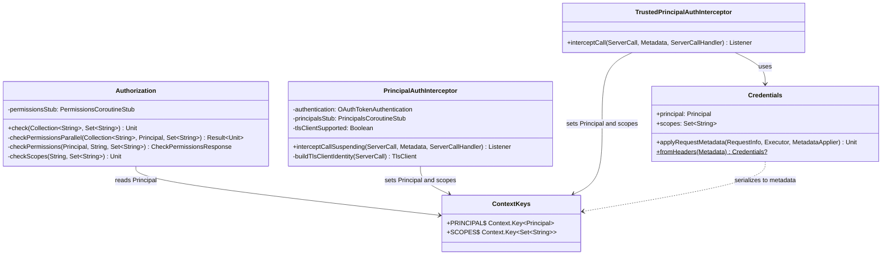

# org.wfanet.measurement.access.client.v1alpha

## Overview
This package provides client-side authentication and authorization infrastructure for the Access API v1alpha. It implements Principal-based authentication supporting OAuth tokens and TLS client certificates, authorization checking with parallel permission validation, gRPC interceptors for server-side authentication, and context management for propagating authentication state through RPC call chains.

## Components

### Authorization
Performs permission checks for principals on protected resources with parallel validation and instrumentation.

| Method | Parameters | Returns | Description |
|--------|------------|---------|-------------|
| check | `protectedResourceNames: Collection<String>`, `requiredPermissionIds: Set<String>` | `Unit` | Validates principal has all required permissions on any protected resource |
| check (extension) | `protectedResourceName: String`, `requiredPermissionIds: Set<String>` | `Unit` | Single resource permission check convenience method |
| check (extension) | `protectedResourceNames: Collection<String>`, `vararg requiredPermissionIds: String` | `Unit` | Varargs permission IDs convenience method |
| check (extension) | `protectedResourceName: String`, `vararg requiredPermissionIds: String` | `Unit` | Single resource with varargs permissions convenience method |

**Constructor Parameters:**
- `permissionsStub: PermissionsGrpcKt.PermissionsCoroutineStub` - gRPC stub for Permissions service

**Key Behaviors:**
- Throws `StatusRuntimeException` with `UNAUTHENTICATED` if Principal not found in context
- Throws `StatusRuntimeException` with `PERMISSION_DENIED` if permissions insufficient
- Short-circuits parallel checks on first successful resource match
- Records authorization check duration metrics via OpenTelemetry

### PrincipalAuthInterceptor
Server interceptor authenticating callers via OAuth bearer tokens or TLS client certificates.

**Constructor Parameters:**
- `openIdProvidersConfig: OpenIdProvidersConfig` - OpenID provider configuration
- `principalsStub: PrincipalsGrpcKt.PrincipalsCoroutineStub` - gRPC stub for Principals service
- `tlsClientSupported: Boolean` - Whether TLS client authentication is enabled
- `clock: Clock` - Clock for token validation (defaults to system UTC)

| Method | Parameters | Returns | Description |
|--------|------------|---------|-------------|
| interceptCallSuspending | `call: ServerCall<ReqT, RespT>`, `headers: Metadata`, `next: ServerCallHandler<ReqT, RespT>` | `ServerCall.Listener<ReqT>` | Authenticates caller and populates context with Principal and scopes |

**Authentication Flow:**
1. Attempts to extract bearer token from headers
2. If no token and TLS supported, extracts client certificate authority key identifier
3. Verifies credentials via OAuth token verification or TLS client lookup
4. Looks up Principal via Principals service
5. Populates gRPC context with Principal and scopes

### TrustedPrincipalAuthInterceptor
Server interceptor for trusted environments where client has pre-authenticated the caller.

| Method | Parameters | Returns | Description |
|--------|------------|---------|-------------|
| interceptCall | `call: ServerCall<ReqT, RespT>`, `headers: Metadata`, `next: ServerCallHandler<ReqT, RespT>` | `ServerCall.Listener<ReqT>` | Extracts Principal and scopes from trusted headers |
| withTrustedPrincipalAuthentication (extension) | `this: BindableService` | `ServerServiceDefinition` | Wraps service with trusted authentication interceptor |
| withForwardedTrustedCredentials (extension) | `this: AbstractStub<T>` | `T` | Attaches context Principal and scopes as call credentials |

**Nested Class: Credentials**

Extends `CallCredentials` to transmit Principal and scopes in metadata headers.

| Method | Parameters | Returns | Description |
|--------|------------|---------|-------------|
| applyRequestMetadata | `requestInfo: RequestInfo`, `appExecutor: Executor`, `applier: MetadataApplier` | `Unit` | Applies Principal and scopes to request metadata |
| fromHeaders (companion) | `headers: Metadata` | `Credentials?` | Extracts credentials from metadata headers |

**Metadata Keys:**
- `x-trusted-principal-bin` - Binary-marshalled Principal protobuf
- `x-trusted-scopes` - Space-separated scope strings

### ContextKeys
Defines gRPC context keys for Access API authentication state.

| Constant | Type | Description |
|----------|------|-------------|
| PRINCIPAL | `Context.Key<Principal>` | Context key for authenticated Principal |
| SCOPES | `Context.Key<Set<String>>` | Context key for OAuth scopes or wildcard |

| Function | Parameters | Returns | Description |
|----------|------------|---------|-------------|
| withPrincipalAndScopes (extension) | `principal: Principal`, `scopes: Set<String>` | `Context` | Creates context with Principal and scopes attached |

## Testing Utilities

### org.wfanet.measurement.access.client.v1alpha.testing

#### Authentication
Provides test utilities for executing code with mocked authentication context.

| Method | Parameters | Returns | Description |
|--------|------------|---------|-------------|
| withPrincipalAndScopes | `principal: Principal`, `scopes: Set<String>`, `action: () -> T` | `T` | Executes action with Principal and scopes in gRPC context |

#### PermissionMatcher
Mockito `ArgumentMatcher` for verifying `CheckPermissionsRequest` permission fields.

| Method | Parameters | Returns | Description |
|--------|------------|---------|-------------|
| matches | `argument: CheckPermissionsRequest?` | `Boolean` | Checks if request contains expected permission |
| hasPermission (companion) | `permissionName: String` | `CheckPermissionsRequest` | Matcher for permission resource name |
| hasPermissionId (companion) | `permissionId: String` | `CheckPermissionsRequest` | Matcher for permission ID (converts to name) |

#### PrincipalMatcher
Mockito `ArgumentMatcher` for verifying `CheckPermissionsRequest` principal fields.

| Method | Parameters | Returns | Description |
|--------|------------|---------|-------------|
| matches | `argument: CheckPermissionsRequest?` | `Boolean` | Checks if request contains expected principal |
| hasPrincipal (companion) | `principalName: String` | `CheckPermissionsRequest` | Matcher for principal resource name |

#### ProtectedResourceMatcher
Mockito `ArgumentMatcher` for verifying `CheckPermissionsRequest` protected resource fields.

| Method | Parameters | Returns | Description |
|--------|------------|---------|-------------|
| matches | `argument: CheckPermissionsRequest?` | `Boolean` | Checks if request contains expected protected resource |
| hasProtectedResource (companion) | `protectedResourceName: String` | `CheckPermissionsRequest` | Matcher for protected resource name |

## Dependencies

- `io.grpc` - gRPC framework for RPC calls and interceptors
- `io.opentelemetry.api` - Instrumentation and metrics recording
- `kotlinx.coroutines` - Asynchronous permission checking with parallel execution
- `org.wfanet.measurement.access.v1alpha` - Access API protobuf definitions
- `org.wfanet.measurement.access.service` - PermissionKey utilities
- `org.wfanet.measurement.access.client` - ValueInScope for scope validation
- `org.wfanet.measurement.common` - Instrumentation namespace, JSON utilities
- `org.wfanet.measurement.common.grpc` - BearerTokenCallCredentials, authentication utilities
- `org.wfanet.measurement.common.crypto` - Certificate authority key identifier extraction
- `org.wfanet.measurement.config.access` - OpenIdProvidersConfig configuration
- `org.mockito` - Testing ArgumentMatcher framework (testing subpackage)

## Usage Example

```kotlin
// Server-side authentication setup
val authInterceptor = PrincipalAuthInterceptor(
  openIdProvidersConfig = config,
  principalsStub = principalsClient,
  tlsClientSupported = true
)
val server = ServerBuilder.forPort(8080)
  .addService(ServerInterceptors.intercept(myService, authInterceptor))
  .build()

// Authorization check in service implementation
val authorization = Authorization(permissionsClient)
authorization.check(
  protectedResourceName = "dataProviders/123",
  requiredPermissionIds = setOf("measurements.create", "measurements.list")
)

// Trusted authentication for internal services
val internalService = myService.withTrustedPrincipalAuthentication()

// Forwarding credentials to downstream service
val downstreamStub = downstreamStub.withForwardedTrustedCredentials()
```

## Class Diagram


