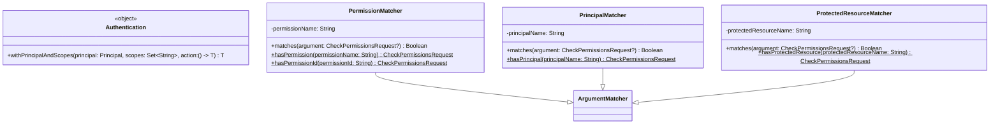

# org.wfanet.measurement.access.client.v1alpha.testing

## Overview
This package provides testing utilities for the access control client v1alpha API. It includes Mockito argument matchers for validating CheckPermissionsRequest components (principal, permissions, protected resources) and authentication helpers for executing test code with specific principal and scope contexts.

## Components

### Authentication
Testing utility object for setting up authentication context in tests.

| Method | Parameters | Returns | Description |
|--------|------------|---------|-------------|
| withPrincipalAndScopes | `principal: Principal`, `scopes: Set<String>`, `action: () -> T` | `T` | Executes action with gRPC context containing specified principal and scopes |

### PermissionMatcher
ArgumentMatcher for validating CheckPermissionsRequest permission lists in Mockito tests.

| Method | Parameters | Returns | Description |
|--------|------------|---------|-------------|
| matches | `argument: CheckPermissionsRequest?` | `Boolean` | Checks if request contains the expected permission name |

#### Companion Object Methods

| Method | Parameters | Returns | Description |
|--------|------------|---------|-------------|
| hasPermission | `permissionName: String` | `CheckPermissionsRequest` | Creates matcher verifying request contains permission name |
| hasPermissionId | `permissionId: String` | `CheckPermissionsRequest` | Creates matcher verifying request contains permission by ID |

### PrincipalMatcher
ArgumentMatcher for validating CheckPermissionsRequest principal field in Mockito tests.

| Method | Parameters | Returns | Description |
|--------|------------|---------|-------------|
| matches | `argument: CheckPermissionsRequest?` | `Boolean` | Checks if request principal matches expected value |

#### Companion Object Methods

| Method | Parameters | Returns | Description |
|--------|------------|---------|-------------|
| hasPrincipal | `principalName: String` | `CheckPermissionsRequest` | Creates matcher verifying request contains principal name |

### ProtectedResourceMatcher
ArgumentMatcher for validating CheckPermissionsRequest protected resource field in Mockito tests.

| Method | Parameters | Returns | Description |
|--------|------------|---------|-------------|
| matches | `argument: CheckPermissionsRequest?` | `Boolean` | Checks if request protected resource matches expected value |

#### Companion Object Methods

| Method | Parameters | Returns | Description |
|--------|------------|---------|-------------|
| hasProtectedResource | `protectedResourceName: String` | `CheckPermissionsRequest` | Creates matcher verifying request contains protected resource name |

## Dependencies
- `io.grpc.Context` - gRPC context management for authentication
- `org.mockito` - Mockito testing framework for argument matching
- `org.wfanet.measurement.access.client.v1alpha` - Access control client utilities
- `org.wfanet.measurement.access.v1alpha` - Access control API types (Principal, CheckPermissionsRequest)
- `org.wfanet.measurement.access.service` - Access service types (PermissionKey)
- `org.wfanet.measurement.common.grpc` - Common gRPC utilities

## Usage Example
```kotlin
import org.wfanet.measurement.access.client.v1alpha.testing.Authentication
import org.wfanet.measurement.access.client.v1alpha.testing.PermissionMatcher.Companion.hasPermission
import org.wfanet.measurement.access.client.v1alpha.testing.PrincipalMatcher.Companion.hasPrincipal
import org.wfanet.measurement.access.client.v1alpha.testing.ProtectedResourceMatcher.Companion.hasProtectedResource
import org.wfanet.measurement.access.v1alpha.Principal
import org.mockito.kotlin.verify

// Set up authentication context for test
val principal = Principal.newBuilder().setName("principals/test-user").build()
val scopes = setOf("read", "write")

Authentication.withPrincipalAndScopes(principal, scopes) {
  // Execute test code with principal and scopes in context
  someServiceMethod()
}

// Verify CheckPermissionsRequest in Mockito tests
verify(mockService).checkPermissions(hasPermission("permissions/data.read"))
verify(mockService).checkPermissions(hasPrincipal("principals/test-user"))
verify(mockService).checkPermissions(hasProtectedResource("resources/dataset-123"))
```

## Class Diagram

