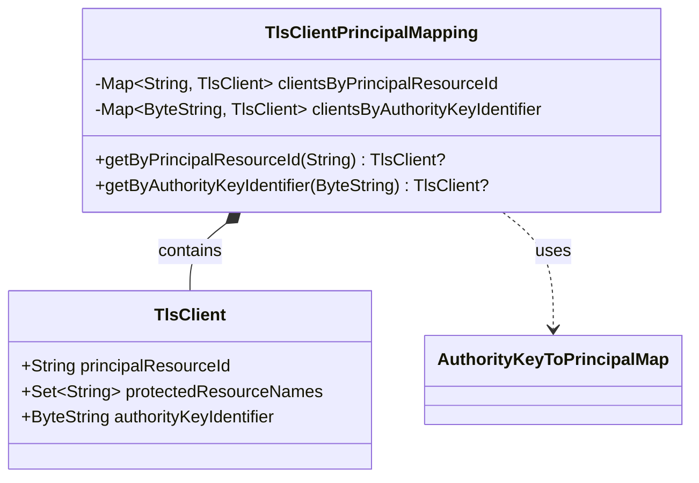

# org.wfanet.measurement.access.common

## Overview
This package provides TLS client principal mapping functionality for the Cross-Media Measurement access control system. It manages the association between TLS certificate authority key identifiers (AKID), principal resource IDs, and protected resource names, enabling certificate-based authentication and authorization.

## Components

### TlsClientPrincipalMapping
Maps TLS client certificates to principal resources and their protected resources using authority key identifiers.

| Method | Parameters | Returns | Description |
|--------|------------|---------|-------------|
| getByPrincipalResourceId | `principalResourceId: String` | `TlsClient?` | Retrieves TLS client by principal resource ID or null if not found |
| getByAuthorityKeyIdentifier | `authorityKeyIdentifier: ByteString` | `TlsClient?` | Retrieves TLS client by certificate AKID or null if not found |

**Constructor Parameters:**
- `config: AuthorityKeyToPrincipalMap` - Configuration mapping authority keys to principals

**Initialization Behavior:**
- Transforms principal resource names into RFC 1034-compliant resource IDs
- Validates resource names contain only allowed characters (alphanumeric and hyphens)
- Automatically includes root resource access for all clients
- Creates bidirectional lookup maps for efficient retrieval

## Data Structures

### TlsClient
| Property | Type | Description |
|----------|------|-------------|
| principalResourceId | `String` | ID of the Principal resource (RFC 1034-compliant, max 63 characters) |
| protectedResourceNames | `Set<String>` | Names of resources protected by the Policy (includes root resource) |
| authorityKeyIdentifier | `ByteString` | Authority key identifier (AKID) key ID from the client certificate |

## Dependencies
- `com.google.protobuf.ByteString` - Binary data representation for certificate identifiers
- `org.wfanet.measurement.common.api.ResourceIds` - RFC 1034 validation for resource IDs
- `org.wfanet.measurement.config.AuthorityKeyToPrincipalMap` - Configuration proto for mapping definitions

## Usage Example
```kotlin
// Load configuration
val config = AuthorityKeyToPrincipalMap.newBuilder()
  .addEntries(
    AuthorityKeyToPrincipalMap.Entry.newBuilder()
      .setPrincipalResourceName("dataProviders/123")
      .setAuthorityKeyIdentifier(ByteString.copyFromUtf8("akid-123"))
  )
  .build()

// Create mapping
val mapping = TlsClientPrincipalMapping(config)

// Lookup by AKID during TLS handshake
val client = mapping.getByAuthorityKeyIdentifier(certificateAkid)
if (client != null) {
  println("Principal: ${client.principalResourceId}")
  println("Protected resources: ${client.protectedResourceNames}")
}

// Lookup by principal resource ID
val clientById = mapping.getByPrincipalResourceId("dataProviders-123")
```

## Class Diagram

