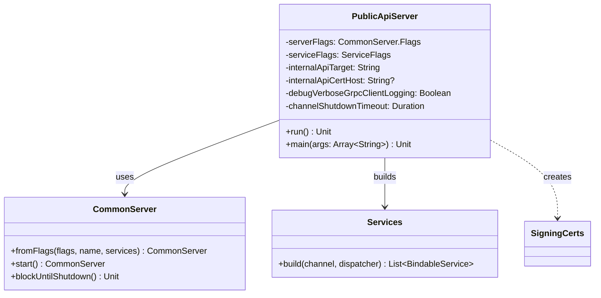

# org.wfanet.measurement.access.deploy.common.server

## Overview
This package provides the server deployment infrastructure for the Access Public API. It implements a gRPC server that exposes access control services by delegating to an internal Access API backend with mutual TLS authentication.

## Components

### PublicApiServer
Command-line runnable server that bootstraps and runs the Access Public API gRPC server.

| Method | Parameters | Returns | Description |
|--------|------------|---------|-------------|
| run | None | `Unit` | Configures and starts the gRPC server with mTLS channels |
| main | `args: Array<String>` | `Unit` | Entry point for command-line execution |

#### Configuration Options

| Flag | Type | Required | Description |
|------|------|----------|-------------|
| --access-internal-api-target | `String` | Yes | gRPC target of the Access internal API server |
| --access-internal-api-cert-host | `String` | No | Expected hostname (DNS-ID) in the internal API server's TLS certificate |
| --debug-verbose-grpc-client-logging | `Boolean` | No | Enables full gRPC request/response logging for outgoing gRPCs (default: false) |
| --channel-shutdown-timeout | `Duration` | No | Duration to allow for gRPC channels to shutdown (default: 3s) |

#### Inherited Flags
- **CommonServer.Flags**: Standard server configuration (port, TLS certificates, etc.)
- **ServiceFlags**: Service execution configuration (thread pool, dispatcher settings)

## Architecture

The server operates as a reverse proxy with security enforcement:

1. **Client Connection**: Accepts incoming gRPC requests via CommonServer with TLS
2. **Internal Delegation**: Forwards authenticated requests to the internal Access API backend
3. **Mutual TLS**: Enforces mTLS for internal API communication using SigningCerts
4. **Service Discovery**: Uses the `Services.build()` factory to construct all bindable gRPC services
5. **Coroutine Dispatcher**: Leverages a configurable executor for async service handling

## Dependencies

- `org.wfanet.measurement.access.service.v1alpha.Services` - Factory for constructing Access API gRPC services
- `org.wfanet.measurement.common.commandLineMain` - Command-line application bootstrap utility
- `org.wfanet.measurement.common.crypto.SigningCerts` - TLS certificate management for mutual authentication
- `org.wfanet.measurement.common.grpc.CommonServer` - Shared gRPC server infrastructure
- `org.wfanet.measurement.common.grpc.ServiceFlags` - Service-level configuration flags
- `org.wfanet.measurement.common.grpc.buildMutualTlsChannel` - Constructs mTLS-enabled gRPC channels
- `org.wfanet.measurement.common.grpc.withShutdownTimeout` - Adds graceful shutdown timeout to channels
- `org.wfanet.measurement.common.grpc.withVerboseLogging` - Adds verbose logging to channels for debugging
- `picocli.CommandLine` - CLI argument parsing framework
- `kotlinx.coroutines` - Coroutine support for async execution

## Usage Example

```kotlin
// Run via command line
fun main(args: Array<String>) {
  PublicApiServer.main(
    arrayOf(
      "--port=8080",
      "--tls-cert-file=/path/to/server-cert.pem",
      "--tls-key-file=/path/to/server-key.pem",
      "--cert-collection-file=/path/to/trusted-certs.pem",
      "--access-internal-api-target=localhost:9090",
      "--access-internal-api-cert-host=internal-api.example.com",
      "--channel-shutdown-timeout=5s"
    )
  )
}
```

## Class Diagram



## Deployment Notes

- The server name constant is set to `"AccessApiServer"` for logging and identification
- Requires valid TLS certificates for both server-side and client-side (mTLS) authentication
- The internal API target supports standard gRPC target formats (hostname:port, DNS, etc.)
- Channel shutdown timeout ensures graceful termination during server shutdown sequences
- Verbose gRPC logging should only be enabled in development/debugging scenarios due to performance impact
