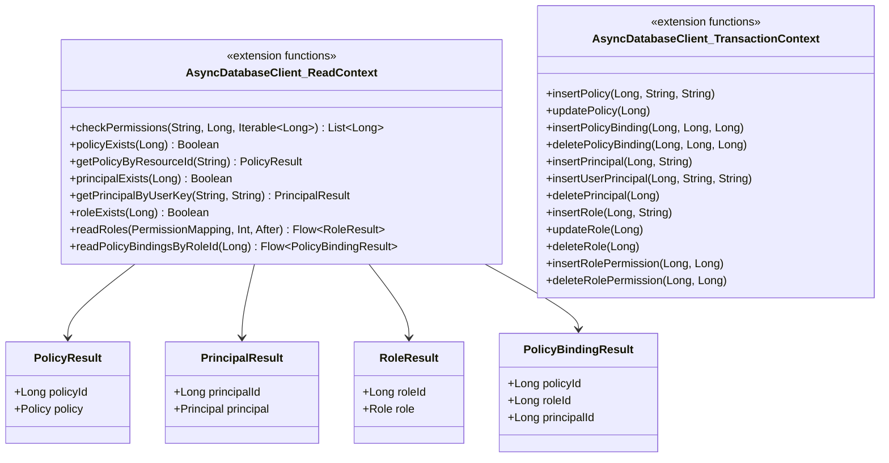

# org.wfanet.measurement.access.deploy.gcloud.spanner.db

## Overview
This package provides Cloud Spanner database access layer for the access control system, implementing CRUD operations for IAM-style policies, roles, principals, and permissions. It serves as the data persistence layer for authorization and identity management, exposing extension functions on `AsyncDatabaseClient` contexts to manage access control entities and their relationships in Google Cloud Spanner.

## Components

### Permissions.kt

| Method | Parameters | Returns | Description |
|--------|------------|---------|-------------|
| checkPermissions | `protectedResourceName: String`, `principalId: Long`, `permissionIds: Iterable<Long>` | `List<Long>` | Returns subset of permission IDs granted to principal on resource |

### Policies.kt

#### Extension Functions - Read Operations

| Method | Parameters | Returns | Description |
|--------|------------|---------|-------------|
| policyExists | `policyId: Long` | `Boolean` | Checks if policy exists by ID |
| getPolicyByResourceId | `policyResourceId: String` | `PolicyResult` | Retrieves policy by resource identifier |
| getPolicyByProtectedResourceName | `protectedResourceName: String` | `PolicyResult` | Retrieves policy by protected resource name |

#### Extension Functions - Write Operations

| Method | Parameters | Returns | Description |
|--------|------------|---------|-------------|
| insertPolicy | `policyId: Long`, `policyResourceId: String`, `protectedResourceName: String` | `Unit` | Buffers insert mutation for new policy |
| updatePolicy | `policyId: Long` | `Unit` | Buffers update mutation for policy timestamp |
| insertPolicyBinding | `policyId: Long`, `roleId: Long`, `principalId: Long` | `Unit` | Buffers insert for policy-role-principal binding |
| deletePolicyBinding | `policyId: Long`, `roleId: Long`, `principalId: Long` | `Unit` | Buffers delete for policy-role-principal binding |

### Principals.kt

#### Extension Functions - Read Operations

| Method | Parameters | Returns | Description |
|--------|------------|---------|-------------|
| principalExists | `principalId: Long` | `Boolean` | Checks if principal exists by ID |
| getPrincipalIdByResourceId | `principalResourceId: String` | `Long` | Retrieves principal ID by resource identifier |
| getPrincipalByResourceId | `principalResourceId: String` | `PrincipalResult` | Retrieves principal entity by resource identifier |
| getPrincipalIdsByResourceIds | `principalResourceIds: Collection<String>` | `Map<String, Long>` | Batch retrieves principal IDs for resource identifiers |
| getPrincipalByUserKey | `issuer: String`, `subject: String` | `PrincipalResult` | Retrieves principal by OAuth issuer and subject |

#### Extension Functions - Write Operations

| Method | Parameters | Returns | Description |
|--------|------------|---------|-------------|
| insertPrincipal | `principalId: Long`, `principalResourceId: String` | `Unit` | Buffers insert mutation for new principal |
| insertUserPrincipal | `principalId: Long`, `issuer: String`, `subject: String` | `Unit` | Buffers insert mutation for OAuth user principal |
| deletePrincipal | `principalId: Long` | `Unit` | Buffers delete mutation for principal |

### Roles.kt

#### Extension Functions - Read Operations

| Method | Parameters | Returns | Description |
|--------|------------|---------|-------------|
| getRoleByResourceId | `permissionMapping: PermissionMapping`, `roleResourceId: String` | `RoleResult` | Retrieves role with permissions by resource identifier |
| getRoleIdByResourceId | `roleResourceId: String` | `Long` | Retrieves role ID by resource identifier |
| getRoleIdsByResourceIds | `roleResourceIds: Collection<String>` | `Map<String, Long>` | Batch retrieves role IDs for resource identifiers |
| roleExists | `roleId: Long` | `Boolean` | Checks if role exists by ID |
| readRoles | `permissionMapping: PermissionMapping`, `limit: Int`, `after: ListRolesPageToken.After?` | `Flow<RoleResult>` | Streams roles ordered by resource ID with pagination |

#### Extension Functions - Write Operations

| Method | Parameters | Returns | Description |
|--------|------------|---------|-------------|
| insertRole | `roleId: Long`, `roleResourceId: String` | `Unit` | Buffers insert mutation for new role |
| updateRole | `roleId: Long` | `Unit` | Buffers update mutation for role timestamp |
| deleteRole | `roleId: Long` | `Unit` | Buffers delete mutation for role |
| insertRoleResourceType | `roleId: Long`, `resourceType: String` | `Unit` | Buffers insert for role-resource type association |
| deleteRoleResourceType | `roleId: Long`, `resourceType: String` | `Unit` | Buffers delete for role-resource type association |
| insertRolePermission | `roleId: Long`, `permissionId: Long` | `Unit` | Buffers insert for role-permission association |
| deleteRolePermission | `roleId: Long`, `permissionId: Long` | `Unit` | Buffers delete for role-permission association |

### PolicyBindings.kt

| Method | Parameters | Returns | Description |
|--------|------------|---------|-------------|
| readPolicyBindingsByRoleId | `roleId: Long` | `Flow<PolicyBindingResult>` | Streams policy bindings for specific role |

## Data Structures

### PolicyResult
| Property | Type | Description |
|----------|------|-------------|
| policyId | `Long` | Internal database ID |
| policy | `Policy` | Proto message containing policy details and bindings |

### PrincipalResult
| Property | Type | Description |
|----------|------|-------------|
| principalId | `Long` | Internal database ID |
| principal | `Principal` | Proto message containing principal details and user info |

### RoleResult
| Property | Type | Description |
|----------|------|-------------|
| roleId | `Long` | Internal database ID |
| role | `Role` | Proto message containing role, permissions, and resource types |

### PolicyBindingResult
| Property | Type | Description |
|----------|------|-------------|
| policyId | `Long` | Policy database ID |
| roleId | `Long` | Role database ID |
| principalId | `Long` | Principal database ID |

## Dependencies
- `com.google.cloud.spanner` - Google Cloud Spanner client library for database operations
- `org.wfanet.measurement.gcloud.spanner` - Internal Spanner utilities and async client wrappers
- `org.wfanet.measurement.internal.access` - Proto definitions for Policy, Principal, Role entities
- `org.wfanet.measurement.access.service.internal` - Exception types and permission mappings
- `org.wfanet.measurement.common` - Common utilities for ETags, timestamps, and flow operations
- `kotlinx.coroutines.flow` - Kotlin coroutines Flow API for streaming results

## Usage Example
```kotlin
// Check if principal has permissions on resource
val grantedPermissions = readContext.checkPermissions(
  protectedResourceName = "resources/measurement-consumers/123",
  principalId = 456L,
  permissionIds = listOf(1L, 2L, 3L)
)

// Retrieve policy for protected resource
val policyResult = readContext.getPolicyByProtectedResourceName(
  "resources/measurement-consumers/123"
)

// Create new principal for OAuth user
transactionContext.insertPrincipal(
  principalId = 789L,
  principalResourceId = "principals/user-abc"
)
transactionContext.insertUserPrincipal(
  principalId = 789L,
  issuer = "https://accounts.google.com",
  subject = "user@example.com"
)

// Bind role to principal in policy
transactionContext.insertPolicyBinding(
  policyId = policyResult.policyId,
  roleId = 10L,
  principalId = 789L
)
```

## Class Diagram

