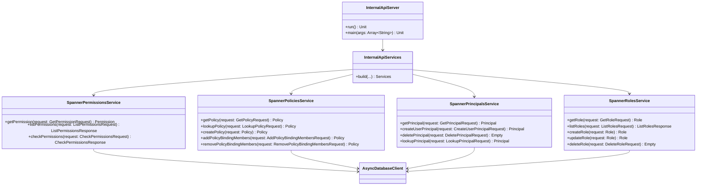

# org.wfanet.measurement.access.deploy.gcloud.spanner

## Overview
This package provides Google Cloud Spanner-backed implementations of the Access Control internal API services. It implements role-based access control (RBAC) with support for principals, permissions, roles, and policies, storing all data in Spanner database tables and exposing gRPC services for access management operations.

## Components

### InternalApiServer
Command-line server application that bootstraps and runs the internal access API services.

| Method | Parameters | Returns | Description |
|--------|------------|---------|-------------|
| run | - | `Unit` | Initializes Spanner client, builds services, and starts gRPC server |
| main | `args: Array<String>` | `Unit` | Command-line entry point for server execution |

**Configuration**:
- `--authority-key-identifier-to-principal-map-file`: TLS client principal mappings
- `--permissions-config`: Permission definitions in text proto format
- Inherits flags from `CommonServer.Flags`, `ServiceFlags`, and `SpannerFlags`

### InternalApiServices
Factory object for constructing the complete set of internal API services.

| Method | Parameters | Returns | Description |
|--------|------------|---------|-------------|
| build | `databaseClient: AsyncDatabaseClient`, `permissionMapping: PermissionMapping`, `tlsClientMapping: TlsClientPrincipalMapping`, `coroutineContext: CoroutineContext`, `idGenerator: IdGenerator` | `Services` | Creates all four service implementations bundled together |

### SpannerPermissionsService
gRPC service implementation for permission operations backed by Spanner.

| Method | Parameters | Returns | Description |
|--------|------------|---------|-------------|
| getPermission | `request: GetPermissionRequest` | `Permission` | Retrieves permission definition by resource ID |
| listPermissions | `request: ListPermissionsRequest` | `ListPermissionsResponse` | Lists available permissions with pagination |
| checkPermissions | `request: CheckPermissionsRequest` | `CheckPermissionsResponse` | Checks which permissions a principal has on a resource |

**Pagination**: DEFAULT_PAGE_SIZE=50, MAX_PAGE_SIZE=100

### SpannerPoliciesService
gRPC service implementation for policy management backed by Spanner.

| Method | Parameters | Returns | Description |
|--------|------------|---------|-------------|
| getPolicy | `request: GetPolicyRequest` | `Policy` | Retrieves policy by resource ID |
| lookupPolicy | `request: LookupPolicyRequest` | `Policy` | Finds policy by protected resource name |
| createPolicy | `request: Policy` | `Policy` | Creates new policy with bindings |
| addPolicyBindingMembers | `request: AddPolicyBindingMembersRequest` | `Policy` | Adds principals to role binding in policy |
| removePolicyBindingMembers | `request: RemovePolicyBindingMembersRequest` | `Policy` | Removes principals from role binding in policy |

**Concurrency**: Uses ETags for optimistic locking on updates

**Constraints**: TLS client principals cannot be added to policy bindings

### SpannerPrincipalsService
gRPC service implementation for principal management backed by Spanner.

| Method | Parameters | Returns | Description |
|--------|------------|---------|-------------|
| getPrincipal | `request: GetPrincipalRequest` | `Principal` | Retrieves principal by resource ID |
| createUserPrincipal | `request: CreateUserPrincipalRequest` | `Principal` | Creates new OAuth user principal |
| deletePrincipal | `request: DeletePrincipalRequest` | `Empty` | Deletes principal by resource ID |
| lookupPrincipal | `request: LookupPrincipalRequest` | `Principal` | Finds principal by TLS client or user identity |

**Principal Types**:
- TLS Client principals: Read from static configuration mapping
- User principals: Stored in Spanner with issuer/subject identifiers

### SpannerRolesService
gRPC service implementation for role management backed by Spanner.

| Method | Parameters | Returns | Description |
|--------|------------|---------|-------------|
| getRole | `request: GetRoleRequest` | `Role` | Retrieves role by resource ID |
| listRoles | `request: ListRolesRequest` | `ListRolesResponse` | Lists roles with pagination |
| createRole | `request: Role` | `Role` | Creates new role with permissions and resource types |
| updateRole | `request: Role` | `Role` | Updates role permissions and resource types |
| deleteRole | `request: DeleteRoleRequest` | `Empty` | Deletes role and removes all policy bindings |

**Pagination**: DEFAULT_PAGE_SIZE=50, MAX_PAGE_SIZE=100

**Validation**: Ensures permissions support all specified resource types

## Database Layer (`db` subpackage)

### Permissions.kt
Extension functions for permission checking operations.

| Function | Parameters | Returns | Description |
|----------|------------|---------|-------------|
| checkPermissions | `protectedResourceName: String`, `principalId: Long`, `permissionIds: Iterable<Long>` | `List<Long>` | Queries granted permissions via policy bindings |

### Policies.kt
Extension functions and data structures for policy operations.

| Function | Parameters | Returns | Description |
|----------|------------|---------|-------------|
| policyExists | `policyId: Long` | `Boolean` | Checks if policy exists by ID |
| getPolicyByResourceId | `policyResourceId: String` | `PolicyResult` | Reads policy with bindings by resource ID |
| getPolicyByProtectedResourceName | `protectedResourceName: String` | `PolicyResult` | Reads policy by protected resource name |
| insertPolicy | `policyId: Long`, `policyResourceId: String`, `protectedResourceName: String` | `Unit` | Buffers policy insert mutation |
| updatePolicy | `policyId: Long` | `Unit` | Buffers policy update timestamp mutation |
| insertPolicyBinding | `policyId: Long`, `roleId: Long`, `principalId: Long` | `Unit` | Buffers policy binding insert mutation |
| deletePolicyBinding | `policyId: Long`, `roleId: Long`, `principalId: Long` | `Unit` | Buffers policy binding delete mutation |

### Principals.kt
Extension functions and data structures for principal operations.

| Function | Parameters | Returns | Description |
|----------|------------|---------|-------------|
| principalExists | `principalId: Long` | `Boolean` | Checks if principal exists by ID |
| getPrincipalIdByResourceId | `principalResourceId: String` | `Long` | Resolves principal ID from resource ID |
| getPrincipalByResourceId | `principalResourceId: String` | `PrincipalResult` | Reads principal with details by resource ID |
| getPrincipalIdsByResourceIds | `principalResourceIds: Collection<String>` | `Map<String, Long>` | Batch resolves principal IDs from resource IDs |
| getPrincipalByUserKey | `issuer: String`, `subject: String` | `PrincipalResult` | Reads principal by OAuth issuer/subject |
| insertPrincipal | `principalId: Long`, `principalResourceId: String` | `Unit` | Buffers principal insert mutation |
| insertUserPrincipal | `principalId: Long`, `issuer: String`, `subject: String` | `Unit` | Buffers user principal insert mutation |
| deletePrincipal | `principalId: Long` | `Unit` | Buffers principal delete mutation |

### Roles.kt
Extension functions and data structures for role operations.

| Function | Parameters | Returns | Description |
|----------|------------|---------|-------------|
| getRoleByResourceId | `permissionMapping: PermissionMapping`, `roleResourceId: String` | `RoleResult` | Reads role with permissions by resource ID |
| getRoleIdByResourceId | `roleResourceId: String` | `Long` | Resolves role ID from resource ID |
| getRoleIdsByResourceIds | `roleResourceIds: Collection<String>` | `Map<String, Long>` | Batch resolves role IDs from resource IDs |
| roleExists | `roleId: Long` | `Boolean` | Checks if role exists by ID |
| readRoles | `permissionMapping: PermissionMapping`, `limit: Int`, `after: ListRolesPageToken.After?` | `Flow<RoleResult>` | Streams roles ordered by resource ID |
| insertRole | `roleId: Long`, `roleResourceId: String` | `Unit` | Buffers role insert mutation |
| updateRole | `roleId: Long` | `Unit` | Buffers role update timestamp mutation |
| deleteRole | `roleId: Long` | `Unit` | Buffers role delete mutation |
| insertRoleResourceType | `roleId: Long`, `resourceType: String` | `Unit` | Buffers role-resource type association insert |
| deleteRoleResourceType | `roleId: Long`, `resourceType: String` | `Unit` | Buffers role-resource type association delete |
| insertRolePermission | `roleId: Long`, `permissionId: Long` | `Unit` | Buffers role-permission association insert |
| deleteRolePermission | `roleId: Long`, `permissionId: Long` | `Unit` | Buffers role-permission association delete |

### PolicyBindings.kt
Extension functions for policy binding queries.

| Function | Parameters | Returns | Description |
|----------|------------|---------|-------------|
| readPolicyBindingsByRoleId | `roleId: Long` | `Flow<PolicyBindingResult>` | Streams all policy bindings for a role |

## Data Structures

### PolicyResult
| Property | Type | Description |
|----------|------|-------------|
| policyId | `Long` | Internal Spanner primary key |
| policy | `Policy` | Policy protobuf message with bindings |

### PrincipalResult
| Property | Type | Description |
|----------|------|-------------|
| principalId | `Long` | Internal Spanner primary key |
| principal | `Principal` | Principal protobuf message |

### RoleResult
| Property | Type | Description |
|----------|------|-------------|
| roleId | `Long` | Internal Spanner primary key |
| role | `Role` | Role protobuf message |

### PolicyBindingResult
| Property | Type | Description |
|----------|------|-------------|
| policyId | `Long` | Foreign key to policy |
| roleId | `Long` | Foreign key to role |
| principalId | `Long` | Foreign key to principal |

## Dependencies

- `org.wfanet.measurement.gcloud.spanner` - Spanner async client and transaction utilities
- `org.wfanet.measurement.access.common` - TLS client principal mapping
- `org.wfanet.measurement.access.service.internal` - Service interfaces, exceptions, and permission mapping
- `org.wfanet.measurement.common` - ID generation, protobuf utilities, gRPC server framework
- `org.wfanet.measurement.config.access` - Permissions configuration protobuf
- `com.google.cloud.spanner` - Google Cloud Spanner client library
- `io.grpc` - gRPC service implementation framework
- `kotlinx.coroutines` - Async/await and flow streaming
- `picocli` - Command-line parsing for server

## Usage Example

```kotlin
// Server deployment
fun main(args: Array<String>) {
  commandLineMain(InternalApiServer(), args)
}

// Service construction
val services = InternalApiServices.build(
  databaseClient = spannerClient.databaseClient,
  permissionMapping = PermissionMapping(permissionsConfig),
  tlsClientMapping = TlsClientPrincipalMapping(authorityKeyMap),
  coroutineContext = Dispatchers.Default
)

// Permission check
val response = permissionsService.checkPermissions(
  checkPermissionsRequest {
    principalResourceId = "users/alice"
    protectedResourceName = "measurements/measurement-1"
    permissionResourceIds += listOf("read", "update")
  }
)
// response.permissionResourceIds contains granted permissions
```

## Database Schema

The implementation assumes the following Spanner tables:
- **Principals**: PrincipalId (PK), PrincipalResourceId, CreateTime, UpdateTime
- **UserPrincipals**: PrincipalId (PK), Issuer, Subject
- **Roles**: RoleId (PK), RoleResourceId, CreateTime, UpdateTime
- **RolePermissions**: RoleId (PK), PermissionId (PK)
- **RoleResourceTypes**: RoleId (PK), ResourceType (PK)
- **Policies**: PolicyId (PK), PolicyResourceId, ProtectedResourceName, CreateTime, UpdateTime
- **PolicyBindings**: PolicyId (PK), RoleId (PK), PrincipalId (PK)

Secondary indexes:
- PrincipalsByResourceId on Principals(PrincipalResourceId)
- RolesByResourceId on Roles(RoleResourceId)

## Class Diagram


