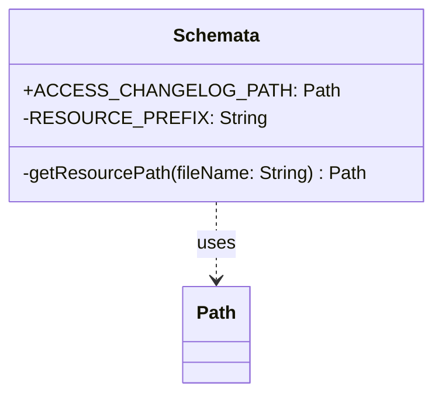

# org.wfanet.measurement.access.deploy.gcloud.spanner.testing

## Overview
This package provides testing utilities for Google Cloud Spanner schema management in the access control module. It centralizes access to Spanner schema resources required for test database initialization and schema validation, specifically providing the path to the Liquibase changelog file used to create and migrate the access control database schema.

## Components

### Schemata
Singleton object that manages access to Spanner schema resource files for testing purposes.

| Method | Parameters | Returns | Description |
|--------|------------|---------|-------------|
| getResourcePath | `fileName: String` | `Path` | Resolves a resource file path from the JAR classpath |

| Property | Type | Description |
|----------|------|-------------|
| ACCESS_CHANGELOG_PATH | `Path` | Path to the Liquibase changelog file for access control schema |

## Dependencies
- `java.nio.file.Path` - File system path representation
- `org.wfanet.measurement.common.getJarResourcePath` - Utility for resolving JAR resources to file paths

## Usage Example
```kotlin
import org.wfanet.measurement.access.deploy.gcloud.spanner.testing.Schemata
import org.wfanet.measurement.gcloud.spanner.testing.UsingSpannerEmulator

@RunWith(JUnit4::class)
class AccessSchemaTest : UsingSpannerEmulator(Schemata.ACCESS_CHANGELOG_PATH) {
  @Test
  fun `database is created`() {
    // Test database is automatically initialized with the changelog
  }
}
```

## Class Diagram


## Implementation Details

### Resource Resolution
The `Schemata` object uses a private `RESOURCE_PREFIX` constant (`"access/spanner"`) to namespace schema resources. The `getResourcePath` method constructs the full resource name and resolves it via the classloader, throwing a runtime exception if the resource is not found.

### Static Schema Path
The `ACCESS_CHANGELOG_PATH` property is eagerly initialized and points to `access/spanner/changelog.yaml`, which serves as the entry point for Liquibase database migrations.

## Test Integration
This package is primarily consumed by test classes in the parent package:
- `AccessSchemaTest` - Validates schema creation
- `SpannerRolesServiceTest` - Tests role management with schema
- `SpannerPrincipalsServiceTest` - Tests principal management with schema
- `SpannerPoliciesServiceTest` - Tests policy management with schema
- `SpannerPermissionsServiceTest` - Tests permission management with schema

It is also used by production code in `SpannerAccessServicesFactory` for integration deployments.
