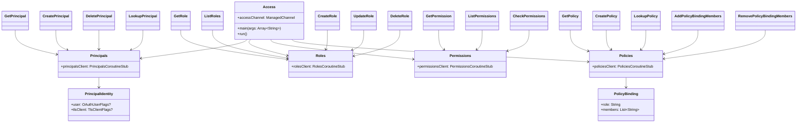

# org.wfanet.measurement.access.deploy.tools

## Overview
Command-line interface tool for interacting with the Cross-Media Access API. Provides administrative operations for managing principals, roles, permissions, and policies through gRPC with mutual TLS authentication. Built using PicoCLI framework with support for OAuth and TLS client authentication.

## Components

### Access
Main CLI entry point with gRPC channel management and TLS configuration.

| Method | Parameters | Returns | Description |
|--------|------------|---------|-------------|
| main | `args: Array<String>` | `Unit` | Entry point for CLI execution |
| run | - | `Unit` | No-op parent command delegating to subcommands |

**Properties:**
- `accessChannel: ManagedChannel` - Lazy-initialized mutual TLS channel with 30-second shutdown timeout

### Principals
Parent command container for principal management operations.

| Method | Parameters | Returns | Description |
|--------|------------|---------|-------------|
| principalsClient | - | `PrincipalsCoroutineStub` | Lazy-initialized gRPC stub for principal operations |

### GetPrincipal
Retrieves a specific principal by resource name.

| Method | Parameters | Returns | Description |
|--------|------------|---------|-------------|
| run | - | `Unit` | Fetches and prints principal details |

### CreatePrincipal
Creates a new principal with OAuth or TLS client identity.

| Method | Parameters | Returns | Description |
|--------|------------|---------|-------------|
| run | - | `Unit` | Creates principal from identity specification |

**Supported Identity Types:**
- OAuth user with issuer/subject
- TLS client with authority key identifier extracted from certificate

### DeletePrincipal
Deletes an existing principal by resource name.

| Method | Parameters | Returns | Description |
|--------|------------|---------|-------------|
| run | - | `Unit` | Removes principal from system |

### LookupPrincipal
Finds a principal by identity lookup key.

| Method | Parameters | Returns | Description |
|--------|------------|---------|-------------|
| run | - | `Unit` | Looks up and prints principal by identity |

### Roles
Parent command container for role management operations.

| Method | Parameters | Returns | Description |
|--------|------------|---------|-------------|
| rolesClient | - | `RolesCoroutineStub` | Lazy-initialized gRPC stub for role operations |

### GetRole
Retrieves a specific role by resource name.

| Method | Parameters | Returns | Description |
|--------|------------|---------|-------------|
| run | - | `Unit` | Fetches and prints role details |

### ListRoles
Lists roles with pagination support.

| Method | Parameters | Returns | Description |
|--------|------------|---------|-------------|
| run | - | `Unit` | Retrieves paginated role list |

**Pagination:**
- Default page size: 1000
- Supports page token for continuation

### CreateRole
Creates a new role with resource types and permissions.

| Method | Parameters | Returns | Description |
|--------|------------|---------|-------------|
| run | - | `Unit` | Creates role with specified permissions |

**Required Parameters:**
- Resource types (multiple allowed)
- Permissions as resource names (multiple allowed)
- Role ID

### UpdateRole
Updates an existing role's resource types and permissions.

| Method | Parameters | Returns | Description |
|--------|------------|---------|-------------|
| run | - | `Unit` | Updates role with optimistic concurrency via etag |

### DeleteRole
Deletes an existing role by resource name.

| Method | Parameters | Returns | Description |
|--------|------------|---------|-------------|
| run | - | `Unit` | Removes role from system |

### Permissions
Parent command container for permission operations.

| Method | Parameters | Returns | Description |
|--------|------------|---------|-------------|
| permissionsClient | - | `PermissionsCoroutineStub` | Lazy-initialized gRPC stub for permission operations |

### GetPermission
Retrieves a specific permission by resource name.

| Method | Parameters | Returns | Description |
|--------|------------|---------|-------------|
| run | - | `Unit` | Fetches and prints permission details |

### ListPermissions
Lists permissions with pagination support.

| Method | Parameters | Returns | Description |
|--------|------------|---------|-------------|
| run | - | `Unit` | Retrieves paginated permission list |

### CheckPermissions
Validates principal permissions on a protected resource.

| Method | Parameters | Returns | Description |
|--------|------------|---------|-------------|
| run | - | `Unit` | Checks if principal has specified permissions |

**Parameters:**
- Protected resource name (optional, defaults to API root)
- Principal resource name
- Permission resource names (multiple allowed)

### Policies
Parent command container for policy management operations.

| Method | Parameters | Returns | Description |
|--------|------------|---------|-------------|
| policiesClient | - | `PoliciesCoroutineStub` | Lazy-initialized gRPC stub for policy operations |

### GetPolicy
Retrieves a specific policy by resource name.

| Method | Parameters | Returns | Description |
|--------|------------|---------|-------------|
| run | - | `Unit` | Fetches and prints policy details |

### CreatePolicy
Creates a new policy with role bindings for a protected resource.

| Method | Parameters | Returns | Description |
|--------|------------|---------|-------------|
| run | - | `Unit` | Creates policy with optional bindings |

**Policy Structure:**
- Protected resource name (optional)
- Multiple role bindings (role + member principals)
- Policy ID (optional)

### LookupPolicy
Finds a policy by protected resource name.

| Method | Parameters | Returns | Description |
|--------|------------|---------|-------------|
| run | - | `Unit` | Looks up policy for specified resource |

### AddPolicyBindingMembers
Adds members to an existing policy binding.

| Method | Parameters | Returns | Description |
|--------|------------|---------|-------------|
| run | - | `Unit` | Adds principals to role binding with etag validation |

### RemovePolicyBindingMembers
Removes members from an existing policy binding.

| Method | Parameters | Returns | Description |
|--------|------------|---------|-------------|
| run | - | `Unit` | Removes principals from role binding with etag validation |

## Data Structures

### PrincipalIdentity
Represents principal identity as either OAuth user or TLS client.

| Property | Type | Description |
|----------|------|-------------|
| user | `OAuthUserFlags?` | OAuth identity with issuer and subject |
| tlsClient | `TlsClientFlags?` | TLS client with certificate file path |

### OAuthUserFlags
OAuth user identity specification.

| Property | Type | Description |
|----------|------|-------------|
| issuer | `String` | OAuth issuer identifier |
| subject | `String` | OAuth subject identifier |

### TlsClientFlags
TLS client identity specification.

| Property | Type | Description |
|----------|------|-------------|
| tlsCertFile | `File` | Path to TLS client certificate |

### PolicyBinding
Maps a role to member principals in a policy.

| Property | Type | Description |
|----------|------|-------------|
| role | `String` | Role resource name |
| members | `List<String>` | Principal resource names |

### PolicyBindingChangeFlags
Parameters for modifying policy bindings.

| Property | Type | Description |
|----------|------|-------------|
| policyName | `String` | Policy resource name |
| policyBindings | `PolicyBinding` | Binding to add/remove |
| currentEtag | `String` | Optimistic concurrency control tag |

## Dependencies
- `org.wfanet.measurement.access.v1alpha` - Access API protobuf definitions and gRPC stubs
- `org.wfanet.measurement.common` - Utility functions for CLI and crypto operations
- `org.wfanet.measurement.common.grpc` - gRPC channel builders with TLS support
- `picocli` - Command-line interface framework
- `io.grpc` - gRPC channel management
- `kotlinx.coroutines` - Asynchronous operations via runBlocking

## Usage Example
```kotlin
// Get a principal by resource name
Access principals get principals/abc123

// Create a principal with OAuth identity
Access principals create \
  --issuer https://accounts.google.com \
  --subject user@example.com \
  --principal-id my-user

// Create a role with permissions
Access roles create \
  --resource-type measurements \
  --permission permissions/measurements.read \
  --permission permissions/measurements.write \
  --role-id data-analyst

// Create a policy with bindings
Access policies create \
  --protected-resource measurements/m1 \
  --binding-role roles/data-analyst \
  --binding-member principals/abc123 \
  --policy-id m1-policy

// Check permissions
Access permissions check \
  --protected-resource measurements/m1 \
  --principal principals/abc123 \
  --permission permissions/measurements.read
```

## Class Diagram

