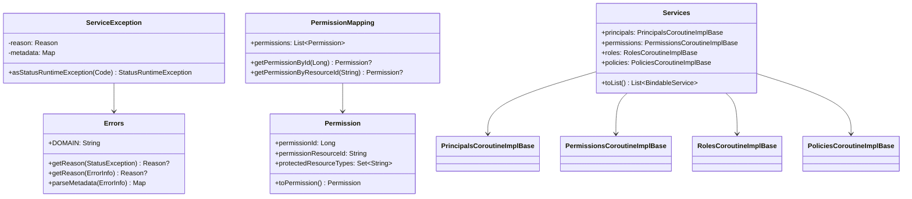

# org.wfanet.measurement.access.service.internal

## Overview
The `org.wfanet.measurement.access.service.internal` package provides internal API service implementations and utilities for the Cross-Media Measurement access control system. It manages principals (users and TLS clients), permissions, roles, and policies through gRPC services, with support for error handling, permission validation, and configuration mapping.

## Components

### Errors

Error handling utilities for the access service internal API.

| Method | Parameters | Returns | Description |
|--------|------------|---------|-------------|
| getReason | `exception: StatusException` | `Reason?` | Extracts error reason from StatusException |
| getReason | `errorInfo: ErrorInfo` | `Reason?` | Extracts error reason from ErrorInfo |
| parseMetadata | `errorInfo: ErrorInfo` | `Map<Metadata, String>` | Parses error metadata into typed map |

**Constants:**
- `DOMAIN` = `"internal.access.halo-cmm.org"` - Error domain identifier

**Enums:**

#### Errors.Reason
Error reason codes for access control operations:
- `PRINCIPAL_NOT_FOUND` - Principal does not exist
- `PRINCIPAL_NOT_FOUND_FOR_USER` - User principal not found
- `PRINCIPAL_NOT_FOUND_FOR_TLS_CLIENT` - TLS client principal not found
- `PRINCIPAL_ALREADY_EXISTS` - Principal creation conflict
- `PRINCIPAL_TYPE_NOT_SUPPORTED` - Unsupported principal type
- `PERMISSION_NOT_FOUND` - Permission does not exist
- `PERMISSION_NOT_FOUND_FOR_ROLE` - Role has no associated permission
- `ROLE_NOT_FOUND` - Role does not exist
- `ROLE_ALREADY_EXISTS` - Role creation conflict
- `POLICY_NOT_FOUND` - Policy does not exist
- `POLICY_NOT_FOUND_FOR_PROTECTED_RESOURCE` - No policy for protected resource
- `POLICY_ALREADY_EXISTS` - Policy creation conflict
- `POLICY_BINDING_MEMBERSHIP_ALREADY_EXISTS` - Principal already bound to role
- `POLICY_BINDING_MEMBERSHIP_NOT_FOUND` - Binding membership does not exist
- `RESOURCE_TYPE_NOT_FOUND_IN_PERMISSION` - Resource type missing from permission
- `REQUIRED_FIELD_NOT_SET` - Mandatory field omitted
- `INVALID_FIELD_VALUE` - Field contains invalid value
- `ETAG_MISMATCH` - Optimistic concurrency control failure

#### Errors.Metadata
Metadata keys for error context:
- `PRINCIPAL_RESOURCE_ID` - Principal identifier
- `PERMISSION_RESOURCE_ID` - Permission identifier
- `ROLE_RESOURCE_ID` - Role identifier
- `POLICY_RESOURCE_ID` - Policy identifier
- `RESOURCE_TYPE` - Protected resource type
- `PROTECTED_RESOURCE_NAME` - Protected resource name
- `PRINCIPAL_TYPE` - Principal type identifier
- `FIELD_NAME` - Field name causing error
- `AUTHORITY_KEY_IDENTIFIER` - X.509 authority key identifier
- `ISSUER` - OAuth issuer
- `SUBJECT` - OAuth subject
- `REQUEST_ETAG` - Client-provided etag
- `ETAG` - Server-computed etag

### ServiceException

Abstract base class for typed service exceptions that convert to gRPC StatusRuntimeException.

| Method | Parameters | Returns | Description |
|--------|------------|---------|-------------|
| asStatusRuntimeException | `code: Status.Code` | `StatusRuntimeException` | Converts to gRPC status exception |

**Subclasses:**
- `PrincipalNotFoundException` - Principal lookup failure
- `PrincipalNotFoundForTlsClientException` - TLS client principal lookup failure
- `PrincipalNotFoundForUserException` - User principal lookup failure
- `PrincipalAlreadyExistsException` - Principal creation conflict
- `PrincipalTypeNotSupportedException` - Unsupported principal type
- `PermissionNotFoundException` - Permission lookup failure
- `PermissionNotFoundForRoleException` - Role permission lookup failure
- `RoleNotFoundException` - Role lookup failure
- `RoleAlreadyExistsException` - Role creation conflict
- `PolicyNotFoundException` - Policy lookup failure
- `PolicyNotFoundForProtectedResourceException` - Protected resource policy lookup failure
- `PolicyAlreadyExistsException` - Policy creation conflict
- `PolicyBindingMembershipAlreadyExistsException` - Duplicate policy binding
- `PolicyBindingMembershipNotFoundException` - Policy binding lookup failure
- `ResourceTypeNotFoundInPermissionException` - Resource type missing from permission
- `RequiredFieldNotSetException` - Missing required field
- `InvalidFieldValueException` - Invalid field value
- `EtagMismatchException` - Etag validation failure

### PermissionMapping

Maps permission resource IDs to internal permission IDs and resource types.

| Method | Parameters | Returns | Description |
|--------|------------|---------|-------------|
| getPermissionById | `permissionId: Long` | `Permission?` | Retrieves permission by numeric ID |
| getPermissionByResourceId | `permissionResourceId: String` | `Permission?` | Retrieves permission by resource ID |

**Properties:**
- `permissions: List<Permission>` - All permissions sorted by resource ID

**Nested Data Class:**

#### PermissionMapping.Permission
| Property | Type | Description |
|----------|------|-------------|
| permissionId | `Long` | FarmHash fingerprint of resource ID |
| permissionResourceId | `String` | Human-readable permission identifier |
| protectedResourceTypes | `Set<String>` | Resource types this permission applies to |

**Extension Functions:**
- `PermissionMapping.Permission.toPermission(): Permission` - Converts to protobuf Permission

### Services

Container for all access control internal API gRPC service implementations.

**Properties:**
| Property | Type | Description |
|----------|------|-------------|
| principals | `PrincipalsGrpcKt.PrincipalsCoroutineImplBase` | Principal management service |
| permissions | `PermissionsGrpcKt.PermissionsCoroutineImplBase` | Permission query service |
| roles | `RolesGrpcKt.RolesCoroutineImplBase` | Role management service |
| policies | `PoliciesGrpcKt.PoliciesCoroutineImplBase` | Policy management service |

| Method | Parameters | Returns | Description |
|--------|------------|---------|-------------|
| toList | - | `List<BindableService>` | Converts services to bindable list |

## Data Structures

### PermissionMapping.Permission
Internal representation of a permission with fingerprinted ID.

| Property | Type | Description |
|----------|------|-------------|
| permissionId | `Long` | 64-bit FarmHash fingerprint |
| permissionResourceId | `String` | Resource ID matching `^[a-zA-Z]([a-zA-Z0-9.-]{0,61}[a-zA-Z0-9])?$` |
| protectedResourceTypes | `Set<String>` | Types of resources protected by permission |

## Dependencies

- `io.grpc` - gRPC service infrastructure and status codes
- `com.google.rpc` - Google RPC error model (ErrorInfo)
- `com.google.protobuf` - Protocol buffer ByteString for binary data
- `com.google.common.hash` - FarmHash for permission ID fingerprinting
- `org.wfanet.measurement.config.access` - Permission configuration schema
- `org.wfanet.measurement.internal.access` - Internal access control protobuf definitions
- `org.wfanet.measurement.common.grpc` - Common gRPC utilities and error handling

## Usage Example

```kotlin
// Initialize permission mapping from configuration
val permissionMapping = PermissionMapping(permissionsConfig)

// Look up permission by resource ID
val permission = permissionMapping.getPermissionByResourceId("books.read")
  ?: throw PermissionNotFoundException("books.read")

// Convert to protobuf
val protobufPermission = permission.toPermission()

// Handle service exceptions
try {
  // Service operation that might fail
} catch (e: Exception) {
  throw PrincipalNotFoundException("principal-123").asStatusRuntimeException(Status.Code.NOT_FOUND)
}

// Create services container
val services = Services(
  principals = principalsService,
  permissions = permissionsService,
  roles = rolesService,
  policies = policiesService
)

// Bind all services to gRPC server
services.toList().forEach { server.addService(it) }

// Extract error information
val exception: StatusException = // ... from gRPC call
val reason = Errors.getReason(exception)
if (reason == Errors.Reason.ETAG_MISMATCH) {
  val metadata = Errors.parseMetadata(exception.errorInfo)
  val requestEtag = metadata[Errors.Metadata.REQUEST_ETAG]
  val actualEtag = metadata[Errors.Metadata.ETAG]
}
```

## Class Diagram


