# org.wfanet.measurement.access.service.internal.testing

## Overview
This package provides abstract test suites for validating internal access service implementations. The test classes define comprehensive behavioral contracts for Permissions, Policies, Principals, and Roles services using JUnit4, enabling consistent testing across different storage backends or service implementations.

## Components

### PermissionsServiceTest
Abstract test suite validating the PermissionsService implementation with comprehensive permission checking and listing capabilities.

| Method | Parameters | Returns | Description |
|--------|------------|---------|-------------|
| initServices | `permissionMapping: PermissionMapping`, `tlsClientMapping: TlsClientPrincipalMapping`, `idGenerator: IdGenerator` | `Services` | Initializes all required services for testing |
| getPermission returns Permission | - | - | Verifies retrieval of existing permission |
| getPermission throws NOT_FOUND when Permission not found | - | - | Validates error handling for missing permissions |
| listPermissions returns Permissions ordered by resource ID | - | - | Ensures permissions list is sorted correctly |
| listPermissions returns Permissions when page size is specified | - | - | Tests pagination with specified page size |
| listPermissions returns next page token when there are more results | - | - | Verifies next page token generation |
| listPermissions returns Permissions after page token | - | - | Tests pagination continuation using page tokens |
| checkPermissions returns all requested permissions for TLS client principal | - | - | Validates TLS client permission checking |
| checkPermissions returns no permissions for TLS client principal with wrong protected resource | - | - | Ensures resource-specific access control |
| checkPermissions returns permissions for user Principal | - | - | Tests user-based permission checking with policies |

### PoliciesServiceTest
Abstract test suite for PoliciesService focusing on policy creation, binding management, and etag-based concurrency control.

| Method | Parameters | Returns | Description |
|--------|------------|---------|-------------|
| initServices | `permissionMapping: PermissionMapping`, `tlsClientMapping: TlsClientPrincipalMapping`, `idGenerator: IdGenerator` | `Services` | Initializes test services including principals and roles |
| createPolicy returns created Policy | - | - | Verifies policy creation with timestamps and etag |
| createPolicy throws INVALID_ARGUMENT if binding has no members | - | - | Validates binding member requirement |
| lookupPolicy returns Policy | - | - | Tests policy lookup by protected resource name |
| addPolicyBindingMembers adds members to Policy binding | - | - | Verifies adding members to role bindings |
| addPolicyBindingMembers throws FAILED_PRECONDITION if binding already has member | - | - | Prevents duplicate binding memberships |
| addPolicyBindingMembers throws ABORTED on etag mismatch | - | - | Ensures optimistic concurrency control |
| removePolicyBindingMembers removes members from Policy binding | - | - | Tests member removal from bindings |
| removePolicyBindingMembers removes all members from Policy binding | - | - | Handles complete binding member removal |
| removePolicyBindingMembers throws FAILED_PRECONDITION if binding does not have member | - | - | Validates member existence before removal |
| removePolicyBindingMembers throws ABORTED on etag mistmatch | - | - | Enforces etag validation on updates |

### PrincipalsServiceTest
Abstract test suite for PrincipalsService covering TLS client principals, user principals, and principal lifecycle management.

| Method | Parameters | Returns | Description |
|--------|------------|---------|-------------|
| initService | `tlsClientMapping: TlsClientPrincipalMapping`, `idGenerator: IdGenerator` | `PrincipalsGrpcKt.PrincipalsCoroutineImplBase` | Initializes the service under test |
| getPrincipal returns TLS client principal | - | - | Retrieves TLS client from mapping |
| createUserPrincipal returns created principal | - | - | Creates OAuth user principal with timestamps |
| createUserPrincipal retries ID generation if ID already in use | - | - | Tests ID collision retry logic |
| createUserPrincipal throws ALREADY_EXISTS if Principal with resource ID already exists | - | - | Prevents duplicate principal resource IDs |
| lookupPrincipal returns TLS client principal | - | - | Looks up TLS client by authority key identifier |
| lookupPrincipal returns user principal | - | - | Looks up user by OAuth issuer and subject |
| deletePrincipal deletes user Principal | - | - | Removes user principal from storage |
| deletePrincipal throws FAILED_PRECONDITION for TLS client Principal | - | - | Prevents deletion of TLS client principals |

### RolesServiceTest
Abstract test suite for RolesService validating role CRUD operations, permission mapping, and resource type validation.

| Method | Parameters | Returns | Description |
|--------|------------|---------|-------------|
| initService | `permissionMapping: PermissionMapping`, `idGenerator: IdGenerator` | `RolesGrpcKt.RolesCoroutineImplBase` | Initializes standalone role service |
| initServices | `permissionMapping: PermissionMapping`, `tlsClientMapping: TlsClientPrincipalMapping`, `idGenerator: IdGenerator` | `Services` | Initializes role service with dependencies |
| getRole throws NOT_FOUND when Role not found | - | - | Validates missing role error handling |
| createRole returns created Role | - | - | Creates role with timestamps and etag |
| createRole throws ALREADY_EXISTS if Role with resource ID already exists | - | - | Prevents duplicate role IDs |
| createRole retries ID generation if ID already in use | - | - | Tests internal ID collision handling |
| createRole throws FAILED_PRECONDITION if resource type not found in Permission | - | - | Validates resource type compatibility |
| updateRole returns updated Role | - | - | Updates role permissions and resource types |
| updateRole throws INVALID_ARGUMENT if etag not set | - | - | Requires etag for updates |
| updateRole throws ABORTED if etag does not match | - | - | Enforces optimistic locking |
| updateRole throws FAILED_PRECONDITION if resource type not found in new Permission | - | - | Validates new permission compatibility |
| updateRole throws FAILED_PRECONDITION if resource type not found in existing Permission | - | - | Ensures all existing permissions remain valid |
| deleteRole deletes Role | - | - | Removes role from storage |
| deleteRole deletes Role when policy exists | - | - | Allows deletion when role is bound to policies |
| deleteRole throws NOT_FOUND when role not found | - | - | Validates deletion of missing role |
| listRoles returns roles ordered by resource ID | - | - | Lists all roles in sorted order |
| listRoles returns roles when page size is specified | - | - | Tests pagination with page size |
| listRoles returns next page token when there are more results | - | - | Generates continuation token |
| listRoles returns results after page token | - | - | Resumes listing from page token |

### TestConfig
Configuration object providing test fixtures and mappings for access service testing.

| Property | Type | Description |
|----------|------|-------------|
| AUTHORITY_KEY_IDENTIFIER | `ByteString` | Sample authority key for TLS client testing |
| TLS_CLIENT_PROTECTED_RESOURCE_NAME | `String` | Protected resource name for TLS client |
| TLS_CLIENT_PRINCIPAL_RESOURCE_ID | `String` | Resource ID for TLS client principal |
| TLS_CLIENT_MAPPING | `TlsClientPrincipalMapping` | Maps authority keys to principal names |
| PERMISSION_MAPPING | `PermissionMapping` | Defines test permissions and resource types |

#### Nested Objects

**PermissionResourceId**
| Constant | Value | Description |
|----------|-------|-------------|
| BOOKS_GET | `"books.get"` | Permission to retrieve books |
| BOOKS_LIST | `"books.list"` | Permission to list books |
| BOOKS_CREATE | `"books.create"` | Permission to create books |
| BOOKS_DELETE | `"books.delete"` | Permission to delete books |

**ResourceType**
| Constant | Value | Description |
|----------|-------|-------------|
| BOOK | `"library.googleapis.com/Book"` | Book resource type |
| SHELF | `"library.googleapis.com/Shelf"` | Shelf resource type |

## Data Structures

### Services (PermissionsServiceTest)
| Property | Type | Description |
|----------|------|-------------|
| service | `PermissionsGrpcKt.PermissionsCoroutineImplBase` | The service under test |
| principalsService | `PrincipalsGrpcKt.PrincipalsCoroutineImplBase` | Dependency for principal management |
| rolesServices | `RolesGrpcKt.RolesCoroutineImplBase` | Dependency for role management |
| policiesService | `PoliciesGrpcKt.PoliciesCoroutineImplBase` | Dependency for policy management |

### Services (PoliciesServiceTest)
| Property | Type | Description |
|----------|------|-------------|
| service | `PoliciesGrpcKt.PoliciesCoroutineImplBase` | The policies service under test |
| principalsService | `PrincipalsGrpcKt.PrincipalsCoroutineImplBase` | Dependency for principal operations |
| rolesServices | `RolesGrpcKt.RolesCoroutineImplBase` | Dependency for role operations |

### Services (RolesServiceTest)
| Property | Type | Description |
|----------|------|-------------|
| service | `RolesGrpcKt.RolesCoroutineImplBase` | The roles service under test |
| principalsService | `PrincipalsGrpcKt.PrincipalsCoroutineImplBase` | Dependency for principal operations |
| policiesServices | `PoliciesGrpcKt.PoliciesCoroutineImplBase` | Dependency for policy operations |

## Dependencies
- `org.wfanet.measurement.access.common` - TLS client principal mapping functionality
- `org.wfanet.measurement.access.service.internal` - Permission mapping and error definitions
- `org.wfanet.measurement.common` - ID generation and utility functions
- `org.wfanet.measurement.internal.access` - Generated gRPC service stubs and messages
- `org.wfanet.measurement.config` - Configuration proto definitions
- `com.google.common.truth` - Assertion library for tests
- `io.grpc` - gRPC framework for service communication
- `org.junit` - JUnit4 testing framework
- `org.mockito.kotlin` - Mocking library for ID generator testing
- `kotlinx.coroutines` - Coroutine support for async operations

## Usage Example
```kotlin
// Implement the abstract test class for a specific storage backend
class SpannerPermissionsServiceTest : PermissionsServiceTest() {
  override fun initServices(
    permissionMapping: PermissionMapping,
    tlsClientMapping: TlsClientPrincipalMapping,
    idGenerator: IdGenerator,
  ): Services {
    val database = createTestDatabase()
    return Services(
      service = SpannerPermissionsService(database, permissionMapping, tlsClientMapping),
      principalsService = SpannerPrincipalsService(database, tlsClientMapping, idGenerator),
      rolesServices = SpannerRolesService(database, permissionMapping, idGenerator),
      policiesService = SpannerPoliciesService(database, idGenerator),
    )
  }
}

// Run the inherited test suite
// JUnit will automatically execute all test methods defined in PermissionsServiceTest
```

## Class Diagram

```mermaid
classDiagram
    class PermissionsServiceTest {
        <<abstract>>
        +initServices(PermissionMapping, TlsClientPrincipalMapping, IdGenerator) Services
        +getPermission returns Permission()
        +listPermissions returns Permissions ordered by resource ID()
        +checkPermissions returns all requested permissions for TLS client principal()
    }

    class PoliciesServiceTest {
        <<abstract>>
        +initServices(PermissionMapping, TlsClientPrincipalMapping, IdGenerator) Services
        +createPolicy returns created Policy()
        +lookupPolicy returns Policy()
        +addPolicyBindingMembers adds members to Policy binding()
        +removePolicyBindingMembers removes members from Policy binding()
    }

    class PrincipalsServiceTest {
        <<abstract>>
        +initService(TlsClientPrincipalMapping, IdGenerator) PrincipalsCoroutineImplBase
        +getPrincipal returns TLS client principal()
        +createUserPrincipal returns created principal()
        +lookupPrincipal returns TLS client principal()
        +deletePrincipal deletes user Principal()
    }

    class RolesServiceTest {
        <<abstract>>
        +initService(PermissionMapping, IdGenerator) RolesCoroutineImplBase
        +initServices(PermissionMapping, TlsClientPrincipalMapping, IdGenerator) Services
        +createRole returns created Role()
        +updateRole returns updated Role()
        +deleteRole deletes Role()
        +listRoles returns roles ordered by resource ID()
    }

    class TestConfig {
        +AUTHORITY_KEY_IDENTIFIER ByteString
        +TLS_CLIENT_PROTECTED_RESOURCE_NAME String
        +TLS_CLIENT_PRINCIPAL_RESOURCE_ID String
        +TLS_CLIENT_MAPPING TlsClientPrincipalMapping
        +PERMISSION_MAPPING PermissionMapping
    }

    PermissionsServiceTest --> TestConfig
    PoliciesServiceTest --> TestConfig
    PrincipalsServiceTest --> TestConfig
    RolesServiceTest --> TestConfig
```

