# org.wfanet.measurement.access.service

## Overview
The access service package provides a complete RBAC (Role-Based Access Control) system for the Cross-Media Measurement platform. It implements a two-tier service architecture with public v1alpha APIs and internal implementation services, managing principals (users and TLS clients), permissions, roles, and policies for resource protection.

## Components

### PrincipalKey
Resource key for principal identification and naming

| Method | Parameters | Returns | Description |
|--------|------------|---------|-------------|
| toName | - | `String` | Converts principal ID to resource name |
| fromName | `resourceName: String` | `PrincipalKey?` | Parses resource name to extract principal |

### PermissionKey
Resource key for permission identification and naming

| Method | Parameters | Returns | Description |
|--------|------------|---------|-------------|
| toName | - | `String` | Converts permission ID to resource name |
| fromName | `resourceName: String` | `PermissionKey?` | Parses resource name to extract permission |

### RoleKey
Resource key for role identification and naming

| Method | Parameters | Returns | Description |
|--------|------------|---------|-------------|
| toName | - | `String` | Converts role ID to resource name |
| fromName | `resourceName: String` | `RoleKey?` | Parses resource name to extract role |

### PolicyKey
Resource key for policy identification and naming

| Method | Parameters | Returns | Description |
|--------|------------|---------|-------------|
| toName | - | `String` | Converts policy ID to resource name |
| fromName | `resourceName: String` | `PolicyKey?` | Parses resource name to extract policy |

### IdVariable
Internal enum defining resource ID variables (PRINCIPAL, PERMISSION, ROLE, POLICY)

## Extensions

| Function | Parameters | Returns | Description |
|----------|------------|---------|-------------|
| assembleName | `idMap: Map<IdVariable, String>` | `String` | Assembles resource name from ID variables |
| parseIdVars | `resourceName: String` | `Map<IdVariable, String>?` | Extracts ID variables from resource name |

## v1alpha Public API Services

### PermissionsService
Public API for managing and checking permissions

| Method | Parameters | Returns | Description |
|--------|------------|---------|-------------|
| getPermission | `request: GetPermissionRequest` | `Permission` | Retrieves single permission by name |
| listPermissions | `request: ListPermissionsRequest` | `ListPermissionsResponse` | Lists permissions with pagination |
| checkPermissions | `request: CheckPermissionsRequest` | `CheckPermissionsResponse` | Verifies principal has permissions on resource |

### PrincipalsService
Public API for managing user and TLS client principals

| Method | Parameters | Returns | Description |
|--------|------------|---------|-------------|
| getPrincipal | `request: GetPrincipalRequest` | `Principal` | Retrieves principal by resource name |
| createPrincipal | `request: CreatePrincipalRequest` | `Principal` | Creates new user principal (TLS not supported) |
| deletePrincipal | `request: DeletePrincipalRequest` | `Empty` | Deletes existing principal |
| lookupPrincipal | `request: LookupPrincipalRequest` | `Principal` | Finds principal by user or TLS client credentials |

### RolesService
Public API for managing roles and their permissions

| Method | Parameters | Returns | Description |
|--------|------------|---------|-------------|
| getRole | `request: GetRoleRequest` | `Role` | Retrieves role by name |
| listRoles | `request: ListRolesRequest` | `ListRolesResponse` | Lists roles with pagination support |
| createRole | `request: CreateRoleRequest` | `Role` | Creates role with permissions and resource types |
| updateRole | `request: UpdateRoleRequest` | `Role` | Updates role permissions (optimistic locking via etag) |
| deleteRole | `request: DeleteRoleRequest` | `Empty` | Removes role from system |

### PoliciesService
Public API for managing access policies and bindings

| Method | Parameters | Returns | Description |
|--------|------------|---------|-------------|
| getPolicy | `request: GetPolicyRequest` | `Policy` | Retrieves policy by name |
| createPolicy | `request: CreatePolicyRequest` | `Policy` | Creates policy with role bindings |
| lookupPolicy | `request: LookupPolicyRequest` | `Policy` | Finds policy by protected resource name |
| addPolicyBindingMembers | `request: AddPolicyBindingMembersRequest` | `Policy` | Adds principals to role binding in policy |
| removePolicyBindingMembers | `request: RemovePolicyBindingMembersRequest` | `Policy` | Removes principals from role binding |

### Services (v1alpha)
Factory for creating all v1alpha service instances

| Method | Parameters | Returns | Description |
|--------|------------|---------|-------------|
| build | `internalApiChannel: Channel, coroutineContext: CoroutineContext` | `Services` | Constructs service instances from internal API channel |
| toList | - | `List<BindableService>` | Converts services to bindable list |

### ResourceConversion
Extension functions for converting between internal and public API representations

| Function | Parameters | Returns | Description |
|----------|------------|---------|-------------|
| toPrincipal | `InternalPrincipal` | `Principal` | Converts internal principal to public API |
| toPermission | `InternalPermission` | `Permission` | Converts internal permission to public API |
| toRole | `InternalRole` | `Role` | Converts internal role to public API |
| toPolicy | `InternalPolicy` | `Policy` | Converts internal policy to public API |
| toInternal | `Principal.OAuthUser` | `InternalPrincipal.OAuthUser` | Converts public user to internal representation |
| toInternal | `Principal.TlsClient` | `InternalPrincipal.TlsClient` | Converts public TLS client to internal |

## Internal API Services

### Services (internal)
Container for internal API service implementations

| Method | Parameters | Returns | Description |
|--------|------------|---------|-------------|
| toList | - | `List<BindableService>` | Converts services to bindable list |

### PermissionMapping
Maps permission resource IDs to fingerprint IDs with protected resource types

| Method | Parameters | Returns | Description |
|--------|------------|---------|-------------|
| getPermissionById | `permissionId: Long` | `Permission?` | Retrieves permission by fingerprint ID |
| getPermissionByResourceId | `permissionResourceId: String` | `Permission?` | Retrieves permission by resource ID |
| toPermission | `PermissionMapping.Permission` | `Permission` | Converts mapping permission to protobuf |

## Error Handling

### Errors
Domain-specific error definitions and metadata for access control

| Enum | Values | Description |
|------|--------|-------------|
| Reason | PRINCIPAL_NOT_FOUND, PERMISSION_NOT_FOUND, ROLE_NOT_FOUND, POLICY_NOT_FOUND, etc. | Error reason codes for access control failures |
| Metadata | PRINCIPAL, PERMISSION, ROLE, POLICY, ETAG, etc. | Error metadata keys for diagnostic information |

### ServiceException
Base exception for access service errors with gRPC status conversion

| Method | Parameters | Returns | Description |
|--------|------------|---------|-------------|
| asStatusRuntimeException | `code: Status.Code` | `StatusRuntimeException` | Converts exception to gRPC status with error info |

### Exception Types

| Exception | Constructor Parameters | Description |
|-----------|----------------------|-------------|
| PrincipalNotFoundException | `name: String` | Principal resource not found |
| PrincipalNotFoundForUserException | `issuer: String, subject: String` | No principal for OAuth user identity |
| PrincipalNotFoundForTlsClientException | `authorityKeyIdentifier: String` | No principal for TLS client certificate |
| PrincipalAlreadyExistsException | - | Duplicate principal creation attempted |
| PrincipalTypeNotSupportedException | `identityCase: Principal.IdentityCase` | Unsupported principal identity type |
| PermissionNotFoundException | `name: String` | Permission resource not found |
| PermissionNotFoundForRoleException | `role: String` | Permission missing from role definition |
| RoleNotFoundException | `name: String` | Role resource not found |
| RoleAlreadyExistsException | `name: String` | Duplicate role creation attempted |
| ResourceTypeNotFoundInPermissionException | `resourceType: String, permission: String` | Resource type not in permission's allowed types |
| PolicyNotFoundException | `name: String` | Policy resource not found |
| PolicyNotFoundForProtectedResourceException | `name: String` | No policy protecting specified resource |
| PolicyAlreadyExistsException | - | Duplicate policy creation attempted |
| PolicyBindingMembershipAlreadyExistsException | `policyName: String, roleName: String, principalName: String` | Principal already member of role in policy |
| PolicyBindingMembershipNotFoundException | `policyName: String, roleName: String, principalName: String` | Principal not member of role in policy |
| EtagMismatchException | `requestEtag: String, etag: String` | Optimistic locking conflict detected |
| RequiredFieldNotSetException | `fieldName: String` | Mandatory field missing from request |
| InvalidFieldValueException | `fieldName: String` | Field contains invalid value |

## Data Structures

### PermissionMapping.Permission
Permission configuration with fingerprint ID and resource types

| Property | Type | Description |
|----------|------|-------------|
| permissionId | `Long` | FarmHash fingerprint of permission resource ID |
| permissionResourceId | `String` | Human-readable permission identifier |
| protectedResourceTypes | `Set<String>` | Resource types this permission applies to |

## Dependencies
- `org.wfanet.measurement.common` - Resource name parsing and API utilities
- `org.wfanet.measurement.common.grpc` - gRPC error handling
- `org.wfanet.measurement.access.v1alpha` - Public API protobuf definitions
- `org.wfanet.measurement.internal.access` - Internal API protobuf definitions
- `org.wfanet.measurement.config.access` - Permission configuration protobuf
- `io.grpc` - gRPC service implementation framework
- `com.google.protobuf` - Protocol buffer runtime
- `com.google.common.hash` - Hashing for permission fingerprints
- `kotlinx.coroutines` - Coroutine-based async operations

## Usage Example
```kotlin
// Build v1alpha services from internal API channel
val internalChannel: Channel = createInternalApiChannel()
val services = org.wfanet.measurement.access.service.v1alpha.Services.build(
    internalApiChannel = internalChannel
)

// Create a principal
val principal = services.principals.createPrincipal(
    createPrincipalRequest {
        principalId = "user-123"
        principal = principal {
            user = oAuthUser {
                issuer = "https://accounts.example.com"
                subject = "user@example.com"
            }
        }
    }
)

// Check permissions
val result = services.permissions.checkPermissions(
    checkPermissionsRequest {
        principal = "principals/user-123"
        protectedResource = "measurements/measurement-456"
        permissions += listOf("permissions/read", "permissions/write")
    }
)
```

## Class Diagram

```mermaid
classDiagram
    class PrincipalKey {
        +principalId: String
        +toName() String
        +fromName(String) PrincipalKey?
    }
    class PermissionKey {
        +permissionId: String
        +toName() String
        +fromName(String) PermissionKey?
    }
    class RoleKey {
        +roleId: String
        +toName() String
        +fromName(String) RoleKey?
    }
    class PolicyKey {
        +policyId: String
        +toName() String
        +fromName(String) PolicyKey?
    }
    class PrincipalsService {
        +getPrincipal(GetPrincipalRequest) Principal
        +createPrincipal(CreatePrincipalRequest) Principal
        +deletePrincipal(DeletePrincipalRequest) Empty
        +lookupPrincipal(LookupPrincipalRequest) Principal
    }
    class PermissionsService {
        +getPermission(GetPermissionRequest) Permission
        +listPermissions(ListPermissionsRequest) ListPermissionsResponse
        +checkPermissions(CheckPermissionsRequest) CheckPermissionsResponse
    }
    class RolesService {
        +getRole(GetRoleRequest) Role
        +listRoles(ListRolesRequest) ListRolesResponse
        +createRole(CreateRoleRequest) Role
        +updateRole(UpdateRoleRequest) Role
        +deleteRole(DeleteRoleRequest) Empty
    }
    class PoliciesService {
        +getPolicy(GetPolicyRequest) Policy
        +createPolicy(CreatePolicyRequest) Policy
        +lookupPolicy(LookupPolicyRequest) Policy
        +addPolicyBindingMembers(AddPolicyBindingMembersRequest) Policy
        +removePolicyBindingMembers(RemovePolicyBindingMembersRequest) Policy
    }
    class ServiceException {
        <<abstract>>
        +asStatusRuntimeException(Status.Code) StatusRuntimeException
    }
    class Errors {
        +DOMAIN: String
        +getReason(StatusException) Reason?
        +parseMetadata(ErrorInfo) Map
    }
    class PermissionMapping {
        +permissions: List~Permission~
        +getPermissionById(Long) Permission?
        +getPermissionByResourceId(String) Permission?
    }

    PrincipalsService --> PrincipalKey
    PermissionsService --> PermissionKey
    RolesService --> RoleKey
    RolesService --> PermissionKey
    PoliciesService --> PolicyKey
    PoliciesService --> RoleKey
    PoliciesService --> PrincipalKey
    PrincipalsService --> ServiceException
    PermissionsService --> ServiceException
    RolesService --> ServiceException
    PoliciesService --> ServiceException
    ServiceException --> Errors
    PermissionsService --> PermissionMapping
```

